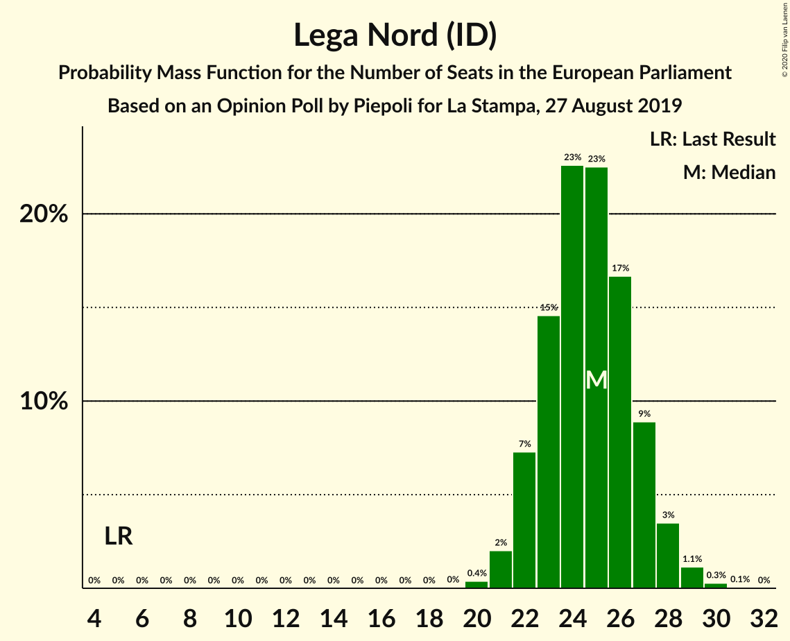
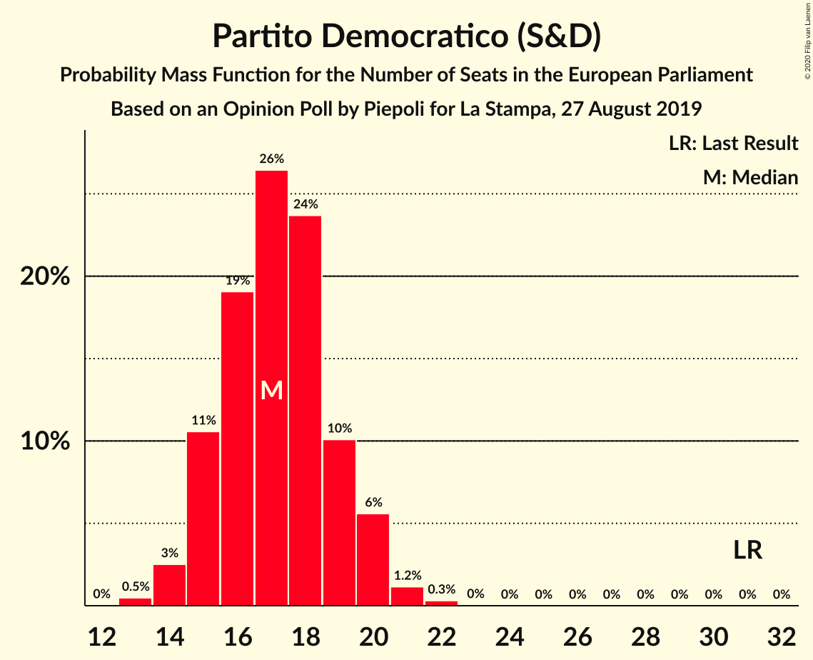
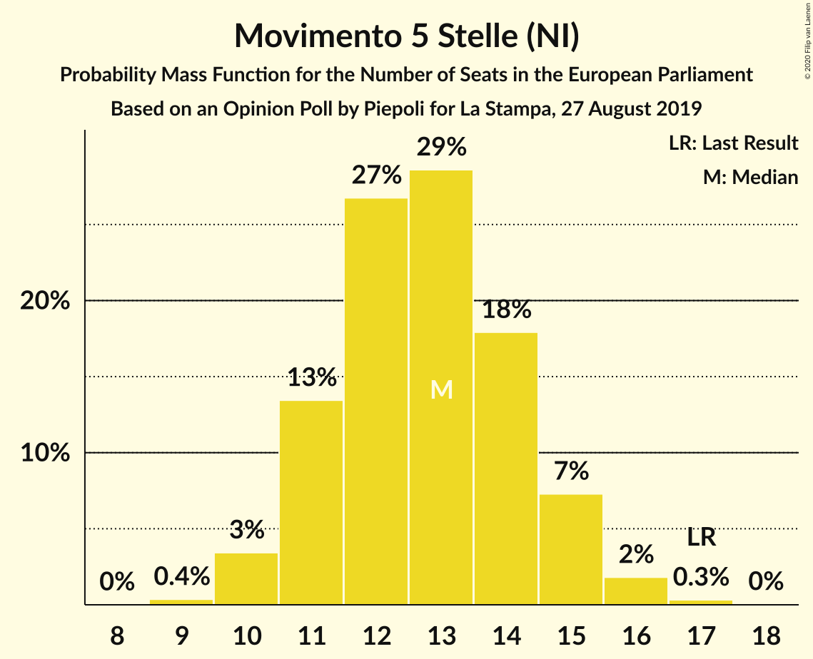

# Opinion Poll by Piepoli for La Stampa, 27 August 2019

<a href="#voting-intentions">Voting Intentions</a> | <a href="#seats">Seats</a> | <a href="#coalitions">Coalitions</a> | <a href="#technical-information">Technical Information</a>

## Voting Intentions

### Confidence Intervals

| Party | Last Result | Poll Result | 80% Confidence Interval | 90% Confidence Interval | 95% Confidence Interval | 99% Confidence Interval |
|:-----:|:-----------:|:-----------:|:-----------------------:|:-----------------------:|:-----------------------:|:-----------------------:|
| Lega Nord (ID) | 6.2% | 32.1% | 29.5–34.8% |28.8–35.6% |28.2–36.3% |26.9–37.6% |
| Partito Democratico (S&D) | 40.8% | 23.6% | 21.3–26.1% |20.6–26.8% |20.1–27.5% |19.0–28.7% |
| Movimento 5 Stelle (NI) | 21.2% | 16.4% | 14.5–18.7% |13.9–19.4% |13.5–19.9% |12.6–21.1% |
| Forza Italia (EPP) | 16.8% | 7.5% | 6.2–9.3% |5.8–9.7% |5.5–10.2% |5.0–11.1% |
| Fratelli d’Italia (ECR) | 3.7% | 5.9% | 4.8–7.5% |4.5–8.0% |4.2–8.4% |3.7–9.2% |
| Più Europa (RE) | 0.0% | 3.6% | 2.7–4.9% |2.5–5.2% |2.3–5.6% |1.9–6.3% |

*Note:* The poll result column reflects the actual value used in the calculations. Published results may vary slightly, and in addition be rounded to fewer digits.

## Seats

### Confidence Intervals

| Party | Last Result | Median | 80% Confidence Interval | 90% Confidence Interval | 95% Confidence Interval | 99% Confidence Interval |
|:-----:|:-----------:|:------:|:-----------------------:|:-----------------------:|:-----------------------:|:-----------------------:|
| <a href="#lega-nord-(id)">Lega Nord (ID)</a> | 5 | 25 | 23–27 |22–27 |22–28 |21–29 |
| <a href="#partito-democratico-(s&d)">Partito Democratico (S&D)</a> | 31 | 17 | 15–19 |15–20 |14–20 |13–21 |
| <a href="#movimento-5-stelle-(ni)">Movimento 5 Stelle (NI)</a> | 17 | 13 | 11–14 |11–15 |10–15 |10–16 |
| <a href="#forza-italia-(epp)">Forza Italia (EPP)</a> | 13 | 6 | 5–7 |5–7 |4–8 |4–9 |
| <a href="#fratelli-d’italia-(ecr)">Fratelli d’Italia (ECR)</a> | 0 | 4 | 4–6 |4–6 |3–6 |0–7 |
| <a href="#più-europa-(re)">Più Europa (RE)</a> | 0 | 0 | 0–4 |0–4 |0–4 |0–5 |

### Lega Nord (ID)

*For a full overview of the results for this party, see the [Lega Nord (ID)](party-leganordid.html) page.*

| Number of Seats | Probability | Accumulated | Special Marks |
|:---------------:|:-----------:|:-----------:|:-------------:|
| 5 | 0% | 100% | Last Result |
| 6 | 0% | 100% |  |
| 7 | 0% | 100% |  |
| 8 | 0% | 100% |  |
| 9 | 0% | 100% |  |
| 10 | 0% | 100% |  |
| 11 | 0% | 100% |  |
| 12 | 0% | 100% |  |
| 13 | 0% | 100% |  |
| 14 | 0% | 100% |  |
| 15 | 0% | 100% |  |
| 16 | 0% | 100% |  |
| 17 | 0% | 100% |  |
| 18 | 0% | 100% |  |
| 19 | 0% | 100% |  |
| 20 | 0.4% | 99.9% |  |
| 21 | 2% | 99.6% |  |
| 22 | 7% | 98% |  |
| 23 | 15% | 90% |  |
| 24 | 23% | 76% |  |
| 25 | 23% | 53% | Median |
| 26 | 17% | 31% |  |
| 27 | 9% | 14% |  |
| 28 | 3% | 5% |  |
| 29 | 1.1% | 1.5% |  |
| 30 | 0.3% | 0.3% |  |
| 31 | 0.1% | 0.1% |  |
| 32 | 0% | 0% |  |

### Partito Democratico (S&D)

*For a full overview of the results for this party, see the [Partito Democratico (S&D)](party-partitodemocraticosd.html) page.*

| Number of Seats | Probability | Accumulated | Special Marks |
|:---------------:|:-----------:|:-----------:|:-------------:|
| 13 | 0.5% | 100% |  |
| 14 | 3% | 99.5% |  |
| 15 | 11% | 97% |  |
| 16 | 19% | 86% |  |
| 17 | 26% | 67% | Median |
| 18 | 24% | 41% |  |
| 19 | 10% | 17% |  |
| 20 | 6% | 7% |  |
| 21 | 1.2% | 2% |  |
| 22 | 0.3% | 0.4% |  |
| 23 | 0% | 0% |  |
| 24 | 0% | 0% |  |
| 25 | 0% | 0% |  |
| 26 | 0% | 0% |  |
| 27 | 0% | 0% |  |
| 28 | 0% | 0% |  |
| 29 | 0% | 0% |  |
| 30 | 0% | 0% |  |
| 31 | 0% | 0% | Last Result |

### Movimento 5 Stelle (NI)

*For a full overview of the results for this party, see the [Movimento 5 Stelle (NI)](party-movimento5stelleni.html) page.*

| Number of Seats | Probability | Accumulated | Special Marks |
|:---------------:|:-----------:|:-----------:|:-------------:|
| 9 | 0.4% | 100% |  |
| 10 | 3% | 99.6% |  |
| 11 | 13% | 96% |  |
| 12 | 27% | 83% |  |
| 13 | 29% | 56% | Median |
| 14 | 18% | 27% |  |
| 15 | 7% | 9% |  |
| 16 | 2% | 2% |  |
| 17 | 0.3% | 0.4% | Last Result |
| 18 | 0% | 0% |  |

### Forza Italia (EPP)

*For a full overview of the results for this party, see the [Forza Italia (EPP)](party-forzaitaliaepp.html) page.*

| Number of Seats | Probability | Accumulated | Special Marks |
|:---------------:|:-----------:|:-----------:|:-------------:|
| 3 | 0.1% | 100% |  |
| 4 | 5% | 99.9% |  |
| 5 | 27% | 95% |  |
| 6 | 42% | 68% | Median |
| 7 | 21% | 26% |  |
| 8 | 4% | 5% |  |
| 9 | 0.5% | 0.5% |  |
| 10 | 0% | 0% |  |
| 11 | 0% | 0% |  |
| 12 | 0% | 0% |  |
| 13 | 0% | 0% | Last Result |

### Fratelli d’Italia (ECR)

*For a full overview of the results for this party, see the [Fratelli d’Italia (ECR)](party-fratellid’italiaecr.html) page.*

| Number of Seats | Probability | Accumulated | Special Marks |
|:---------------:|:-----------:|:-----------:|:-------------:|
| 0 | 2% | 100% | Last Result |
| 1 | 0% | 98% |  |
| 2 | 0% | 98% |  |
| 3 | 1.0% | 98% |  |
| 4 | 49% | 97% | Median |
| 5 | 27% | 48% |  |
| 6 | 19% | 21% |  |
| 7 | 1.1% | 1.2% |  |
| 8 | 0.2% | 0.2% |  |
| 9 | 0% | 0% |  |

### Più Europa (RE)

*For a full overview of the results for this party, see the [Più Europa (RE)](party-piùeuropare.html) page.*

| Number of Seats | Probability | Accumulated | Special Marks |
|:---------------:|:-----------:|:-----------:|:-------------:|
| 0 | 59% | 100% | Last Result, Median |
| 1 | 0% | 41% |  |
| 2 | 0% | 41% |  |
| 3 | 25% | 41% |  |
| 4 | 15% | 16% |  |
| 5 | 1.1% | 1.1% |  |
| 6 | 0% | 0% |  |

## Coalitions

### Confidence Intervals

| Coalition | Last Result | Median | Majority? | 80% Confidence Interval | 90% Confidence Interval | 95% Confidence Interval | 99% Confidence Interval |
|:---------:|:-----------:|:------:|:---------:|:-----------------------:|:-----------------------:|:-----------------------:|:-----------------------:|
| Lega Nord (ID) | 5 | 25 | 0% | 23–27 | 22–27 | 22–28 | 21–29 |

### Lega Nord (ID)

| Number of Seats | Probability | Accumulated | Special Marks |
|:---------------:|:-----------:|:-----------:|:-------------:|
| 5 | 0% | 100% | Last Result |
| 6 | 0% | 100% |  |
| 7 | 0% | 100% |  |
| 8 | 0% | 100% |  |
| 9 | 0% | 100% |  |
| 10 | 0% | 100% |  |
| 11 | 0% | 100% |  |
| 12 | 0% | 100% |  |
| 13 | 0% | 100% |  |
| 14 | 0% | 100% |  |
| 15 | 0% | 100% |  |
| 16 | 0% | 100% |  |
| 17 | 0% | 100% |  |
| 18 | 0% | 100% |  |
| 19 | 0% | 100% |  |
| 20 | 0.4% | 99.9% |  |
| 21 | 2% | 99.6% |  |
| 22 | 7% | 98% |  |
| 23 | 15% | 90% |  |
| 24 | 23% | 76% |  |
| 25 | 23% | 53% | Median |
| 26 | 17% | 31% |  |
| 27 | 9% | 14% |  |
| 28 | 3% | 5% |  |
| 29 | 1.1% | 1.5% |  |
| 30 | 0.3% | 0.3% |  |
| 31 | 0.1% | 0.1% |  |
| 32 | 0% | 0% |  |

## Technical Information

### Opinion Poll

+ **Polling firm:** Piepoli
+ **Commissioner(s):** La Stampa
+ **Fieldwork period:** 27 August 2019

### Calculations

+ **Sample size:** 505
+ **Simulations done:** 1,048,576
+ **Error estimate:** 1.23%

