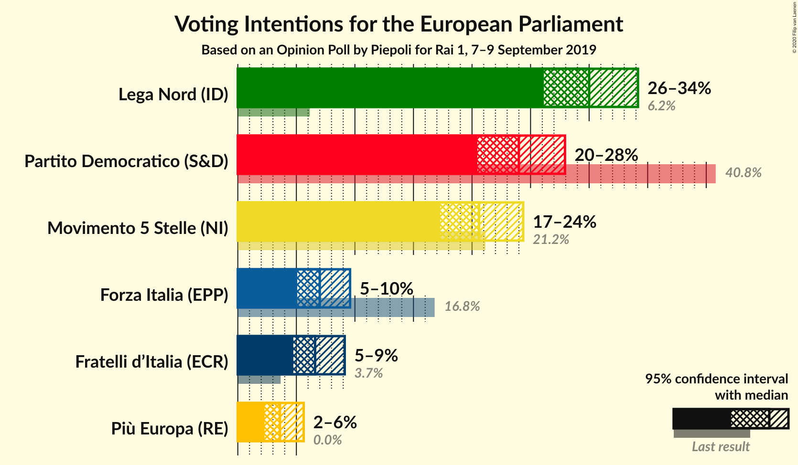
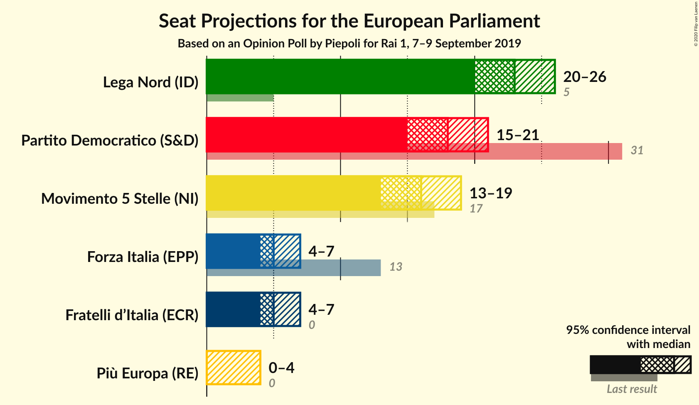
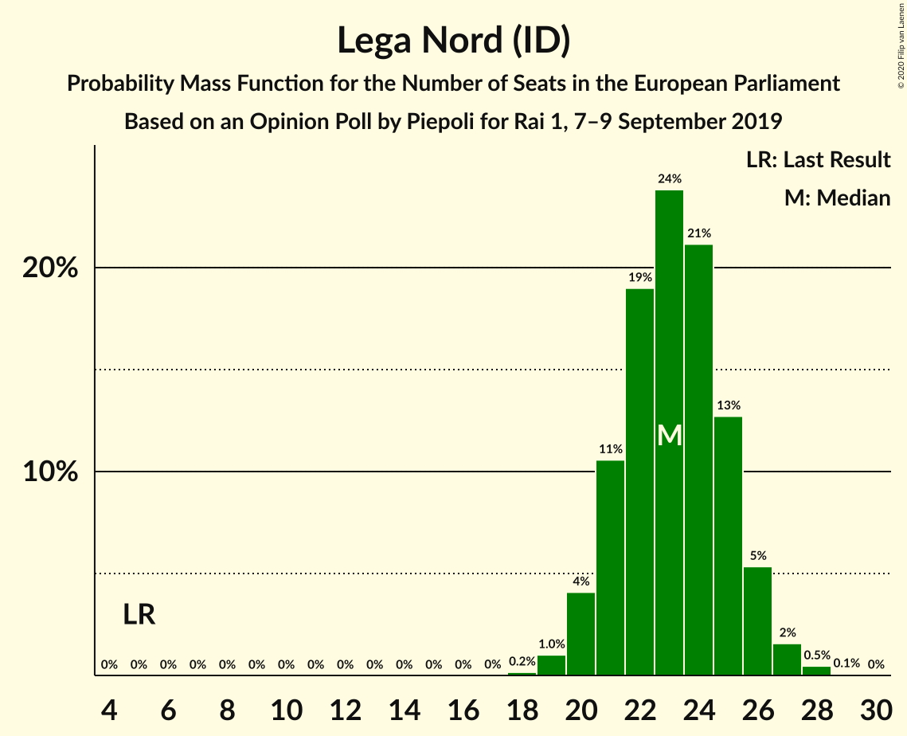
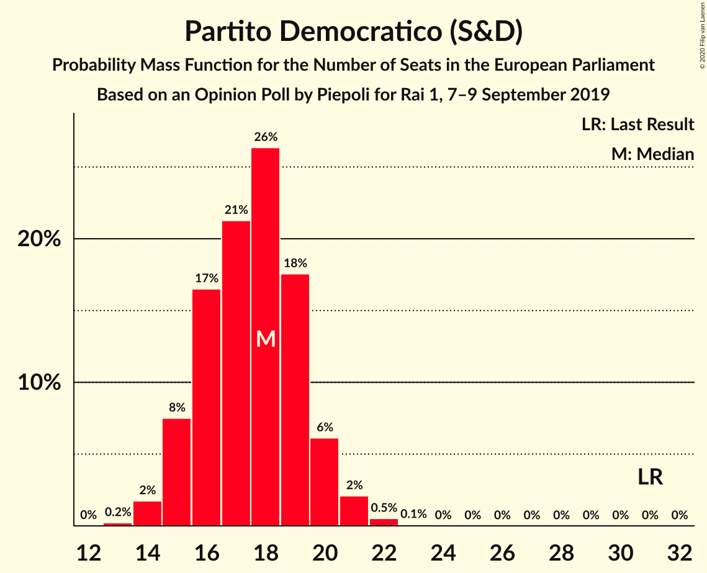
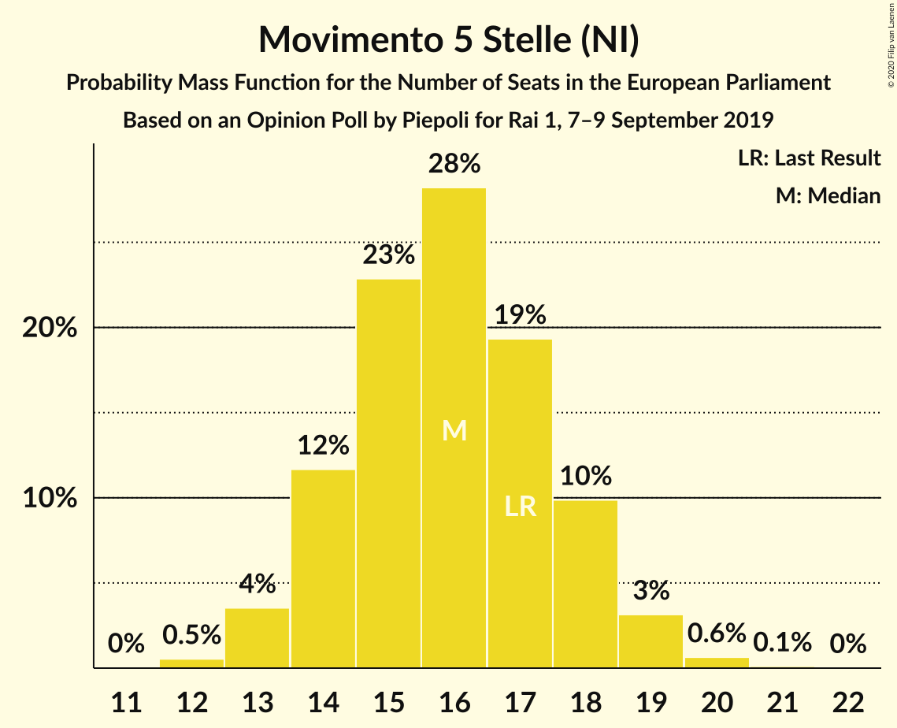
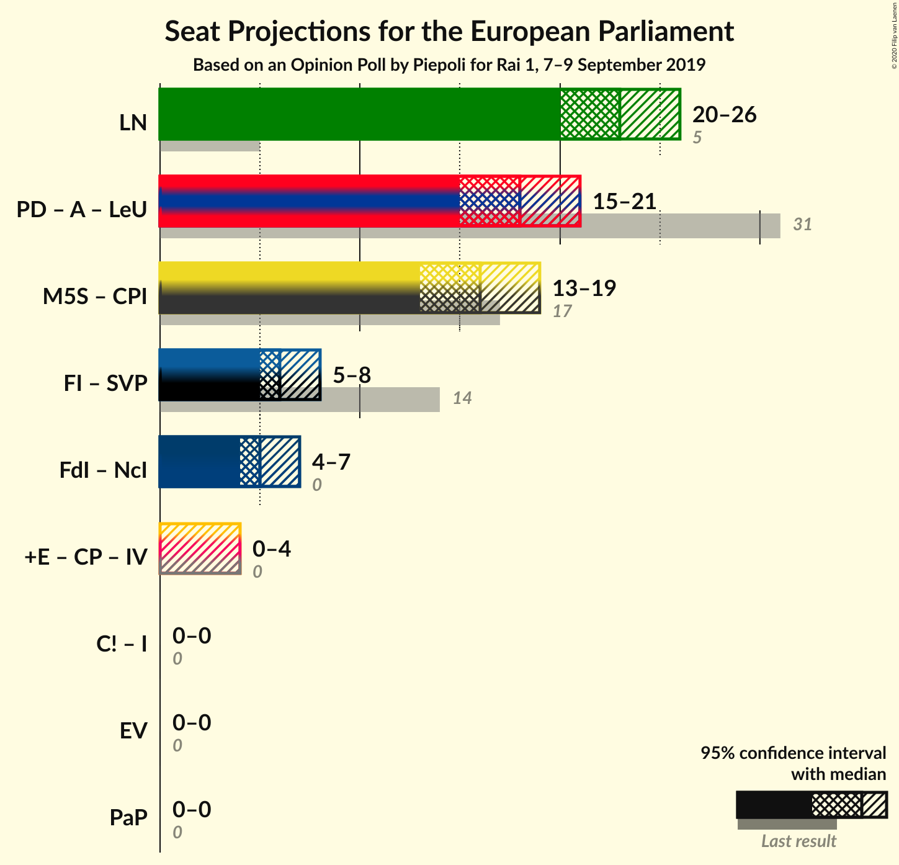
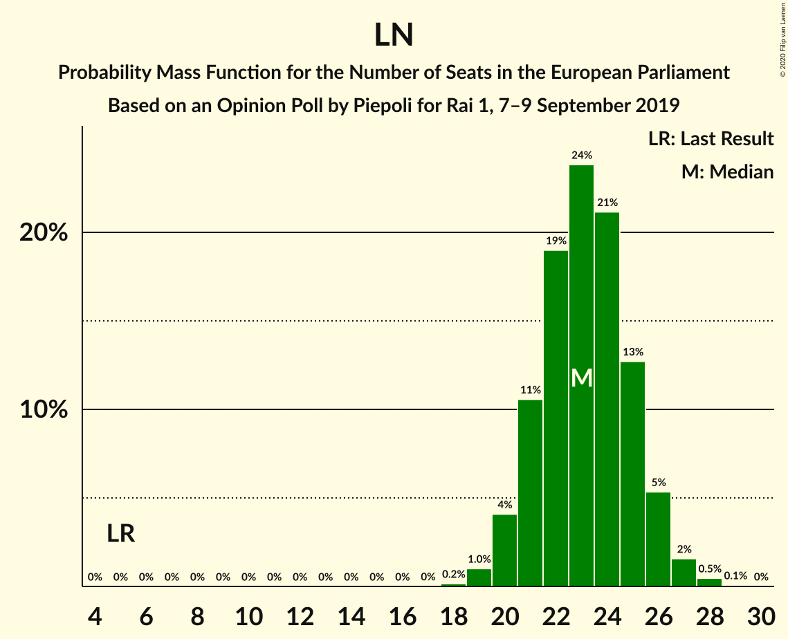

# Opinion Poll by Piepoli for Rai 1, 7–9 September 2019

<a href="#voting-intentions">Voting Intentions</a> | <a href="#seats">Seats</a> | <a href="#coalitions">Coalitions</a> | <a href="#technical-information">Technical Information</a>

## Voting Intentions

### Confidence Intervals

| Party | Last Result | Poll Result | 80% Confidence Interval | 90% Confidence Interval | 95% Confidence Interval | 99% Confidence Interval |
|:-----:|:-----------:|:-----------:|:-----------------------:|:-----------------------:|:-----------------------:|:-----------------------:|
| Lega Nord (ID) | 6.2% | 30.0% | 27.5–32.7% |26.7–33.5% |26.1–34.2% |25.0–35.5% |
| Partito Democratico (S&D) | 40.8% | 24.0% | 21.7–26.6% |21.0–27.3% |20.5–27.9% |19.4–29.2% |
| Movimento 5 Stelle (NI) | 21.2% | 20.6% | 18.4–23.1% |17.8–23.8% |17.3–24.4% |16.3–25.6% |
| Forza Italia (EPP) | 16.8% | 7.0% | 5.7–8.7% |5.4–9.2% |5.1–9.6% |4.5–10.5% |
| Fratelli d’Italia (ECR) | 3.7% | 6.6% | 5.4–8.2% |5.0–8.7% |4.7–9.1% |4.2–10.0% |
| Più Europa (RE) | 0.0% | 3.6% | 2.7–4.9% |2.5–5.3% |2.3–5.6% |1.9–6.3% |

*Note:* The poll result column reflects the actual value used in the calculations. Published results may vary slightly, and in addition be rounded to fewer digits.

## Seats

### Confidence Intervals

| Party | Last Result | Median | 80% Confidence Interval | 90% Confidence Interval | 95% Confidence Interval | 99% Confidence Interval |
|:-----:|:-----------:|:------:|:-----------------------:|:-----------------------:|:-----------------------:|:-----------------------:|
| <a href="#lega-nord-(id)">Lega Nord (ID)</a> | 5 | 23 | 21–25 |20–26 |20–26 |19–28 |
| <a href="#partito-democratico-(s&d)">Partito Democratico (S&D)</a> | 31 | 18 | 16–19 |15–20 |15–21 |14–22 |
| <a href="#movimento-5-stelle-(ni)">Movimento 5 Stelle (NI)</a> | 17 | 16 | 14–18 |14–18 |13–19 |12–20 |
| <a href="#forza-italia-(epp)">Forza Italia (EPP)</a> | 13 | 5 | 4–7 |4–7 |4–7 |3–8 |
| <a href="#fratelli-d’italia-(ecr)">Fratelli d’Italia (ECR)</a> | 0 | 5 | 4–6 |4–7 |4–7 |3–8 |
| <a href="#più-europa-(re)">Più Europa (RE)</a> | 0 | 0 | 0–4 |0–4 |0–4 |0–5 |

### Lega Nord (ID)

*For a full overview of the results for this party, see the [Lega Nord (ID)](party-leganordid.html) page.*

| Number of Seats | Probability | Accumulated | Special Marks |
|:---------------:|:-----------:|:-----------:|:-------------:|
| 5 | 0% | 100% | Last Result |
| 6 | 0% | 100% |  |
| 7 | 0% | 100% |  |
| 8 | 0% | 100% |  |
| 9 | 0% | 100% |  |
| 10 | 0% | 100% |  |
| 11 | 0% | 100% |  |
| 12 | 0% | 100% |  |
| 13 | 0% | 100% |  |
| 14 | 0% | 100% |  |
| 15 | 0% | 100% |  |
| 16 | 0% | 100% |  |
| 17 | 0% | 100% |  |
| 18 | 0.2% | 100% |  |
| 19 | 1.0% | 99.8% |  |
| 20 | 4% | 98.8% |  |
| 21 | 11% | 95% |  |
| 22 | 19% | 84% |  |
| 23 | 24% | 65% | Median |
| 24 | 21% | 41% |  |
| 25 | 13% | 20% |  |
| 26 | 5% | 7% |  |
| 27 | 2% | 2% |  |
| 28 | 0.5% | 0.6% |  |
| 29 | 0.1% | 0.1% |  |
| 30 | 0% | 0% |  |

### Partito Democratico (S&D)

*For a full overview of the results for this party, see the [Partito Democratico (S&D)](party-partitodemocraticosd.html) page.*

| Number of Seats | Probability | Accumulated | Special Marks |
|:---------------:|:-----------:|:-----------:|:-------------:|
| 13 | 0.2% | 100% |  |
| 14 | 2% | 99.8% |  |
| 15 | 8% | 98% |  |
| 16 | 17% | 91% |  |
| 17 | 21% | 74% |  |
| 18 | 26% | 53% | Median |
| 19 | 18% | 26% |  |
| 20 | 6% | 9% |  |
| 21 | 2% | 3% |  |
| 22 | 0.5% | 0.6% |  |
| 23 | 0.1% | 0.1% |  |
| 24 | 0% | 0% |  |
| 25 | 0% | 0% |  |
| 26 | 0% | 0% |  |
| 27 | 0% | 0% |  |
| 28 | 0% | 0% |  |
| 29 | 0% | 0% |  |
| 30 | 0% | 0% |  |
| 31 | 0% | 0% | Last Result |

### Movimento 5 Stelle (NI)

*For a full overview of the results for this party, see the [Movimento 5 Stelle (NI)](party-movimento5stelleni.html) page.*

| Number of Seats | Probability | Accumulated | Special Marks |
|:---------------:|:-----------:|:-----------:|:-------------:|
| 12 | 0.5% | 100% |  |
| 13 | 4% | 99.4% |  |
| 14 | 12% | 96% |  |
| 15 | 23% | 84% |  |
| 16 | 28% | 61% | Median |
| 17 | 19% | 33% | Last Result |
| 18 | 10% | 14% |  |
| 19 | 3% | 4% |  |
| 20 | 0.6% | 0.8% |  |
| 21 | 0.1% | 0.1% |  |
| 22 | 0% | 0% |  |

### Forza Italia (EPP)

*For a full overview of the results for this party, see the [Forza Italia (EPP)](party-forzaitaliaepp.html) page.*

| Number of Seats | Probability | Accumulated | Special Marks |
|:---------------:|:-----------:|:-----------:|:-------------:|
| 0 | 0.1% | 100% |  |
| 1 | 0% | 99.9% |  |
| 2 | 0% | 99.9% |  |
| 3 | 0.5% | 99.9% |  |
| 4 | 11% | 99.4% |  |
| 5 | 39% | 88% | Median |
| 6 | 35% | 49% |  |
| 7 | 11% | 13% |  |
| 8 | 2% | 2% |  |
| 9 | 0.2% | 0.2% |  |
| 10 | 0% | 0% |  |
| 11 | 0% | 0% |  |
| 12 | 0% | 0% |  |
| 13 | 0% | 0% | Last Result |

### Fratelli d’Italia (ECR)

*For a full overview of the results for this party, see the [Fratelli d’Italia (ECR)](party-fratellid’italiaecr.html) page.*

| Number of Seats | Probability | Accumulated | Special Marks |
|:---------------:|:-----------:|:-----------:|:-------------:|
| 0 | 0.3% | 100% | Last Result |
| 1 | 0% | 99.7% |  |
| 2 | 0% | 99.7% |  |
| 3 | 1.3% | 99.7% |  |
| 4 | 19% | 98% |  |
| 5 | 45% | 80% | Median |
| 6 | 28% | 35% |  |
| 7 | 6% | 7% |  |
| 8 | 0.9% | 0.9% |  |
| 9 | 0% | 0% |  |

### Più Europa (RE)

*For a full overview of the results for this party, see the [Più Europa (RE)](party-piùeuropare.html) page.*

| Number of Seats | Probability | Accumulated | Special Marks |
|:---------------:|:-----------:|:-----------:|:-------------:|
| 0 | 65% | 100% | Last Result, Median |
| 1 | 0% | 35% |  |
| 2 | 0% | 35% |  |
| 3 | 20% | 35% |  |
| 4 | 14% | 15% |  |
| 5 | 1.1% | 1.2% |  |
| 6 | 0% | 0% |  |

## Coalitions

### Confidence Intervals

| Coalition | Last Result | Median | Majority? | 80% Confidence Interval | 90% Confidence Interval | 95% Confidence Interval | 99% Confidence Interval |
|:---------:|:-----------:|:------:|:---------:|:-----------------------:|:-----------------------:|:-----------------------:|:-----------------------:|
| Lega Nord (ID) | 5 | 23 | 0% | 21–25 | 20–26 | 20–26 | 19–28 |

### Lega Nord (ID)

| Number of Seats | Probability | Accumulated | Special Marks |
|:---------------:|:-----------:|:-----------:|:-------------:|
| 5 | 0% | 100% | Last Result |
| 6 | 0% | 100% |  |
| 7 | 0% | 100% |  |
| 8 | 0% | 100% |  |
| 9 | 0% | 100% |  |
| 10 | 0% | 100% |  |
| 11 | 0% | 100% |  |
| 12 | 0% | 100% |  |
| 13 | 0% | 100% |  |
| 14 | 0% | 100% |  |
| 15 | 0% | 100% |  |
| 16 | 0% | 100% |  |
| 17 | 0% | 100% |  |
| 18 | 0.2% | 100% |  |
| 19 | 1.0% | 99.8% |  |
| 20 | 4% | 98.8% |  |
| 21 | 11% | 95% |  |
| 22 | 19% | 84% |  |
| 23 | 24% | 65% | Median |
| 24 | 21% | 41% |  |
| 25 | 13% | 20% |  |
| 26 | 5% | 7% |  |
| 27 | 2% | 2% |  |
| 28 | 0.5% | 0.6% |  |
| 29 | 0.1% | 0.1% |  |
| 30 | 0% | 0% |  |

## Technical Information

### Opinion Poll

+ **Polling firm:** Piepoli
+ **Commissioner(s):** Rai 1
+ **Fieldwork period:** 7–9 September 2019

### Calculations

+ **Sample size:** 500
+ **Simulations done:** 1,048,576
+ **Error estimate:** 0.64%

