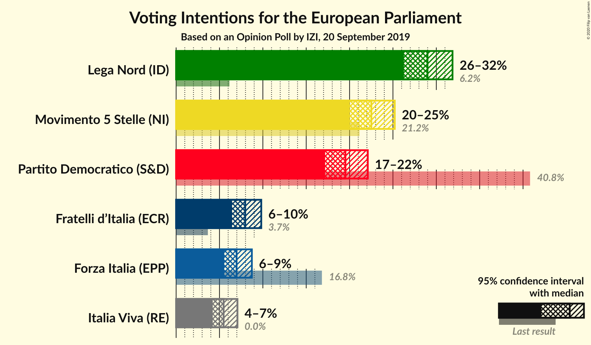
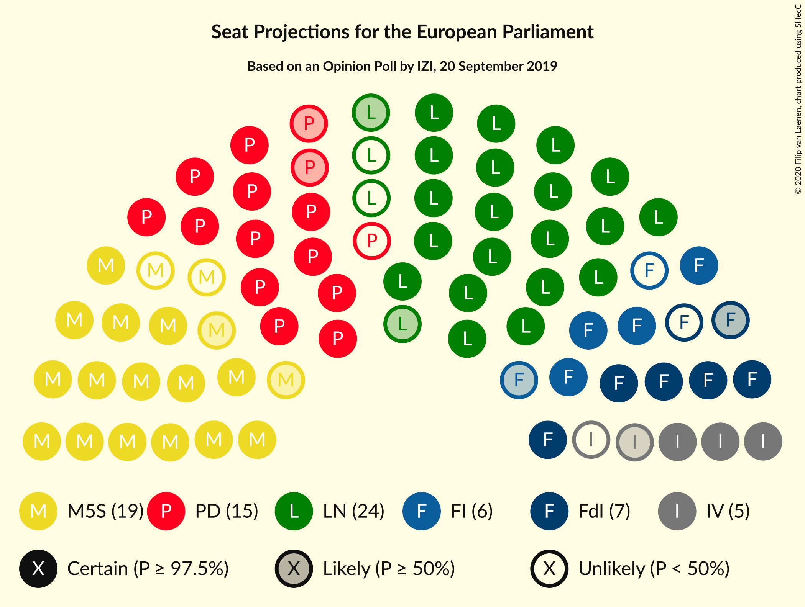
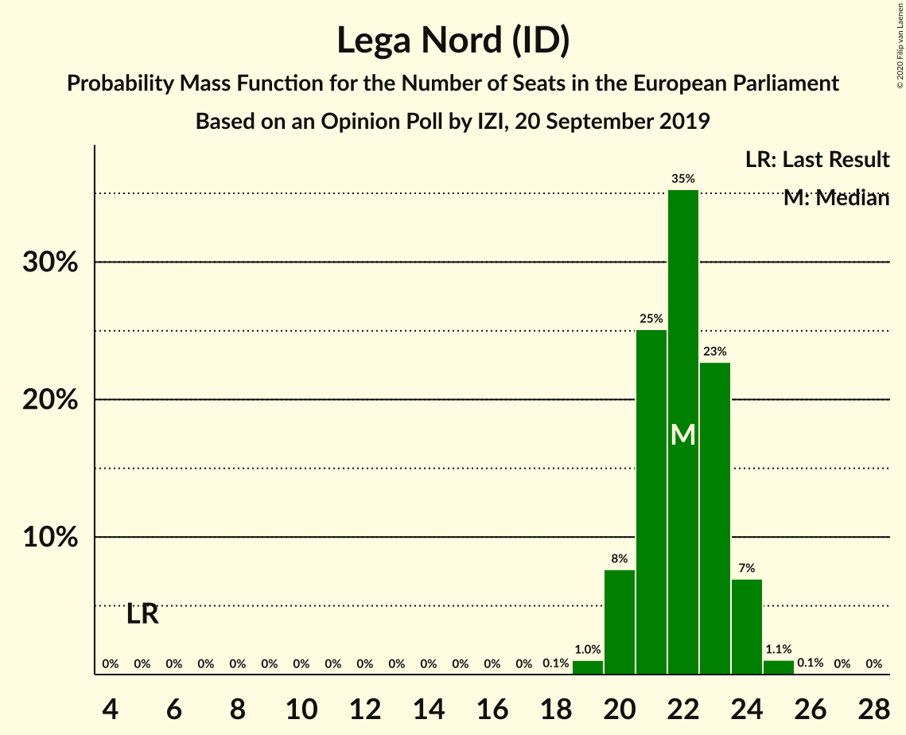
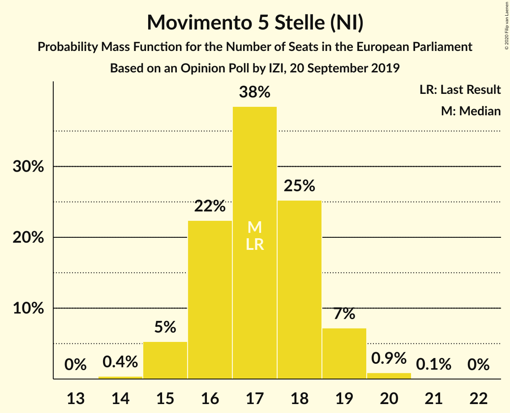
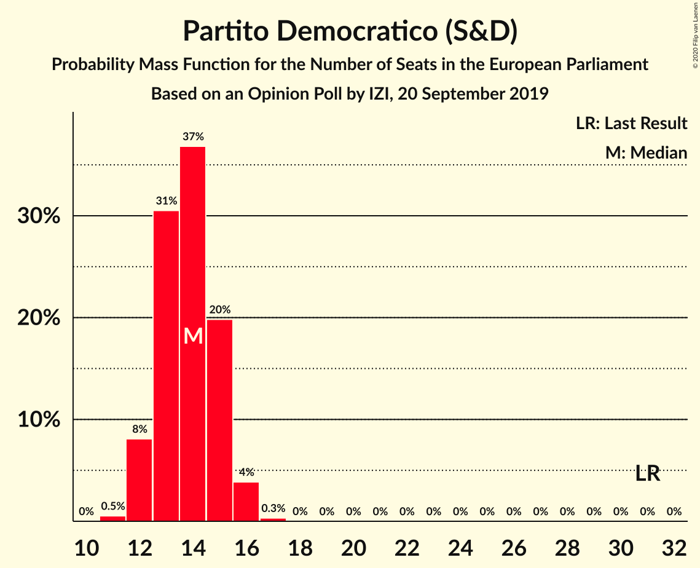
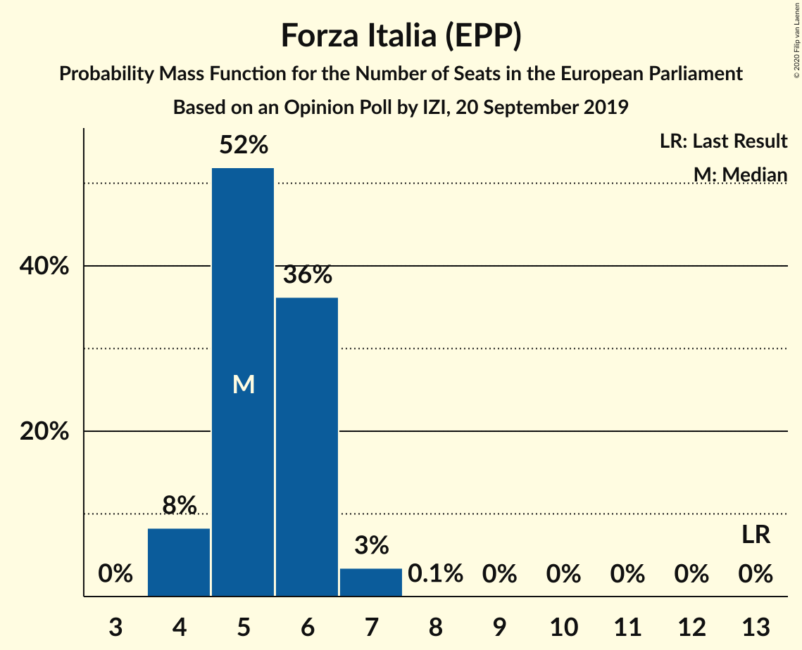
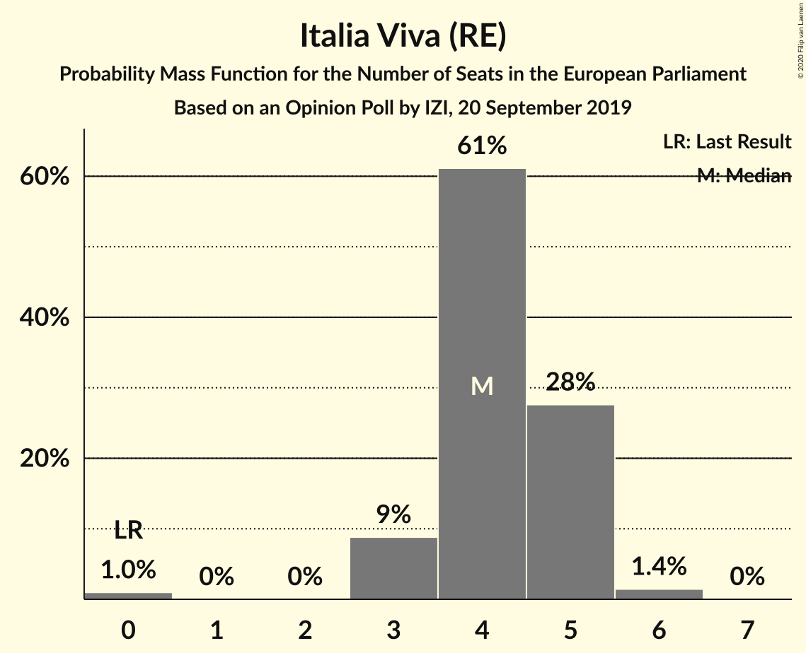
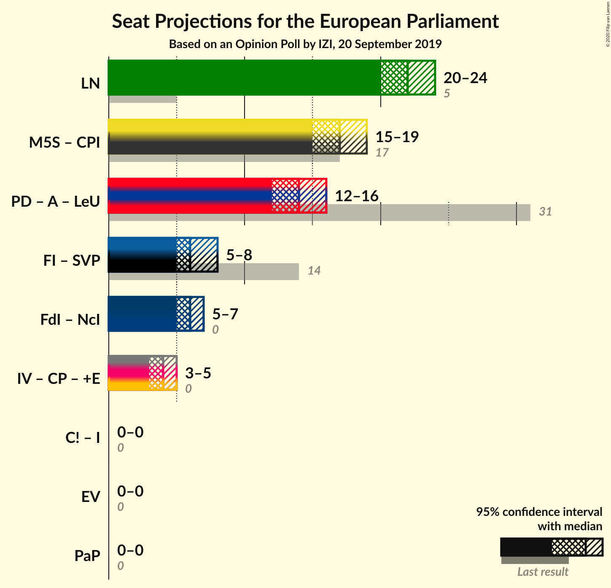
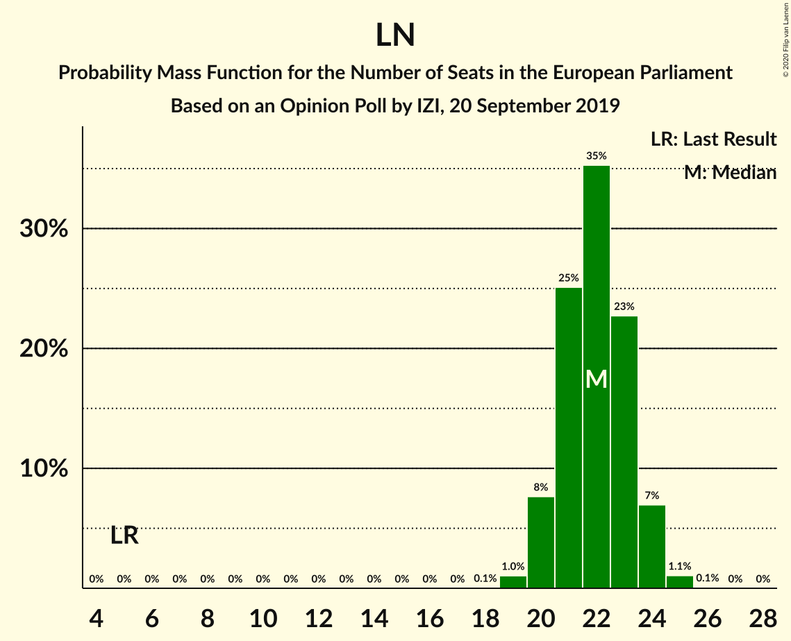

# Opinion Poll by IZI, 20 September 2019

<a href="#voting-intentions">Voting Intentions</a> | <a href="#seats">Seats</a> | <a href="#coalitions">Coalitions</a> | <a href="#technical-information">Technical Information</a>

## Voting Intentions

### Confidence Intervals

| Party | Last Result | Poll Result | 80% Confidence Interval | 90% Confidence Interval | 95% Confidence Interval | 99% Confidence Interval |
|:-----:|:-----------:|:-----------:|:-----------------------:|:-----------------------:|:-----------------------:|:-----------------------:|
| Lega Nord (ID) | 6.2% | 29.0% | 27.2–30.9% |26.7–31.4% |26.3–31.9% |25.4–32.8% |
| Movimento 5 Stelle (NI) | 21.2% | 22.5% | 20.9–24.3% |20.4–24.8% |20.0–25.2% |19.3–26.1% |
| Partito Democratico (S&D) | 40.8% | 19.5% | 18.0–21.2% |17.6–21.7% |17.2–22.1% |16.5–22.9% |
| Fratelli d’Italia (ECR) | 3.7% | 8.0% | 7.0–9.2% |6.7–9.5% |6.4–9.8% |6.0–10.4% |
| Forza Italia (EPP) | 16.8% | 7.0% | 6.0–8.1% |5.8–8.4% |5.5–8.7% |5.1–9.3% |
| Italia Viva (RE) | 0.0% | 5.5% | 4.6–6.5% |4.4–6.8% |4.2–7.1% |3.9–7.6% |

*Note:* The poll result column reflects the actual value used in the calculations. Published results may vary slightly, and in addition be rounded to fewer digits.

## Seats

### Confidence Intervals

| Party | Last Result | Median | 80% Confidence Interval | 90% Confidence Interval | 95% Confidence Interval | 99% Confidence Interval |
|:-----:|:-----------:|:------:|:-----------------------:|:-----------------------:|:-----------------------:|:-----------------------:|
| <a href="#lega-nord-(id)">Lega Nord (ID)</a> | 5 | 21 | 20–22 |19–23 |19–23 |19–24 |
| <a href="#movimento-5-stelle-(ni)">Movimento 5 Stelle (NI)</a> | 17 | 16 | 15–18 |15–18 |15–18 |14–19 |
| <a href="#partito-democratico-(s&d)">Partito Democratico (S&D)</a> | 31 | 13 | 12–15 |12–15 |12–15 |11–16 |
| <a href="#fratelli-d’italia-(ecr)">Fratelli d’Italia (ECR)</a> | 0 | 6 | 5–7 |5–7 |5–7 |4–7 |
| <a href="#forza-italia-(epp)">Forza Italia (EPP)</a> | 13 | 5 | 4–6 |4–6 |4–6 |4–7 |
| <a href="#italia-viva-(re)">Italia Viva (RE)</a> | 0 | 4 | 3–5 |3–5 |3–5 |0–6 |

### Lega Nord (ID)

*For a full overview of the results for this party, see the [Lega Nord (ID)](party-leganordid.html) page.*

| Number of Seats | Probability | Accumulated | Special Marks |
|:---------------:|:-----------:|:-----------:|:-------------:|
| 5 | 0% | 100% | Last Result |
| 6 | 0% | 100% |  |
| 7 | 0% | 100% |  |
| 8 | 0% | 100% |  |
| 9 | 0% | 100% |  |
| 10 | 0% | 100% |  |
| 11 | 0% | 100% |  |
| 12 | 0% | 100% |  |
| 13 | 0% | 100% |  |
| 14 | 0% | 100% |  |
| 15 | 0% | 100% |  |
| 16 | 0% | 100% |  |
| 17 | 0% | 100% |  |
| 18 | 0.5% | 100% |  |
| 19 | 5% | 99.5% |  |
| 20 | 24% | 94% |  |
| 21 | 37% | 70% | Median |
| 22 | 24% | 33% |  |
| 23 | 8% | 9% |  |
| 24 | 0.9% | 0.9% |  |
| 25 | 0.1% | 0.1% |  |
| 26 | 0% | 0% |  |

### Movimento 5 Stelle (NI)

*For a full overview of the results for this party, see the [Movimento 5 Stelle (NI)](party-movimento5stelleni.html) page.*

| Number of Seats | Probability | Accumulated | Special Marks |
|:---------------:|:-----------:|:-----------:|:-------------:|
| 13 | 0.1% | 100% |  |
| 14 | 2% | 99.9% |  |
| 15 | 13% | 98% |  |
| 16 | 38% | 85% | Median |
| 17 | 33% | 46% | Last Result |
| 18 | 12% | 13% |  |
| 19 | 2% | 2% |  |
| 20 | 0.1% | 0.1% |  |
| 21 | 0% | 0% |  |

### Partito Democratico (S&D)

*For a full overview of the results for this party, see the [Partito Democratico (S&D)](party-partitodemocraticosd.html) page.*

| Number of Seats | Probability | Accumulated | Special Marks |
|:---------------:|:-----------:|:-----------:|:-------------:|
| 10 | 0.1% | 100% |  |
| 11 | 2% | 99.9% |  |
| 12 | 23% | 98% |  |
| 13 | 45% | 75% | Median |
| 14 | 18% | 30% |  |
| 15 | 11% | 12% |  |
| 16 | 0.9% | 1.0% |  |
| 17 | 0% | 0% |  |
| 18 | 0% | 0% |  |
| 19 | 0% | 0% |  |
| 20 | 0% | 0% |  |
| 21 | 0% | 0% |  |
| 22 | 0% | 0% |  |
| 23 | 0% | 0% |  |
| 24 | 0% | 0% |  |
| 25 | 0% | 0% |  |
| 26 | 0% | 0% |  |
| 27 | 0% | 0% |  |
| 28 | 0% | 0% |  |
| 29 | 0% | 0% |  |
| 30 | 0% | 0% |  |
| 31 | 0% | 0% | Last Result |

### Fratelli d’Italia (ECR)

*For a full overview of the results for this party, see the [Fratelli d’Italia (ECR)](party-fratellid’italiaecr.html) page.*

| Number of Seats | Probability | Accumulated | Special Marks |
|:---------------:|:-----------:|:-----------:|:-------------:|
| 0 | 0% | 100% | Last Result |
| 1 | 0% | 100% |  |
| 2 | 0% | 100% |  |
| 3 | 0% | 100% |  |
| 4 | 1.1% | 100% |  |
| 5 | 29% | 98.9% |  |
| 6 | 57% | 70% | Median |
| 7 | 13% | 13% |  |
| 8 | 0.4% | 0.5% |  |
| 9 | 0% | 0% |  |

### Forza Italia (EPP)

*For a full overview of the results for this party, see the [Forza Italia (EPP)](party-forzaitaliaepp.html) page.*

| Number of Seats | Probability | Accumulated | Special Marks |
|:---------------:|:-----------:|:-----------:|:-------------:|
| 3 | 0.2% | 100% |  |
| 4 | 14% | 99.8% |  |
| 5 | 54% | 86% | Median |
| 6 | 30% | 32% |  |
| 7 | 2% | 2% |  |
| 8 | 0% | 0% |  |
| 9 | 0% | 0% |  |
| 10 | 0% | 0% |  |
| 11 | 0% | 0% |  |
| 12 | 0% | 0% |  |
| 13 | 0% | 0% | Last Result |

### Italia Viva (RE)

*For a full overview of the results for this party, see the [Italia Viva (RE)](party-italiavivare.html) page.*

| Number of Seats | Probability | Accumulated | Special Marks |
|:---------------:|:-----------:|:-----------:|:-------------:|
| 0 | 1.0% | 100% | Last Result |
| 1 | 0% | 99.0% |  |
| 2 | 0% | 99.0% |  |
| 3 | 14% | 99.0% |  |
| 4 | 67% | 85% | Median |
| 5 | 18% | 19% |  |
| 6 | 0.6% | 0.6% |  |
| 7 | 0% | 0% |  |

## Coalitions

### Confidence Intervals

| Coalition | Last Result | Median | Majority? | 80% Confidence Interval | 90% Confidence Interval | 95% Confidence Interval | 99% Confidence Interval |
|:---------:|:-----------:|:------:|:---------:|:-----------------------:|:-----------------------:|:-----------------------:|:-----------------------:|
| Lega Nord (ID) | 5 | 21 | 0% | 20–22 | 19–23 | 19–23 | 19–24 |

### Lega Nord (ID)

| Number of Seats | Probability | Accumulated | Special Marks |
|:---------------:|:-----------:|:-----------:|:-------------:|
| 5 | 0% | 100% | Last Result |
| 6 | 0% | 100% |  |
| 7 | 0% | 100% |  |
| 8 | 0% | 100% |  |
| 9 | 0% | 100% |  |
| 10 | 0% | 100% |  |
| 11 | 0% | 100% |  |
| 12 | 0% | 100% |  |
| 13 | 0% | 100% |  |
| 14 | 0% | 100% |  |
| 15 | 0% | 100% |  |
| 16 | 0% | 100% |  |
| 17 | 0% | 100% |  |
| 18 | 0.5% | 100% |  |
| 19 | 5% | 99.5% |  |
| 20 | 24% | 94% |  |
| 21 | 37% | 70% | Median |
| 22 | 24% | 33% |  |
| 23 | 8% | 9% |  |
| 24 | 0.9% | 0.9% |  |
| 25 | 0.1% | 0.1% |  |
| 26 | 0% | 0% |  |

## Technical Information

### Opinion Poll

+ **Polling firm:** IZI
+ **Commissioner(s):** —
+ **Fieldwork period:** 20 September 2019

### Calculations

+ **Sample size:** 1004
+ **Simulations done:** 131,072
+ **Error estimate:** 1.62%

