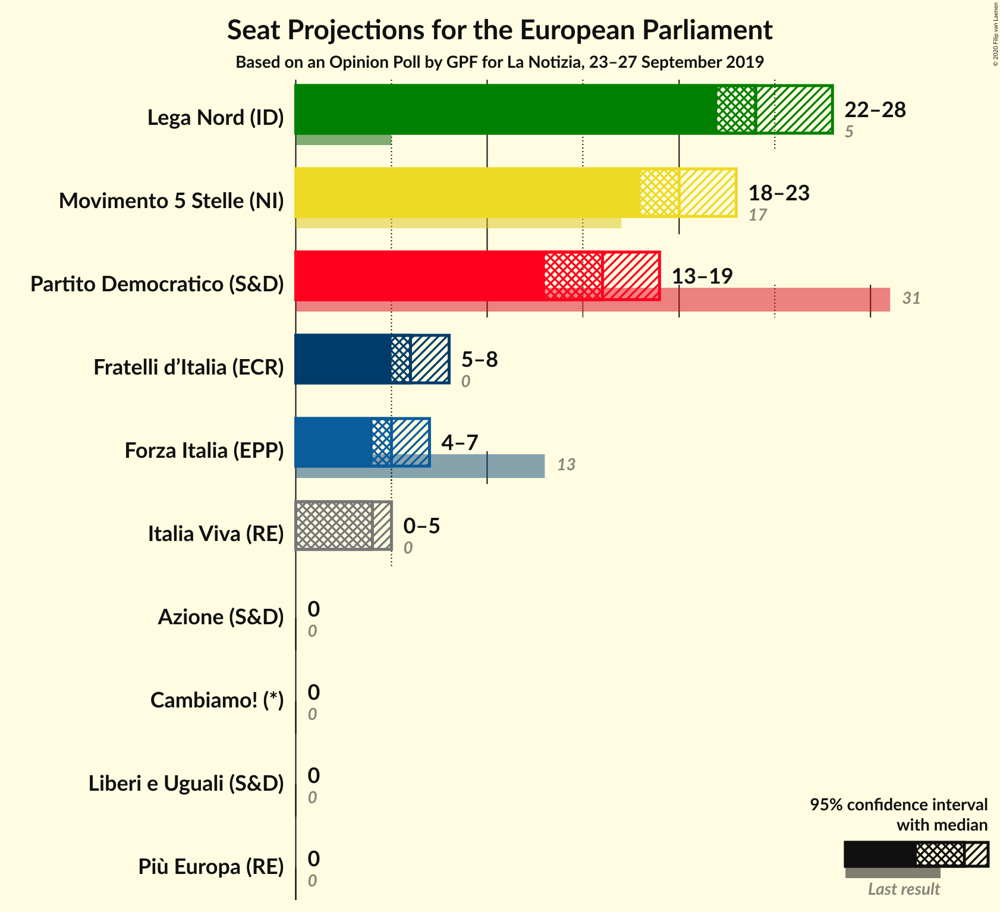
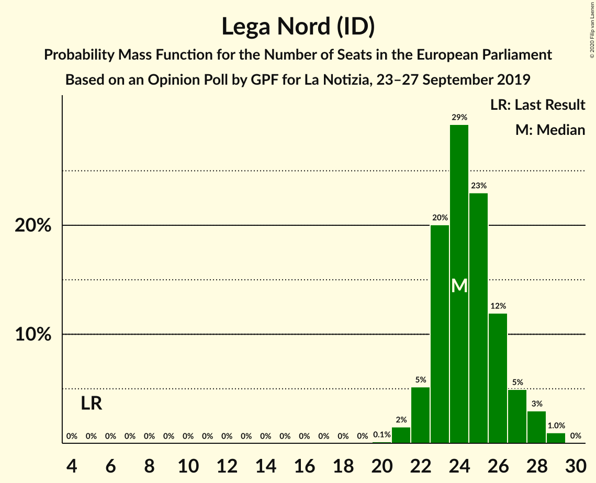
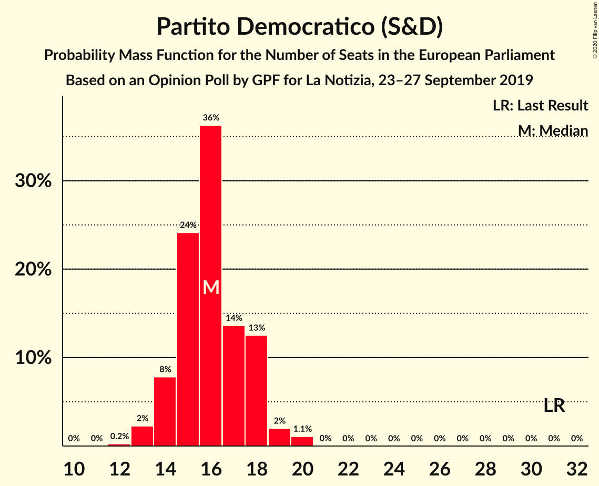
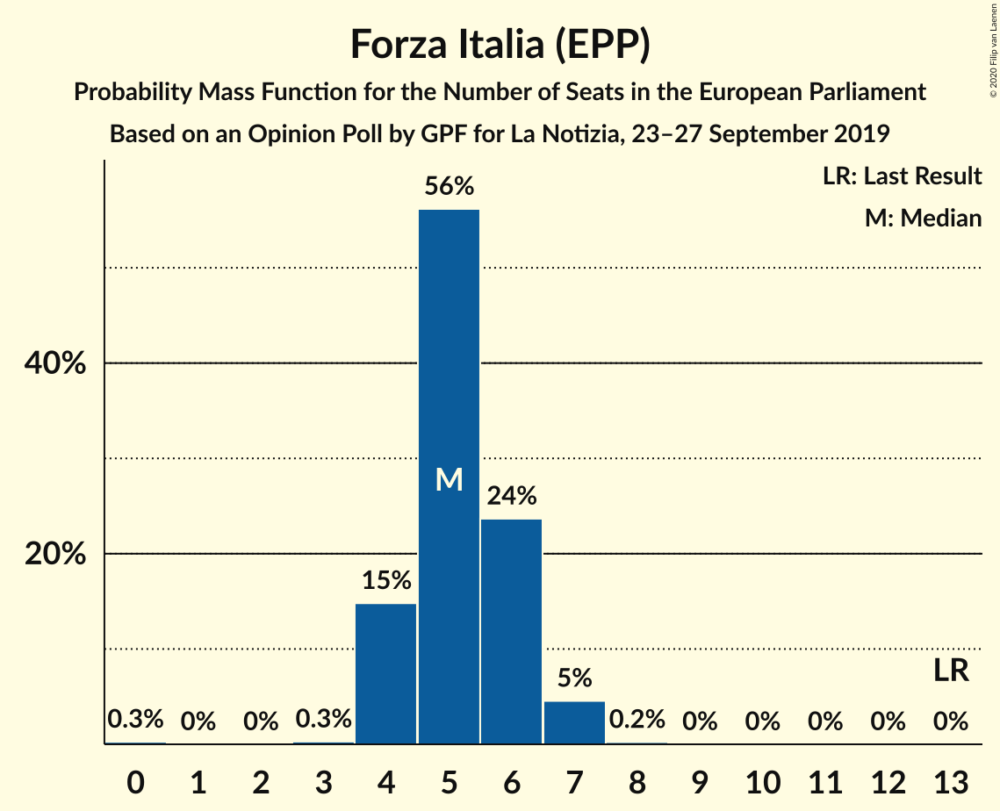
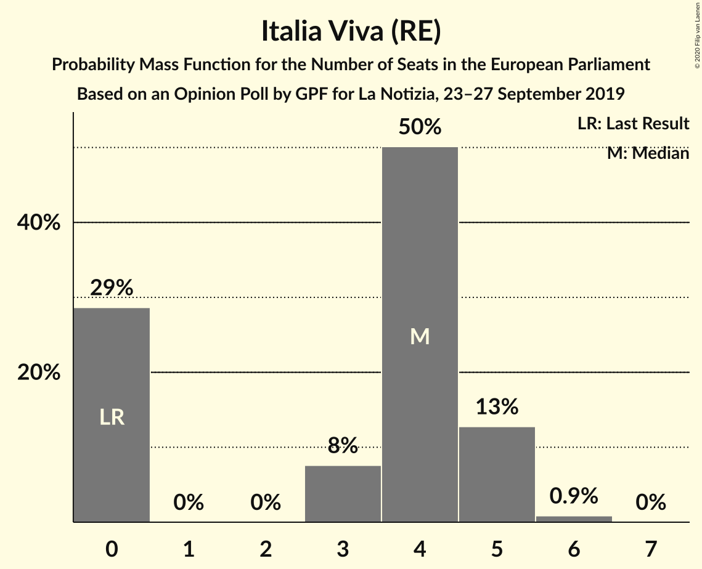
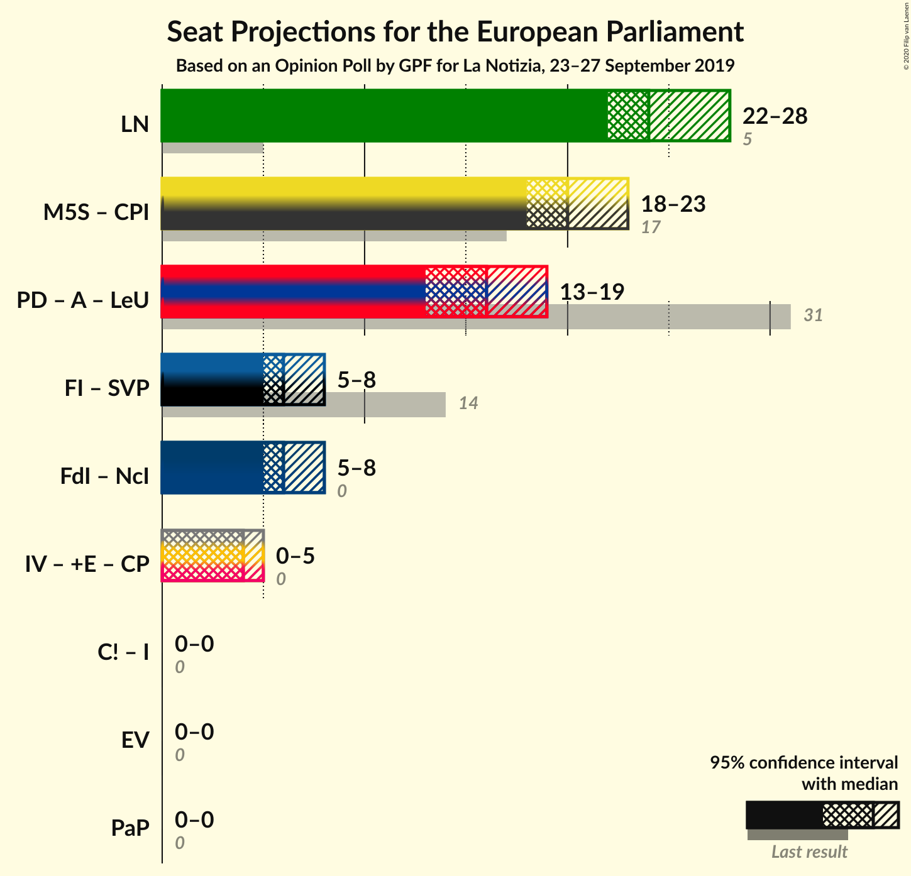
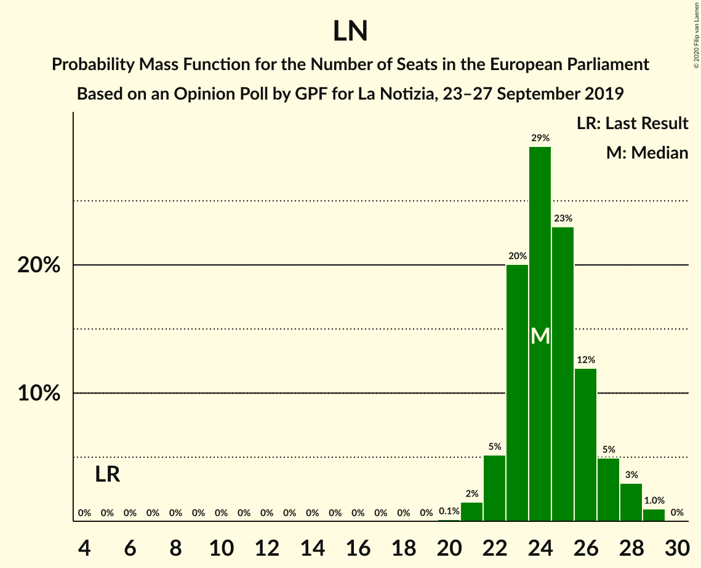

# Opinion Poll by GPF for La Notizia, 23–27 September 2019

<a href="#voting-intentions">Voting Intentions</a> | <a href="#seats">Seats</a> | <a href="#coalitions">Coalitions</a> | <a href="#technical-information">Technical Information</a>

## Voting Intentions

### Confidence Intervals

| Party | Last Result | Poll Result | 80% Confidence Interval | 90% Confidence Interval | 95% Confidence Interval | 99% Confidence Interval |
|:-----:|:-----------:|:-----------:|:-----------------------:|:-----------------------:|:-----------------------:|:-----------------------:|
| Lega Nord (ID) | 6.2% | 29.1% | 27.1–31.2% |26.6–31.8% |26.1–32.3% |25.1–33.3% |
| Movimento 5 Stelle (NI) | 21.2% | 24.2% | 22.3–26.2% |21.8–26.7% |21.3–27.2% |20.5–28.2% |
| Partito Democratico (S&D) | 40.8% | 20.1% | 18.4–22.0% |17.9–22.5% |17.5–23.0% |16.7–23.9% |
| Fratelli d’Italia (ECR) | 3.7% | 7.0% | 6.0–8.3% |5.7–8.7% |5.5–9.0% |5.0–9.7% |
| Forza Italia (EPP) | 16.8% | 6.0% | 5.1–7.3% |4.8–7.6% |4.6–7.9% |4.2–8.5% |
| Italia Viva (RE) | 0.0% | 4.4% | 3.6–5.5% |3.4–5.8% |3.2–6.1% |2.9–6.6% |
| Più Europa (RE) | 0.0% | 2.5% | 1.9–3.3% |1.7–3.6% |1.6–3.8% |1.4–4.2% |
| Azione (S&D) | 0.0% | 1.8% | 1.4–2.6% |1.2–2.8% |1.1–3.0% |0.9–3.4% |
| Liberi e Uguali (S&D) | 0.0% | 1.2% | 0.9–1.9% |0.7–2.1% |0.7–2.3% |0.5–2.6% |
| Cambiamo! (*) | 0.0% | 0.9% | 0.6–1.4% |0.5–1.6% |0.4–1.8% |0.3–2.1% |

*Note:* The poll result column reflects the actual value used in the calculations. Published results may vary slightly, and in addition be rounded to fewer digits.

## Seats

### Confidence Intervals

| Party | Last Result | Median | 80% Confidence Interval | 90% Confidence Interval | 95% Confidence Interval | 99% Confidence Interval |
|:-----:|:-----------:|:------:|:-----------------------:|:-----------------------:|:-----------------------:|:-----------------------:|
| <a href="#lega-nord-(id)">Lega Nord (ID)</a> | 5 | 24 | 23–26 |22–27 |22–28 |21–29 |
| <a href="#movimento-5-stelle-(ni)">Movimento 5 Stelle (NI)</a> | 17 | 20 | 19–22 |18–23 |18–23 |17–24 |
| <a href="#partito-democratico-(s&d)">Partito Democratico (S&D)</a> | 31 | 16 | 14–18 |14–18 |13–19 |13–20 |
| <a href="#fratelli-d’italia-(ecr)">Fratelli d’Italia (ECR)</a> | 0 | 6 | 5–7 |5–7 |5–8 |4–8 |
| <a href="#forza-italia-(epp)">Forza Italia (EPP)</a> | 13 | 5 | 4–6 |4–6 |4–7 |3–7 |
| <a href="#italia-viva-(re)">Italia Viva (RE)</a> | 0 | 4 | 0–5 |0–5 |0–5 |0–6 |
| <a href="#più-europa-(re)">Più Europa (RE)</a> | 0 | 0 | 0 |0 |0 |0–3 |
| <a href="#azione-(s&d)">Azione (S&D)</a> | 0 | 0 | 0 |0 |0 |0 |
| <a href="#liberi-e-uguali-(s&d)">Liberi e Uguali (S&D)</a> | 0 | 0 | 0 |0 |0 |0 |
| <a href="#cambiamo!-(*)">Cambiamo! (*)</a> | 0 | 0 | 0 |0 |0 |0 |

### Lega Nord (ID)

*For a full overview of the results for this party, see the [Lega Nord (ID)](party-leganordid.html) page.*

| Number of Seats | Probability | Accumulated | Special Marks |
|:---------------:|:-----------:|:-----------:|:-------------:|
| 5 | 0% | 100% | Last Result |
| 6 | 0% | 100% |  |
| 7 | 0% | 100% |  |
| 8 | 0% | 100% |  |
| 9 | 0% | 100% |  |
| 10 | 0% | 100% |  |
| 11 | 0% | 100% |  |
| 12 | 0% | 100% |  |
| 13 | 0% | 100% |  |
| 14 | 0% | 100% |  |
| 15 | 0% | 100% |  |
| 16 | 0% | 100% |  |
| 17 | 0% | 100% |  |
| 18 | 0% | 100% |  |
| 19 | 0% | 100% |  |
| 20 | 0.1% | 100% |  |
| 21 | 2% | 99.8% |  |
| 22 | 5% | 98% |  |
| 23 | 20% | 93% |  |
| 24 | 29% | 73% | Median |
| 25 | 23% | 44% |  |
| 26 | 12% | 21% |  |
| 27 | 5% | 9% |  |
| 28 | 3% | 4% |  |
| 29 | 1.0% | 1.0% |  |
| 30 | 0% | 0% |  |

### Movimento 5 Stelle (NI)

*For a full overview of the results for this party, see the [Movimento 5 Stelle (NI)](party-movimento5stelleni.html) page.*

| Number of Seats | Probability | Accumulated | Special Marks |
|:---------------:|:-----------:|:-----------:|:-------------:|
| 16 | 0.1% | 100% |  |
| 17 | 1.0% | 99.9% | Last Result |
| 18 | 8% | 98.9% |  |
| 19 | 17% | 91% |  |
| 20 | 35% | 75% | Median |
| 21 | 21% | 40% |  |
| 22 | 12% | 19% |  |
| 23 | 6% | 7% |  |
| 24 | 0.9% | 1.2% |  |
| 25 | 0.2% | 0.2% |  |
| 26 | 0% | 0% |  |

### Partito Democratico (S&D)

*For a full overview of the results for this party, see the [Partito Democratico (S&D)](party-partitodemocraticosd.html) page.*

| Number of Seats | Probability | Accumulated | Special Marks |
|:---------------:|:-----------:|:-----------:|:-------------:|
| 12 | 0.2% | 100% |  |
| 13 | 2% | 99.7% |  |
| 14 | 8% | 97% |  |
| 15 | 24% | 90% |  |
| 16 | 36% | 66% | Median |
| 17 | 14% | 29% |  |
| 18 | 13% | 16% |  |
| 19 | 2% | 3% |  |
| 20 | 1.1% | 1.1% |  |
| 21 | 0% | 0% |  |
| 22 | 0% | 0% |  |
| 23 | 0% | 0% |  |
| 24 | 0% | 0% |  |
| 25 | 0% | 0% |  |
| 26 | 0% | 0% |  |
| 27 | 0% | 0% |  |
| 28 | 0% | 0% |  |
| 29 | 0% | 0% |  |
| 30 | 0% | 0% |  |
| 31 | 0% | 0% | Last Result |

### Fratelli d’Italia (ECR)

*For a full overview of the results for this party, see the [Fratelli d’Italia (ECR)](party-fratellid’italiaecr.html) page.*

| Number of Seats | Probability | Accumulated | Special Marks |
|:---------------:|:-----------:|:-----------:|:-------------:|
| 0 | 0% | 100% | Last Result |
| 1 | 0% | 100% |  |
| 2 | 0% | 100% |  |
| 3 | 0% | 100% |  |
| 4 | 2% | 100% |  |
| 5 | 23% | 98% |  |
| 6 | 49% | 75% | Median |
| 7 | 23% | 26% |  |
| 8 | 2% | 3% |  |
| 9 | 0.2% | 0.2% |  |
| 10 | 0% | 0% |  |

### Forza Italia (EPP)

*For a full overview of the results for this party, see the [Forza Italia (EPP)](party-forzaitaliaepp.html) page.*

| Number of Seats | Probability | Accumulated | Special Marks |
|:---------------:|:-----------:|:-----------:|:-------------:|
| 0 | 0.3% | 100% |  |
| 1 | 0% | 99.7% |  |
| 2 | 0% | 99.7% |  |
| 3 | 0.3% | 99.7% |  |
| 4 | 15% | 99.5% |  |
| 5 | 56% | 85% | Median |
| 6 | 24% | 28% |  |
| 7 | 5% | 5% |  |
| 8 | 0.2% | 0.2% |  |
| 9 | 0% | 0% |  |
| 10 | 0% | 0% |  |
| 11 | 0% | 0% |  |
| 12 | 0% | 0% |  |
| 13 | 0% | 0% | Last Result |

### Italia Viva (RE)

*For a full overview of the results for this party, see the [Italia Viva (RE)](party-italiavivare.html) page.*

| Number of Seats | Probability | Accumulated | Special Marks |
|:---------------:|:-----------:|:-----------:|:-------------:|
| 0 | 29% | 100% | Last Result |
| 1 | 0% | 71% |  |
| 2 | 0% | 71% |  |
| 3 | 8% | 71% |  |
| 4 | 50% | 64% | Median |
| 5 | 13% | 14% |  |
| 6 | 0.9% | 0.9% |  |
| 7 | 0% | 0% |  |

### Più Europa (RE)

*For a full overview of the results for this party, see the [Più Europa (RE)](party-piùeuropare.html) page.*

| Number of Seats | Probability | Accumulated | Special Marks |
|:---------------:|:-----------:|:-----------:|:-------------:|
| 0 | 99.1% | 100% | Last Result, Median |
| 1 | 0% | 0.9% |  |
| 2 | 0% | 0.9% |  |
| 3 | 0.5% | 0.9% |  |
| 4 | 0.4% | 0.4% |  |
| 5 | 0% | 0% |  |

### Azione (S&D)

*For a full overview of the results for this party, see the [Azione (S&D)](party-azionesd.html) page.*

| Number of Seats | Probability | Accumulated | Special Marks |
|:---------------:|:-----------:|:-----------:|:-------------:|
| 0 | 100% | 100% | Last Result, Median |

### Liberi e Uguali (S&D)

*For a full overview of the results for this party, see the [Liberi e Uguali (S&D)](party-liberieugualisd.html) page.*

| Number of Seats | Probability | Accumulated | Special Marks |
|:---------------:|:-----------:|:-----------:|:-------------:|
| 0 | 100% | 100% | Last Result, Median |

### Cambiamo! (*)

*For a full overview of the results for this party, see the [Cambiamo! (*)](party-cambiamo.html) page.*

| Number of Seats | Probability | Accumulated | Special Marks |
|:---------------:|:-----------:|:-----------:|:-------------:|
| 0 | 100% | 100% | Last Result, Median |

## Coalitions

### Confidence Intervals

| Coalition | Last Result | Median | Majority? | 80% Confidence Interval | 90% Confidence Interval | 95% Confidence Interval | 99% Confidence Interval |
|:---------:|:-----------:|:------:|:---------:|:-----------------------:|:-----------------------:|:-----------------------:|:-----------------------:|
| Lega Nord (ID) | 5 | 24 | 0% | 23–26 | 22–27 | 22–28 | 21–29 |
| Partito Democratico (S&D) – Azione (S&D) – Liberi e Uguali (S&D) | 31 | 16 | 0% | 14–18 | 14–18 | 13–19 | 13–20 |

### Lega Nord (ID)

| Number of Seats | Probability | Accumulated | Special Marks |
|:---------------:|:-----------:|:-----------:|:-------------:|
| 5 | 0% | 100% | Last Result |
| 6 | 0% | 100% |  |
| 7 | 0% | 100% |  |
| 8 | 0% | 100% |  |
| 9 | 0% | 100% |  |
| 10 | 0% | 100% |  |
| 11 | 0% | 100% |  |
| 12 | 0% | 100% |  |
| 13 | 0% | 100% |  |
| 14 | 0% | 100% |  |
| 15 | 0% | 100% |  |
| 16 | 0% | 100% |  |
| 17 | 0% | 100% |  |
| 18 | 0% | 100% |  |
| 19 | 0% | 100% |  |
| 20 | 0.1% | 100% |  |
| 21 | 2% | 99.8% |  |
| 22 | 5% | 98% |  |
| 23 | 20% | 93% |  |
| 24 | 29% | 73% | Median |
| 25 | 23% | 44% |  |
| 26 | 12% | 21% |  |
| 27 | 5% | 9% |  |
| 28 | 3% | 4% |  |
| 29 | 1.0% | 1.0% |  |
| 30 | 0% | 0% |  |

### Partito Democratico (S&D) – Azione (S&D) – Liberi e Uguali (S&D)

| Number of Seats | Probability | Accumulated | Special Marks |
|:---------------:|:-----------:|:-----------:|:-------------:|
| 12 | 0.2% | 100% |  |
| 13 | 2% | 99.7% |  |
| 14 | 8% | 97% |  |
| 15 | 24% | 90% |  |
| 16 | 36% | 66% | Median |
| 17 | 14% | 29% |  |
| 18 | 13% | 16% |  |
| 19 | 2% | 3% |  |
| 20 | 1.1% | 1.1% |  |
| 21 | 0% | 0% |  |
| 22 | 0% | 0% |  |
| 23 | 0% | 0% |  |
| 24 | 0% | 0% |  |
| 25 | 0% | 0% |  |
| 26 | 0% | 0% |  |
| 27 | 0% | 0% |  |
| 28 | 0% | 0% |  |
| 29 | 0% | 0% |  |
| 30 | 0% | 0% |  |
| 31 | 0% | 0% | Last Result |

## Technical Information

### Opinion Poll

+ **Polling firm:** GPF
+ **Commissioner(s):** La Notizia
+ **Fieldwork period:** 23–27 September 2019

### Calculations

+ **Sample size:** 811
+ **Simulations done:** 1,048,576
+ **Error estimate:** 1.20%

