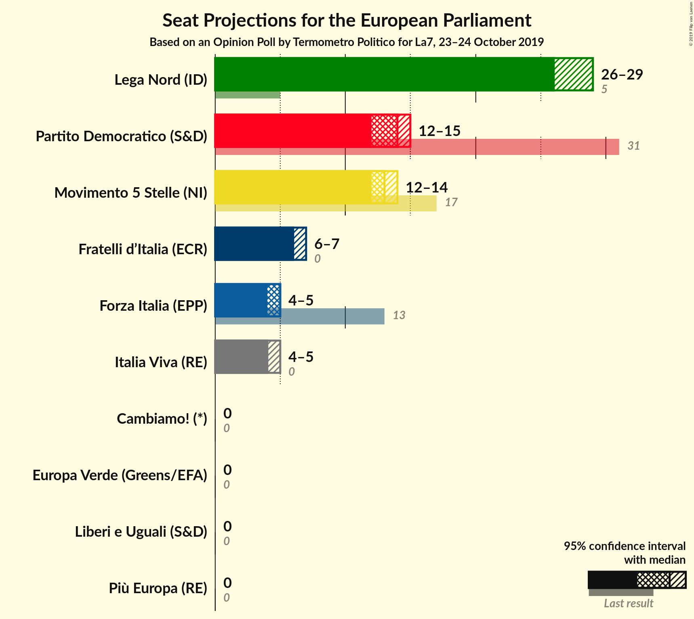
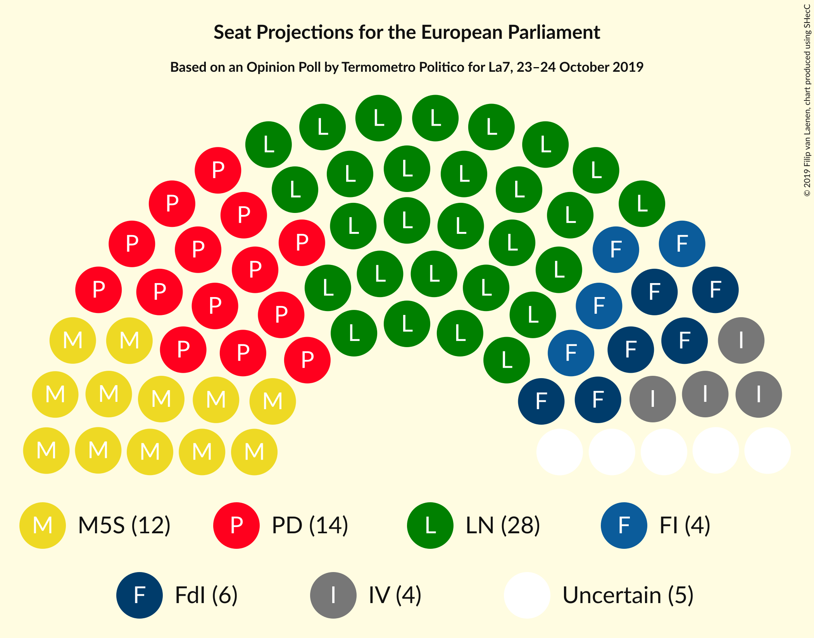

# Opinion Poll by Termometro Politico for La7, 23–24 October 2019

<a href="#voting-intentions">Voting Intentions</a> | <a href="#seats">Seats</a> | <a href="#coalitions">Coalitions</a> | <a href="#technical-information">Technical Information</a>

## Voting Intentions

### Confidence Intervals

| Party | Last Result | Poll Result | 80% Confidence Interval | 90% Confidence Interval | 95% Confidence Interval | 99% Confidence Interval |
|:-----:|:-----------:|:-----------:|:-----------------------:|:-----------------------:|:-----------------------:|:-----------------------:|
| Lega Nord (ID) | 6.2% | 35.2% | 33.9–36.5% |33.6–36.9% |33.3–37.2% |32.7–37.8% |
| Partito Democratico (S&D) | 40.8% | 18.9% | 17.9–20.0% |17.6–20.3% |17.4–20.6% |16.9–21.1% |
| Movimento 5 Stelle (NI) | 21.2% | 17.1% | 16.1–18.1% |15.8–18.4% |15.6–18.7% |15.1–19.2% |
| Fratelli d’Italia (ECR) | 3.7% | 8.2% | 7.5–9.0% |7.3–9.2% |7.2–9.4% |6.8–9.8% |
| Forza Italia (EPP) | 16.8% | 5.6% | 5.0–6.3% |4.9–6.5% |4.7–6.6% |4.5–7.0% |
| Italia Viva (RE) | 0.0% | 5.6% | 5.0–6.3% |4.9–6.5% |4.7–6.6% |4.5–7.0% |
| Liberi e Uguali (S&D) | 0.0% | 1.9% | 1.6–2.3% |1.5–2.5% |1.4–2.6% |1.3–2.8% |
| Europa Verde (Greens/EFA) | 0.0% | 1.5% | 1.2–1.9% |1.2–2.0% |1.1–2.1% |1.0–2.3% |
| Azione (S&D) | N/A | 1.3% | 1.0–1.7% |1.0–1.8% |0.9–1.9% |0.8–2.1% |
| Più Europa (RE) | 0.0% | 1.2% | 1.0–1.6% |0.9–1.7% |0.8–1.8% |0.7–2.0% |
| Cambiamo! (*) | 0.0% | 0.5% | 0.4–0.8% |0.3–0.9% |0.3–0.9% |0.2–1.1% |

*Note:* The poll result column reflects the actual value used in the calculations. Published results may vary slightly, and in addition be rounded to fewer digits.

## Seats

### Confidence Intervals

| Party | Last Result | Median | 80% Confidence Interval | 90% Confidence Interval | 95% Confidence Interval | 99% Confidence Interval |
|:-----:|:-----------:|:------:|:-----------------------:|:-----------------------:|:-----------------------:|:-----------------------:|
| <a href="#lega-nord-(id)">Lega Nord (ID)</a> | 5 | 28 | 27–29 |27–29 |27–30 |26–30 |
| <a href="#partito-democratico-(s&d)">Partito Democratico (S&D)</a> | 31 | 14 | 13–15 |13–15 |13–16 |12–16 |
| <a href="#movimento-5-stelle-(ni)">Movimento 5 Stelle (NI)</a> | 17 | 14 | 13–15 |13–15 |12–15 |12–15 |
| <a href="#fratelli-d’italia-(ecr)">Fratelli d’Italia (ECR)</a> | 0 | 7 | 6–7 |6–7 |6–8 |5–8 |
| <a href="#forza-italia-(epp)">Forza Italia (EPP)</a> | 13 | 5 | 4–5 |4–5 |4–5 |4–6 |
| <a href="#italia-viva-(re)">Italia Viva (RE)</a> | 0 | 5 | 4–5 |4–6 |4–6 |4–6 |
| <a href="#liberi-e-uguali-(s&d)">Liberi e Uguali (S&D)</a> | 0 | 0 | 0 |0 |0 |0 |
| <a href="#europa-verde-(greens/efa)">Europa Verde (Greens/EFA)</a> | 0 | 0 | 0 |0 |0 |0 |
| <a href="#azione-(s&d)">Azione (S&D)</a> | N/A | 0 | 0 |0 |0 |0 |
| <a href="#più-europa-(re)">Più Europa (RE)</a> | 0 | 0 | 0 |0 |0 |0 |
| <a href="#cambiamo!-(*)">Cambiamo! (*)</a> | 0 | 0 | 0 |0 |0 |0 |

