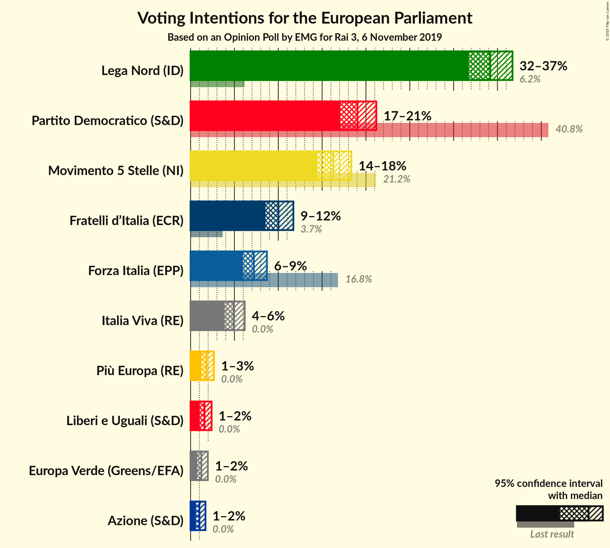

# Opinion Poll by EMG for Rai 3, 6 November 2019

<a href="#voting-intentions">Voting Intentions</a> | <a href="#seats">Seats</a> | <a href="#coalitions">Coalitions</a> | <a href="#technical-information">Technical Information</a>

## Voting Intentions

### Confidence Intervals

| Party | Last Result | Poll Result | 80% Confidence Interval | 90% Confidence Interval | 95% Confidence Interval | 99% Confidence Interval |
|:-----:|:-----------:|:-----------:|:-----------------------:|:-----------------------:|:-----------------------:|:-----------------------:|
| Lega Nord (ID) | 6.2% | 34.2% | 32.6–35.8% |32.1–36.3% |31.7–36.7% |31.0–37.5% |
| Partito Democratico (S&D) | 40.8% | 19.0% | 17.7–20.4% |17.4–20.9% |17.1–21.2% |16.4–21.9% |
| Movimento 5 Stelle (NI) | 21.2% | 16.3% | 15.1–17.6% |14.7–18.0% |14.4–18.3% |13.9–19.0% |
| Fratelli d’Italia (ECR) | 3.7% | 10.0% | 9.1–11.1% |8.8–11.4% |8.6–11.7% |8.1–12.3% |
| Forza Italia (EPP) | 16.8% | 7.2% | 6.4–8.2% |6.2–8.5% |6.0–8.7% |5.6–9.2% |
| Italia Viva (RE) | 0.0% | 4.9% | 4.2–5.7% |4.0–6.0% |3.9–6.2% |3.6–6.6% |
| Più Europa (RE) | 0.0% | 1.8% | 1.4–2.4% |1.3–2.5% |1.2–2.7% |1.1–2.9% |
| Liberi e Uguali (S&D) | 0.0% | 1.6% | 1.2–2.1% |1.1–2.3% |1.1–2.4% |0.9–2.7% |
| Europa Verde (Greens/EFA) | 0.0% | 1.2% | 0.9–1.7% |0.8–1.8% |0.8–2.0% |0.6–2.2% |
| Azione (S&D) | N/A | 1.0% | 0.7–1.4% |0.7–1.6% |0.6–1.7% |0.5–1.9% |

*Note:* The poll result column reflects the actual value used in the calculations. Published results may vary slightly, and in addition be rounded to fewer digits.

## Seats

### Confidence Intervals

| Party | Last Result | Median | 80% Confidence Interval | 90% Confidence Interval | 95% Confidence Interval | 99% Confidence Interval |
|:-----:|:-----------:|:------:|:-----------------------:|:-----------------------:|:-----------------------:|:-----------------------:|
| <a href="#lega-nord-(id)">Lega Nord (ID)</a> | 5 | 27 | 26–28 |26–29 |25–29 |25–30 |
| <a href="#partito-democratico-(s&d)">Partito Democratico (S&D)</a> | 31 | 14 | 13–15 |13–16 |13–16 |12–16 |
| <a href="#movimento-5-stelle-(ni)">Movimento 5 Stelle (NI)</a> | 17 | 13 | 12–14 |12–14 |11–15 |11–15 |
| <a href="#fratelli-d’italia-(ecr)">Fratelli d’Italia (ECR)</a> | 0 | 8 | 7–9 |7–9 |7–9 |6–10 |
| <a href="#forza-italia-(epp)">Forza Italia (EPP)</a> | 13 | 6 | 5–7 |5–7 |5–7 |4–7 |
| <a href="#italia-viva-(re)">Italia Viva (RE)</a> | 0 | 4 | 3–5 |3–5 |0–5 |0–5 |
| <a href="#più-europa-(re)">Più Europa (RE)</a> | 0 | 0 | 0 |0 |0 |0 |
| <a href="#liberi-e-uguali-(s&d)">Liberi e Uguali (S&D)</a> | 0 | 0 | 0 |0 |0 |0 |
| <a href="#europa-verde-(greens/efa)">Europa Verde (Greens/EFA)</a> | 0 | 0 | 0 |0 |0 |0 |
| <a href="#azione-(s&d)">Azione (S&D)</a> | N/A | 0 | 0 |0 |0 |0 |

