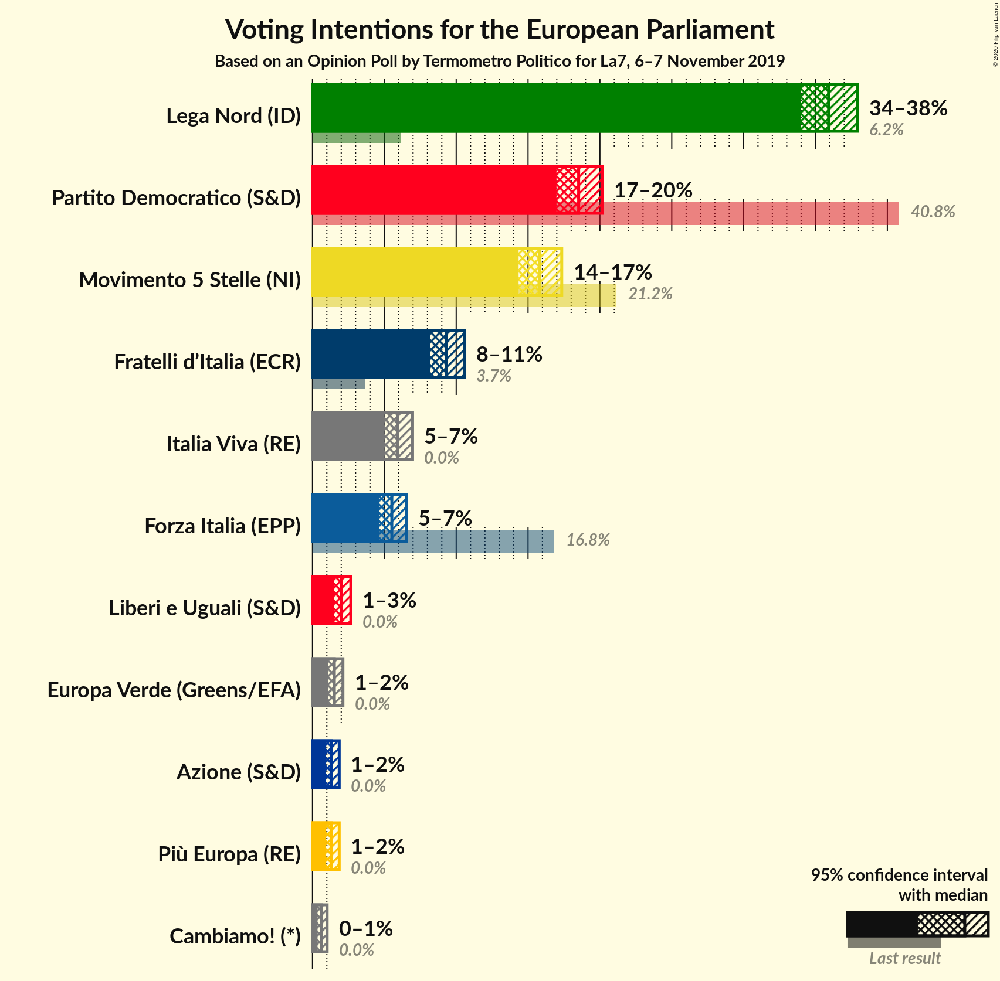
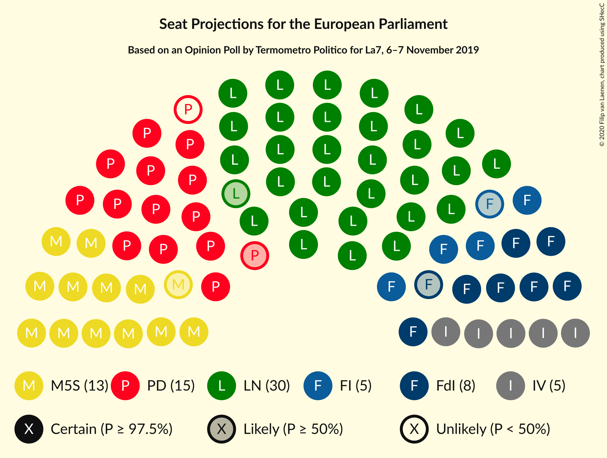

# Opinion Poll by Termometro Politico for La7, 6–7 November 2019

<a href="#voting-intentions">Voting Intentions</a> | <a href="#seats">Seats</a> | <a href="#coalitions">Coalitions</a> | <a href="#technical-information">Technical Information</a>

## Voting Intentions

### Confidence Intervals

| Party | Last Result | Poll Result | 80% Confidence Interval | 90% Confidence Interval | 95% Confidence Interval | 99% Confidence Interval |
|:-----:|:-----------:|:-----------:|:-----------------------:|:-----------------------:|:-----------------------:|:-----------------------:|
| Lega Nord (ID) | 6.2% | 35.9% | 34.6–37.2% |34.3–37.6% |34.0–37.9% |33.4–38.5% |
| Partito Democratico (S&D) | 40.8% | 18.5% | 17.5–19.6% |17.2–19.9% |17.0–20.2% |16.5–20.7% |
| Movimento 5 Stelle (NI) | 21.2% | 15.8% | 14.8–16.8% |14.6–17.1% |14.3–17.3% |13.9–17.8% |
| Fratelli d’Italia (ECR) | 3.7% | 9.3% | 8.6–10.1% |8.4–10.4% |8.2–10.6% |7.8–11.0% |
| Italia Viva (RE) | 0.0% | 5.9% | 5.3–6.6% |5.2–6.8% |5.0–7.0% |4.7–7.3% |
| Forza Italia (EPP) | 16.8% | 5.5% | 5.0–6.2% |4.8–6.4% |4.6–6.5% |4.4–6.9% |
| Liberi e Uguali (S&D) | 0.0% | 2.0% | 1.7–2.4% |1.6–2.6% |1.5–2.7% |1.4–2.9% |
| Europa Verde (Greens/EFA) | 0.0% | 1.5% | 1.2–1.9% |1.2–2.0% |1.1–2.1% |1.0–2.3% |
| Più Europa (RE) | 0.0% | 1.3% | 1.0–1.7% |1.0–1.8% |0.9–1.9% |0.8–2.1% |
| Azione (S&D) | N/A | 1.3% | 1.0–1.7% |1.0–1.8% |0.9–1.9% |0.8–2.1% |
| Cambiamo! (*) | 0.0% | 0.6% | 0.4–0.9% |0.4–1.0% |0.4–1.0% |0.3–1.2% |

*Note:* The poll result column reflects the actual value used in the calculations. Published results may vary slightly, and in addition be rounded to fewer digits.

## Seats

### Confidence Intervals

| Party | Last Result | Median | 80% Confidence Interval | 90% Confidence Interval | 95% Confidence Interval | 99% Confidence Interval |
|:-----:|:-----------:|:------:|:-----------------------:|:-----------------------:|:-----------------------:|:-----------------------:|
| <a href="#lega-nord-(id)">Lega Nord (ID)</a> | 5 | 29 | 28–30 |28–30 |27–30 |27–31 |
| <a href="#partito-democratico-(s&d)">Partito Democratico (S&D)</a> | 31 | 14 | 13–14 |13–14 |13–14 |12–15 |
| <a href="#movimento-5-stelle-(ni)">Movimento 5 Stelle (NI)</a> | 17 | 13 | 12–14 |12–14 |11–14 |11–14 |
| <a href="#fratelli-d’italia-(ecr)">Fratelli d’Italia (ECR)</a> | 0 | 7 | 7–8 |7–9 |7–9 |6–9 |
| <a href="#italia-viva-(re)">Italia Viva (RE)</a> | 0 | 5 | 5 |4–6 |4–6 |4–6 |
| <a href="#forza-italia-(epp)">Forza Italia (EPP)</a> | 13 | 4 | 4–5 |4–5 |4–5 |3–5 |
| <a href="#liberi-e-uguali-(s&d)">Liberi e Uguali (S&D)</a> | 0 | 0 | 0 |0 |0 |0 |
| <a href="#europa-verde-(greens/efa)">Europa Verde (Greens/EFA)</a> | 0 | 0 | 0 |0 |0 |0 |
| <a href="#più-europa-(re)">Più Europa (RE)</a> | 0 | 0 | 0 |0 |0 |0 |
| <a href="#azione-(s&d)">Azione (S&D)</a> | N/A | 0 | 0 |0 |0 |0 |
| <a href="#cambiamo!-(*)">Cambiamo! (*)</a> | 0 | 0 | 0 |0 |0 |0 |

