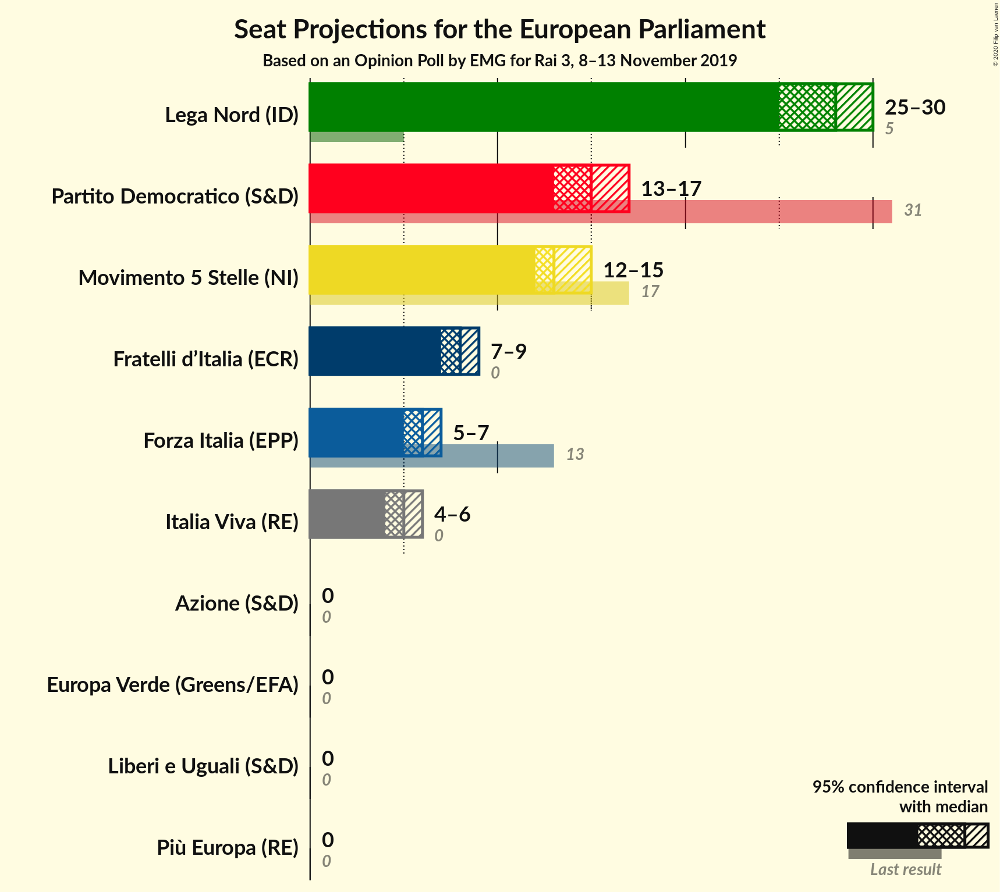
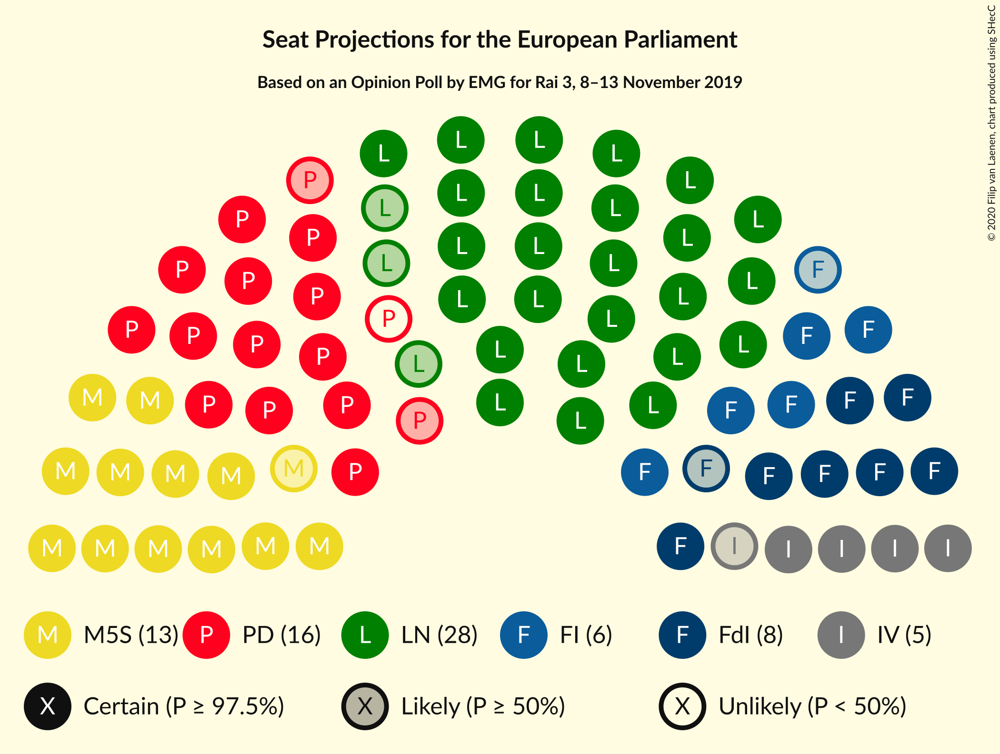

# Opinion Poll by EMG for Rai 3, 8–13 November 2019

<a href="#voting-intentions">Voting Intentions</a> | <a href="#seats">Seats</a> | <a href="#coalitions">Coalitions</a> | <a href="#technical-information">Technical Information</a>

## Voting Intentions

### Confidence Intervals

| Party | Last Result | Poll Result | 80% Confidence Interval | 90% Confidence Interval | 95% Confidence Interval | 99% Confidence Interval |
|:-----:|:-----------:|:-----------:|:-----------------------:|:-----------------------:|:-----------------------:|:-----------------------:|
| Lega Nord (ID) | 6.2% | 33.2% | 31.6–34.8% |31.2–35.3% |30.8–35.7% |30.0–36.5% |
| Partito Democratico (S&D) | 40.8% | 19.6% | 18.4–21.1% |18.0–21.5% |17.7–21.8% |17.1–22.5% |
| Movimento 5 Stelle (NI) | 21.2% | 16.2% | 15.0–17.5% |14.7–17.9% |14.4–18.2% |13.8–18.9% |
| Fratelli d’Italia (ECR) | 3.7% | 9.8% | 8.9–10.9% |8.6–11.2% |8.4–11.5% |7.9–12.0% |
| Forza Italia (EPP) | 16.8% | 7.4% | 6.6–8.4% |6.4–8.7% |6.2–8.9% |5.8–9.4% |
| Italia Viva (RE) | 0.0% | 5.8% | 5.0–6.6% |4.8–6.9% |4.6–7.1% |4.3–7.5% |
| Liberi e Uguali (S&D) | 0.0% | 1.7% | 1.3–2.2% |1.2–2.4% |1.1–2.5% |1.0–2.8% |
| Europa Verde (Greens/EFA) | 0.0% | 1.2% | 0.9–1.7% |0.8–1.8% |0.7–1.9% |0.6–2.1% |
| Più Europa (RE) | 0.0% | 1.0% | 0.7–1.4% |0.6–1.5% |0.6–1.6% |0.5–1.9% |
| Azione (S&D) | N/A | 1.0% | 0.7–1.4% |0.6–1.5% |0.6–1.6% |0.5–1.9% |

*Note:* The poll result column reflects the actual value used in the calculations. Published results may vary slightly, and in addition be rounded to fewer digits.

## Seats

### Confidence Intervals

| Party | Last Result | Median | 80% Confidence Interval | 90% Confidence Interval | 95% Confidence Interval | 99% Confidence Interval |
|:-----:|:-----------:|:------:|:-----------------------:|:-----------------------:|:-----------------------:|:-----------------------:|
| <a href="#lega-nord-(id)">Lega Nord (ID)</a> | 5 | 26 | 25–28 |24–28 |24–28 |23–29 |
| <a href="#partito-democratico-(s&d)">Partito Democratico (S&D)</a> | 31 | 15 | 13–16 |13–16 |13–16 |12–17 |
| <a href="#movimento-5-stelle-(ni)">Movimento 5 Stelle (NI)</a> | 17 | 13 | 12–14 |12–14 |11–14 |11–15 |
| <a href="#fratelli-d’italia-(ecr)">Fratelli d’Italia (ECR)</a> | 0 | 8 | 7–9 |7–9 |6–9 |6–10 |
| <a href="#forza-italia-(epp)">Forza Italia (EPP)</a> | 13 | 6 | 5–7 |5–7 |5–7 |5–7 |
| <a href="#italia-viva-(re)">Italia Viva (RE)</a> | 0 | 5 | 4–5 |4–6 |4–6 |3–6 |
| <a href="#liberi-e-uguali-(s&d)">Liberi e Uguali (S&D)</a> | 0 | 0 | 0 |0 |0 |0 |
| <a href="#europa-verde-(greens/efa)">Europa Verde (Greens/EFA)</a> | 0 | 0 | 0 |0 |0 |0 |
| <a href="#più-europa-(re)">Più Europa (RE)</a> | 0 | 0 | 0 |0 |0 |0 |
| <a href="#azione-(s&d)">Azione (S&D)</a> | N/A | 0 | 0 |0 |0 |0 |

