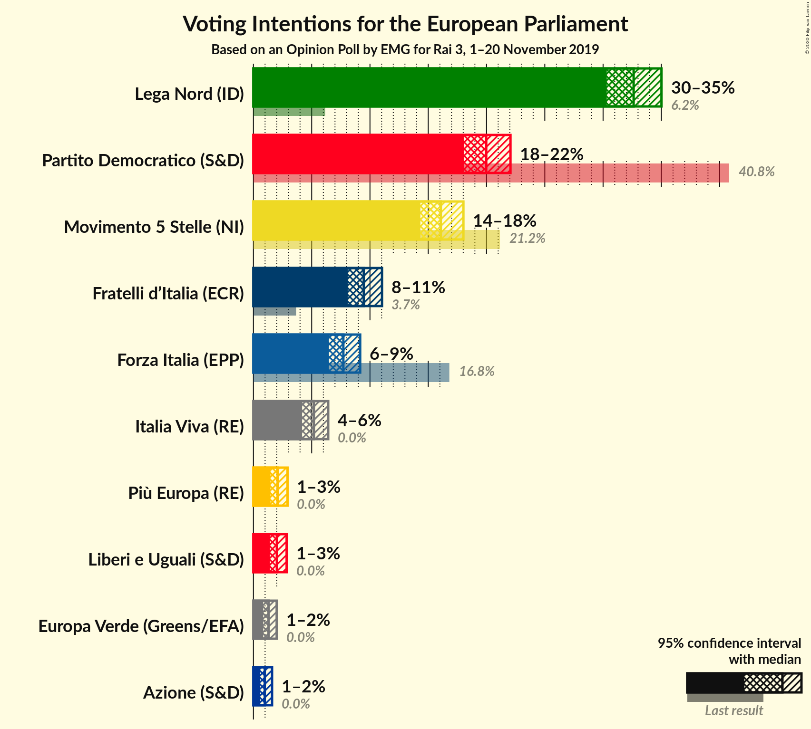
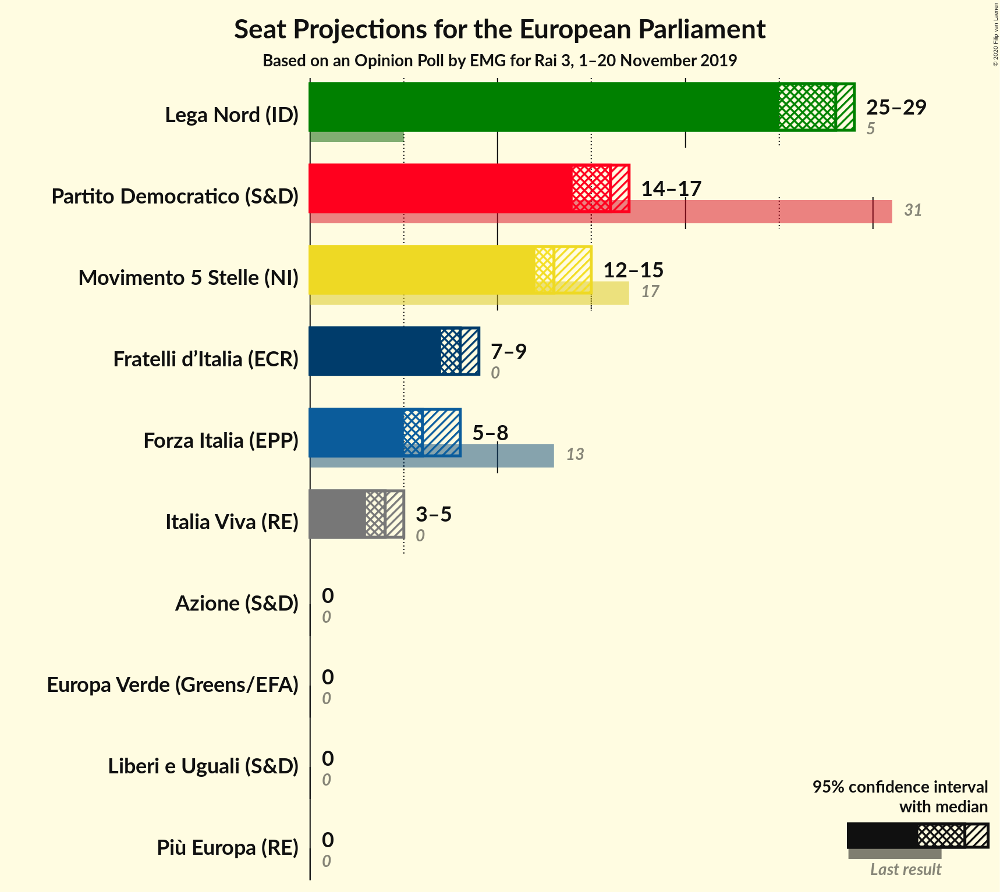
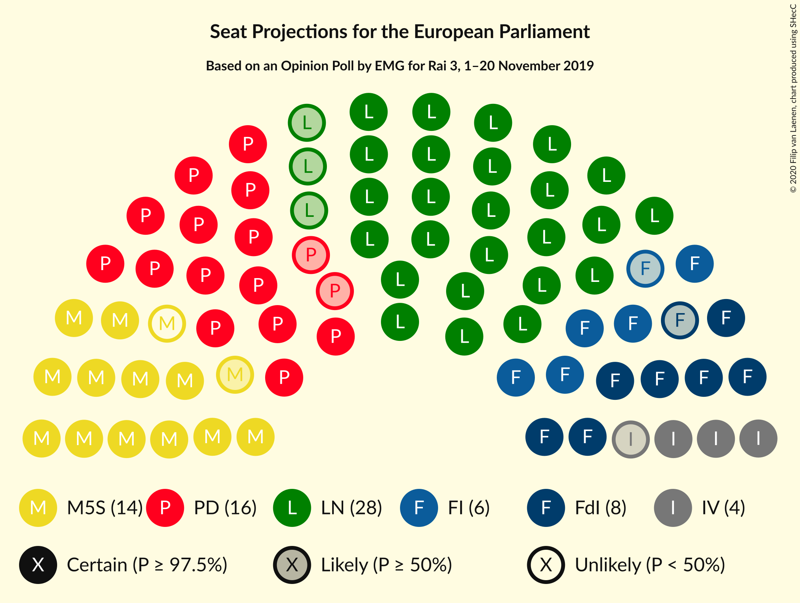

# Opinion Poll by EMG for Rai 3, 1–20 November 2019

<a href="#voting-intentions">Voting Intentions</a> | <a href="#seats">Seats</a> | <a href="#coalitions">Coalitions</a> | <a href="#technical-information">Technical Information</a>

## Voting Intentions

### Confidence Intervals

| Party | Last Result | Poll Result | 80% Confidence Interval | 90% Confidence Interval | 95% Confidence Interval | 99% Confidence Interval |
|:-----:|:-----------:|:-----------:|:-----------------------:|:-----------------------:|:-----------------------:|:-----------------------:|
| Lega Nord (ID) | 6.2% | 32.6% | 31.1–34.2% |30.7–34.6% |30.3–35.0% |29.6–35.8% |
| Partito Democratico (S&D) | 40.8% | 20.0% | 18.7–21.3% |18.4–21.7% |18.0–22.1% |17.5–22.7% |
| Movimento 5 Stelle (NI) | 21.2% | 16.1% | 14.9–17.3% |14.6–17.7% |14.3–18.0% |13.8–18.6% |
| Fratelli d’Italia (ECR) | 3.7% | 9.5% | 8.6–10.5% |8.3–10.8% |8.1–11.0% |7.7–11.6% |
| Forza Italia (EPP) | 16.8% | 7.7% | 6.9–8.7% |6.7–8.9% |6.5–9.2% |6.1–9.6% |
| Italia Viva (RE) | 0.0% | 5.2% | 4.5–6.0% |4.3–6.2% |4.2–6.4% |3.9–6.8% |
| Più Europa (RE) | 0.0% | 2.1% | 1.7–2.6% |1.6–2.8% |1.5–2.9% |1.3–3.2% |
| Liberi e Uguali (S&D) | 0.0% | 2.0% | 1.6–2.6% |1.5–2.7% |1.4–2.9% |1.2–3.1% |
| Europa Verde (Greens/EFA) | 0.0% | 1.3% | 1.0–1.8% |0.9–1.9% |0.8–2.0% |0.7–2.2% |
| Azione (S&D) | N/A | 1.0% | 0.7–1.4% |0.6–1.5% |0.6–1.6% |0.5–1.8% |

*Note:* The poll result column reflects the actual value used in the calculations. Published results may vary slightly, and in addition be rounded to fewer digits.

## Seats

### Confidence Intervals

| Party | Last Result | Median | 80% Confidence Interval | 90% Confidence Interval | 95% Confidence Interval | 99% Confidence Interval |
|:-----:|:-----------:|:------:|:-----------------------:|:-----------------------:|:-----------------------:|:-----------------------:|
| <a href="#lega-nord-(id)">Lega Nord (ID)</a> | 5 | 26 | 25–27 |24–27 |24–28 |24–29 |
| <a href="#partito-democratico-(s&d)">Partito Democratico (S&D)</a> | 31 | 15 | 14–16 |14–16 |14–16 |13–17 |
| <a href="#movimento-5-stelle-(ni)">Movimento 5 Stelle (NI)</a> | 17 | 13 | 12–14 |12–14 |11–14 |11–15 |
| <a href="#fratelli-d’italia-(ecr)">Fratelli d’Italia (ECR)</a> | 0 | 8 | 7–8 |7–9 |7–9 |6–9 |
| <a href="#forza-italia-(epp)">Forza Italia (EPP)</a> | 13 | 6 | 5–7 |5–7 |5–7 |5–8 |
| <a href="#italia-viva-(re)">Italia Viva (RE)</a> | 0 | 4 | 4–5 |3–5 |3–5 |0–5 |
| <a href="#più-europa-(re)">Più Europa (RE)</a> | 0 | 0 | 0 |0 |0 |0 |
| <a href="#liberi-e-uguali-(s&d)">Liberi e Uguali (S&D)</a> | 0 | 0 | 0 |0 |0 |0 |
| <a href="#europa-verde-(greens/efa)">Europa Verde (Greens/EFA)</a> | 0 | 0 | 0 |0 |0 |0 |
| <a href="#azione-(s&d)">Azione (S&D)</a> | N/A | 0 | 0 |0 |0 |0 |

