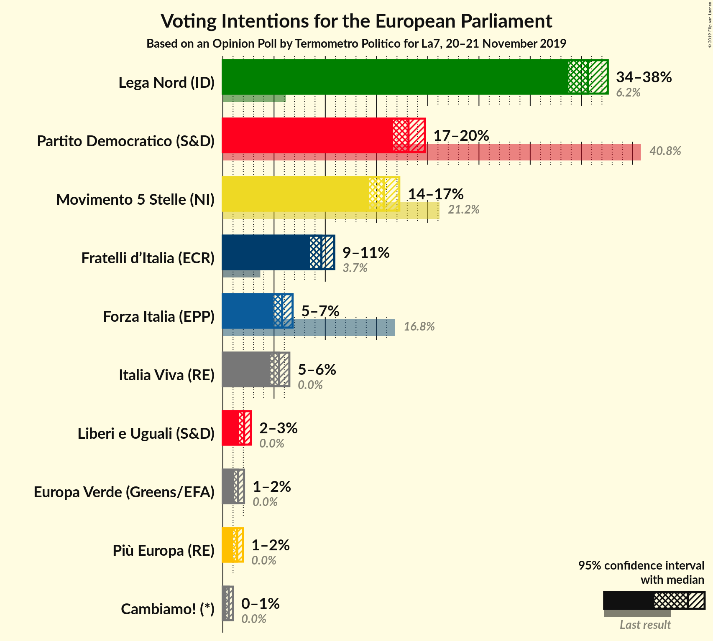
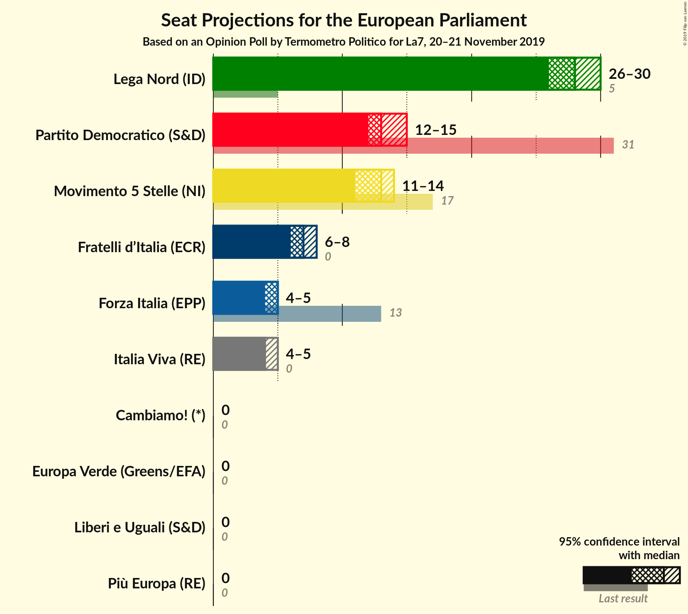
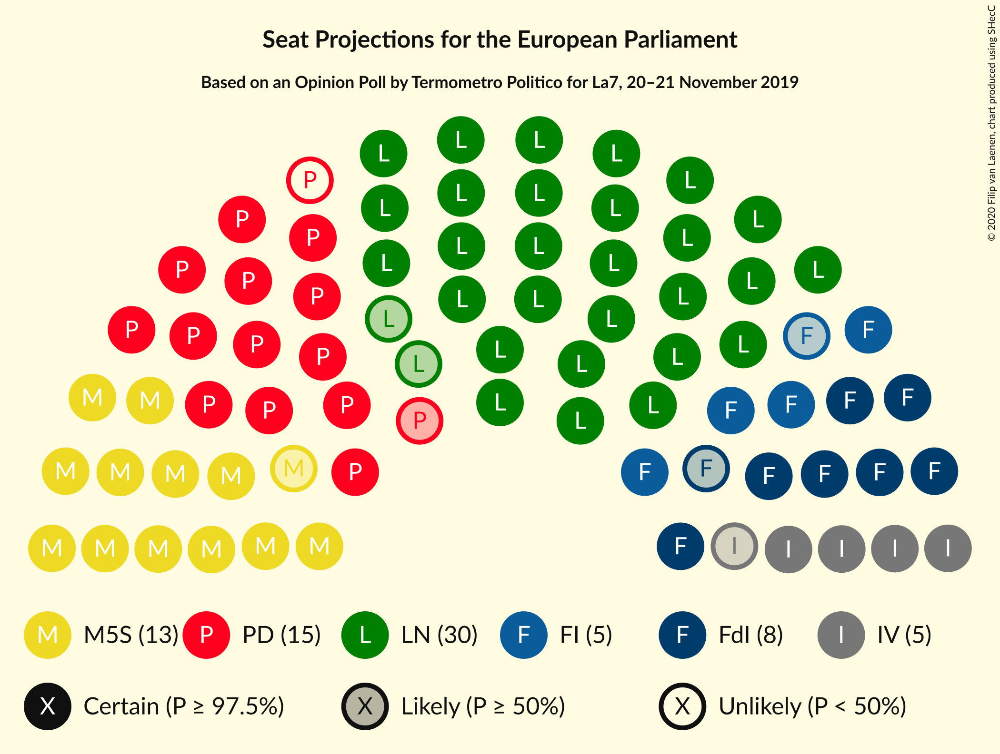

# Opinion Poll by Termometro Politico for La7, 20–21 November 2019

<a href="#voting-intentions">Voting Intentions</a> | <a href="#seats">Seats</a> | <a href="#coalitions">Coalitions</a> | <a href="#technical-information">Technical Information</a>

## Voting Intentions

### Confidence Intervals

| Party | Last Result | Poll Result | 80% Confidence Interval | 90% Confidence Interval | 95% Confidence Interval | 99% Confidence Interval |
|:-----:|:-----------:|:-----------:|:-----------------------:|:-----------------------:|:-----------------------:|:-----------------------:|
| Lega Nord (ID) | 6.2% | 35.6% | 34.4–36.9% |34.0–37.3% |33.7–37.6% |33.1–38.2% |
| Partito Democratico (S&D) | 40.8% | 18.1% | 17.1–19.2% |16.9–19.5% |16.6–19.7% |16.2–20.2% |
| Movimento 5 Stelle (NI) | 21.2% | 15.7% | 14.8–16.7% |14.5–17.0% |14.3–17.2% |13.9–17.7% |
| Fratelli d’Italia (ECR) | 3.7% | 9.6% | 8.9–10.4% |8.7–10.7% |8.5–10.9% |8.2–11.3% |
| Forza Italia (EPP) | 16.8% | 5.8% | 5.2–6.5% |5.1–6.6% |4.9–6.8% |4.7–7.1% |
| Italia Viva (RE) | 0.0% | 5.5% | 4.9–6.1% |4.8–6.3% |4.6–6.5% |4.4–6.8% |
| Liberi e Uguali (S&D) | 0.0% | 2.1% | 1.8–2.5% |1.7–2.6% |1.6–2.7% |1.4–3.0% |
| Europa Verde (Greens/EFA) | 0.0% | 1.5% | 1.2–1.9% |1.1–2.0% |1.1–2.1% |1.0–2.3% |
| Più Europa (RE) | 0.0% | 1.4% | 1.1–1.8% |1.1–1.9% |1.0–2.0% |0.9–2.2% |
| Azione (S&D) | N/A | 1.4% | 1.1–1.8% |1.1–1.9% |1.0–2.0% |0.9–2.2% |
| Cambiamo! (*) | 0.0% | 0.6% | 0.4–0.8% |0.4–0.9% |0.3–1.0% |0.3–1.1% |

*Note:* The poll result column reflects the actual value used in the calculations. Published results may vary slightly, and in addition be rounded to fewer digits.

## Seats

### Confidence Intervals

| Party | Last Result | Median | 80% Confidence Interval | 90% Confidence Interval | 95% Confidence Interval | 99% Confidence Interval |
|:-----:|:-----------:|:------:|:-----------------------:|:-----------------------:|:-----------------------:|:-----------------------:|
| <a href="#lega-nord-(id)">Lega Nord (ID)</a> | 5 | 29 | 28–30 |28–30 |27–31 |27–31 |
| <a href="#partito-democratico-(s&d)">Partito Democratico (S&D)</a> | 31 | 13 | 13–14 |13–15 |12–15 |12–15 |
| <a href="#movimento-5-stelle-(ni)">Movimento 5 Stelle (NI)</a> | 17 | 12 | 12–13 |12–13 |11–14 |11–14 |
| <a href="#fratelli-d’italia-(ecr)">Fratelli d’Italia (ECR)</a> | 0 | 8 | 8–9 |7–9 |7–9 |7–9 |
| <a href="#forza-italia-(epp)">Forza Italia (EPP)</a> | 13 | 5 | 4–5 |4–5 |4–5 |4–6 |
| <a href="#italia-viva-(re)">Italia Viva (RE)</a> | 0 | 5 | 4–5 |4–5 |4–5 |4–5 |
| <a href="#liberi-e-uguali-(s&d)">Liberi e Uguali (S&D)</a> | 0 | 0 | 0 |0 |0 |0 |
| <a href="#europa-verde-(greens/efa)">Europa Verde (Greens/EFA)</a> | 0 | 0 | 0 |0 |0 |0 |
| <a href="#più-europa-(re)">Più Europa (RE)</a> | 0 | 0 | 0 |0 |0 |0 |
| <a href="#azione-(s&d)">Azione (S&D)</a> | N/A | 0 | 0 |0 |0 |0 |
| <a href="#cambiamo!-(*)">Cambiamo! (*)</a> | 0 | 0 | 0 |0 |0 |0 |

