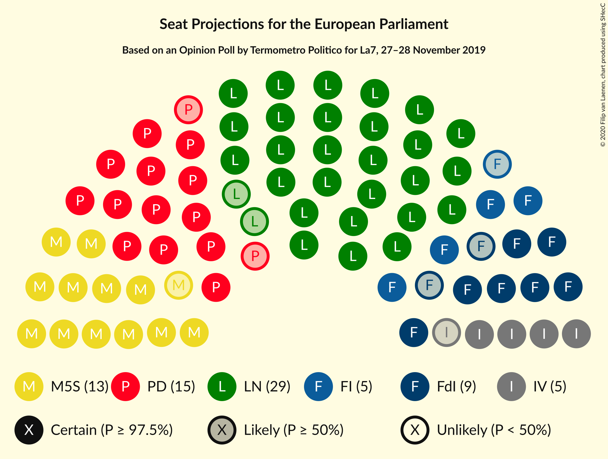

# Opinion Poll by Termometro Politico for La7, 27–28 November 2019

<a href="#voting-intentions">Voting Intentions</a> | <a href="#seats">Seats</a> | <a href="#coalitions">Coalitions</a> | <a href="#technical-information">Technical Information</a>

## Voting Intentions

### Confidence Intervals

| Party | Last Result | Poll Result | 80% Confidence Interval | 90% Confidence Interval | 95% Confidence Interval | 99% Confidence Interval |
|:-----:|:-----------:|:-----------:|:-----------------------:|:-----------------------:|:-----------------------:|:-----------------------:|
| Lega Nord (ID) | 6.2% | 34.6% | 33.2–36.0% |32.9–36.4% |32.5–36.7% |31.9–37.4% |
| Partito Democratico (S&D) | 40.8% | 18.6% | 17.5–19.8% |17.2–20.1% |16.9–20.4% |16.4–20.9% |
| Movimento 5 Stelle (NI) | 21.2% | 15.3% | 14.3–16.4% |14.0–16.7% |13.8–16.9% |13.3–17.5% |
| Fratelli d’Italia (ECR) | 3.7% | 10.1% | 9.3–11.0% |9.1–11.3% |8.9–11.5% |8.5–12.0% |
| Forza Italia (EPP) | 16.8% | 6.0% | 5.4–6.7% |5.2–7.0% |5.0–7.1% |4.8–7.5% |
| Italia Viva (RE) | 0.0% | 5.3% | 4.7–6.0% |4.5–6.2% |4.4–6.4% |4.1–6.7% |
| Liberi e Uguali (S&D) | 0.0% | 2.1% | 1.7–2.6% |1.6–2.7% |1.6–2.8% |1.4–3.1% |
| Azione (S&D) | N/A | 1.8% | 1.5–2.3% |1.4–2.4% |1.3–2.5% |1.2–2.7% |
| Più Europa (RE) | 0.0% | 1.5% | 1.2–1.9% |1.1–2.0% |1.1–2.1% |0.9–2.4% |
| Europa Verde (Greens/EFA) | 0.0% | 1.5% | 1.2–1.9% |1.1–2.0% |1.1–2.1% |0.9–2.4% |
| Cambiamo! (*) | 0.0% | 0.5% | 0.4–0.8% |0.3–0.9% |0.3–0.9% |0.2–1.1% |

*Note:* The poll result column reflects the actual value used in the calculations. Published results may vary slightly, and in addition be rounded to fewer digits.

## Seats

### Confidence Intervals

| Party | Last Result | Median | 80% Confidence Interval | 90% Confidence Interval | 95% Confidence Interval | 99% Confidence Interval |
|:-----:|:-----------:|:------:|:-----------------------:|:-----------------------:|:-----------------------:|:-----------------------:|
| <a href="#lega-nord-(id)">Lega Nord (ID)</a> | 5 | 28 | 27–29 |27–30 |26–30 |26–30 |
| <a href="#partito-democratico-(s&d)">Partito Democratico (S&D)</a> | 31 | 14 | 13–15 |13–15 |13–16 |12–16 |
| <a href="#movimento-5-stelle-(ni)">Movimento 5 Stelle (NI)</a> | 17 | 12 | 12–13 |11–14 |11–14 |11–14 |
| <a href="#fratelli-d’italia-(ecr)">Fratelli d’Italia (ECR)</a> | 0 | 8 | 7–9 |7–9 |7–9 |7–10 |
| <a href="#forza-italia-(epp)">Forza Italia (EPP)</a> | 13 | 5 | 4–6 |4–6 |4–6 |4–6 |
| <a href="#italia-viva-(re)">Italia Viva (RE)</a> | 0 | 4 | 4–5 |4–5 |3–5 |3–5 |
| <a href="#liberi-e-uguali-(s&d)">Liberi e Uguali (S&D)</a> | 0 | 0 | 0 |0 |0 |0 |
| <a href="#azione-(s&d)">Azione (S&D)</a> | N/A | 0 | 0 |0 |0 |0 |
| <a href="#più-europa-(re)">Più Europa (RE)</a> | 0 | 0 | 0 |0 |0 |0 |
| <a href="#europa-verde-(greens/efa)">Europa Verde (Greens/EFA)</a> | 0 | 0 | 0 |0 |0 |0 |
| <a href="#cambiamo!-(*)">Cambiamo! (*)</a> | 0 | 0 | 0 |0 |0 |0 |

