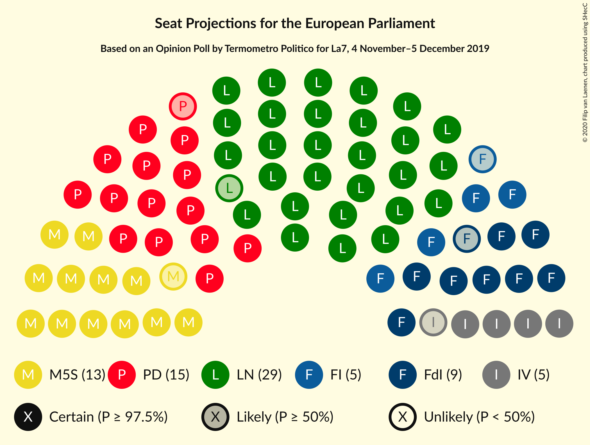

# Opinion Poll by Termometro Politico for La7, 4 November–5 December 2019

<a href="#voting-intentions">Voting Intentions</a> | <a href="#seats">Seats</a> | <a href="#coalitions">Coalitions</a> | <a href="#technical-information">Technical Information</a>

## Voting Intentions

### Confidence Intervals

| Party | Last Result | Poll Result | 80% Confidence Interval | 90% Confidence Interval | 95% Confidence Interval | 99% Confidence Interval |
|:-----:|:-----------:|:-----------:|:-----------------------:|:-----------------------:|:-----------------------:|:-----------------------:|
| Lega Nord (ID) | 6.2% | 34.9% | 33.7–36.2% |33.4–36.5% |33.1–36.8% |32.5–37.4% |
| Partito Democratico (S&D) | 40.8% | 18.6% | 17.6–19.6% |17.3–19.9% |17.1–20.2% |16.7–20.7% |
| Movimento 5 Stelle (NI) | 21.2% | 15.5% | 14.6–16.5% |14.4–16.8% |14.1–17.0% |13.7–17.5% |
| Fratelli d’Italia (ECR) | 3.7% | 10.2% | 9.4–11.0% |9.3–11.2% |9.1–11.5% |8.7–11.9% |
| Forza Italia (EPP) | 16.8% | 5.5% | 5.0–6.2% |4.8–6.3% |4.7–6.5% |4.4–6.8% |
| Italia Viva (RE) | 0.0% | 5.3% | 4.8–5.9% |4.6–6.1% |4.5–6.3% |4.3–6.6% |
| Liberi e Uguali (S&D) | 0.0% | 2.2% | 1.9–2.6% |1.8–2.8% |1.7–2.9% |1.5–3.1% |
| Azione (S&D) | N/A | 1.7% | 1.4–2.1% |1.3–2.2% |1.3–2.3% |1.1–2.5% |
| Più Europa (RE) | 0.0% | 1.6% | 1.3–2.0% |1.2–2.1% |1.2–2.2% |1.1–2.4% |
| Europa Verde (Greens/EFA) | 0.0% | 1.3% | 1.1–1.7% |1.0–1.8% |0.9–1.9% |0.8–2.0% |
| Cambiamo! (*) | 0.0% | 0.5% | 0.4–0.8% |0.3–0.8% |0.3–0.9% |0.2–1.0% |

*Note:* The poll result column reflects the actual value used in the calculations. Published results may vary slightly, and in addition be rounded to fewer digits.

## Seats

### Confidence Intervals

| Party | Last Result | Median | 80% Confidence Interval | 90% Confidence Interval | 95% Confidence Interval | 99% Confidence Interval |
|:-----:|:-----------:|:------:|:-----------------------:|:-----------------------:|:-----------------------:|:-----------------------:|
| <a href="#lega-nord-(id)">Lega Nord (ID)</a> | 5 | 28 | 27–29 |27–30 |27–30 |26–30 |
| <a href="#partito-democratico-(s&d)">Partito Democratico (S&D)</a> | 31 | 14 | 13–15 |13–15 |13–15 |12–16 |
| <a href="#movimento-5-stelle-(ni)">Movimento 5 Stelle (NI)</a> | 17 | 12 | 12–13 |12–14 |12–14 |11–14 |
| <a href="#fratelli-d’italia-(ecr)">Fratelli d’Italia (ECR)</a> | 0 | 8 | 8–9 |8–9 |7–9 |7–10 |
| <a href="#forza-italia-(epp)">Forza Italia (EPP)</a> | 13 | 4 | 4–5 |4–5 |4–5 |4–6 |
| <a href="#italia-viva-(re)">Italia Viva (RE)</a> | 0 | 4 | 4–5 |4–5 |4–5 |4–5 |
| <a href="#liberi-e-uguali-(s&d)">Liberi e Uguali (S&D)</a> | 0 | 0 | 0 |0 |0 |0 |
| <a href="#azione-(s&d)">Azione (S&D)</a> | N/A | 0 | 0 |0 |0 |0 |
| <a href="#più-europa-(re)">Più Europa (RE)</a> | 0 | 0 | 0 |0 |0 |0 |
| <a href="#europa-verde-(greens/efa)">Europa Verde (Greens/EFA)</a> | 0 | 0 | 0 |0 |0 |0 |
| <a href="#cambiamo!-(*)">Cambiamo! (*)</a> | 0 | 0 | 0 |0 |0 |0 |

