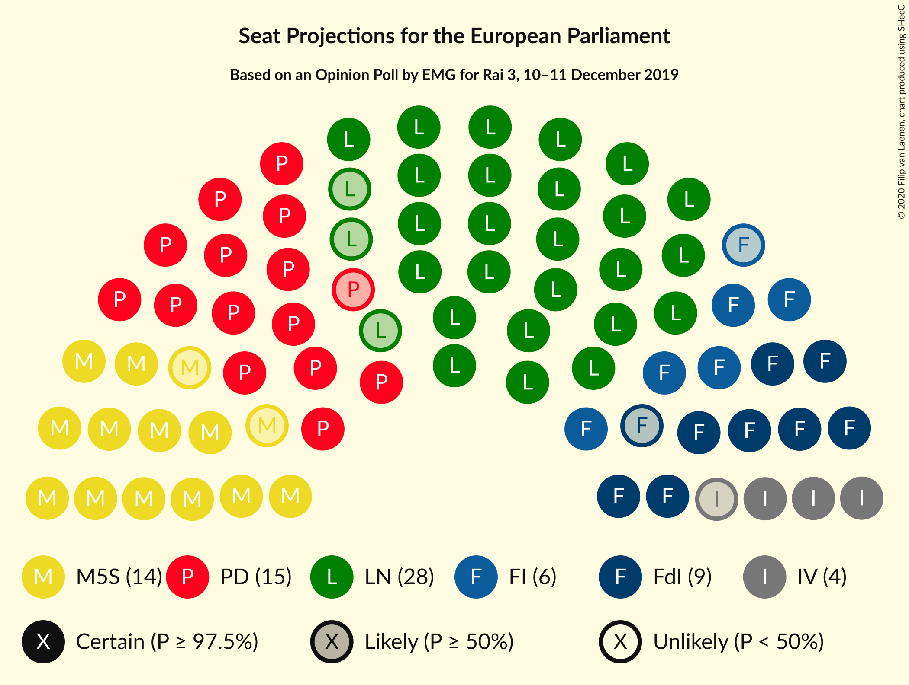

# Opinion Poll by EMG for Rai 3, 10–11 December 2019

<a href="#voting-intentions">Voting Intentions</a> | <a href="#seats">Seats</a> | <a href="#coalitions">Coalitions</a> | <a href="#technical-information">Technical Information</a>

## Voting Intentions

### Confidence Intervals

| Party | Last Result | Poll Result | 80% Confidence Interval | 90% Confidence Interval | 95% Confidence Interval | 99% Confidence Interval |
|:-----:|:-----------:|:-----------:|:-----------------------:|:-----------------------:|:-----------------------:|:-----------------------:|
| Lega Nord (ID) | 6.2% | 32.0% | 30.5–33.5% |30.1–34.0% |29.7–34.4% |29.0–35.1% |
| Partito Democratico (S&D) | 40.8% | 19.3% | 18.1–20.7% |17.7–21.0% |17.5–21.4% |16.9–22.0% |
| Movimento 5 Stelle (NI) | 21.2% | 15.7% | 14.6–16.9% |14.3–17.3% |14.0–17.6% |13.5–18.2% |
| Fratelli d’Italia (ECR) | 3.7% | 10.4% | 9.5–11.4% |9.2–11.7% |9.0–12.0% |8.6–12.5% |
| Forza Italia (EPP) | 16.8% | 6.7% | 6.0–7.6% |5.8–7.8% |5.6–8.1% |5.2–8.5% |
| Italia Viva (RE) | 0.0% | 5.2% | 4.5–6.0% |4.4–6.2% |4.2–6.4% |3.9–6.8% |
| Più Europa (RE) | 0.0% | 2.0% | 1.6–2.6% |1.5–2.7% |1.4–2.9% |1.3–3.1% |
| Azione (S&D) | N/A | 2.0% | 1.6–2.6% |1.5–2.7% |1.4–2.9% |1.3–3.1% |
| Liberi e Uguali (S&D) | 0.0% | 1.9% | 1.5–2.4% |1.4–2.6% |1.3–2.7% |1.2–3.0% |
| Europa Verde (Greens/EFA) | 0.0% | 1.5% | 1.2–2.0% |1.1–2.1% |1.0–2.3% |0.9–2.5% |
| Cambiamo! (*) | 0.0% | 1.0% | 0.7–1.4% |0.7–1.5% |0.6–1.6% |0.5–1.9% |

*Note:* The poll result column reflects the actual value used in the calculations. Published results may vary slightly, and in addition be rounded to fewer digits.

## Seats

### Confidence Intervals

| Party | Last Result | Median | 80% Confidence Interval | 90% Confidence Interval | 95% Confidence Interval | 99% Confidence Interval |
|:-----:|:-----------:|:------:|:-----------------------:|:-----------------------:|:-----------------------:|:-----------------------:|
| <a href="#lega-nord-(id)">Lega Nord (ID)</a> | 5 | 27 | 25–27 |25–28 |24–28 |24–29 |
| <a href="#partito-democratico-(s&d)">Partito Democratico (S&D)</a> | 31 | 14 | 14–16 |14–16 |13–17 |13–17 |
| <a href="#movimento-5-stelle-(ni)">Movimento 5 Stelle (NI)</a> | 17 | 13 | 12–14 |12–14 |11–14 |11–15 |
| <a href="#fratelli-d’italia-(ecr)">Fratelli d’Italia (ECR)</a> | 0 | 9 | 8–10 |8–10 |7–10 |7–10 |
| <a href="#forza-italia-(epp)">Forza Italia (EPP)</a> | 13 | 5 | 5–6 |5–6 |5–7 |4–7 |
| <a href="#italia-viva-(re)">Italia Viva (RE)</a> | 0 | 4 | 4–5 |4–5 |3–5 |0–6 |
| <a href="#più-europa-(re)">Più Europa (RE)</a> | 0 | 0 | 0 |0 |0 |0 |
| <a href="#azione-(s&d)">Azione (S&D)</a> | N/A | 0 | 0 |0 |0 |0 |
| <a href="#liberi-e-uguali-(s&d)">Liberi e Uguali (S&D)</a> | 0 | 0 | 0 |0 |0 |0 |
| <a href="#europa-verde-(greens/efa)">Europa Verde (Greens/EFA)</a> | 0 | 0 | 0 |0 |0 |0 |
| <a href="#cambiamo!-(*)">Cambiamo! (*)</a> | 0 | 0 | 0 |0 |0 |0 |

