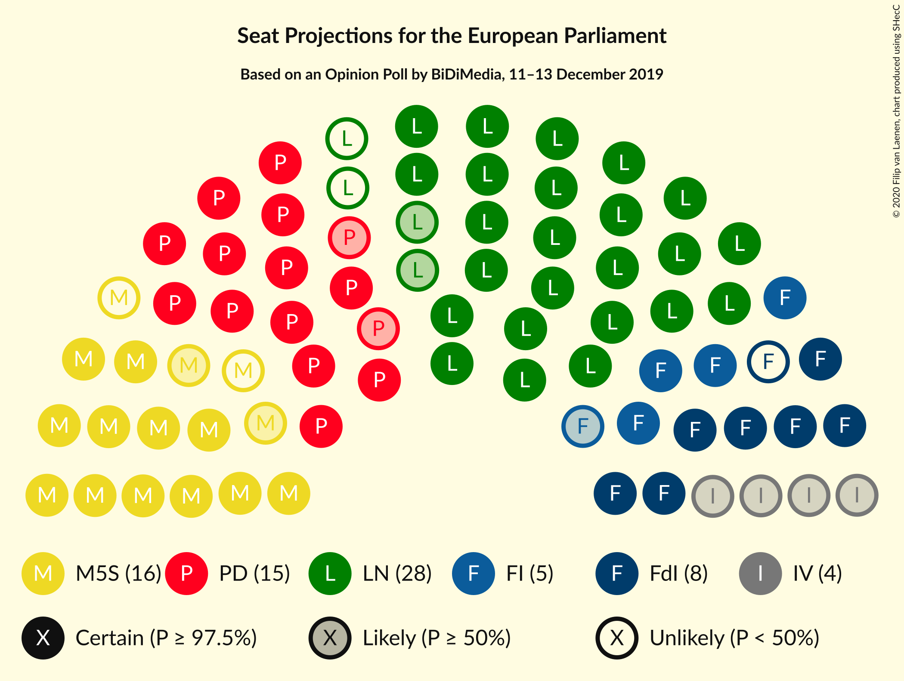

# Opinion Poll by BiDiMedia, 11–13 December 2019

<a href="#voting-intentions">Voting Intentions</a> | <a href="#seats">Seats</a> | <a href="#coalitions">Coalitions</a> | <a href="#technical-information">Technical Information</a>

## Voting Intentions

### Confidence Intervals

| Party | Last Result | Poll Result | 80% Confidence Interval | 90% Confidence Interval | 95% Confidence Interval | 99% Confidence Interval |
|:-----:|:-----------:|:-----------:|:-----------------------:|:-----------------------:|:-----------------------:|:-----------------------:|
| Lega Nord (ID) | 6.2% | 31.8% | 30.2–33.4% |29.8–33.9% |29.4–34.3% |28.7–35.1% |
| Partito Democratico (S&D) | 40.8% | 18.8% | 17.5–20.2% |17.1–20.6% |16.8–20.9% |16.2–21.6% |
| Movimento 5 Stelle (NI) | 21.2% | 17.0% | 15.8–18.4% |15.4–18.7% |15.1–19.1% |14.5–19.7% |
| Fratelli d’Italia (ECR) | 3.7% | 9.5% | 8.6–10.6% |8.3–10.9% |8.1–11.2% |7.7–11.7% |
| Forza Italia (EPP) | 16.8% | 5.8% | 5.1–6.7% |4.9–7.0% |4.7–7.2% |4.4–7.6% |
| Italia Viva (RE) | 0.0% | 4.8% | 4.1–5.6% |3.9–5.8% |3.8–6.0% |3.5–6.4% |
| Azione (S&D) | N/A | 2.1% | 1.7–2.7% |1.6–2.9% |1.5–3.0% |1.3–3.3% |
| Liberi e Uguali (S&D) | 0.0% | 1.8% | 1.4–2.3% |1.3–2.5% |1.2–2.6% |1.0–2.9% |
| Più Europa (RE) | 0.0% | 1.6% | 1.2–2.1% |1.1–2.2% |1.0–2.4% |0.9–2.6% |
| Europa Verde (Greens/EFA) | 0.0% | 1.5% | 1.1–2.0% |1.1–2.1% |1.0–2.3% |0.8–2.5% |
| Cambiamo! (*) | 0.0% | 0.8% | 0.5–1.2% |0.5–1.3% |0.4–1.4% |0.4–1.6% |

*Note:* The poll result column reflects the actual value used in the calculations. Published results may vary slightly, and in addition be rounded to fewer digits.

## Seats

### Confidence Intervals

| Party | Last Result | Median | 80% Confidence Interval | 90% Confidence Interval | 95% Confidence Interval | 99% Confidence Interval |
|:-----:|:-----------:|:------:|:-----------------------:|:-----------------------:|:-----------------------:|:-----------------------:|
| <a href="#lega-nord-(id)">Lega Nord (ID)</a> | 5 | 25 | 24–27 |24–27 |23–28 |23–29 |
| <a href="#partito-democratico-(s&d)">Partito Democratico (S&D)</a> | 31 | 14 | 13–15 |13–15 |13–16 |12–16 |
| <a href="#movimento-5-stelle-(ni)">Movimento 5 Stelle (NI)</a> | 17 | 13 | 12–15 |12–15 |12–15 |12–16 |
| <a href="#fratelli-d’italia-(ecr)">Fratelli d’Italia (ECR)</a> | 0 | 7 | 7–8 |7–9 |6–9 |6–10 |
| <a href="#forza-italia-(epp)">Forza Italia (EPP)</a> | 13 | 5 | 4–5 |4–5 |4–6 |4–6 |
| <a href="#italia-viva-(re)">Italia Viva (RE)</a> | 0 | 4 | 3–4 |3–5 |0–5 |0–5 |
| <a href="#azione-(s&d)">Azione (S&D)</a> | N/A | 0 | 0 |0 |0 |0 |
| <a href="#liberi-e-uguali-(s&d)">Liberi e Uguali (S&D)</a> | 0 | 0 | 0 |0 |0 |0 |
| <a href="#più-europa-(re)">Più Europa (RE)</a> | 0 | 0 | 0 |0 |0 |0 |
| <a href="#europa-verde-(greens/efa)">Europa Verde (Greens/EFA)</a> | 0 | 0 | 0 |0 |0 |0 |
| <a href="#cambiamo!-(*)">Cambiamo! (*)</a> | 0 | 0 | 0 |0 |0 |0 |

