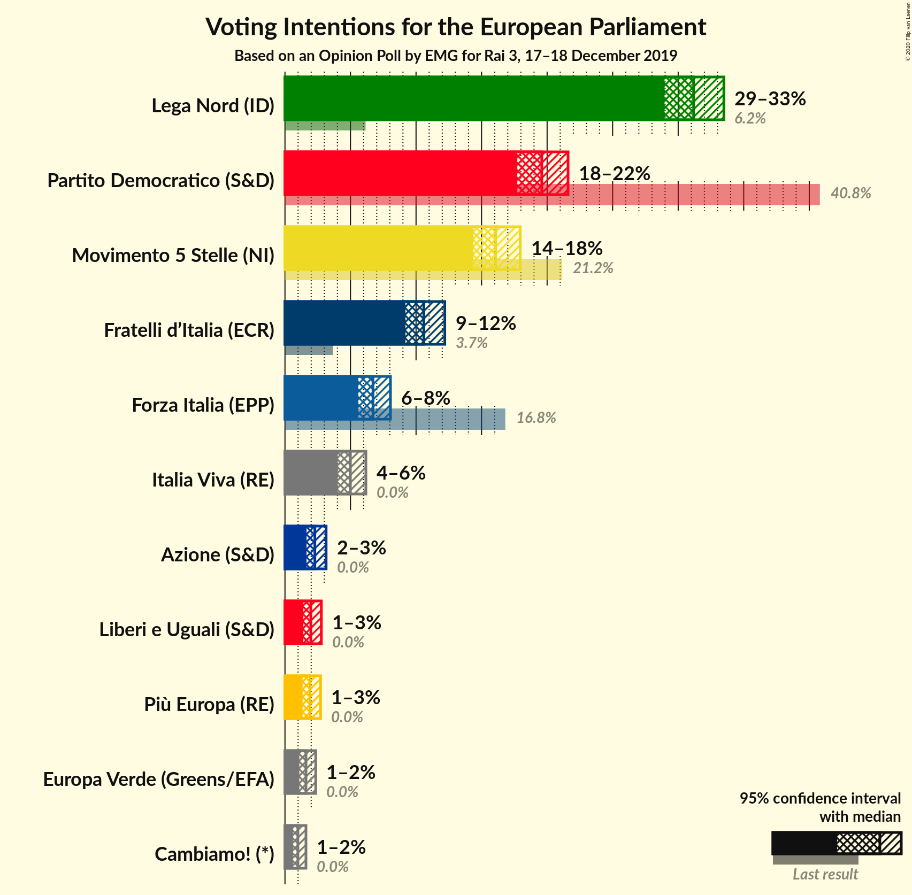
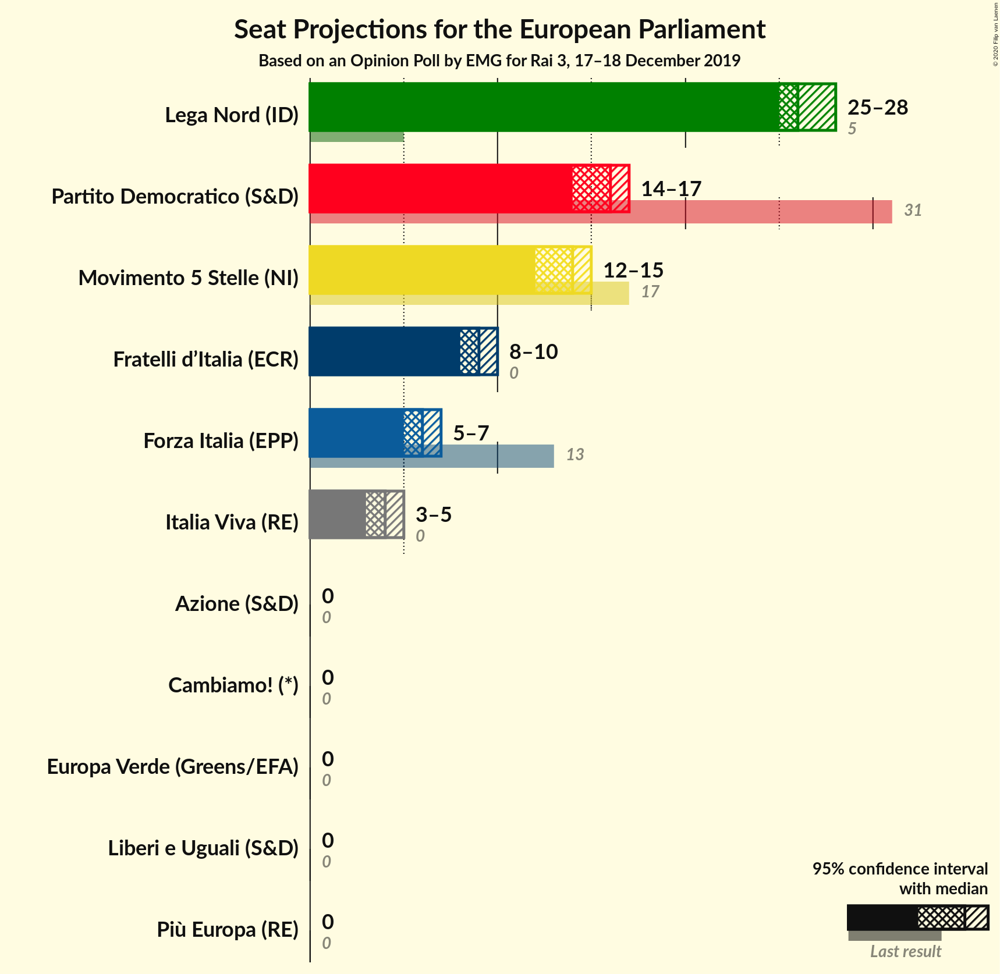
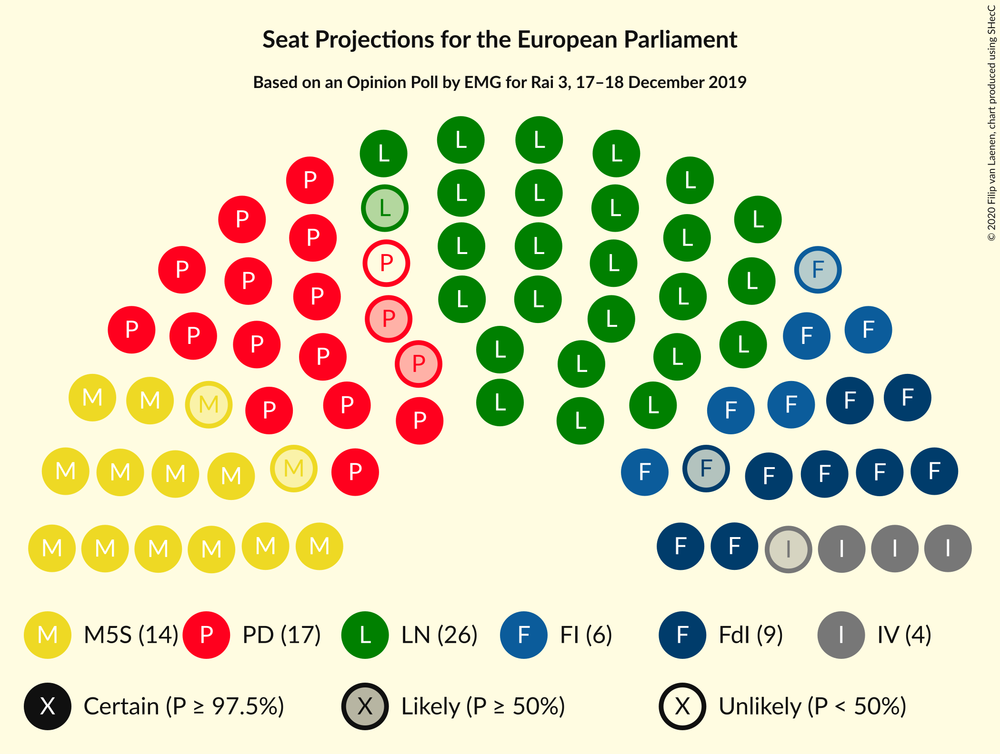

# Opinion Poll by EMG for Rai 3, 17–18 December 2019

<a href="#voting-intentions">Voting Intentions</a> | <a href="#seats">Seats</a> | <a href="#coalitions">Coalitions</a> | <a href="#technical-information">Technical Information</a>

## Voting Intentions

### Confidence Intervals

| Party | Last Result | Poll Result | 80% Confidence Interval | 90% Confidence Interval | 95% Confidence Interval | 99% Confidence Interval |
|:-----:|:-----------:|:-----------:|:-----------------------:|:-----------------------:|:-----------------------:|:-----------------------:|
| Lega Nord (ID) | 6.2% | 31.2% | 29.7–32.7% |29.3–33.1% |29.0–33.5% |28.3–34.2% |
| Partito Democratico (S&D) | 40.8% | 19.6% | 18.4–20.9% |18.0–21.3% |17.7–21.6% |17.2–22.2% |
| Movimento 5 Stelle (NI) | 21.2% | 16.1% | 15.0–17.3% |14.6–17.6% |14.4–18.0% |13.8–18.5% |
| Fratelli d’Italia (ECR) | 3.7% | 10.6% | 9.7–11.6% |9.4–11.9% |9.2–12.2% |8.8–12.7% |
| Forza Italia (EPP) | 16.8% | 6.7% | 6.0–7.6% |5.8–7.8% |5.6–8.0% |5.3–8.5% |
| Italia Viva (RE) | 0.0% | 5.0% | 4.4–5.8% |4.2–6.0% |4.0–6.2% |3.7–6.6% |
| Azione (S&D) | N/A | 2.3% | 1.9–2.8% |1.8–3.0% |1.6–3.1% |1.5–3.4% |
| Liberi e Uguali (S&D) | 0.0% | 2.0% | 1.6–2.5% |1.5–2.7% |1.4–2.8% |1.2–3.0% |
| Più Europa (RE) | 0.0% | 1.9% | 1.5–2.4% |1.4–2.6% |1.3–2.7% |1.2–3.0% |
| Europa Verde (Greens/EFA) | 0.0% | 1.6% | 1.3–2.1% |1.2–2.2% |1.1–2.3% |0.9–2.6% |
| Cambiamo! (*) | 0.0% | 1.0% | 0.7–1.4% |0.7–1.5% |0.6–1.6% |0.5–1.8% |

*Note:* The poll result column reflects the actual value used in the calculations. Published results may vary slightly, and in addition be rounded to fewer digits.

## Seats

### Confidence Intervals

| Party | Last Result | Median | 80% Confidence Interval | 90% Confidence Interval | 95% Confidence Interval | 99% Confidence Interval |
|:-----:|:-----------:|:------:|:-----------------------:|:-----------------------:|:-----------------------:|:-----------------------:|
| <a href="#lega-nord-(id)">Lega Nord (ID)</a> | 5 | 25 | 24–26 |24–27 |24–27 |23–28 |
| <a href="#partito-democratico-(s&d)">Partito Democratico (S&D)</a> | 31 | 16 | 14–16 |14–16 |14–17 |13–17 |
| <a href="#movimento-5-stelle-(ni)">Movimento 5 Stelle (NI)</a> | 17 | 13 | 12–14 |12–14 |12–14 |11–15 |
| <a href="#fratelli-d’italia-(ecr)">Fratelli d’Italia (ECR)</a> | 0 | 8 | 8–10 |8–10 |8–10 |7–10 |
| <a href="#forza-italia-(epp)">Forza Italia (EPP)</a> | 13 | 6 | 5–6 |5–6 |5–7 |4–7 |
| <a href="#italia-viva-(re)">Italia Viva (RE)</a> | 0 | 4 | 4–5 |4–5 |3–5 |0–5 |
| <a href="#azione-(s&d)">Azione (S&D)</a> | N/A | 0 | 0 |0 |0 |0 |
| <a href="#liberi-e-uguali-(s&d)">Liberi e Uguali (S&D)</a> | 0 | 0 | 0 |0 |0 |0 |
| <a href="#più-europa-(re)">Più Europa (RE)</a> | 0 | 0 | 0 |0 |0 |0 |
| <a href="#europa-verde-(greens/efa)">Europa Verde (Greens/EFA)</a> | 0 | 0 | 0 |0 |0 |0 |
| <a href="#cambiamo!-(*)">Cambiamo! (*)</a> | 0 | 0 | 0 |0 |0 |0 |

