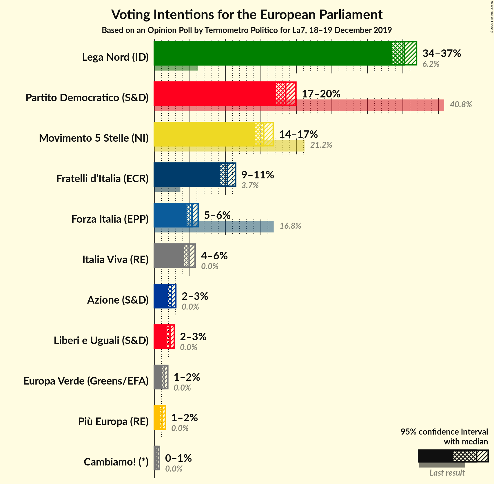
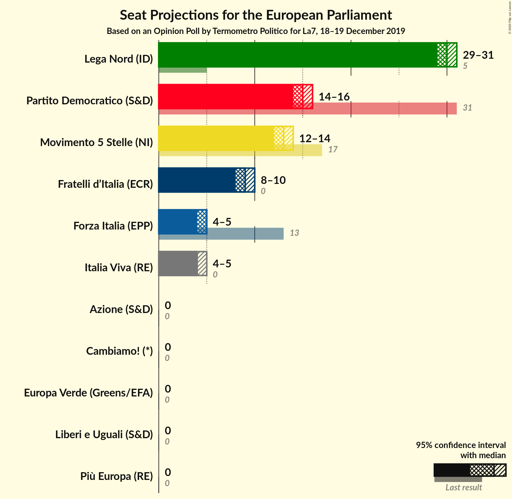
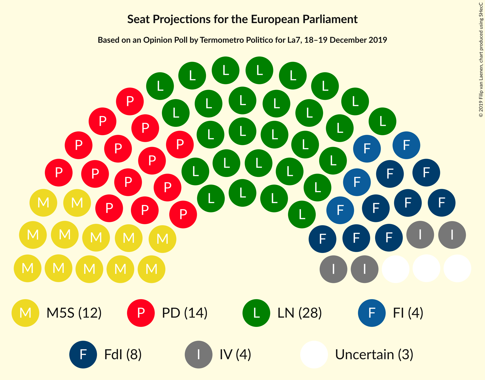

# Opinion Poll by Termometro Politico for La7, 18–19 December 2019

<a href="#voting-intentions">Voting Intentions</a> | <a href="#seats">Seats</a> | <a href="#coalitions">Coalitions</a> | <a href="#technical-information">Technical Information</a>

## Voting Intentions

### Confidence Intervals

| Party | Last Result | Poll Result | 80% Confidence Interval | 90% Confidence Interval | 95% Confidence Interval | 99% Confidence Interval |
|:-----:|:-----------:|:-----------:|:-----------------------:|:-----------------------:|:-----------------------:|:-----------------------:|
| Lega Nord (ID) | 6.2% | 35.2% | 34.1–36.3% |33.8–36.7% |33.5–36.9% |33.0–37.5% |
| Partito Democratico (S&D) | 40.8% | 18.5% | 17.6–19.4% |17.4–19.7% |17.1–19.9% |16.7–20.4% |
| Movimento 5 Stelle (NI) | 21.2% | 15.4% | 14.6–16.3% |14.3–16.5% |14.1–16.8% |13.8–17.2% |
| Fratelli d’Italia (ECR) | 3.7% | 10.3% | 9.6–11.1% |9.4–11.3% |9.3–11.4% |8.9–11.8% |
| Forza Italia (EPP) | 16.8% | 5.3% | 4.8–5.9% |4.7–6.0% |4.5–6.2% |4.3–6.4% |
| Italia Viva (RE) | 0.0% | 4.9% | 4.4–5.5% |4.3–5.6% |4.2–5.7% |4.0–6.0% |
| Azione (S&D) | N/A | 2.4% | 2.1–2.8% |2.0–2.9% |1.9–3.0% |1.8–3.2% |
| Liberi e Uguali (S&D) | 0.0% | 2.2% | 1.9–2.6% |1.8–2.7% |1.7–2.8% |1.6–3.0% |
| Europa Verde (Greens/EFA) | 0.0% | 1.4% | 1.2–1.7% |1.1–1.8% |1.0–1.9% |0.9–2.1% |
| Più Europa (RE) | 0.0% | 1.1% | 0.9–1.4% |0.8–1.5% |0.8–1.6% |0.7–1.7% |
| Cambiamo! (*) | 0.0% | 0.4% | 0.3–0.6% |0.2–0.7% |0.2–0.7% |0.2–0.8% |

*Note:* The poll result column reflects the actual value used in the calculations. Published results may vary slightly, and in addition be rounded to fewer digits.

## Seats

### Confidence Intervals

| Party | Last Result | Median | 80% Confidence Interval | 90% Confidence Interval | 95% Confidence Interval | 99% Confidence Interval |
|:-----:|:-----------:|:------:|:-----------------------:|:-----------------------:|:-----------------------:|:-----------------------:|
| <a href="#lega-nord-(id)">Lega Nord (ID)</a> | 5 | 28 | 28–29 |28–30 |28–30 |27–30 |
| <a href="#partito-democratico-(s&d)">Partito Democratico (S&D)</a> | 31 | 14 | 13–15 |13–15 |13–15 |13–16 |
| <a href="#movimento-5-stelle-(ni)">Movimento 5 Stelle (NI)</a> | 17 | 12 | 12–13 |12–13 |11–13 |11–14 |
| <a href="#fratelli-d’italia-(ecr)">Fratelli d’Italia (ECR)</a> | 0 | 8 | 8–9 |8–9 |7–9 |7–10 |
| <a href="#forza-italia-(epp)">Forza Italia (EPP)</a> | 13 | 4 | 4–5 |4–5 |4–5 |4–5 |
| <a href="#italia-viva-(re)">Italia Viva (RE)</a> | 0 | 4 | 4–5 |4–5 |4–5 |3–5 |
| <a href="#azione-(s&d)">Azione (S&D)</a> | N/A | 0 | 0 |0 |0 |0 |
| <a href="#liberi-e-uguali-(s&d)">Liberi e Uguali (S&D)</a> | 0 | 0 | 0 |0 |0 |0 |
| <a href="#europa-verde-(greens/efa)">Europa Verde (Greens/EFA)</a> | 0 | 0 | 0 |0 |0 |0 |
| <a href="#più-europa-(re)">Più Europa (RE)</a> | 0 | 0 | 0 |0 |0 |0 |
| <a href="#cambiamo!-(*)">Cambiamo! (*)</a> | 0 | 0 | 0 |0 |0 |0 |

