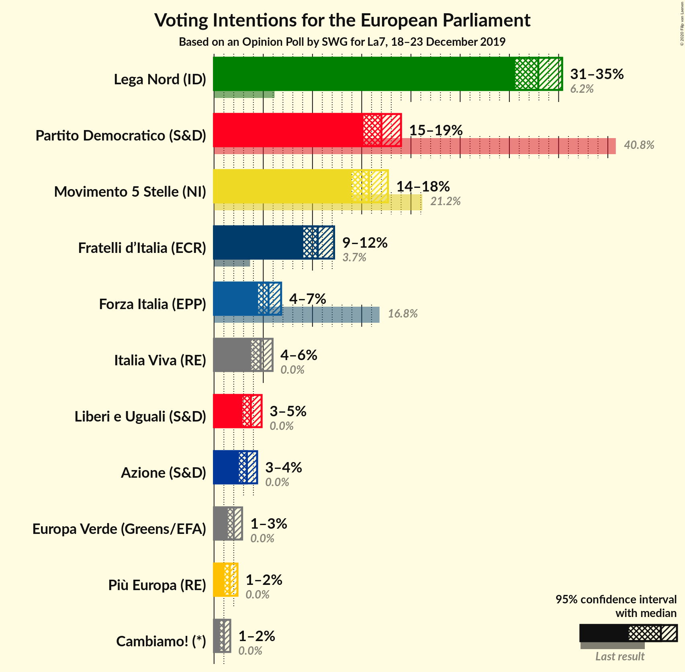
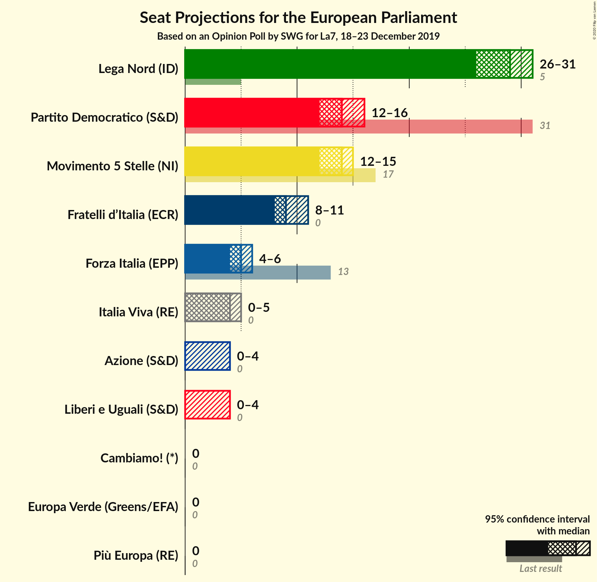
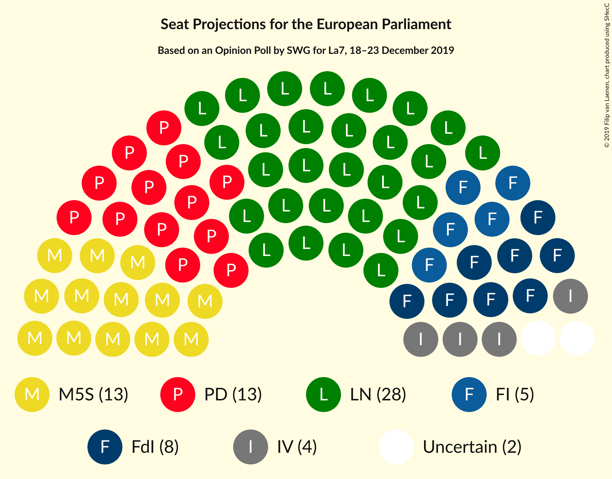

# Opinion Poll by SWG for La7, 18–23 December 2019

<a href="#voting-intentions">Voting Intentions</a> | <a href="#seats">Seats</a> | <a href="#coalitions">Coalitions</a> | <a href="#technical-information">Technical Information</a>

## Voting Intentions

### Confidence Intervals

| Party | Last Result | Poll Result | 80% Confidence Interval | 90% Confidence Interval | 95% Confidence Interval | 99% Confidence Interval |
|:-----:|:-----------:|:-----------:|:-----------------------:|:-----------------------:|:-----------------------:|:-----------------------:|
| Lega Nord (ID) | 6.2% | 32.9% | 31.4–34.5% |31.0–35.0% |30.6–35.4% |29.9–36.1% |
| Partito Democratico (S&D) | 40.8% | 17.0% | 15.8–18.3% |15.5–18.7% |15.2–19.0% |14.6–19.6% |
| Movimento 5 Stelle (NI) | 21.2% | 15.7% | 14.6–17.0% |14.3–17.4% |14.0–17.7% |13.4–18.3% |
| Fratelli d’Italia (ECR) | 3.7% | 10.5% | 9.6–11.6% |9.3–11.9% |9.1–12.2% |8.6–12.7% |
| Forza Italia (EPP) | 16.8% | 5.5% | 4.8–6.4% |4.6–6.6% |4.5–6.8% |4.2–7.2% |
| Italia Viva (RE) | 0.0% | 4.7% | 4.1–5.5% |3.9–5.7% |3.8–5.9% |3.5–6.3% |
| Liberi e Uguali (S&D) | 0.0% | 3.7% | 3.2–4.5% |3.0–4.6% |2.9–4.8% |2.6–5.2% |
| Azione (S&D) | N/A | 3.3% | 2.8–4.0% |2.7–4.2% |2.5–4.4% |2.3–4.7% |
| Europa Verde (Greens/EFA) | 0.0% | 2.0% | 1.6–2.6% |1.5–2.7% |1.4–2.9% |1.2–3.1% |
| Più Europa (RE) | 0.0% | 1.6% | 1.2–2.1% |1.2–2.3% |1.1–2.4% |0.9–2.6% |
| Cambiamo! (*) | 0.0% | 1.0% | 0.7–1.4% |0.7–1.5% |0.6–1.6% |0.5–1.9% |

*Note:* The poll result column reflects the actual value used in the calculations. Published results may vary slightly, and in addition be rounded to fewer digits.

## Seats

### Confidence Intervals

| Party | Last Result | Median | 80% Confidence Interval | 90% Confidence Interval | 95% Confidence Interval | 99% Confidence Interval |
|:-----:|:-----------:|:------:|:-----------------------:|:-----------------------:|:-----------------------:|:-----------------------:|
| <a href="#lega-nord-(id)">Lega Nord (ID)</a> | 5 | 28 | 25–29 |25–30 |25–30 |24–30 |
| <a href="#partito-democratico-(s&d)">Partito Democratico (S&D)</a> | 31 | 13 | 12–14 |12–15 |11–15 |11–16 |
| <a href="#movimento-5-stelle-(ni)">Movimento 5 Stelle (NI)</a> | 17 | 13 | 12–14 |12–14 |12–15 |11–16 |
| <a href="#fratelli-d’italia-(ecr)">Fratelli d’Italia (ECR)</a> | 0 | 8 | 8–10 |8–10 |8–10 |7–11 |
| <a href="#forza-italia-(epp)">Forza Italia (EPP)</a> | 13 | 5 | 4–5 |4–5 |4–5 |4–6 |
| <a href="#italia-viva-(re)">Italia Viva (RE)</a> | 0 | 4 | 3–5 |0–5 |0–5 |0–5 |
| <a href="#liberi-e-uguali-(s&d)">Liberi e Uguali (S&D)</a> | 0 | 0 | 0–3 |0–4 |0–4 |0–4 |
| <a href="#azione-(s&d)">Azione (S&D)</a> | N/A | 0 | 0–3 |0–3 |0–3 |0–4 |
| <a href="#europa-verde-(greens/efa)">Europa Verde (Greens/EFA)</a> | 0 | 0 | 0 |0 |0 |0 |
| <a href="#più-europa-(re)">Più Europa (RE)</a> | 0 | 0 | 0 |0 |0 |0 |
| <a href="#cambiamo!-(*)">Cambiamo! (*)</a> | 0 | 0 | 0 |0 |0 |0 |

