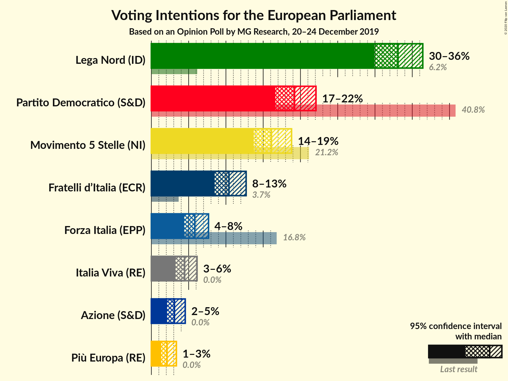
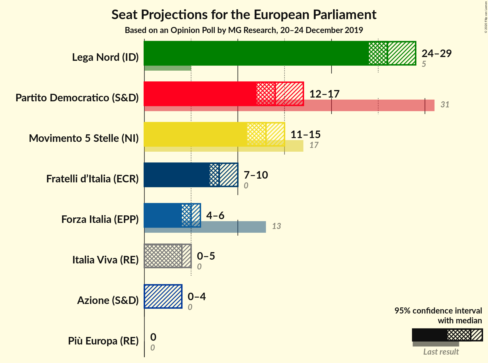
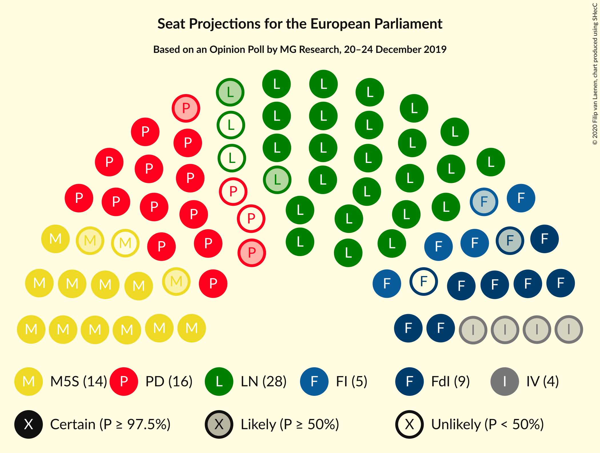

# Opinion Poll by MG Research, 20–24 December 2019

<a href="#voting-intentions">Voting Intentions</a> | <a href="#seats">Seats</a> | <a href="#coalitions">Coalitions</a> | <a href="#technical-information">Technical Information</a>

## Voting Intentions

### Confidence Intervals

| Party | Last Result | Poll Result | 80% Confidence Interval | 90% Confidence Interval | 95% Confidence Interval | 99% Confidence Interval |
|:-----:|:-----------:|:-----------:|:-----------------------:|:-----------------------:|:-----------------------:|:-----------------------:|
| Lega Nord (ID) | 6.2% | 33.1% | 31.0–35.3% |30.4–35.9% |29.9–36.4% |28.9–37.5% |
| Partito Democratico (S&D) | 40.8% | 19.2% | 17.5–21.1% |17.0–21.6% |16.6–22.1% |15.9–23.0% |
| Movimento 5 Stelle (NI) | 21.2% | 16.1% | 14.5–17.9% |14.1–18.4% |13.7–18.8% |13.0–19.7% |
| Fratelli d’Italia (ECR) | 3.7% | 10.4% | 9.1–11.9% |8.8–12.3% |8.5–12.7% |7.9–13.5% |
| Forza Italia (EPP) | 16.8% | 5.8% | 4.9–7.0% |4.6–7.4% |4.4–7.7% |4.0–8.3% |
| Italia Viva (RE) | 0.0% | 4.5% | 3.7–5.5% |3.4–5.9% |3.2–6.1% |2.9–6.7% |
| Azione (S&D) | N/A | 3.1% | 2.4–4.0% |2.3–4.3% |2.1–4.5% |1.8–5.0% |
| Più Europa (RE) | 0.0% | 2.1% | 1.6–2.9% |1.4–3.1% |1.3–3.4% |1.1–3.8% |

*Note:* The poll result column reflects the actual value used in the calculations. Published results may vary slightly, and in addition be rounded to fewer digits.

## Seats

### Confidence Intervals

| Party | Last Result | Median | 80% Confidence Interval | 90% Confidence Interval | 95% Confidence Interval | 99% Confidence Interval |
|:-----:|:-----------:|:------:|:-----------------------:|:-----------------------:|:-----------------------:|:-----------------------:|
| <a href="#lega-nord-(id)">Lega Nord (ID)</a> | 5 | 25 | 24–27 |23–28 |23–28 |22–29 |
| <a href="#partito-democratico-(s&d)">Partito Democratico (S&D)</a> | 31 | 14 | 12–15 |12–16 |12–16 |11–17 |
| <a href="#movimento-5-stelle-(ni)">Movimento 5 Stelle (NI)</a> | 17 | 13 | 11–14 |11–14 |10–15 |10–15 |
| <a href="#fratelli-d’italia-(ecr)">Fratelli d’Italia (ECR)</a> | 0 | 8 | 7–9 |6–10 |6–10 |6–10 |
| <a href="#forza-italia-(epp)">Forza Italia (EPP)</a> | 13 | 4 | 4–6 |4–6 |3–6 |3–6 |
| <a href="#italia-viva-(re)">Italia Viva (RE)</a> | 0 | 3 | 0–4 |0–4 |0–5 |0–5 |
| <a href="#azione-(s&d)">Azione (S&D)</a> | N/A | 0 | 0–3 |0–3 |0–3 |0–4 |
| <a href="#più-europa-(re)">Più Europa (RE)</a> | 0 | 0 | 0 |0 |0 |0 |

