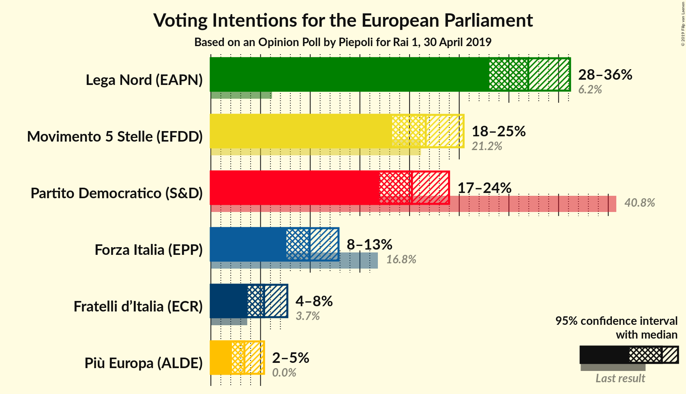
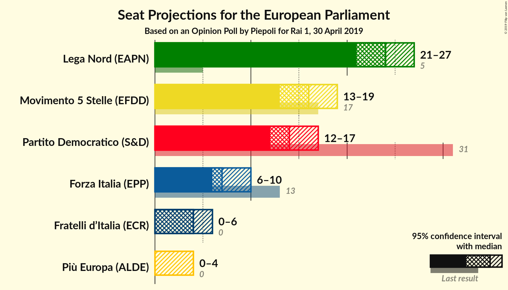
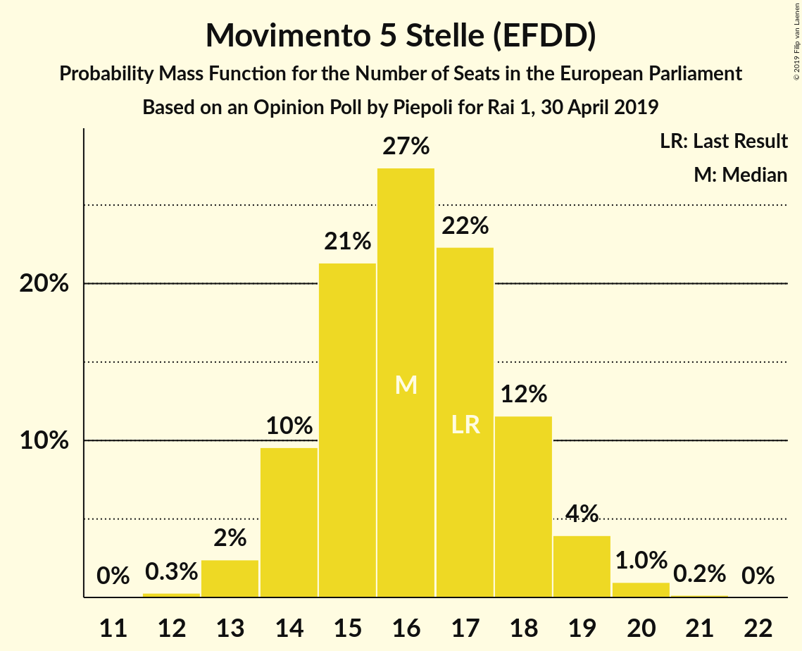
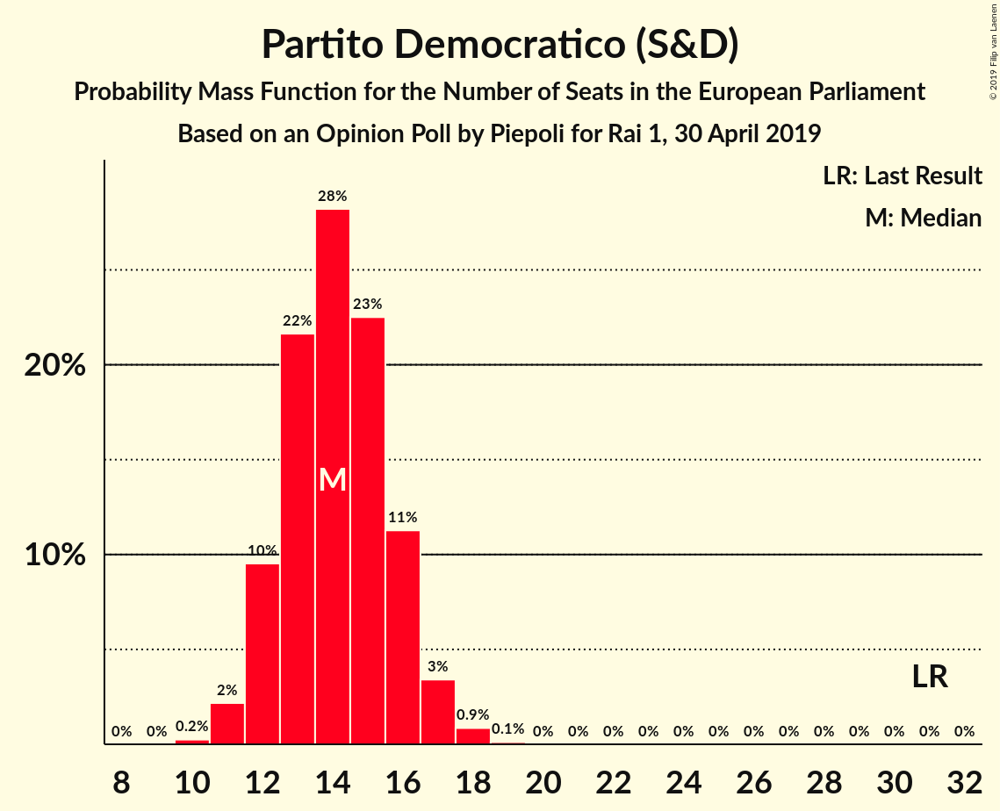
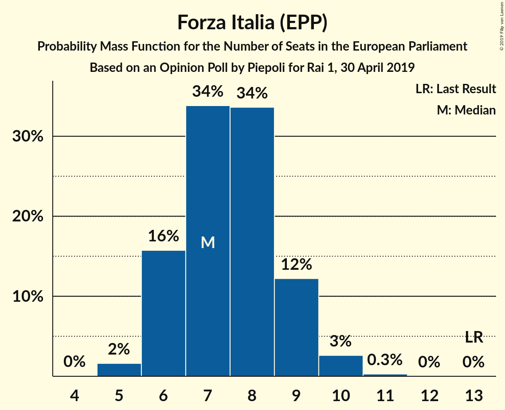
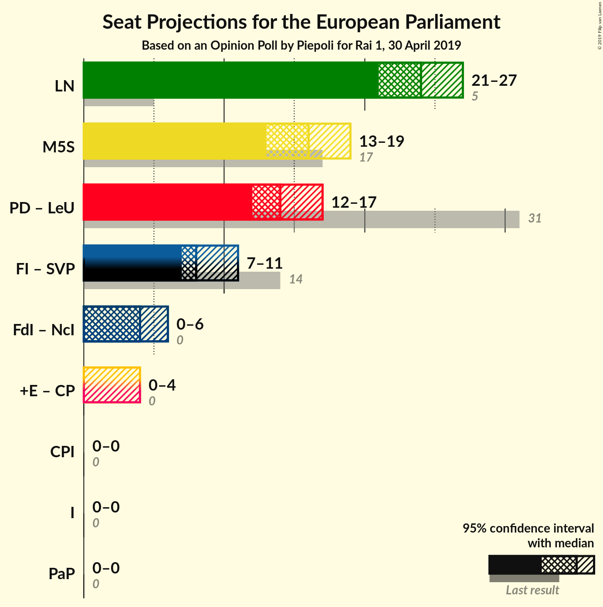
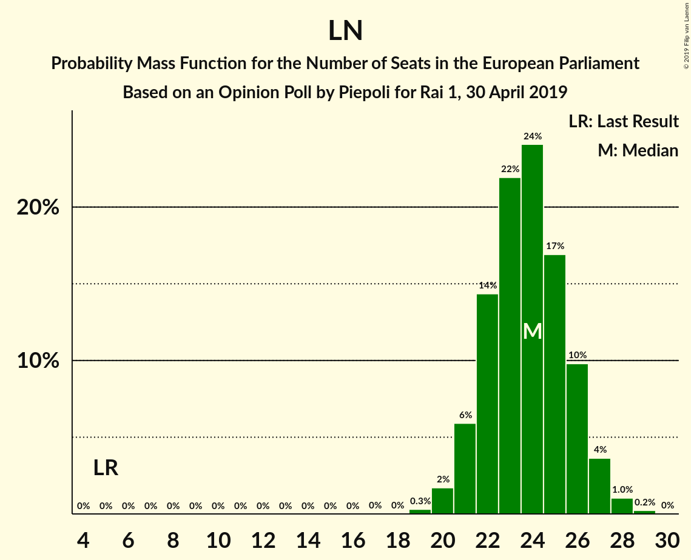
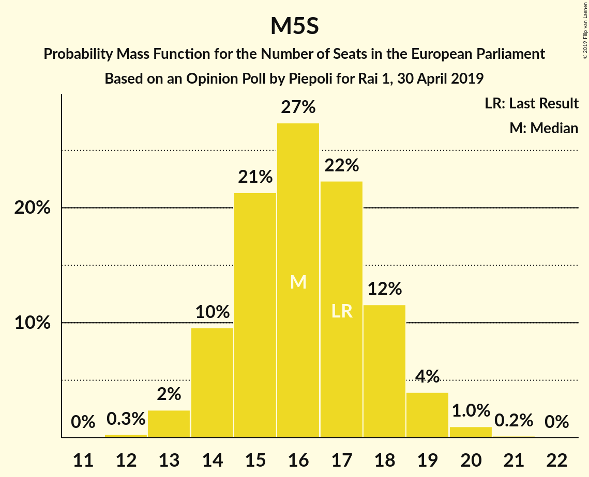

# Opinion Poll by Piepoli for Rai 1, 30 April 2019

<a href="#voting-intentions">Voting Intentions</a> | <a href="#seats">Seats</a> | <a href="#coalitions">Coalitions</a> | <a href="#technical-information">Technical Information</a>

## Voting Intentions

### Confidence Intervals

| Party | Last Result | Poll Result | 80% Confidence Interval | 90% Confidence Interval | 95% Confidence Interval | 99% Confidence Interval |
|:-----:|:-----------:|:-----------:|:-----------------------:|:-----------------------:|:-----------------------:|:-----------------------:|
| Lega Nord (EAPN) | 6.2% | 31.9% | 29.4–34.7% |28.6–35.5% |28.0–36.2% |26.8–37.5% |
| Movimento 5 Stelle (EFDD) | 21.2% | 21.6% | 19.4–24.1% |18.8–24.8% |18.2–25.4% |17.2–26.7% |
| Partito Democratico (S&D) | 40.8% | 20.2% | 18.1–22.7% |17.5–23.4% |17.0–24.0% |16.0–25.2% |
| Forza Italia (EPP) | 16.8% | 9.9% | 8.4–11.8% |8.0–12.4% |7.6–12.8% |6.9–13.8% |
| Fratelli d’Italia (ECR) | 3.7% | 5.4% | 4.3–6.9% |4.0–7.3% |3.7–7.7% |3.2–8.5% |
| Più Europa (ALDE) | 0.0% | 3.4% | 2.5–4.6% |2.3–5.0% |2.1–5.3% |1.8–6.0% |

*Note:* The poll result column reflects the actual value used in the calculations. Published results may vary slightly, and in addition be rounded to fewer digits.

## Seats

### Confidence Intervals

| Party | Last Result | Median | 80% Confidence Interval | 90% Confidence Interval | 95% Confidence Interval | 99% Confidence Interval |
|:-----:|:-----------:|:------:|:-----------------------:|:-----------------------:|:-----------------------:|:-----------------------:|
| <a href="#lega-nord-(eapn)">Lega Nord (EAPN)</a> | 5 | 24 | 22–26 |21–26 |21–27 |20–28 |
| <a href="#movimento-5-stelle-(efdd)">Movimento 5 Stelle (EFDD)</a> | 17 | 16 | 14–18 |14–19 |13–19 |13–20 |
| <a href="#partito-democratico-(s&d)">Partito Democratico (S&D)</a> | 31 | 14 | 12–16 |12–16 |12–17 |11–18 |
| <a href="#forza-italia-(epp)">Forza Italia (EPP)</a> | 13 | 7 | 6–9 |6–9 |6–10 |5–10 |
| <a href="#fratelli-d’italia-(ecr)">Fratelli d’Italia (ECR)</a> | 0 | 4 | 3–5 |0–5 |0–6 |0–6 |
| <a href="#più-europa-(alde)">Più Europa (ALDE)</a> | 0 | 0 | 0–3 |0–4 |0–4 |0–4 |

### Lega Nord (EAPN)

*For a full overview of the results for this party, see the [Lega Nord (EAPN)](party-leganordeapn.html) page.*

| Number of Seats | Probability | Accumulated | Special Marks |
|:---------------:|:-----------:|:-----------:|:-------------:|
| 5 | 0% | 100% | Last Result |
| 6 | 0% | 100% |  |
| 7 | 0% | 100% |  |
| 8 | 0% | 100% |  |
| 9 | 0% | 100% |  |
| 10 | 0% | 100% |  |
| 11 | 0% | 100% |  |
| 12 | 0% | 100% |  |
| 13 | 0% | 100% |  |
| 14 | 0% | 100% |  |
| 15 | 0% | 100% |  |
| 16 | 0% | 100% |  |
| 17 | 0% | 100% |  |
| 18 | 0% | 100% |  |
| 19 | 0.3% | 100% |  |
| 20 | 2% | 99.7% |  |
| 21 | 6% | 98% |  |
| 22 | 14% | 92% |  |
| 23 | 22% | 78% |  |
| 24 | 24% | 56% | Median |
| 25 | 17% | 32% |  |
| 26 | 10% | 15% |  |
| 27 | 4% | 5% |  |
| 28 | 1.0% | 1.3% |  |
| 29 | 0.2% | 0.3% |  |
| 30 | 0% | 0% |  |

### Movimento 5 Stelle (EFDD)

*For a full overview of the results for this party, see the [Movimento 5 Stelle (EFDD)](party-movimento5stelleefdd.html) page.*

| Number of Seats | Probability | Accumulated | Special Marks |
|:---------------:|:-----------:|:-----------:|:-------------:|
| 12 | 0.3% | 100% |  |
| 13 | 2% | 99.7% |  |
| 14 | 10% | 97% |  |
| 15 | 21% | 88% |  |
| 16 | 27% | 66% | Median |
| 17 | 22% | 39% | Last Result |
| 18 | 12% | 17% |  |
| 19 | 4% | 5% |  |
| 20 | 1.0% | 1.1% |  |
| 21 | 0.2% | 0.2% |  |
| 22 | 0% | 0% |  |

### Partito Democratico (S&D)

*For a full overview of the results for this party, see the [Partito Democratico (S&D)](party-partitodemocraticosd.html) page.*

| Number of Seats | Probability | Accumulated | Special Marks |
|:---------------:|:-----------:|:-----------:|:-------------:|
| 10 | 0.2% | 100% |  |
| 11 | 2% | 99.7% |  |
| 12 | 10% | 98% |  |
| 13 | 22% | 88% |  |
| 14 | 28% | 66% | Median |
| 15 | 23% | 38% |  |
| 16 | 11% | 16% |  |
| 17 | 3% | 4% |  |
| 18 | 0.9% | 1.0% |  |
| 19 | 0.1% | 0.1% |  |
| 20 | 0% | 0% |  |
| 21 | 0% | 0% |  |
| 22 | 0% | 0% |  |
| 23 | 0% | 0% |  |
| 24 | 0% | 0% |  |
| 25 | 0% | 0% |  |
| 26 | 0% | 0% |  |
| 27 | 0% | 0% |  |
| 28 | 0% | 0% |  |
| 29 | 0% | 0% |  |
| 30 | 0% | 0% |  |
| 31 | 0% | 0% | Last Result |

### Forza Italia (EPP)

*For a full overview of the results for this party, see the [Forza Italia (EPP)](party-forzaitaliaepp.html) page.*

| Number of Seats | Probability | Accumulated | Special Marks |
|:---------------:|:-----------:|:-----------:|:-------------:|
| 5 | 2% | 100% |  |
| 6 | 16% | 98% |  |
| 7 | 34% | 83% | Median |
| 8 | 34% | 49% |  |
| 9 | 12% | 15% |  |
| 10 | 3% | 3% |  |
| 11 | 0.3% | 0.3% |  |
| 12 | 0% | 0% |  |
| 13 | 0% | 0% | Last Result |

### Fratelli d’Italia (ECR)

*For a full overview of the results for this party, see the [Fratelli d’Italia (ECR)](party-fratellid’italiaecr.html) page.*

| Number of Seats | Probability | Accumulated | Special Marks |
|:---------------:|:-----------:|:-----------:|:-------------:|
| 0 | 6% | 100% | Last Result |
| 1 | 0% | 94% |  |
| 2 | 0% | 94% |  |
| 3 | 17% | 94% |  |
| 4 | 49% | 78% | Median |
| 5 | 24% | 28% |  |
| 6 | 4% | 4% |  |
| 7 | 0.3% | 0.3% |  |
| 8 | 0% | 0% |  |

### Più Europa (ALDE)

*For a full overview of the results for this party, see the [Più Europa (ALDE)](party-piùeuropaalde.html) page.*

| Number of Seats | Probability | Accumulated | Special Marks |
|:---------------:|:-----------:|:-----------:|:-------------:|
| 0 | 73% | 100% | Last Result, Median |
| 1 | 0% | 27% |  |
| 2 | 0% | 27% |  |
| 3 | 19% | 27% |  |
| 4 | 7% | 7% |  |
| 5 | 0.3% | 0.3% |  |
| 6 | 0% | 0% |  |

## Coalitions

### Confidence Intervals

| Coalition | Last Result | Median | Majority? | 80% Confidence Interval | 90% Confidence Interval | 95% Confidence Interval | 99% Confidence Interval |
|:---------:|:-----------:|:------:|:---------:|:-----------------------:|:-----------------------:|:-----------------------:|:-----------------------:|
| Lega Nord (EAPN) | 5 | 24 | 0% | 22–26 | 21–26 | 21–27 | 20–28 |
| Movimento 5 Stelle (EFDD) | 17 | 16 | 0% | 14–18 | 14–19 | 13–19 | 13–20 |

### Lega Nord (EAPN)

| Number of Seats | Probability | Accumulated | Special Marks |
|:---------------:|:-----------:|:-----------:|:-------------:|
| 5 | 0% | 100% | Last Result |
| 6 | 0% | 100% |  |
| 7 | 0% | 100% |  |
| 8 | 0% | 100% |  |
| 9 | 0% | 100% |  |
| 10 | 0% | 100% |  |
| 11 | 0% | 100% |  |
| 12 | 0% | 100% |  |
| 13 | 0% | 100% |  |
| 14 | 0% | 100% |  |
| 15 | 0% | 100% |  |
| 16 | 0% | 100% |  |
| 17 | 0% | 100% |  |
| 18 | 0% | 100% |  |
| 19 | 0.3% | 100% |  |
| 20 | 2% | 99.7% |  |
| 21 | 6% | 98% |  |
| 22 | 14% | 92% |  |
| 23 | 22% | 78% |  |
| 24 | 24% | 56% | Median |
| 25 | 17% | 32% |  |
| 26 | 10% | 15% |  |
| 27 | 4% | 5% |  |
| 28 | 1.0% | 1.3% |  |
| 29 | 0.2% | 0.3% |  |
| 30 | 0% | 0% |  |

### Movimento 5 Stelle (EFDD)

| Number of Seats | Probability | Accumulated | Special Marks |
|:---------------:|:-----------:|:-----------:|:-------------:|
| 12 | 0.3% | 100% |  |
| 13 | 2% | 99.7% |  |
| 14 | 10% | 97% |  |
| 15 | 21% | 88% |  |
| 16 | 27% | 66% | Median |
| 17 | 22% | 39% | Last Result |
| 18 | 12% | 17% |  |
| 19 | 4% | 5% |  |
| 20 | 1.0% | 1.1% |  |
| 21 | 0.2% | 0.2% |  |
| 22 | 0% | 0% |  |

## Technical Information

### Opinion Poll

+ **Polling firm:** Piepoli
+ **Commissioner(s):** Rai 1
+ **Fieldwork period:** 30 April 2019

### Calculations

+ **Sample size:** 504
+ **Simulations done:** 1,048,576
+ **Error estimate:** 1.02%

