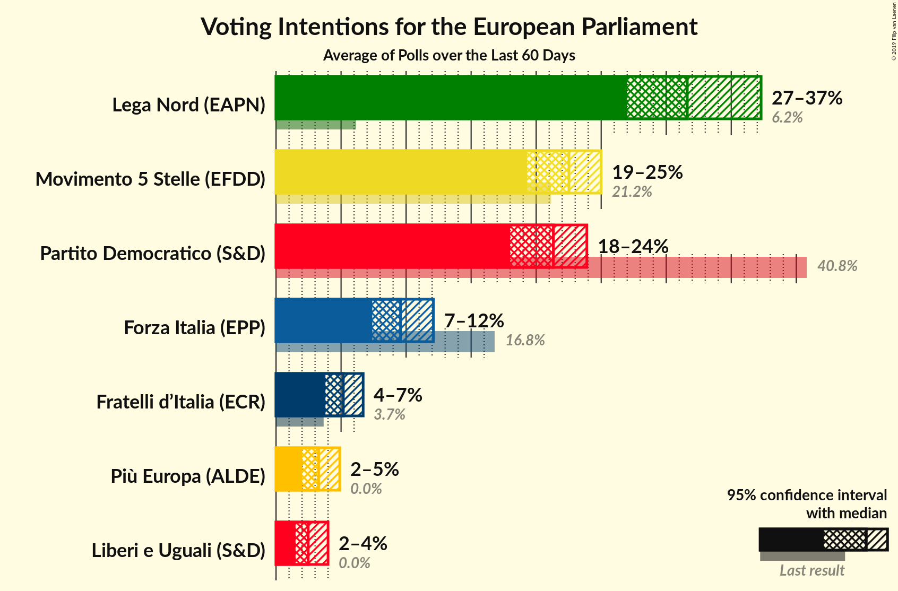
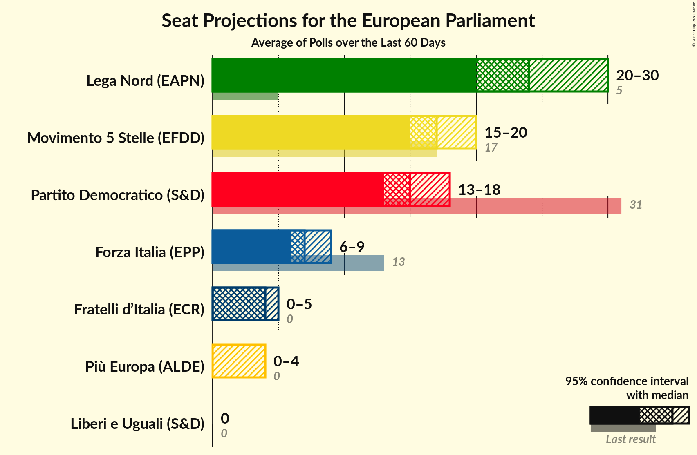
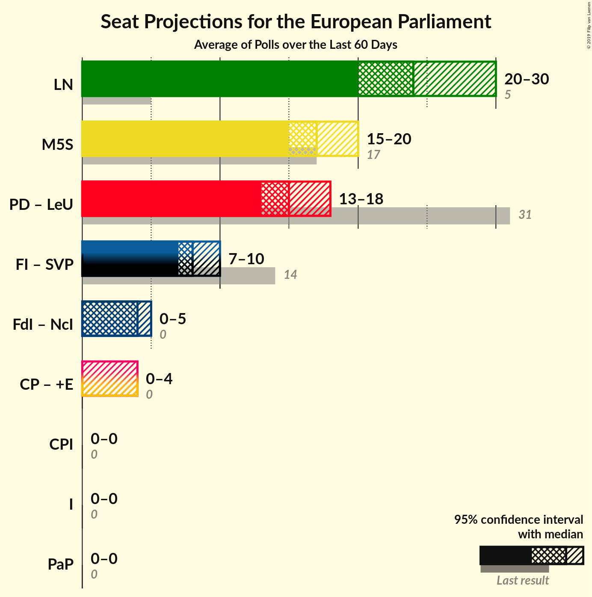

# Overview

The table below lists the most recent polls (less than 60 days old) registered and analyzed so far.

| Period     | Polling firm/Commissioner(s) | PD | M5S | FI | LN | FdI | SVP | CPI | CP | I | NcI | +E | LeU | PaP |
|:----------:|:----------------------------:|:--:|:--:|:--:|:--:|:--:|:--:|:--:|:--:|:--:|:--:|:--:|:--:|:--:|
| 25 May 2014 | General Election | 40.8%   31 | 21.2%   17 | 16.8%   13 | 6.2%   5 | 3.7%   0 | 0.5%   1 | 0.0%   0 | 0.0%   0 | 0.0%   0 | 0.0%   0 | 0.0%   0 | 0.0%   0 | 0.0%   0 |
| N/A | [Poll Average](average.html) | 18–24%   13–18 | 19–25%   15–20 | 7–12%   6–9 | 27–37%   20–30 | 4–7%   0–5 | N/A   N/A | N/A   N/A | N/A   N/A | N/A   N/A | N/A   N/A | 2–5%   0–4 | 2–4%   0 | N/A   N/A |
| [5–9 May 2019](2019-05-09-TermometroPolitico.html) | Termometro Politico | 21–23%   15–16 | 22–24%   17–18 | 9–10%   7–8 | 29–32%   22–24 | 5–6%   4–5 | N/A   N/A | N/A   N/A | N/A   N/A | N/A   N/A | N/A   N/A | 2–3%   0 | 2%   0 | N/A   N/A |
| [7–9 May 2019](2019-05-09-ScenariPolitici–Winpoll.html) | Scenari Politici–Winpoll | 20–24%   15–18 | 21–25%   16–20 | 7–9%   5–7 | 31–36%   25–29 | 5–7%   4–6 | N/A   N/A | N/A   N/A | N/A   N/A | N/A   N/A | N/A   N/A | 2–3%   0 | 2–3%   0 | N/A   N/A |
| [6–9 May 2019](2019-05-09-Ixè.html) | Ixè | 18–23%   12–17 | 18–23%   14–18 | 8–12%   6–9 | 28–33%   21–26 | 4–7%   0–5 | N/A   N/A | N/A   N/A | N/A   N/A | N/A   N/A | N/A   N/A | 3–5%   0–4 | 2–5%   0–4 | N/A   N/A |
| [8–9 May 2019](2019-05-09-Euromedia.html) | Euromedia   Rai 1 | 19–25%   13–18 | 19–24%   14–19 | 8–12%   6–9 | 27–33%   20–25 | 4–7%   0–5 | N/A   N/A | N/A   N/A | N/A   N/A | N/A   N/A | N/A   N/A | 2–5%   0–4 | 1–3%   0 | N/A   N/A |
| [8–9 May 2019](2019-05-09-Demopolis.html) | Demopolis | 20–24%   15–18 | 21–25%   17–20 | 7–10%   6–8 | 29–33%   23–27 | 5–7%   4–5 | N/A   N/A | N/A   N/A | N/A   N/A | N/A   N/A | N/A   N/A | 3–4%   0–3 | 2–4%   0 | N/A   N/A |
| [8 May 2019](2019-05-08-Piepoli.html) | Piepoli   Rai 1 | 18–25%   12–18 | 19–26%   14–20 | 8–13%   6–10 | 27–35%   20–26 | 3–7%   0–5 | N/A   N/A | N/A   N/A | N/A   N/A | N/A   N/A | N/A   N/A | 2–6%   0–4 | 1–4%   0 | N/A   N/A |
| [7–8 May 2019](2019-05-08-IndexResearch.html) | Index Research   LA7 | 19–24%   14–18 | 20–26%   15–21 | 8–12%   6–9 | 30–36%   23–29 | 4–7%   0–6 | N/A   N/A | N/A   N/A | N/A   N/A | N/A   N/A | N/A   N/A | 2–5%   0–4 | 2–4%   0–3 | N/A   N/A |
| [6–8 May 2019](2019-05-08-DemosPi.html) | Demos & Pi | 18–23%   13–17 | 20–25%   16–20 | 8–12%   6–9 | 29–35%   23–28 | 4–6%   0–5 | N/A   N/A | N/A   N/A | N/A   N/A | N/A   N/A | N/A   N/A | 3–5%   0–4 | 2–4%   0–3 | N/A   N/A |
| [6–8 May 2019](2019-05-08-Bimedia.html) | Bimedia | 19–23%   14–17 | 20–25%   16–19 | 8–11%   6–8 | 30–35%   23–27 | 4–6%   0–5 | N/A   N/A | N/A   N/A | N/A   N/A | N/A   N/A | N/A   N/A | 2–4%   0–3 | 2–3%   0 | N/A   N/A |
| [7 May 2019](2019-05-07-SWG.html) | SWG   LA7 | 19–23%   14–17 | 21–25%   17–20 | 9–12%   7–9 | 30–35%   24–27 | 4–6%   0–5 | N/A   N/A | N/A   N/A | N/A   N/A | N/A   N/A | N/A   N/A | 2–4%   0 | 2–4%   0 | N/A   N/A |
| [7 May 2019](2019-05-07-NotoSondaggi.html) | Noto Sondaggi   Rai 3 | 19–24%   13–17 | 19–24%   14–18 | 7–11%   6–8 | 29–35%   22–27 | 4–7%   3–5 | N/A   N/A | N/A   N/A | N/A   N/A | N/A   N/A | N/A   N/A | 3–5%   0–4 | 1–3%   0 | N/A   N/A |
| [4–6 May 2019](2019-05-06-Tecnè.html) | Tecnè | 19–23%   13–16 | 20–24%   15–18 | 9–12%   7–9 | 29–33%   21–25 | 4–6%   0–5 | N/A   N/A | N/A   N/A | N/A   N/A | N/A   N/A | N/A   N/A | 3–5%   0–3 | N/A   N/A | N/A   N/A |
| [24 April–6 May 2019](2019-05-06-CISE.html) | CISE | 21–23%   14–16 | 22–24%   16–18 | 11–13%   8–9 | 26–28%   19–21 | 4–5%   3–4 | N/A   N/A | N/A   N/A | N/A   N/A | N/A   N/A | N/A   N/A | 4–5%   0–4 | N/A   N/A | N/A   N/A |
| [2–3 May 2019](2019-05-03-Quorum.html) | Quorum   Sky TG 24 | 19–24%   13–17 | 20–25%   14–18 | 8–11%   6–8 | 29–35%   22–26 | 4–7%   3–5 | N/A   N/A | N/A   N/A | N/A   N/A | N/A   N/A | N/A   N/A | 2–3%   0 | N/A   N/A | N/A   N/A |
| [27 April 2019](2019-04-27-EMGAcqua.html) | EMG Acqua   Rai 3 | 20–24%   15–18 | 21–25%   16–20 | 9–12%   7–9 | 30–35%   24–27 | 4–6%   3–5 | N/A   N/A | N/A   N/A | N/A   N/A | N/A   N/A | N/A   N/A | 2–4%   0 | 2–3%   0 | N/A   N/A |
| [20 April 2019](2019-04-20-Ipsos.html) | Ipsos   Corriere della Sera | 16–21%   12–16 | 20–25%   15–20 | 7–11%   6–8 | 34–40%   26–32 | 3–6%   0–5 | N/A   N/A | N/A   N/A | N/A   N/A | N/A   N/A | N/A   N/A | 2–4%   0–3 | 1–3%   0 | N/A   N/A |
| 25 May 2014 | General Election | 40.8%   31 | 21.2%   17 | 16.8%   13 | 6.2%   5 | 3.7%   0 | 0.5%   1 | 0.0%   0 | 0.0%   0 | 0.0%   0 | 0.0%   0 | 0.0%   0 | 0.0%   0 | 0.0%   0 |

Only polls for which at least the sample size has been published are included in the table above.

**Legend:**
+ **Top half of each row:** Voting intentions (95% confidence interval)
+ **Bottom half of each row:** Seat projections for the European Parliament (95% confidence interval)
+ **PD:** Partito Democratico (S&D)
+ **M5S:** Movimento 5 Stelle (EFDD)
+ **FI:** Forza Italia (EPP)
+ **LN:** Lega Nord (EAPN)
+ **FdI:** Fratelli d’Italia (ECR)
+ **SVP:** Südtiroler Volkspartei (EPP)
+ **CPI:** CasaPound Italia (NI)
+ **CP:** Civica Popolare (ALDE)
+ **I:** Insieme (*)
+ **NcI:** Noi con l’Italia (ECR)
+ **+E:** Più Europa (ALDE)
+ **LeU:** Liberi e Uguali (S&D)
+ **PaP:** Potere al Popolo (GUE/NGL)
+ **N/A (single party):** Party not included the published results
+ **N/A (entire row):** Calculation for this opinion poll not started yet

