# Opinion Poll by MG Research for Affaritaliani.it, 28 January 2020

<a href="#voting-intentions">Voting Intentions</a> | <a href="#seats">Seats</a> | <a href="#coalitions">Coalitions</a> | <a href="#technical-information">Technical Information</a>

## Voting Intentions

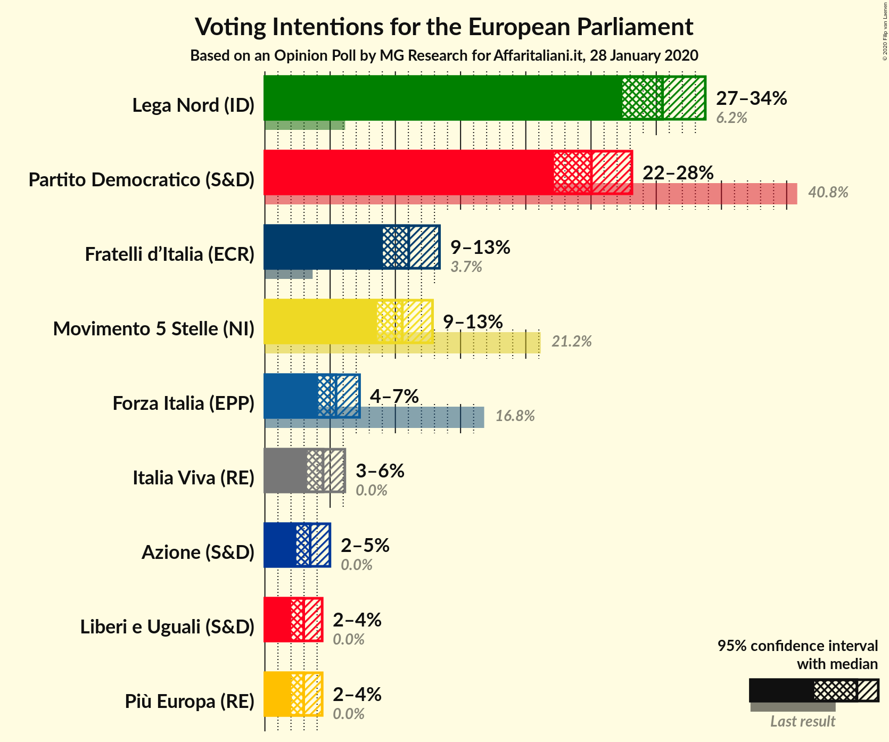

### Confidence Intervals

| Party | Last Result | Poll Result | 80% Confidence Interval | 90% Confidence Interval | 95% Confidence Interval | 99% Confidence Interval |
|:-----:|:-----------:|:-----------:|:-----------------------:|:-----------------------:|:-----------------------:|:-----------------------:|
| Lega Nord (ID) | 6.2% | 30.5% | 28.5–32.6% |27.9–33.2% |27.4–33.8% |26.4–34.8% |
| Partito Democratico (S&D) | 40.8% | 25.0% | 23.2–27.1% |22.6–27.6% |22.2–28.1% |21.3–29.1% |
| Fratelli d’Italia (ECR) | 3.7% | 11.0% | 9.7–12.6% |9.4–13.0% |9.0–13.4% |8.5–14.2% |
| Movimento 5 Stelle (NI) | 21.2% | 10.5% | 9.3–12.0% |8.9–12.5% |8.6–12.8% |8.0–13.6% |
| Forza Italia (EPP) | 16.8% | 5.5% | 4.5–6.6% |4.3–7.0% |4.1–7.3% |3.7–7.8% |
| Italia Viva (RE) | 0.0% | 4.5% | 3.7–5.5% |3.4–5.9% |3.2–6.1% |2.9–6.7% |
| Azione (S&D) | 0.0% | 3.5% | 2.8–4.5% |2.6–4.7% |2.4–5.0% |2.1–5.5% |
| Liberi e Uguali (S&D) | 0.0% | 3.0% | 2.3–3.9% |2.1–4.2% |2.0–4.4% |1.7–4.9% |
| Più Europa (RE) | 0.0% | 3.0% | 2.3–3.9% |2.1–4.2% |2.0–4.4% |1.7–4.9% |

*Note:* The poll result column reflects the actual value used in the calculations. Published results may vary slightly, and in addition be rounded to fewer digits.

## Seats

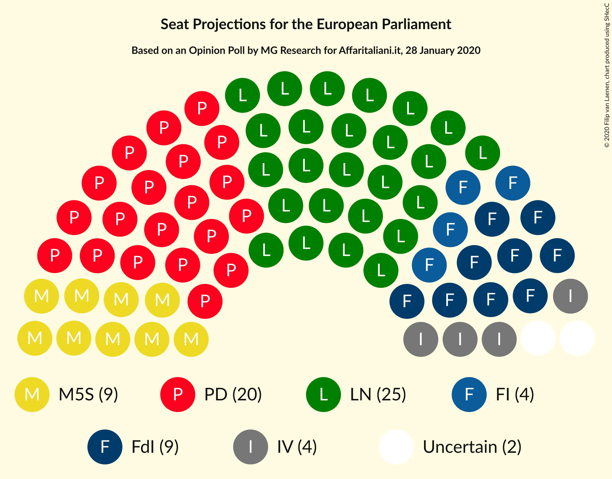

### Confidence Intervals

| Party | Last Result | Median | 80% Confidence Interval | 90% Confidence Interval | 95% Confidence Interval | 99% Confidence Interval |
|:-----:|:-----------:|:------:|:-----------------------:|:-----------------------:|:-----------------------:|:-----------------------:|
| <a href="#lega-nord-(id)">Lega Nord (ID)</a> | 5 | 26 | 24–29 |23–29 |23–29 |22–31 |
| <a href="#partito-democratico-(s&d)">Partito Democratico (S&D)</a> | 31 | 21 | 19–22 |18–23 |18–23 |16–24 |
| <a href="#fratelli-d’italia-(ecr)">Fratelli d’Italia (ECR)</a> | 0 | 9 | 8–11 |8–11 |8–11 |7–12 |
| <a href="#movimento-5-stelle-(ni)">Movimento 5 Stelle (NI)</a> | 17 | 9 | 8–10 |7–11 |7–11 |7–12 |
| <a href="#forza-italia-(epp)">Forza Italia (EPP)</a> | 13 | 5 | 4–6 |4–6 |3–6 |0–7 |
| <a href="#italia-viva-(re)">Italia Viva (RE)</a> | 0 | 4 | 0–5 |0–5 |0–5 |0–6 |
| <a href="#azione-(s&d)">Azione (S&D)</a> | 0 | 0 | 0–4 |0–4 |0–4 |0–5 |
| <a href="#liberi-e-uguali-(s&d)">Liberi e Uguali (S&D)</a> | 0 | 0 | 0 |0 |0–3 |0–4 |
| <a href="#più-europa-(re)">Più Europa (RE)</a> | 0 | 0 | 0 |0–3 |0–4 |0–4 |

### Lega Nord (ID)

*For a full overview of the results for this party, see the [Lega Nord (ID)](party-leganordid.html) page.*

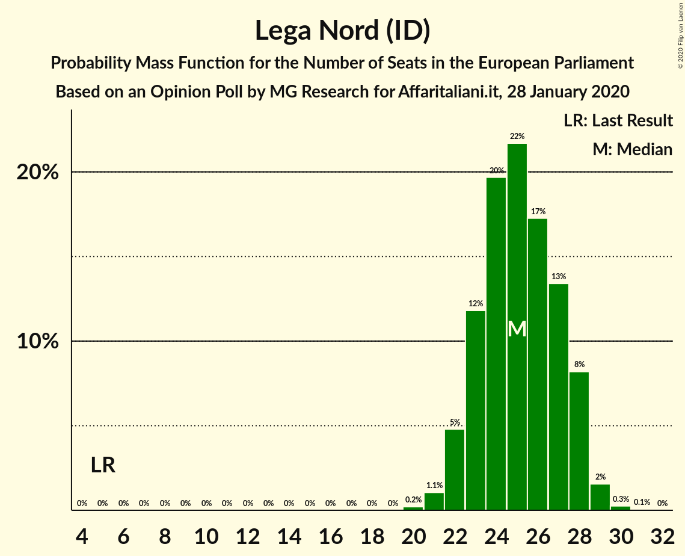

| Number of Seats | Probability | Accumulated | Special Marks |
|:---------------:|:-----------:|:-----------:|:-------------:|
| 5 | 0% | 100% | Last Result |
| 6 | 0% | 100% |  |
| 7 | 0% | 100% |  |
| 8 | 0% | 100% |  |
| 9 | 0% | 100% |  |
| 10 | 0% | 100% |  |
| 11 | 0% | 100% |  |
| 12 | 0% | 100% |  |
| 13 | 0% | 100% |  |
| 14 | 0% | 100% |  |
| 15 | 0% | 100% |  |
| 16 | 0% | 100% |  |
| 17 | 0% | 100% |  |
| 18 | 0% | 100% |  |
| 19 | 0% | 100% |  |
| 20 | 0% | 100% |  |
| 21 | 0.3% | 100% |  |
| 22 | 1.2% | 99.7% |  |
| 23 | 5% | 98% |  |
| 24 | 12% | 93% |  |
| 25 | 21% | 82% |  |
| 26 | 20% | 61% | Median |
| 27 | 17% | 41% |  |
| 28 | 13% | 24% |  |
| 29 | 8% | 10% |  |
| 30 | 1.1% | 2% |  |
| 31 | 0.9% | 1.0% |  |
| 32 | 0.1% | 0.1% |  |
| 33 | 0% | 0% |  |

### Partito Democratico (S&D)

*For a full overview of the results for this party, see the [Partito Democratico (S&D)](party-partitodemocraticosd.html) page.*

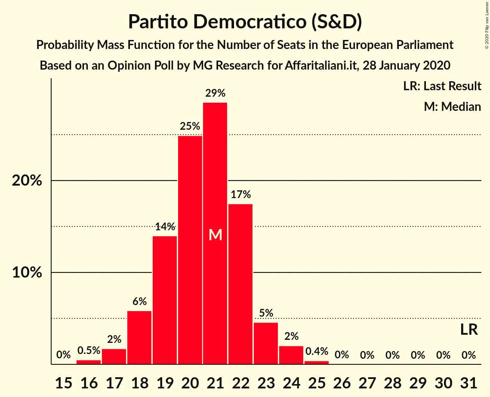

| Number of Seats | Probability | Accumulated | Special Marks |
|:---------------:|:-----------:|:-----------:|:-------------:|
| 16 | 0.5% | 100% |  |
| 17 | 2% | 99.5% |  |
| 18 | 6% | 98% |  |
| 19 | 14% | 92% |  |
| 20 | 25% | 78% |  |
| 21 | 29% | 53% | Median |
| 22 | 17% | 25% |  |
| 23 | 5% | 7% |  |
| 24 | 2% | 2% |  |
| 25 | 0.4% | 0.4% |  |
| 26 | 0% | 0.1% |  |
| 27 | 0% | 0% |  |
| 28 | 0% | 0% |  |
| 29 | 0% | 0% |  |
| 30 | 0% | 0% |  |
| 31 | 0% | 0% | Last Result |

### Fratelli d’Italia (ECR)

*For a full overview of the results for this party, see the [Fratelli d’Italia (ECR)](party-fratellid’italiaecr.html) page.*

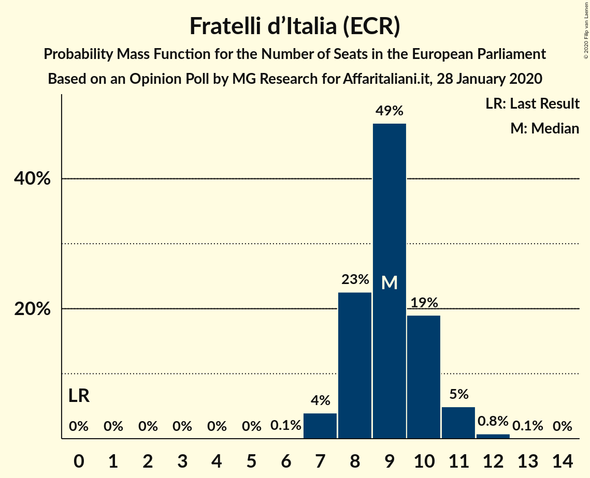

| Number of Seats | Probability | Accumulated | Special Marks |
|:---------------:|:-----------:|:-----------:|:-------------:|
| 0 | 0% | 100% | Last Result |
| 1 | 0% | 100% |  |
| 2 | 0% | 100% |  |
| 3 | 0% | 100% |  |
| 4 | 0% | 100% |  |
| 5 | 0% | 100% |  |
| 6 | 0% | 100% |  |
| 7 | 2% | 100% |  |
| 8 | 12% | 98% |  |
| 9 | 38% | 86% | Median |
| 10 | 37% | 48% |  |
| 11 | 8% | 11% |  |
| 12 | 2% | 2% |  |
| 13 | 0.4% | 0.4% |  |
| 14 | 0% | 0% |  |

### Movimento 5 Stelle (NI)

*For a full overview of the results for this party, see the [Movimento 5 Stelle (NI)](party-movimento5stelleni.html) page.*

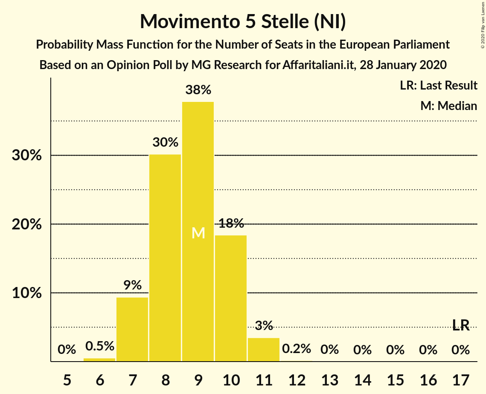

| Number of Seats | Probability | Accumulated | Special Marks |
|:---------------:|:-----------:|:-----------:|:-------------:|
| 6 | 0.2% | 100% |  |
| 7 | 5% | 99.8% |  |
| 8 | 21% | 95% |  |
| 9 | 44% | 73% | Median |
| 10 | 22% | 29% |  |
| 11 | 6% | 7% |  |
| 12 | 2% | 2% |  |
| 13 | 0.1% | 0.1% |  |
| 14 | 0% | 0% |  |
| 15 | 0% | 0% |  |
| 16 | 0% | 0% |  |
| 17 | 0% | 0% | Last Result |

### Forza Italia (EPP)

*For a full overview of the results for this party, see the [Forza Italia (EPP)](party-forzaitaliaepp.html) page.*

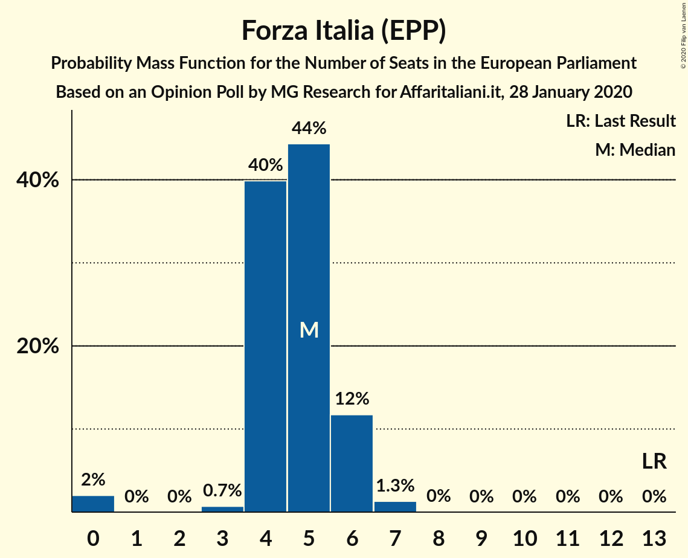

| Number of Seats | Probability | Accumulated | Special Marks |
|:---------------:|:-----------:|:-----------:|:-------------:|
| 0 | 2% | 100% |  |
| 1 | 0% | 98% |  |
| 2 | 0% | 98% |  |
| 3 | 0.7% | 98% |  |
| 4 | 40% | 97% |  |
| 5 | 44% | 57% | Median |
| 6 | 12% | 13% |  |
| 7 | 1.3% | 1.3% |  |
| 8 | 0% | 0% |  |
| 9 | 0% | 0% |  |
| 10 | 0% | 0% |  |
| 11 | 0% | 0% |  |
| 12 | 0% | 0% |  |
| 13 | 0% | 0% | Last Result |

### Italia Viva (RE)

*For a full overview of the results for this party, see the [Italia Viva (RE)](party-italiavivare.html) page.*

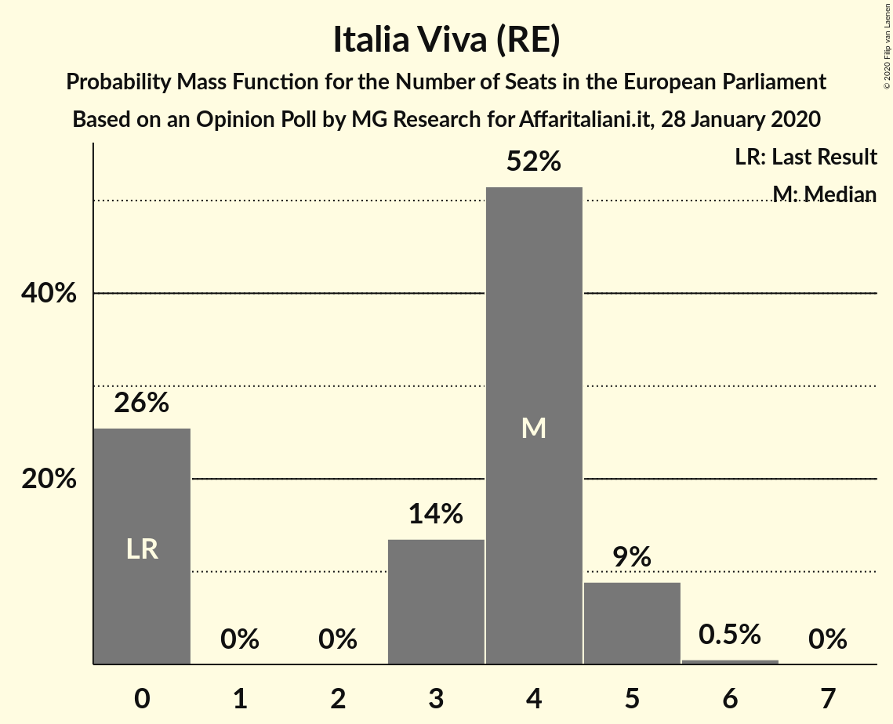

| Number of Seats | Probability | Accumulated | Special Marks |
|:---------------:|:-----------:|:-----------:|:-------------:|
| 0 | 26% | 100% | Last Result |
| 1 | 0% | 74% |  |
| 2 | 0% | 74% |  |
| 3 | 5% | 74% |  |
| 4 | 50% | 69% | Median |
| 5 | 19% | 19% |  |
| 6 | 0.8% | 0.8% |  |
| 7 | 0% | 0% |  |

### Azione (S&D)

*For a full overview of the results for this party, see the [Azione (S&D)](party-azionesd.html) page.*

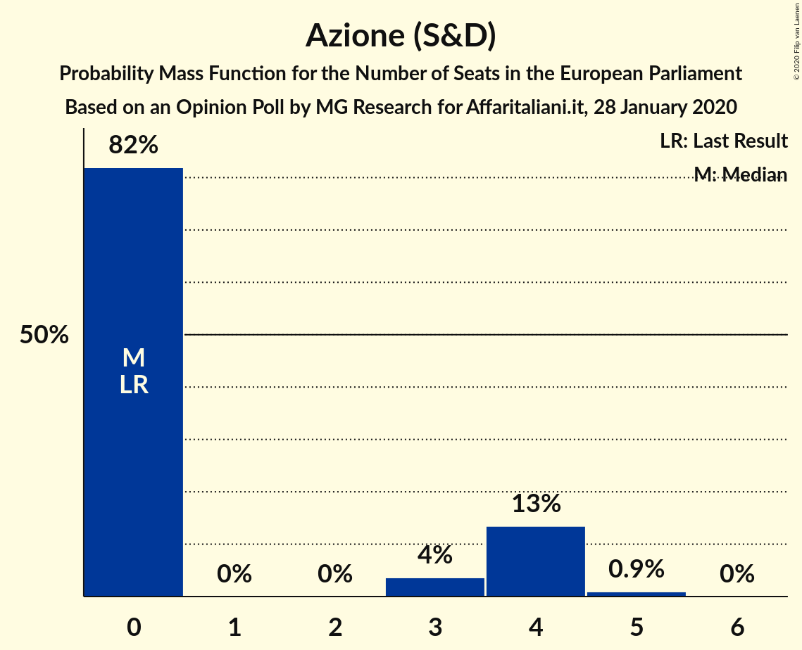

| Number of Seats | Probability | Accumulated | Special Marks |
|:---------------:|:-----------:|:-----------:|:-------------:|
| 0 | 82% | 100% | Last Result, Median |
| 1 | 0% | 18% |  |
| 2 | 0% | 18% |  |
| 3 | 4% | 18% |  |
| 4 | 13% | 14% |  |
| 5 | 0.9% | 1.0% |  |
| 6 | 0% | 0% |  |

### Liberi e Uguali (S&D)

*For a full overview of the results for this party, see the [Liberi e Uguali (S&D)](party-liberieugualisd.html) page.*

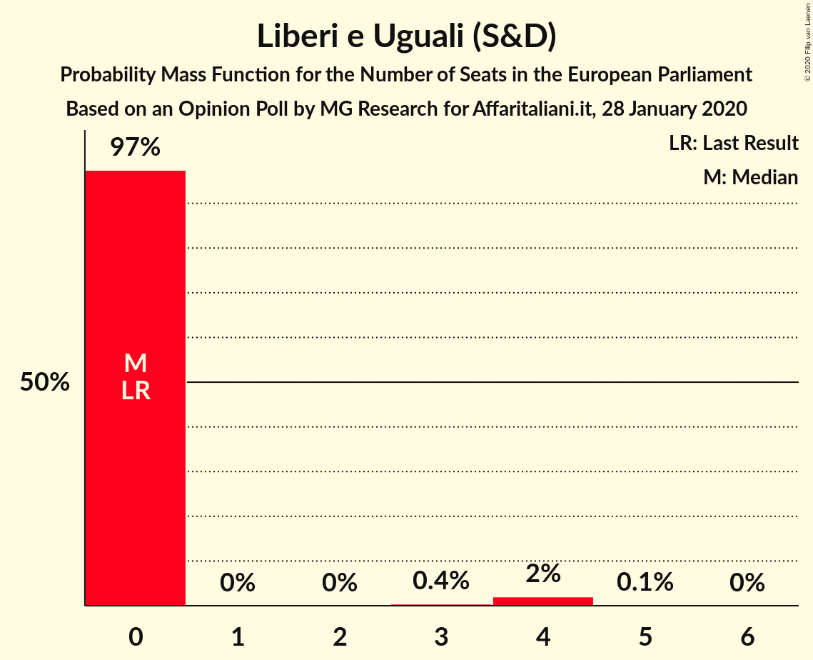

| Number of Seats | Probability | Accumulated | Special Marks |
|:---------------:|:-----------:|:-----------:|:-------------:|
| 0 | 97% | 100% | Last Result, Median |
| 1 | 0% | 3% |  |
| 2 | 0% | 3% |  |
| 3 | 0.4% | 3% |  |
| 4 | 2% | 2% |  |
| 5 | 0.1% | 0.1% |  |
| 6 | 0% | 0% |  |

### Più Europa (RE)

*For a full overview of the results for this party, see the [Più Europa (RE)](party-piùeuropare.html) page.*

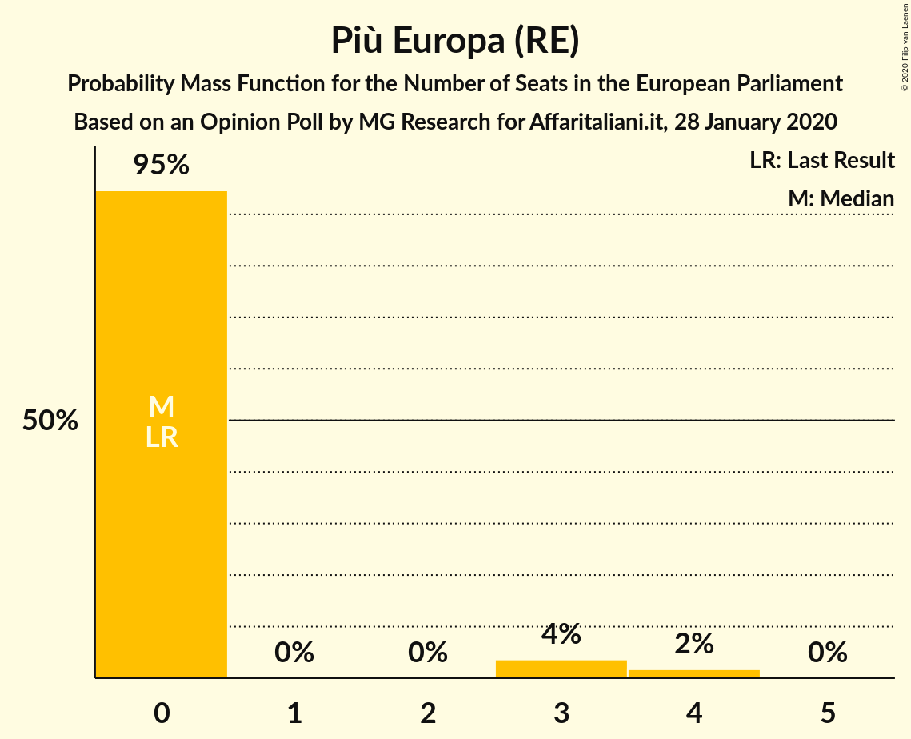

| Number of Seats | Probability | Accumulated | Special Marks |
|:---------------:|:-----------:|:-----------:|:-------------:|
| 0 | 95% | 100% | Last Result, Median |
| 1 | 0% | 5% |  |
| 2 | 0% | 5% |  |
| 3 | 2% | 5% |  |
| 4 | 3% | 3% |  |
| 5 | 0.1% | 0.1% |  |
| 6 | 0% | 0% |  |

## Coalitions

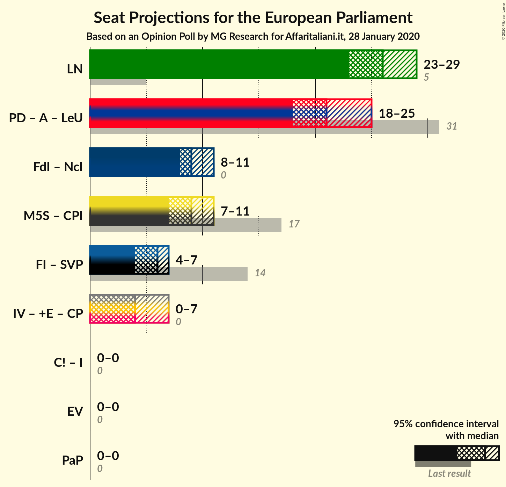

### Confidence Intervals

| Coalition | Last Result | Median | Majority? | 80% Confidence Interval | 90% Confidence Interval | 95% Confidence Interval | 99% Confidence Interval |
|:---------:|:-----------:|:------:|:---------:|:-----------------------:|:-----------------------:|:-----------------------:|:-----------------------:|
| Lega Nord (ID) | 5 | 26 | 0% | 24–29 | 23–29 | 23–29 | 22–31 |
| Partito Democratico (S&D) – Azione (S&D) – Liberi e Uguali (S&D) | 31 | 21 | 0% | 19–24 | 19–24 | 18–25 | 17–27 |

### Lega Nord (ID)

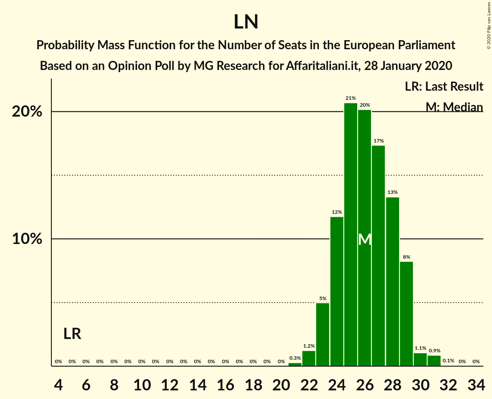

| Number of Seats | Probability | Accumulated | Special Marks |
|:---------------:|:-----------:|:-----------:|:-------------:|
| 5 | 0% | 100% | Last Result |
| 6 | 0% | 100% |  |
| 7 | 0% | 100% |  |
| 8 | 0% | 100% |  |
| 9 | 0% | 100% |  |
| 10 | 0% | 100% |  |
| 11 | 0% | 100% |  |
| 12 | 0% | 100% |  |
| 13 | 0% | 100% |  |
| 14 | 0% | 100% |  |
| 15 | 0% | 100% |  |
| 16 | 0% | 100% |  |
| 17 | 0% | 100% |  |
| 18 | 0% | 100% |  |
| 19 | 0% | 100% |  |
| 20 | 0% | 100% |  |
| 21 | 0.3% | 100% |  |
| 22 | 1.2% | 99.7% |  |
| 23 | 5% | 98% |  |
| 24 | 12% | 93% |  |
| 25 | 21% | 82% |  |
| 26 | 20% | 61% | Median |
| 27 | 17% | 41% |  |
| 28 | 13% | 24% |  |
| 29 | 8% | 10% |  |
| 30 | 1.1% | 2% |  |
| 31 | 0.9% | 1.0% |  |
| 32 | 0.1% | 0.1% |  |
| 33 | 0% | 0% |  |

### Partito Democratico (S&D) – Azione (S&D) – Liberi e Uguali (S&D)

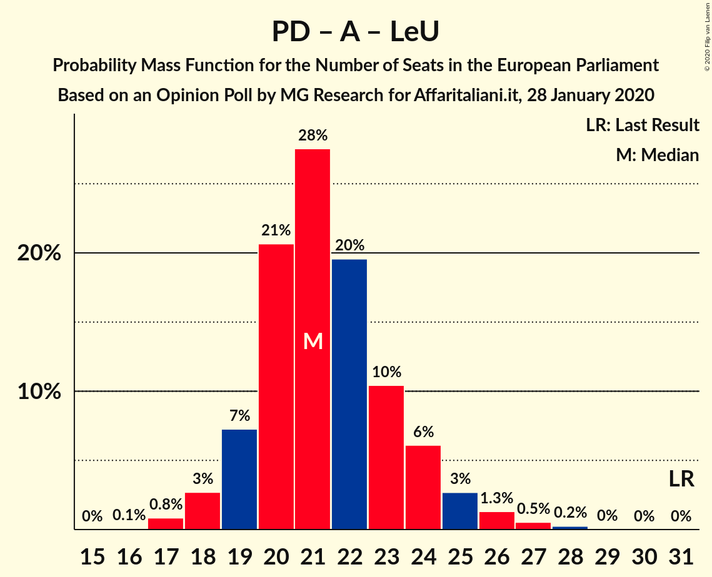

| Number of Seats | Probability | Accumulated | Special Marks |
|:---------------:|:-----------:|:-----------:|:-------------:|
| 16 | 0.1% | 100% |  |
| 17 | 0.8% | 99.9% |  |
| 18 | 3% | 99.1% |  |
| 19 | 7% | 96% |  |
| 20 | 21% | 89% |  |
| 21 | 28% | 68% | Median |
| 22 | 20% | 41% |  |
| 23 | 10% | 21% |  |
| 24 | 6% | 11% |  |
| 25 | 3% | 5% |  |
| 26 | 1.3% | 2% |  |
| 27 | 0.5% | 0.8% |  |
| 28 | 0.2% | 0.3% |  |
| 29 | 0% | 0% |  |
| 30 | 0% | 0% |  |
| 31 | 0% | 0% | Last Result |

## Technical Information

### Opinion Poll

+ **Polling firm:** MG Research
+ **Commissioner(s):** Affaritaliani.it
+ **Fieldwork period:** 28 January 2020

### Calculations

+ **Sample size:** 807
+ **Simulations done:** 1,048,576
+ **Error estimate:** 1.19%

