# Opinion Poll by Quorum – YouTrend for Rai 3, 29–30 October 2020

<a href="#voting-intentions">Voting Intentions</a> | <a href="#seats">Seats</a> | <a href="#coalitions">Coalitions</a> | <a href="#technical-information">Technical Information</a>

## Voting Intentions

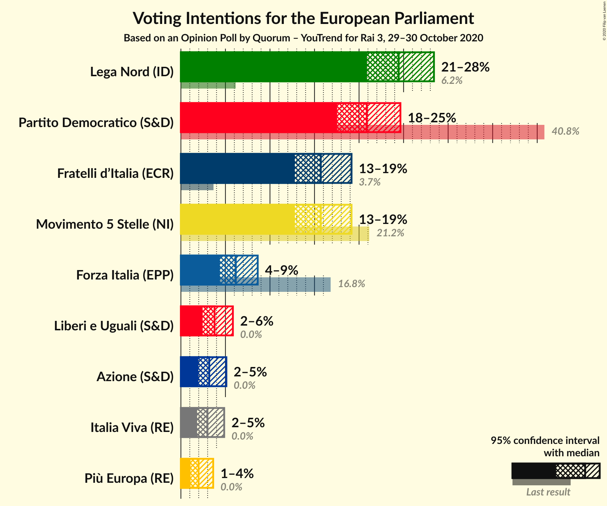

### Confidence Intervals

| Party | Last Result | Poll Result | 80% Confidence Interval | 90% Confidence Interval | 95% Confidence Interval | 99% Confidence Interval |
|:-----:|:-----------:|:-----------:|:-----------------------:|:-----------------------:|:-----------------------:|:-----------------------:|
| Lega Nord (ID) | 6.2% | 24.5% | 22.1–27.0% |21.5–27.8% |20.9–28.4% |19.8–29.7% |
| Partito Democratico (S&D) | 40.8% | 20.9% | 18.7–23.4% |18.1–24.0% |17.5–24.6% |16.5–25.9% |
| Movimento 5 Stelle (NI) | 21.2% | 15.7% | 13.8–18.0% |13.2–18.6% |12.8–19.2% |11.9–20.3% |
| Fratelli d’Italia (ECR) | 3.7% | 15.7% | 13.8–18.0% |13.2–18.6% |12.8–19.2% |11.9–20.3% |
| Forza Italia (EPP) | 16.8% | 6.2% | 5.0–7.8% |4.6–8.2% |4.4–8.6% |3.9–9.4% |
| Liberi e Uguali (S&D) | 0.0% | 3.8% | 2.9–5.1% |2.6–5.5% |2.4–5.8% |2.1–6.5% |
| Azione (S&D) | 0.0% | 3.2% | 2.4–4.4% |2.1–4.8% |2.0–5.1% |1.6–5.8% |
| Italia Viva (RE) | 0.0% | 3.0% | 2.2–4.2% |2.0–4.6% |1.8–4.9% |1.5–5.5% |
| Più Europa (RE) | 0.0% | 2.0% | 1.4–3.0% |1.2–3.4% |1.1–3.6% |0.9–4.2% |

*Note:* The poll result column reflects the actual value used in the calculations. Published results may vary slightly, and in addition be rounded to fewer digits.

## Seats

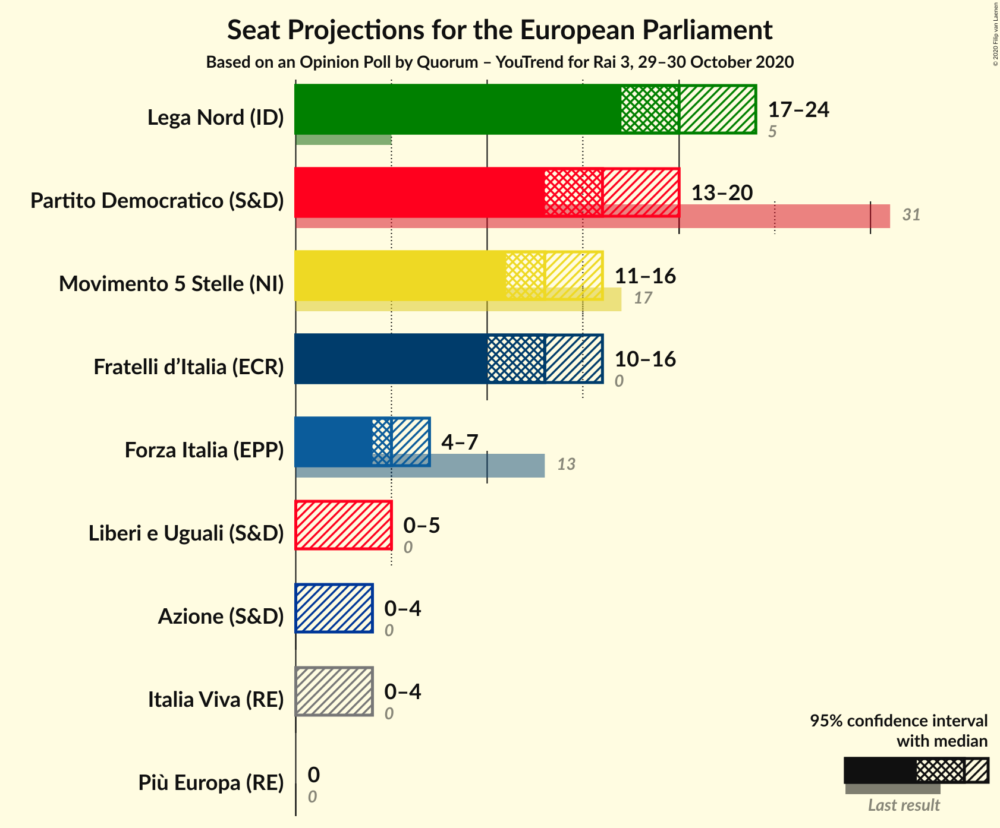

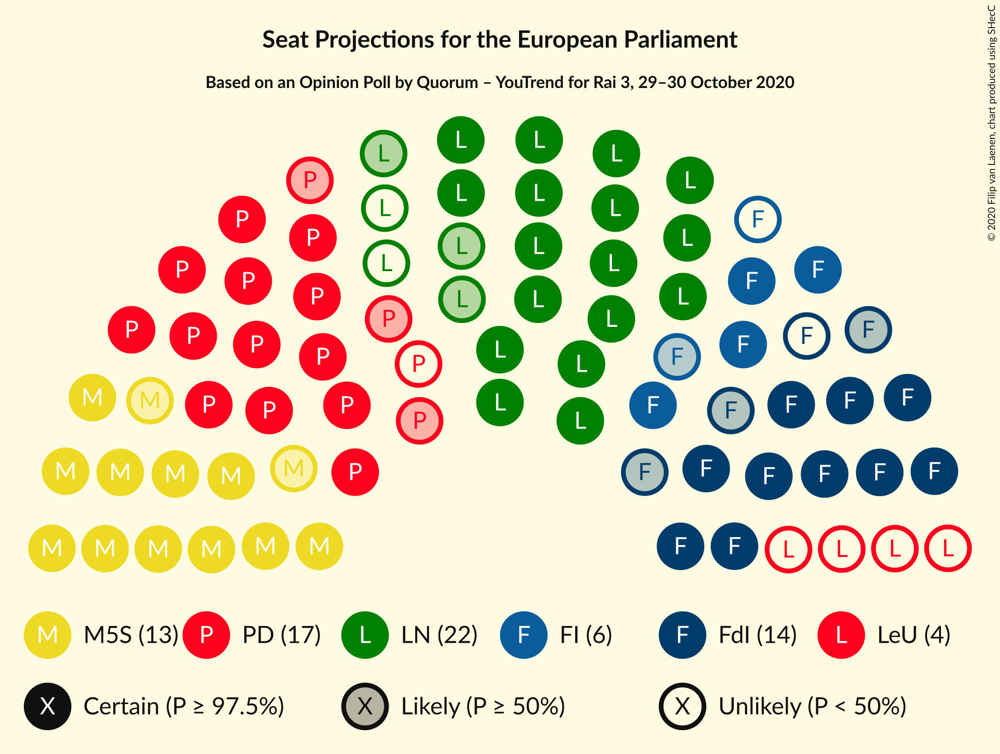

### Confidence Intervals

| Party | Last Result | Median | 80% Confidence Interval | 90% Confidence Interval | 95% Confidence Interval | 99% Confidence Interval |
|:-----:|:-----------:|:------:|:-----------------------:|:-----------------------:|:-----------------------:|:-----------------------:|
| <a href="#lega-nord-(id)">Lega Nord (ID)</a> | 5 | 20 | 18–23 |17–23 |17–24 |16–25 |
| <a href="#partito-democratico-(s&d)">Partito Democratico (S&D)</a> | 31 | 16 | 14–18 |14–19 |13–20 |12–21 |
| <a href="#movimento-5-stelle-(ni)">Movimento 5 Stelle (NI)</a> | 17 | 13 | 11–15 |11–16 |11–16 |10–17 |
| <a href="#fratelli-d’italia-(ecr)">Fratelli d’Italia (ECR)</a> | 0 | 13 | 11–15 |11–16 |10–16 |10–17 |
| <a href="#forza-italia-(epp)">Forza Italia (EPP)</a> | 13 | 5 | 4–6 |4–7 |4–7 |0–8 |
| <a href="#liberi-e-uguali-(s&d)">Liberi e Uguali (S&D)</a> | 0 | 0 | 0–4 |0–4 |0–5 |0–5 |
| <a href="#azione-(s&d)">Azione (S&D)</a> | 0 | 0 | 0–4 |0–4 |0–4 |0–5 |
| <a href="#italia-viva-(re)">Italia Viva (RE)</a> | 0 | 0 | 0–3 |0–4 |0–4 |0–4 |
| <a href="#più-europa-(re)">Più Europa (RE)</a> | 0 | 0 | 0 |0 |0 |0–3 |

### Lega Nord (ID)

*For a full overview of the results for this party, see the [Lega Nord (ID)](party-leganordid.html) page.*

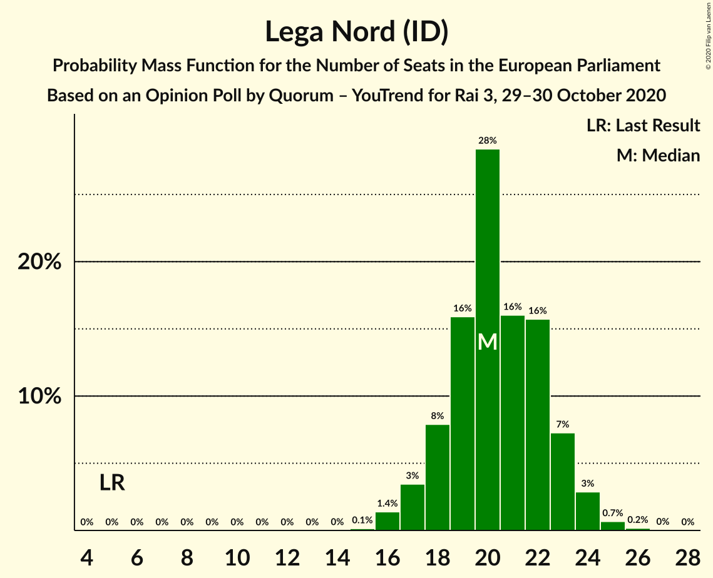

| Number of Seats | Probability | Accumulated | Special Marks |
|:---------------:|:-----------:|:-----------:|:-------------:|
| 5 | 0% | 100% | Last Result |
| 6 | 0% | 100% |  |
| 7 | 0% | 100% |  |
| 8 | 0% | 100% |  |
| 9 | 0% | 100% |  |
| 10 | 0% | 100% |  |
| 11 | 0% | 100% |  |
| 12 | 0% | 100% |  |
| 13 | 0% | 100% |  |
| 14 | 0% | 100% |  |
| 15 | 0.1% | 100% |  |
| 16 | 1.4% | 99.8% |  |
| 17 | 3% | 98% |  |
| 18 | 8% | 95% |  |
| 19 | 16% | 87% |  |
| 20 | 28% | 71% | Median |
| 21 | 16% | 43% |  |
| 22 | 16% | 27% |  |
| 23 | 7% | 11% |  |
| 24 | 3% | 4% |  |
| 25 | 0.7% | 0.9% |  |
| 26 | 0.2% | 0.2% |  |
| 27 | 0% | 0% |  |

### Partito Democratico (S&D)

*For a full overview of the results for this party, see the [Partito Democratico (S&D)](party-partitodemocraticosd.html) page.*

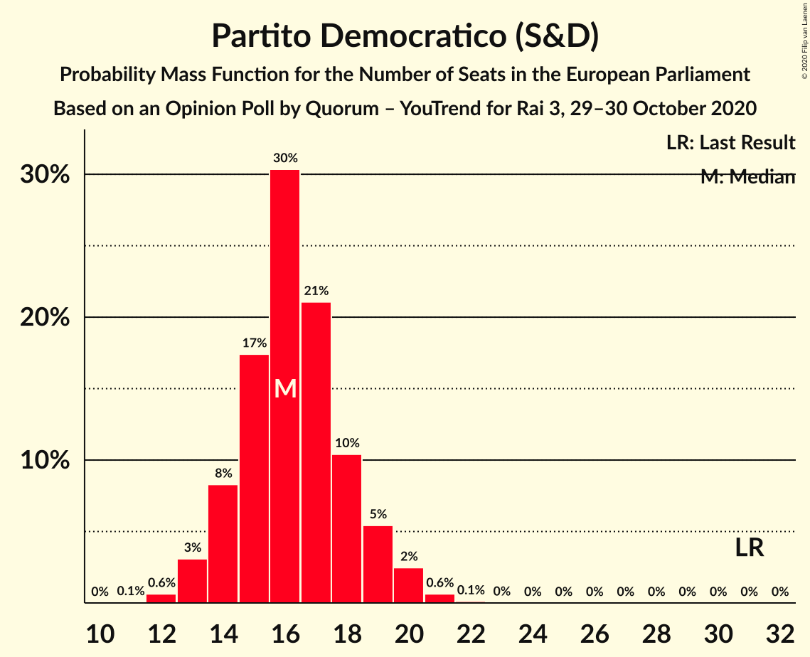

| Number of Seats | Probability | Accumulated | Special Marks |
|:---------------:|:-----------:|:-----------:|:-------------:|
| 11 | 0.1% | 100% |  |
| 12 | 0.6% | 99.9% |  |
| 13 | 3% | 99.3% |  |
| 14 | 8% | 96% |  |
| 15 | 17% | 88% |  |
| 16 | 30% | 71% | Median |
| 17 | 21% | 40% |  |
| 18 | 10% | 19% |  |
| 19 | 5% | 9% |  |
| 20 | 2% | 3% |  |
| 21 | 0.6% | 0.8% |  |
| 22 | 0.1% | 0.2% |  |
| 23 | 0% | 0% |  |
| 24 | 0% | 0% |  |
| 25 | 0% | 0% |  |
| 26 | 0% | 0% |  |
| 27 | 0% | 0% |  |
| 28 | 0% | 0% |  |
| 29 | 0% | 0% |  |
| 30 | 0% | 0% |  |
| 31 | 0% | 0% | Last Result |

### Movimento 5 Stelle (NI)

*For a full overview of the results for this party, see the [Movimento 5 Stelle (NI)](party-movimento5stelleni.html) page.*

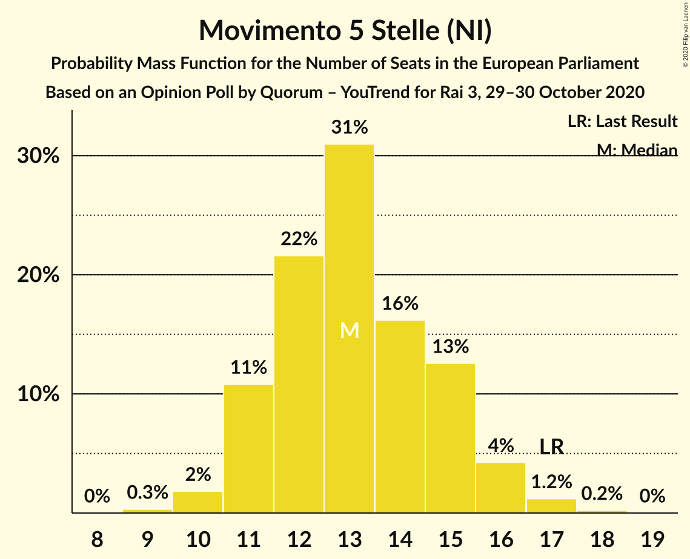

| Number of Seats | Probability | Accumulated | Special Marks |
|:---------------:|:-----------:|:-----------:|:-------------:|
| 9 | 0.3% | 100% |  |
| 10 | 2% | 99.7% |  |
| 11 | 11% | 98% |  |
| 12 | 22% | 87% |  |
| 13 | 31% | 65% | Median |
| 14 | 16% | 34% |  |
| 15 | 13% | 18% |  |
| 16 | 4% | 6% |  |
| 17 | 1.2% | 1.4% | Last Result |
| 18 | 0.2% | 0.2% |  |
| 19 | 0% | 0% |  |

### Fratelli d’Italia (ECR)

*For a full overview of the results for this party, see the [Fratelli d’Italia (ECR)](party-fratellid’italiaecr.html) page.*

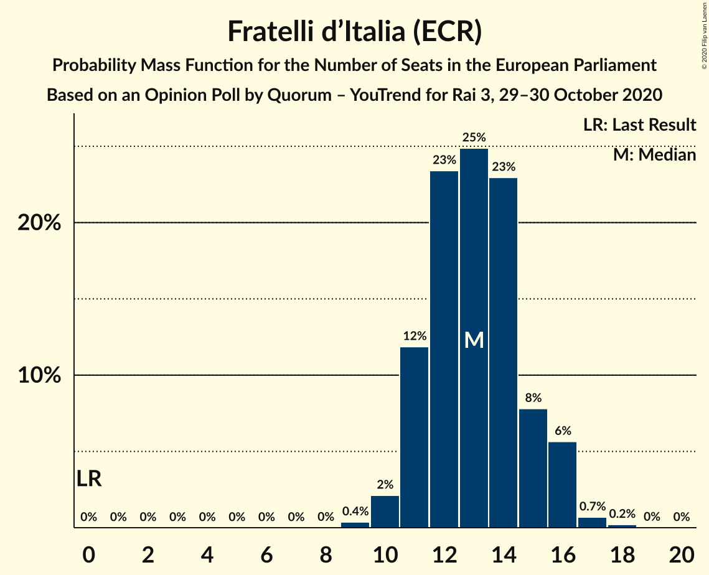

| Number of Seats | Probability | Accumulated | Special Marks |
|:---------------:|:-----------:|:-----------:|:-------------:|
| 0 | 0% | 100% | Last Result |
| 1 | 0% | 100% |  |
| 2 | 0% | 100% |  |
| 3 | 0% | 100% |  |
| 4 | 0% | 100% |  |
| 5 | 0% | 100% |  |
| 6 | 0% | 100% |  |
| 7 | 0% | 100% |  |
| 8 | 0% | 100% |  |
| 9 | 0.4% | 100% |  |
| 10 | 2% | 99.6% |  |
| 11 | 12% | 97% |  |
| 12 | 23% | 86% |  |
| 13 | 25% | 62% | Median |
| 14 | 23% | 37% |  |
| 15 | 8% | 14% |  |
| 16 | 6% | 7% |  |
| 17 | 0.7% | 0.9% |  |
| 18 | 0.2% | 0.2% |  |
| 19 | 0% | 0% |  |

### Forza Italia (EPP)

*For a full overview of the results for this party, see the [Forza Italia (EPP)](party-forzaitaliaepp.html) page.*

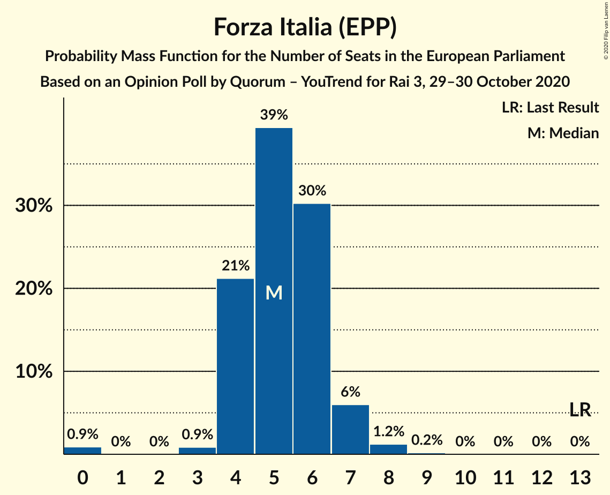

| Number of Seats | Probability | Accumulated | Special Marks |
|:---------------:|:-----------:|:-----------:|:-------------:|
| 0 | 0.9% | 100% |  |
| 1 | 0% | 99.1% |  |
| 2 | 0% | 99.1% |  |
| 3 | 0.9% | 99.1% |  |
| 4 | 21% | 98% |  |
| 5 | 39% | 77% | Median |
| 6 | 30% | 38% |  |
| 7 | 6% | 7% |  |
| 8 | 1.2% | 1.4% |  |
| 9 | 0.2% | 0.2% |  |
| 10 | 0% | 0% |  |
| 11 | 0% | 0% |  |
| 12 | 0% | 0% |  |
| 13 | 0% | 0% | Last Result |

### Liberi e Uguali (S&D)

*For a full overview of the results for this party, see the [Liberi e Uguali (S&D)](party-liberieugualisd.html) page.*

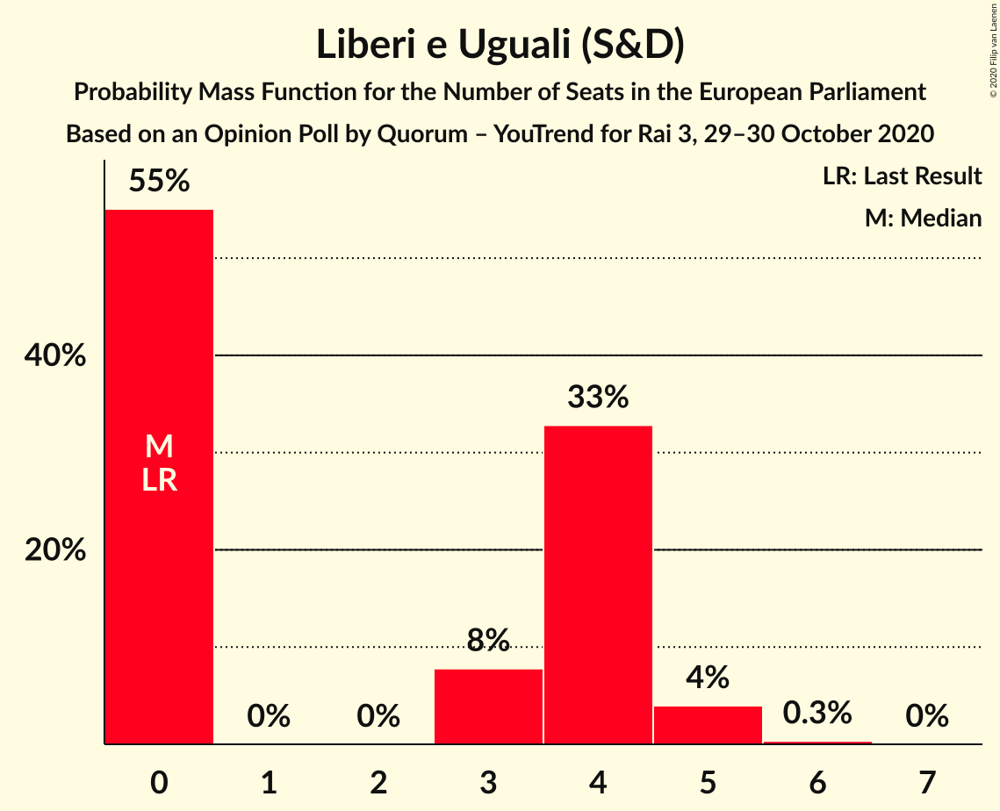

| Number of Seats | Probability | Accumulated | Special Marks |
|:---------------:|:-----------:|:-----------:|:-------------:|
| 0 | 55% | 100% | Last Result, Median |
| 1 | 0% | 45% |  |
| 2 | 0% | 45% |  |
| 3 | 8% | 45% |  |
| 4 | 33% | 37% |  |
| 5 | 4% | 4% |  |
| 6 | 0.3% | 0.4% |  |
| 7 | 0% | 0% |  |

### Azione (S&D)

*For a full overview of the results for this party, see the [Azione (S&D)](party-azionesd.html) page.*

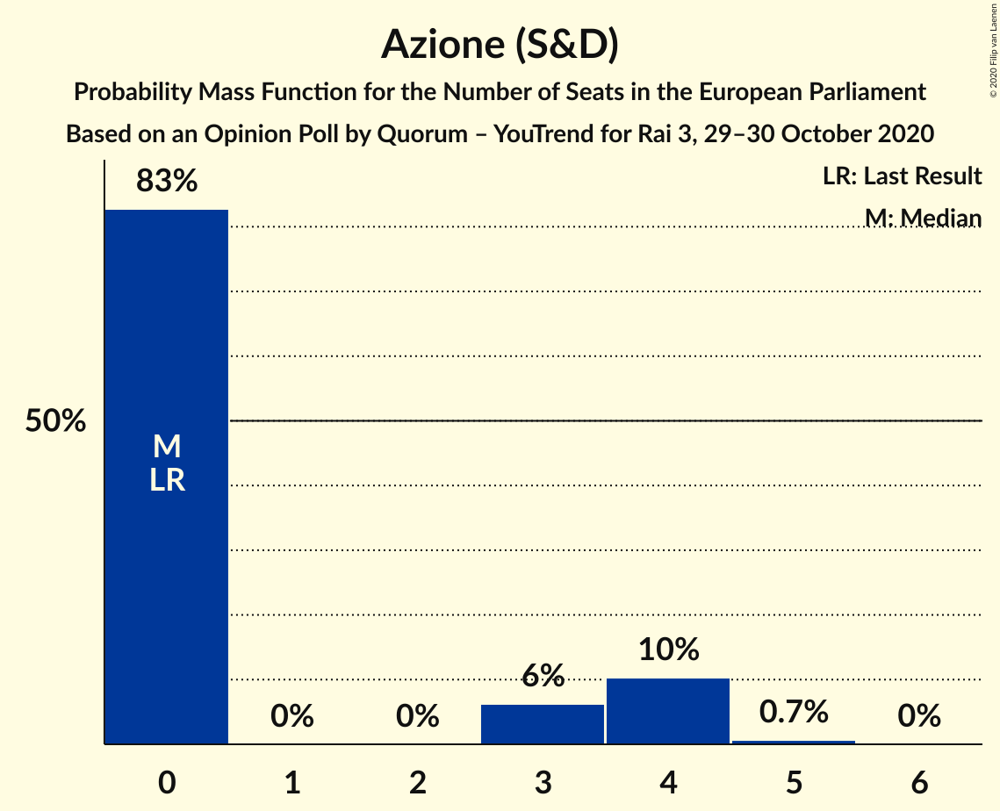

| Number of Seats | Probability | Accumulated | Special Marks |
|:---------------:|:-----------:|:-----------:|:-------------:|
| 0 | 83% | 100% | Last Result, Median |
| 1 | 0% | 17% |  |
| 2 | 0% | 17% |  |
| 3 | 6% | 17% |  |
| 4 | 10% | 11% |  |
| 5 | 0.7% | 0.7% |  |
| 6 | 0% | 0% |  |

### Italia Viva (RE)

*For a full overview of the results for this party, see the [Italia Viva (RE)](party-italiavivare.html) page.*

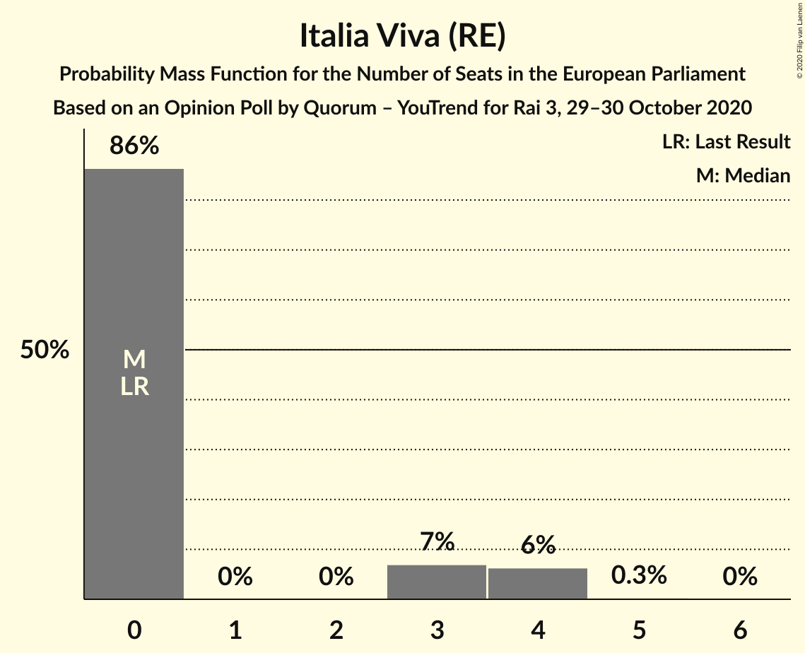

| Number of Seats | Probability | Accumulated | Special Marks |
|:---------------:|:-----------:|:-----------:|:-------------:|
| 0 | 86% | 100% | Last Result, Median |
| 1 | 0% | 14% |  |
| 2 | 0% | 14% |  |
| 3 | 7% | 14% |  |
| 4 | 6% | 7% |  |
| 5 | 0.3% | 0.3% |  |
| 6 | 0% | 0% |  |

### Più Europa (RE)

*For a full overview of the results for this party, see the [Più Europa (RE)](party-piùeuropare.html) page.*

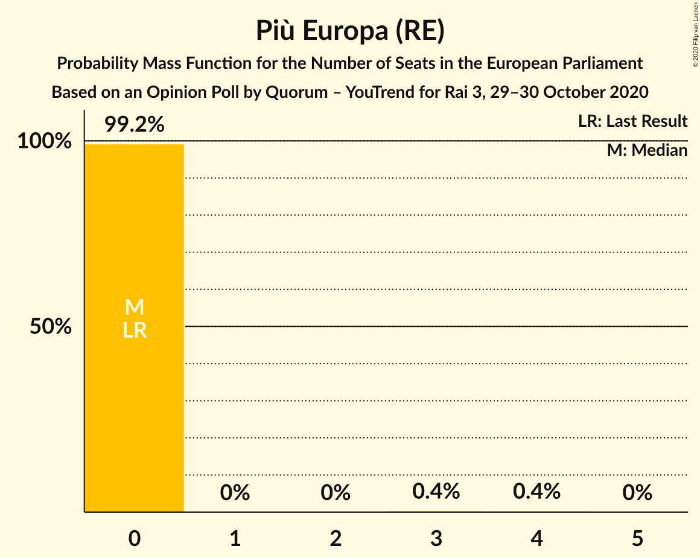

| Number of Seats | Probability | Accumulated | Special Marks |
|:---------------:|:-----------:|:-----------:|:-------------:|
| 0 | 99.2% | 100% | Last Result, Median |
| 1 | 0% | 0.8% |  |
| 2 | 0% | 0.8% |  |
| 3 | 0.4% | 0.8% |  |
| 4 | 0.4% | 0.4% |  |
| 5 | 0% | 0% |  |

## Coalitions

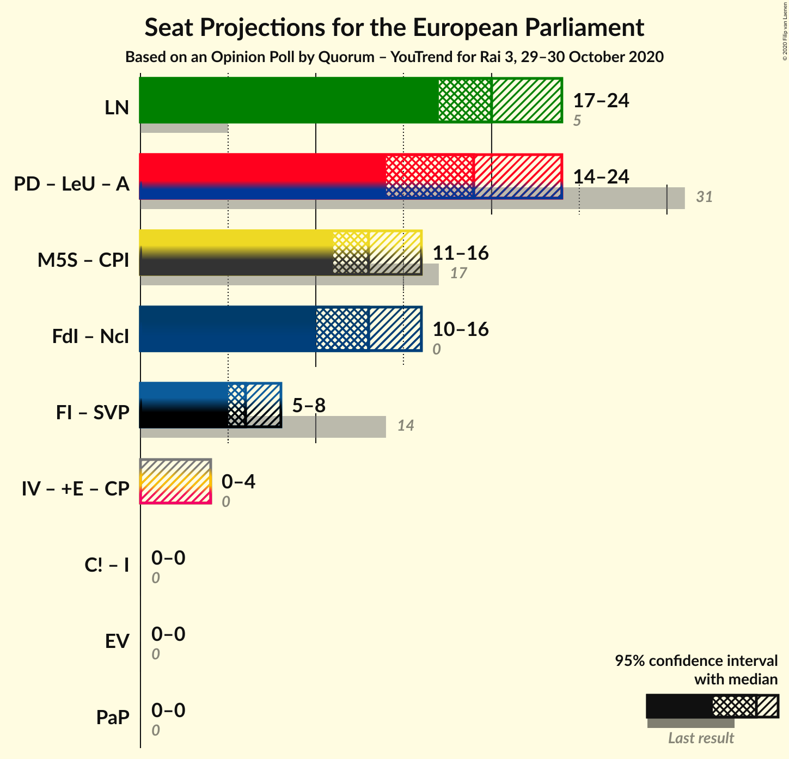

### Confidence Intervals

| Coalition | Last Result | Median | Majority? | 80% Confidence Interval | 90% Confidence Interval | 95% Confidence Interval | 99% Confidence Interval |
|:---------:|:-----------:|:------:|:---------:|:-----------------------:|:-----------------------:|:-----------------------:|:-----------------------:|
| Lega Nord (ID) | 5 | 20 | 0% | 18–23 | 17–23 | 17–24 | 16–25 |
| Partito Democratico (S&D) – Liberi e Uguali (S&D) – Azione (S&D) | 31 | 19 | 0% | 15–22 | 15–23 | 14–24 | 13–25 |

### Lega Nord (ID)

| Number of Seats | Probability | Accumulated | Special Marks |
|:---------------:|:-----------:|:-----------:|:-------------:|
| 5 | 0% | 100% | Last Result |
| 6 | 0% | 100% |  |
| 7 | 0% | 100% |  |
| 8 | 0% | 100% |  |
| 9 | 0% | 100% |  |
| 10 | 0% | 100% |  |
| 11 | 0% | 100% |  |
| 12 | 0% | 100% |  |
| 13 | 0% | 100% |  |
| 14 | 0% | 100% |  |
| 15 | 0.1% | 100% |  |
| 16 | 1.4% | 99.8% |  |
| 17 | 3% | 98% |  |
| 18 | 8% | 95% |  |
| 19 | 16% | 87% |  |
| 20 | 28% | 71% | Median |
| 21 | 16% | 43% |  |
| 22 | 16% | 27% |  |
| 23 | 7% | 11% |  |
| 24 | 3% | 4% |  |
| 25 | 0.7% | 0.9% |  |
| 26 | 0.2% | 0.2% |  |
| 27 | 0% | 0% |  |

### Partito Democratico (S&D) – Liberi e Uguali (S&D) – Azione (S&D)

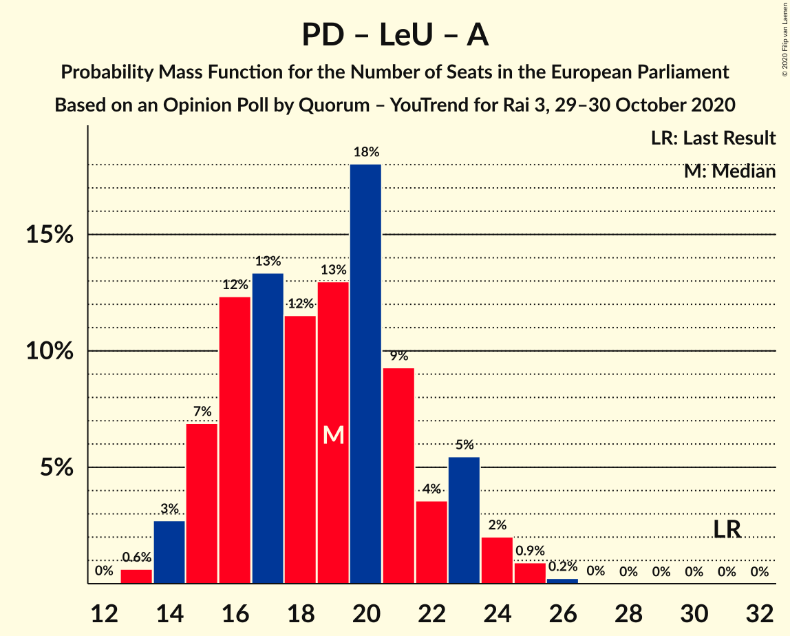

| Number of Seats | Probability | Accumulated | Special Marks |
|:---------------:|:-----------:|:-----------:|:-------------:|
| 12 | 0% | 100% |  |
| 13 | 0.6% | 99.9% |  |
| 14 | 3% | 99.3% |  |
| 15 | 7% | 97% |  |
| 16 | 12% | 90% | Median |
| 17 | 13% | 77% |  |
| 18 | 12% | 64% |  |
| 19 | 13% | 53% |  |
| 20 | 18% | 40% |  |
| 21 | 9% | 22% |  |
| 22 | 4% | 12% |  |
| 23 | 5% | 9% |  |
| 24 | 2% | 3% |  |
| 25 | 0.9% | 1.2% |  |
| 26 | 0.2% | 0.3% |  |
| 27 | 0% | 0.1% |  |
| 28 | 0% | 0% |  |
| 29 | 0% | 0% |  |
| 30 | 0% | 0% |  |
| 31 | 0% | 0% | Last Result |

## Technical Information

### Opinion Poll

+ **Polling firm:** Quorum – YouTrend
+ **Commissioner(s):** Rai 3
+ **Fieldwork period:** 29–30 October 2020

### Calculations

+ **Sample size:** 503
+ **Simulations done:** 1,048,576
+ **Error estimate:** 1.95%

