# Opinion Poll by Piepoli for RaiNews24, 25 May 2021

<a href="#voting-intentions">Voting Intentions</a> | <a href="#seats">Seats</a> | <a href="#coalitions">Coalitions</a> | <a href="#technical-information">Technical Information</a>

## Voting Intentions

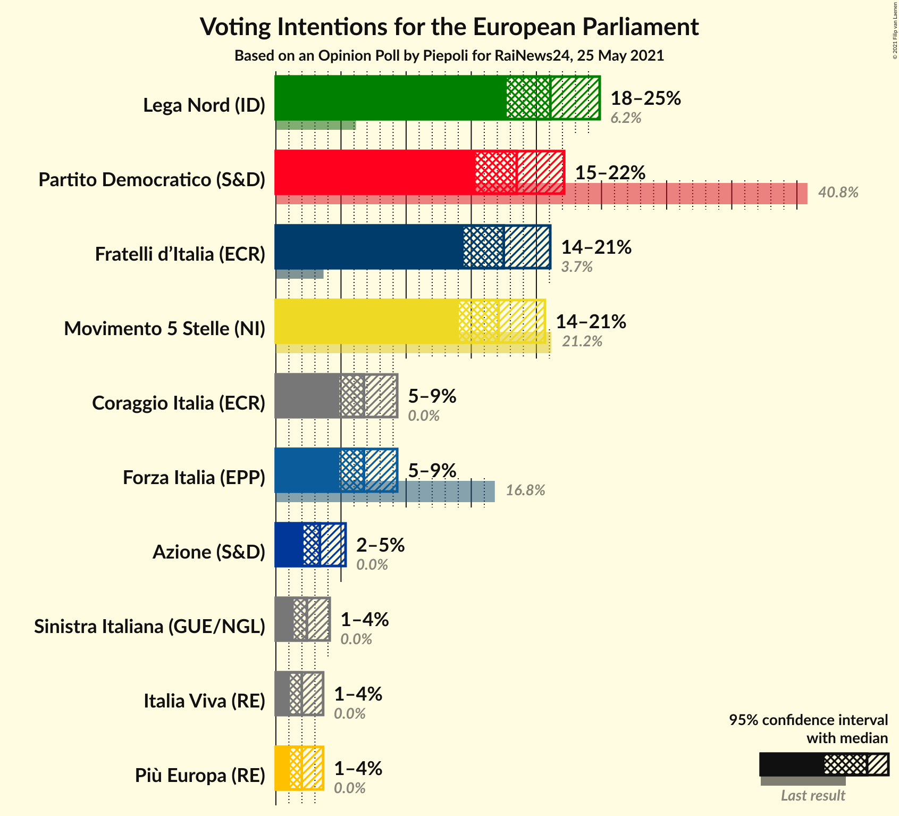

### Confidence Intervals

| Party | Last Result | Poll Result | 80% Confidence Interval | 90% Confidence Interval | 95% Confidence Interval | 99% Confidence Interval |
|:-----:|:-----------:|:-----------:|:-----------------------:|:-----------------------:|:-----------------------:|:-----------------------:|
| Lega Nord (ID) | 6.2% | 21.1% | 18.9–23.5% |18.3–24.2% |17.7–24.9% |16.7–26.1% |
| Partito Democratico (S&D) | 40.8% | 18.5% | 16.4–20.9% |15.8–21.5% |15.3–22.1% |14.4–23.3% |
| Fratelli d’Italia (ECR) | 3.7% | 17.5% | 15.5–19.8% |14.9–20.5% |14.4–21.1% |13.5–22.2% |
| Movimento 5 Stelle (NI) | 21.2% | 17.1% | 15.1–19.4% |14.5–20.1% |14.1–20.7% |13.2–21.8% |
| Forza Italia (EPP) | 16.8% | 6.8% | 5.5–8.4% |5.2–8.9% |4.9–9.3% |4.3–10.2% |
| Coraggio Italia (ECR) | 0.0% | 6.8% | 5.5–8.4% |5.2–8.9% |4.9–9.3% |4.3–10.2% |
| Azione (S&D) | 0.0% | 3.4% | 2.5–4.7% |2.3–5.0% |2.1–5.3% |1.8–6.0% |
| Sinistra Italiana (GUE/NGL) | 0.0% | 2.4% | 1.7–3.5% |1.5–3.8% |1.4–4.1% |1.1–4.7% |
| Più Europa (RE) | 0.0% | 2.0% | 1.4–3.0% |1.2–3.4% |1.1–3.6% |0.9–4.2% |
| Italia Viva (RE) | 0.0% | 2.0% | 1.4–3.0% |1.2–3.4% |1.1–3.6% |0.9–4.2% |

*Note:* The poll result column reflects the actual value used in the calculations. Published results may vary slightly, and in addition be rounded to fewer digits.

## Seats

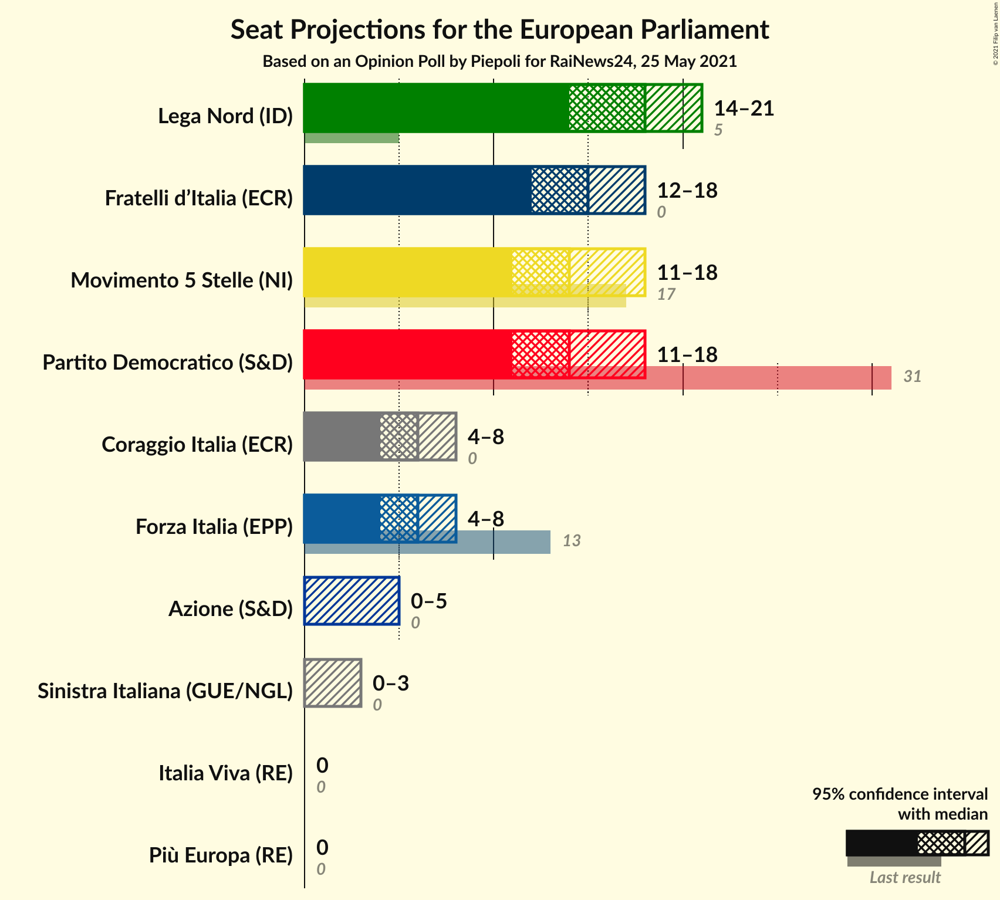

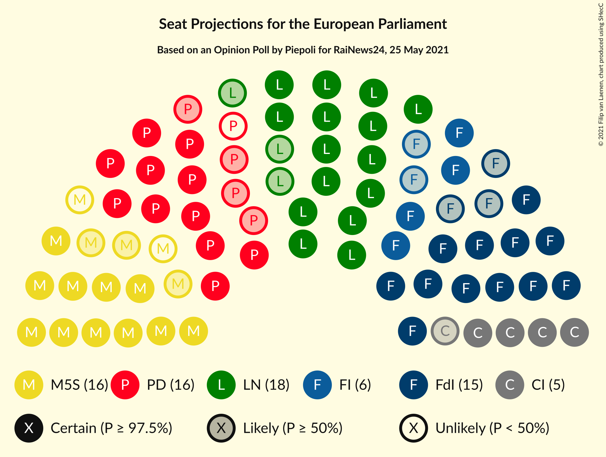

### Confidence Intervals

| Party | Last Result | Median | 80% Confidence Interval | 90% Confidence Interval | 95% Confidence Interval | 99% Confidence Interval |
|:-----:|:-----------:|:------:|:-----------------------:|:-----------------------:|:-----------------------:|:-----------------------:|
| <a href="#lega-nord-(id)">Lega Nord (ID)</a> | 5 | 18 | 16–20 |15–21 |15–21 |14–23 |
| <a href="#partito-democratico-(s&d)">Partito Democratico (S&D)</a> | 31 | 15 | 12–17 |11–17 |11–18 |11–19 |
| <a href="#fratelli-d’italia-(ecr)">Fratelli d’Italia (ECR)</a> | 0 | 15 | 13–17 |12–18 |12–18 |11–19 |
| <a href="#movimento-5-stelle-(ni)">Movimento 5 Stelle (NI)</a> | 17 | 14 | 12–16 |12–17 |11–18 |11–19 |
| <a href="#forza-italia-(epp)">Forza Italia (EPP)</a> | 13 | 6 | 4–7 |4–8 |4–8 |3–9 |
| <a href="#coraggio-italia-(ecr)">Coraggio Italia (ECR)</a> | 0 | 5 | 4–7 |4–8 |4–8 |0–9 |
| <a href="#azione-(s&d)">Azione (S&D)</a> | 0 | 0 | 0–4 |0–4 |0–5 |0–5 |
| <a href="#sinistra-italiana-(gue/ngl)">Sinistra Italiana (GUE/NGL)</a> | 0 | 0 | 0 |0 |0 |0–4 |
| <a href="#più-europa-(re)">Più Europa (RE)</a> | 0 | 0 | 0 |0 |0 |0–4 |
| <a href="#italia-viva-(re)">Italia Viva (RE)</a> | 0 | 0 | 0 |0 |0 |0–4 |

### Lega Nord (ID)

*For a full overview of the results for this party, see the [Lega Nord (ID)](party-leganordid.html) page.*

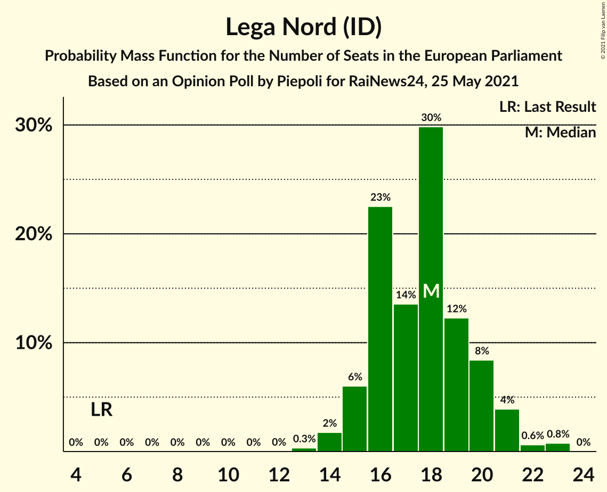

| Number of Seats | Probability | Accumulated | Special Marks |
|:---------------:|:-----------:|:-----------:|:-------------:|
| 5 | 0% | 100% | Last Result |
| 6 | 0% | 100% |  |
| 7 | 0% | 100% |  |
| 8 | 0% | 100% |  |
| 9 | 0% | 100% |  |
| 10 | 0% | 100% |  |
| 11 | 0% | 100% |  |
| 12 | 0% | 100% |  |
| 13 | 0.3% | 100% |  |
| 14 | 2% | 99.7% |  |
| 15 | 6% | 98% |  |
| 16 | 23% | 92% |  |
| 17 | 14% | 69% |  |
| 18 | 30% | 56% | Median |
| 19 | 12% | 26% |  |
| 20 | 8% | 14% |  |
| 21 | 4% | 5% |  |
| 22 | 0.6% | 1.4% |  |
| 23 | 0.8% | 0.8% |  |
| 24 | 0% | 0% |  |

### Partito Democratico (S&D)

*For a full overview of the results for this party, see the [Partito Democratico (S&D)](party-partitodemocraticosd.html) page.*

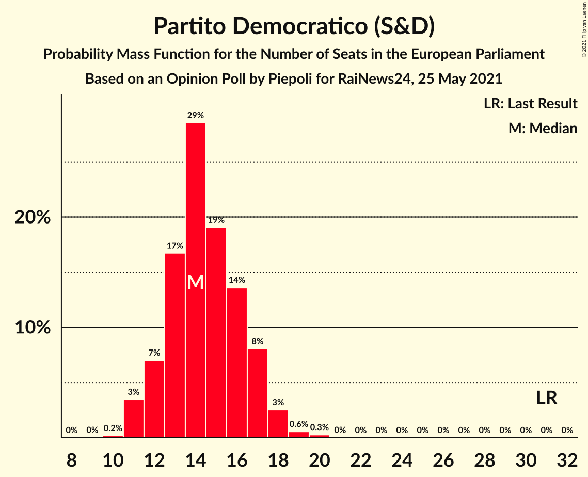

| Number of Seats | Probability | Accumulated | Special Marks |
|:---------------:|:-----------:|:-----------:|:-------------:|
| 10 | 0.3% | 100% |  |
| 11 | 5% | 99.6% |  |
| 12 | 12% | 95% |  |
| 13 | 6% | 83% |  |
| 14 | 26% | 77% |  |
| 15 | 12% | 51% | Median |
| 16 | 25% | 39% |  |
| 17 | 11% | 14% |  |
| 18 | 2% | 3% |  |
| 19 | 0.3% | 0.8% |  |
| 20 | 0.4% | 0.5% |  |
| 21 | 0% | 0% |  |
| 22 | 0% | 0% |  |
| 23 | 0% | 0% |  |
| 24 | 0% | 0% |  |
| 25 | 0% | 0% |  |
| 26 | 0% | 0% |  |
| 27 | 0% | 0% |  |
| 28 | 0% | 0% |  |
| 29 | 0% | 0% |  |
| 30 | 0% | 0% |  |
| 31 | 0% | 0% | Last Result |

### Fratelli d’Italia (ECR)

*For a full overview of the results for this party, see the [Fratelli d’Italia (ECR)](party-fratellid’italiaecr.html) page.*

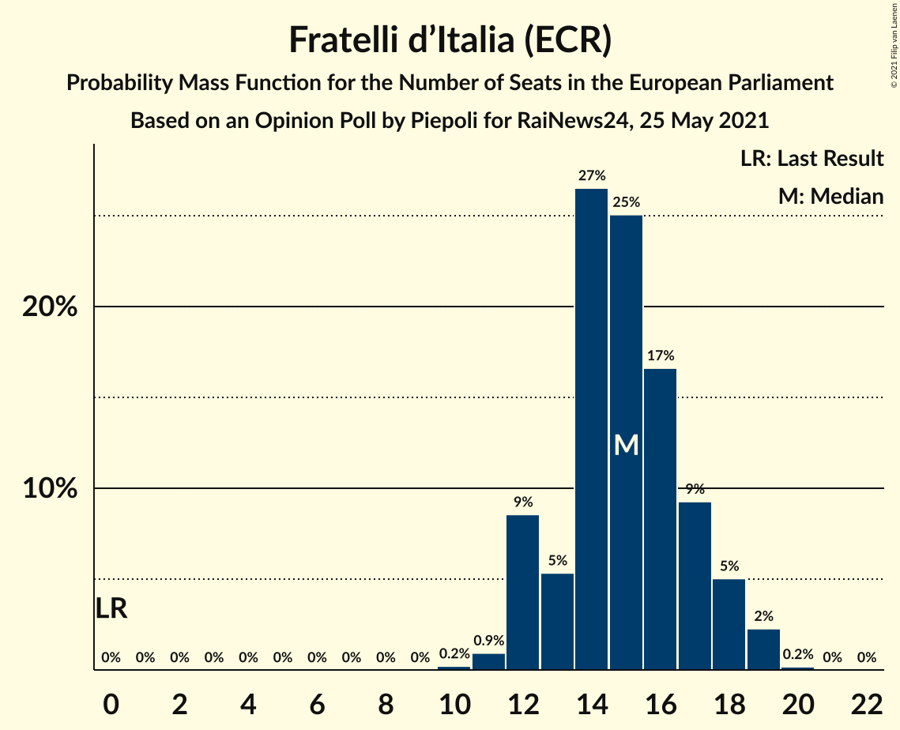

| Number of Seats | Probability | Accumulated | Special Marks |
|:---------------:|:-----------:|:-----------:|:-------------:|
| 0 | 0% | 100% | Last Result |
| 1 | 0% | 100% |  |
| 2 | 0% | 100% |  |
| 3 | 0% | 100% |  |
| 4 | 0% | 100% |  |
| 5 | 0% | 100% |  |
| 6 | 0% | 100% |  |
| 7 | 0% | 100% |  |
| 8 | 0% | 100% |  |
| 9 | 0% | 100% |  |
| 10 | 0.2% | 100% |  |
| 11 | 0.9% | 99.8% |  |
| 12 | 9% | 98.9% |  |
| 13 | 5% | 90% |  |
| 14 | 27% | 85% |  |
| 15 | 25% | 58% | Median |
| 16 | 17% | 33% |  |
| 17 | 9% | 17% |  |
| 18 | 5% | 7% |  |
| 19 | 2% | 2% |  |
| 20 | 0.2% | 0.2% |  |
| 21 | 0% | 0% |  |

### Movimento 5 Stelle (NI)

*For a full overview of the results for this party, see the [Movimento 5 Stelle (NI)](party-movimento5stelleni.html) page.*

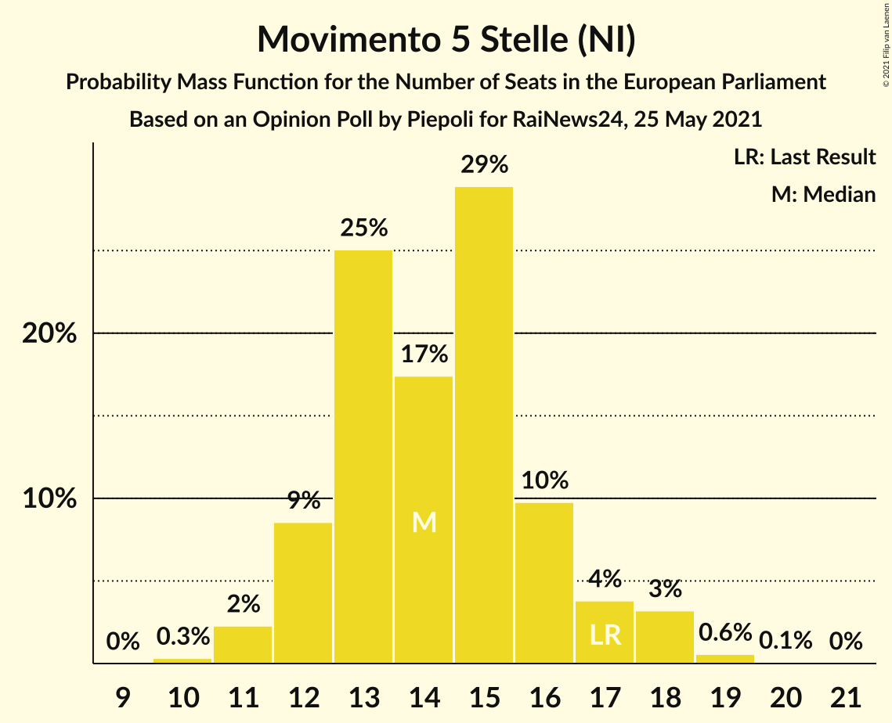

| Number of Seats | Probability | Accumulated | Special Marks |
|:---------------:|:-----------:|:-----------:|:-------------:|
| 10 | 0.2% | 100% |  |
| 11 | 3% | 99.7% |  |
| 12 | 9% | 97% |  |
| 13 | 29% | 88% |  |
| 14 | 20% | 59% | Median |
| 15 | 17% | 39% |  |
| 16 | 16% | 21% |  |
| 17 | 1.4% | 6% | Last Result |
| 18 | 4% | 4% |  |
| 19 | 0.2% | 0.5% |  |
| 20 | 0.3% | 0.3% |  |
| 21 | 0% | 0% |  |

### Forza Italia (EPP)

*For a full overview of the results for this party, see the [Forza Italia (EPP)](party-forzaitaliaepp.html) page.*

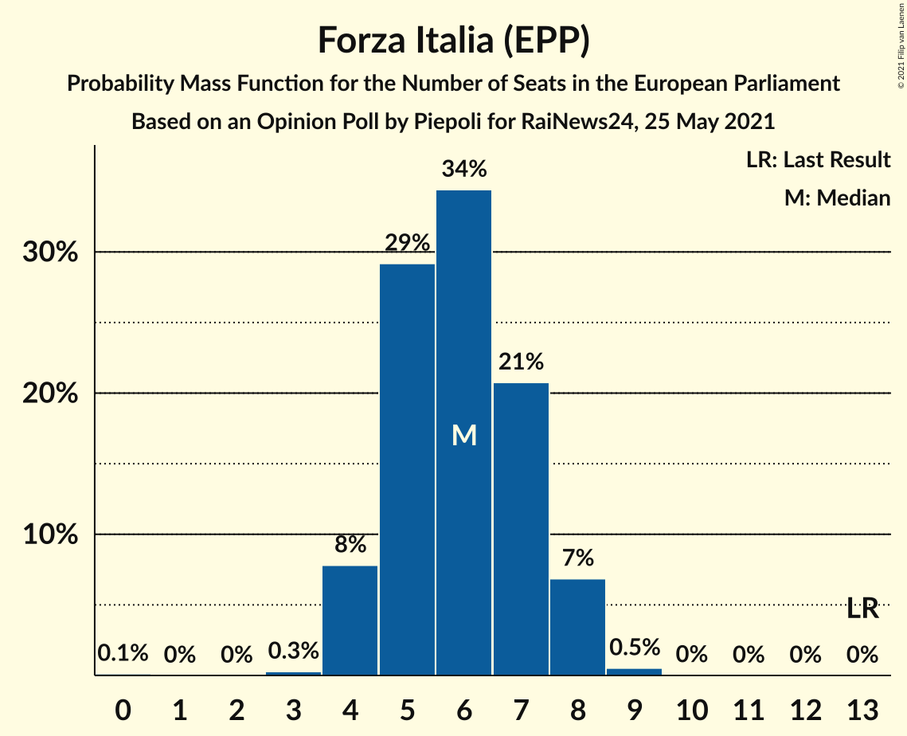

| Number of Seats | Probability | Accumulated | Special Marks |
|:---------------:|:-----------:|:-----------:|:-------------:|
| 0 | 0.2% | 100% |  |
| 1 | 0% | 99.8% |  |
| 2 | 0% | 99.8% |  |
| 3 | 0.3% | 99.8% |  |
| 4 | 11% | 99.5% |  |
| 5 | 24% | 88% |  |
| 6 | 44% | 65% | Median |
| 7 | 11% | 21% |  |
| 8 | 8% | 10% |  |
| 9 | 1.1% | 1.2% |  |
| 10 | 0% | 0% |  |
| 11 | 0% | 0% |  |
| 12 | 0% | 0% |  |
| 13 | 0% | 0% | Last Result |

### Coraggio Italia (ECR)

*For a full overview of the results for this party, see the [Coraggio Italia (ECR)](party-coraggioitaliaecr.html) page.*

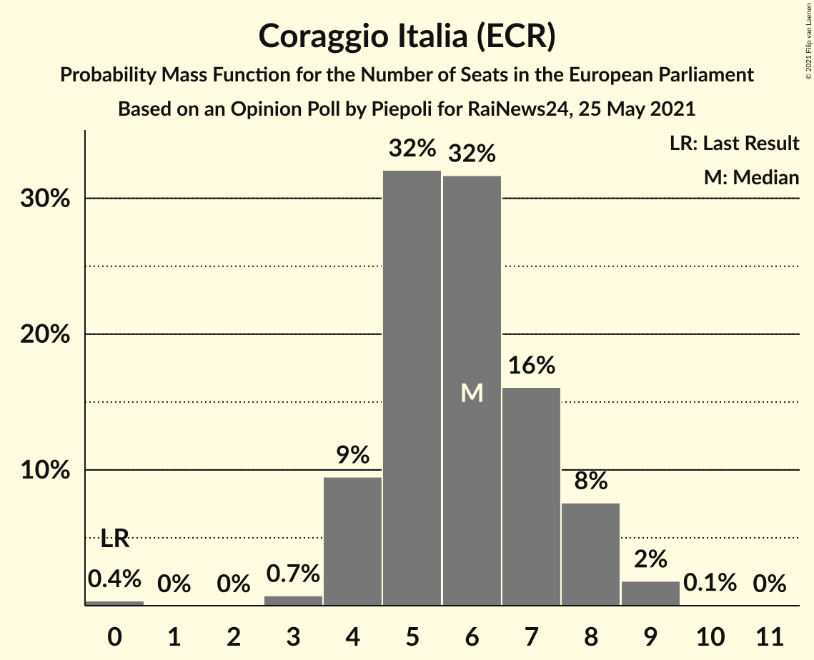

| Number of Seats | Probability | Accumulated | Special Marks |
|:---------------:|:-----------:|:-----------:|:-------------:|
| 0 | 0.8% | 100% | Last Result |
| 1 | 0% | 99.2% |  |
| 2 | 0% | 99.2% |  |
| 3 | 0% | 99.2% |  |
| 4 | 15% | 99.2% |  |
| 5 | 35% | 85% | Median |
| 6 | 22% | 50% |  |
| 7 | 21% | 28% |  |
| 8 | 6% | 7% |  |
| 9 | 0.7% | 1.0% |  |
| 10 | 0.3% | 0.3% |  |
| 11 | 0% | 0% |  |

### Azione (S&D)

*For a full overview of the results for this party, see the [Azione (S&D)](party-azionesd.html) page.*

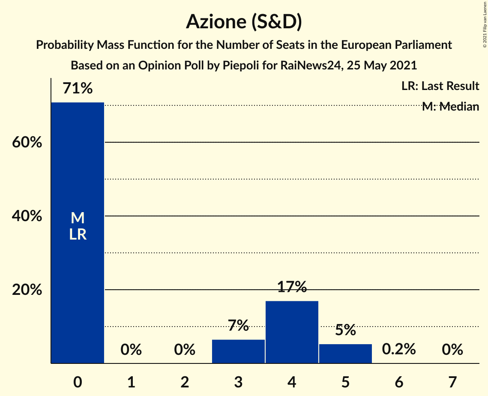

| Number of Seats | Probability | Accumulated | Special Marks |
|:---------------:|:-----------:|:-----------:|:-------------:|
| 0 | 69% | 100% | Last Result, Median |
| 1 | 0% | 31% |  |
| 2 | 0% | 31% |  |
| 3 | 2% | 31% |  |
| 4 | 26% | 29% |  |
| 5 | 2% | 3% |  |
| 6 | 0.2% | 0.2% |  |
| 7 | 0% | 0% |  |

### Sinistra Italiana (GUE/NGL)

*For a full overview of the results for this party, see the [Sinistra Italiana (GUE/NGL)](party-sinistraitalianaguengl.html) page.*

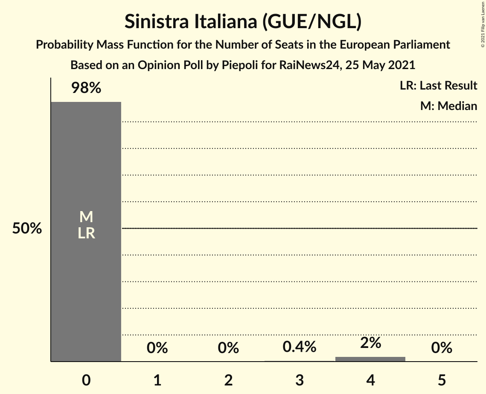

| Number of Seats | Probability | Accumulated | Special Marks |
|:---------------:|:-----------:|:-----------:|:-------------:|
| 0 | 98% | 100% | Last Result, Median |
| 1 | 0% | 2% |  |
| 2 | 0% | 2% |  |
| 3 | 0.4% | 2% |  |
| 4 | 2% | 2% |  |
| 5 | 0% | 0% |  |

### Più Europa (RE)

*For a full overview of the results for this party, see the [Più Europa (RE)](party-piùeuropare.html) page.*

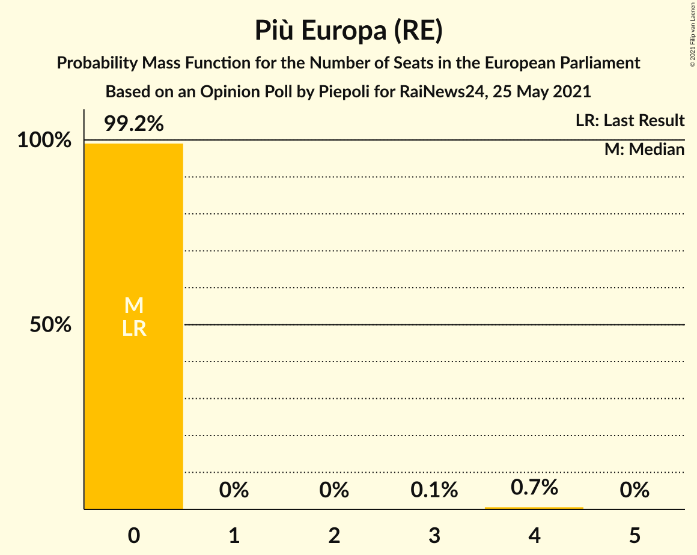

| Number of Seats | Probability | Accumulated | Special Marks |
|:---------------:|:-----------:|:-----------:|:-------------:|
| 0 | 99.2% | 100% | Last Result, Median |
| 1 | 0% | 0.8% |  |
| 2 | 0% | 0.8% |  |
| 3 | 0.1% | 0.8% |  |
| 4 | 0.7% | 0.8% |  |
| 5 | 0% | 0% |  |

### Italia Viva (RE)

*For a full overview of the results for this party, see the [Italia Viva (RE)](party-italiavivare.html) page.*

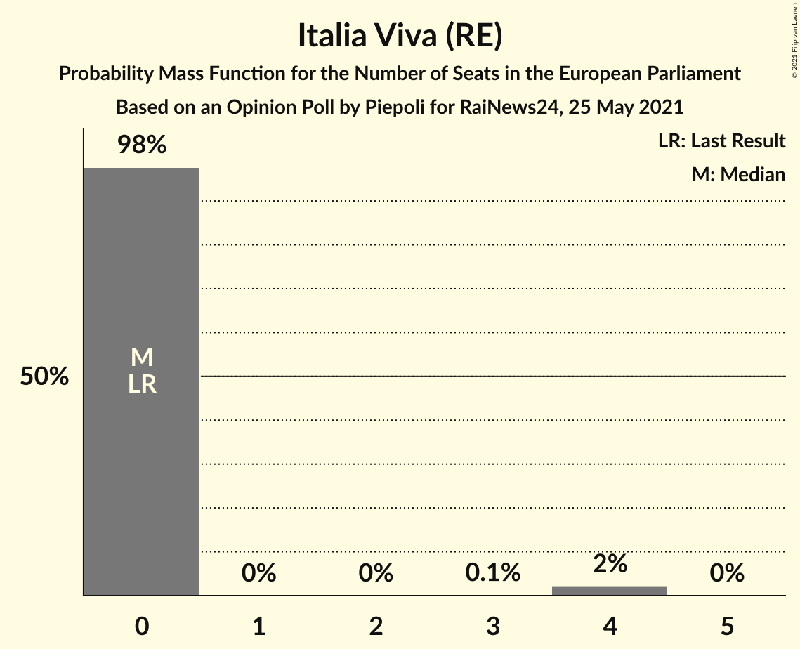

| Number of Seats | Probability | Accumulated | Special Marks |
|:---------------:|:-----------:|:-----------:|:-------------:|
| 0 | 98% | 100% | Last Result, Median |
| 1 | 0% | 2% |  |
| 2 | 0% | 2% |  |
| 3 | 0.1% | 2% |  |
| 4 | 2% | 2% |  |
| 5 | 0% | 0% |  |

## Coalitions

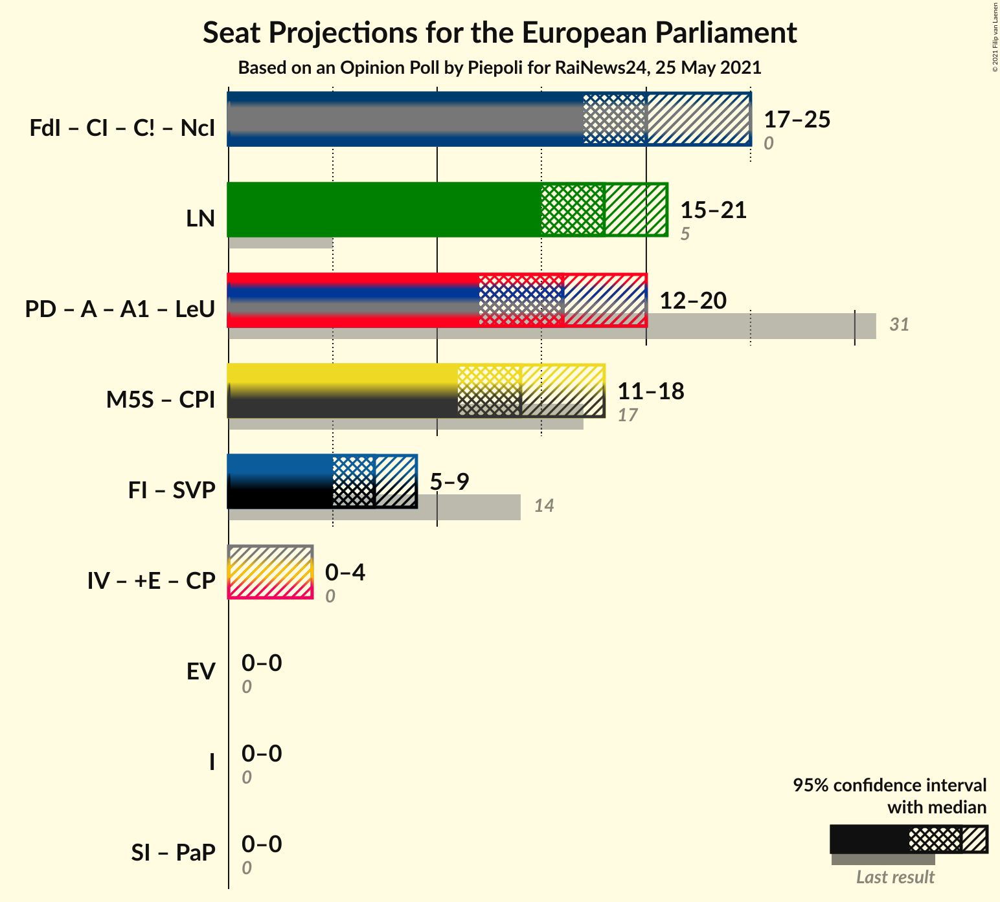

### Confidence Intervals

| Coalition | Last Result | Median | Majority? | 80% Confidence Interval | 90% Confidence Interval | 95% Confidence Interval | 99% Confidence Interval |
|:---------:|:-----------:|:------:|:---------:|:-----------------------:|:-----------------------:|:-----------------------:|:-----------------------:|
| Lega Nord (ID) | 5 | 18 | 0% | 16–20 | 15–21 | 15–21 | 14–23 |

### Lega Nord (ID)

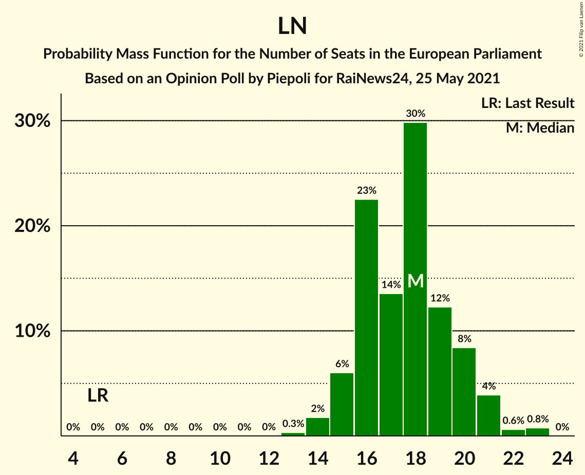

| Number of Seats | Probability | Accumulated | Special Marks |
|:---------------:|:-----------:|:-----------:|:-------------:|
| 5 | 0% | 100% | Last Result |
| 6 | 0% | 100% |  |
| 7 | 0% | 100% |  |
| 8 | 0% | 100% |  |
| 9 | 0% | 100% |  |
| 10 | 0% | 100% |  |
| 11 | 0% | 100% |  |
| 12 | 0% | 100% |  |
| 13 | 0.3% | 100% |  |
| 14 | 2% | 99.7% |  |
| 15 | 6% | 98% |  |
| 16 | 23% | 92% |  |
| 17 | 14% | 69% |  |
| 18 | 30% | 56% | Median |
| 19 | 12% | 26% |  |
| 20 | 8% | 14% |  |
| 21 | 4% | 5% |  |
| 22 | 0.6% | 1.4% |  |
| 23 | 0.8% | 0.8% |  |
| 24 | 0% | 0% |  |

## Technical Information

### Opinion Poll

+ **Polling firm:** Piepoli
+ **Commissioner(s):** RaiNews24
+ **Fieldwork period:** 25 May 2021

### Calculations

+ **Sample size:** 503
+ **Simulations done:** 131,072
+ **Error estimate:** 2.99%

