# Opinion Poll by Piepoli for RaiNews24, 7–8 June 2021

<a href="#voting-intentions">Voting Intentions</a> | <a href="#seats">Seats</a> | <a href="#coalitions">Coalitions</a> | <a href="#technical-information">Technical Information</a>

## Voting Intentions

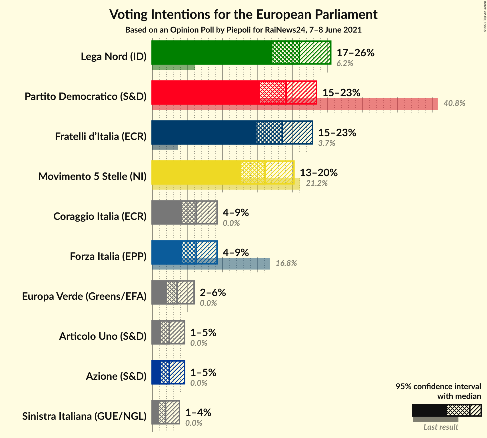

### Confidence Intervals

| Party | Last Result | Poll Result | 80% Confidence Interval | 90% Confidence Interval | 95% Confidence Interval | 99% Confidence Interval |
|:-----:|:-----------:|:-----------:|:-----------------------:|:-----------------------:|:-----------------------:|:-----------------------:|
| Lega Nord (ID) | 6.2% | 21.0% | 18.5–24.0% |17.8–24.8% |17.2–25.5% |16.0–27.0% |
| Partito Democratico (S&D) | 40.8% | 19.1% | 16.7–22.0% |16.0–22.8% |15.4–23.5% |14.3–24.9% |
| Fratelli d’Italia (ECR) | 3.7% | 18.6% | 16.2–21.4% |15.5–22.2% |14.9–22.9% |13.8–24.3% |
| Movimento 5 Stelle (NI) | 21.2% | 16.1% | 13.9–18.8% |13.2–19.6% |12.7–20.3% |11.7–21.6% |
| Forza Italia (EPP) | 16.8% | 6.3% | 4.9–8.2% |4.5–8.8% |4.2–9.3% |3.7–10.3% |
| Coraggio Italia (ECR) | 0.0% | 6.3% | 4.9–8.2% |4.5–8.8% |4.2–9.3% |3.7–10.3% |
| Europa Verde (Greens/EFA) | 0.0% | 3.6% | 2.6–5.1% |2.3–5.6% |2.1–6.0% |1.7–6.8% |
| Azione (S&D) | 0.0% | 2.5% | 1.7–3.9% |1.5–4.3% |1.3–4.6% |1.0–5.4% |
| Articolo Uno (S&D) | 0.0% | 2.5% | 1.7–3.9% |1.5–4.3% |1.3–4.6% |1.0–5.4% |
| Sinistra Italiana (GUE/NGL) | 0.0% | 1.9% | 1.3–3.2% |1.1–3.6% |0.9–3.9% |0.7–4.6% |

*Note:* The poll result column reflects the actual value used in the calculations. Published results may vary slightly, and in addition be rounded to fewer digits.

## Seats

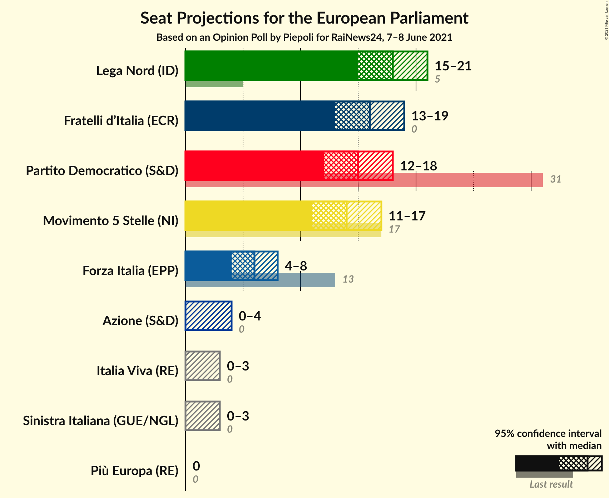

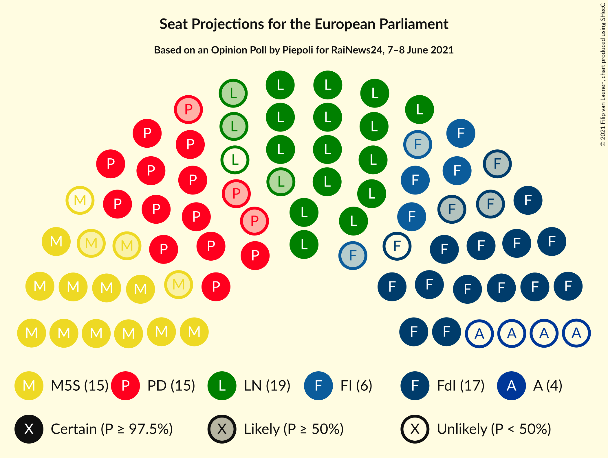

### Confidence Intervals

| Party | Last Result | Median | 80% Confidence Interval | 90% Confidence Interval | 95% Confidence Interval | 99% Confidence Interval |
|:-----:|:-----------:|:------:|:-----------------------:|:-----------------------:|:-----------------------:|:-----------------------:|
| <a href="#lega-nord-(id)">Lega Nord (ID)</a> | 5 | 18 | 15–20 |15–20 |15–21 |13–22 |
| <a href="#partito-democratico-(s&d)">Partito Democratico (S&D)</a> | 31 | 15 | 13–17 |13–17 |12–18 |11–19 |
| <a href="#fratelli-d’italia-(ecr)">Fratelli d’Italia (ECR)</a> | 0 | 15 | 14–18 |14–19 |13–20 |12–21 |
| <a href="#movimento-5-stelle-(ni)">Movimento 5 Stelle (NI)</a> | 17 | 14 | 12–15 |12–15 |11–16 |10–18 |
| <a href="#forza-italia-(epp)">Forza Italia (EPP)</a> | 13 | 6 | 5–7 |4–8 |4–8 |0–8 |
| <a href="#coraggio-italia-(ecr)">Coraggio Italia (ECR)</a> | 0 | 6 | 5–7 |4–7 |4–7 |3–8 |
| <a href="#europa-verde-(greens/efa)">Europa Verde (Greens/EFA)</a> | 0 | 0 | 0–4 |0–4 |0–4 |0–6 |
| <a href="#azione-(s&d)">Azione (S&D)</a> | 0 | 0 | 0 |0 |0 |0–4 |
| <a href="#articolo-uno-(s&d)">Articolo Uno (S&D)</a> | 0 | 0 | 0 |0 |0–4 |0–4 |
| <a href="#sinistra-italiana-(gue/ngl)">Sinistra Italiana (GUE/NGL)</a> | 0 | 0 | 0 |0 |0 |0–3 |

### Lega Nord (ID)

*For a full overview of the results for this party, see the [Lega Nord (ID)](party-leganordid.html) page.*

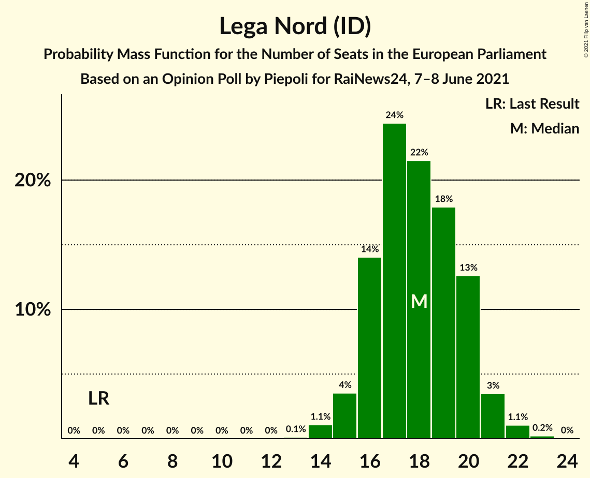

| Number of Seats | Probability | Accumulated | Special Marks |
|:---------------:|:-----------:|:-----------:|:-------------:|
| 5 | 0% | 100% | Last Result |
| 6 | 0% | 100% |  |
| 7 | 0% | 100% |  |
| 8 | 0% | 100% |  |
| 9 | 0% | 100% |  |
| 10 | 0% | 100% |  |
| 11 | 0% | 100% |  |
| 12 | 0.1% | 100% |  |
| 13 | 0.8% | 99.9% |  |
| 14 | 1.4% | 99.1% |  |
| 15 | 10% | 98% |  |
| 16 | 3% | 88% |  |
| 17 | 34% | 85% |  |
| 18 | 4% | 51% | Median |
| 19 | 7% | 47% |  |
| 20 | 37% | 40% |  |
| 21 | 1.0% | 3% |  |
| 22 | 1.5% | 2% |  |
| 23 | 0.1% | 0.2% |  |
| 24 | 0% | 0% |  |

### Partito Democratico (S&D)

*For a full overview of the results for this party, see the [Partito Democratico (S&D)](party-partitodemocraticosd.html) page.*

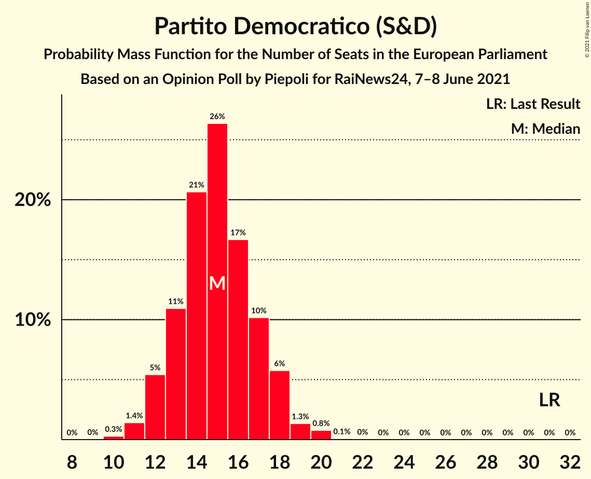

| Number of Seats | Probability | Accumulated | Special Marks |
|:---------------:|:-----------:|:-----------:|:-------------:|
| 10 | 0.3% | 100% |  |
| 11 | 1.3% | 99.7% |  |
| 12 | 3% | 98% |  |
| 13 | 9% | 95% |  |
| 14 | 16% | 87% |  |
| 15 | 39% | 71% | Median |
| 16 | 11% | 32% |  |
| 17 | 18% | 21% |  |
| 18 | 2% | 4% |  |
| 19 | 0.7% | 1.2% |  |
| 20 | 0.4% | 0.5% |  |
| 21 | 0.1% | 0.1% |  |
| 22 | 0% | 0% |  |
| 23 | 0% | 0% |  |
| 24 | 0% | 0% |  |
| 25 | 0% | 0% |  |
| 26 | 0% | 0% |  |
| 27 | 0% | 0% |  |
| 28 | 0% | 0% |  |
| 29 | 0% | 0% |  |
| 30 | 0% | 0% |  |
| 31 | 0% | 0% | Last Result |

### Fratelli d’Italia (ECR)

*For a full overview of the results for this party, see the [Fratelli d’Italia (ECR)](party-fratellid’italiaecr.html) page.*

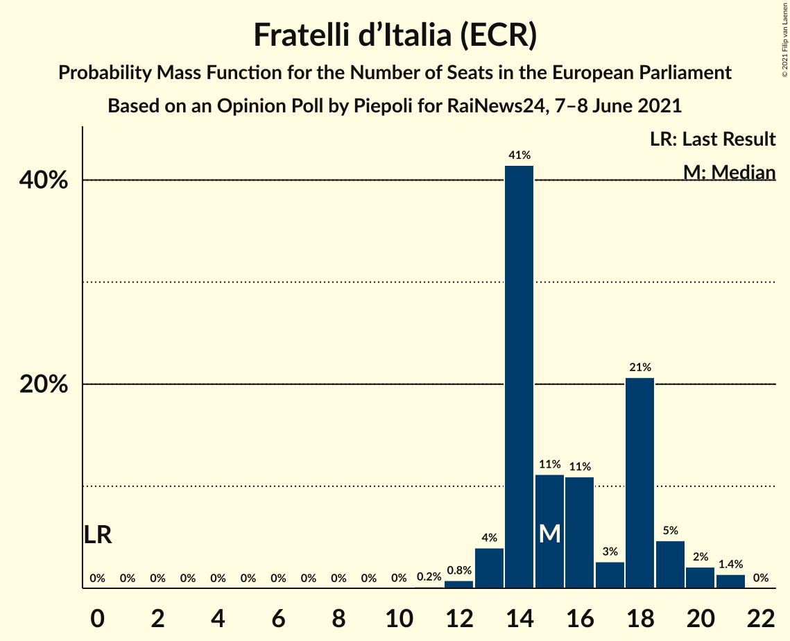

| Number of Seats | Probability | Accumulated | Special Marks |
|:---------------:|:-----------:|:-----------:|:-------------:|
| 0 | 0% | 100% | Last Result |
| 1 | 0% | 100% |  |
| 2 | 0% | 100% |  |
| 3 | 0% | 100% |  |
| 4 | 0% | 100% |  |
| 5 | 0% | 100% |  |
| 6 | 0% | 100% |  |
| 7 | 0% | 100% |  |
| 8 | 0% | 100% |  |
| 9 | 0% | 100% |  |
| 10 | 0% | 100% |  |
| 11 | 0.2% | 100% |  |
| 12 | 0.8% | 99.8% |  |
| 13 | 4% | 99.0% |  |
| 14 | 41% | 95% |  |
| 15 | 11% | 54% | Median |
| 16 | 11% | 42% |  |
| 17 | 3% | 31% |  |
| 18 | 21% | 29% |  |
| 19 | 5% | 8% |  |
| 20 | 2% | 4% |  |
| 21 | 1.4% | 1.4% |  |
| 22 | 0% | 0% |  |

### Movimento 5 Stelle (NI)

*For a full overview of the results for this party, see the [Movimento 5 Stelle (NI)](party-movimento5stelleni.html) page.*

| Number of Seats | Probability | Accumulated | Special Marks |
|:---------------:|:-----------:|:-----------:|:-------------:|
| 9 | 0.5% | 100% |  |
| 10 | 0.5% | 99.5% |  |
| 11 | 3% | 99.0% |  |
| 12 | 21% | 96% |  |
| 13 | 22% | 75% |  |
| 14 | 40% | 53% | Median |
| 15 | 8% | 13% |  |
| 16 | 3% | 5% |  |
| 17 | 0.6% | 1.5% | Last Result |
| 18 | 0.4% | 0.9% |  |
| 19 | 0.5% | 0.5% |  |
| 20 | 0% | 0% |  |

### Forza Italia (EPP)

*For a full overview of the results for this party, see the [Forza Italia (EPP)](party-forzaitaliaepp.html) page.*

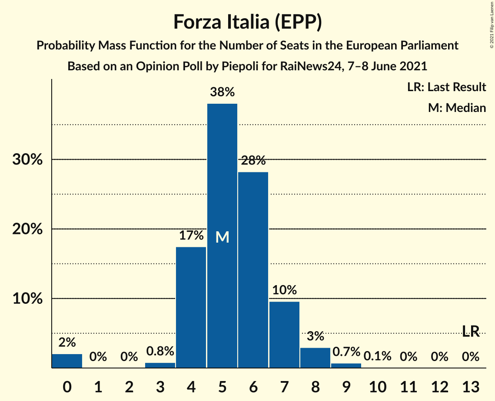

| Number of Seats | Probability | Accumulated | Special Marks |
|:---------------:|:-----------:|:-----------:|:-------------:|
| 0 | 1.3% | 100% |  |
| 1 | 0% | 98.7% |  |
| 2 | 0% | 98.7% |  |
| 3 | 0.4% | 98.7% |  |
| 4 | 7% | 98% |  |
| 5 | 36% | 91% |  |
| 6 | 42% | 55% | Median |
| 7 | 7% | 13% |  |
| 8 | 6% | 6% |  |
| 9 | 0.1% | 0.2% |  |
| 10 | 0% | 0% |  |
| 11 | 0% | 0% |  |
| 12 | 0% | 0% |  |
| 13 | 0% | 0% | Last Result |

### Coraggio Italia (ECR)

*For a full overview of the results for this party, see the [Coraggio Italia (ECR)](party-coraggioitaliaecr.html) page.*

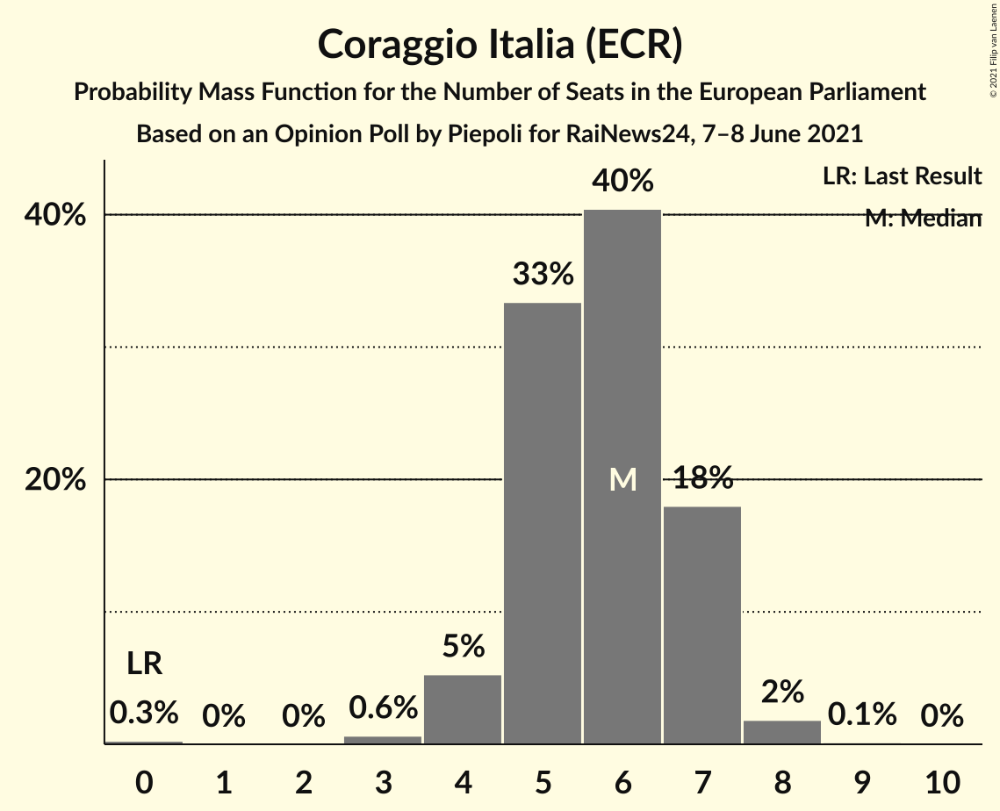

| Number of Seats | Probability | Accumulated | Special Marks |
|:---------------:|:-----------:|:-----------:|:-------------:|
| 0 | 0.3% | 100% | Last Result |
| 1 | 0% | 99.7% |  |
| 2 | 0% | 99.7% |  |
| 3 | 0.6% | 99.7% |  |
| 4 | 5% | 99.1% |  |
| 5 | 33% | 94% |  |
| 6 | 40% | 60% | Median |
| 7 | 18% | 20% |  |
| 8 | 2% | 2% |  |
| 9 | 0.1% | 0.2% |  |
| 10 | 0% | 0% |  |

### Europa Verde (Greens/EFA)

*For a full overview of the results for this party, see the [Europa Verde (Greens/EFA)](party-europaverdegreensefa.html) page.*

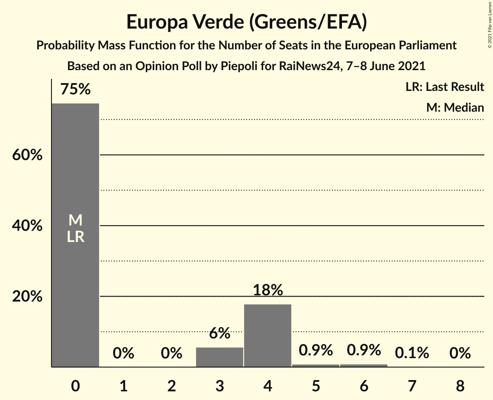

| Number of Seats | Probability | Accumulated | Special Marks |
|:---------------:|:-----------:|:-----------:|:-------------:|
| 0 | 75% | 100% | Last Result, Median |
| 1 | 0% | 25% |  |
| 2 | 0% | 25% |  |
| 3 | 6% | 25% |  |
| 4 | 18% | 20% |  |
| 5 | 0.9% | 2% |  |
| 6 | 0.9% | 1.0% |  |
| 7 | 0.1% | 0.1% |  |
| 8 | 0% | 0% |  |

### Azione (S&D)

*For a full overview of the results for this party, see the [Azione (S&D)](party-azionesd.html) page.*

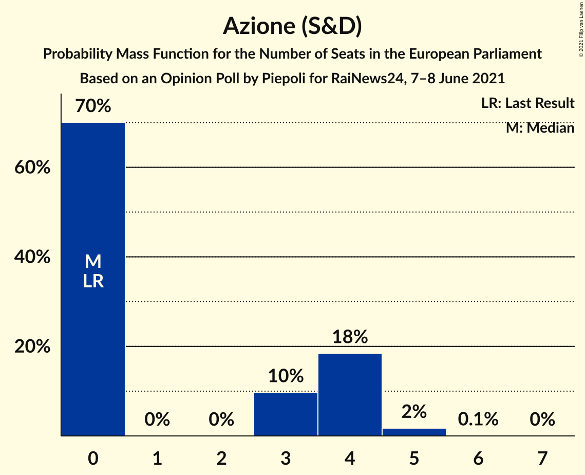

| Number of Seats | Probability | Accumulated | Special Marks |
|:---------------:|:-----------:|:-----------:|:-------------:|
| 0 | 98% | 100% | Last Result, Median |
| 1 | 0% | 2% |  |
| 2 | 0% | 2% |  |
| 3 | 0.8% | 2% |  |
| 4 | 1.0% | 1.4% |  |
| 5 | 0.3% | 0.3% |  |
| 6 | 0% | 0% |  |

### Articolo Uno (S&D)

*For a full overview of the results for this party, see the [Articolo Uno (S&D)](party-articolounosd.html) page.*

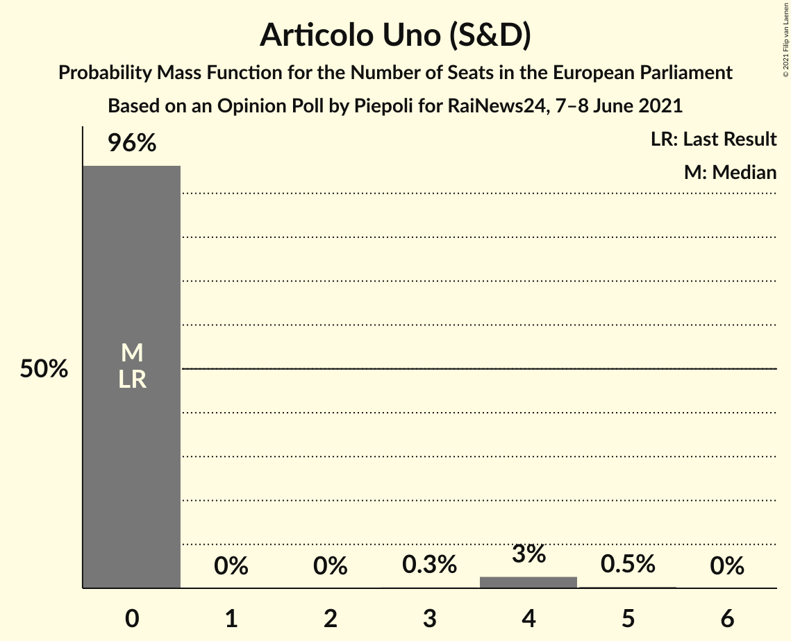

| Number of Seats | Probability | Accumulated | Special Marks |
|:---------------:|:-----------:|:-----------:|:-------------:|
| 0 | 96% | 100% | Last Result, Median |
| 1 | 0% | 4% |  |
| 2 | 0% | 4% |  |
| 3 | 0.3% | 4% |  |
| 4 | 3% | 3% |  |
| 5 | 0.5% | 0.5% |  |
| 6 | 0% | 0% |  |

### Sinistra Italiana (GUE/NGL)

*For a full overview of the results for this party, see the [Sinistra Italiana (GUE/NGL)](party-sinistraitalianaguengl.html) page.*

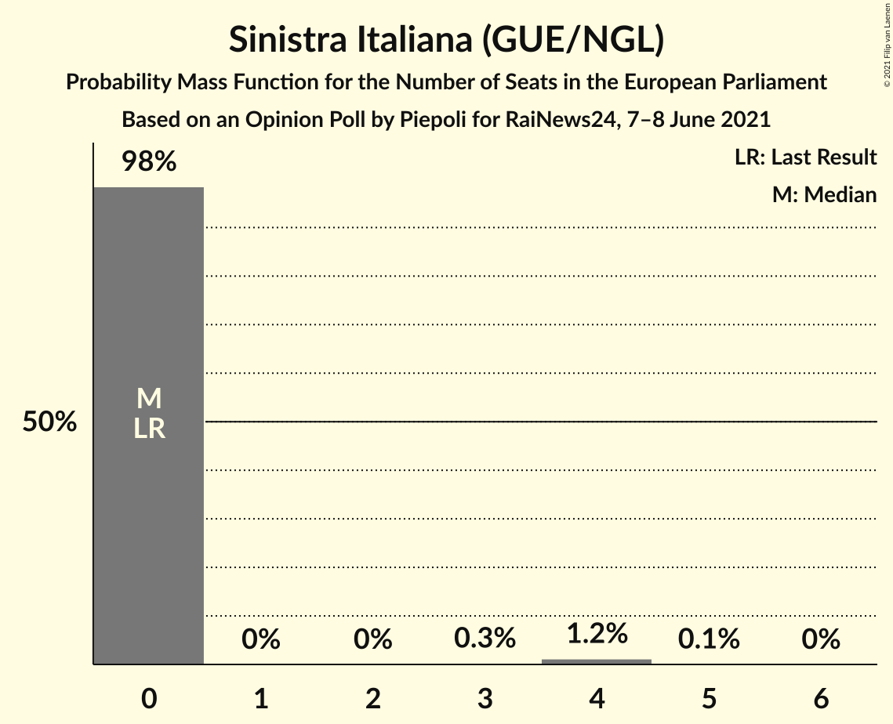

| Number of Seats | Probability | Accumulated | Special Marks |
|:---------------:|:-----------:|:-----------:|:-------------:|
| 0 | 99.5% | 100% | Last Result, Median |
| 1 | 0% | 0.5% |  |
| 2 | 0% | 0.5% |  |
| 3 | 0.1% | 0.5% |  |
| 4 | 0.4% | 0.4% |  |
| 5 | 0% | 0% |  |

## Coalitions

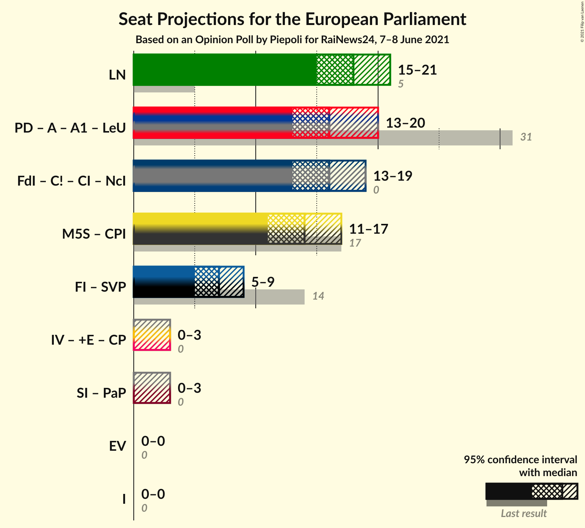

### Confidence Intervals

| Coalition | Last Result | Median | Majority? | 80% Confidence Interval | 90% Confidence Interval | 95% Confidence Interval | 99% Confidence Interval |
|:---------:|:-----------:|:------:|:---------:|:-----------------------:|:-----------------------:|:-----------------------:|:-----------------------:|
| Lega Nord (ID) | 5 | 18 | 0% | 15–20 | 15–20 | 15–21 | 13–22 |
| Europa Verde (Greens/EFA) | 0 | 0 | 0% | 0–4 | 0–4 | 0–4 | 0–6 |

### Lega Nord (ID)

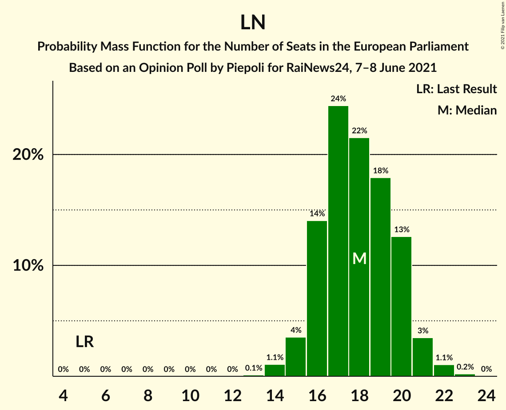

| Number of Seats | Probability | Accumulated | Special Marks |
|:---------------:|:-----------:|:-----------:|:-------------:|
| 5 | 0% | 100% | Last Result |
| 6 | 0% | 100% |  |
| 7 | 0% | 100% |  |
| 8 | 0% | 100% |  |
| 9 | 0% | 100% |  |
| 10 | 0% | 100% |  |
| 11 | 0% | 100% |  |
| 12 | 0.1% | 100% |  |
| 13 | 0.8% | 99.9% |  |
| 14 | 1.4% | 99.1% |  |
| 15 | 10% | 98% |  |
| 16 | 3% | 88% |  |
| 17 | 34% | 85% |  |
| 18 | 4% | 51% | Median |
| 19 | 7% | 47% |  |
| 20 | 37% | 40% |  |
| 21 | 1.0% | 3% |  |
| 22 | 1.5% | 2% |  |
| 23 | 0.1% | 0.2% |  |
| 24 | 0% | 0% |  |

### Europa Verde (Greens/EFA)

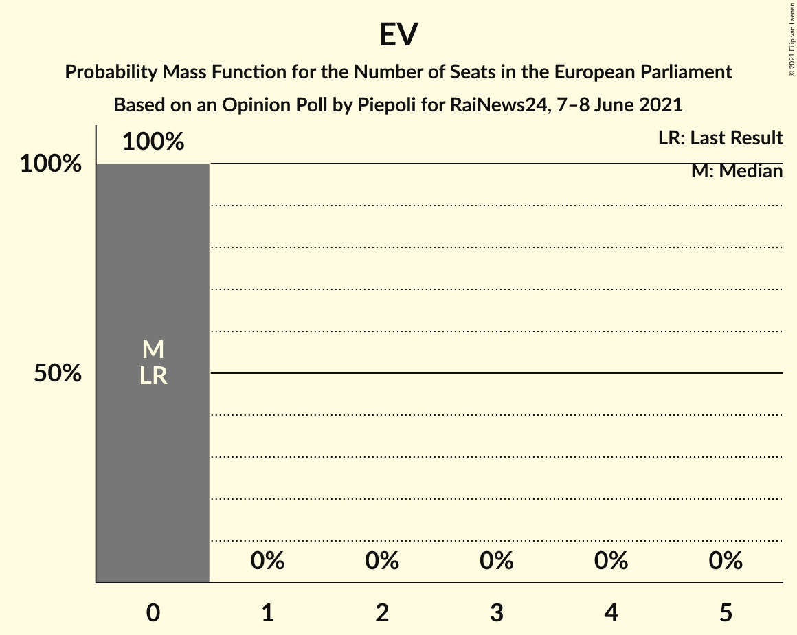

| Number of Seats | Probability | Accumulated | Special Marks |
|:---------------:|:-----------:|:-----------:|:-------------:|
| 0 | 75% | 100% | Last Result, Median |
| 1 | 0% | 25% |  |
| 2 | 0% | 25% |  |
| 3 | 6% | 25% |  |
| 4 | 18% | 20% |  |
| 5 | 0.9% | 2% |  |
| 6 | 0.9% | 1.0% |  |
| 7 | 0.1% | 0.1% |  |
| 8 | 0% | 0% |  |

## Technical Information

### Opinion Poll

+ **Polling firm:** Piepoli
+ **Commissioner(s):** RaiNews24
+ **Fieldwork period:** 7–8 June 2021

### Calculations

+ **Sample size:** 366
+ **Simulations done:** 131,072
+ **Error estimate:** 1.71%

