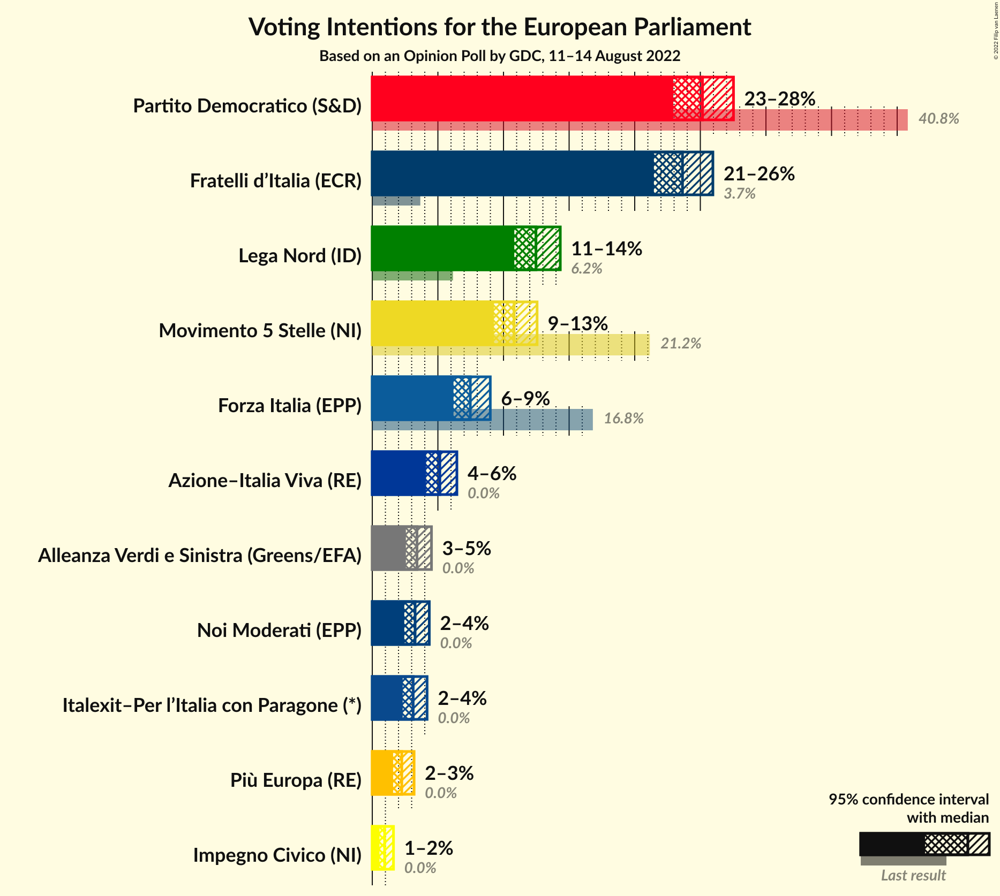
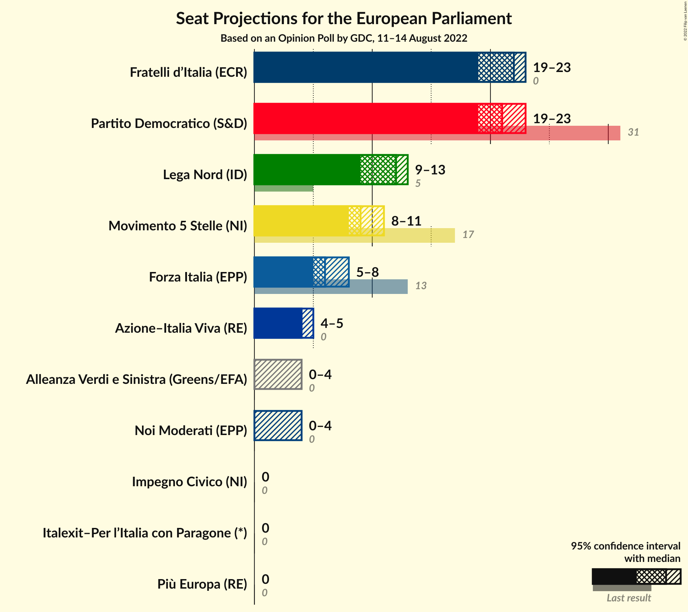
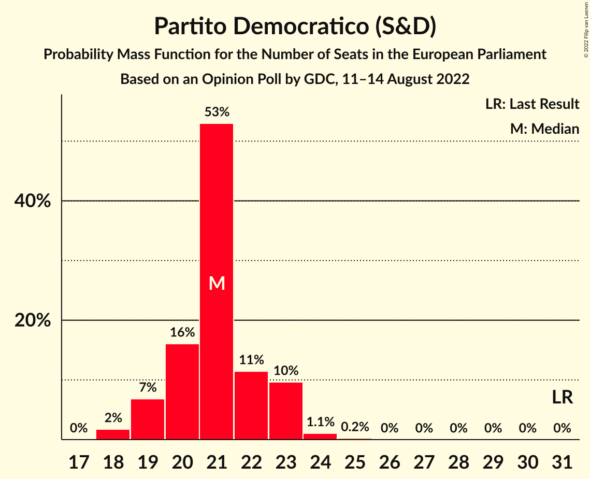
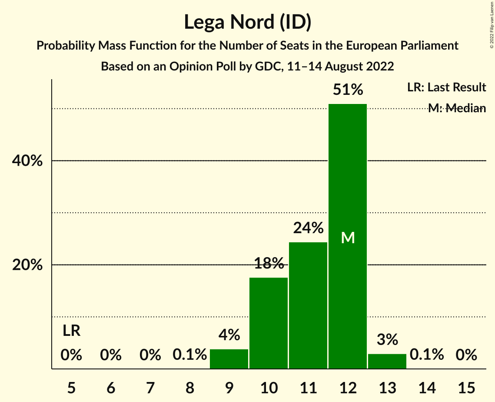
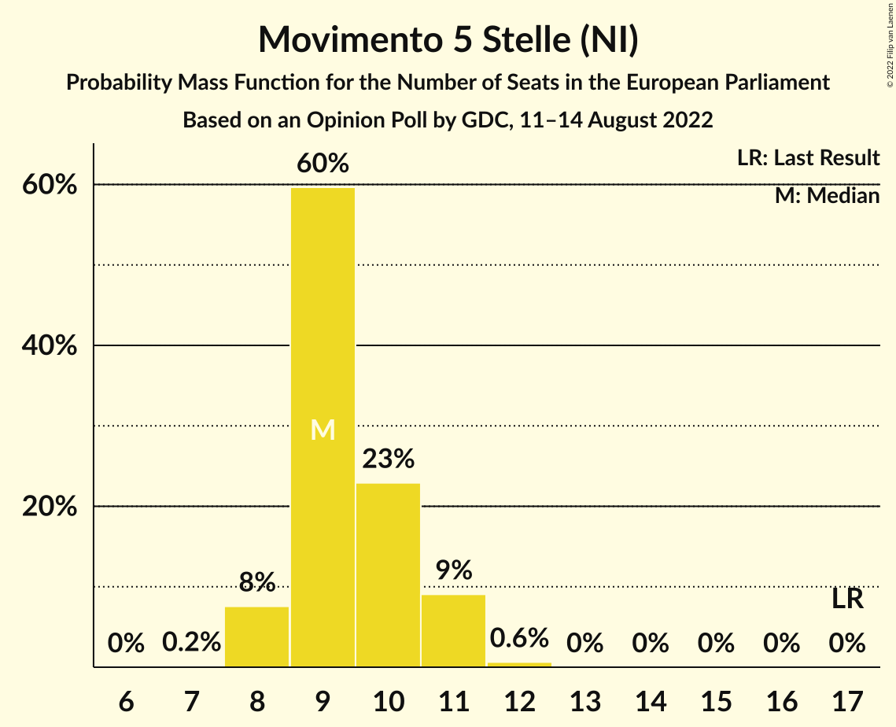
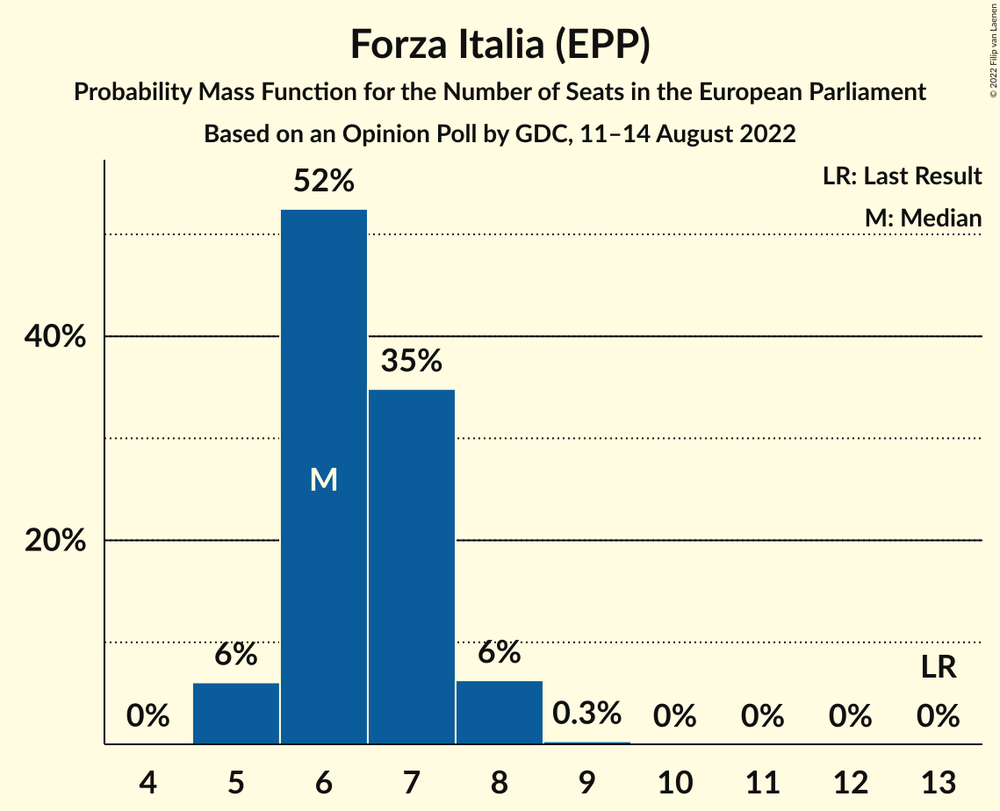
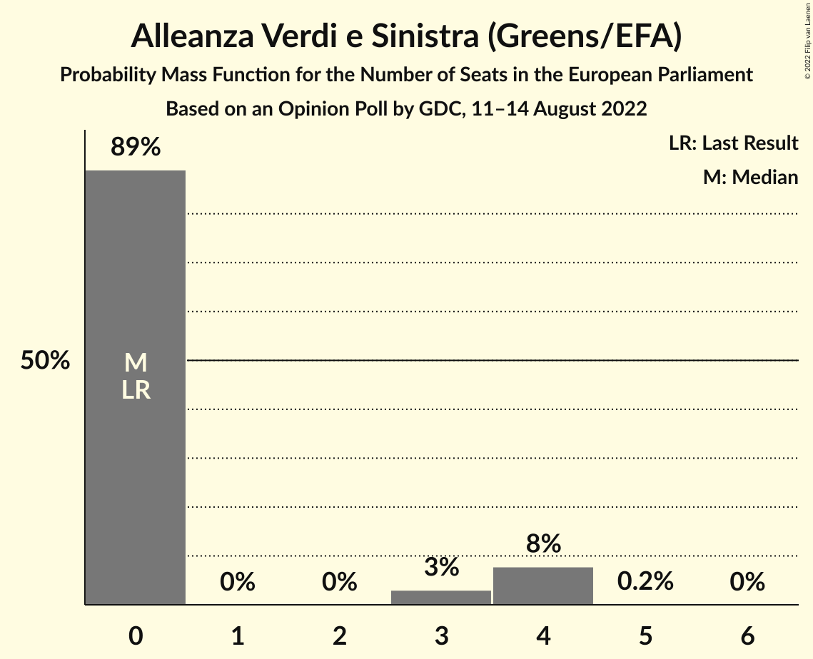
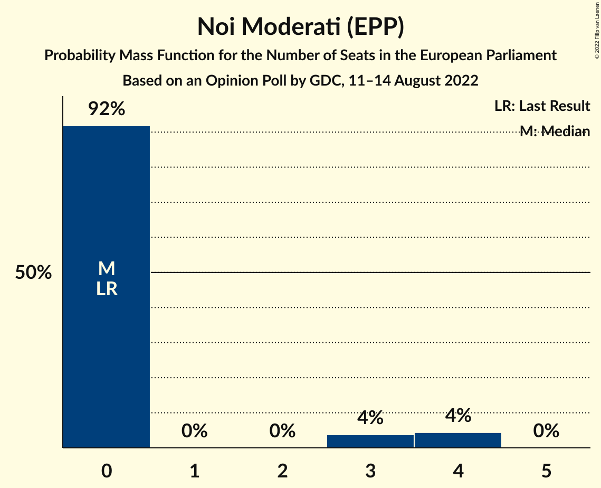
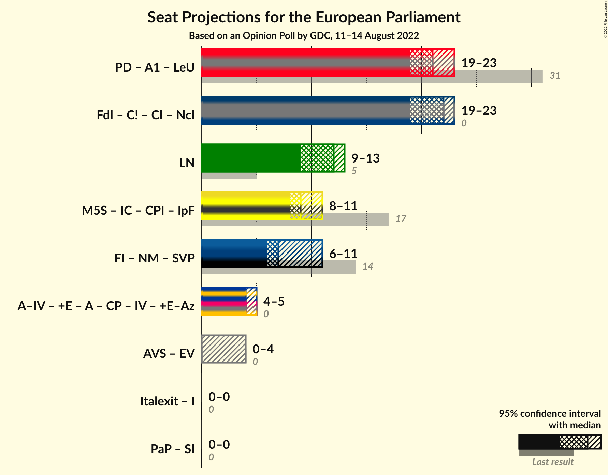

# Opinion Poll by GDC, 11–14 August 2022

<a href="#voting-intentions">Voting Intentions</a> | <a href="#seats">Seats</a> | <a href="#coalitions">Coalitions</a> | <a href="#technical-information">Technical Information</a>

## Voting Intentions

### Confidence Intervals

| Party | Last Result | Poll Result | 80% Confidence Interval | 90% Confidence Interval | 95% Confidence Interval | 99% Confidence Interval |
|:-----:|:-----------:|:-----------:|:-----------------------:|:-----------------------:|:-----------------------:|:-----------------------:|
| Partito Democratico (S&D) | 40.8% | 25.2% | 23.8–26.8% |23.4–27.2% |23.0–27.6% |22.3–28.3% |
| Fratelli d’Italia (ECR) | 3.7% | 23.7% | 22.3–25.2% |21.9–25.7% |21.5–26.0% |20.9–26.8% |
| Lega Nord (ID) | 6.2% | 12.5% | 11.4–13.7% |11.1–14.0% |10.8–14.3% |10.3–14.9% |
| Movimento 5 Stelle (NI) | 21.2% | 10.8% | 9.8–11.9% |9.5–12.3% |9.3–12.6% |8.8–13.1% |
| Forza Italia (EPP) | 16.8% | 7.5% | 6.6–8.5% |6.4–8.7% |6.2–9.0% |5.8–9.5% |
| Azione–Italia Viva (RE) | 0.0% | 5.1% | 4.5–6.0% |4.3–6.2% |4.1–6.4% |3.8–6.9% |
| Alleanza Verdi e Sinistra (Greens/EFA) | 0.0% | 3.5% | 2.9–4.2% |2.8–4.4% |2.6–4.6% |2.4–5.0% |
| Italexit–Per l’Italia con Paragone (*) | 0.0% | 3.1% | 2.6–3.8% |2.4–4.0% |2.3–4.2% |2.1–4.5% |
| Noi Moderati (EPP) | 0.0% | 3.0% | 2.5–3.7% |2.4–3.9% |2.3–4.1% |2.0–4.5% |
| Più Europa (RE) | 0.0% | 2.2% | 1.8–2.9% |1.7–3.0% |1.6–3.2% |1.4–3.5% |
| Impegno Civico (NI) | 0.0% | 0.9% | 0.7–1.4% |0.6–1.5% |0.5–1.6% |0.4–1.8% |

*Note:* The poll result column reflects the actual value used in the calculations. Published results may vary slightly, and in addition be rounded to fewer digits.

## Seats

### Confidence Intervals

| Party | Last Result | Median | 80% Confidence Interval | 90% Confidence Interval | 95% Confidence Interval | 99% Confidence Interval |
|:-----:|:-----------:|:------:|:-----------------------:|:-----------------------:|:-----------------------:|:-----------------------:|
| <a href="#partito-democratico-(s&d)">Partito Democratico (S&D)</a> | 31 | 22 | 20–23 |19–23 |19–23 |19–24 |
| <a href="#fratelli-d’italia-(ecr)">Fratelli d’Italia (ECR)</a> | 0 | 21 | 20–23 |20–23 |19–23 |18–24 |
| <a href="#lega-nord-(id)">Lega Nord (ID)</a> | 5 | 11 | 10–12 |10–12 |9–12 |9–13 |
| <a href="#movimento-5-stelle-(ni)">Movimento 5 Stelle (NI)</a> | 17 | 10 | 9–10 |8–11 |8–11 |8–11 |
| <a href="#forza-italia-(epp)">Forza Italia (EPP)</a> | 13 | 7 | 6–8 |6–8 |6–8 |5–9 |
| <a href="#azione–italia-viva-(re)">Azione–Italia Viva (RE)</a> | 0 | 4 | 4–5 |4–6 |4–6 |0–6 |
| <a href="#alleanza-verdi-e-sinistra-(greens/efa)">Alleanza Verdi e Sinistra (Greens/EFA)</a> | 0 | 0 | 0 |0 |0–4 |0–4 |
| <a href="#italexit–per-l’italia-con-paragone-(*)">Italexit–Per l’Italia con Paragone (*)</a> | 0 | 0 | 0 |0 |0–3 |0–4 |
| <a href="#noi-moderati-(epp)">Noi Moderati (EPP)</a> | 0 | 0 | 0 |0 |0 |0–4 |
| <a href="#più-europa-(re)">Più Europa (RE)</a> | 0 | 0 | 0 |0 |0 |0 |
| <a href="#impegno-civico-(ni)">Impegno Civico (NI)</a> | 0 | 0 | 0 |0 |0 |0 |

### Partito Democratico (S&D)

*For a full overview of the results for this party, see the [Partito Democratico (S&D)](party-partitodemocraticosd.html) page.*

| Number of Seats | Probability | Accumulated | Special Marks |
|:---------------:|:-----------:|:-----------:|:-------------:|
| 18 | 0.5% | 100% |  |
| 19 | 5% | 99.5% |  |
| 20 | 14% | 95% |  |
| 21 | 27% | 81% |  |
| 22 | 40% | 54% | Median |
| 23 | 13% | 14% |  |
| 24 | 0.6% | 0.7% |  |
| 25 | 0.2% | 0.2% |  |
| 26 | 0% | 0% |  |
| 27 | 0% | 0% |  |
| 28 | 0% | 0% |  |
| 29 | 0% | 0% |  |
| 30 | 0% | 0% |  |
| 31 | 0% | 0% | Last Result |

### Fratelli d’Italia (ECR)

*For a full overview of the results for this party, see the [Fratelli d’Italia (ECR)](party-fratellid’italiaecr.html) page.*

| Number of Seats | Probability | Accumulated | Special Marks |
|:---------------:|:-----------:|:-----------:|:-------------:|
| 0 | 0% | 100% | Last Result |
| 1 | 0% | 100% |  |
| 2 | 0% | 100% |  |
| 3 | 0% | 100% |  |
| 4 | 0% | 100% |  |
| 5 | 0% | 100% |  |
| 6 | 0% | 100% |  |
| 7 | 0% | 100% |  |
| 8 | 0% | 100% |  |
| 9 | 0% | 100% |  |
| 10 | 0% | 100% |  |
| 11 | 0% | 100% |  |
| 12 | 0% | 100% |  |
| 13 | 0% | 100% |  |
| 14 | 0% | 100% |  |
| 15 | 0% | 100% |  |
| 16 | 0% | 100% |  |
| 17 | 0.1% | 100% |  |
| 18 | 0.9% | 99.9% |  |
| 19 | 2% | 99.1% |  |
| 20 | 11% | 97% |  |
| 21 | 46% | 86% | Median |
| 22 | 28% | 40% |  |
| 23 | 11% | 12% |  |
| 24 | 1.5% | 2% |  |
| 25 | 0.1% | 0.1% |  |
| 26 | 0% | 0% |  |

### Lega Nord (ID)

*For a full overview of the results for this party, see the [Lega Nord (ID)](party-leganordid.html) page.*

| Number of Seats | Probability | Accumulated | Special Marks |
|:---------------:|:-----------:|:-----------:|:-------------:|
| 5 | 0% | 100% | Last Result |
| 6 | 0% | 100% |  |
| 7 | 0% | 100% |  |
| 8 | 0% | 100% |  |
| 9 | 4% | 100% |  |
| 10 | 15% | 96% |  |
| 11 | 64% | 81% | Median |
| 12 | 16% | 17% |  |
| 13 | 2% | 2% |  |
| 14 | 0.2% | 0.2% |  |
| 15 | 0% | 0% |  |

### Movimento 5 Stelle (NI)

*For a full overview of the results for this party, see the [Movimento 5 Stelle (NI)](party-movimento5stelleni.html) page.*

| Number of Seats | Probability | Accumulated | Special Marks |
|:---------------:|:-----------:|:-----------:|:-------------:|
| 7 | 0.1% | 100% |  |
| 8 | 8% | 99.9% |  |
| 9 | 35% | 92% |  |
| 10 | 50% | 57% | Median |
| 11 | 7% | 7% |  |
| 12 | 0.2% | 0.2% |  |
| 13 | 0% | 0% |  |
| 14 | 0% | 0% |  |
| 15 | 0% | 0% |  |
| 16 | 0% | 0% |  |
| 17 | 0% | 0% | Last Result |

### Forza Italia (EPP)

*For a full overview of the results for this party, see the [Forza Italia (EPP)](party-forzaitaliaepp.html) page.*

| Number of Seats | Probability | Accumulated | Special Marks |
|:---------------:|:-----------:|:-----------:|:-------------:|
| 5 | 2% | 100% |  |
| 6 | 21% | 98% |  |
| 7 | 67% | 77% | Median |
| 8 | 10% | 10% |  |
| 9 | 0.6% | 0.6% |  |
| 10 | 0% | 0% |  |
| 11 | 0% | 0% |  |
| 12 | 0% | 0% |  |
| 13 | 0% | 0% | Last Result |

### Azione–Italia Viva (RE)

*For a full overview of the results for this party, see the [Azione–Italia Viva (RE)](party-azione–italiavivare.html) page.*

| Number of Seats | Probability | Accumulated | Special Marks |
|:---------------:|:-----------:|:-----------:|:-------------:|
| 0 | 1.1% | 100% | Last Result |
| 1 | 0% | 98.9% |  |
| 2 | 0% | 98.9% |  |
| 3 | 0.1% | 98.9% |  |
| 4 | 53% | 98.8% | Median |
| 5 | 39% | 46% |  |
| 6 | 7% | 7% |  |
| 7 | 0.2% | 0.2% |  |
| 8 | 0% | 0% |  |

### Alleanza Verdi e Sinistra (Greens/EFA)

*For a full overview of the results for this party, see the [Alleanza Verdi e Sinistra (Greens/EFA)](party-alleanzaverdiesinistragreensefa.html) page.*

| Number of Seats | Probability | Accumulated | Special Marks |
|:---------------:|:-----------:|:-----------:|:-------------:|
| 0 | 95% | 100% | Last Result, Median |
| 1 | 0% | 5% |  |
| 2 | 0% | 5% |  |
| 3 | 0.6% | 5% |  |
| 4 | 4% | 4% |  |
| 5 | 0.1% | 0.1% |  |
| 6 | 0% | 0% |  |

### Italexit–Per l’Italia con Paragone (*)

*For a full overview of the results for this party, see the [Italexit–Per l’Italia con Paragone (*)](party-italexit–perl’italiaconparagone.html) page.*

| Number of Seats | Probability | Accumulated | Special Marks |
|:---------------:|:-----------:|:-----------:|:-------------:|
| 0 | 97% | 100% | Last Result, Median |
| 1 | 0% | 3% |  |
| 2 | 0% | 3% |  |
| 3 | 0.8% | 3% |  |
| 4 | 2% | 2% |  |
| 5 | 0% | 0% |  |

### Noi Moderati (EPP)

*For a full overview of the results for this party, see the [Noi Moderati (EPP)](party-noimoderatiepp.html) page.*

| Number of Seats | Probability | Accumulated | Special Marks |
|:---------------:|:-----------:|:-----------:|:-------------:|
| 0 | 98% | 100% | Last Result, Median |
| 1 | 0% | 2% |  |
| 2 | 0% | 2% |  |
| 3 | 0.3% | 2% |  |
| 4 | 1.2% | 1.3% |  |
| 5 | 0% | 0% |  |

### Più Europa (RE)

*For a full overview of the results for this party, see the [Più Europa (RE)](party-piùeuropare.html) page.*

| Number of Seats | Probability | Accumulated | Special Marks |
|:---------------:|:-----------:|:-----------:|:-------------:|
| 0 | 100% | 100% | Last Result, Median |

### Impegno Civico (NI)

*For a full overview of the results for this party, see the [Impegno Civico (NI)](party-impegnociviconi.html) page.*

| Number of Seats | Probability | Accumulated | Special Marks |
|:---------------:|:-----------:|:-----------:|:-------------:|
| 0 | 100% | 100% | Last Result, Median |

## Coalitions

### Confidence Intervals

| Coalition | Last Result | Median | Majority? | 80% Confidence Interval | 90% Confidence Interval | 95% Confidence Interval | 99% Confidence Interval |
|:---------:|:-----------:|:------:|:---------:|:-----------------------:|:-----------------------:|:-----------------------:|:-----------------------:|
| Lega Nord (ID) | 5 | 11 | 0% | 10–12 | 10–12 | 9–12 | 9–13 |

### Lega Nord (ID)

| Number of Seats | Probability | Accumulated | Special Marks |
|:---------------:|:-----------:|:-----------:|:-------------:|
| 5 | 0% | 100% | Last Result |
| 6 | 0% | 100% |  |
| 7 | 0% | 100% |  |
| 8 | 0% | 100% |  |
| 9 | 4% | 100% |  |
| 10 | 15% | 96% |  |
| 11 | 64% | 81% | Median |
| 12 | 16% | 17% |  |
| 13 | 2% | 2% |  |
| 14 | 0.2% | 0.2% |  |
| 15 | 0% | 0% |  |

## Technical Information

### Opinion Poll

+ **Polling firm:** GDC
+ **Commissioner(s):** —
+ **Fieldwork period:** 11–14 August 2022

### Calculations

+ **Sample size:** 1379
+ **Simulations done:** 1,048,576
+ **Error estimate:** 1.34%

