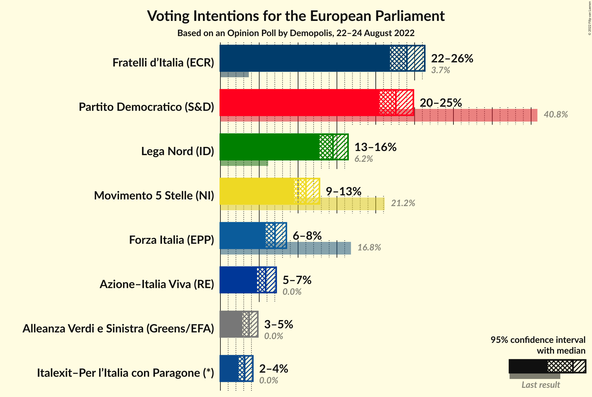
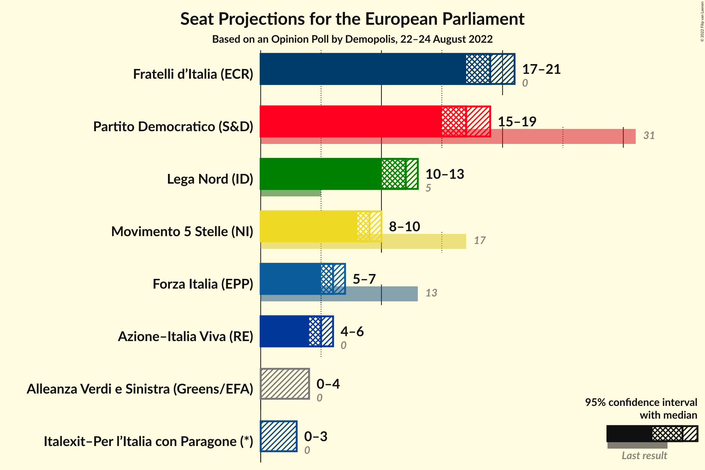
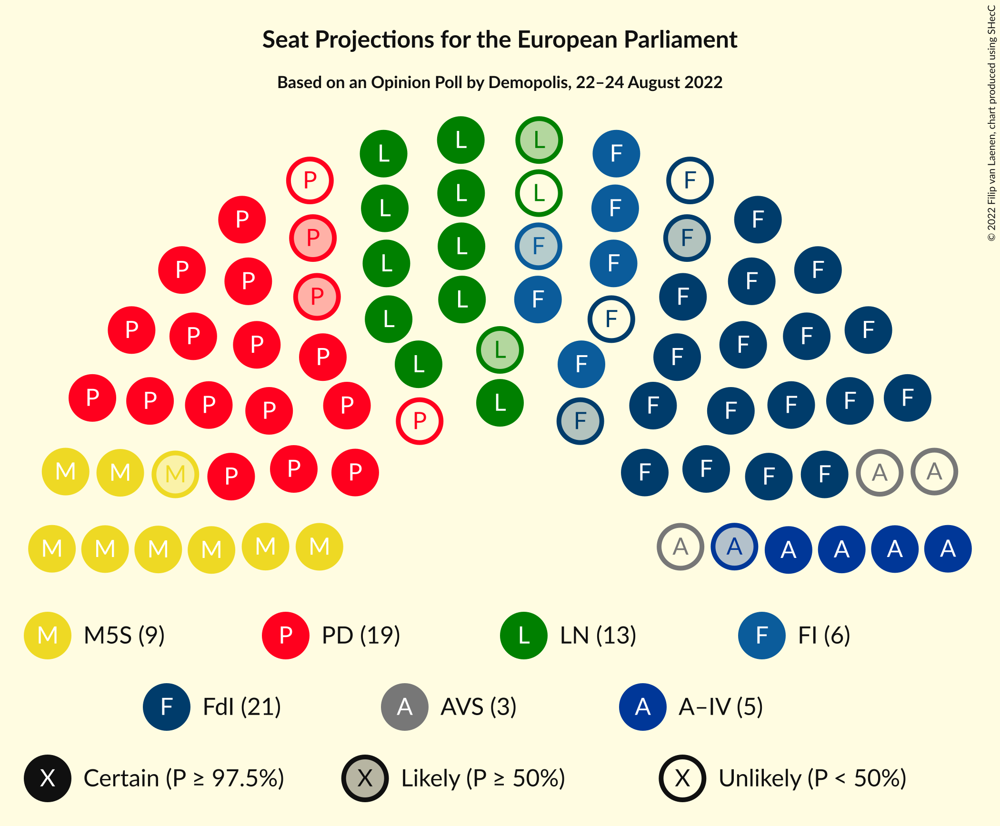
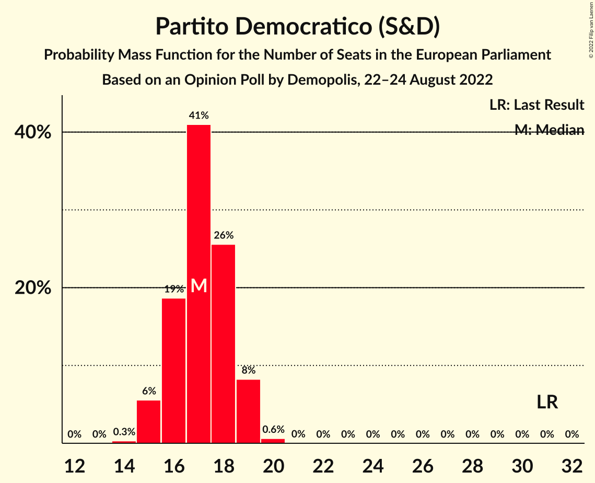
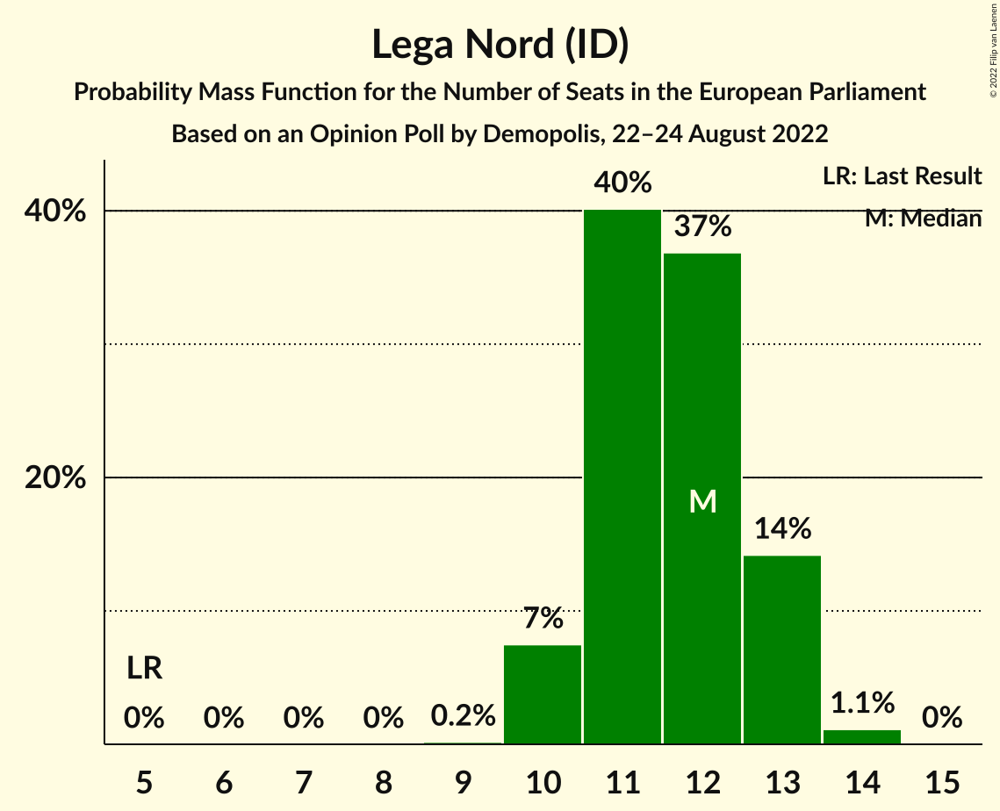
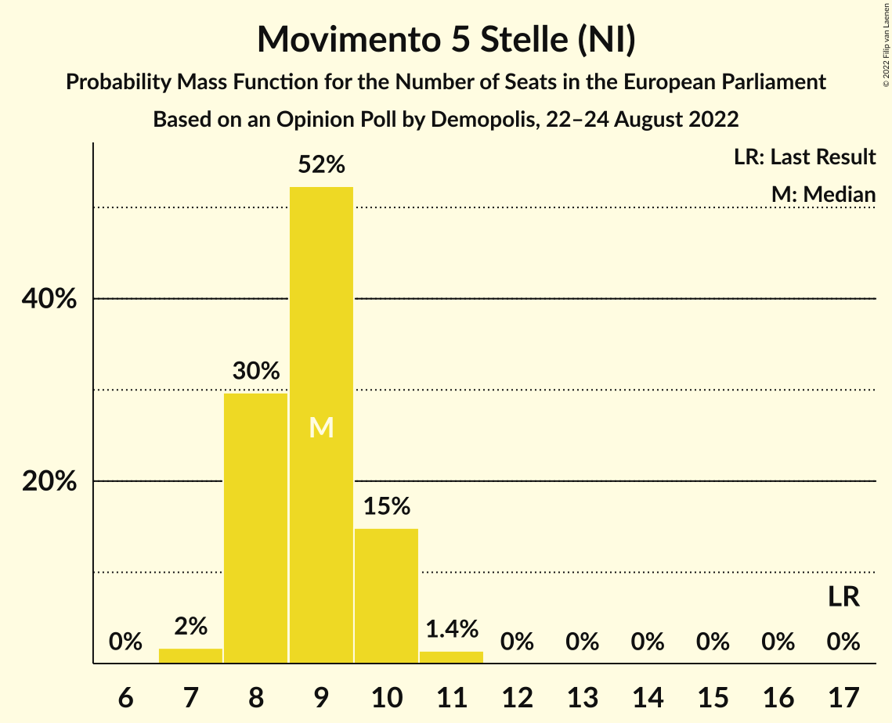
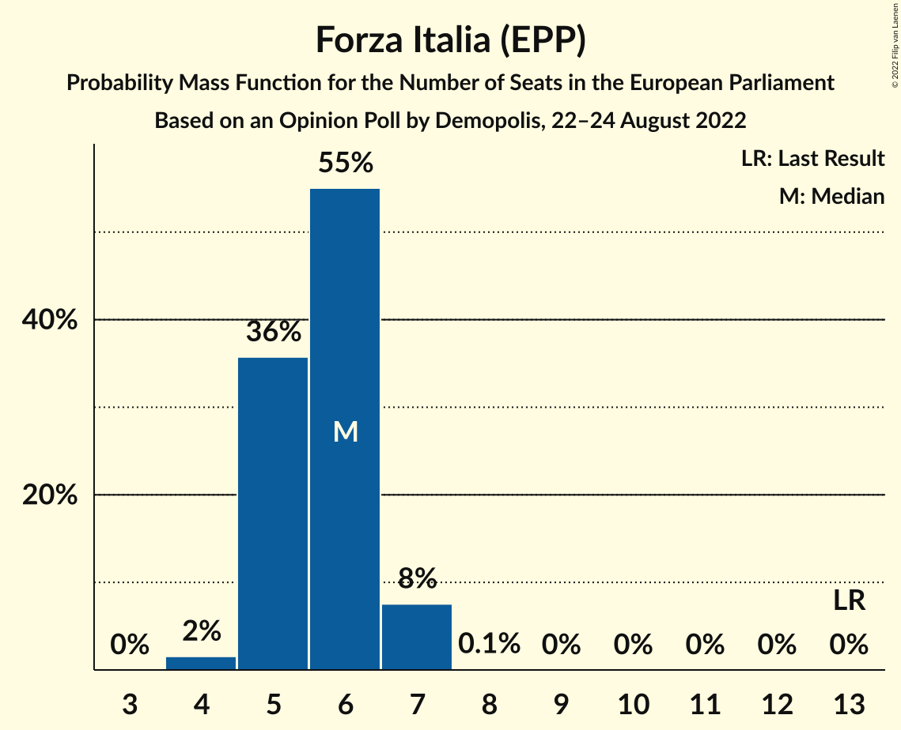
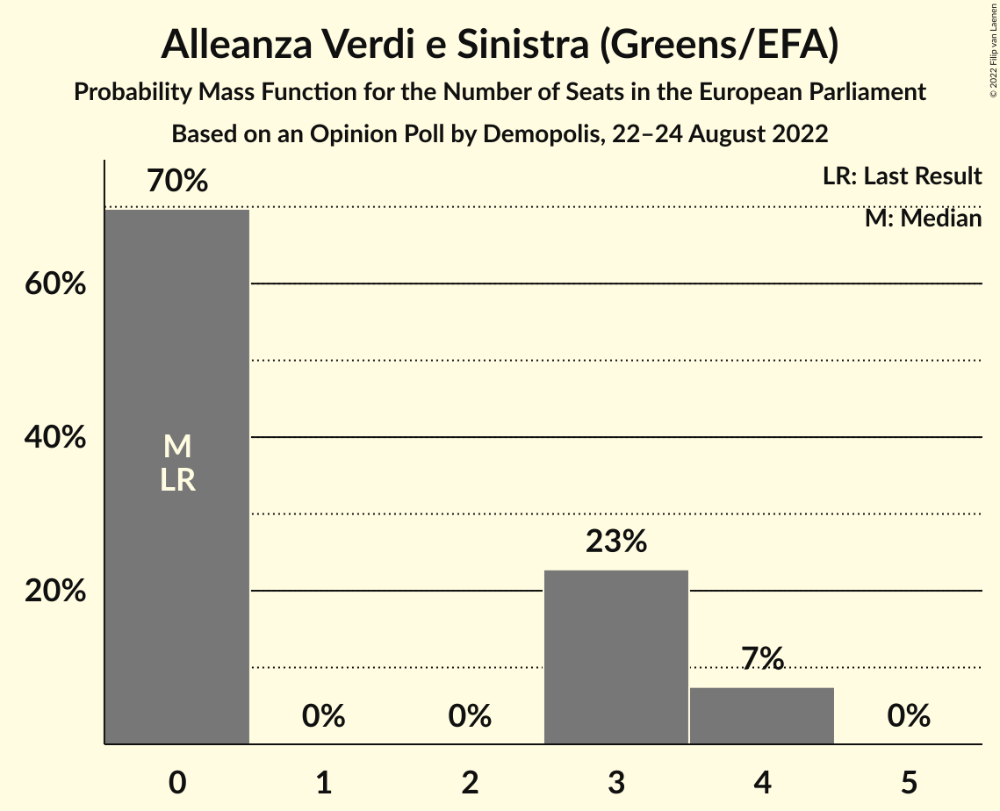
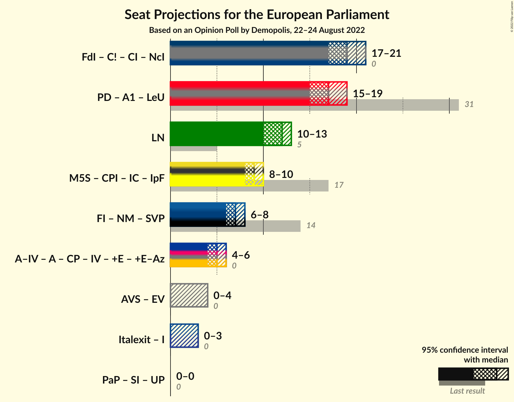
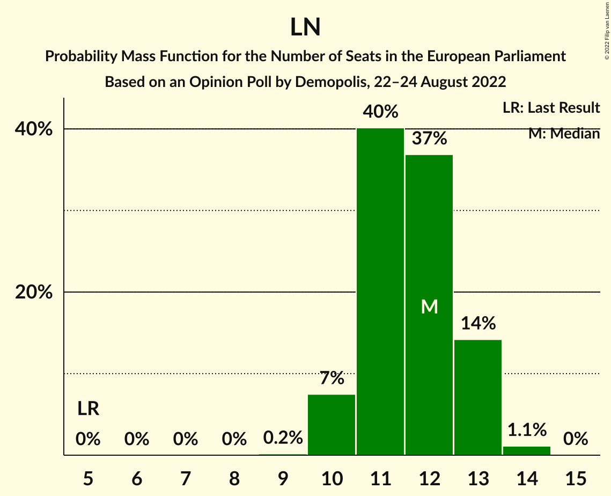

# Opinion Poll by Demopolis, 22–24 August 2022

<a href="#voting-intentions">Voting Intentions</a> | <a href="#seats">Seats</a> | <a href="#coalitions">Coalitions</a> | <a href="#technical-information">Technical Information</a>

## Voting Intentions

### Confidence Intervals

| Party | Last Result | Poll Result | 80% Confidence Interval | 90% Confidence Interval | 95% Confidence Interval | 99% Confidence Interval |
|:-----:|:-----------:|:-----------:|:-----------------------:|:-----------------------:|:-----------------------:|:-----------------------:|
| Fratelli d’Italia (ECR) | 3.7% | 24.0% | 22.6–25.5% |22.2–25.9% |21.8–26.3% |21.2–27.1% |
| Partito Democratico (S&D) | 40.8% | 22.6% | 21.2–24.1% |20.8–24.5% |20.5–24.8% |19.8–25.6% |
| Lega Nord (ID) | 6.2% | 14.5% | 13.3–15.8% |13.0–16.1% |12.7–16.4% |12.2–17.1% |
| Movimento 5 Stelle (NI) | 21.2% | 11.0% | 10.0–12.1% |9.7–12.5% |9.5–12.8% |9.0–13.3% |
| Forza Italia (EPP) | 16.8% | 7.0% | 6.2–8.0% |6.0–8.3% |5.8–8.5% |5.4–9.0% |
| Azione–Italia Viva (RE) | 0.0% | 5.8% | 5.1–6.7% |4.9–7.0% |4.7–7.2% |4.4–7.6% |
| Alleanza Verdi e Sinistra (Greens/EFA) | 0.0% | 3.7% | 3.1–4.4% |3.0–4.6% |2.8–4.8% |2.6–5.2% |
| Italexit–Per l’Italia con Paragone (*) | 0.0% | 3.1% | 2.6–3.8% |2.5–4.0% |2.3–4.2% |2.1–4.5% |

*Note:* The poll result column reflects the actual value used in the calculations. Published results may vary slightly, and in addition be rounded to fewer digits.

## Seats

### Confidence Intervals

| Party | Last Result | Median | 80% Confidence Interval | 90% Confidence Interval | 95% Confidence Interval | 99% Confidence Interval |
|:-----:|:-----------:|:------:|:-----------------------:|:-----------------------:|:-----------------------:|:-----------------------:|
| <a href="#fratelli-d’italia-(ecr)">Fratelli d’Italia (ECR)</a> | 0 | 19 | 18–20 |18–21 |17–21 |17–22 |
| <a href="#partito-democratico-(s&d)">Partito Democratico (S&D)</a> | 31 | 17 | 16–18 |15–19 |15–19 |15–20 |
| <a href="#lega-nord-(id)">Lega Nord (ID)</a> | 5 | 12 | 11–13 |10–13 |10–13 |10–14 |
| <a href="#movimento-5-stelle-(ni)">Movimento 5 Stelle (NI)</a> | 17 | 9 | 8–10 |8–10 |8–10 |7–11 |
| <a href="#forza-italia-(epp)">Forza Italia (EPP)</a> | 13 | 6 | 5–6 |5–7 |5–7 |4–7 |
| <a href="#azione–italia-viva-(re)">Azione–Italia Viva (RE)</a> | 0 | 5 | 4–5 |4–6 |4–6 |4–6 |
| <a href="#alleanza-verdi-e-sinistra-(greens/efa)">Alleanza Verdi e Sinistra (Greens/EFA)</a> | 0 | 0 | 0–3 |0–4 |0–4 |0–4 |
| <a href="#italexit–per-l’italia-con-paragone-(*)">Italexit–Per l’Italia con Paragone (*)</a> | 0 | 0 | 0 |0 |0–3 |0–4 |

### Fratelli d’Italia (ECR)

*For a full overview of the results for this party, see the [Fratelli d’Italia (ECR)](party-fratellid’italiaecr.html) page.*

| Number of Seats | Probability | Accumulated | Special Marks |
|:---------------:|:-----------:|:-----------:|:-------------:|
| 0 | 0% | 100% | Last Result |
| 1 | 0% | 100% |  |
| 2 | 0% | 100% |  |
| 3 | 0% | 100% |  |
| 4 | 0% | 100% |  |
| 5 | 0% | 100% |  |
| 6 | 0% | 100% |  |
| 7 | 0% | 100% |  |
| 8 | 0% | 100% |  |
| 9 | 0% | 100% |  |
| 10 | 0% | 100% |  |
| 11 | 0% | 100% |  |
| 12 | 0% | 100% |  |
| 13 | 0% | 100% |  |
| 14 | 0% | 100% |  |
| 15 | 0% | 100% |  |
| 16 | 0.2% | 100% |  |
| 17 | 4% | 99.8% |  |
| 18 | 19% | 96% |  |
| 19 | 39% | 77% | Median |
| 20 | 28% | 37% |  |
| 21 | 9% | 10% |  |
| 22 | 0.9% | 0.9% |  |
| 23 | 0.1% | 0.1% |  |
| 24 | 0% | 0% |  |

### Partito Democratico (S&D)

*For a full overview of the results for this party, see the [Partito Democratico (S&D)](party-partitodemocraticosd.html) page.*

| Number of Seats | Probability | Accumulated | Special Marks |
|:---------------:|:-----------:|:-----------:|:-------------:|
| 14 | 0.3% | 100% |  |
| 15 | 6% | 99.7% |  |
| 16 | 19% | 94% |  |
| 17 | 41% | 75% | Median |
| 18 | 26% | 34% |  |
| 19 | 8% | 9% |  |
| 20 | 0.6% | 0.7% |  |
| 21 | 0% | 0% |  |
| 22 | 0% | 0% |  |
| 23 | 0% | 0% |  |
| 24 | 0% | 0% |  |
| 25 | 0% | 0% |  |
| 26 | 0% | 0% |  |
| 27 | 0% | 0% |  |
| 28 | 0% | 0% |  |
| 29 | 0% | 0% |  |
| 30 | 0% | 0% |  |
| 31 | 0% | 0% | Last Result |

### Lega Nord (ID)

*For a full overview of the results for this party, see the [Lega Nord (ID)](party-leganordid.html) page.*

| Number of Seats | Probability | Accumulated | Special Marks |
|:---------------:|:-----------:|:-----------:|:-------------:|
| 5 | 0% | 100% | Last Result |
| 6 | 0% | 100% |  |
| 7 | 0% | 100% |  |
| 8 | 0% | 100% |  |
| 9 | 0.2% | 100% |  |
| 10 | 7% | 99.8% |  |
| 11 | 40% | 92% |  |
| 12 | 37% | 52% | Median |
| 13 | 14% | 15% |  |
| 14 | 1.1% | 1.1% |  |
| 15 | 0% | 0% |  |

### Movimento 5 Stelle (NI)

*For a full overview of the results for this party, see the [Movimento 5 Stelle (NI)](party-movimento5stelleni.html) page.*

| Number of Seats | Probability | Accumulated | Special Marks |
|:---------------:|:-----------:|:-----------:|:-------------:|
| 7 | 2% | 100% |  |
| 8 | 30% | 98% |  |
| 9 | 52% | 69% | Median |
| 10 | 15% | 16% |  |
| 11 | 1.4% | 1.4% |  |
| 12 | 0% | 0% |  |
| 13 | 0% | 0% |  |
| 14 | 0% | 0% |  |
| 15 | 0% | 0% |  |
| 16 | 0% | 0% |  |
| 17 | 0% | 0% | Last Result |

### Forza Italia (EPP)

*For a full overview of the results for this party, see the [Forza Italia (EPP)](party-forzaitaliaepp.html) page.*

| Number of Seats | Probability | Accumulated | Special Marks |
|:---------------:|:-----------:|:-----------:|:-------------:|
| 4 | 2% | 100% |  |
| 5 | 36% | 98% |  |
| 6 | 55% | 63% | Median |
| 7 | 8% | 8% |  |
| 8 | 0.1% | 0.1% |  |
| 9 | 0% | 0% |  |
| 10 | 0% | 0% |  |
| 11 | 0% | 0% |  |
| 12 | 0% | 0% |  |
| 13 | 0% | 0% | Last Result |

### Azione–Italia Viva (RE)

*For a full overview of the results for this party, see the [Azione–Italia Viva (RE)](party-azione–italiavivare.html) page.*

| Number of Seats | Probability | Accumulated | Special Marks |
|:---------------:|:-----------:|:-----------:|:-------------:|
| 0 | 0% | 100% | Last Result |
| 1 | 0% | 100% |  |
| 2 | 0% | 100% |  |
| 3 | 0.4% | 100% |  |
| 4 | 33% | 99.5% |  |
| 5 | 59% | 66% | Median |
| 6 | 7% | 7% |  |
| 7 | 0.1% | 0.1% |  |
| 8 | 0% | 0% |  |

### Alleanza Verdi e Sinistra (Greens/EFA)

*For a full overview of the results for this party, see the [Alleanza Verdi e Sinistra (Greens/EFA)](party-alleanzaverdiesinistragreensefa.html) page.*

| Number of Seats | Probability | Accumulated | Special Marks |
|:---------------:|:-----------:|:-----------:|:-------------:|
| 0 | 70% | 100% | Last Result, Median |
| 1 | 0% | 30% |  |
| 2 | 0% | 30% |  |
| 3 | 23% | 30% |  |
| 4 | 7% | 7% |  |
| 5 | 0% | 0% |  |

### Italexit–Per l’Italia con Paragone (*)

*For a full overview of the results for this party, see the [Italexit–Per l’Italia con Paragone (*)](party-italexit–perl’italiaconparagone.html) page.*

| Number of Seats | Probability | Accumulated | Special Marks |
|:---------------:|:-----------:|:-----------:|:-------------:|
| 0 | 96% | 100% | Last Result, Median |
| 1 | 0% | 4% |  |
| 2 | 0% | 4% |  |
| 3 | 4% | 4% |  |
| 4 | 0.6% | 0.6% |  |
| 5 | 0% | 0% |  |

## Coalitions

### Confidence Intervals

| Coalition | Last Result | Median | Majority? | 80% Confidence Interval | 90% Confidence Interval | 95% Confidence Interval | 99% Confidence Interval |
|:---------:|:-----------:|:------:|:---------:|:-----------------------:|:-----------------------:|:-----------------------:|:-----------------------:|
| Lega Nord (ID) | 5 | 12 | 0% | 11–13 | 10–13 | 10–13 | 10–14 |

### Lega Nord (ID)

| Number of Seats | Probability | Accumulated | Special Marks |
|:---------------:|:-----------:|:-----------:|:-------------:|
| 5 | 0% | 100% | Last Result |
| 6 | 0% | 100% |  |
| 7 | 0% | 100% |  |
| 8 | 0% | 100% |  |
| 9 | 0.2% | 100% |  |
| 10 | 7% | 99.8% |  |
| 11 | 40% | 92% |  |
| 12 | 37% | 52% | Median |
| 13 | 14% | 15% |  |
| 14 | 1.1% | 1.1% |  |
| 15 | 0% | 0% |  |

## Technical Information

### Opinion Poll

+ **Polling firm:** Demopolis
+ **Commissioner(s):** —
+ **Fieldwork period:** 22–24 August 2022

### Calculations

+ **Sample size:** 1408
+ **Simulations done:** 1,048,576
+ **Error estimate:** 1.75%

