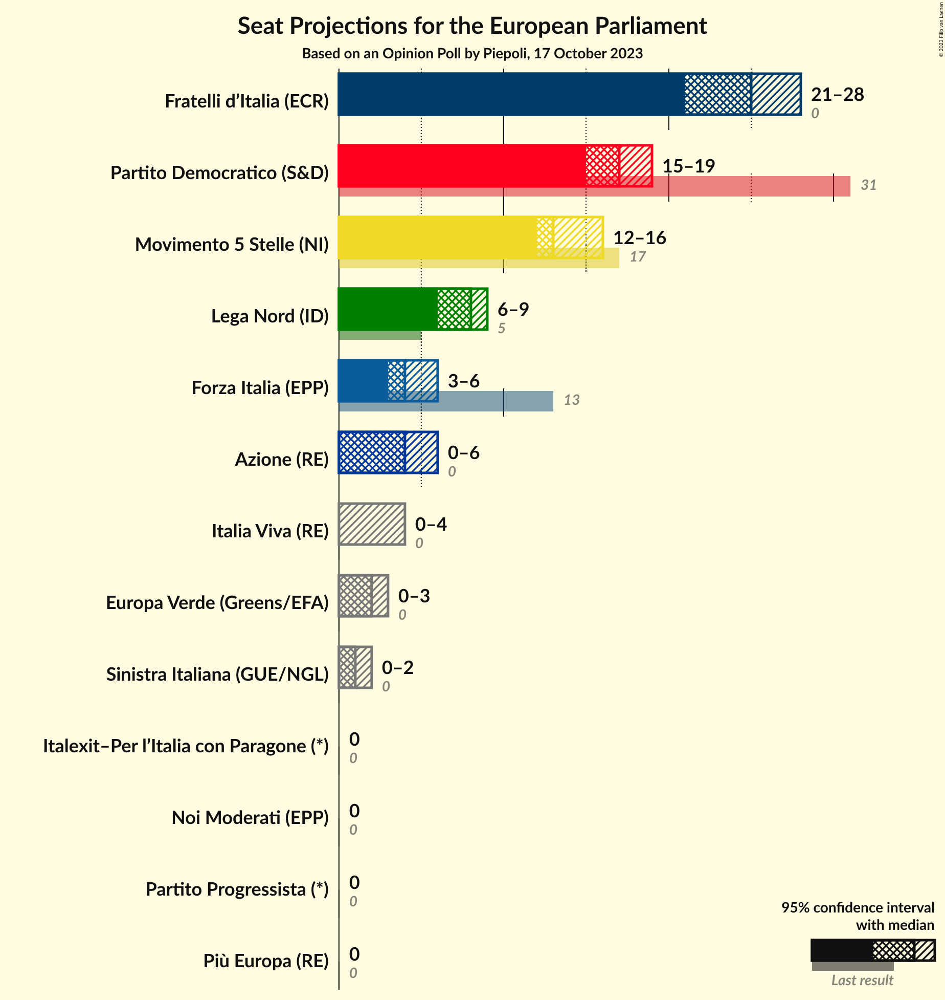
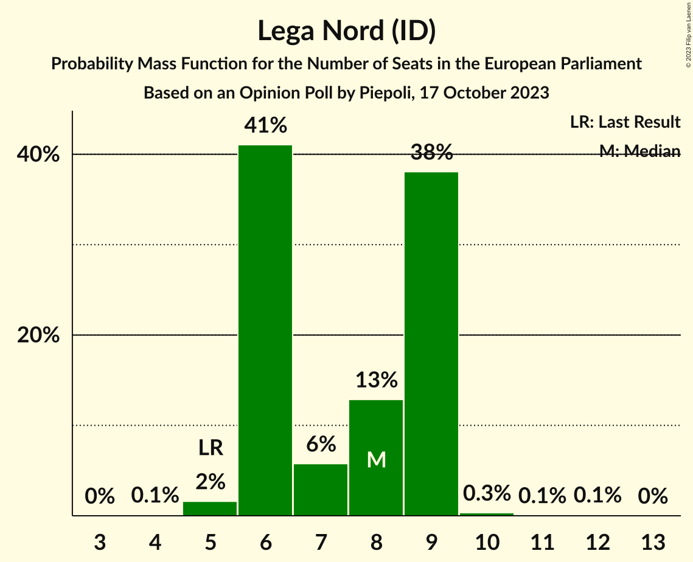
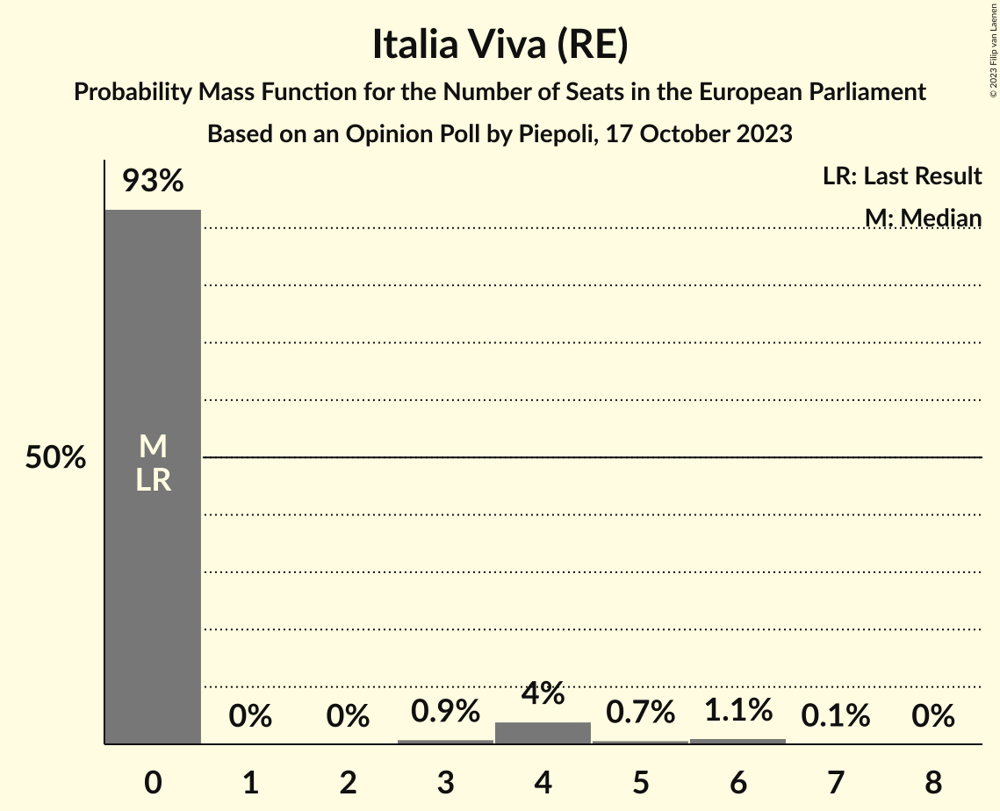
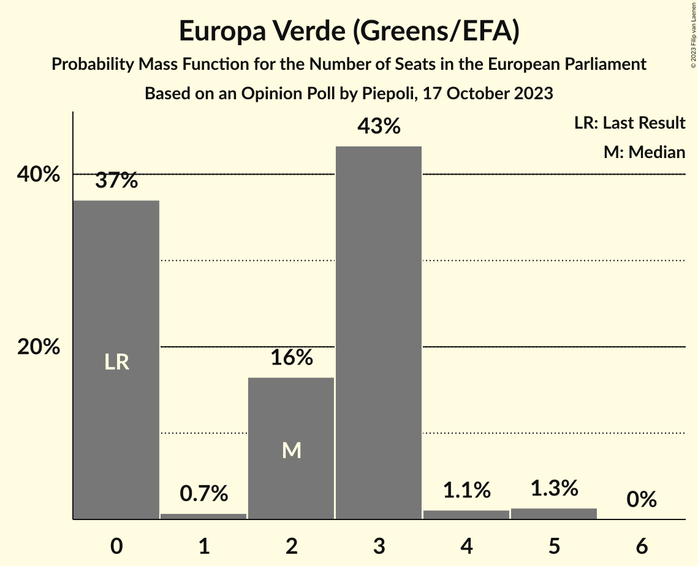
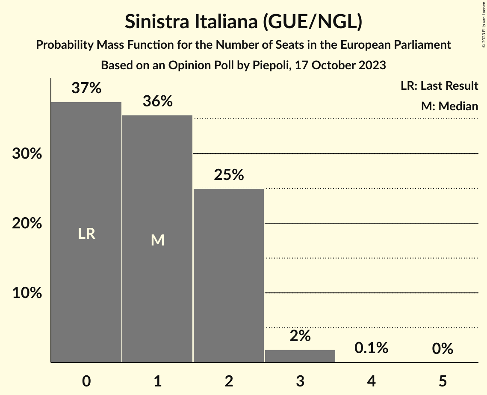

# Opinion Poll by Piepoli, 17 October 2023

<a href="#voting-intentions">Voting Intentions</a> | <a href="#seats">Seats</a> | <a href="#coalitions">Coalitions</a> | <a href="#technical-information">Technical Information</a>

## Voting Intentions

### Confidence Intervals

| Party | Last Result | Poll Result | 80% Confidence Interval | 90% Confidence Interval | 95% Confidence Interval | 99% Confidence Interval |
|:-----:|:-----------:|:-----------:|:-----------------------:|:-----------------------:|:-----------------------:|:-----------------------:|
| Fratelli d’Italia (ECR) | 3.7% | 28.9% | 26.0–32.2% |25.2–33.1% |24.5–33.9% |23.1–35.4% |
| Partito Democratico (S&D) | 40.8% | 19.9% | 17.4–22.9% |16.7–23.7% |16.1–24.4% |15.0–25.9% |
| Movimento 5 Stelle (NI) | 21.2% | 16.0% | 13.7–18.7% |13.1–19.5% |12.6–20.2% |11.6–21.6% |
| Lega Nord (ID) | 6.2% | 8.4% | 6.8–10.6% |6.3–11.2% |6.0–11.8% |5.3–12.9% |
| Forza Italia (EPP) | 16.8% | 5.9% | 4.6–7.8% |4.2–8.4% |3.9–8.9% |3.3–9.9% |
| Azione (RE) | 0.0% | 3.9% | 2.9–5.6% |2.6–6.1% |2.4–6.5% |1.9–7.4% |
| Italia Viva (RE) | 0.0% | 3.4% | 2.4–5.0% |2.2–5.4% |2.0–5.8% |1.6–6.7% |
| Più Europa (RE) | 0.0% | 2.5% | 1.7–4.0% |1.5–4.4% |1.3–4.7% |1.0–5.5% |
| Europa Verde (Greens/EFA) | 0.0% | 2.2% | 1.5–3.6% |1.3–4.0% |1.2–4.4% |0.9–5.1% |
| Italexit–Per l’Italia con Paragone (*) | 0.0% | 2.0% | 1.3–3.3% |1.1–3.7% |1.0–4.0% |0.7–4.7% |
| Noi Moderati (EPP) | 0.0% | 1.4% | 0.9–2.6% |0.7–2.9% |0.6–3.2% |0.4–3.9% |
| Sinistra Italiana (GUE/NGL) | 0.0% | 1.4% | 0.9–2.6% |0.7–2.9% |0.6–3.2% |0.4–3.9% |
| Partito Progressista (*) | 0.0% | 0.3% | 0.1–1.1% |0.1–1.3% |0.1–1.6% |0.0–2.1% |

*Note:* The poll result column reflects the actual value used in the calculations. Published results may vary slightly, and in addition be rounded to fewer digits.

## Seats

### Confidence Intervals

| Party | Last Result | Median | 80% Confidence Interval | 90% Confidence Interval | 95% Confidence Interval | 99% Confidence Interval |
|:-----:|:-----------:|:------:|:-----------------------:|:-----------------------:|:-----------------------:|:-----------------------:|
| <a href="#fratelli-d’italia-(ecr)">Fratelli d’Italia (ECR)</a> | 0 | 25 | 24–26 |22–26 |21–27 |20–28 |
| <a href="#partito-democratico-(s&d)">Partito Democratico (S&D)</a> | 31 | 16 | 15–19 |15–19 |14–19 |13–21 |
| <a href="#movimento-5-stelle-(ni)">Movimento 5 Stelle (NI)</a> | 17 | 13 | 13 |12–14 |12–16 |10–18 |
| <a href="#lega-nord-(id)">Lega Nord (ID)</a> | 5 | 8 | 6–9 |6–9 |6–9 |5–9 |
| <a href="#forza-italia-(epp)">Forza Italia (EPP)</a> | 13 | 4 | 3–6 |3–6 |3–6 |0–7 |
| <a href="#azione-(re)">Azione (RE)</a> | 0 | 4 | 0–4 |0–4 |0–6 |0–6 |
| <a href="#italia-viva-(re)">Italia Viva (RE)</a> | 0 | 0 | 0 |0–4 |0–4 |0–6 |
| <a href="#più-europa-(re)">Più Europa (RE)</a> | 0 | 0 | 0 |0 |0 |0–4 |
| <a href="#europa-verde-(greens/efa)">Europa Verde (Greens/EFA)</a> | 0 | 2 | 1–3 |1–3 |1–3 |1–5 |
| <a href="#italexit–per-l’italia-con-paragone-(*)">Italexit–Per l’Italia con Paragone (*)</a> | 0 | 0 | 0 |0 |0 |0 |
| <a href="#noi-moderati-(epp)">Noi Moderati (EPP)</a> | 0 | 0 | 0 |0 |0 |0 |
| <a href="#sinistra-italiana-(gue/ngl)">Sinistra Italiana (GUE/NGL)</a> | 0 | 2 | 1–2 |1–2 |1–2 |0–3 |
| <a href="#partito-progressista-(*)">Partito Progressista (*)</a> | 0 | 0 | 0 |0 |0–1 |0–1 |

### Fratelli d’Italia (ECR)

*For a full overview of the results for this party, see the [Fratelli d’Italia (ECR)](party-fratellid’italiaecr.html) page.*

| Number of Seats | Probability | Accumulated | Special Marks |
|:---------------:|:-----------:|:-----------:|:-------------:|
| 0 | 0% | 100% | Last Result |
| 1 | 0% | 100% |  |
| 2 | 0% | 100% |  |
| 3 | 0% | 100% |  |
| 4 | 0% | 100% |  |
| 5 | 0% | 100% |  |
| 6 | 0% | 100% |  |
| 7 | 0% | 100% |  |
| 8 | 0% | 100% |  |
| 9 | 0% | 100% |  |
| 10 | 0% | 100% |  |
| 11 | 0% | 100% |  |
| 12 | 0% | 100% |  |
| 13 | 0% | 100% |  |
| 14 | 0% | 100% |  |
| 15 | 0% | 100% |  |
| 16 | 0% | 100% |  |
| 17 | 0% | 100% |  |
| 18 | 0.1% | 100% |  |
| 19 | 0.2% | 99.9% |  |
| 20 | 0.4% | 99.8% |  |
| 21 | 3% | 99.4% |  |
| 22 | 2% | 96% |  |
| 23 | 1.5% | 94% |  |
| 24 | 21% | 93% |  |
| 25 | 28% | 71% | Median |
| 26 | 39% | 43% |  |
| 27 | 3% | 4% |  |
| 28 | 0.8% | 1.1% |  |
| 29 | 0.1% | 0.3% |  |
| 30 | 0% | 0.2% |  |
| 31 | 0.2% | 0.2% |  |
| 32 | 0% | 0% |  |

### Partito Democratico (S&D)

*For a full overview of the results for this party, see the [Partito Democratico (S&D)](party-partitodemocraticosd.html) page.*

| Number of Seats | Probability | Accumulated | Special Marks |
|:---------------:|:-----------:|:-----------:|:-------------:|
| 11 | 0.1% | 100% |  |
| 12 | 0.4% | 99.9% |  |
| 13 | 0.5% | 99.6% |  |
| 14 | 4% | 99.1% |  |
| 15 | 28% | 96% |  |
| 16 | 34% | 67% | Median |
| 17 | 9% | 34% |  |
| 18 | 13% | 25% |  |
| 19 | 10% | 12% |  |
| 20 | 0.5% | 1.4% |  |
| 21 | 0.8% | 0.9% |  |
| 22 | 0.1% | 0.1% |  |
| 23 | 0% | 0% |  |
| 24 | 0% | 0% |  |
| 25 | 0% | 0% |  |
| 26 | 0% | 0% |  |
| 27 | 0% | 0% |  |
| 28 | 0% | 0% |  |
| 29 | 0% | 0% |  |
| 30 | 0% | 0% |  |
| 31 | 0% | 0% | Last Result |

### Movimento 5 Stelle (NI)

*For a full overview of the results for this party, see the [Movimento 5 Stelle (NI)](party-movimento5stelleni.html) page.*

| Number of Seats | Probability | Accumulated | Special Marks |
|:---------------:|:-----------:|:-----------:|:-------------:|
| 9 | 0.1% | 100% |  |
| 10 | 0.6% | 99.8% |  |
| 11 | 0.9% | 99.3% |  |
| 12 | 4% | 98% |  |
| 13 | 89% | 95% | Median |
| 14 | 2% | 6% |  |
| 15 | 1.5% | 4% |  |
| 16 | 2% | 3% |  |
| 17 | 0.1% | 0.8% | Last Result |
| 18 | 0.5% | 0.7% |  |
| 19 | 0.1% | 0.2% |  |
| 20 | 0.1% | 0.1% |  |
| 21 | 0% | 0% |  |

### Lega Nord (ID)

*For a full overview of the results for this party, see the [Lega Nord (ID)](party-leganordid.html) page.*

| Number of Seats | Probability | Accumulated | Special Marks |
|:---------------:|:-----------:|:-----------:|:-------------:|
| 4 | 0.1% | 100% |  |
| 5 | 2% | 99.9% | Last Result |
| 6 | 41% | 98% |  |
| 7 | 6% | 57% |  |
| 8 | 13% | 51% | Median |
| 9 | 38% | 38% |  |
| 10 | 0.3% | 0.5% |  |
| 11 | 0.1% | 0.2% |  |
| 12 | 0% | 0.1% |  |
| 13 | 0% | 0% |  |

### Forza Italia (EPP)

*For a full overview of the results for this party, see the [Forza Italia (EPP)](party-forzaitaliaepp.html) page.*

| Number of Seats | Probability | Accumulated | Special Marks |
|:---------------:|:-----------:|:-----------:|:-------------:|
| 0 | 0.8% | 100% |  |
| 1 | 0% | 99.2% |  |
| 2 | 0.8% | 99.2% |  |
| 3 | 37% | 98% |  |
| 4 | 14% | 61% | Median |
| 5 | 20% | 47% |  |
| 6 | 27% | 27% |  |
| 7 | 0.7% | 0.9% |  |
| 8 | 0% | 0.2% |  |
| 9 | 0.2% | 0.2% |  |
| 10 | 0% | 0% |  |
| 11 | 0% | 0% |  |
| 12 | 0% | 0% |  |
| 13 | 0% | 0% | Last Result |

### Azione (RE)

*For a full overview of the results for this party, see the [Azione (RE)](party-azionere.html) page.*

| Number of Seats | Probability | Accumulated | Special Marks |
|:---------------:|:-----------:|:-----------:|:-------------:|
| 0 | 48% | 100% | Last Result |
| 1 | 0% | 52% |  |
| 2 | 0% | 52% |  |
| 3 | 1.5% | 52% |  |
| 4 | 47% | 51% | Median |
| 5 | 2% | 4% |  |
| 6 | 2% | 3% |  |
| 7 | 0.1% | 0.1% |  |
| 8 | 0% | 0% |  |

### Italia Viva (RE)

*For a full overview of the results for this party, see the [Italia Viva (RE)](party-italiavivare.html) page.*

| Number of Seats | Probability | Accumulated | Special Marks |
|:---------------:|:-----------:|:-----------:|:-------------:|
| 0 | 93% | 100% | Last Result, Median |
| 1 | 0% | 7% |  |
| 2 | 0% | 7% |  |
| 3 | 0.9% | 7% |  |
| 4 | 4% | 6% |  |
| 5 | 0.5% | 2% |  |
| 6 | 1.1% | 1.1% |  |
| 7 | 0.1% | 0.1% |  |
| 8 | 0% | 0% |  |

### Più Europa (RE)

*For a full overview of the results for this party, see the [Più Europa (RE)](party-piùeuropare.html) page.*

| Number of Seats | Probability | Accumulated | Special Marks |
|:---------------:|:-----------:|:-----------:|:-------------:|
| 0 | 98.7% | 100% | Last Result, Median |
| 1 | 0% | 1.3% |  |
| 2 | 0% | 1.3% |  |
| 3 | 0.4% | 1.3% |  |
| 4 | 0.8% | 1.0% |  |
| 5 | 0.2% | 0.2% |  |
| 6 | 0% | 0% |  |

### Europa Verde (Greens/EFA)

*For a full overview of the results for this party, see the [Europa Verde (Greens/EFA)](party-europaverdegreensefa.html) page.*

| Number of Seats | Probability | Accumulated | Special Marks |
|:---------------:|:-----------:|:-----------:|:-------------:|
| 0 | 0% | 100% | Last Result |
| 1 | 37% | 100% |  |
| 2 | 17% | 63% | Median |
| 3 | 43% | 46% |  |
| 4 | 1.1% | 2% |  |
| 5 | 1.3% | 1.4% |  |
| 6 | 0% | 0% |  |

### Italexit–Per l’Italia con Paragone (*)

*For a full overview of the results for this party, see the [Italexit–Per l’Italia con Paragone (*)](party-italexit–perl’italiaconparagone.html) page.*

| Number of Seats | Probability | Accumulated | Special Marks |
|:---------------:|:-----------:|:-----------:|:-------------:|
| 0 | 99.8% | 100% | Last Result, Median |
| 1 | 0% | 0.2% |  |
| 2 | 0% | 0.2% |  |
| 3 | 0% | 0.2% |  |
| 4 | 0.2% | 0.2% |  |
| 5 | 0% | 0% |  |

### Noi Moderati (EPP)

*For a full overview of the results for this party, see the [Noi Moderati (EPP)](party-noimoderatiepp.html) page.*

| Number of Seats | Probability | Accumulated | Special Marks |
|:---------------:|:-----------:|:-----------:|:-------------:|
| 0 | 99.9% | 100% | Last Result, Median |
| 1 | 0% | 0.1% |  |
| 2 | 0% | 0.1% |  |
| 3 | 0% | 0.1% |  |
| 4 | 0.1% | 0.1% |  |
| 5 | 0% | 0% |  |

### Sinistra Italiana (GUE/NGL)

*For a full overview of the results for this party, see the [Sinistra Italiana (GUE/NGL)](party-sinistraitalianaguengl.html) page.*

| Number of Seats | Probability | Accumulated | Special Marks |
|:---------------:|:-----------:|:-----------:|:-------------:|
| 0 | 0.8% | 100% | Last Result |
| 1 | 37% | 99.2% |  |
| 2 | 60% | 62% | Median |
| 3 | 2% | 2% |  |
| 4 | 0.1% | 0.1% |  |
| 5 | 0% | 0% |  |

### Partito Progressista (*)

*For a full overview of the results for this party, see the [Partito Progressista (*)](party-partitoprogressista.html) page.*

| Number of Seats | Probability | Accumulated | Special Marks |
|:---------------:|:-----------:|:-----------:|:-------------:|
| 0 | 97% | 100% | Last Result, Median |
| 1 | 3% | 3% |  |
| 2 | 0.2% | 0.2% |  |
| 3 | 0% | 0% |  |

## Coalitions

### Confidence Intervals

| Coalition | Last Result | Median | Majority? | 80% Confidence Interval | 90% Confidence Interval | 95% Confidence Interval | 99% Confidence Interval |
|:---------:|:-----------:|:------:|:---------:|:-----------------------:|:-----------------------:|:-----------------------:|:-----------------------:|
| Lega Nord (ID) | 5 | 8 | 0% | 6–9 | 6–9 | 6–9 | 5–9 |

### Lega Nord (ID)

| Number of Seats | Probability | Accumulated | Special Marks |
|:---------------:|:-----------:|:-----------:|:-------------:|
| 4 | 0.1% | 100% |  |
| 5 | 2% | 99.9% | Last Result |
| 6 | 41% | 98% |  |
| 7 | 6% | 57% |  |
| 8 | 13% | 51% | Median |
| 9 | 38% | 38% |  |
| 10 | 0.3% | 0.5% |  |
| 11 | 0.1% | 0.2% |  |
| 12 | 0% | 0.1% |  |
| 13 | 0% | 0% |  |

## Technical Information

### Opinion Poll

+ **Polling firm:** Piepoli
+ **Commissioner(s):** —
+ **Fieldwork period:** 17 October 2023

### Calculations

+ **Sample size:** 356
+ **Simulations done:** 1,048,576
+ **Error estimate:** 3.41%

