# Opinion Poll by Demopolis, 8–9 April 2024

<a href="#voting-intentions">Voting Intentions</a> | <a href="#seats">Seats</a> | <a href="#coalitions">Coalitions</a> | <a href="#technical-information">Technical Information</a>

## Voting Intentions

### Confidence Intervals

| Party | Last Result | Poll Result | 80% Confidence Interval | 90% Confidence Interval | 95% Confidence Interval | 99% Confidence Interval |
|:-----:|:-----------:|:-----------:|:-----------------------:|:-----------------------:|:-----------------------:|:-----------------------:|
| Fratelli d’Italia (ECR) | 3.7% | 27.6% | 26.4–29.0% |26.0–29.3% |25.7–29.7% |25.1–30.3% |
| Partito Democratico (S&D) | 40.8% | 20.5% | 19.3–21.7% |19.0–22.0% |18.7–22.3% |18.2–22.9% |
| Movimento 5 Stelle (NI) | 21.2% | 16.2% | 15.1–17.3% |14.8–17.6% |14.6–17.9% |14.1–18.4% |
| Forza Italia (EPP) | 16.8% | 8.9% | 8.1–9.8% |7.9–10.0% |7.7–10.3% |7.4–10.7% |
| Lega Nord (ID) | 6.2% | 8.2% | 7.4–9.0% |7.2–9.3% |7.0–9.5% |6.7–9.9% |
| Stati Uniti d’Europa (RE) | 0.0% | 4.7% | 4.1–5.4% |4.0–5.6% |3.9–5.7% |3.6–6.1% |
| Azione (RE) | 0.0% | 3.6% | 3.1–4.2% |3.0–4.4% |2.8–4.5% |2.6–4.8% |
| Pace Terra Dignità (GUE/NGL) | 0.0% | 2.3% | 1.9–2.8% |1.8–2.9% |1.7–3.0% |1.5–3.3% |
| Libertà (*) | 0.0% | 2.1% | 1.8–2.6% |1.7–2.8% |1.6–2.9% |1.4–3.2% |
| Europa Verde (Greens/EFA) | 0.0% | 2.1% | 1.8–2.6% |1.7–2.8% |1.6–2.9% |1.4–3.2% |
| Sinistra Italiana (GUE/NGL) | 0.0% | 1.4% | 1.1–1.8% |1.0–1.9% |0.9–2.0% |0.8–2.2% |
| Partito Progressista (*) | 0.0% | 0.4% | 0.2–0.6% |0.2–0.7% |0.2–0.7% |0.1–0.9% |

*Note:* The poll result column reflects the actual value used in the calculations. Published results may vary slightly, and in addition be rounded to fewer digits.

## Seats

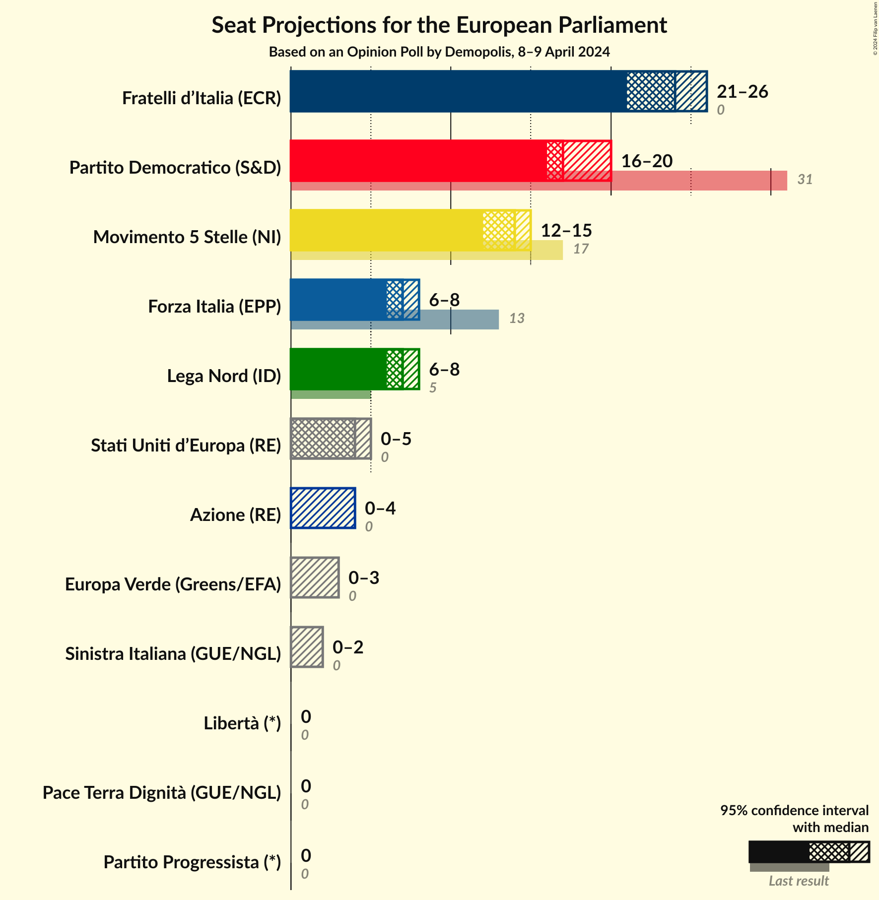

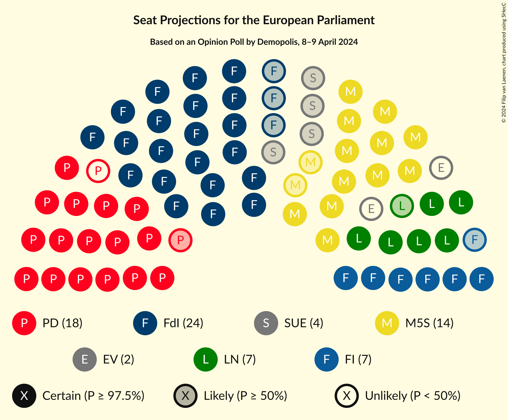

### Confidence Intervals

| Party | Last Result | Median | 80% Confidence Interval | 90% Confidence Interval | 95% Confidence Interval | 99% Confidence Interval |
|:-----:|:-----------:|:------:|:-----------------------:|:-----------------------:|:-----------------------:|:-----------------------:|
| <a href="#fratelli-d’italia-(ecr)">Fratelli d’Italia (ECR)</a> | 0 | 24 | 22–25 |22–25 |22–26 |21–26 |
| <a href="#partito-democratico-(s&d)">Partito Democratico (S&D)</a> | 31 | 17 | 16–19 |16–20 |15–20 |15–20 |
| <a href="#movimento-5-stelle-(ni)">Movimento 5 Stelle (NI)</a> | 17 | 14 | 13–14 |13–15 |12–15 |12–16 |
| <a href="#forza-italia-(epp)">Forza Italia (EPP)</a> | 13 | 7 | 6–7 |6–8 |5–8 |5–8 |
| <a href="#lega-nord-(id)">Lega Nord (ID)</a> | 5 | 7 | 6–7 |6–8 |6–8 |6–8 |
| <a href="#stati-uniti-d’europa-(re)">Stati Uniti d’Europa (RE)</a> | 0 | 4 | 3–5 |3–5 |3–5 |0–5 |
| <a href="#azione-(re)">Azione (RE)</a> | 0 | 0 | 0–3 |0–4 |0–4 |0–4 |
| <a href="#pace-terra-dignità-(gue/ngl)">Pace Terra Dignità (GUE/NGL)</a> | 0 | 0 | 0 |0 |0 |0 |
| <a href="#libertà-(*)">Libertà (*)</a> | 0 | 0 | 0 |0 |0 |0 |
| <a href="#europa-verde-(greens/efa)">Europa Verde (Greens/EFA)</a> | 0 | 2 | 0–2 |0–3 |0–3 |0–3 |
| <a href="#sinistra-italiana-(gue/ngl)">Sinistra Italiana (GUE/NGL)</a> | 0 | 1 | 0–2 |0–2 |0–2 |0–2 |
| <a href="#partito-progressista-(*)">Partito Progressista (*)</a> | 0 | 0 | 0 |0 |0 |0–1 |

### Fratelli d’Italia (ECR)

*For a full overview of the results for this party, see the [Fratelli d’Italia (ECR)](party-fratellid’italiaecr.html) page.*

| Number of Seats | Probability | Accumulated | Special Marks |
|:---------------:|:-----------:|:-----------:|:-------------:|
| 0 | 0% | 100% | Last Result |
| 1 | 0% | 100% |  |
| 2 | 0% | 100% |  |
| 3 | 0% | 100% |  |
| 4 | 0% | 100% |  |
| 5 | 0% | 100% |  |
| 6 | 0% | 100% |  |
| 7 | 0% | 100% |  |
| 8 | 0% | 100% |  |
| 9 | 0% | 100% |  |
| 10 | 0% | 100% |  |
| 11 | 0% | 100% |  |
| 12 | 0% | 100% |  |
| 13 | 0% | 100% |  |
| 14 | 0% | 100% |  |
| 15 | 0% | 100% |  |
| 16 | 0% | 100% |  |
| 17 | 0% | 100% |  |
| 18 | 0% | 100% |  |
| 19 | 0% | 100% |  |
| 20 | 0.2% | 100% |  |
| 21 | 0.5% | 99.8% |  |
| 22 | 10% | 99.3% |  |
| 23 | 14% | 89% |  |
| 24 | 50% | 75% | Median |
| 25 | 21% | 26% |  |
| 26 | 4% | 4% |  |
| 27 | 0.1% | 0.3% |  |
| 28 | 0.1% | 0.1% |  |
| 29 | 0% | 0% |  |

### Partito Democratico (S&D)

*For a full overview of the results for this party, see the [Partito Democratico (S&D)](party-partitodemocraticosd.html) page.*

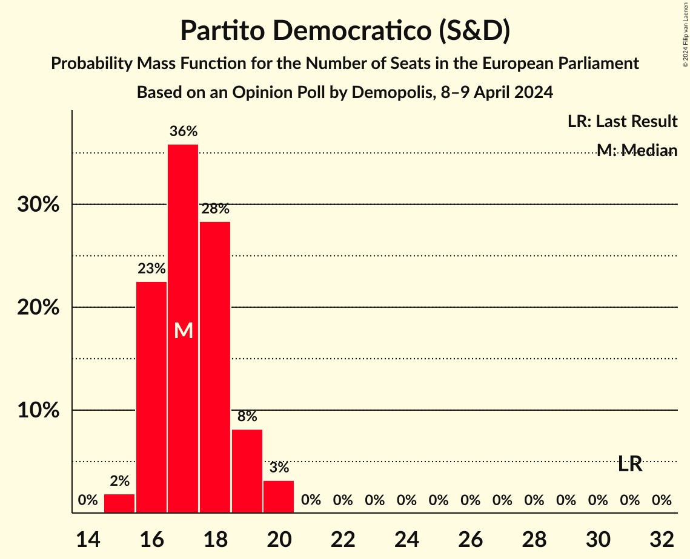

| Number of Seats | Probability | Accumulated | Special Marks |
|:---------------:|:-----------:|:-----------:|:-------------:|
| 15 | 3% | 100% |  |
| 16 | 41% | 97% |  |
| 17 | 32% | 56% | Median |
| 18 | 11% | 24% |  |
| 19 | 7% | 12% |  |
| 20 | 6% | 6% |  |
| 21 | 0% | 0% |  |
| 22 | 0% | 0% |  |
| 23 | 0% | 0% |  |
| 24 | 0% | 0% |  |
| 25 | 0% | 0% |  |
| 26 | 0% | 0% |  |
| 27 | 0% | 0% |  |
| 28 | 0% | 0% |  |
| 29 | 0% | 0% |  |
| 30 | 0% | 0% |  |
| 31 | 0% | 0% | Last Result |

### Movimento 5 Stelle (NI)

*For a full overview of the results for this party, see the [Movimento 5 Stelle (NI)](party-movimento5stelleni.html) page.*

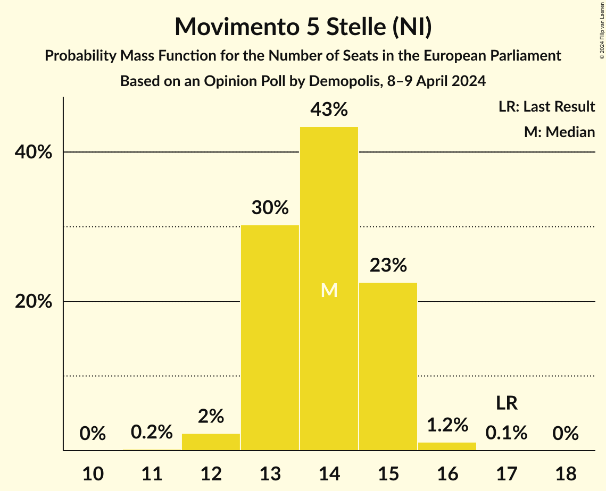

| Number of Seats | Probability | Accumulated | Special Marks |
|:---------------:|:-----------:|:-----------:|:-------------:|
| 11 | 0.3% | 100% |  |
| 12 | 3% | 99.7% |  |
| 13 | 19% | 97% |  |
| 14 | 71% | 78% | Median |
| 15 | 7% | 7% |  |
| 16 | 0.7% | 0.9% |  |
| 17 | 0.2% | 0.2% | Last Result |
| 18 | 0% | 0% |  |

### Forza Italia (EPP)

*For a full overview of the results for this party, see the [Forza Italia (EPP)](party-forzaitaliaepp.html) page.*

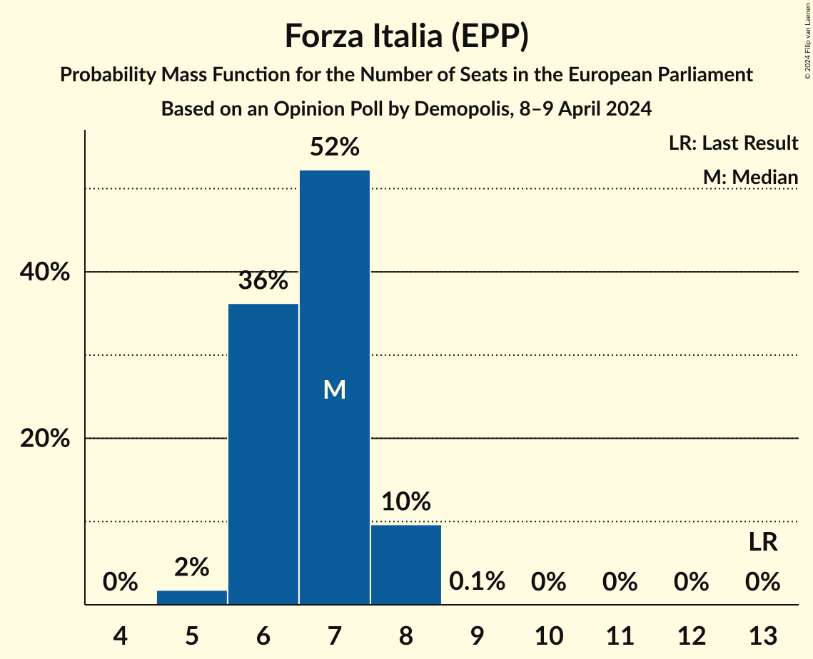

| Number of Seats | Probability | Accumulated | Special Marks |
|:---------------:|:-----------:|:-----------:|:-------------:|
| 5 | 3% | 100% |  |
| 6 | 23% | 97% |  |
| 7 | 68% | 74% | Median |
| 8 | 7% | 7% |  |
| 9 | 0.1% | 0.1% |  |
| 10 | 0% | 0% |  |
| 11 | 0% | 0% |  |
| 12 | 0% | 0% |  |
| 13 | 0% | 0% | Last Result |

### Lega Nord (ID)

*For a full overview of the results for this party, see the [Lega Nord (ID)](party-leganordid.html) page.*

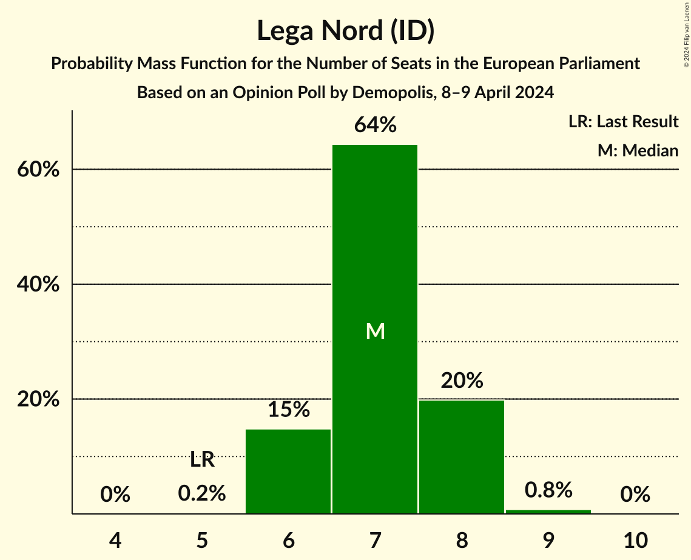

| Number of Seats | Probability | Accumulated | Special Marks |
|:---------------:|:-----------:|:-----------:|:-------------:|
| 5 | 0.3% | 100% | Last Result |
| 6 | 11% | 99.7% |  |
| 7 | 81% | 89% | Median |
| 8 | 7% | 8% |  |
| 9 | 0.3% | 0.3% |  |
| 10 | 0% | 0% |  |

### Stati Uniti d’Europa (RE)

*For a full overview of the results for this party, see the [Stati Uniti d’Europa (RE)](party-statiunitid’europare.html) page.*

| Number of Seats | Probability | Accumulated | Special Marks |
|:---------------:|:-----------:|:-----------:|:-------------:|
| 0 | 2% | 100% | Last Result |
| 1 | 0% | 98% |  |
| 2 | 0% | 98% |  |
| 3 | 38% | 98% |  |
| 4 | 30% | 60% | Median |
| 5 | 30% | 31% |  |
| 6 | 0.2% | 0.2% |  |
| 7 | 0% | 0% |  |

### Azione (RE)

*For a full overview of the results for this party, see the [Azione (RE)](party-azionere.html) page.*

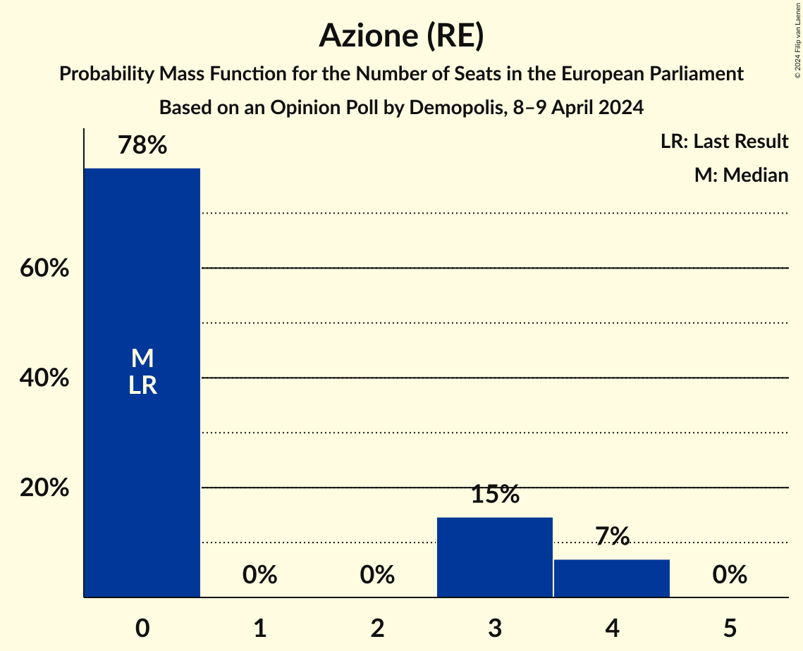

| Number of Seats | Probability | Accumulated | Special Marks |
|:---------------:|:-----------:|:-----------:|:-------------:|
| 0 | 84% | 100% | Last Result, Median |
| 1 | 0% | 16% |  |
| 2 | 0% | 16% |  |
| 3 | 6% | 16% |  |
| 4 | 9% | 9% |  |
| 5 | 0% | 0% |  |

### Pace Terra Dignità (GUE/NGL)

*For a full overview of the results for this party, see the [Pace Terra Dignità (GUE/NGL)](party-paceterradignitàguengl.html) page.*

| Number of Seats | Probability | Accumulated | Special Marks |
|:---------------:|:-----------:|:-----------:|:-------------:|
| 0 | 100% | 100% | Last Result, Median |

### Libertà (*)

*For a full overview of the results for this party, see the [Libertà (*)](party-libertà.html) page.*

| Number of Seats | Probability | Accumulated | Special Marks |
|:---------------:|:-----------:|:-----------:|:-------------:|
| 0 | 100% | 100% | Last Result, Median |

### Europa Verde (Greens/EFA)

*For a full overview of the results for this party, see the [Europa Verde (Greens/EFA)](party-europaverdegreensefa.html) page.*

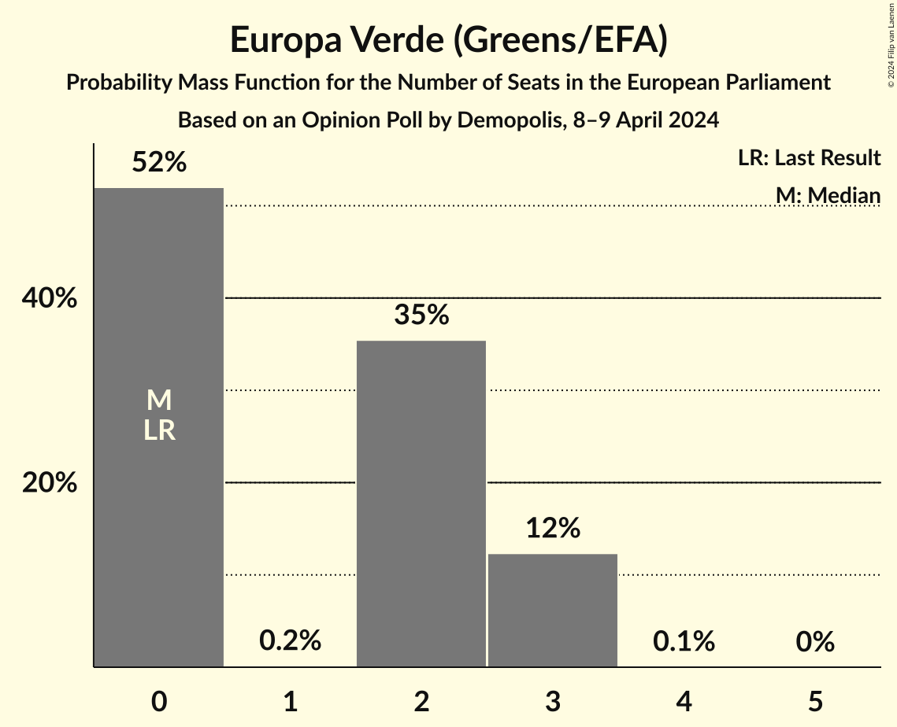

| Number of Seats | Probability | Accumulated | Special Marks |
|:---------------:|:-----------:|:-----------:|:-------------:|
| 0 | 46% | 100% | Last Result |
| 1 | 0.3% | 54% |  |
| 2 | 44% | 53% | Median |
| 3 | 9% | 9% |  |
| 4 | 0% | 0% |  |

### Sinistra Italiana (GUE/NGL)

*For a full overview of the results for this party, see the [Sinistra Italiana (GUE/NGL)](party-sinistraitalianaguengl.html) page.*

| Number of Seats | Probability | Accumulated | Special Marks |
|:---------------:|:-----------:|:-----------:|:-------------:|
| 0 | 46% | 100% | Last Result |
| 1 | 13% | 54% | Median |
| 2 | 41% | 41% |  |
| 3 | 0.1% | 0.1% |  |
| 4 | 0% | 0% |  |

### Partito Progressista (*)

*For a full overview of the results for this party, see the [Partito Progressista (*)](party-partitoprogressista.html) page.*

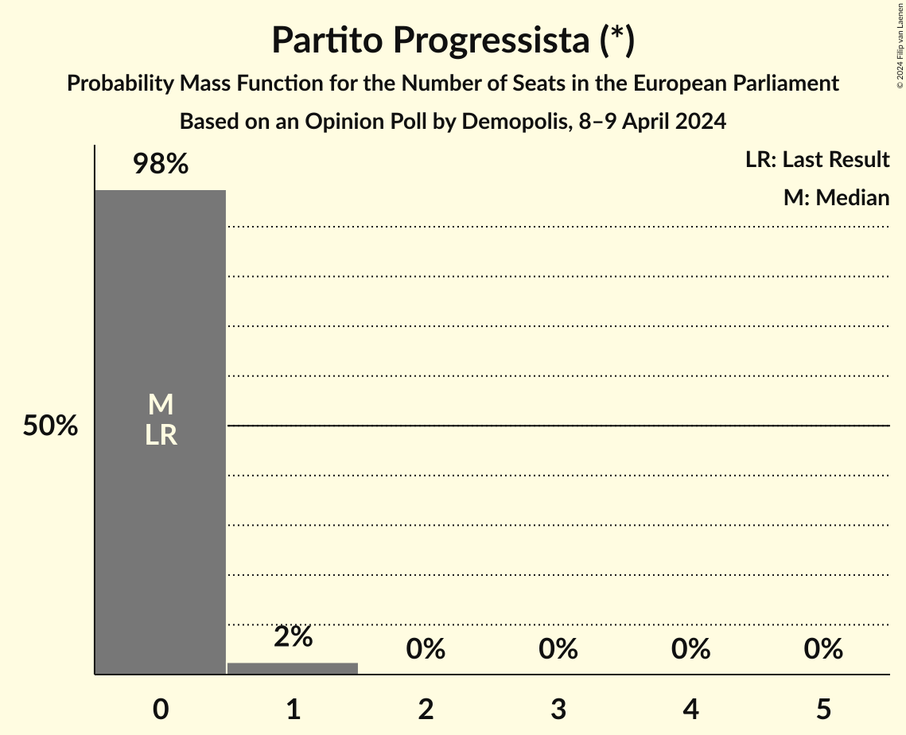

| Number of Seats | Probability | Accumulated | Special Marks |
|:---------------:|:-----------:|:-----------:|:-------------:|
| 0 | 98.8% | 100% | Last Result, Median |
| 1 | 1.2% | 1.2% |  |
| 2 | 0% | 0% |  |

## Coalitions

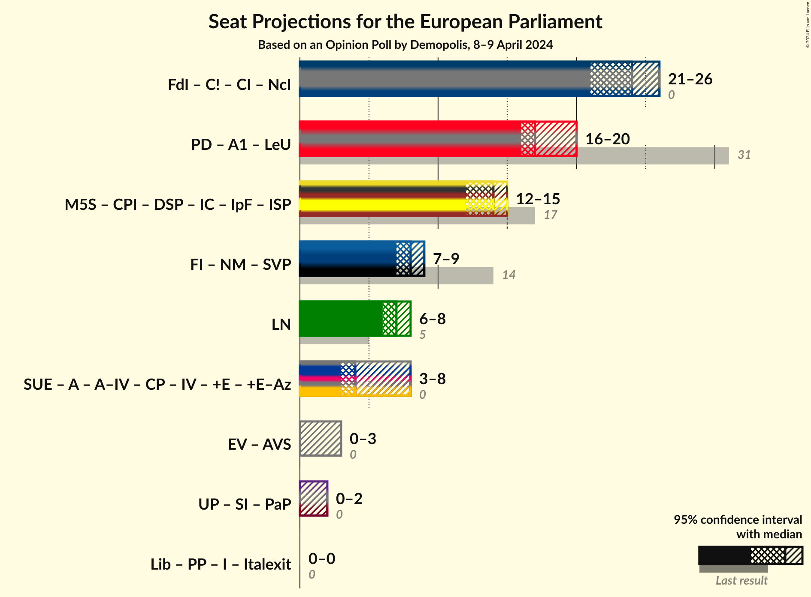

### Confidence Intervals

| Coalition | Last Result | Median | Majority? | 80% Confidence Interval | 90% Confidence Interval | 95% Confidence Interval | 99% Confidence Interval |
|:---------:|:-----------:|:------:|:---------:|:-----------------------:|:-----------------------:|:-----------------------:|:-----------------------:|
| Lega Nord (ID) | 5 | 7 | 0% | 6–7 | 6–8 | 6–8 | 6–8 |

### Lega Nord (ID)

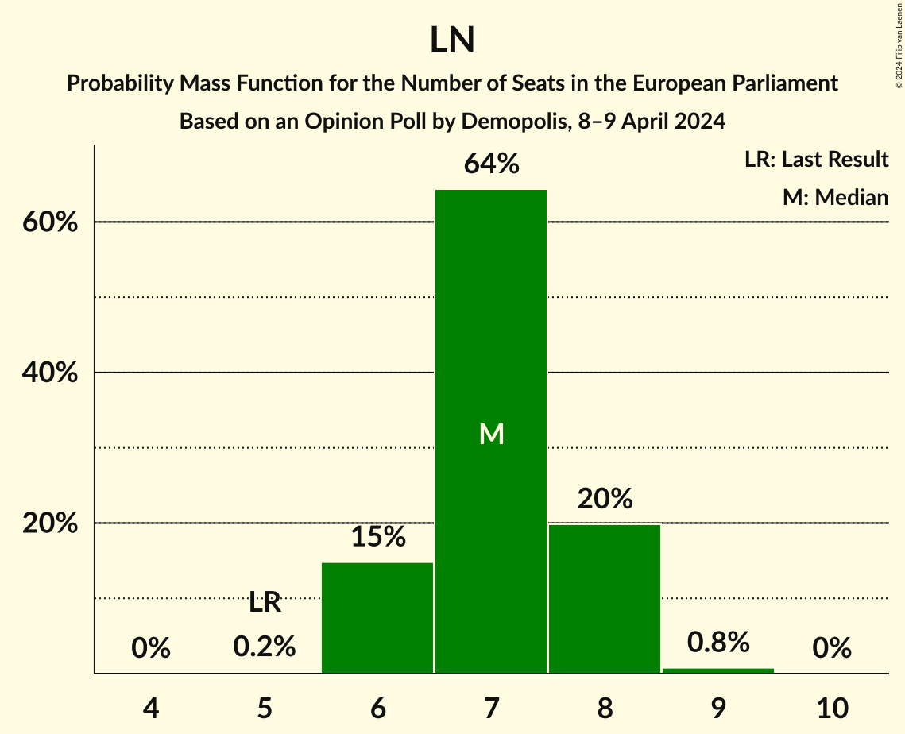

| Number of Seats | Probability | Accumulated | Special Marks |
|:---------------:|:-----------:|:-----------:|:-------------:|
| 5 | 0.3% | 100% | Last Result |
| 6 | 11% | 99.7% |  |
| 7 | 81% | 89% | Median |
| 8 | 7% | 8% |  |
| 9 | 0.3% | 0.3% |  |
| 10 | 0% | 0% |  |

## Technical Information

### Opinion Poll

+ **Polling firm:** Demopolis
+ **Commissioner(s):** —
+ **Fieldwork period:** 8–9 April 2024

### Calculations

+ **Sample size:** 1954
+ **Simulations done:** 1,048,576
+ **Error estimate:** 4.15%

