# Opinion Poll by Termometro Politico, 12–13 June 2024

<a href="#voting-intentions">Voting Intentions</a> | <a href="#seats">Seats</a> | <a href="#coalitions">Coalitions</a> | <a href="#technical-information">Technical Information</a>

## Voting Intentions

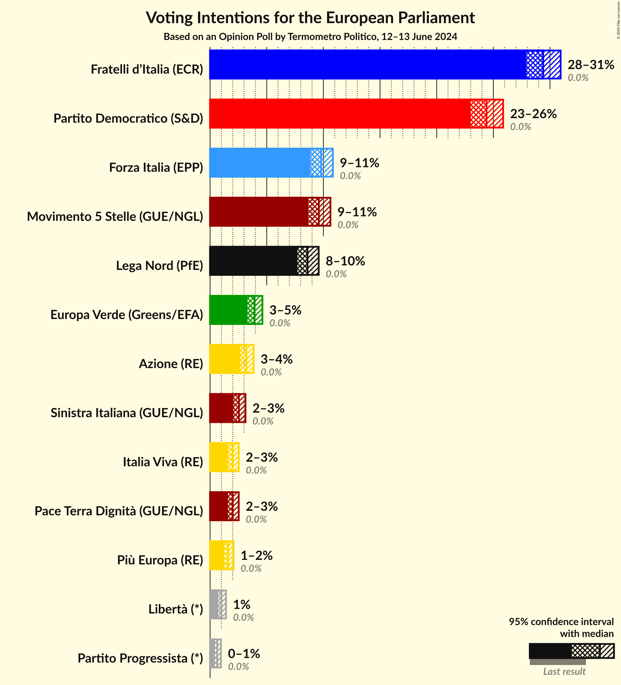

### Confidence Intervals

| Party | Last Result | Poll Result | 80% Confidence Interval | 90% Confidence Interval | 95% Confidence Interval | 99% Confidence Interval |
|:-----:|:-----------:|:-----------:|:-----------------------:|:-----------------------:|:-----------------------:|:-----------------------:|
| Fratelli d’Italia (ECR) | 0.0% | 29.4% | 28.4–30.4% |28.2–30.7% |27.9–30.9% |27.5–31.4% |
| Partito Democratico (S&D) | 0.0% | 24.4% | 23.5–25.4% |23.2–25.6% |23.0–25.9% |22.6–26.3% |
| Forza Italia (EPP) | 0.0% | 9.8% | 9.2–10.5% |9.0–10.7% |8.9–10.8% |8.6–11.2% |
| Movimento 5 Stelle (GUE/NGL) | 0.0% | 9.6% | 9.0–10.3% |8.8–10.5% |8.7–10.6% |8.4–11.0% |
| Lega Nord (PfE) | 0.0% | 8.6% | 8.0–9.2% |7.8–9.4% |7.7–9.6% |7.4–9.9% |
| Europa Verde (Greens/EFA) | 0.0% | 3.9% | 3.5–4.4% |3.4–4.5% |3.3–4.6% |3.1–4.8% |
| Azione (RE) | 0.0% | 3.2% | 2.9–3.6% |2.7–3.7% |2.7–3.8% |2.5–4.1% |
| Sinistra Italiana (GUE/NGL) | 0.0% | 2.5% | 2.2–2.9% |2.1–3.0% |2.1–3.1% |1.9–3.3% |
| Pace Terra Dignità (GUE/NGL) | 0.0% | 2.0% | 1.7–2.3% |1.6–2.4% |1.6–2.5% |1.5–2.7% |
| Italia Viva (RE) | 0.0% | 2.0% | 1.7–2.3% |1.6–2.4% |1.6–2.5% |1.5–2.7% |
| Più Europa (RE) | 0.0% | 1.6% | 1.4–1.9% |1.3–2.0% |1.2–2.1% |1.1–2.2% |
| Libertà (*) | 0.0% | 1.0% | 0.8–1.3% |0.8–1.3% |0.7–1.4% |0.6–1.5% |
| Partito Progressista (*) | 0.0% | 0.6% | 0.5–0.8% |0.4–0.9% |0.4–1.0% |0.4–1.1% |

*Note:* The poll result column reflects the actual value used in the calculations. Published results may vary slightly, and in addition be rounded to fewer digits.

## Seats

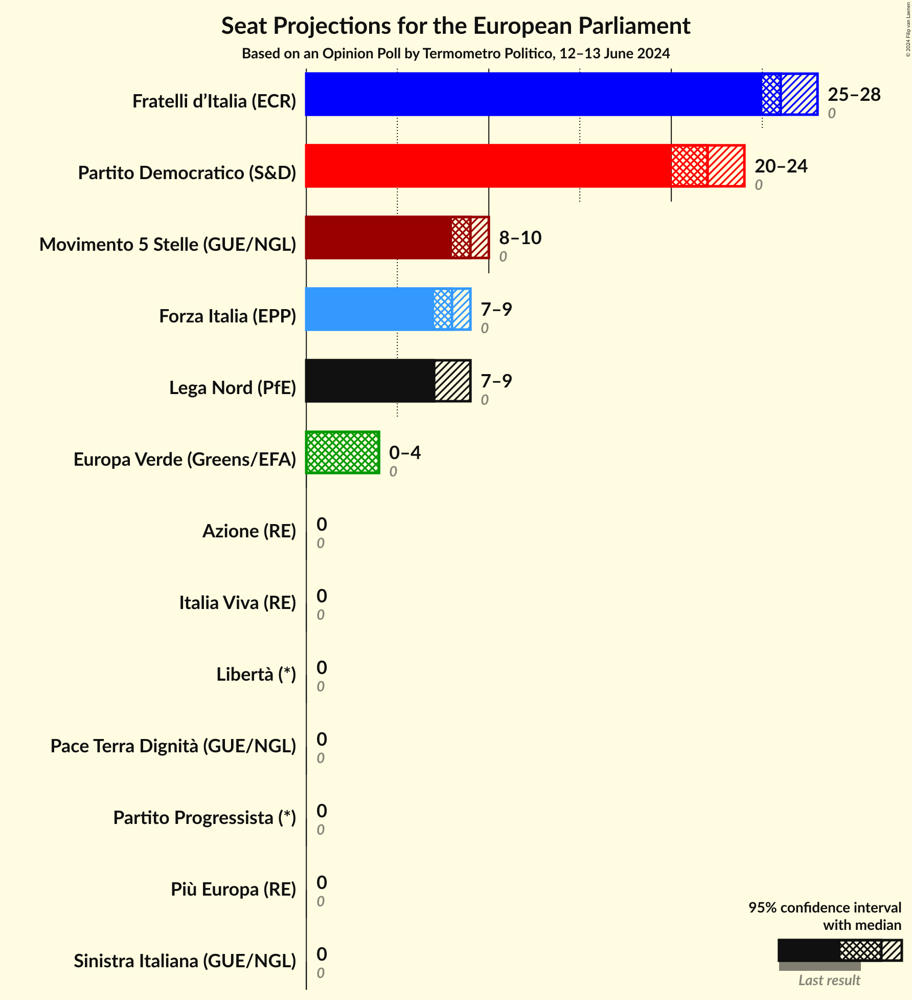

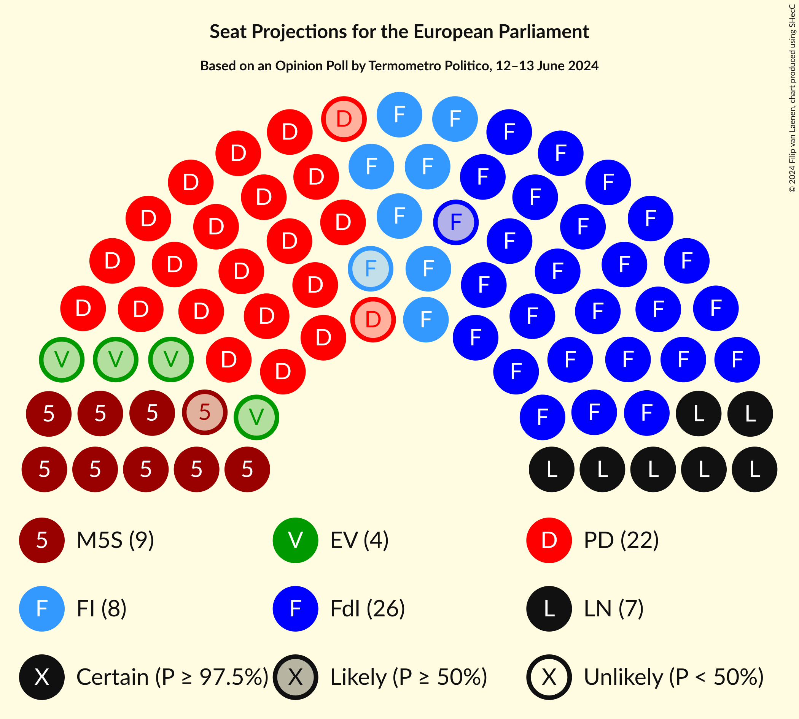

### Confidence Intervals

| Party | Last Result | Median | 80% Confidence Interval | 90% Confidence Interval | 95% Confidence Interval | 99% Confidence Interval |
|:-----:|:-----------:|:------:|:-----------------------:|:-----------------------:|:-----------------------:|:-----------------------:|
| <a href="#fratelli-d’italia-(ecr)">Fratelli d’Italia (ECR)</a> | 0 | 26 | 25–27 |25–28 |25–28 |25–29 |
| <a href="#partito-democratico-(s&d)">Partito Democratico (S&D)</a> | 0 | 22 | 21–23 |21–24 |20–24 |20–24 |
| <a href="#forza-italia-(epp)">Forza Italia (EPP)</a> | 0 | 8 | 8–9 |8–9 |7–9 |7–9 |
| <a href="#movimento-5-stelle-(gue/ngl)">Movimento 5 Stelle (GUE/NGL)</a> | 0 | 9 | 8–10 |8–10 |8–10 |7–10 |
| <a href="#lega-nord-(pfe)">Lega Nord (PfE)</a> | 0 | 7 | 7–8 |7–8 |7–9 |7–9 |
| <a href="#europa-verde-(greens/efa)">Europa Verde (Greens/EFA)</a> | 0 | 4 | 0–4 |0–4 |0–4 |0–4 |
| <a href="#azione-(re)">Azione (RE)</a> | 0 | 0 | 0 |0 |0 |0–4 |
| <a href="#sinistra-italiana-(gue/ngl)">Sinistra Italiana (GUE/NGL)</a> | 0 | 0 | 0 |0 |0 |0 |
| <a href="#pace-terra-dignità-(gue/ngl)">Pace Terra Dignità (GUE/NGL)</a> | 0 | 0 | 0 |0 |0 |0 |
| <a href="#italia-viva-(re)">Italia Viva (RE)</a> | 0 | 0 | 0 |0 |0 |0 |
| <a href="#più-europa-(re)">Più Europa (RE)</a> | 0 | 0 | 0 |0 |0 |0 |
| <a href="#libertà-(*)">Libertà (*)</a> | 0 | 0 | 0 |0 |0 |0 |
| <a href="#partito-progressista-(*)">Partito Progressista (*)</a> | 0 | 0 | 0 |0 |0 |0 |

### Fratelli d’Italia (ECR)

*For a full overview of the results for this party, see the [Fratelli d’Italia (ECR)](party-fratellid’italiaecr.html) page.*

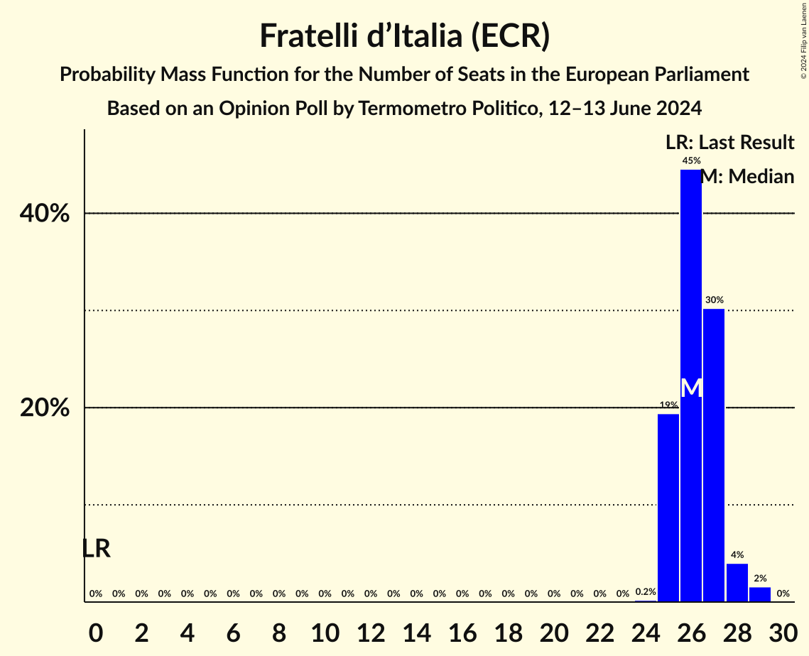

| Number of Seats | Probability | Accumulated | Special Marks |
|:---------------:|:-----------:|:-----------:|:-------------:|
| 0 | 0% | 100% | Last Result |
| 1 | 0% | 100% |  |
| 2 | 0% | 100% |  |
| 3 | 0% | 100% |  |
| 4 | 0% | 100% |  |
| 5 | 0% | 100% |  |
| 6 | 0% | 100% |  |
| 7 | 0% | 100% |  |
| 8 | 0% | 100% |  |
| 9 | 0% | 100% |  |
| 10 | 0% | 100% |  |
| 11 | 0% | 100% |  |
| 12 | 0% | 100% |  |
| 13 | 0% | 100% |  |
| 14 | 0% | 100% |  |
| 15 | 0% | 100% |  |
| 16 | 0% | 100% |  |
| 17 | 0% | 100% |  |
| 18 | 0% | 100% |  |
| 19 | 0% | 100% |  |
| 20 | 0% | 100% |  |
| 21 | 0% | 100% |  |
| 22 | 0% | 100% |  |
| 23 | 0% | 100% |  |
| 24 | 0.2% | 100% |  |
| 25 | 19% | 99.8% |  |
| 26 | 45% | 80% | Median |
| 27 | 30% | 36% |  |
| 28 | 4% | 6% |  |
| 29 | 2% | 2% |  |
| 30 | 0% | 0% |  |

### Partito Democratico (S&D)

*For a full overview of the results for this party, see the [Partito Democratico (S&D)](party-partitodemocraticosd.html) page.*

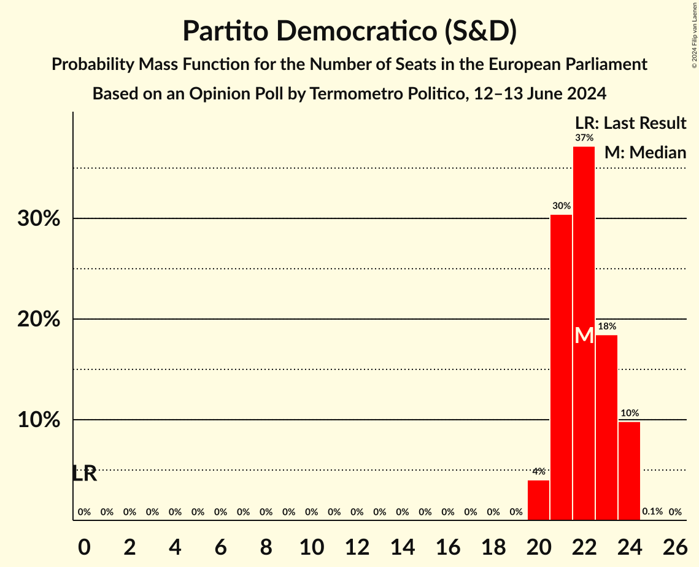

| Number of Seats | Probability | Accumulated | Special Marks |
|:---------------:|:-----------:|:-----------:|:-------------:|
| 0 | 0% | 100% | Last Result |
| 1 | 0% | 100% |  |
| 2 | 0% | 100% |  |
| 3 | 0% | 100% |  |
| 4 | 0% | 100% |  |
| 5 | 0% | 100% |  |
| 6 | 0% | 100% |  |
| 7 | 0% | 100% |  |
| 8 | 0% | 100% |  |
| 9 | 0% | 100% |  |
| 10 | 0% | 100% |  |
| 11 | 0% | 100% |  |
| 12 | 0% | 100% |  |
| 13 | 0% | 100% |  |
| 14 | 0% | 100% |  |
| 15 | 0% | 100% |  |
| 16 | 0% | 100% |  |
| 17 | 0% | 100% |  |
| 18 | 0% | 100% |  |
| 19 | 0% | 100% |  |
| 20 | 4% | 100% |  |
| 21 | 30% | 96% |  |
| 22 | 37% | 66% | Median |
| 23 | 18% | 28% |  |
| 24 | 10% | 10% |  |
| 25 | 0.1% | 0.1% |  |
| 26 | 0% | 0% |  |

### Forza Italia (EPP)

*For a full overview of the results for this party, see the [Forza Italia (EPP)](party-forzaitaliaepp.html) page.*

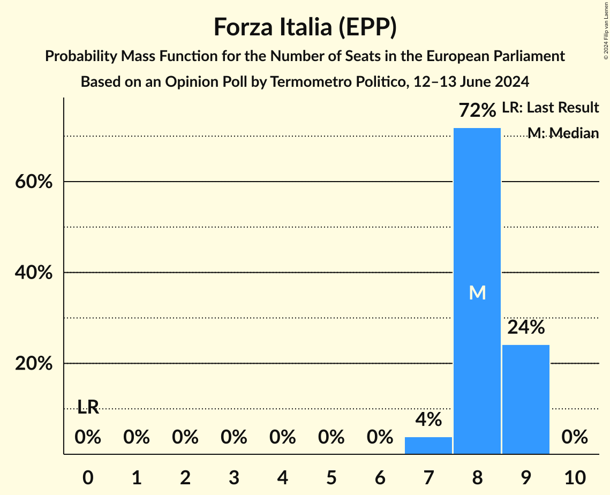

| Number of Seats | Probability | Accumulated | Special Marks |
|:---------------:|:-----------:|:-----------:|:-------------:|
| 0 | 0% | 100% | Last Result |
| 1 | 0% | 100% |  |
| 2 | 0% | 100% |  |
| 3 | 0% | 100% |  |
| 4 | 0% | 100% |  |
| 5 | 0% | 100% |  |
| 6 | 0% | 100% |  |
| 7 | 4% | 100% |  |
| 8 | 72% | 96% | Median |
| 9 | 24% | 24% |  |
| 10 | 0% | 0% |  |

### Movimento 5 Stelle (GUE/NGL)

*For a full overview of the results for this party, see the [Movimento 5 Stelle (GUE/NGL)](party-movimento5stelleguengl.html) page.*

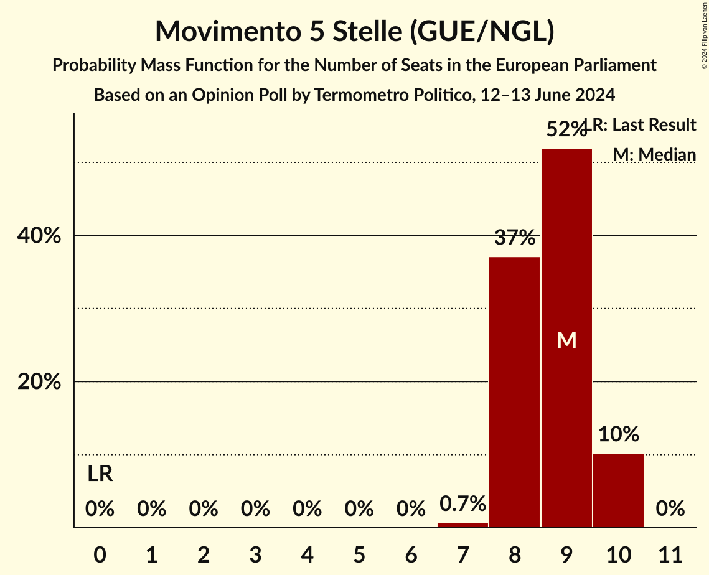

| Number of Seats | Probability | Accumulated | Special Marks |
|:---------------:|:-----------:|:-----------:|:-------------:|
| 0 | 0% | 100% | Last Result |
| 1 | 0% | 100% |  |
| 2 | 0% | 100% |  |
| 3 | 0% | 100% |  |
| 4 | 0% | 100% |  |
| 5 | 0% | 100% |  |
| 6 | 0% | 100% |  |
| 7 | 0.7% | 100% |  |
| 8 | 37% | 99.3% |  |
| 9 | 52% | 62% | Median |
| 10 | 10% | 10% |  |
| 11 | 0% | 0% |  |

### Lega Nord (PfE)

*For a full overview of the results for this party, see the [Lega Nord (PfE)](party-leganordpfe.html) page.*

| Number of Seats | Probability | Accumulated | Special Marks |
|:---------------:|:-----------:|:-----------:|:-------------:|
| 0 | 0% | 100% | Last Result |
| 1 | 0% | 100% |  |
| 2 | 0% | 100% |  |
| 3 | 0% | 100% |  |
| 4 | 0% | 100% |  |
| 5 | 0% | 100% |  |
| 6 | 0.4% | 100% |  |
| 7 | 51% | 99.6% | Median |
| 8 | 46% | 49% |  |
| 9 | 3% | 3% |  |
| 10 | 0% | 0% |  |

### Europa Verde (Greens/EFA)

*For a full overview of the results for this party, see the [Europa Verde (Greens/EFA)](party-europaverdegreensefa.html) page.*

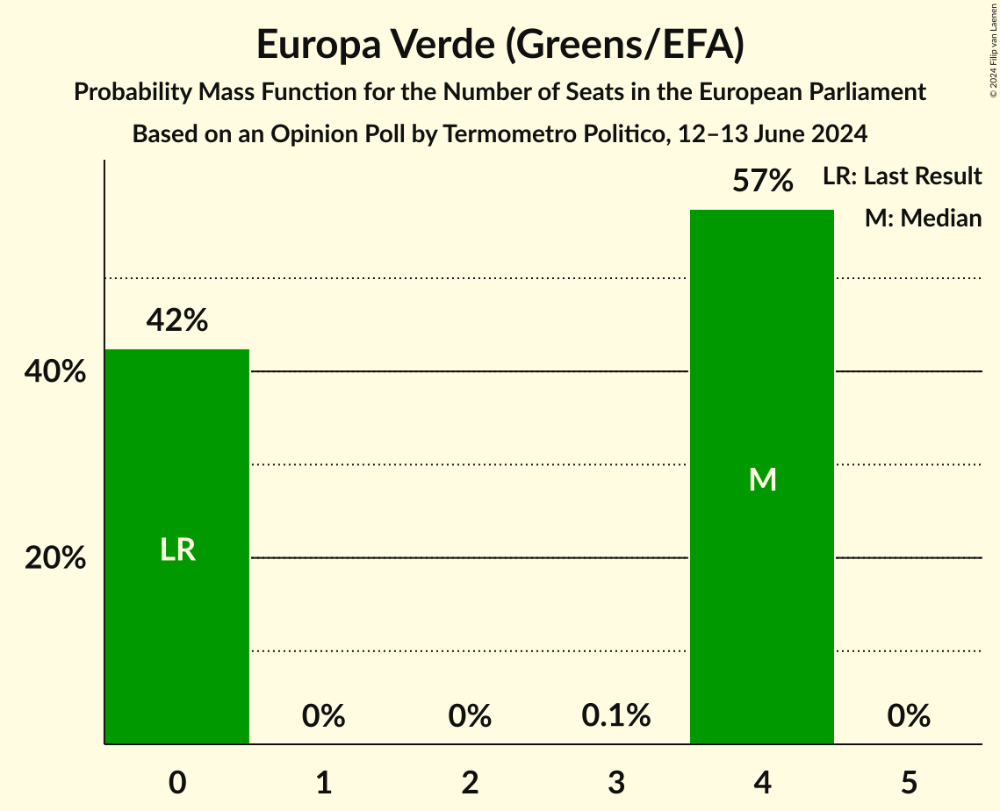

| Number of Seats | Probability | Accumulated | Special Marks |
|:---------------:|:-----------:|:-----------:|:-------------:|
| 0 | 42% | 100% | Last Result |
| 1 | 0% | 58% |  |
| 2 | 0% | 58% |  |
| 3 | 0.1% | 58% |  |
| 4 | 57% | 57% | Median |
| 5 | 0% | 0% |  |

### Azione (RE)

*For a full overview of the results for this party, see the [Azione (RE)](party-azionere.html) page.*

| Number of Seats | Probability | Accumulated | Special Marks |
|:---------------:|:-----------:|:-----------:|:-------------:|
| 0 | 99.1% | 100% | Last Result, Median |
| 1 | 0% | 0.9% |  |
| 2 | 0% | 0.9% |  |
| 3 | 0% | 0.9% |  |
| 4 | 0.9% | 0.9% |  |
| 5 | 0% | 0% |  |

### Sinistra Italiana (GUE/NGL)

*For a full overview of the results for this party, see the [Sinistra Italiana (GUE/NGL)](party-sinistraitalianaguengl.html) page.*

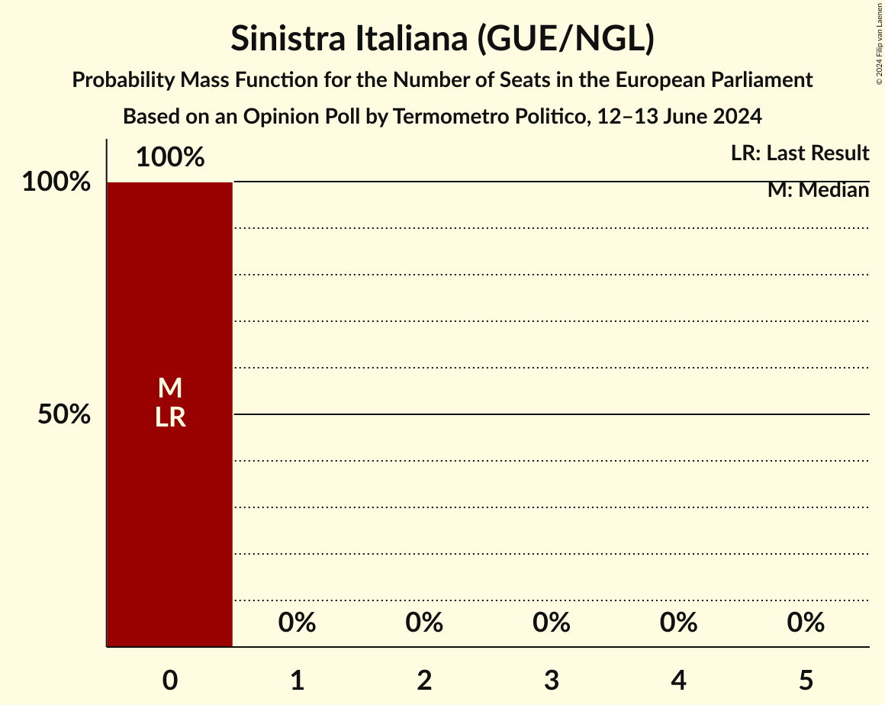

| Number of Seats | Probability | Accumulated | Special Marks |
|:---------------:|:-----------:|:-----------:|:-------------:|
| 0 | 100% | 100% | Last Result, Median |

### Pace Terra Dignità (GUE/NGL)

*For a full overview of the results for this party, see the [Pace Terra Dignità (GUE/NGL)](party-paceterradignitàguengl.html) page.*

| Number of Seats | Probability | Accumulated | Special Marks |
|:---------------:|:-----------:|:-----------:|:-------------:|
| 0 | 100% | 100% | Last Result, Median |

### Italia Viva (RE)

*For a full overview of the results for this party, see the [Italia Viva (RE)](party-italiavivare.html) page.*

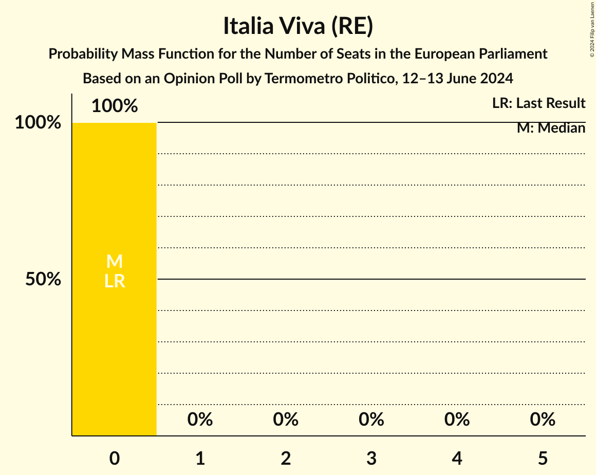

| Number of Seats | Probability | Accumulated | Special Marks |
|:---------------:|:-----------:|:-----------:|:-------------:|
| 0 | 100% | 100% | Last Result, Median |

### Più Europa (RE)

*For a full overview of the results for this party, see the [Più Europa (RE)](party-piùeuropare.html) page.*

| Number of Seats | Probability | Accumulated | Special Marks |
|:---------------:|:-----------:|:-----------:|:-------------:|
| 0 | 100% | 100% | Last Result, Median |

### Libertà (*)

*For a full overview of the results for this party, see the [Libertà (*)](party-libertà.html) page.*

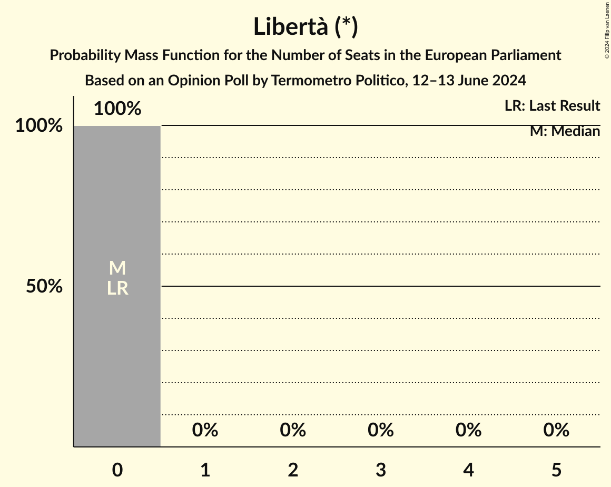

| Number of Seats | Probability | Accumulated | Special Marks |
|:---------------:|:-----------:|:-----------:|:-------------:|
| 0 | 100% | 100% | Last Result, Median |

### Partito Progressista (*)

*For a full overview of the results for this party, see the [Partito Progressista (*)](party-partitoprogressista.html) page.*

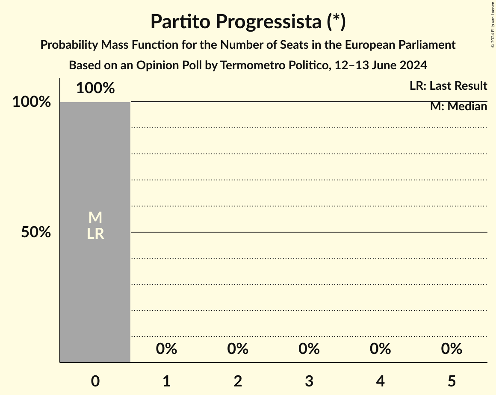

| Number of Seats | Probability | Accumulated | Special Marks |
|:---------------:|:-----------:|:-----------:|:-------------:|
| 0 | 100% | 100% | Last Result, Median |

## Coalitions

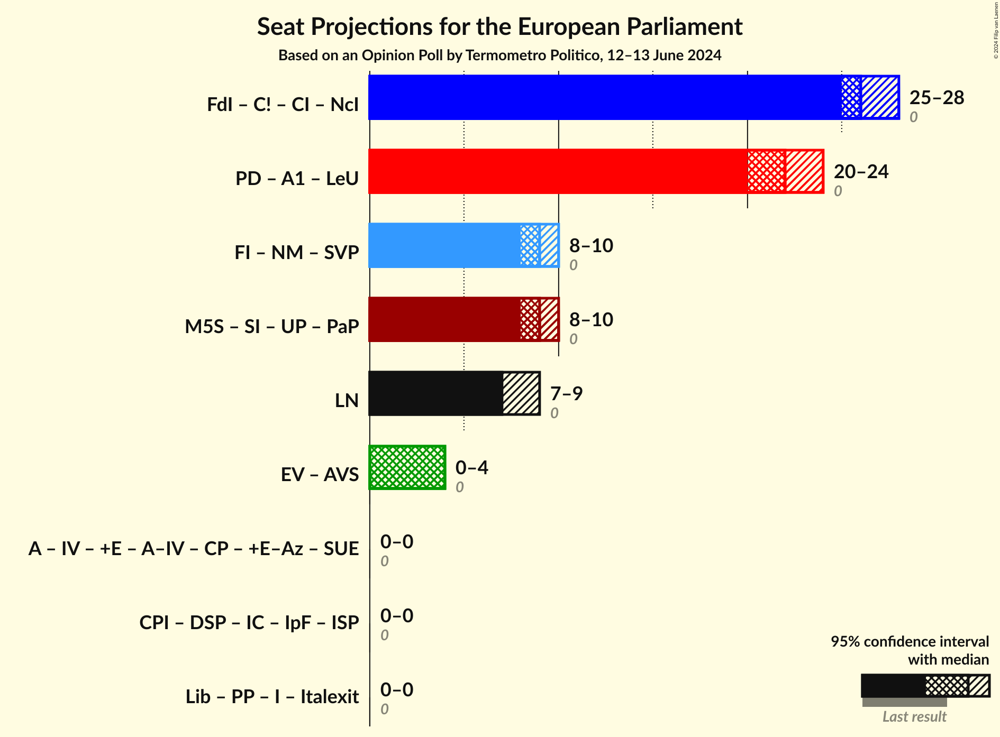

### Confidence Intervals

| Coalition | Last Result | Median | Majority? | 80% Confidence Interval | 90% Confidence Interval | 95% Confidence Interval | 99% Confidence Interval |
|:---------:|:-----------:|:------:|:---------:|:-----------------------:|:-----------------------:|:-----------------------:|:-----------------------:|
| Lega Nord (PfE) | 0 | 7 | 0% | 7–8 | 7–8 | 7–9 | 7–9 |

### Lega Nord (PfE)

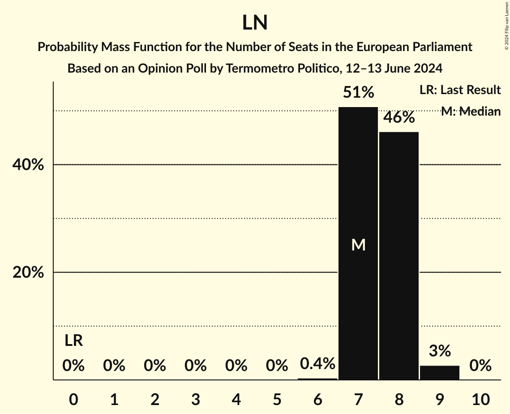

| Number of Seats | Probability | Accumulated | Special Marks |
|:---------------:|:-----------:|:-----------:|:-------------:|
| 0 | 0% | 100% | Last Result |
| 1 | 0% | 100% |  |
| 2 | 0% | 100% |  |
| 3 | 0% | 100% |  |
| 4 | 0% | 100% |  |
| 5 | 0% | 100% |  |
| 6 | 0.4% | 100% |  |
| 7 | 51% | 99.6% | Median |
| 8 | 46% | 49% |  |
| 9 | 3% | 3% |  |
| 10 | 0% | 0% |  |

## Technical Information

### Opinion Poll

+ **Polling firm:** Termometro Politico
+ **Commissioner(s):** —
+ **Fieldwork period:** 12–13 June 2024

### Calculations

+ **Sample size:** 3500
+ **Simulations done:** 1,048,576
+ **Error estimate:** 1.07%

