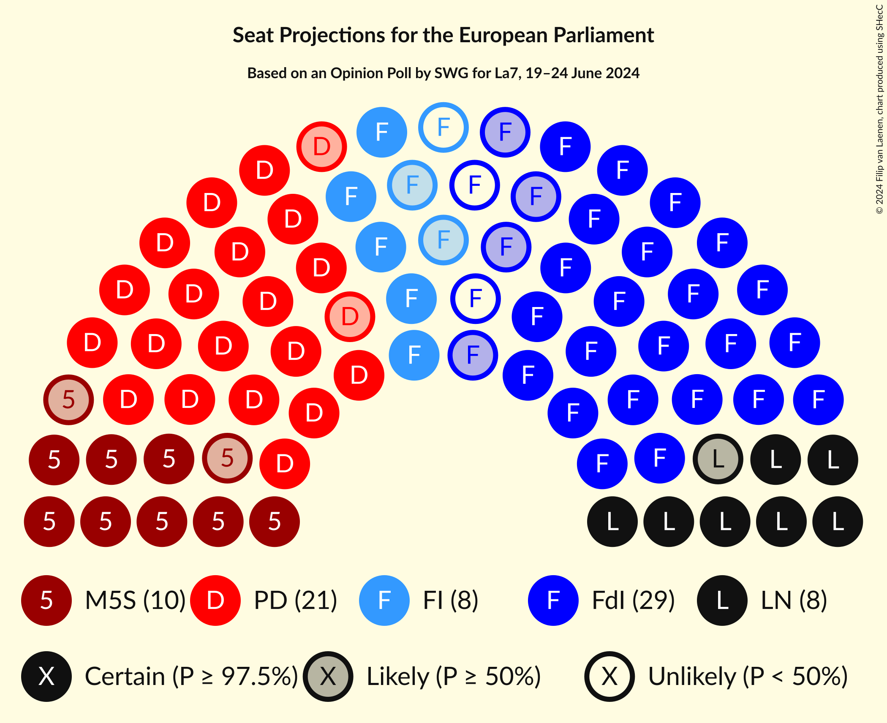

# Opinion Poll by SWG for La7, 19–24 June 2024

<a href="#voting-intentions">Voting Intentions</a> | <a href="#seats">Seats</a> | <a href="#coalitions">Coalitions</a> | <a href="#technical-information">Technical Information</a>

## Voting Intentions

### Confidence Intervals

| Party | Last Result | Poll Result | 80% Confidence Interval | 90% Confidence Interval | 95% Confidence Interval | 99% Confidence Interval |
|:-----:|:-----------:|:-----------:|:-----------------------:|:-----------------------:|:-----------------------:|:-----------------------:|
| Fratelli d’Italia (ECR) | 0.0% | 29.4% | 27.8–31.2% |27.3–31.7% |26.9–32.1% |26.1–32.9% |
| Partito Democratico (S&D) | 0.0% | 23.8% | 22.3–25.5% |21.9–26.0% |21.5–26.4% |20.8–27.2% |
| Movimento 5 Stelle (GUE/NGL) | 0.0% | 10.1% | 9.1–11.4% |8.8–11.7% |8.6–12.0% |8.1–12.6% |
| Lega Nord (PfE) | 0.0% | 9.0% | 8.0–10.1% |7.7–10.4% |7.5–10.7% |7.0–11.3% |
| Forza Italia (EPP) | 0.0% | 8.8% | 7.8–9.9% |7.5–10.3% |7.3–10.5% |6.9–11.1% |
| Europa Verde (Greens/EFA) | 0.0% | 4.0% | 3.3–4.8% |3.2–5.0% |3.0–5.3% |2.7–5.7% |
| Azione (RE) | 0.0% | 3.5% | 2.9–4.3% |2.7–4.5% |2.6–4.7% |2.3–5.1% |
| Sinistra Italiana (GUE/NGL) | 0.0% | 2.6% | 2.1–3.3% |2.0–3.5% |1.8–3.7% |1.6–4.1% |
| Più Europa (RE) | 0.0% | 2.2% | 1.7–2.9% |1.6–3.0% |1.5–3.2% |1.3–3.6% |
| Pace Terra Dignità (GUE/NGL) | 0.0% | 2.0% | 1.6–2.7% |1.5–2.9% |1.4–3.0% |1.2–3.3% |
| Italia Viva (RE) | 0.0% | 1.7% | 1.3–2.3% |1.2–2.5% |1.1–2.6% |0.9–2.9% |
| Partito Progressista (*) | 0.0% | 0.7% | 0.5–1.1% |0.4–1.2% |0.3–1.3% |0.3–1.6% |

*Note:* The poll result column reflects the actual value used in the calculations. Published results may vary slightly, and in addition be rounded to fewer digits.

## Seats

### Confidence Intervals

| Party | Last Result | Median | 80% Confidence Interval | 90% Confidence Interval | 95% Confidence Interval | 99% Confidence Interval |
|:-----:|:-----------:|:------:|:-----------------------:|:-----------------------:|:-----------------------:|:-----------------------:|
| <a href="#fratelli-d’italia-(ecr)">Fratelli d’Italia (ECR)</a> | 0 | 27 | 25–29 |24–29 |23–29 |23–31 |
| <a href="#partito-democratico-(s&d)">Partito Democratico (S&D)</a> | 0 | 21 | 20–24 |19–24 |19–25 |18–26 |
| <a href="#movimento-5-stelle-(gue/ngl)">Movimento 5 Stelle (GUE/NGL)</a> | 0 | 10 | 8–11 |8–11 |8–11 |7–12 |
| <a href="#lega-nord-(pfe)">Lega Nord (PfE)</a> | 0 | 8 | 7–9 |7–9 |7–9 |6–11 |
| <a href="#forza-italia-(epp)">Forza Italia (EPP)</a> | 0 | 7 | 6–8 |5–8 |5–8 |5–9 |
| <a href="#europa-verde-(greens/efa)">Europa Verde (Greens/EFA)</a> | 0 | 0 | 0–4 |0–5 |0–5 |0–5 |
| <a href="#azione-(re)">Azione (RE)</a> | 0 | 0 | 0–4 |0–4 |0–4 |0–5 |
| <a href="#sinistra-italiana-(gue/ngl)">Sinistra Italiana (GUE/NGL)</a> | 0 | 0 | 0 |0 |0 |0–4 |
| <a href="#più-europa-(re)">Più Europa (RE)</a> | 0 | 0 | 0 |0 |0 |0 |
| <a href="#pace-terra-dignità-(gue/ngl)">Pace Terra Dignità (GUE/NGL)</a> | 0 | 0 | 0 |0 |0 |0 |
| <a href="#italia-viva-(re)">Italia Viva (RE)</a> | 0 | 0 | 0 |0 |0 |0 |
| <a href="#partito-progressista-(*)">Partito Progressista (*)</a> | 0 | 0 | 0 |0 |0 |0 |

### Fratelli d’Italia (ECR)

*For a full overview of the results for this party, see the [Fratelli d’Italia (ECR)](party-fratellid’italiaecr.html) page.*

| Number of Seats | Probability | Accumulated | Special Marks |
|:---------------:|:-----------:|:-----------:|:-------------:|
| 0 | 0% | 100% | Last Result |
| 1 | 0% | 100% |  |
| 2 | 0% | 100% |  |
| 3 | 0% | 100% |  |
| 4 | 0% | 100% |  |
| 5 | 0% | 100% |  |
| 6 | 0% | 100% |  |
| 7 | 0% | 100% |  |
| 8 | 0% | 100% |  |
| 9 | 0% | 100% |  |
| 10 | 0% | 100% |  |
| 11 | 0% | 100% |  |
| 12 | 0% | 100% |  |
| 13 | 0% | 100% |  |
| 14 | 0% | 100% |  |
| 15 | 0% | 100% |  |
| 16 | 0% | 100% |  |
| 17 | 0% | 100% |  |
| 18 | 0% | 100% |  |
| 19 | 0% | 100% |  |
| 20 | 0% | 100% |  |
| 21 | 0% | 100% |  |
| 22 | 0.3% | 100% |  |
| 23 | 4% | 99.7% |  |
| 24 | 3% | 96% |  |
| 25 | 14% | 93% |  |
| 26 | 24% | 79% |  |
| 27 | 19% | 55% | Median |
| 28 | 8% | 36% |  |
| 29 | 27% | 28% |  |
| 30 | 0.8% | 1.3% |  |
| 31 | 0.5% | 0.6% |  |
| 32 | 0% | 0% |  |

### Partito Democratico (S&D)

*For a full overview of the results for this party, see the [Partito Democratico (S&D)](party-partitodemocraticosd.html) page.*

| Number of Seats | Probability | Accumulated | Special Marks |
|:---------------:|:-----------:|:-----------:|:-------------:|
| 0 | 0% | 100% | Last Result |
| 1 | 0% | 100% |  |
| 2 | 0% | 100% |  |
| 3 | 0% | 100% |  |
| 4 | 0% | 100% |  |
| 5 | 0% | 100% |  |
| 6 | 0% | 100% |  |
| 7 | 0% | 100% |  |
| 8 | 0% | 100% |  |
| 9 | 0% | 100% |  |
| 10 | 0% | 100% |  |
| 11 | 0% | 100% |  |
| 12 | 0% | 100% |  |
| 13 | 0% | 100% |  |
| 14 | 0% | 100% |  |
| 15 | 0% | 100% |  |
| 16 | 0% | 100% |  |
| 17 | 0% | 100% |  |
| 18 | 1.3% | 100% |  |
| 19 | 4% | 98.6% |  |
| 20 | 11% | 94% |  |
| 21 | 38% | 84% | Median |
| 22 | 29% | 46% |  |
| 23 | 6% | 17% |  |
| 24 | 9% | 11% |  |
| 25 | 1.5% | 3% |  |
| 26 | 1.1% | 1.1% |  |
| 27 | 0% | 0% |  |

### Movimento 5 Stelle (GUE/NGL)

*For a full overview of the results for this party, see the [Movimento 5 Stelle (GUE/NGL)](party-movimento5stelleguengl.html) page.*

| Number of Seats | Probability | Accumulated | Special Marks |
|:---------------:|:-----------:|:-----------:|:-------------:|
| 0 | 0% | 100% | Last Result |
| 1 | 0% | 100% |  |
| 2 | 0% | 100% |  |
| 3 | 0% | 100% |  |
| 4 | 0% | 100% |  |
| 5 | 0% | 100% |  |
| 6 | 0% | 100% |  |
| 7 | 2% | 100% |  |
| 8 | 13% | 98% |  |
| 9 | 22% | 85% |  |
| 10 | 39% | 63% | Median |
| 11 | 23% | 24% |  |
| 12 | 0.9% | 0.9% |  |
| 13 | 0% | 0% |  |

### Lega Nord (PfE)

*For a full overview of the results for this party, see the [Lega Nord (PfE)](party-leganordpfe.html) page.*

| Number of Seats | Probability | Accumulated | Special Marks |
|:---------------:|:-----------:|:-----------:|:-------------:|
| 0 | 0% | 100% | Last Result |
| 1 | 0% | 100% |  |
| 2 | 0% | 100% |  |
| 3 | 0% | 100% |  |
| 4 | 0% | 100% |  |
| 5 | 0% | 100% |  |
| 6 | 2% | 100% |  |
| 7 | 40% | 98% |  |
| 8 | 32% | 58% | Median |
| 9 | 24% | 26% |  |
| 10 | 2% | 2% |  |
| 11 | 0.5% | 0.5% |  |
| 12 | 0% | 0% |  |

### Forza Italia (EPP)

*For a full overview of the results for this party, see the [Forza Italia (EPP)](party-forzaitaliaepp.html) page.*

| Number of Seats | Probability | Accumulated | Special Marks |
|:---------------:|:-----------:|:-----------:|:-------------:|
| 0 | 0% | 100% | Last Result |
| 1 | 0% | 100% |  |
| 2 | 0% | 100% |  |
| 3 | 0% | 100% |  |
| 4 | 0% | 100% |  |
| 5 | 6% | 100% |  |
| 6 | 15% | 94% |  |
| 7 | 35% | 78% | Median |
| 8 | 41% | 43% |  |
| 9 | 1.3% | 2% |  |
| 10 | 0.3% | 0.3% |  |
| 11 | 0% | 0% |  |

### Europa Verde (Greens/EFA)

*For a full overview of the results for this party, see the [Europa Verde (Greens/EFA)](party-europaverdegreensefa.html) page.*

| Number of Seats | Probability | Accumulated | Special Marks |
|:---------------:|:-----------:|:-----------:|:-------------:|
| 0 | 70% | 100% | Last Result, Median |
| 1 | 0% | 30% |  |
| 2 | 0% | 30% |  |
| 3 | 4% | 30% |  |
| 4 | 18% | 26% |  |
| 5 | 8% | 8% |  |
| 6 | 0.1% | 0.1% |  |
| 7 | 0% | 0% |  |

### Azione (RE)

*For a full overview of the results for this party, see the [Azione (RE)](party-azionere.html) page.*

| Number of Seats | Probability | Accumulated | Special Marks |
|:---------------:|:-----------:|:-----------:|:-------------:|
| 0 | 85% | 100% | Last Result, Median |
| 1 | 0% | 15% |  |
| 2 | 0% | 15% |  |
| 3 | 1.5% | 15% |  |
| 4 | 13% | 13% |  |
| 5 | 0.8% | 0.8% |  |
| 6 | 0% | 0% |  |

### Sinistra Italiana (GUE/NGL)

*For a full overview of the results for this party, see the [Sinistra Italiana (GUE/NGL)](party-sinistraitalianaguengl.html) page.*

| Number of Seats | Probability | Accumulated | Special Marks |
|:---------------:|:-----------:|:-----------:|:-------------:|
| 0 | 99.4% | 100% | Last Result, Median |
| 1 | 0% | 0.6% |  |
| 2 | 0% | 0.6% |  |
| 3 | 0.1% | 0.6% |  |
| 4 | 0.5% | 0.5% |  |
| 5 | 0% | 0% |  |

### Più Europa (RE)

*For a full overview of the results for this party, see the [Più Europa (RE)](party-piùeuropare.html) page.*

| Number of Seats | Probability | Accumulated | Special Marks |
|:---------------:|:-----------:|:-----------:|:-------------:|
| 0 | 99.9% | 100% | Last Result, Median |
| 1 | 0% | 0.1% |  |
| 2 | 0% | 0.1% |  |
| 3 | 0% | 0.1% |  |
| 4 | 0% | 0% |  |

### Pace Terra Dignità (GUE/NGL)

*For a full overview of the results for this party, see the [Pace Terra Dignità (GUE/NGL)](party-paceterradignitàguengl.html) page.*

| Number of Seats | Probability | Accumulated | Special Marks |
|:---------------:|:-----------:|:-----------:|:-------------:|
| 0 | 100% | 100% | Last Result, Median |

### Italia Viva (RE)

*For a full overview of the results for this party, see the [Italia Viva (RE)](party-italiavivare.html) page.*

| Number of Seats | Probability | Accumulated | Special Marks |
|:---------------:|:-----------:|:-----------:|:-------------:|
| 0 | 100% | 100% | Last Result, Median |

### Partito Progressista (*)

*For a full overview of the results for this party, see the [Partito Progressista (*)](party-partitoprogressista.html) page.*

| Number of Seats | Probability | Accumulated | Special Marks |
|:---------------:|:-----------:|:-----------:|:-------------:|
| 0 | 100% | 100% | Last Result, Median |

## Coalitions

### Confidence Intervals

| Coalition | Last Result | Median | Majority? | 80% Confidence Interval | 90% Confidence Interval | 95% Confidence Interval | 99% Confidence Interval |
|:---------:|:-----------:|:------:|:---------:|:-----------------------:|:-----------------------:|:-----------------------:|:-----------------------:|
| Lega Nord (PfE) | 0 | 8 | 0% | 7–9 | 7–9 | 7–9 | 6–11 |

### Lega Nord (PfE)

| Number of Seats | Probability | Accumulated | Special Marks |
|:---------------:|:-----------:|:-----------:|:-------------:|
| 0 | 0% | 100% | Last Result |
| 1 | 0% | 100% |  |
| 2 | 0% | 100% |  |
| 3 | 0% | 100% |  |
| 4 | 0% | 100% |  |
| 5 | 0% | 100% |  |
| 6 | 2% | 100% |  |
| 7 | 40% | 98% |  |
| 8 | 32% | 58% | Median |
| 9 | 24% | 26% |  |
| 10 | 2% | 2% |  |
| 11 | 0.5% | 0.5% |  |
| 12 | 0% | 0% |  |

## Technical Information

### Opinion Poll

+ **Polling firm:** SWG
+ **Commissioner(s):** La7
+ **Fieldwork period:** 19–24 June 2024

### Calculations

+ **Sample size:** 1183
+ **Simulations done:** 1,048,576
+ **Error estimate:** 3.83%

