# Poll Average

<a href="#voting-intentions">Voting Intentions</a> | <a href="#seats">Seats</a> | <a href="#coalitions">Coalitions</a> | <a href="#technical-information">Technical Information</a>

## Summary

The table below lists the polls on which the average is based. They are the most recent polls (less than 90 days old) registered and analyzed so far.

| Period     | Polling firm/Commissioner(s) | PD | M5S | FI | LN | FdI | SVP | CPI | CP | I | NcI | +E | LeU | PaP | A | EV | C! | IV | CI | A1 | SI | +E–Az |
|:----------:|:----------------------------:|:--:|:--:|:--:|:--:|:--:|:--:|:--:|:--:|:--:|:--:|:--:|:--:|:--:|:--:|:--:|:--:|:--:|:--:|:--:|:--:|:--:|
| 26 May 2019 | General Election | 40.8%   31 | 21.2%   17 | 16.8%   13 | 6.2%   5 | 3.7%   0 | 0.5%   1 | 0.0%   0 | 0.0%   0 | 0.0%   0 | 0.0%   0 | 0.0%   0 | 0.0%   0 | 0.0%   0 | 0.0%   0 | 0.0%   0 | 0.0%   0 | 0.0%   0 | 0.0%   0 | 0.0%   0 | 0.0%   0 | 0.0%   0 |
| N/A | Poll Average | 19–24%   14–20 | 11–18%   9–15 | 6–11%   5–9 | 14–20%   12–17 | 17–23%   14–20 | N/A   N/A | N/A   N/A | N/A   N/A | N/A   N/A | N/A   N/A | 2–4%   0–4 | N/A   N/A | N/A   N/A | 2–6%   0–5 | 1–4%   0 | N/A   N/A | 2–4%   0–4 | N/A   N/A | 1–3%   0 | 1–4%   0 | 3–6%   0–5 |
| [23–28 February 2022](2022-02-28-SWG.html) | SWG   La7 | 19–23%   15–19 | 11–15%   9–13 | 6–9%   5–8 | 15–19%   13–16 | 19–24%   16–20 | N/A   N/A | N/A   N/A | N/A   N/A | N/A   N/A | N/A   N/A | N/A   N/A | N/A   N/A | N/A   N/A | N/A   N/A | 2–4%   0 | N/A   N/A | 2–4%   0 | N/A   N/A | 1–3%   0 | 1–3%   0 | 4–6%   0–5 |
| [25 February 2022](2022-02-25-Tecnè.html) | Tecnè   Agenzia Dire | 20–25%   15–19 | 11–15%   9–12 | 9–12%   7–10 | 14–19%   12–15 | 19–24%   16–20 | N/A   N/A | N/A   N/A | N/A   N/A | N/A   N/A | N/A   N/A | N/A   N/A | N/A   N/A | N/A   N/A | N/A   N/A | 1–3%   0 | N/A   N/A | 2–4%   0 | N/A   N/A | N/A   N/A | 1–3%   0 | 3–6%   0–5 |
| [22–24 February 2022](2022-02-24-TermometroPolitico.html) | Termometro Politico | 19–22%   15–18 | 13–15%   10–13 | 7–9%   6–7 | 18–20%   14–17 | 20–23%   17–19 | N/A   N/A | N/A   N/A | N/A   N/A | N/A   N/A | N/A   N/A | N/A   N/A | N/A   N/A | N/A   N/A | N/A   N/A | 1–2%   0 | N/A   N/A | 2–3%   0 | N/A   N/A | N/A   N/A | 3–4%   0 | 4–5%   0–4 |
| [22–24 February 2022](2022-02-24-Ipsos.html) | Ipsos   Corriere della Sera | 19–24%   15–19 | 13–18%   11–15 | 7–11%   6–9 | 16–21%   13–18 | 17–22%   14–19 | N/A   N/A | N/A   N/A | N/A   N/A | N/A   N/A | N/A   N/A | N/A   N/A | N/A   N/A | N/A   N/A | N/A   N/A | 1–3%   0 | N/A   N/A | 1–3%   0 | N/A   N/A | 1–2%   0 | 1–3%   0 | 2–5%   0–4 |
| [22–23 February 2022](2022-02-23-Demopolis.html) | Demopolis   La7 | 20–24%   14–18 | 12–15%   9–12 | 6–9%   5–7 | 16–20%   12–15 | 19–23%   15–18 | N/A   N/A | N/A   N/A | N/A   N/A | N/A   N/A | N/A   N/A | N/A   N/A | N/A   N/A | N/A   N/A | N/A   N/A | N/A   N/A | N/A   N/A | N/A   N/A | N/A   N/A | N/A   N/A | N/A   N/A | 3–5%   0–4 |
| [21 February 2022](2022-02-21-EMG.html) | EMG   Rai 3 | 19–24%   15–19 | 12–16%   10–13 | 7–10%   6–8 | 16–20%   14–17 | 18–22%   15–19 | N/A   N/A | N/A   N/A | N/A   N/A | N/A   N/A | N/A   N/A | N/A   N/A | N/A   N/A | N/A   N/A | N/A   N/A | 2–4%   0 | N/A   N/A | 3–5%   0–4 | N/A   N/A | 1–2%   0 | 2–4%   0 | 3–5%   0–4 |
| [16–18 February 2022](2022-02-18-Ixè.html) | Ixè | 21–26%   16–21 | 13–18%   11–15 | 8–11%   6–9 | 14–19%   12–16 | 16–20%   13–17 | N/A   N/A | N/A   N/A | N/A   N/A | N/A   N/A | N/A   N/A | N/A   N/A | N/A   N/A | N/A   N/A | N/A   N/A | 1–3%   0 | N/A   N/A | 1–3%   0 | N/A   N/A | 1–3%   0 | 1–3%   0 | 4–7%   0–5 |
| [16 February 2022](2022-02-16-Euromedia.html) | Euromedia   Rai 1 | 19–24%   15–19 | 12–16%   10–14 | 7–10%   6–9 | 15–19%   12–16 | 19–24%   16–20 | N/A   N/A | N/A   N/A | N/A   N/A | N/A   N/A | N/A   N/A | N/A   N/A | N/A   N/A | N/A   N/A | N/A   N/A | 2–4%   0–4 | N/A   N/A | 2–3%   0 | N/A   N/A | 1–3%   0 | 1–3%   0 | 4–6%   0–5 |
| [15 February 2022](2022-02-15-Piepoli.html) | Piepoli   RaiNews24 | 18–25%   14–20 | 12–18%   10–15 | 6–11%   5–9 | 15–22%   13–19 | 16–23%   14–20 | N/A   N/A | N/A   N/A | N/A   N/A | N/A   N/A | N/A   N/A | 2–4%   0–4 | N/A   N/A | N/A   N/A | 2–6%   0–5 | 1–3%   0 | N/A   N/A | 2–4%   0–4 | N/A   N/A | 1–3%   0 | 1–3%   0 | N/A   N/A |
| [7–12 February 2022](2022-02-12-BiDiMedia.html) | BiDiMedia | 20–23%   16–18 | 12–14%   10–12 | 6–8%   5–7 | 16–19%   14–16 | 18–21%   15–17 | N/A   N/A | N/A   N/A | N/A   N/A | N/A   N/A | N/A   N/A | N/A   N/A | N/A   N/A | N/A   N/A | N/A   N/A | 2–3%   0 | N/A   N/A | 2–3%   0 | N/A   N/A | 1–2%   0 | 2–3%   0 | 4–6%   4–5 |
| [8–10 February 2022](2022-02-10-Quorum–YouTrend.html) | Quorum – YouTrend   Sky TG24 | 18–24%   15–19 | 14–19%   12–16 | 7–10%   5–9 | 13–18%   11–16 | 17–23%   15–20 | N/A   N/A | N/A   N/A | N/A   N/A | N/A   N/A | N/A   N/A | N/A   N/A | N/A   N/A | N/A   N/A | N/A   N/A | 1–4%   0 | N/A   N/A | 1–4%   0 | N/A   N/A | 2–4%   0 | 2–4%   0 | 3–5%   0–4 |
| [9–10 February 2022](2022-02-10-NotoSondaggi.html) | Noto Sondaggi   Rai 1 | 18–23%   14–19 | 11–15%   9–12 | 6–10%   5–8 | 16–21%   13–17 | 18–23%   14–19 | N/A   N/A | N/A   N/A | N/A   N/A | N/A   N/A | N/A   N/A | N/A   N/A | N/A   N/A | N/A   N/A | N/A   N/A | 1–2%   0 | N/A   N/A | 2–4%   0–3 | N/A   N/A | 1–2%   0 | 1–2%   0 | 2–4%   0–4 |
| [2 February 2022](2022-02-02-Index.html) | Index   La7 | 19–25%   15–20 | 11–16%   9–13 | 6–10%   5–8 | 14–20%   12–17 | 18–24%   15–20 | N/A   N/A | N/A   N/A | N/A   N/A | N/A   N/A | N/A   N/A | N/A   N/A | N/A   N/A | N/A   N/A | N/A   N/A | 2–4%   0 | N/A   N/A | 2–4%   0–4 | N/A   N/A | 1–4%   0 | 2–4%   0–3 | 4–7%   0–6 |
| [31 January–1 February 2022](2022-02-01-DemosPi.html) | Demos & Pi   La Repubblica | 18–23%   14–18 | 14–18%   11–15 | 6–9%   5–8 | 15–20%   12–16 | 18–23%   15–19 | N/A   N/A | N/A   N/A | N/A   N/A | N/A   N/A | N/A   N/A | N/A   N/A | N/A   N/A | N/A   N/A | N/A   N/A | 1–3%   0 | N/A   N/A | 2–4%   0 | N/A   N/A | N/A   N/A | 1–3%   0 | 3–6%   0–5 |
| 26 May 2019 | General Election | 40.8%   31 | 21.2%   17 | 16.8%   13 | 6.2%   5 | 3.7%   0 | 0.5%   1 | 0.0%   0 | 0.0%   0 | 0.0%   0 | 0.0%   0 | 0.0%   0 | 0.0%   0 | 0.0%   0 | 0.0%   0 | 0.0%   0 | 0.0%   0 | 0.0%   0 | 0.0%   0 | 0.0%   0 | 0.0%   0 | 0.0%   0 |

Only polls for which at least the sample size has been published are included in the table above.

**Legend:**
+ **Top half of each row:** Voting intentions (95% confidence interval)
+ **Bottom half of each row:** Seat projections for the European Parliament (95% confidence interval)
+ **PD:** Partito Democratico (S&D)
+ **M5S:** Movimento 5 Stelle (NI)
+ **FI:** Forza Italia (EPP)
+ **LN:** Lega Nord (ID)
+ **FdI:** Fratelli d’Italia (ECR)
+ **SVP:** Südtiroler Volkspartei (EPP)
+ **CPI:** CasaPound Italia (NI)
+ **CP:** Civica Popolare (RE)
+ **I:** Insieme (*)
+ **NcI:** Noi con l’Italia (ECR)
+ **+E:** Più Europa (RE)
+ **LeU:** Liberi e Uguali (S&D)
+ **PaP:** Potere al Popolo (GUE/NGL)
+ **A:** Azione (RE)
+ **EV:** Europa Verde (Greens/EFA)
+ **C!:** Cambiamo! (ECR)
+ **IV:** Italia Viva (RE)
+ **CI:** Coraggio Italia (ECR)
+ **A1:** Articolo Uno (S&D)
+ **SI:** Sinistra Italiana (GUE/NGL)
+ **+E–Az:** Più Europa–Azione (RE)
+ **N/A (single party):** Party not included the published results
+ **N/A (entire row):** Calculation for this opinion poll not started yet

## Voting Intentions

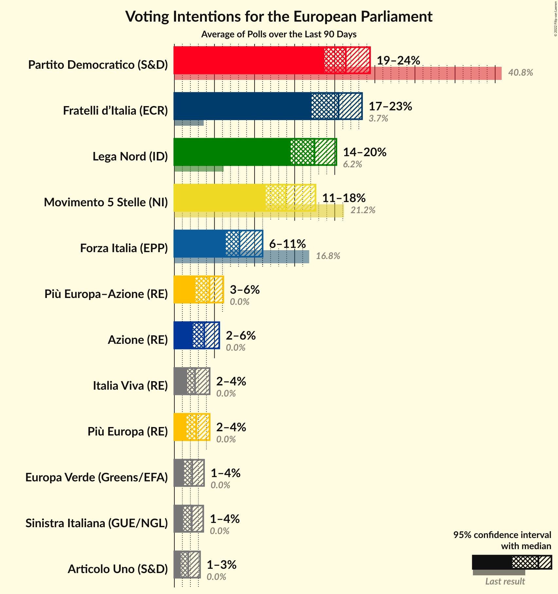

### Confidence Intervals

| Party | Last Result | Median | 80% Confidence Interval | 90% Confidence Interval | 95% Confidence Interval | 99% Confidence Interval |
|:-----:|:-----------:|:------:|:-----------------------:|:-----------------------:|:-----------------------:|:-----------------------:|
| <a href="#partito-democratico-(s&d)">Partito Democratico (S&D)</a> | 40.8% | 21.4% | 19.7–23.2% |19.2–23.8% | 18.7–24.4% | 17.8–25.5% |
| <a href="#movimento-5-stelle-(ni)">Movimento 5 Stelle (NI)</a> | 21.2% | 13.9% | 12.2–16.4% |11.8–17.0% | 11.4–17.6% | 10.6–18.6% |
| <a href="#forza-italia-(epp)">Forza Italia (EPP)</a> | 16.8% | 8.1% | 6.9–9.9% |6.6–10.5% | 6.4–11.0% | 5.9–12.0% |
| <a href="#lega-nord-(id)">Lega Nord (ID)</a> | 6.2% | 17.5% | 15.6–19.3% |15.0–19.8% | 14.5–20.2% | 13.6–21.5% |
| <a href="#fratelli-d’italia-(ecr)">Fratelli d’Italia (ECR)</a> | 3.7% | 20.5% | 18.3–22.4% |17.7–22.9% | 17.1–23.4% | 16.0–24.3% |
| <a href="#südtiroler-volkspartei-(epp)">Südtiroler Volkspartei (EPP)</a> | 0.5% | N/A | N/A |N/A | N/A | N/A |
| <a href="#casapound-italia-(ni)">CasaPound Italia (NI)</a> | 0.0% | N/A | N/A |N/A | N/A | N/A |
| <a href="#civica-popolare-(re)">Civica Popolare (RE)</a> | 0.0% | N/A | N/A |N/A | N/A | N/A |
| <a href="#insieme-(*)">Insieme (*)</a> | 0.0% | N/A | N/A |N/A | N/A | N/A |
| <a href="#noi-con-l’italia-(ecr)">Noi con l’Italia (ECR)</a> | 0.0% | N/A | N/A |N/A | N/A | N/A |
| <a href="#più-europa-(re)">Più Europa (RE)</a> | 0.0% | 2.7% | 1.9–3.8% |1.7–4.1% | 1.5–4.4% | 1.3–5.0% |
| <a href="#liberi-e-uguali-(s&d)">Liberi e Uguali (S&D)</a> | 0.0% | N/A | N/A |N/A | N/A | N/A |
| <a href="#potere-al-popolo-(gue/ngl)">Potere al Popolo (GUE/NGL)</a> | 0.0% | N/A | N/A |N/A | N/A | N/A |
| <a href="#azione-(re)">Azione (RE)</a> | 0.0% | 3.7% | 2.7–4.9% |2.5–5.3% | 2.3–5.6% | 1.9–6.3% |
| <a href="#europa-verde-(greens/efa)">Europa Verde (Greens/EFA)</a> | 0.0% | 2.2% | 1.5–3.1% |1.3–3.4% | 1.2–3.7% | 0.9–4.2% |
| <a href="#cambiamo!-(ecr)">Cambiamo! (ECR)</a> | 0.0% | N/A | N/A |N/A | N/A | N/A |
| <a href="#italia-viva-(re)">Italia Viva (RE)</a> | 0.0% | 2.6% | 1.9–3.7% |1.7–4.1% | 1.6–4.4% | 1.3–5.0% |
| <a href="#coraggio-italia-(ecr)">Coraggio Italia (ECR)</a> | 0.0% | N/A | N/A |N/A | N/A | N/A |
| <a href="#articolo-uno-(s&d)">Articolo Uno (S&D)</a> | 0.0% | 1.7% | 1.0–2.7% |0.9–2.9% | 0.8–3.2% | 0.6–3.7% |
| <a href="#sinistra-italiana-(gue/ngl)">Sinistra Italiana (GUE/NGL)</a> | 0.0% | 2.2% | 1.5–3.1% |1.3–3.4% | 1.1–3.6% | 0.9–4.0% |
| <a href="#più-europa–azione-(re)">Più Europa–Azione (RE)</a> | 0.0% | 4.4% | 3.2–5.5% |2.9–5.8% | 2.6–6.1% | 2.2–6.7% |

### Partito Democratico (S&D)

*For a full overview of the results for this party, see the [Partito Democratico (S&D)](party-partitodemocraticosd.html) page.*

| Voting Intentions | Probability | Accumulated | Special Marks |
|:-----------------:|:-----------:|:-----------:|:-------------:|
| 15.5–16.5% | 0% | 100% |  |
| 16.5–17.5% | 0.3% | 100% |  |
| 17.5–18.5% | 2% | 99.7% |  |
| 18.5–19.5% | 7% | 98% |  |
| 19.5–20.5% | 18% | 91% |  |
| 20.5–21.5% | 28% | 73% | Median |
| 21.5–22.5% | 25% | 44% |  |
| 22.5–23.5% | 13% | 20% |  |
| 23.5–24.5% | 5% | 7% |  |
| 24.5–25.5% | 2% | 2% |  |
| 25.5–26.5% | 0.4% | 0.5% |  |
| 26.5–27.5% | 0.1% | 0.1% |  |
| 27.5–28.5% | 0% | 0% |  |
| 28.5–29.5% | 0% | 0% |  |
| 29.5–30.5% | 0% | 0% |  |
| 30.5–31.5% | 0% | 0% |  |
| 31.5–32.5% | 0% | 0% |  |
| 32.5–33.5% | 0% | 0% |  |
| 33.5–34.5% | 0% | 0% |  |
| 34.5–35.5% | 0% | 0% |  |
| 35.5–36.5% | 0% | 0% |  |
| 36.5–37.5% | 0% | 0% |  |
| 37.5–38.5% | 0% | 0% |  |
| 38.5–39.5% | 0% | 0% |  |
| 39.5–40.5% | 0% | 0% |  |
| 40.5–41.5% | 0% | 0% | Last Result |

### Movimento 5 Stelle (NI)

*For a full overview of the results for this party, see the [Movimento 5 Stelle (NI)](party-movimento5stelleni.html) page.*

| Voting Intentions | Probability | Accumulated | Special Marks |
|:-----------------:|:-----------:|:-----------:|:-------------:|
| 8.5–9.5% | 0% | 100% |  |
| 9.5–10.5% | 0.4% | 100% |  |
| 10.5–11.5% | 3% | 99.6% |  |
| 11.5–12.5% | 12% | 96% |  |
| 12.5–13.5% | 26% | 85% |  |
| 13.5–14.5% | 24% | 59% | Median |
| 14.5–15.5% | 15% | 35% |  |
| 15.5–16.5% | 11% | 19% |  |
| 16.5–17.5% | 6% | 8% |  |
| 17.5–18.5% | 2% | 3% |  |
| 18.5–19.5% | 0.5% | 0.5% |  |
| 19.5–20.5% | 0.1% | 0.1% |  |
| 20.5–21.5% | 0% | 0% | Last Result |

### Forza Italia (EPP)

*For a full overview of the results for this party, see the [Forza Italia (EPP)](party-forzaitaliaepp.html) page.*

| Voting Intentions | Probability | Accumulated | Special Marks |
|:-----------------:|:-----------:|:-----------:|:-------------:|
| 3.5–4.5% | 0% | 100% |  |
| 4.5–5.5% | 0.1% | 100% |  |
| 5.5–6.5% | 4% | 99.9% |  |
| 6.5–7.5% | 25% | 96% |  |
| 7.5–8.5% | 35% | 72% | Median |
| 8.5–9.5% | 22% | 36% |  |
| 9.5–10.5% | 10% | 14% |  |
| 10.5–11.5% | 4% | 5% |  |
| 11.5–12.5% | 1.0% | 1.1% |  |
| 12.5–13.5% | 0.1% | 0.2% |  |
| 13.5–14.5% | 0% | 0% |  |
| 14.5–15.5% | 0% | 0% |  |
| 15.5–16.5% | 0% | 0% |  |
| 16.5–17.5% | 0% | 0% | Last Result |

### Lega Nord (ID)

*For a full overview of the results for this party, see the [Lega Nord (ID)](party-leganordid.html) page.*

| Voting Intentions | Probability | Accumulated | Special Marks |
|:-----------------:|:-----------:|:-----------:|:-------------:|
| 5.5–6.5% | 0% | 100% | Last Result |
| 6.5–7.5% | 0% | 100% |  |
| 7.5–8.5% | 0% | 100% |  |
| 8.5–9.5% | 0% | 100% |  |
| 9.5–10.5% | 0% | 100% |  |
| 10.5–11.5% | 0% | 100% |  |
| 11.5–12.5% | 0.1% | 100% |  |
| 12.5–13.5% | 0.4% | 99.9% |  |
| 13.5–14.5% | 2% | 99.5% |  |
| 14.5–15.5% | 7% | 97% |  |
| 15.5–16.5% | 16% | 90% |  |
| 16.5–17.5% | 26% | 74% | Median |
| 17.5–18.5% | 26% | 48% |  |
| 18.5–19.5% | 16% | 22% |  |
| 19.5–20.5% | 5% | 7% |  |
| 20.5–21.5% | 1.2% | 2% |  |
| 21.5–22.5% | 0.3% | 0.5% |  |
| 22.5–23.5% | 0.1% | 0.1% |  |
| 23.5–24.5% | 0% | 0% |  |

### Fratelli d’Italia (ECR)

*For a full overview of the results for this party, see the [Fratelli d’Italia (ECR)](party-fratellid’italiaecr.html) page.*

| Voting Intentions | Probability | Accumulated | Special Marks |
|:-----------------:|:-----------:|:-----------:|:-------------:|
| 3.5–4.5% | 0% | 100% | Last Result |
| 4.5–5.5% | 0% | 100% |  |
| 5.5–6.5% | 0% | 100% |  |
| 6.5–7.5% | 0% | 100% |  |
| 7.5–8.5% | 0% | 100% |  |
| 8.5–9.5% | 0% | 100% |  |
| 9.5–10.5% | 0% | 100% |  |
| 10.5–11.5% | 0% | 100% |  |
| 11.5–12.5% | 0% | 100% |  |
| 12.5–13.5% | 0% | 100% |  |
| 13.5–14.5% | 0% | 100% |  |
| 14.5–15.5% | 0.2% | 100% |  |
| 15.5–16.5% | 1.0% | 99.8% |  |
| 16.5–17.5% | 3% | 98.8% |  |
| 17.5–18.5% | 8% | 96% |  |
| 18.5–19.5% | 17% | 88% |  |
| 19.5–20.5% | 23% | 71% | Median |
| 20.5–21.5% | 23% | 48% |  |
| 21.5–22.5% | 16% | 25% |  |
| 22.5–23.5% | 6% | 8% |  |
| 23.5–24.5% | 2% | 2% |  |
| 24.5–25.5% | 0.3% | 0.3% |  |
| 25.5–26.5% | 0% | 0% |  |

### Europa Verde (Greens/EFA)

*For a full overview of the results for this party, see the [Europa Verde (Greens/EFA)](party-europaverdegreensefa.html) page.*

| Voting Intentions | Probability | Accumulated | Special Marks |
|:-----------------:|:-----------:|:-----------:|:-------------:|
| 0.0–0.5% | 0% | 100% | Last Result |
| 0.5–1.5% | 11% | 100% |  |
| 1.5–2.5% | 58% | 89% | Median |
| 2.5–3.5% | 27% | 31% |  |
| 3.5–4.5% | 3% | 4% |  |
| 4.5–5.5% | 0.1% | 0.1% |  |
| 5.5–6.5% | 0% | 0% |  |

### Italia Viva (RE)

*For a full overview of the results for this party, see the [Italia Viva (RE)](party-italiavivare.html) page.*

| Voting Intentions | Probability | Accumulated | Special Marks |
|:-----------------:|:-----------:|:-----------:|:-------------:|
| 0.0–0.5% | 0% | 100% | Last Result |
| 0.5–1.5% | 2% | 100% |  |
| 1.5–2.5% | 45% | 98% |  |
| 2.5–3.5% | 40% | 53% | Median |
| 3.5–4.5% | 11% | 13% |  |
| 4.5–5.5% | 2% | 2% |  |
| 5.5–6.5% | 0% | 0% |  |
| 6.5–7.5% | 0% | 0% |  |

### Articolo Uno (S&D)

*For a full overview of the results for this party, see the [Articolo Uno (S&D)](party-articolounosd.html) page.*

| Voting Intentions | Probability | Accumulated | Special Marks |
|:-----------------:|:-----------:|:-----------:|:-------------:|
| 0.0–0.5% | 0.3% | 100% | Last Result |
| 0.5–1.5% | 39% | 99.7% |  |
| 1.5–2.5% | 47% | 60% | Median |
| 2.5–3.5% | 13% | 14% |  |
| 3.5–4.5% | 0.7% | 0.7% |  |
| 4.5–5.5% | 0% | 0% |  |

### Sinistra Italiana (GUE/NGL)

*For a full overview of the results for this party, see the [Sinistra Italiana (GUE/NGL)](party-sinistraitalianaguengl.html) page.*

| Voting Intentions | Probability | Accumulated | Special Marks |
|:-----------------:|:-----------:|:-----------:|:-------------:|
| 0.0–0.5% | 0% | 100% | Last Result |
| 0.5–1.5% | 14% | 100% |  |
| 1.5–2.5% | 56% | 86% | Median |
| 2.5–3.5% | 27% | 30% |  |
| 3.5–4.5% | 3% | 3% |  |
| 4.5–5.5% | 0.1% | 0.1% |  |
| 5.5–6.5% | 0% | 0% |  |

### Più Europa–Azione (RE)

*For a full overview of the results for this party, see the [Più Europa–Azione (RE)](party-piùeuropa–azionere.html) page.*

| Voting Intentions | Probability | Accumulated | Special Marks |
|:-----------------:|:-----------:|:-----------:|:-------------:|
| 0.0–0.5% | 0% | 100% | Last Result |
| 0.5–1.5% | 0% | 100% |  |
| 1.5–2.5% | 2% | 100% |  |
| 2.5–3.5% | 16% | 98% |  |
| 3.5–4.5% | 40% | 82% | Median |
| 4.5–5.5% | 33% | 42% |  |
| 5.5–6.5% | 8% | 9% |  |
| 6.5–7.5% | 0.8% | 0.8% |  |
| 7.5–8.5% | 0% | 0% |  |

### Più Europa (RE)

*For a full overview of the results for this party, see the [Più Europa (RE)](party-piùeuropare.html) page.*

| Voting Intentions | Probability | Accumulated | Special Marks |
|:-----------------:|:-----------:|:-----------:|:-------------:|
| 0.0–0.5% | 0% | 100% | Last Result |
| 0.5–1.5% | 3% | 100% |  |
| 1.5–2.5% | 37% | 97% |  |
| 2.5–3.5% | 45% | 60% | Median |
| 3.5–4.5% | 13% | 15% |  |
| 4.5–5.5% | 2% | 2% |  |
| 5.5–6.5% | 0.1% | 0.1% |  |
| 6.5–7.5% | 0% | 0% |  |

### Azione (RE)

*For a full overview of the results for this party, see the [Azione (RE)](party-azionere.html) page.*

| Voting Intentions | Probability | Accumulated | Special Marks |
|:-----------------:|:-----------:|:-----------:|:-------------:|
| 0.0–0.5% | 0% | 100% | Last Result |
| 0.5–1.5% | 0% | 100% |  |
| 1.5–2.5% | 6% | 100% |  |
| 2.5–3.5% | 36% | 94% |  |
| 3.5–4.5% | 40% | 58% | Median |
| 4.5–5.5% | 15% | 18% |  |
| 5.5–6.5% | 3% | 3% |  |
| 6.5–7.5% | 0.3% | 0.3% |  |
| 7.5–8.5% | 0% | 0% |  |

## Seats

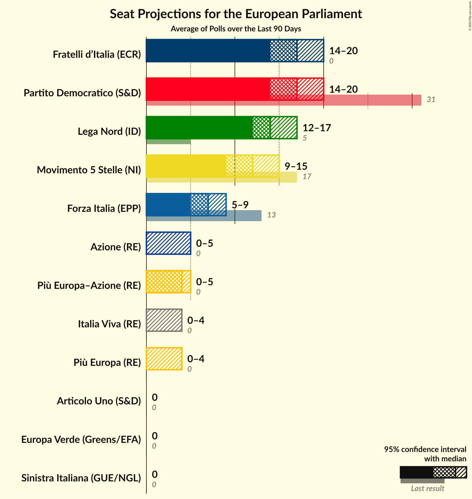

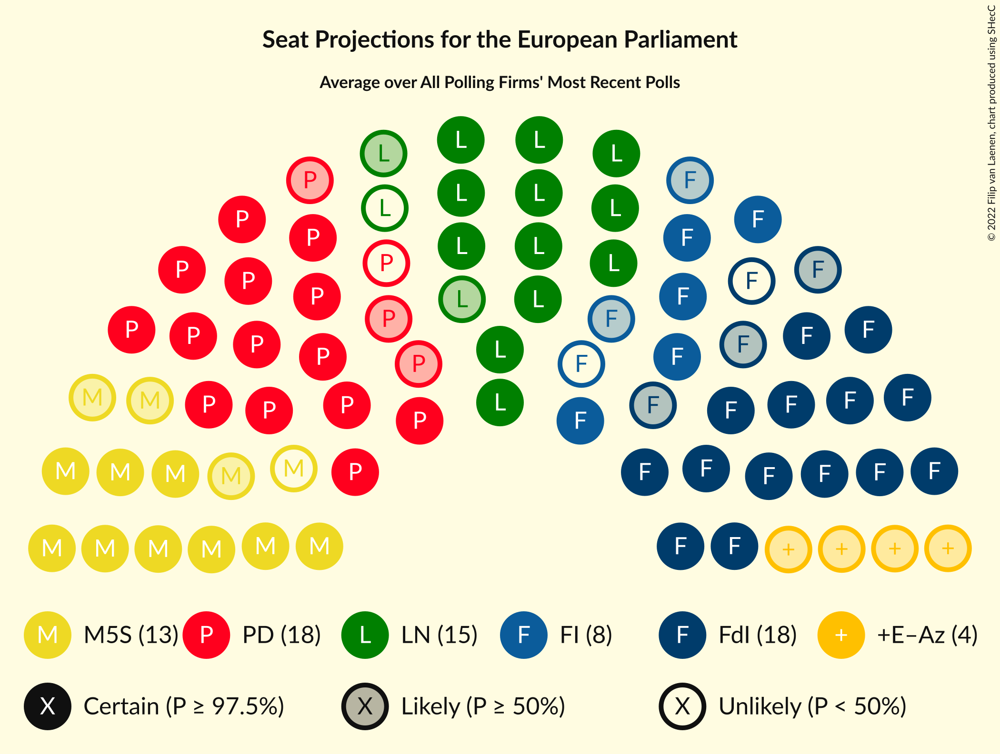

### Confidence Intervals

| Party | Last Result | Median | 80% Confidence Interval | 90% Confidence Interval | 95% Confidence Interval | 99% Confidence Interval |
|:-----:|:-----------:|:------:|:-----------------------:|:-----------------------:|:-----------------------:|:-----------------------:|
| <a href="#partito-democratico-(s&d)">Partito Democratico (S&D)</a> | 31 | 17 | 15–18 |15–19 | 14–20 | 14–21 |
| <a href="#movimento-5-stelle-(ni)">Movimento 5 Stelle (NI)</a> | 17 | 12 | 10–14 |10–14 | 9–15 | 9–16 |
| <a href="#forza-italia-(epp)">Forza Italia (EPP)</a> | 13 | 7 | 6–8 |5–9 | 5–9 | 5–10 |
| <a href="#lega-nord-(id)">Lega Nord (ID)</a> | 5 | 14 | 13–16 |12–17 | 12–17 | 11–18 |
| <a href="#fratelli-d’italia-(ecr)">Fratelli d’Italia (ECR)</a> | 0 | 17 | 15–19 |15–19 | 14–20 | 13–21 |
| <a href="#südtiroler-volkspartei-(epp)">Südtiroler Volkspartei (EPP)</a> | 1 | N/A | N/A |N/A | N/A | N/A |
| <a href="#casapound-italia-(ni)">CasaPound Italia (NI)</a> | 0 | N/A | N/A |N/A | N/A | N/A |
| <a href="#civica-popolare-(re)">Civica Popolare (RE)</a> | 0 | N/A | N/A |N/A | N/A | N/A |
| <a href="#insieme-(*)">Insieme (*)</a> | 0 | N/A | N/A |N/A | N/A | N/A |
| <a href="#noi-con-l’italia-(ecr)">Noi con l’Italia (ECR)</a> | 0 | N/A | N/A |N/A | N/A | N/A |
| <a href="#più-europa-(re)">Più Europa (RE)</a> | 0 | 0 | 0 |0 | 0–4 | 0–4 |
| <a href="#liberi-e-uguali-(s&d)">Liberi e Uguali (S&D)</a> | 0 | N/A | N/A |N/A | N/A | N/A |
| <a href="#potere-al-popolo-(gue/ngl)">Potere al Popolo (GUE/NGL)</a> | 0 | N/A | N/A |N/A | N/A | N/A |
| <a href="#azione-(re)">Azione (RE)</a> | 0 | 0 | 0–4 |0–4 | 0–5 | 0–5 |
| <a href="#europa-verde-(greens/efa)">Europa Verde (Greens/EFA)</a> | 0 | 0 | 0 |0 | 0 | 0–4 |
| <a href="#cambiamo!-(ecr)">Cambiamo! (ECR)</a> | 0 | N/A | N/A |N/A | N/A | N/A |
| <a href="#italia-viva-(re)">Italia Viva (RE)</a> | 0 | 0 | 0 |0–4 | 0–4 | 0–4 |
| <a href="#coraggio-italia-(ecr)">Coraggio Italia (ECR)</a> | 0 | N/A | N/A |N/A | N/A | N/A |
| <a href="#articolo-uno-(s&d)">Articolo Uno (S&D)</a> | 0 | 0 | 0 |0 | 0 | 0 |
| <a href="#sinistra-italiana-(gue/ngl)">Sinistra Italiana (GUE/NGL)</a> | 0 | 0 | 0 |0 | 0 | 0–3 |
| <a href="#più-europa–azione-(re)">Più Europa–Azione (RE)</a> | 0 | 4 | 0–5 |0–5 | 0–5 | 0–6 |

### Partito Democratico (S&D)

*For a full overview of the results for this party, see the [Partito Democratico (S&D)](party-partitodemocraticosd.html) page.*

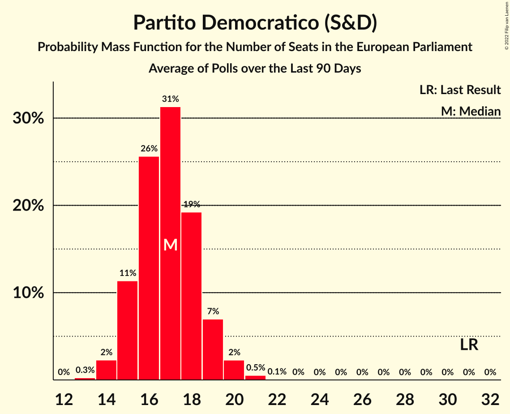

| Number of Seats | Probability | Accumulated | Special Marks |
|:---------------:|:-----------:|:-----------:|:-------------:|
| 13 | 0.3% | 100% |  |
| 14 | 2% | 99.7% |  |
| 15 | 11% | 97% |  |
| 16 | 26% | 86% |  |
| 17 | 31% | 60% | Median |
| 18 | 19% | 29% |  |
| 19 | 7% | 10% |  |
| 20 | 2% | 3% |  |
| 21 | 0.5% | 0.6% |  |
| 22 | 0.1% | 0.1% |  |
| 23 | 0% | 0% |  |
| 24 | 0% | 0% |  |
| 25 | 0% | 0% |  |
| 26 | 0% | 0% |  |
| 27 | 0% | 0% |  |
| 28 | 0% | 0% |  |
| 29 | 0% | 0% |  |
| 30 | 0% | 0% |  |
| 31 | 0% | 0% | Last Result |

### Movimento 5 Stelle (NI)

*For a full overview of the results for this party, see the [Movimento 5 Stelle (NI)](party-movimento5stelleni.html) page.*

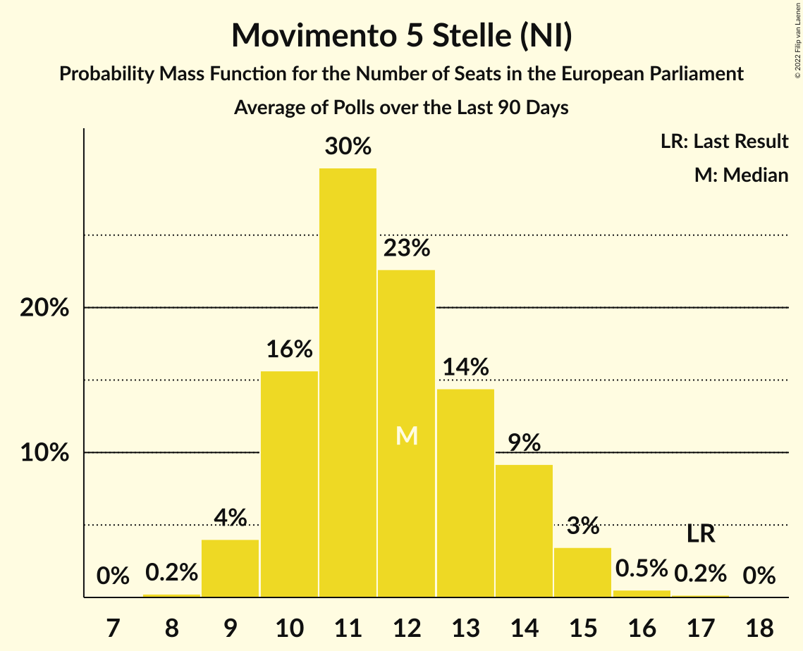

| Number of Seats | Probability | Accumulated | Special Marks |
|:---------------:|:-----------:|:-----------:|:-------------:|
| 8 | 0.2% | 100% |  |
| 9 | 4% | 99.7% |  |
| 10 | 16% | 96% |  |
| 11 | 30% | 80% |  |
| 12 | 23% | 50% | Median |
| 13 | 14% | 28% |  |
| 14 | 9% | 13% |  |
| 15 | 3% | 4% |  |
| 16 | 0.5% | 0.7% |  |
| 17 | 0.2% | 0.2% | Last Result |
| 18 | 0% | 0% |  |

### Forza Italia (EPP)

*For a full overview of the results for this party, see the [Forza Italia (EPP)](party-forzaitaliaepp.html) page.*

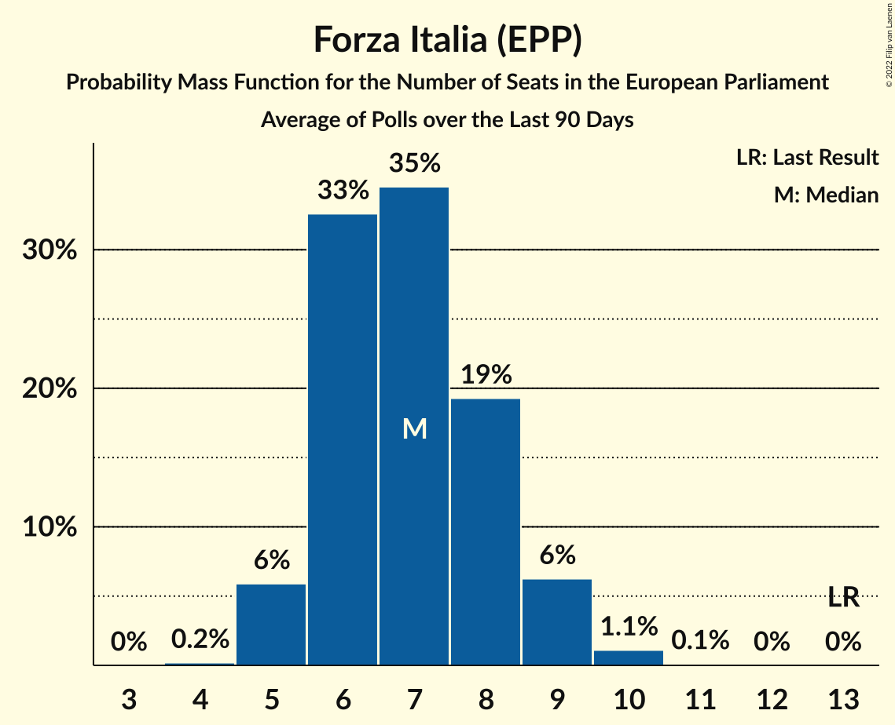

| Number of Seats | Probability | Accumulated | Special Marks |
|:---------------:|:-----------:|:-----------:|:-------------:|
| 4 | 0.2% | 100% |  |
| 5 | 6% | 99.8% |  |
| 6 | 33% | 94% |  |
| 7 | 35% | 61% | Median |
| 8 | 19% | 27% |  |
| 9 | 6% | 7% |  |
| 10 | 1.1% | 1.2% |  |
| 11 | 0.1% | 0.1% |  |
| 12 | 0% | 0% |  |
| 13 | 0% | 0% | Last Result |

### Lega Nord (ID)

*For a full overview of the results for this party, see the [Lega Nord (ID)](party-leganordid.html) page.*

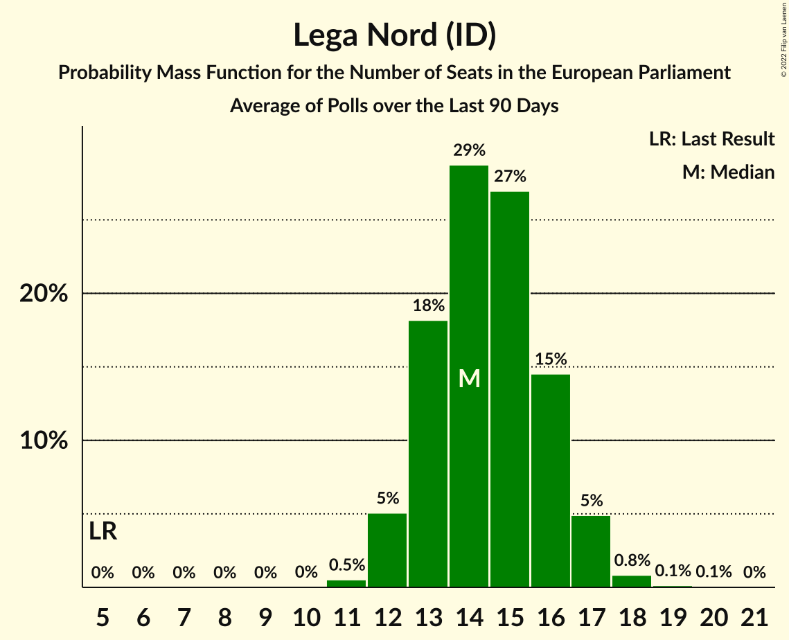

| Number of Seats | Probability | Accumulated | Special Marks |
|:---------------:|:-----------:|:-----------:|:-------------:|
| 5 | 0% | 100% | Last Result |
| 6 | 0% | 100% |  |
| 7 | 0% | 100% |  |
| 8 | 0% | 100% |  |
| 9 | 0% | 100% |  |
| 10 | 0% | 100% |  |
| 11 | 0.5% | 100% |  |
| 12 | 5% | 99.4% |  |
| 13 | 18% | 94% |  |
| 14 | 29% | 76% | Median |
| 15 | 27% | 47% |  |
| 16 | 15% | 20% |  |
| 17 | 5% | 6% |  |
| 18 | 0.8% | 1.1% |  |
| 19 | 0.1% | 0.2% |  |
| 20 | 0.1% | 0.1% |  |
| 21 | 0% | 0% |  |

### Fratelli d’Italia (ECR)

*For a full overview of the results for this party, see the [Fratelli d’Italia (ECR)](party-fratellid’italiaecr.html) page.*

| Number of Seats | Probability | Accumulated | Special Marks |
|:---------------:|:-----------:|:-----------:|:-------------:|
| 0 | 0% | 100% | Last Result |
| 1 | 0% | 100% |  |
| 2 | 0% | 100% |  |
| 3 | 0% | 100% |  |
| 4 | 0% | 100% |  |
| 5 | 0% | 100% |  |
| 6 | 0% | 100% |  |
| 7 | 0% | 100% |  |
| 8 | 0% | 100% |  |
| 9 | 0% | 100% |  |
| 10 | 0% | 100% |  |
| 11 | 0% | 100% |  |
| 12 | 0% | 100% |  |
| 13 | 0.7% | 100% |  |
| 14 | 3% | 99.3% |  |
| 15 | 10% | 96% |  |
| 16 | 23% | 86% |  |
| 17 | 27% | 63% | Median |
| 18 | 23% | 36% |  |
| 19 | 10% | 13% |  |
| 20 | 3% | 3% |  |
| 21 | 0.6% | 0.7% |  |
| 22 | 0.1% | 0.1% |  |
| 23 | 0% | 0% |  |

### Südtiroler Volkspartei (EPP)

*For a full overview of the results for this party, see the [Südtiroler Volkspartei (EPP)](party-südtirolervolksparteiepp.html) page.*

### CasaPound Italia (NI)

*For a full overview of the results for this party, see the [CasaPound Italia (NI)](party-casapounditaliani.html) page.*

### Civica Popolare (RE)

*For a full overview of the results for this party, see the [Civica Popolare (RE)](party-civicapopolarere.html) page.*

### Insieme (*)

*For a full overview of the results for this party, see the [Insieme (*)](party-insieme.html) page.*

### Noi con l’Italia (ECR)

*For a full overview of the results for this party, see the [Noi con l’Italia (ECR)](party-noiconl’italiaecr.html) page.*

### Più Europa (RE)

*For a full overview of the results for this party, see the [Più Europa (RE)](party-piùeuropare.html) page.*

| Number of Seats | Probability | Accumulated | Special Marks |
|:---------------:|:-----------:|:-----------:|:-------------:|
| 0 | 96% | 100% | Last Result, Median |
| 1 | 0% | 4% |  |
| 2 | 0% | 4% |  |
| 3 | 0.1% | 4% |  |
| 4 | 3% | 4% |  |
| 5 | 0.3% | 0.3% |  |
| 6 | 0% | 0% |  |

### Liberi e Uguali (S&D)

*For a full overview of the results for this party, see the [Liberi e Uguali (S&D)](party-liberieugualisd.html) page.*

### Potere al Popolo (GUE/NGL)

*For a full overview of the results for this party, see the [Potere al Popolo (GUE/NGL)](party-poterealpopologuengl.html) page.*

### Azione (RE)

*For a full overview of the results for this party, see the [Azione (RE)](party-azionere.html) page.*

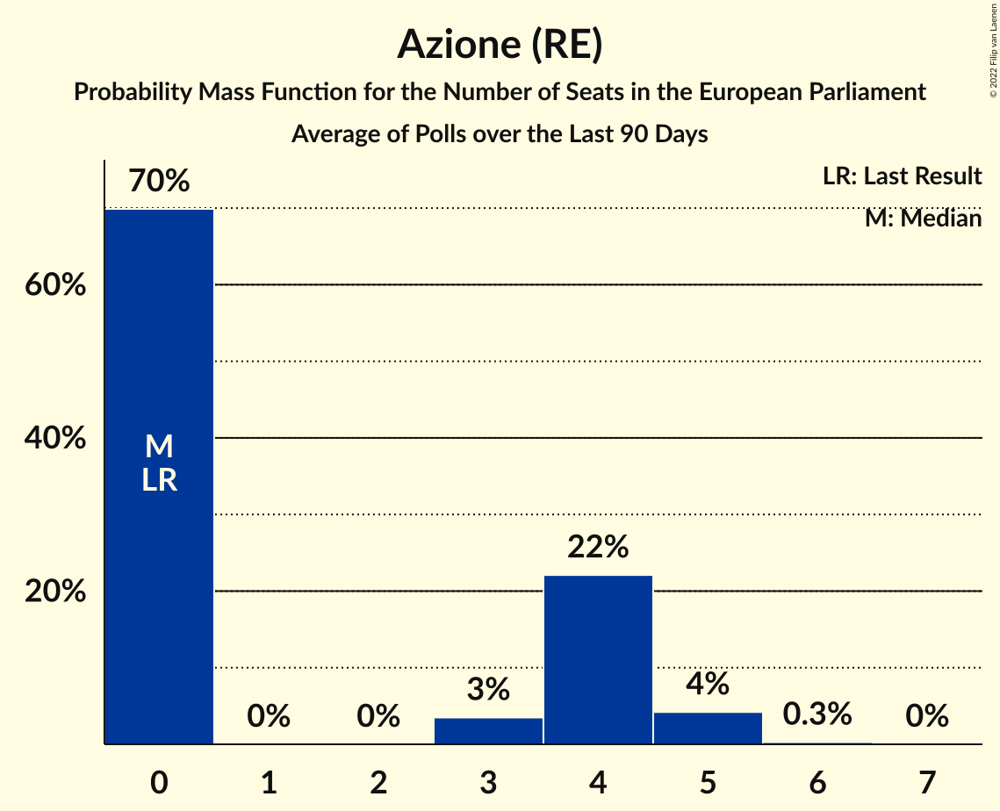

| Number of Seats | Probability | Accumulated | Special Marks |
|:---------------:|:-----------:|:-----------:|:-------------:|
| 0 | 70% | 100% | Last Result, Median |
| 1 | 0% | 30% |  |
| 2 | 0% | 30% |  |
| 3 | 3% | 30% |  |
| 4 | 22% | 27% |  |
| 5 | 4% | 5% |  |
| 6 | 0.3% | 0.3% |  |
| 7 | 0% | 0% |  |

### Europa Verde (Greens/EFA)

*For a full overview of the results for this party, see the [Europa Verde (Greens/EFA)](party-europaverdegreensefa.html) page.*

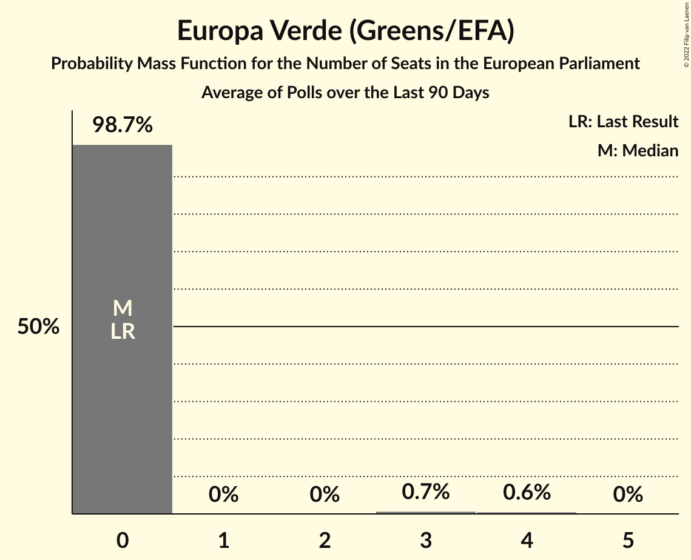

| Number of Seats | Probability | Accumulated | Special Marks |
|:---------------:|:-----------:|:-----------:|:-------------:|
| 0 | 98.7% | 100% | Last Result, Median |
| 1 | 0% | 1.3% |  |
| 2 | 0% | 1.3% |  |
| 3 | 0.7% | 1.3% |  |
| 4 | 0.6% | 0.6% |  |
| 5 | 0% | 0% |  |

### Cambiamo! (ECR)

*For a full overview of the results for this party, see the [Cambiamo! (ECR)](party-cambiamoecr.html) page.*

### Italia Viva (RE)

*For a full overview of the results for this party, see the [Italia Viva (RE)](party-italiavivare.html) page.*

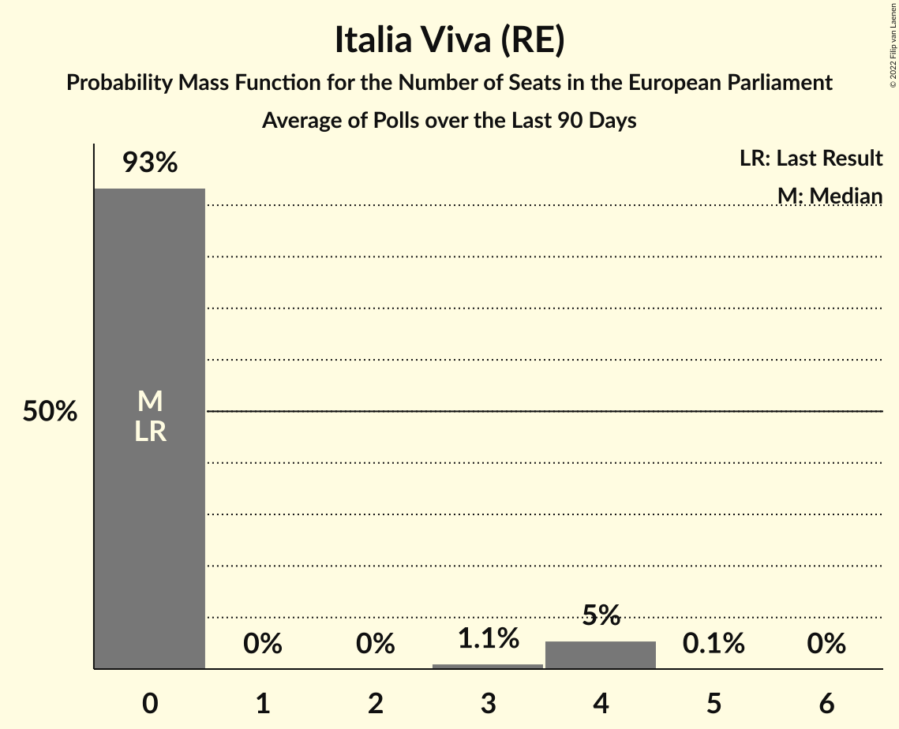

| Number of Seats | Probability | Accumulated | Special Marks |
|:---------------:|:-----------:|:-----------:|:-------------:|
| 0 | 93% | 100% | Last Result, Median |
| 1 | 0% | 7% |  |
| 2 | 0% | 7% |  |
| 3 | 1.1% | 7% |  |
| 4 | 5% | 6% |  |
| 5 | 0.1% | 0.1% |  |
| 6 | 0% | 0% |  |

### Coraggio Italia (ECR)

*For a full overview of the results for this party, see the [Coraggio Italia (ECR)](party-coraggioitaliaecr.html) page.*

### Articolo Uno (S&D)

*For a full overview of the results for this party, see the [Articolo Uno (S&D)](party-articolounosd.html) page.*

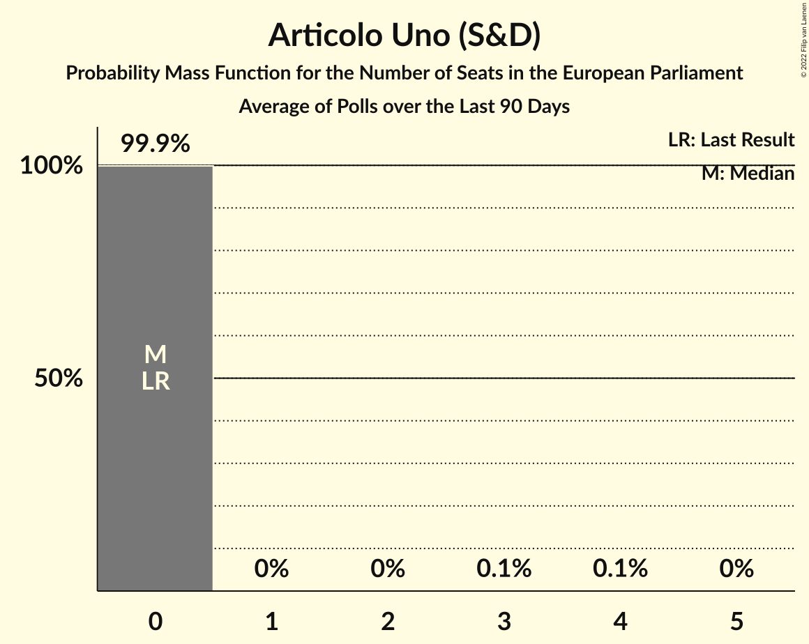

| Number of Seats | Probability | Accumulated | Special Marks |
|:---------------:|:-----------:|:-----------:|:-------------:|
| 0 | 99.9% | 100% | Last Result, Median |
| 1 | 0% | 0.1% |  |
| 2 | 0% | 0.1% |  |
| 3 | 0.1% | 0.1% |  |
| 4 | 0.1% | 0.1% |  |
| 5 | 0% | 0% |  |

### Sinistra Italiana (GUE/NGL)

*For a full overview of the results for this party, see the [Sinistra Italiana (GUE/NGL)](party-sinistraitalianaguengl.html) page.*

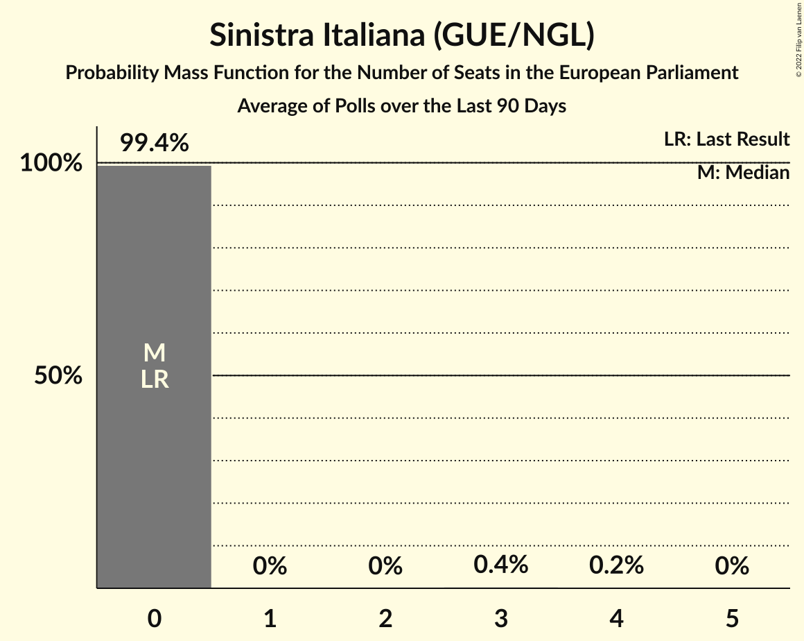

| Number of Seats | Probability | Accumulated | Special Marks |
|:---------------:|:-----------:|:-----------:|:-------------:|
| 0 | 99.4% | 100% | Last Result, Median |
| 1 | 0% | 0.6% |  |
| 2 | 0% | 0.6% |  |
| 3 | 0.4% | 0.6% |  |
| 4 | 0.2% | 0.2% |  |
| 5 | 0% | 0% |  |

### Più Europa–Azione (RE)

*For a full overview of the results for this party, see the [Più Europa–Azione (RE)](party-piùeuropa–azionere.html) page.*

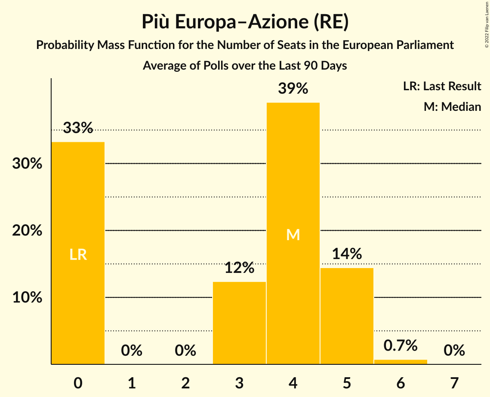

| Number of Seats | Probability | Accumulated | Special Marks |
|:---------------:|:-----------:|:-----------:|:-------------:|
| 0 | 33% | 100% | Last Result |
| 1 | 0% | 67% |  |
| 2 | 0% | 67% |  |
| 3 | 12% | 67% |  |
| 4 | 39% | 54% | Median |
| 5 | 14% | 15% |  |
| 6 | 0.7% | 0.8% |  |
| 7 | 0% | 0% |  |

## Coalitions

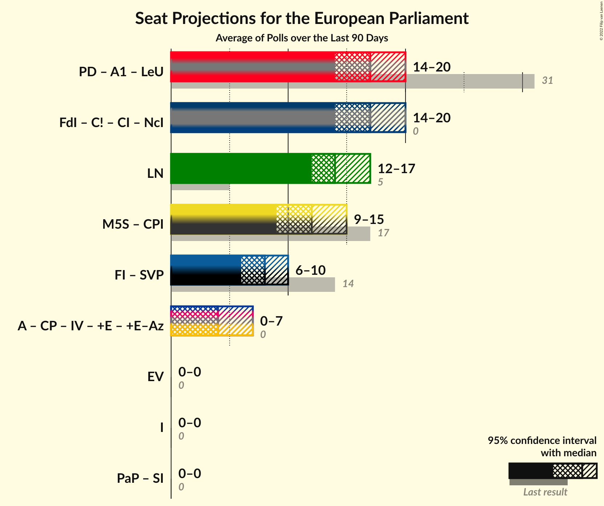

### Confidence Intervals

| Coalition | Last Result | Median | Majority? | 80% Confidence Interval | 90% Confidence Interval | 95% Confidence Interval | 99% Confidence Interval |
|:---------:|:-----------:|:------:|:---------:|:-----------------------:|:-----------------------:|:-----------------------:|:-----------------------:|
| Partito Democratico (S&D) – Articolo Uno (S&D) – Liberi e Uguali (S&D) | 31 | 17 | 0% | 15–18 | 15–19 | 14–20 | 14–21 |
| Fratelli d’Italia (ECR) – Cambiamo! (ECR) – Coraggio Italia (ECR) – Noi con l’Italia (ECR) | 0 | 17 | 0% | 15–19 | 15–19 | 14–20 | 13–21 |
| Lega Nord (ID) | 5 | 14 | 0% | 13–16 | 12–17 | 12–17 | 11–18 |
| Movimento 5 Stelle (NI) – CasaPound Italia (NI) | 17 | 12 | 0% | 10–14 | 10–14 | 9–15 | 9–16 |
| Forza Italia (EPP) – Südtiroler Volkspartei (EPP) | 14 | 8 | 0% | 7–9 | 6–10 | 6–10 | 6–11 |
| Azione (RE) – Civica Popolare (RE) – Italia Viva (RE) – Più Europa (RE) – Più Europa–Azione (RE) | 0 | 4 | 0% | 0–5 | 0–5 | 0–7 | 0–8 |
| Europa Verde (Greens/EFA) | 0 | 0 | 0% | 0 | 0 | 0 | 0–4 |
| Insieme (*) | 0 | 0 | 0% | 0 | 0 | 0 | 0 |
| Potere al Popolo (GUE/NGL) – Sinistra Italiana (GUE/NGL) | 0 | 0 | 0% | 0 | 0 | 0 | 0–3 |

### Partito Democratico (S&D) – Articolo Uno (S&D) – Liberi e Uguali (S&D)

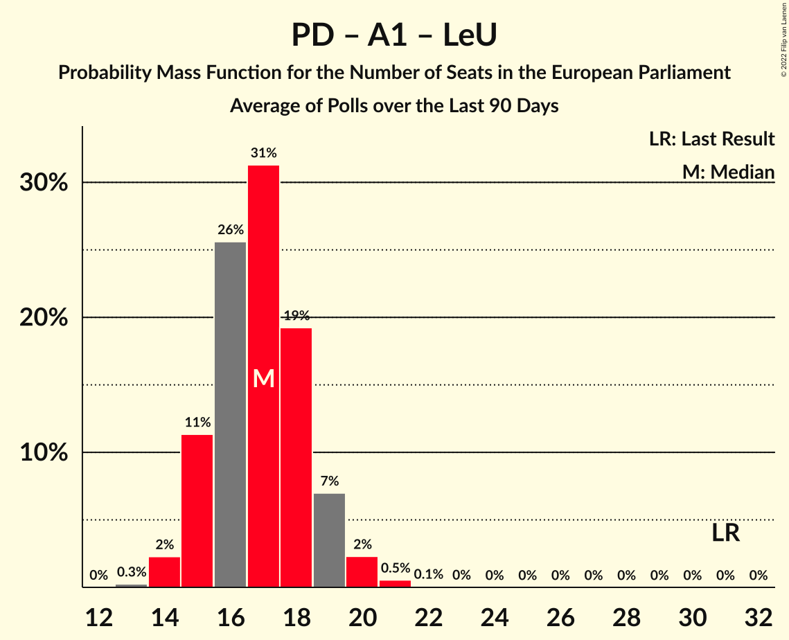

| Number of Seats | Probability | Accumulated | Special Marks |
|:---------------:|:-----------:|:-----------:|:-------------:|
| 13 | 0.3% | 100% |  |
| 14 | 2% | 99.7% |  |
| 15 | 11% | 97% |  |
| 16 | 26% | 86% |  |
| 17 | 31% | 60% | Median |
| 18 | 19% | 29% |  |
| 19 | 7% | 10% |  |
| 20 | 2% | 3% |  |
| 21 | 0.5% | 0.7% |  |
| 22 | 0.1% | 0.1% |  |
| 23 | 0% | 0% |  |
| 24 | 0% | 0% |  |
| 25 | 0% | 0% |  |
| 26 | 0% | 0% |  |
| 27 | 0% | 0% |  |
| 28 | 0% | 0% |  |
| 29 | 0% | 0% |  |
| 30 | 0% | 0% |  |
| 31 | 0% | 0% | Last Result |

### Fratelli d’Italia (ECR) – Cambiamo! (ECR) – Coraggio Italia (ECR) – Noi con l’Italia (ECR)

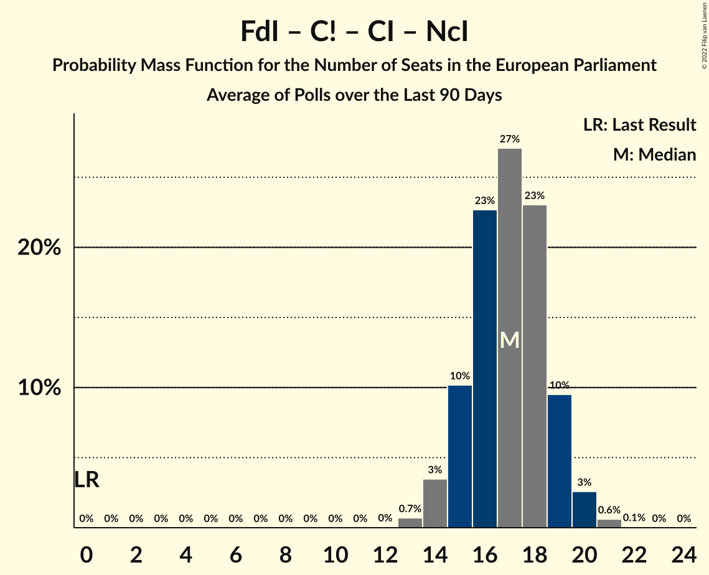

| Number of Seats | Probability | Accumulated | Special Marks |
|:---------------:|:-----------:|:-----------:|:-------------:|
| 0 | 0% | 100% | Last Result |
| 1 | 0% | 100% |  |
| 2 | 0% | 100% |  |
| 3 | 0% | 100% |  |
| 4 | 0% | 100% |  |
| 5 | 0% | 100% |  |
| 6 | 0% | 100% |  |
| 7 | 0% | 100% |  |
| 8 | 0% | 100% |  |
| 9 | 0% | 100% |  |
| 10 | 0% | 100% |  |
| 11 | 0% | 100% |  |
| 12 | 0% | 100% |  |
| 13 | 0.7% | 100% |  |
| 14 | 3% | 99.3% |  |
| 15 | 10% | 96% |  |
| 16 | 23% | 86% |  |
| 17 | 27% | 63% | Median |
| 18 | 23% | 36% |  |
| 19 | 10% | 13% |  |
| 20 | 3% | 3% |  |
| 21 | 0.6% | 0.7% |  |
| 22 | 0.1% | 0.1% |  |
| 23 | 0% | 0% |  |

### Lega Nord (ID)

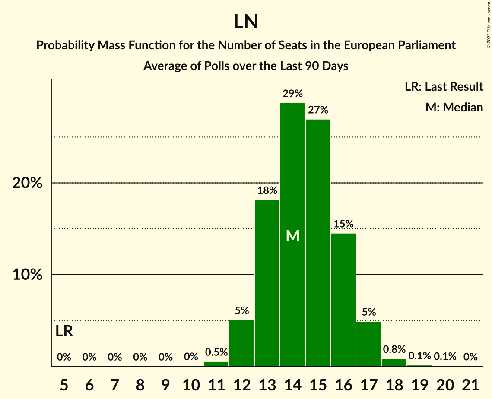

| Number of Seats | Probability | Accumulated | Special Marks |
|:---------------:|:-----------:|:-----------:|:-------------:|
| 5 | 0% | 100% | Last Result |
| 6 | 0% | 100% |  |
| 7 | 0% | 100% |  |
| 8 | 0% | 100% |  |
| 9 | 0% | 100% |  |
| 10 | 0% | 100% |  |
| 11 | 0.5% | 100% |  |
| 12 | 5% | 99.4% |  |
| 13 | 18% | 94% |  |
| 14 | 29% | 76% | Median |
| 15 | 27% | 47% |  |
| 16 | 15% | 20% |  |
| 17 | 5% | 6% |  |
| 18 | 0.8% | 1.1% |  |
| 19 | 0.1% | 0.2% |  |
| 20 | 0.1% | 0.1% |  |
| 21 | 0% | 0% |  |

### Movimento 5 Stelle (NI) – CasaPound Italia (NI)

| Number of Seats | Probability | Accumulated | Special Marks |
|:---------------:|:-----------:|:-----------:|:-------------:|
| 8 | 0.2% | 100% |  |
| 9 | 4% | 99.7% |  |
| 10 | 16% | 96% |  |
| 11 | 30% | 80% |  |
| 12 | 23% | 50% | Median |
| 13 | 14% | 28% |  |
| 14 | 9% | 13% |  |
| 15 | 3% | 4% |  |
| 16 | 0.5% | 0.7% |  |
| 17 | 0.2% | 0.2% | Last Result |
| 18 | 0% | 0% |  |

### Forza Italia (EPP) – Südtiroler Volkspartei (EPP)

| Number of Seats | Probability | Accumulated | Special Marks |
|:---------------:|:-----------:|:-----------:|:-------------:|
| 5 | 0.2% | 100% |  |
| 6 | 6% | 99.8% |  |
| 7 | 33% | 94% | Median |
| 8 | 35% | 61% |  |
| 9 | 19% | 27% |  |
| 10 | 6% | 7% |  |
| 11 | 1.1% | 1.2% |  |
| 12 | 0.1% | 0.1% |  |
| 13 | 0% | 0% |  |
| 14 | 0% | 0% | Last Result |

### Azione (RE) – Civica Popolare (RE) – Italia Viva (RE) – Più Europa (RE) – Più Europa–Azione (RE)

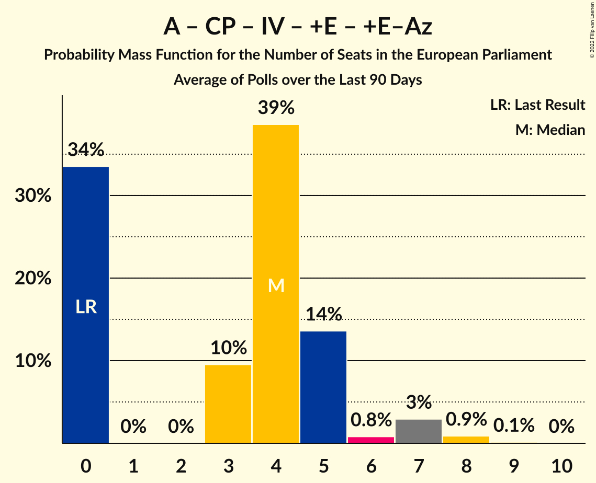

| Number of Seats | Probability | Accumulated | Special Marks |
|:---------------:|:-----------:|:-----------:|:-------------:|
| 0 | 34% | 100% | Last Result |
| 1 | 0% | 66% |  |
| 2 | 0% | 66% |  |
| 3 | 10% | 66% |  |
| 4 | 39% | 57% | Median |
| 5 | 14% | 18% |  |
| 6 | 0.8% | 5% |  |
| 7 | 3% | 4% |  |
| 8 | 0.9% | 1.0% |  |
| 9 | 0.1% | 0.1% |  |
| 10 | 0% | 0% |  |

### Europa Verde (Greens/EFA)

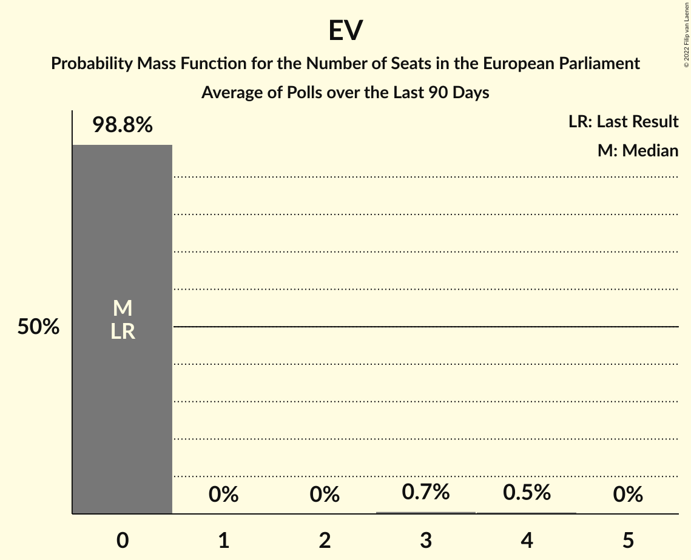

| Number of Seats | Probability | Accumulated | Special Marks |
|:---------------:|:-----------:|:-----------:|:-------------:|
| 0 | 98.8% | 100% | Last Result, Median |
| 1 | 0% | 1.2% |  |
| 2 | 0% | 1.2% |  |
| 3 | 0.7% | 1.2% |  |
| 4 | 0.5% | 0.6% |  |
| 5 | 0% | 0% |  |

### Insieme (*)

| Number of Seats | Probability | Accumulated | Special Marks |
|:---------------:|:-----------:|:-----------:|:-------------:|
| 0 | 100% | 100% | Last Result, Median |

### Potere al Popolo (GUE/NGL) – Sinistra Italiana (GUE/NGL)

| Number of Seats | Probability | Accumulated | Special Marks |
|:---------------:|:-----------:|:-----------:|:-------------:|
| 0 | 99.5% | 100% | Last Result, Median |
| 1 | 0% | 0.5% |  |
| 2 | 0% | 0.5% |  |
| 3 | 0.3% | 0.5% |  |
| 4 | 0.2% | 0.2% |  |
| 5 | 0% | 0% |  |

## Technical Information

+ **Number of polls included in this average:** 14
+ **Lowest number of simulations done in a poll included in this average:** 1,048,576
+ **Total number of simulations done in the polls included in this average:** 14,680,064
+ **Error estimate:** 2.06%
