# Poll Average

<a href="#voting-intentions">Voting Intentions</a> | <a href="#seats">Seats</a> | <a href="#coalitions">Coalitions</a> | <a href="#technical-information">Technical Information</a>

## Summary

The table below lists the polls on which the average is based. They are the most recent polls (less than 30 days old) registered and analyzed so far.

| Period     | Polling firm/Commissioner(s) | PD | M5S | FI | LN | FdI | SVP | CPI | CP | I | NcI | +E | LeU | PaP | A | EV | C! | IV | CI | A1 | SI | +E–Az | Italexit | IpF | IC | AVS | A–IV | NM | UP | ISP | DSP |
|:----------:|:----------------------------:|:--:|:--:|:--:|:--:|:--:|:--:|:--:|:--:|:--:|:--:|:--:|:--:|:--:|:--:|:--:|:--:|:--:|:--:|:--:|:--:|:--:|:--:|:--:|:--:|:--:|:--:|:--:|:--:|:--:|:--:|
| 26 May 2019 | General Election | 40.8%   31 | 21.2%   17 | 16.8%   13 | 6.2%   5 | 3.7%   0 | 0.5%   1 | 0.0%   0 | 0.0%   0 | 0.0%   0 | 0.0%   0 | 0.0%   0 | 0.0%   0 | 0.0%   0 | 0.0%   0 | 0.0%   0 | 0.0%   0 | 0.0%   0 | 0.0%   0 | 0.0%   0 | 0.0%   0 | 0.0%   0 | 0.0%   0 | 0.0%   0 | 0.0%   0 | 0.0%   0 | 0.0%   0 | 0.0%   0 | 0.0%   0 | 0.0%   0 | 0.0%   0 |
| N/A | Poll Average | 17–23%   14–20 | 13–18%   11–16 | 5–9%   3–7 | 7–11%   6–10 | 26–32%   22–28 | N/A   N/A | N/A   N/A | N/A   N/A | N/A   N/A | N/A   N/A | 1–4%   0–3 | N/A   N/A | N/A   N/A | N/A   N/A | N/A   N/A | N/A   N/A | N/A   N/A | N/A   N/A | N/A   N/A | N/A   N/A | N/A   N/A | 1–4%   0 | N/A   N/A | N/A   N/A | 2–5%   0–4 | 4–9%   0–8 | 0–2%   0 | 1–3%   0 | N/A   N/A | 1–3%   0 |
| [18–20 April 2023](2023-04-20-TermometroPolitico.html) | Termometro Politico | 18–20%   16–18 | 15–17%   14–15 | 7–8%   5–6 | 9–11%   8–10 | 28–31%   25–28 | N/A   N/A | N/A   N/A | N/A   N/A | N/A   N/A | N/A   N/A | 2–3%   0 | N/A   N/A | N/A   N/A | N/A   N/A | N/A   N/A | N/A   N/A | N/A   N/A | N/A   N/A | N/A   N/A | N/A   N/A | N/A   N/A | 2–3%   0 | N/A   N/A | N/A   N/A | 2–3%   0 | 4–5%   0–4 | 1–2%   0 | 2–3%   0 | N/A   N/A | 1–2%   0 |
| [19 April 2023](2023-04-19-IndexResearch.html) | Index Research   La7 | 18–23%   15–21 | 13–18%   11–16 | 5–8%   3–6 | 7–11%   6–10 | 26–32%   21–28 | N/A   N/A | N/A   N/A | N/A   N/A | N/A   N/A | N/A   N/A | 2–4%   0–4 | N/A   N/A | N/A   N/A | N/A   N/A | N/A   N/A | N/A   N/A | N/A   N/A | N/A   N/A | N/A   N/A | N/A   N/A | N/A   N/A | 2–4%   0 | N/A   N/A | N/A   N/A | 2–4%   0 | 3–6%   0–5 | N/A   N/A | 1–3%   0 | N/A   N/A | N/A   N/A |
| [18–19 April 2023](2023-04-19-Demopolis.html) | Demopolis | 19–22%   16–19 | 13–17%   12–14 | 6–8%   4–6 | 8–10%   7–9 | 27–31%   23–27 | N/A   N/A | N/A   N/A | N/A   N/A | N/A   N/A | N/A   N/A | 3–4%   0–3 | N/A   N/A | N/A   N/A | N/A   N/A | N/A   N/A | N/A   N/A | N/A   N/A | N/A   N/A | N/A   N/A | N/A   N/A | N/A   N/A | 1–2%   0 | N/A   N/A | N/A   N/A | 1–3%   0 | 3–5%   0–4 | N/A   N/A | 1–2%   0 | N/A   N/A | 1–2%   0 |
| [12–17 April 2023](2023-04-17-SWG.html) | SWG   La7 | 19–23%   17–20 | 13–18%   12–15 | 5–8%   4–6 | 8–11%   7–9 | 26–32%   23–29 | N/A   N/A | N/A   N/A | N/A   N/A | N/A   N/A | N/A   N/A | 2–4%   0–4 | N/A   N/A | N/A   N/A | N/A   N/A | N/A   N/A | N/A   N/A | N/A   N/A | N/A   N/A | N/A   N/A | N/A   N/A | N/A   N/A | 2–3%   0 | N/A   N/A | N/A   N/A | 2–4%   0 | 4–6%   0–5 | N/A   N/A | 1–3%   0 | N/A   N/A | 1–3%   0 |
| [15 April 2023](2023-04-15-Piepoli.html) | Piepoli | 15–22%   12–18 | 13–19%   11–16 | 6–10%   4–8 | 6–11%   6–10 | 26–34%   22–29 | N/A   N/A | N/A   N/A | N/A   N/A | N/A   N/A | N/A   N/A | 2–4%   0–4 | N/A   N/A | N/A   N/A | N/A   N/A | N/A   N/A | N/A   N/A | N/A   N/A | N/A   N/A | N/A   N/A | N/A   N/A | N/A   N/A | 1–4%   0 | N/A   N/A | N/A   N/A | 2–5%   0–4 | 6–10%   5–9 | 1–3%   0 | N/A   N/A | N/A   N/A | N/A   N/A |
| [13–14 April 2023](2023-04-14-Tecnè.html) | Tecnè   Agenzia Dire | 17–22%   14–19 | 13–18%   11–15 | 7–10%   4–7 | 7–11%   6–9 | 27–32%   22–27 | N/A   N/A | N/A   N/A | N/A   N/A | N/A   N/A | N/A   N/A | 2–3%   0 | N/A   N/A | N/A   N/A | N/A   N/A | N/A   N/A | N/A   N/A | N/A   N/A | N/A   N/A | N/A   N/A | N/A   N/A | N/A   N/A | 1–3%   0 | N/A   N/A | N/A   N/A | 2–5%   0–4 | 5–9%   5–7 | N/A   N/A | N/A   N/A | N/A   N/A | N/A   N/A |
| [13–14 April 2023](2023-04-14-BiDiMedia.html) | BiDiMedia | 18–23%   15–20 | 14–18%   12–16 | 5–9%   3–7 | 8–12%   7–10 | 26–32%   23–28 | N/A   N/A | N/A   N/A | N/A   N/A | N/A   N/A | N/A   N/A | 2–4%   0–4 | N/A   N/A | N/A   N/A | N/A   N/A | N/A   N/A | N/A   N/A | N/A   N/A | N/A   N/A | N/A   N/A | N/A   N/A | N/A   N/A | 2–4%   0 | N/A   N/A | N/A   N/A | 2–4%   0 | 4–7%   0–6 | 1–2%   0 | 1–3%   0 | N/A   N/A | 1–2%   0 |
| [12–13 April 2023](2023-04-13-Quorum–YouTrend.html) | Quorum – YouTrend   Sky TG24 | 18–23%   15–20 | 14–19%   12–16 | 5–9%   3–6 | 6–10%   6–9 | 26–32%   22–26 | N/A   N/A | N/A   N/A | N/A   N/A | N/A   N/A | N/A   N/A | 1–3%   0 | N/A   N/A | N/A   N/A | N/A   N/A | N/A   N/A | N/A   N/A | N/A   N/A | N/A   N/A | N/A   N/A | N/A   N/A | N/A   N/A | 1–3%   0 | N/A   N/A | N/A   N/A | 2–4%   0–3 | 6–10%   5–8 | 0–2%   0 | N/A   N/A | N/A   N/A | N/A   N/A |
| [7–13 April 2023](2023-04-13-Lab2101.html) | Lab2101   Affari Italiani | 17–22%   14–19 | 14–18%   12–15 | 5–9%   4–6 | 8–12%   7–10 | 26–32%   22–27 | N/A   N/A | N/A   N/A | N/A   N/A | N/A   N/A | N/A   N/A | 1–3%   0 | N/A   N/A | N/A   N/A | N/A   N/A | N/A   N/A | N/A   N/A | N/A   N/A | N/A   N/A | N/A   N/A | N/A   N/A | N/A   N/A | 2–4%   0 | N/A   N/A | N/A   N/A | 2–5%   0–4 | 6–10%   6–8 | 0–1%   0 | N/A   N/A | N/A   N/A | N/A   N/A |
| [13 April 2023](2023-04-13-EMG.html) | EMG   Rai 3 | 18–22%   15–19 | 15–19%   13–16 | 6–9%   4–7 | 8–11%   7–10 | 25–29%   22–25 | N/A   N/A | N/A   N/A | N/A   N/A | N/A   N/A | N/A   N/A | 1–3%   0 | N/A   N/A | N/A   N/A | N/A   N/A | N/A   N/A | N/A   N/A | N/A   N/A | N/A   N/A | N/A   N/A | N/A   N/A | N/A   N/A | 2–4%   0 | N/A   N/A | N/A   N/A | 2–4%   0–4 | 6–8%   5–7 | 1–2%   0 | 1–2%   0 | N/A   N/A | N/A   N/A |
| [12 April 2023](2023-04-12-Euromedia.html) | Euromedia   La Stampa | 18–23%   15–19 | 13–18%   11–14 | 6–9%   4–6 | 8–11%   6–9 | 27–33%   22–27 | N/A   N/A | N/A   N/A | N/A   N/A | N/A   N/A | N/A   N/A | 1–3%   0 | N/A   N/A | N/A   N/A | N/A   N/A | N/A   N/A | N/A   N/A | N/A   N/A | N/A   N/A | N/A   N/A | N/A   N/A | N/A   N/A | 2–4%   0 | N/A   N/A | N/A   N/A | 1–3%   0 | 6–10%   5–8 | 0–1%   0 | N/A   N/A | N/A   N/A | N/A   N/A |
| [27–30 March 2023](2023-03-30-Ixè.html) | Ixè | 19–24%   15–20 | 13–18%   11–15 | 5–9%   3–6 | 7–10%   5–8 | 26–32%   21–26 | N/A   N/A | N/A   N/A | N/A   N/A | N/A   N/A | N/A   N/A | 1–3%   0 | N/A   N/A | N/A   N/A | N/A   N/A | N/A   N/A | N/A   N/A | N/A   N/A | N/A   N/A | N/A   N/A | N/A   N/A | N/A   N/A | 1–3%   0 | N/A   N/A | N/A   N/A | 3–5%   0–4 | 5–8%   4–7 | 1–2%   0 | N/A   N/A | N/A   N/A | N/A   N/A |
| [23 March 2023](2023-03-23-NotoSondaggi.html) | Noto Sondaggi   Rai 1 | 19–24%   15–19 | 12–17%   10–14 | 6–9%   4–6 | 7–10%   6–8 | 26–32%   21–26 | N/A   N/A | N/A   N/A | N/A   N/A | N/A   N/A | N/A   N/A | 1–2%   0 | N/A   N/A | N/A   N/A | N/A   N/A | N/A   N/A | N/A   N/A | N/A   N/A | N/A   N/A | N/A   N/A | N/A   N/A | N/A   N/A | N/A   N/A | N/A   N/A | N/A   N/A | 2–4%   0–3 | 6–10%   5–8 | 1–2%   0 | N/A   N/A | N/A   N/A | N/A   N/A |
| 26 May 2019 | General Election | 40.8%   31 | 21.2%   17 | 16.8%   13 | 6.2%   5 | 3.7%   0 | 0.5%   1 | 0.0%   0 | 0.0%   0 | 0.0%   0 | 0.0%   0 | 0.0%   0 | 0.0%   0 | 0.0%   0 | 0.0%   0 | 0.0%   0 | 0.0%   0 | 0.0%   0 | 0.0%   0 | 0.0%   0 | 0.0%   0 | 0.0%   0 | 0.0%   0 | 0.0%   0 | 0.0%   0 | 0.0%   0 | 0.0%   0 | 0.0%   0 | 0.0%   0 | 0.0%   0 | 0.0%   0 |

Only polls for which at least the sample size has been published are included in the table above.

**Legend:**
+ **Top half of each row:** Voting intentions (95% confidence interval)
+ **Bottom half of each row:** Seat projections for the European Parliament (95% confidence interval)
+ **PD:** Partito Democratico (S&D)
+ **M5S:** Movimento 5 Stelle (NI)
+ **FI:** Forza Italia (EPP)
+ **LN:** Lega Nord (ID)
+ **FdI:** Fratelli d’Italia (ECR)
+ **SVP:** Südtiroler Volkspartei (EPP)
+ **CPI:** CasaPound Italia (NI)
+ **CP:** Civica Popolare (RE)
+ **I:** Insieme (*)
+ **NcI:** Noi con l’Italia (ECR)
+ **+E:** Più Europa (RE)
+ **LeU:** Liberi e Uguali (S&D)
+ **PaP:** Potere al Popolo (GUE/NGL)
+ **A:** Azione (RE)
+ **EV:** Europa Verde (Greens/EFA)
+ **C!:** Cambiamo! (ECR)
+ **IV:** Italia Viva (RE)
+ **CI:** Coraggio Italia (ECR)
+ **A1:** Articolo Uno (S&D)
+ **SI:** Sinistra Italiana (GUE/NGL)
+ **+E–Az:** Più Europa–Azione (RE)
+ **Italexit:** Italexit–Per l’Italia con Paragone (*)
+ **IpF:** Insieme per il Futuro (NI)
+ **IC:** Impegno Civico (NI)
+ **AVS:** Alleanza Verdi e Sinistra (Greens/EFA)
+ **A–IV:** Azione–Italia Viva (RE)
+ **NM:** Noi Moderati (EPP)
+ **UP:** Unione Popolare (GUE/NGL)
+ **ISP:** Italia Sovrana e Popolare (NI)
+ **DSP:** Democrazia Sovrana e Popolare (NI)
+ **N/A (single party):** Party not included the published results
+ **N/A (entire row):** Calculation for this opinion poll not started yet

## Voting Intentions

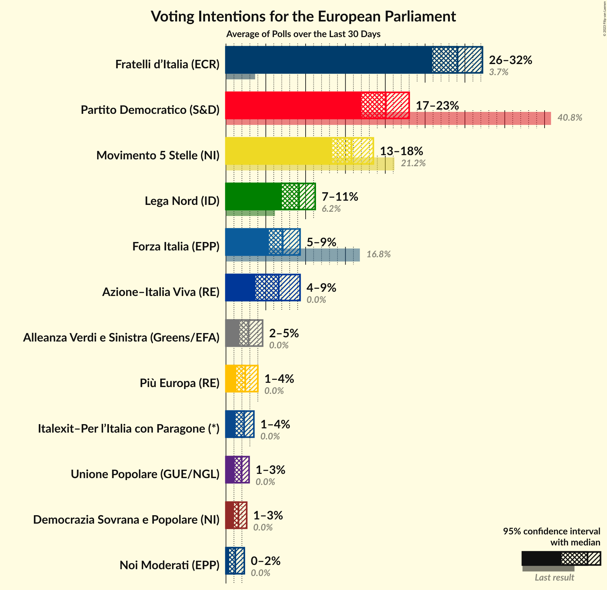

### Confidence Intervals

| Party | Last Result | Median | 80% Confidence Interval | 90% Confidence Interval | 95% Confidence Interval | 99% Confidence Interval |
|:-----:|:-----------:|:------:|:-----------------------:|:-----------------------:|:-----------------------:|:-----------------------:|
| <a href="#partito-democratico-(s&d)">Partito Democratico (S&D)</a> | 40.8% | 20.1% | 18.2–22.0% |17.6–22.6% | 17.0–23.0% | 15.6–24.0% |
| <a href="#movimento-5-stelle-(ni)">Movimento 5 Stelle (NI)</a> | 21.2% | 15.8% | 14.1–17.5% |13.7–18.0% | 13.3–18.5% | 12.6–19.5% |
| <a href="#forza-italia-(epp)">Forza Italia (EPP)</a> | 16.8% | 7.1% | 6.0–8.4% |5.7–8.9% | 5.4–9.3% | 4.9–10.1% |
| <a href="#lega-nord-(id)">Lega Nord (ID)</a> | 6.2% | 9.2% | 7.8–10.4% |7.4–10.8% | 7.0–11.2% | 6.4–11.9% |
| <a href="#fratelli-d’italia-(ecr)">Fratelli d’Italia (ECR)</a> | 3.7% | 29.1% | 27.1–31.0% |26.5–31.6% | 25.9–32.2% | 25.0–33.4% |
| <a href="#südtiroler-volkspartei-(epp)">Südtiroler Volkspartei (EPP)</a> | 0.5% | N/A | N/A |N/A | N/A | N/A |
| <a href="#casapound-italia-(ni)">CasaPound Italia (NI)</a> | 0.0% | N/A | N/A |N/A | N/A | N/A |
| <a href="#civica-popolare-(re)">Civica Popolare (RE)</a> | 0.0% | N/A | N/A |N/A | N/A | N/A |
| <a href="#insieme-(*)">Insieme (*)</a> | 0.0% | N/A | N/A |N/A | N/A | N/A |
| <a href="#noi-con-l’italia-(ecr)">Noi con l’Italia (ECR)</a> | 0.0% | N/A | N/A |N/A | N/A | N/A |
| <a href="#più-europa-(re)">Più Europa (RE)</a> | 0.0% | 2.4% | 1.6–3.5% |1.4–3.7% | 1.3–4.0% | 1.0–4.5% |
| <a href="#liberi-e-uguali-(s&d)">Liberi e Uguali (S&D)</a> | 0.0% | N/A | N/A |N/A | N/A | N/A |
| <a href="#potere-al-popolo-(gue/ngl)">Potere al Popolo (GUE/NGL)</a> | 0.0% | N/A | N/A |N/A | N/A | N/A |
| <a href="#azione-(re)">Azione (RE)</a> | 0.0% | N/A | N/A |N/A | N/A | N/A |
| <a href="#europa-verde-(greens/efa)">Europa Verde (Greens/EFA)</a> | 0.0% | N/A | N/A |N/A | N/A | N/A |
| <a href="#cambiamo!-(ecr)">Cambiamo! (ECR)</a> | 0.0% | N/A | N/A |N/A | N/A | N/A |
| <a href="#italia-viva-(re)">Italia Viva (RE)</a> | 0.0% | N/A | N/A |N/A | N/A | N/A |
| <a href="#coraggio-italia-(ecr)">Coraggio Italia (ECR)</a> | 0.0% | N/A | N/A |N/A | N/A | N/A |
| <a href="#articolo-uno-(s&d)">Articolo Uno (S&D)</a> | 0.0% | N/A | N/A |N/A | N/A | N/A |
| <a href="#sinistra-italiana-(gue/ngl)">Sinistra Italiana (GUE/NGL)</a> | 0.0% | N/A | N/A |N/A | N/A | N/A |
| <a href="#più-europa–azione-(re)">Più Europa–Azione (RE)</a> | 0.0% | N/A | N/A |N/A | N/A | N/A |
| <a href="#italexit–per-l’italia-con-paragone-(*)">Italexit–Per l’Italia con Paragone (*)</a> | 0.0% | 2.3% | 1.5–3.1% |1.4–3.3% | 1.2–3.5% | 1.0–4.0% |
| <a href="#insieme-per-il-futuro-(ni)">Insieme per il Futuro (NI)</a> | 0.0% | N/A | N/A |N/A | N/A | N/A |
| <a href="#impegno-civico-(ni)">Impegno Civico (NI)</a> | 0.0% | N/A | N/A |N/A | N/A | N/A |
| <a href="#alleanza-verdi-e-sinistra-(greens/efa)">Alleanza Verdi e Sinistra (Greens/EFA)</a> | 0.0% | 2.8% | 2.0–3.9% |1.8–4.3% | 1.7–4.6% | 1.4–5.1% |
| <a href="#azione–italia-viva-(re)">Azione–Italia Viva (RE)</a> | 0.0% | 6.6% | 4.1–8.5% |3.9–8.9% | 3.7–9.3% | 3.3–10.1% |
| <a href="#noi-moderati-(epp)">Noi Moderati (EPP)</a> | 0.0% | 1.2% | 0.6–1.8% |0.4–2.1% | 0.4–2.3% | 0.2–2.9% |
| <a href="#unione-popolare-(gue/ngl)">Unione Popolare (GUE/NGL)</a> | 0.0% | 2.0% | 1.3–2.6% |1.2–2.8% | 1.1–2.9% | 0.9–3.3% |
| <a href="#italia-sovrana-e-popolare-(ni)">Italia Sovrana e Popolare (NI)</a> | 0.0% | N/A | N/A |N/A | N/A | N/A |
| <a href="#democrazia-sovrana-e-popolare-(ni)">Democrazia Sovrana e Popolare (NI)</a> | 0.0% | 1.6% | 1.2–2.2% |1.1–2.4% | 1.0–2.6% | 0.8–2.9% |

### Partito Democratico (S&D)

*For a full overview of the results for this party, see the [Partito Democratico (S&D)](party-partitodemocraticosd.html) page.*

| Voting Intentions | Probability | Accumulated | Special Marks |
|:-----------------:|:-----------:|:-----------:|:-------------:|
| 12.5–13.5% | 0% | 100% |  |
| 13.5–14.5% | 0.1% | 100% |  |
| 14.5–15.5% | 0.4% | 99.9% |  |
| 15.5–16.5% | 1.1% | 99.5% |  |
| 16.5–17.5% | 3% | 98% |  |
| 17.5–18.5% | 11% | 95% |  |
| 18.5–19.5% | 21% | 85% |  |
| 19.5–20.5% | 25% | 63% | Median |
| 20.5–21.5% | 22% | 38% |  |
| 21.5–22.5% | 12% | 17% |  |
| 22.5–23.5% | 4% | 5% |  |
| 23.5–24.5% | 0.9% | 1.1% |  |
| 24.5–25.5% | 0.1% | 0.2% |  |
| 25.5–26.5% | 0% | 0% |  |
| 26.5–27.5% | 0% | 0% |  |
| 27.5–28.5% | 0% | 0% |  |
| 28.5–29.5% | 0% | 0% |  |
| 29.5–30.5% | 0% | 0% |  |
| 30.5–31.5% | 0% | 0% |  |
| 31.5–32.5% | 0% | 0% |  |
| 32.5–33.5% | 0% | 0% |  |
| 33.5–34.5% | 0% | 0% |  |
| 34.5–35.5% | 0% | 0% |  |
| 35.5–36.5% | 0% | 0% |  |
| 36.5–37.5% | 0% | 0% |  |
| 37.5–38.5% | 0% | 0% |  |
| 38.5–39.5% | 0% | 0% |  |
| 39.5–40.5% | 0% | 0% |  |
| 40.5–41.5% | 0% | 0% | Last Result |

### Movimento 5 Stelle (NI)

*For a full overview of the results for this party, see the [Movimento 5 Stelle (NI)](party-movimento5stelleni.html) page.*

| Voting Intentions | Probability | Accumulated | Special Marks |
|:-----------------:|:-----------:|:-----------:|:-------------:|
| 10.5–11.5% | 0% | 100% |  |
| 11.5–12.5% | 0.4% | 100% |  |
| 12.5–13.5% | 3% | 99.5% |  |
| 13.5–14.5% | 13% | 96% |  |
| 14.5–15.5% | 26% | 83% |  |
| 15.5–16.5% | 30% | 57% | Median |
| 16.5–17.5% | 18% | 27% |  |
| 17.5–18.5% | 7% | 9% |  |
| 18.5–19.5% | 2% | 2% |  |
| 19.5–20.5% | 0.4% | 0.4% |  |
| 20.5–21.5% | 0.1% | 0.1% | Last Result |
| 21.5–22.5% | 0% | 0% |  |

### Forza Italia (EPP)

*For a full overview of the results for this party, see the [Forza Italia (EPP)](party-forzaitaliaepp.html) page.*

| Voting Intentions | Probability | Accumulated | Special Marks |
|:-----------------:|:-----------:|:-----------:|:-------------:|
| 2.5–3.5% | 0% | 100% |  |
| 3.5–4.5% | 0.1% | 100% |  |
| 4.5–5.5% | 4% | 99.9% |  |
| 5.5–6.5% | 23% | 96% |  |
| 6.5–7.5% | 40% | 73% | Median |
| 7.5–8.5% | 25% | 33% |  |
| 8.5–9.5% | 7% | 8% |  |
| 9.5–10.5% | 1.3% | 1.5% |  |
| 10.5–11.5% | 0.2% | 0.2% |  |
| 11.5–12.5% | 0% | 0% |  |
| 12.5–13.5% | 0% | 0% |  |
| 13.5–14.5% | 0% | 0% |  |
| 14.5–15.5% | 0% | 0% |  |
| 15.5–16.5% | 0% | 0% |  |
| 16.5–17.5% | 0% | 0% | Last Result |

### Lega Nord (ID)

*For a full overview of the results for this party, see the [Lega Nord (ID)](party-leganordid.html) page.*

| Voting Intentions | Probability | Accumulated | Special Marks |
|:-----------------:|:-----------:|:-----------:|:-------------:|
| 4.5–5.5% | 0% | 100% |  |
| 5.5–6.5% | 0.8% | 100% | Last Result |
| 6.5–7.5% | 6% | 99.2% |  |
| 7.5–8.5% | 22% | 93% |  |
| 8.5–9.5% | 37% | 71% | Median |
| 9.5–10.5% | 26% | 34% |  |
| 10.5–11.5% | 7% | 8% |  |
| 11.5–12.5% | 1.1% | 1.2% |  |
| 12.5–13.5% | 0.1% | 0.1% |  |
| 13.5–14.5% | 0% | 0% |  |

### Fratelli d’Italia (ECR)

*For a full overview of the results for this party, see the [Fratelli d’Italia (ECR)](party-fratellid’italiaecr.html) page.*

| Voting Intentions | Probability | Accumulated | Special Marks |
|:-----------------:|:-----------:|:-----------:|:-------------:|
| 3.5–4.5% | 0% | 100% | Last Result |
| 4.5–5.5% | 0% | 100% |  |
| 5.5–6.5% | 0% | 100% |  |
| 6.5–7.5% | 0% | 100% |  |
| 7.5–8.5% | 0% | 100% |  |
| 8.5–9.5% | 0% | 100% |  |
| 9.5–10.5% | 0% | 100% |  |
| 10.5–11.5% | 0% | 100% |  |
| 11.5–12.5% | 0% | 100% |  |
| 12.5–13.5% | 0% | 100% |  |
| 13.5–14.5% | 0% | 100% |  |
| 14.5–15.5% | 0% | 100% |  |
| 15.5–16.5% | 0% | 100% |  |
| 16.5–17.5% | 0% | 100% |  |
| 17.5–18.5% | 0% | 100% |  |
| 18.5–19.5% | 0% | 100% |  |
| 19.5–20.5% | 0% | 100% |  |
| 20.5–21.5% | 0% | 100% |  |
| 21.5–22.5% | 0% | 100% |  |
| 22.5–23.5% | 0% | 100% |  |
| 23.5–24.5% | 0.2% | 100% |  |
| 24.5–25.5% | 1.1% | 99.8% |  |
| 25.5–26.5% | 4% | 98.6% |  |
| 26.5–27.5% | 11% | 94% |  |
| 27.5–28.5% | 20% | 84% |  |
| 28.5–29.5% | 27% | 64% | Median |
| 29.5–30.5% | 21% | 37% |  |
| 30.5–31.5% | 10% | 16% |  |
| 31.5–32.5% | 4% | 5% |  |
| 32.5–33.5% | 1.1% | 2% |  |
| 33.5–34.5% | 0.3% | 0.4% |  |
| 34.5–35.5% | 0.1% | 0.1% |  |
| 35.5–36.5% | 0% | 0% |  |

### Più Europa (RE)

*For a full overview of the results for this party, see the [Più Europa (RE)](party-piùeuropare.html) page.*

| Voting Intentions | Probability | Accumulated | Special Marks |
|:-----------------:|:-----------:|:-----------:|:-------------:|
| 0.0–0.5% | 0% | 100% | Last Result |
| 0.5–1.5% | 8% | 100% |  |
| 1.5–2.5% | 50% | 92% | Median |
| 2.5–3.5% | 34% | 42% |  |
| 3.5–4.5% | 7% | 8% |  |
| 4.5–5.5% | 0.4% | 0.4% |  |
| 5.5–6.5% | 0% | 0% |  |

### Italexit–Per l’Italia con Paragone (*)

*For a full overview of the results for this party, see the [Italexit–Per l’Italia con Paragone (*)](party-italexit–perl’italiaconparagone.html) page.*

| Voting Intentions | Probability | Accumulated | Special Marks |
|:-----------------:|:-----------:|:-----------:|:-------------:|
| 0.0–0.5% | 0% | 100% | Last Result |
| 0.5–1.5% | 11% | 100% |  |
| 1.5–2.5% | 58% | 89% | Median |
| 2.5–3.5% | 30% | 32% |  |
| 3.5–4.5% | 2% | 2% |  |
| 4.5–5.5% | 0% | 0% |  |
| 5.5–6.5% | 0% | 0% |  |

### Alleanza Verdi e Sinistra (Greens/EFA)

*For a full overview of the results for this party, see the [Alleanza Verdi e Sinistra (Greens/EFA)](party-alleanzaverdiesinistragreensefa.html) page.*

| Voting Intentions | Probability | Accumulated | Special Marks |
|:-----------------:|:-----------:|:-----------:|:-------------:|
| 0.0–0.5% | 0% | 100% | Last Result |
| 0.5–1.5% | 1.2% | 100% |  |
| 1.5–2.5% | 33% | 98.8% |  |
| 2.5–3.5% | 46% | 66% | Median |
| 3.5–4.5% | 17% | 20% |  |
| 4.5–5.5% | 2% | 3% |  |
| 5.5–6.5% | 0.1% | 0.1% |  |
| 6.5–7.5% | 0% | 0% |  |

### Azione–Italia Viva (RE)

*For a full overview of the results for this party, see the [Azione–Italia Viva (RE)](party-azione–italiavivare.html) page.*

| Voting Intentions | Probability | Accumulated | Special Marks |
|:-----------------:|:-----------:|:-----------:|:-------------:|
| 0.0–0.5% | 0% | 100% | Last Result |
| 0.5–1.5% | 0% | 100% |  |
| 1.5–2.5% | 0% | 100% |  |
| 2.5–3.5% | 2% | 100% |  |
| 3.5–4.5% | 19% | 98% |  |
| 4.5–5.5% | 15% | 79% |  |
| 5.5–6.5% | 13% | 64% |  |
| 6.5–7.5% | 23% | 51% | Median |
| 7.5–8.5% | 19% | 28% |  |
| 8.5–9.5% | 7% | 9% |  |
| 9.5–10.5% | 1.4% | 2% |  |
| 10.5–11.5% | 0.2% | 0.2% |  |
| 11.5–12.5% | 0% | 0% |  |

### Noi Moderati (EPP)

*For a full overview of the results for this party, see the [Noi Moderati (EPP)](party-noimoderatiepp.html) page.*

| Voting Intentions | Probability | Accumulated | Special Marks |
|:-----------------:|:-----------:|:-----------:|:-------------:|
| 0.0–0.5% | 10% | 100% | Last Result |
| 0.5–1.5% | 66% | 90% | Median |
| 1.5–2.5% | 22% | 24% |  |
| 2.5–3.5% | 1.4% | 1.4% |  |
| 3.5–4.5% | 0.1% | 0.1% |  |
| 4.5–5.5% | 0% | 0% |  |

### Unione Popolare (GUE/NGL)

*For a full overview of the results for this party, see the [Unione Popolare (GUE/NGL)](party-unionepopolareguengl.html) page.*

| Voting Intentions | Probability | Accumulated | Special Marks |
|:-----------------:|:-----------:|:-----------:|:-------------:|
| 0.0–0.5% | 0% | 100% | Last Result |
| 0.5–1.5% | 21% | 100% |  |
| 1.5–2.5% | 66% | 79% | Median |
| 2.5–3.5% | 13% | 13% |  |
| 3.5–4.5% | 0.2% | 0.2% |  |
| 4.5–5.5% | 0% | 0% |  |

### Democrazia Sovrana e Popolare (NI)

*For a full overview of the results for this party, see the [Democrazia Sovrana e Popolare (NI)](party-democraziasovranaepopolareni.html) page.*

| Voting Intentions | Probability | Accumulated | Special Marks |
|:-----------------:|:-----------:|:-----------:|:-------------:|
| 0.0–0.5% | 0% | 100% | Last Result |
| 0.5–1.5% | 45% | 100% |  |
| 1.5–2.5% | 52% | 55% | Median |
| 2.5–3.5% | 3% | 3% |  |
| 3.5–4.5% | 0% | 0% |  |

## Seats

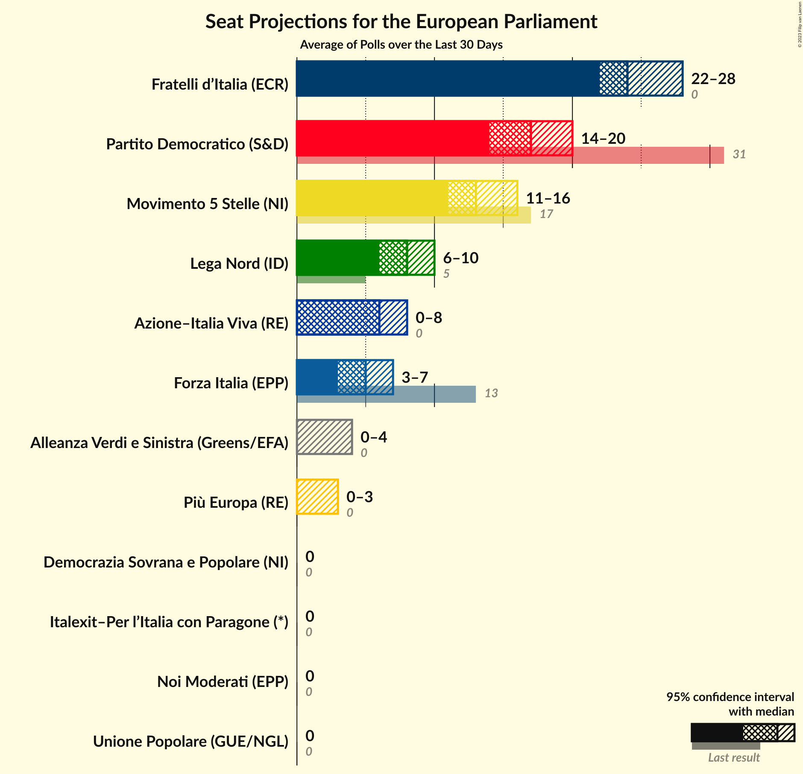

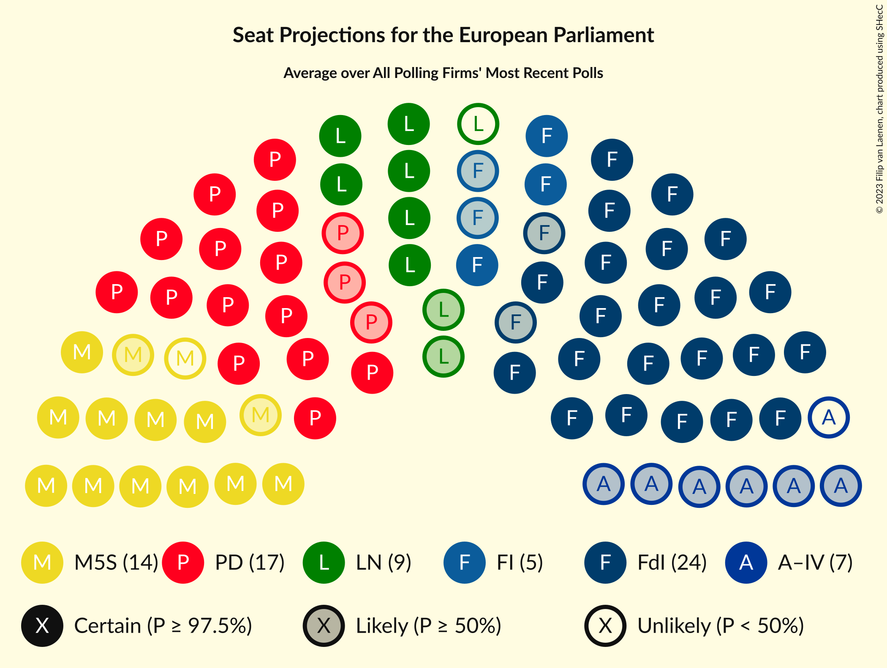

### Confidence Intervals

| Party | Last Result | Median | 80% Confidence Interval | 90% Confidence Interval | 95% Confidence Interval | 99% Confidence Interval |
|:-----:|:-----------:|:------:|:-----------------------:|:-----------------------:|:-----------------------:|:-----------------------:|
| <a href="#partito-democratico-(s&d)">Partito Democratico (S&D)</a> | 31 | 17 | 15–19 |15–19 | 14–20 | 13–21 |
| <a href="#movimento-5-stelle-(ni)">Movimento 5 Stelle (NI)</a> | 17 | 13 | 12–15 |11–15 | 11–16 | 10–17 |
| <a href="#forza-italia-(epp)">Forza Italia (EPP)</a> | 13 | 5 | 4–6 |4–6 | 3–7 | 3–7 |
| <a href="#lega-nord-(id)">Lega Nord (ID)</a> | 5 | 8 | 6–9 |6–9 | 6–10 | 5–10 |
| <a href="#fratelli-d’italia-(ecr)">Fratelli d’Italia (ECR)</a> | 0 | 24 | 23–27 |22–27 | 22–28 | 21–29 |
| <a href="#südtiroler-volkspartei-(epp)">Südtiroler Volkspartei (EPP)</a> | 1 | N/A | N/A |N/A | N/A | N/A |
| <a href="#casapound-italia-(ni)">CasaPound Italia (NI)</a> | 0 | N/A | N/A |N/A | N/A | N/A |
| <a href="#civica-popolare-(re)">Civica Popolare (RE)</a> | 0 | N/A | N/A |N/A | N/A | N/A |
| <a href="#insieme-(*)">Insieme (*)</a> | 0 | N/A | N/A |N/A | N/A | N/A |
| <a href="#noi-con-l’italia-(ecr)">Noi con l’Italia (ECR)</a> | 0 | N/A | N/A |N/A | N/A | N/A |
| <a href="#più-europa-(re)">Più Europa (RE)</a> | 0 | 0 | 0 |0 | 0–3 | 0–4 |
| <a href="#liberi-e-uguali-(s&d)">Liberi e Uguali (S&D)</a> | 0 | N/A | N/A |N/A | N/A | N/A |
| <a href="#potere-al-popolo-(gue/ngl)">Potere al Popolo (GUE/NGL)</a> | 0 | N/A | N/A |N/A | N/A | N/A |
| <a href="#azione-(re)">Azione (RE)</a> | 0 | N/A | N/A |N/A | N/A | N/A |
| <a href="#europa-verde-(greens/efa)">Europa Verde (Greens/EFA)</a> | 0 | N/A | N/A |N/A | N/A | N/A |
| <a href="#cambiamo!-(ecr)">Cambiamo! (ECR)</a> | 0 | N/A | N/A |N/A | N/A | N/A |
| <a href="#italia-viva-(re)">Italia Viva (RE)</a> | 0 | N/A | N/A |N/A | N/A | N/A |
| <a href="#coraggio-italia-(ecr)">Coraggio Italia (ECR)</a> | 0 | N/A | N/A |N/A | N/A | N/A |
| <a href="#articolo-uno-(s&d)">Articolo Uno (S&D)</a> | 0 | N/A | N/A |N/A | N/A | N/A |
| <a href="#sinistra-italiana-(gue/ngl)">Sinistra Italiana (GUE/NGL)</a> | 0 | N/A | N/A |N/A | N/A | N/A |
| <a href="#più-europa–azione-(re)">Più Europa–Azione (RE)</a> | 0 | N/A | N/A |N/A | N/A | N/A |
| <a href="#italexit–per-l’italia-con-paragone-(*)">Italexit–Per l’Italia con Paragone (*)</a> | 0 | 0 | 0 |0 | 0 | 0 |
| <a href="#insieme-per-il-futuro-(ni)">Insieme per il Futuro (NI)</a> | 0 | N/A | N/A |N/A | N/A | N/A |
| <a href="#impegno-civico-(ni)">Impegno Civico (NI)</a> | 0 | N/A | N/A |N/A | N/A | N/A |
| <a href="#alleanza-verdi-e-sinistra-(greens/efa)">Alleanza Verdi e Sinistra (Greens/EFA)</a> | 0 | 0 | 0 |0–3 | 0–4 | 0–4 |
| <a href="#azione–italia-viva-(re)">Azione–Italia Viva (RE)</a> | 0 | 6 | 4–7 |0–7 | 0–8 | 0–8 |
| <a href="#noi-moderati-(epp)">Noi Moderati (EPP)</a> | 0 | 0 | 0 |0 | 0 | 0 |
| <a href="#unione-popolare-(gue/ngl)">Unione Popolare (GUE/NGL)</a> | 0 | 0 | 0 |0 | 0 | 0 |
| <a href="#italia-sovrana-e-popolare-(ni)">Italia Sovrana e Popolare (NI)</a> | 0 | N/A | N/A |N/A | N/A | N/A |
| <a href="#democrazia-sovrana-e-popolare-(ni)">Democrazia Sovrana e Popolare (NI)</a> | 0 | 0 | 0 |0 | 0 | 0 |

### Partito Democratico (S&D)

*For a full overview of the results for this party, see the [Partito Democratico (S&D)](party-partitodemocraticosd.html) page.*

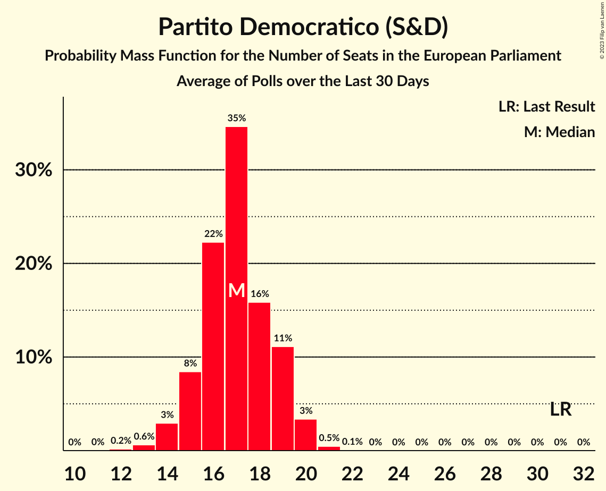

| Number of Seats | Probability | Accumulated | Special Marks |
|:---------------:|:-----------:|:-----------:|:-------------:|
| 12 | 0.2% | 100% |  |
| 13 | 0.6% | 99.8% |  |
| 14 | 3% | 99.2% |  |
| 15 | 8% | 96% |  |
| 16 | 22% | 88% |  |
| 17 | 35% | 66% | Median |
| 18 | 16% | 31% |  |
| 19 | 11% | 15% |  |
| 20 | 3% | 4% |  |
| 21 | 0.5% | 0.5% |  |
| 22 | 0.1% | 0.1% |  |
| 23 | 0% | 0% |  |
| 24 | 0% | 0% |  |
| 25 | 0% | 0% |  |
| 26 | 0% | 0% |  |
| 27 | 0% | 0% |  |
| 28 | 0% | 0% |  |
| 29 | 0% | 0% |  |
| 30 | 0% | 0% |  |
| 31 | 0% | 0% | Last Result |

### Movimento 5 Stelle (NI)

*For a full overview of the results for this party, see the [Movimento 5 Stelle (NI)](party-movimento5stelleni.html) page.*

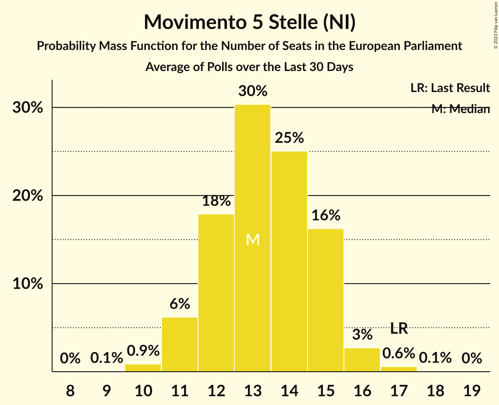

| Number of Seats | Probability | Accumulated | Special Marks |
|:---------------:|:-----------:|:-----------:|:-------------:|
| 9 | 0.1% | 100% |  |
| 10 | 0.9% | 99.9% |  |
| 11 | 6% | 99.1% |  |
| 12 | 18% | 93% |  |
| 13 | 30% | 75% | Median |
| 14 | 25% | 45% |  |
| 15 | 16% | 20% |  |
| 16 | 3% | 3% |  |
| 17 | 0.6% | 0.7% | Last Result |
| 18 | 0.1% | 0.1% |  |
| 19 | 0% | 0% |  |

### Forza Italia (EPP)

*For a full overview of the results for this party, see the [Forza Italia (EPP)](party-forzaitaliaepp.html) page.*

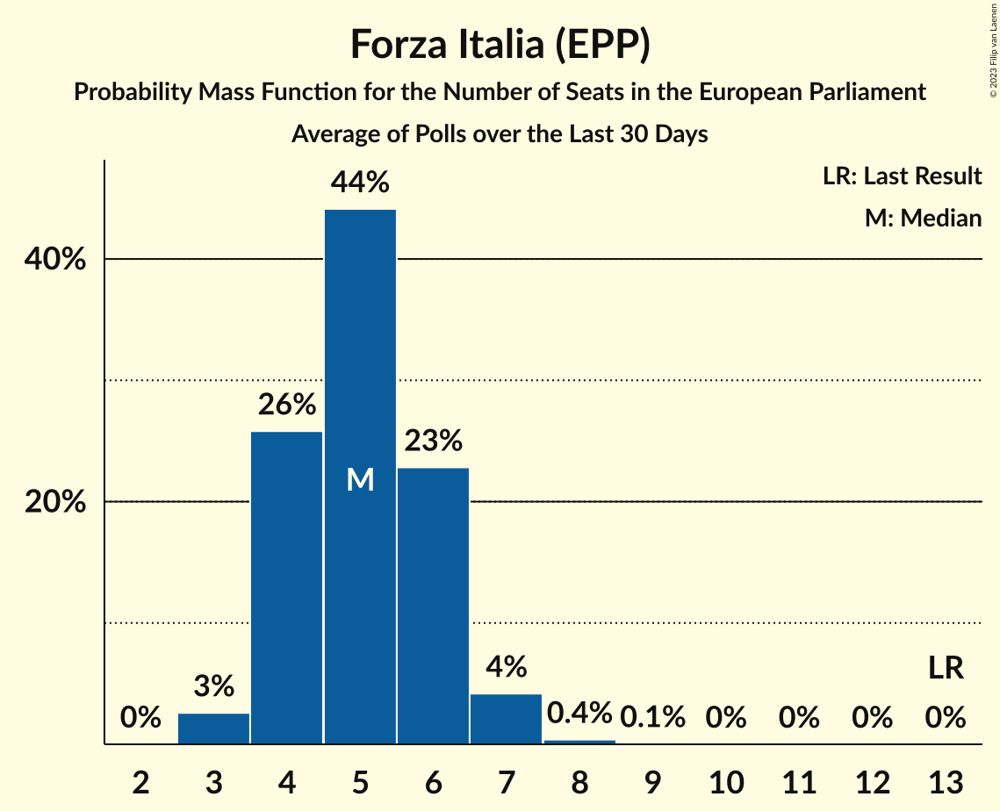

| Number of Seats | Probability | Accumulated | Special Marks |
|:---------------:|:-----------:|:-----------:|:-------------:|
| 3 | 3% | 100% |  |
| 4 | 26% | 97% |  |
| 5 | 44% | 72% | Median |
| 6 | 23% | 27% |  |
| 7 | 4% | 5% |  |
| 8 | 0.4% | 0.4% |  |
| 9 | 0.1% | 0.1% |  |
| 10 | 0% | 0% |  |
| 11 | 0% | 0% |  |
| 12 | 0% | 0% |  |
| 13 | 0% | 0% | Last Result |

### Lega Nord (ID)

*For a full overview of the results for this party, see the [Lega Nord (ID)](party-leganordid.html) page.*

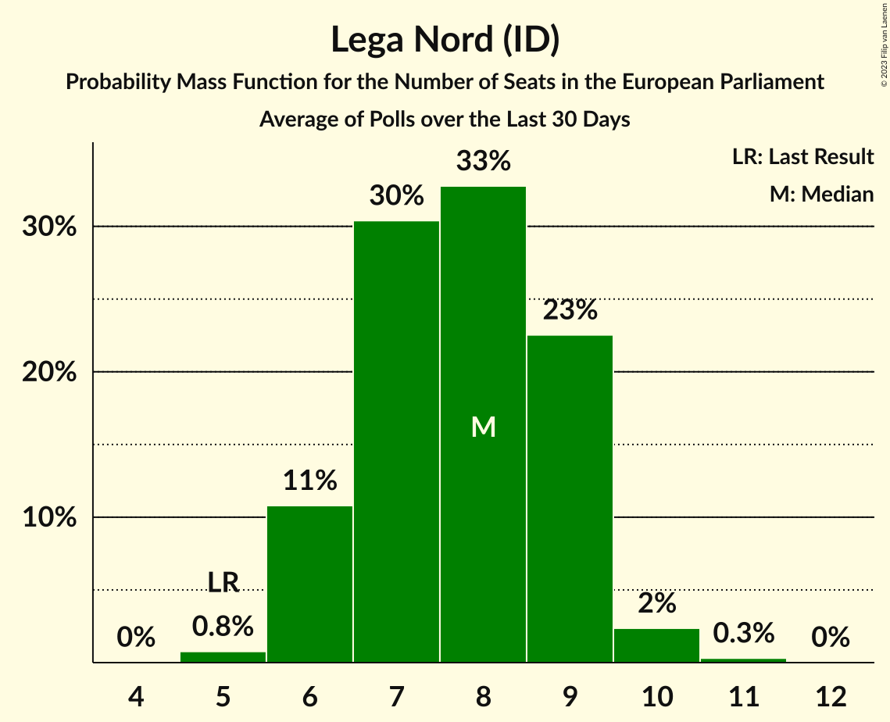

| Number of Seats | Probability | Accumulated | Special Marks |
|:---------------:|:-----------:|:-----------:|:-------------:|
| 5 | 0.8% | 100% | Last Result |
| 6 | 11% | 99.2% |  |
| 7 | 30% | 88% |  |
| 8 | 33% | 58% | Median |
| 9 | 23% | 25% |  |
| 10 | 2% | 3% |  |
| 11 | 0.3% | 0.3% |  |
| 12 | 0% | 0% |  |

### Fratelli d’Italia (ECR)

*For a full overview of the results for this party, see the [Fratelli d’Italia (ECR)](party-fratellid’italiaecr.html) page.*

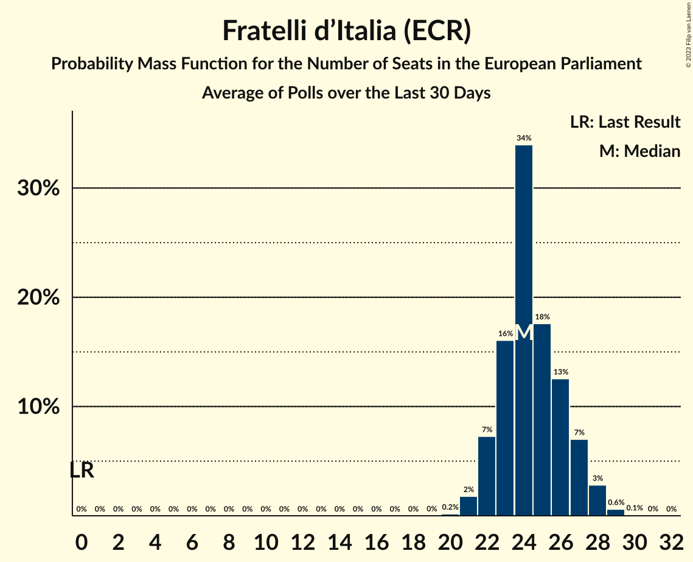

| Number of Seats | Probability | Accumulated | Special Marks |
|:---------------:|:-----------:|:-----------:|:-------------:|
| 0 | 0% | 100% | Last Result |
| 1 | 0% | 100% |  |
| 2 | 0% | 100% |  |
| 3 | 0% | 100% |  |
| 4 | 0% | 100% |  |
| 5 | 0% | 100% |  |
| 6 | 0% | 100% |  |
| 7 | 0% | 100% |  |
| 8 | 0% | 100% |  |
| 9 | 0% | 100% |  |
| 10 | 0% | 100% |  |
| 11 | 0% | 100% |  |
| 12 | 0% | 100% |  |
| 13 | 0% | 100% |  |
| 14 | 0% | 100% |  |
| 15 | 0% | 100% |  |
| 16 | 0% | 100% |  |
| 17 | 0% | 100% |  |
| 18 | 0% | 100% |  |
| 19 | 0% | 100% |  |
| 20 | 0.2% | 100% |  |
| 21 | 2% | 99.8% |  |
| 22 | 7% | 98% |  |
| 23 | 16% | 91% |  |
| 24 | 34% | 75% | Median |
| 25 | 18% | 41% |  |
| 26 | 13% | 23% |  |
| 27 | 7% | 11% |  |
| 28 | 3% | 4% |  |
| 29 | 0.6% | 0.7% |  |
| 30 | 0.1% | 0.1% |  |
| 31 | 0% | 0% |  |

### Südtiroler Volkspartei (EPP)

*For a full overview of the results for this party, see the [Südtiroler Volkspartei (EPP)](party-südtirolervolksparteiepp.html) page.*

### CasaPound Italia (NI)

*For a full overview of the results for this party, see the [CasaPound Italia (NI)](party-casapounditaliani.html) page.*

### Civica Popolare (RE)

*For a full overview of the results for this party, see the [Civica Popolare (RE)](party-civicapopolarere.html) page.*

### Insieme (*)

*For a full overview of the results for this party, see the [Insieme (*)](party-insieme.html) page.*

### Noi con l’Italia (ECR)

*For a full overview of the results for this party, see the [Noi con l’Italia (ECR)](party-noiconl’italiaecr.html) page.*

### Più Europa (RE)

*For a full overview of the results for this party, see the [Più Europa (RE)](party-piùeuropare.html) page.*

| Number of Seats | Probability | Accumulated | Special Marks |
|:---------------:|:-----------:|:-----------:|:-------------:|
| 0 | 97% | 100% | Last Result, Median |
| 1 | 0% | 3% |  |
| 2 | 0% | 3% |  |
| 3 | 0.7% | 3% |  |
| 4 | 2% | 2% |  |
| 5 | 0% | 0% |  |

### Liberi e Uguali (S&D)

*For a full overview of the results for this party, see the [Liberi e Uguali (S&D)](party-liberieugualisd.html) page.*

### Potere al Popolo (GUE/NGL)

*For a full overview of the results for this party, see the [Potere al Popolo (GUE/NGL)](party-poterealpopologuengl.html) page.*

### Azione (RE)

*For a full overview of the results for this party, see the [Azione (RE)](party-azionere.html) page.*

### Europa Verde (Greens/EFA)

*For a full overview of the results for this party, see the [Europa Verde (Greens/EFA)](party-europaverdegreensefa.html) page.*

### Cambiamo! (ECR)

*For a full overview of the results for this party, see the [Cambiamo! (ECR)](party-cambiamoecr.html) page.*

### Italia Viva (RE)

*For a full overview of the results for this party, see the [Italia Viva (RE)](party-italiavivare.html) page.*

### Coraggio Italia (ECR)

*For a full overview of the results for this party, see the [Coraggio Italia (ECR)](party-coraggioitaliaecr.html) page.*

### Articolo Uno (S&D)

*For a full overview of the results for this party, see the [Articolo Uno (S&D)](party-articolounosd.html) page.*

### Sinistra Italiana (GUE/NGL)

*For a full overview of the results for this party, see the [Sinistra Italiana (GUE/NGL)](party-sinistraitalianaguengl.html) page.*

### Più Europa–Azione (RE)

*For a full overview of the results for this party, see the [Più Europa–Azione (RE)](party-piùeuropa–azionere.html) page.*

### Italexit–Per l’Italia con Paragone (*)

*For a full overview of the results for this party, see the [Italexit–Per l’Italia con Paragone (*)](party-italexit–perl’italiaconparagone.html) page.*

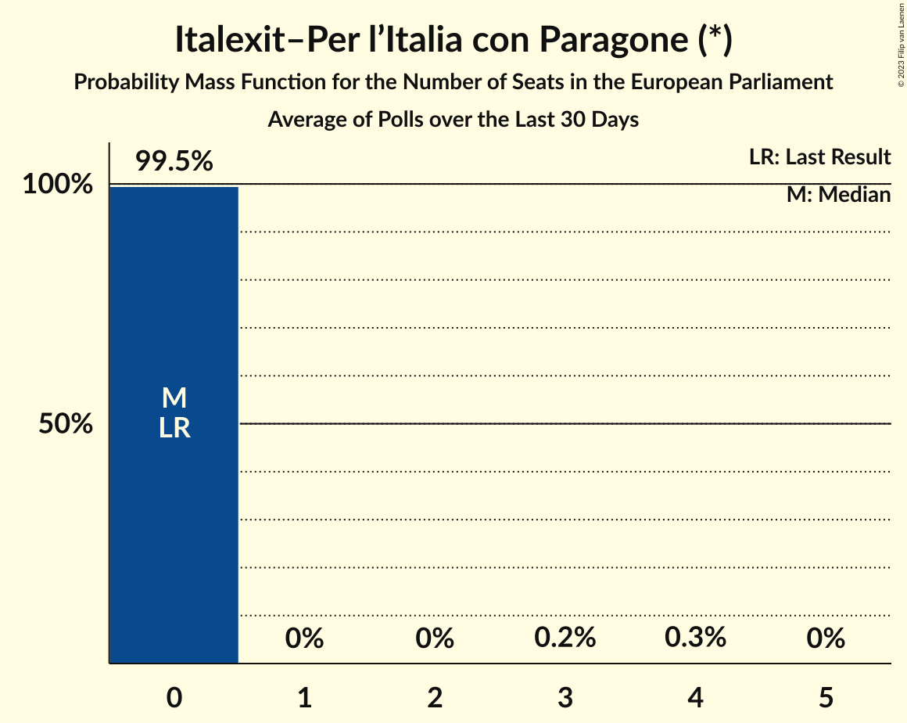

| Number of Seats | Probability | Accumulated | Special Marks |
|:---------------:|:-----------:|:-----------:|:-------------:|
| 0 | 99.5% | 100% | Last Result, Median |
| 1 | 0% | 0.5% |  |
| 2 | 0% | 0.5% |  |
| 3 | 0.2% | 0.5% |  |
| 4 | 0.3% | 0.3% |  |
| 5 | 0% | 0% |  |

### Insieme per il Futuro (NI)

*For a full overview of the results for this party, see the [Insieme per il Futuro (NI)](party-insiemeperilfuturoni.html) page.*

### Impegno Civico (NI)

*For a full overview of the results for this party, see the [Impegno Civico (NI)](party-impegnociviconi.html) page.*

### Alleanza Verdi e Sinistra (Greens/EFA)

*For a full overview of the results for this party, see the [Alleanza Verdi e Sinistra (Greens/EFA)](party-alleanzaverdiesinistragreensefa.html) page.*

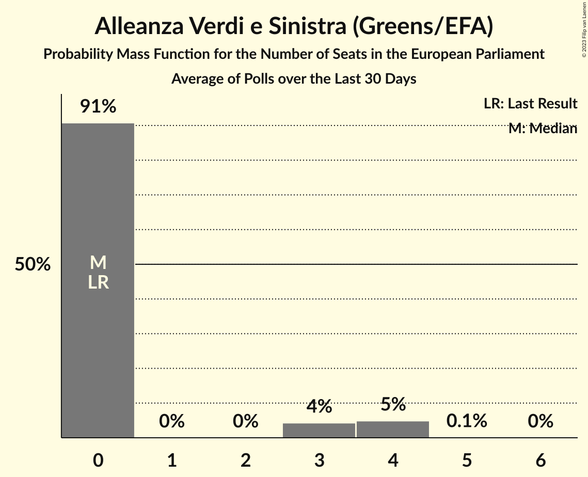

| Number of Seats | Probability | Accumulated | Special Marks |
|:---------------:|:-----------:|:-----------:|:-------------:|
| 0 | 91% | 100% | Last Result, Median |
| 1 | 0% | 9% |  |
| 2 | 0% | 9% |  |
| 3 | 4% | 9% |  |
| 4 | 5% | 5% |  |
| 5 | 0.1% | 0.1% |  |
| 6 | 0% | 0% |  |

### Azione–Italia Viva (RE)

*For a full overview of the results for this party, see the [Azione–Italia Viva (RE)](party-azione–italiavivare.html) page.*

| Number of Seats | Probability | Accumulated | Special Marks |
|:---------------:|:-----------:|:-----------:|:-------------:|
| 0 | 6% | 100% | Last Result |
| 1 | 0% | 94% |  |
| 2 | 0% | 94% |  |
| 3 | 0.9% | 94% |  |
| 4 | 22% | 93% |  |
| 5 | 20% | 71% |  |
| 6 | 28% | 51% | Median |
| 7 | 20% | 23% |  |
| 8 | 3% | 3% |  |
| 9 | 0.4% | 0.4% |  |
| 10 | 0% | 0% |  |

### Noi Moderati (EPP)

*For a full overview of the results for this party, see the [Noi Moderati (EPP)](party-noimoderatiepp.html) page.*

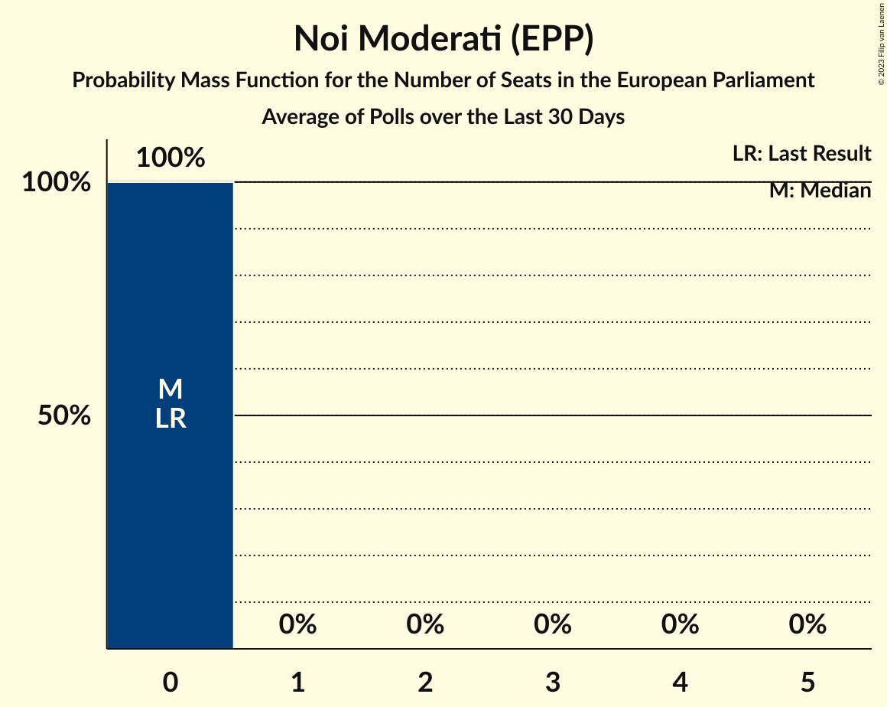

| Number of Seats | Probability | Accumulated | Special Marks |
|:---------------:|:-----------:|:-----------:|:-------------:|
| 0 | 100% | 100% | Last Result, Median |

### Unione Popolare (GUE/NGL)

*For a full overview of the results for this party, see the [Unione Popolare (GUE/NGL)](party-unionepopolareguengl.html) page.*

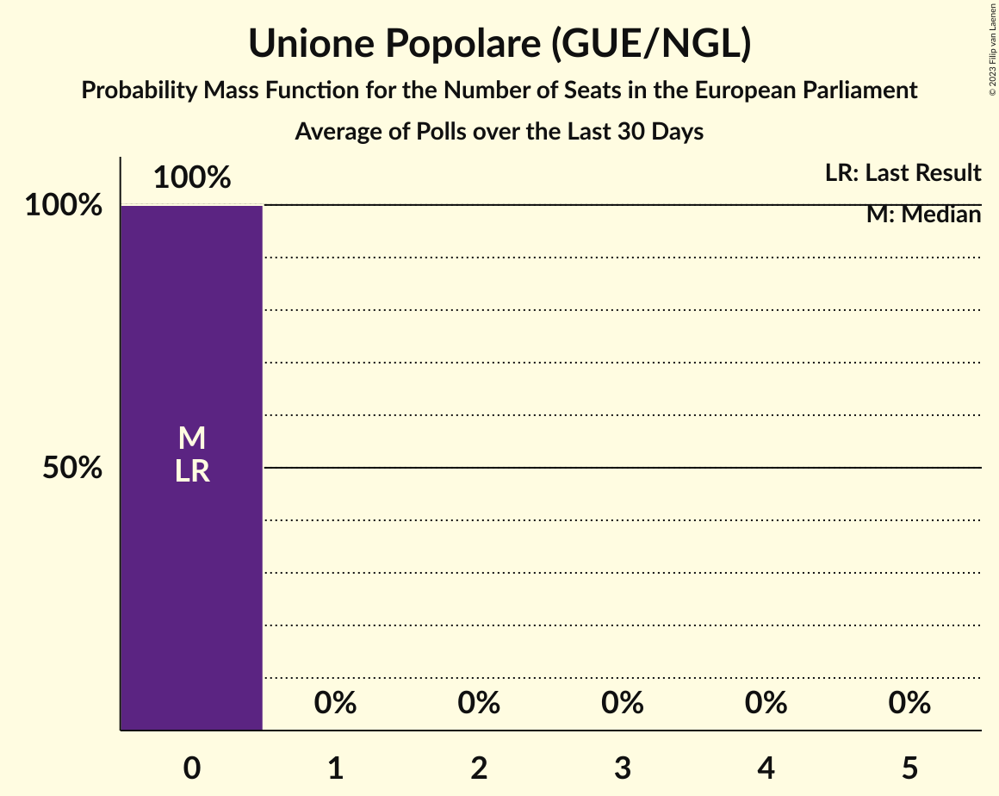

| Number of Seats | Probability | Accumulated | Special Marks |
|:---------------:|:-----------:|:-----------:|:-------------:|
| 0 | 100% | 100% | Last Result, Median |

### Italia Sovrana e Popolare (NI)

*For a full overview of the results for this party, see the [Italia Sovrana e Popolare (NI)](party-italiasovranaepopolareni.html) page.*

### Democrazia Sovrana e Popolare (NI)

*For a full overview of the results for this party, see the [Democrazia Sovrana e Popolare (NI)](party-democraziasovranaepopolareni.html) page.*

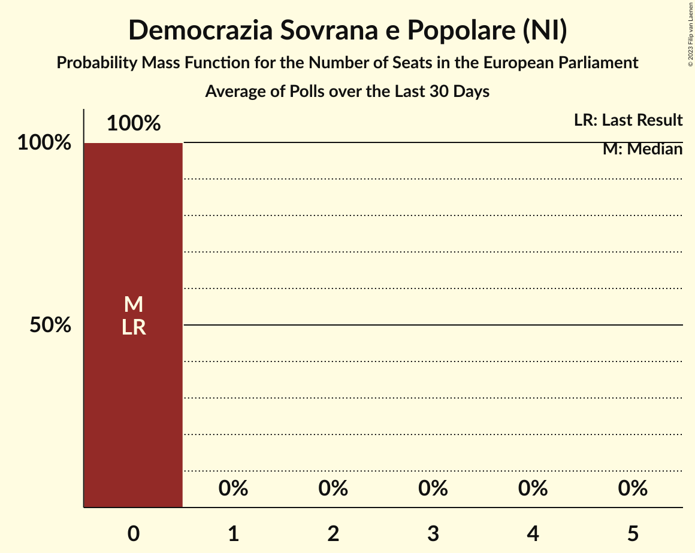

| Number of Seats | Probability | Accumulated | Special Marks |
|:---------------:|:-----------:|:-----------:|:-------------:|
| 0 | 100% | 100% | Last Result, Median |

## Coalitions

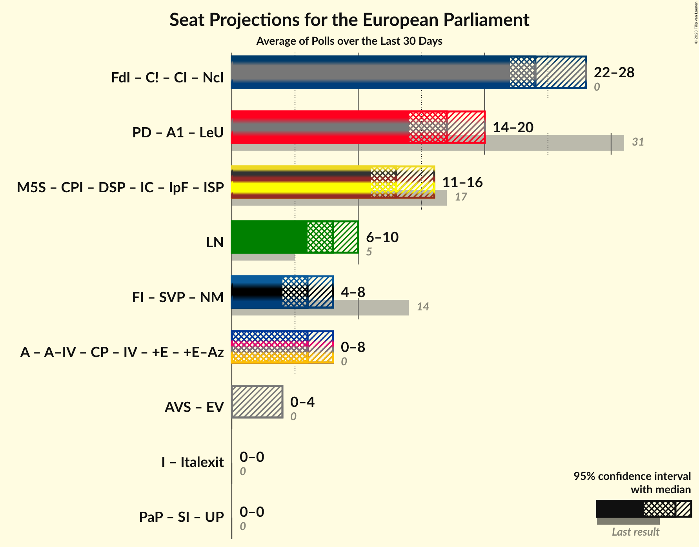

### Confidence Intervals

| Coalition | Last Result | Median | Majority? | 80% Confidence Interval | 90% Confidence Interval | 95% Confidence Interval | 99% Confidence Interval |
|:---------:|:-----------:|:------:|:---------:|:-----------------------:|:-----------------------:|:-----------------------:|:-----------------------:|
| Fratelli d’Italia (ECR) – Cambiamo! (ECR) – Coraggio Italia (ECR) – Noi con l’Italia (ECR) | 0 | 24 | 0% | 23–27 | 22–27 | 22–28 | 21–29 |
| Partito Democratico (S&D) – Articolo Uno (S&D) – Liberi e Uguali (S&D) | 31 | 17 | 0% | 15–19 | 15–19 | 14–20 | 13–21 |
| Movimento 5 Stelle (NI) – CasaPound Italia (NI) – Democrazia Sovrana e Popolare (NI) – Impegno Civico (NI) – Insieme per il Futuro (NI) – Italia Sovrana e Popolare (NI) | 17 | 13 | 0% | 12–15 | 11–15 | 11–16 | 10–17 |
| Lega Nord (ID) | 5 | 8 | 0% | 6–9 | 6–9 | 6–10 | 5–10 |
| Forza Italia (EPP) – Südtiroler Volkspartei (EPP) – Noi Moderati (EPP) | 14 | 6 | 0% | 5–7 | 5–7 | 4–8 | 4–8 |
| Azione (RE) – Azione–Italia Viva (RE) – Civica Popolare (RE) – Italia Viva (RE) – Più Europa (RE) – Più Europa–Azione (RE) | 0 | 6 | 0% | 4–7 | 0–8 | 0–8 | 0–9 |
| Alleanza Verdi e Sinistra (Greens/EFA) – Europa Verde (Greens/EFA) | 0 | 0 | 0% | 0 | 0–3 | 0–4 | 0–4 |
| Insieme (*) – Italexit–Per l’Italia con Paragone (*) | 0 | 0 | 0% | 0 | 0 | 0 | 0 |
| Potere al Popolo (GUE/NGL) – Sinistra Italiana (GUE/NGL) – Unione Popolare (GUE/NGL) | 0 | 0 | 0% | 0 | 0 | 0 | 0 |

### Fratelli d’Italia (ECR) – Cambiamo! (ECR) – Coraggio Italia (ECR) – Noi con l’Italia (ECR)

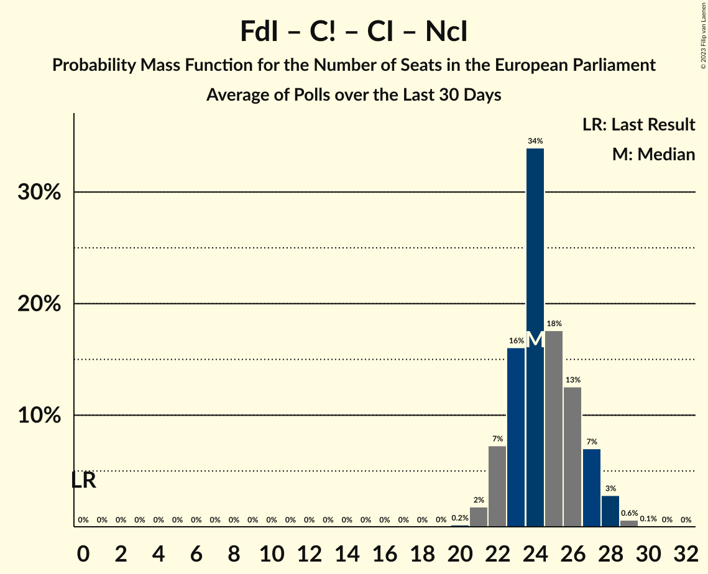

| Number of Seats | Probability | Accumulated | Special Marks |
|:---------------:|:-----------:|:-----------:|:-------------:|
| 0 | 0% | 100% | Last Result |
| 1 | 0% | 100% |  |
| 2 | 0% | 100% |  |
| 3 | 0% | 100% |  |
| 4 | 0% | 100% |  |
| 5 | 0% | 100% |  |
| 6 | 0% | 100% |  |
| 7 | 0% | 100% |  |
| 8 | 0% | 100% |  |
| 9 | 0% | 100% |  |
| 10 | 0% | 100% |  |
| 11 | 0% | 100% |  |
| 12 | 0% | 100% |  |
| 13 | 0% | 100% |  |
| 14 | 0% | 100% |  |
| 15 | 0% | 100% |  |
| 16 | 0% | 100% |  |
| 17 | 0% | 100% |  |
| 18 | 0% | 100% |  |
| 19 | 0% | 100% |  |
| 20 | 0.2% | 100% |  |
| 21 | 2% | 99.8% |  |
| 22 | 7% | 98% |  |
| 23 | 16% | 91% |  |
| 24 | 34% | 75% | Median |
| 25 | 18% | 41% |  |
| 26 | 13% | 23% |  |
| 27 | 7% | 11% |  |
| 28 | 3% | 4% |  |
| 29 | 0.6% | 0.7% |  |
| 30 | 0.1% | 0.1% |  |
| 31 | 0% | 0% |  |

### Partito Democratico (S&D) – Articolo Uno (S&D) – Liberi e Uguali (S&D)

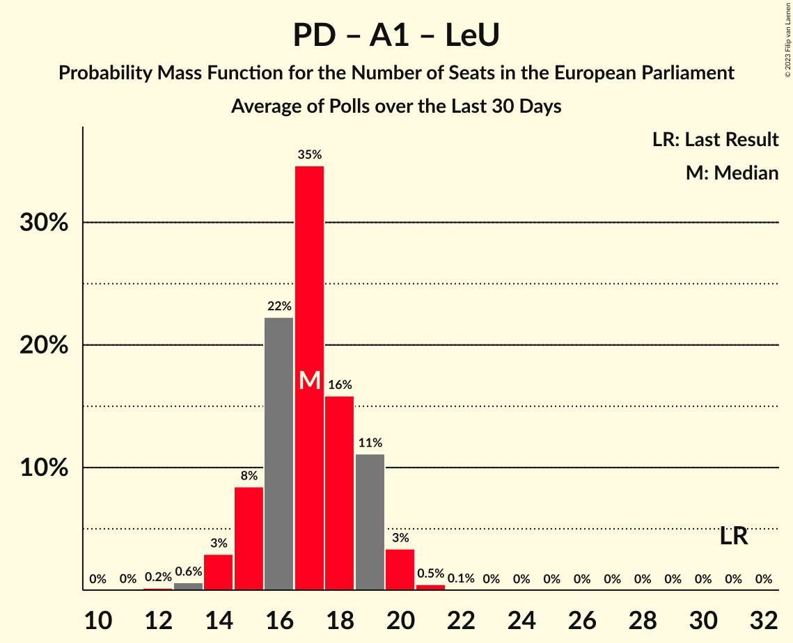

| Number of Seats | Probability | Accumulated | Special Marks |
|:---------------:|:-----------:|:-----------:|:-------------:|
| 12 | 0.2% | 100% |  |
| 13 | 0.6% | 99.8% |  |
| 14 | 3% | 99.2% |  |
| 15 | 8% | 96% |  |
| 16 | 22% | 88% |  |
| 17 | 35% | 66% | Median |
| 18 | 16% | 31% |  |
| 19 | 11% | 15% |  |
| 20 | 3% | 4% |  |
| 21 | 0.5% | 0.5% |  |
| 22 | 0.1% | 0.1% |  |
| 23 | 0% | 0% |  |
| 24 | 0% | 0% |  |
| 25 | 0% | 0% |  |
| 26 | 0% | 0% |  |
| 27 | 0% | 0% |  |
| 28 | 0% | 0% |  |
| 29 | 0% | 0% |  |
| 30 | 0% | 0% |  |
| 31 | 0% | 0% | Last Result |

### Movimento 5 Stelle (NI) – CasaPound Italia (NI) – Democrazia Sovrana e Popolare (NI) – Impegno Civico (NI) – Insieme per il Futuro (NI) – Italia Sovrana e Popolare (NI)

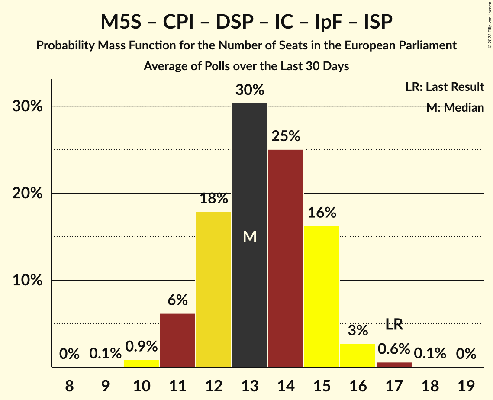

| Number of Seats | Probability | Accumulated | Special Marks |
|:---------------:|:-----------:|:-----------:|:-------------:|
| 9 | 0.1% | 100% |  |
| 10 | 0.9% | 99.9% |  |
| 11 | 6% | 99.1% |  |
| 12 | 18% | 93% |  |
| 13 | 30% | 75% | Median |
| 14 | 25% | 45% |  |
| 15 | 16% | 20% |  |
| 16 | 3% | 3% |  |
| 17 | 0.6% | 0.7% | Last Result |
| 18 | 0.1% | 0.1% |  |
| 19 | 0% | 0% |  |

### Lega Nord (ID)

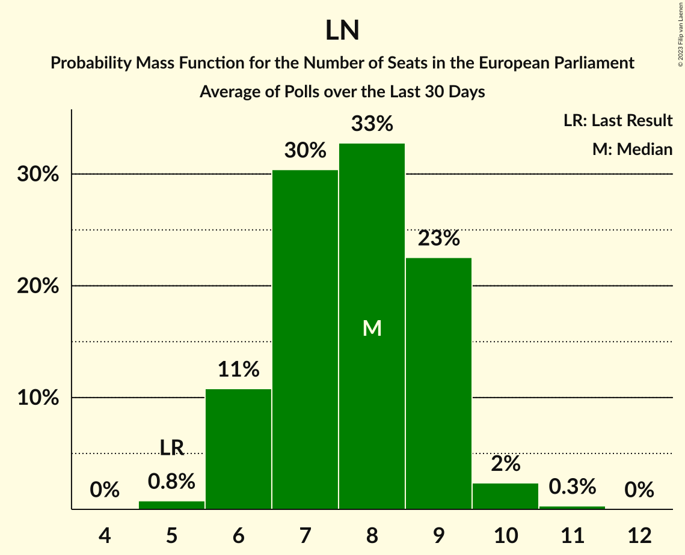

| Number of Seats | Probability | Accumulated | Special Marks |
|:---------------:|:-----------:|:-----------:|:-------------:|
| 5 | 0.8% | 100% | Last Result |
| 6 | 11% | 99.2% |  |
| 7 | 30% | 88% |  |
| 8 | 33% | 58% | Median |
| 9 | 23% | 25% |  |
| 10 | 2% | 3% |  |
| 11 | 0.3% | 0.3% |  |
| 12 | 0% | 0% |  |

### Forza Italia (EPP) – Südtiroler Volkspartei (EPP) – Noi Moderati (EPP)

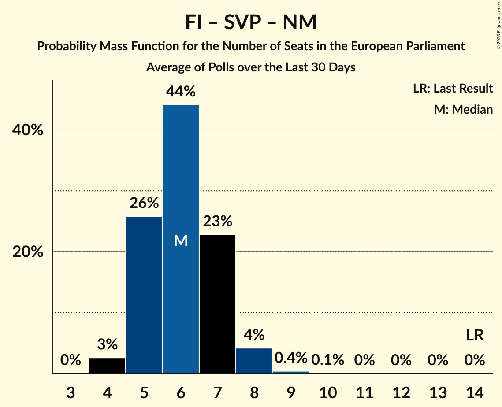

| Number of Seats | Probability | Accumulated | Special Marks |
|:---------------:|:-----------:|:-----------:|:-------------:|
| 4 | 3% | 100% |  |
| 5 | 26% | 97% | Median |
| 6 | 44% | 72% |  |
| 7 | 23% | 27% |  |
| 8 | 4% | 5% |  |
| 9 | 0.4% | 0.5% |  |
| 10 | 0.1% | 0.1% |  |
| 11 | 0% | 0% |  |
| 12 | 0% | 0% |  |
| 13 | 0% | 0% |  |
| 14 | 0% | 0% | Last Result |

### Azione (RE) – Azione–Italia Viva (RE) – Civica Popolare (RE) – Italia Viva (RE) – Più Europa (RE) – Più Europa–Azione (RE)

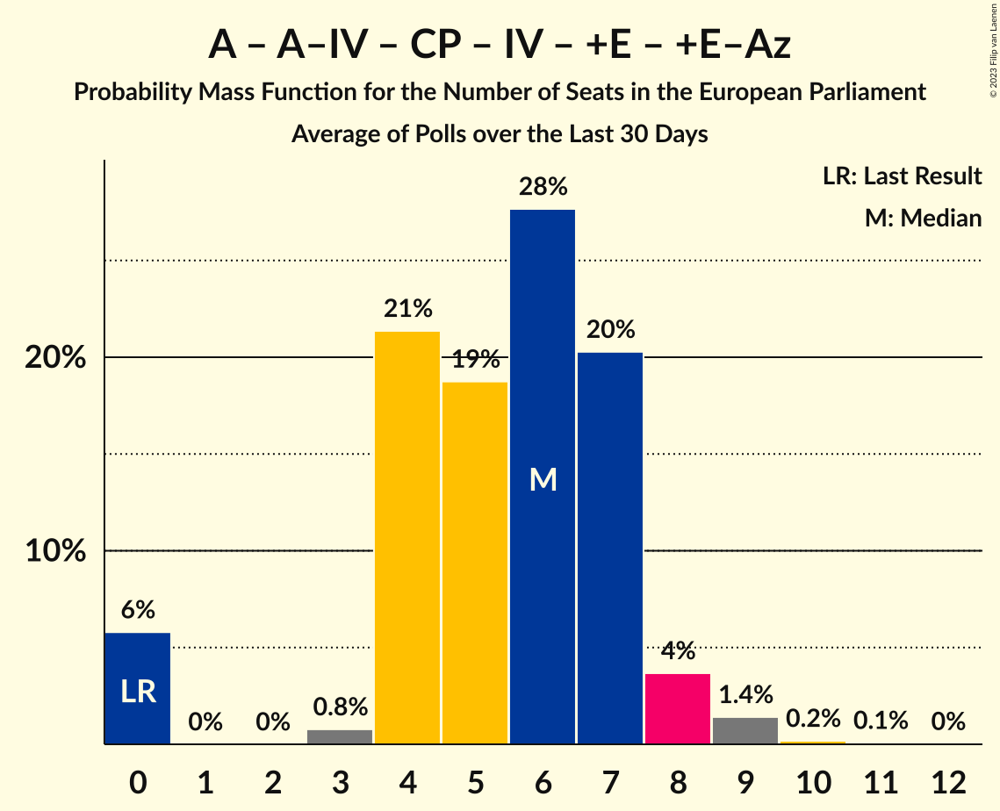

| Number of Seats | Probability | Accumulated | Special Marks |
|:---------------:|:-----------:|:-----------:|:-------------:|
| 0 | 6% | 100% | Last Result |
| 1 | 0% | 94% |  |
| 2 | 0% | 94% |  |
| 3 | 0.8% | 94% |  |
| 4 | 21% | 93% |  |
| 5 | 19% | 72% |  |
| 6 | 28% | 53% | Median |
| 7 | 20% | 26% |  |
| 8 | 4% | 5% |  |
| 9 | 1.4% | 2% |  |
| 10 | 0.2% | 0.3% |  |
| 11 | 0.1% | 0.1% |  |
| 12 | 0% | 0% |  |

### Alleanza Verdi e Sinistra (Greens/EFA) – Europa Verde (Greens/EFA)

| Number of Seats | Probability | Accumulated | Special Marks |
|:---------------:|:-----------:|:-----------:|:-------------:|
| 0 | 91% | 100% | Last Result, Median |
| 1 | 0% | 9% |  |
| 2 | 0% | 9% |  |
| 3 | 4% | 9% |  |
| 4 | 5% | 5% |  |
| 5 | 0.1% | 0.1% |  |
| 6 | 0% | 0% |  |

### Insieme (*) – Italexit–Per l’Italia con Paragone (*)

| Number of Seats | Probability | Accumulated | Special Marks |
|:---------------:|:-----------:|:-----------:|:-------------:|
| 0 | 99.6% | 100% | Last Result, Median |
| 1 | 0% | 0.4% |  |
| 2 | 0% | 0.4% |  |
| 3 | 0.2% | 0.4% |  |
| 4 | 0.2% | 0.2% |  |
| 5 | 0% | 0% |  |

### Potere al Popolo (GUE/NGL) – Sinistra Italiana (GUE/NGL) – Unione Popolare (GUE/NGL)

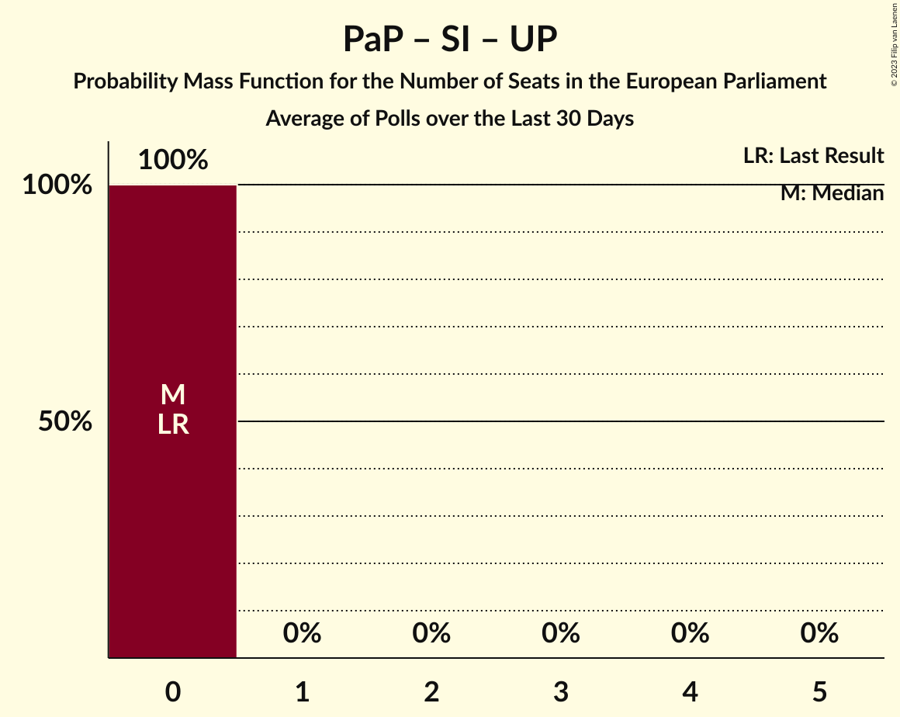

| Number of Seats | Probability | Accumulated | Special Marks |
|:---------------:|:-----------:|:-----------:|:-------------:|
| 0 | 100% | 100% | Last Result, Median |

## Technical Information

+ **Number of polls included in this average:** 13
+ **Lowest number of simulations done in a poll included in this average:** 1,048,576
+ **Total number of simulations done in the polls included in this average:** 13,631,488
+ **Error estimate:** 4.69%
