# Poll Average

<a href="#voting-intentions">Voting Intentions</a> | <a href="#seats">Seats</a> | <a href="#coalitions">Coalitions</a> | <a href="#technical-information">Technical Information</a>

## Summary

The table below lists the polls on which the average is based. They are the most recent polls (less than 30 days old) registered and analyzed so far.

| Period     | Polling firm/Commissioner(s) | PD | M5S | FI | LN | FdI | SVP | CPI | CP | I | NcI | +E | LeU | PaP | A | EV | C! | IV | CI | A1 | SI | +E–Az | Italexit | IpF | IC | AVS | A–IV | NM | UP | ISP | DSP | PP | SUE | Lib |
|:----------:|:----------------------------:|:--:|:--:|:--:|:--:|:--:|:--:|:--:|:--:|:--:|:--:|:--:|:--:|:--:|:--:|:--:|:--:|:--:|:--:|:--:|:--:|:--:|:--:|:--:|:--:|:--:|:--:|:--:|:--:|:--:|:--:|:--:|:--:|:--:|
| 26 May 2019 | General Election | 40.8%   31 | 21.2%   17 | 16.8%   13 | 6.2%   5 | 3.7%   0 | 0.5%   1 | 0.0%   0 | 0.0%   0 | 0.0%   0 | 0.0%   0 | 0.0%   0 | 0.0%   0 | 0.0%   0 | 0.0%   0 | 0.0%   0 | 0.0%   0 | 0.0%   0 | 0.0%   0 | 0.0%   0 | 0.0%   0 | 0.0%   0 | 0.0%   0 | 0.0%   0 | 0.0%   0 | 0.0%   0 | 0.0%   0 | 0.0%   0 | 0.0%   0 | 0.0%   0 | 0.0%   0 | 0.0%   0 | 0.0%   0 | 0.0%   0 |
| N/A | Poll Average | 18–24%   14–20 | 14–19%   11–16 | 6–10%   4–8 | 7–11%   5–9 | 24–31%   20–26 | N/A   N/A | N/A   N/A | N/A   N/A | N/A   N/A | N/A   N/A | N/A   N/A | N/A   N/A | N/A   N/A | 3–6%   0–4 | 2–4%   0–4 | N/A   N/A | N/A   N/A | N/A   N/A | N/A   N/A | 1–3%   0–2 | N/A   N/A | N/A   N/A | N/A   N/A | N/A   N/A | N/A   N/A | N/A   N/A | N/A   N/A | 1–4%   0 | N/A   N/A | 1–2%   0 | 0–1%   0–1 | 3–6%   0–5 | 1–3%   0 |
| [15 May 2024](2024-05-15-Euromedia.html) | Euromedia   Rai 1 | 18–23%   14–20 | 14–20%   11–16 | 7–11%   4–8 | 7–11%   6–10 | 24–30%   20–27 | N/A   N/A | N/A   N/A | N/A   N/A | N/A   N/A | N/A   N/A | N/A   N/A | N/A   N/A | N/A   N/A | 3–6%   0–5 | 1–4%   0–4 | N/A   N/A | N/A   N/A | N/A   N/A | N/A   N/A | 1–3%   0–2 | N/A   N/A | N/A   N/A | N/A   N/A | N/A   N/A | N/A   N/A | N/A   N/A | N/A   N/A | 2–4%   0–3 | N/A   N/A | N/A   N/A | 0–1%   0–1 | 3–6%   0–5 | 1–3%   0 |
| [14 May 2024](2024-05-14-Bidimedia.html) | Bidimedia | 19–24%   15–20 | 13–18%   11–15 | 7–10%   5–7 | 7–11%   6–9 | 25–30%   21–25 | N/A   N/A | N/A   N/A | N/A   N/A | N/A   N/A | N/A   N/A | N/A   N/A | N/A   N/A | N/A   N/A | 3–5%   0–4 | 2–4%   0–4 | N/A   N/A | N/A   N/A | N/A   N/A | N/A   N/A | 1–2%   0–2 | N/A   N/A | N/A   N/A | N/A   N/A | N/A   N/A | N/A   N/A | N/A   N/A | N/A   N/A | 1–3%   0 | N/A   N/A | N/A   N/A | 0–1%   0–1 | 4–6%   0–5 | 1–3%   0 |
| [12 May 2024](2024-05-12-Quorum–YouTrend.html) | Quorum – YouTrend   Sky TG24 | 17–25%   14–20 | 13–20%   11–16 | 6–11%   4–7 | 6–11%   5–9 | 23–31%   19–25 | N/A   N/A | N/A   N/A | N/A   N/A | N/A   N/A | N/A   N/A | N/A   N/A | N/A   N/A | N/A   N/A | 3–6%   0–4 | 1–4%   0–3 | N/A   N/A | N/A   N/A | N/A   N/A | N/A   N/A | 1–3%   0–3 | N/A   N/A | N/A   N/A | N/A   N/A | N/A   N/A | N/A   N/A | N/A   N/A | N/A   N/A | 1–3%   0 | N/A   N/A | N/A   N/A | 0–1%   0–1 | 3–7%   0–6 | 0–2%   0 |
| [30 April 2024](2024-04-30-Eumetra.html) | Eumetra   La7 | 18–23%   15–19 | 14–19%   11–16 | 7–11%   5–8 | 7–11%   5–8 | 25–31%   20–26 | N/A   N/A | N/A   N/A | N/A   N/A | N/A   N/A | N/A   N/A | N/A   N/A | N/A   N/A | N/A   N/A | 3–6%   0–4 | 1–4%   0–3 | N/A   N/A | N/A   N/A | N/A   N/A | N/A   N/A | 1–3%   0–2 | N/A   N/A | N/A   N/A | N/A   N/A | N/A   N/A | N/A   N/A | N/A   N/A | N/A   N/A | 1–3%   0 | N/A   N/A | 1–2%   0 | 0–1%   0–1 | 3–6%   0–5 | 1–4%   0 |
| [17–18 April 2024](2024-04-18-Demos.html) | Demos | 18–23%   14–18 | 14–19%   11–15 | 6–10%   4–7 | 7–10%   5–8 | 25–31%   19–25 | N/A   N/A | N/A   N/A | N/A   N/A | N/A   N/A | N/A   N/A | N/A   N/A | N/A   N/A | N/A   N/A | 3–5%   0–4 | 2–3%   0–3 | N/A   N/A | N/A   N/A | N/A   N/A | N/A   N/A | 1–2%   0–2 | N/A   N/A | N/A   N/A | N/A   N/A | N/A   N/A | N/A   N/A | N/A   N/A | N/A   N/A | N/A   N/A | N/A   N/A | N/A   N/A | 0–1%   0–1 | 3–6%   0–4 | N/A   N/A |
| 26 May 2019 | General Election | 40.8%   31 | 21.2%   17 | 16.8%   13 | 6.2%   5 | 3.7%   0 | 0.5%   1 | 0.0%   0 | 0.0%   0 | 0.0%   0 | 0.0%   0 | 0.0%   0 | 0.0%   0 | 0.0%   0 | 0.0%   0 | 0.0%   0 | 0.0%   0 | 0.0%   0 | 0.0%   0 | 0.0%   0 | 0.0%   0 | 0.0%   0 | 0.0%   0 | 0.0%   0 | 0.0%   0 | 0.0%   0 | 0.0%   0 | 0.0%   0 | 0.0%   0 | 0.0%   0 | 0.0%   0 | 0.0%   0 | 0.0%   0 | 0.0%   0 |

Only polls for which at least the sample size has been published are included in the table above.

**Legend:**
+ **Top half of each row:** Voting intentions (95% confidence interval)
+ **Bottom half of each row:** Seat projections for the European Parliament (95% confidence interval)
+ **PD:** Partito Democratico (S&D)
+ **M5S:** Movimento 5 Stelle (NI)
+ **FI:** Forza Italia (EPP)
+ **LN:** Lega Nord (ID)
+ **FdI:** Fratelli d’Italia (ECR)
+ **SVP:** Südtiroler Volkspartei (EPP)
+ **CPI:** CasaPound Italia (NI)
+ **CP:** Civica Popolare (RE)
+ **I:** Insieme (*)
+ **NcI:** Noi con l’Italia (ECR)
+ **+E:** Più Europa (RE)
+ **LeU:** Liberi e Uguali (S&D)
+ **PaP:** Potere al Popolo (GUE/NGL)
+ **A:** Azione (RE)
+ **EV:** Europa Verde (Greens/EFA)
+ **C!:** Cambiamo! (ECR)
+ **IV:** Italia Viva (RE)
+ **CI:** Coraggio Italia (ECR)
+ **A1:** Articolo Uno (S&D)
+ **SI:** Sinistra Italiana (GUE/NGL)
+ **+E–Az:** Più Europa–Azione (RE)
+ **Italexit:** Italexit–Per l’Italia con Paragone (*)
+ **IpF:** Insieme per il Futuro (NI)
+ **IC:** Impegno Civico (NI)
+ **AVS:** Alleanza Verdi e Sinistra (Greens/EFA)
+ **A–IV:** Azione–Italia Viva (RE)
+ **NM:** Noi Moderati (EPP)
+ **UP:** Pace Terra Dignità (GUE/NGL)
+ **ISP:** Italia Sovrana e Popolare (NI)
+ **DSP:** Democrazia Sovrana e Popolare (NI)
+ **PP:** Partito Progressista (*)
+ **SUE:** Stati Uniti d’Europa (RE)
+ **Lib:** Libertà (*)
+ **N/A (single party):** Party not included the published results
+ **N/A (entire row):** Calculation for this opinion poll not started yet

## Voting Intentions

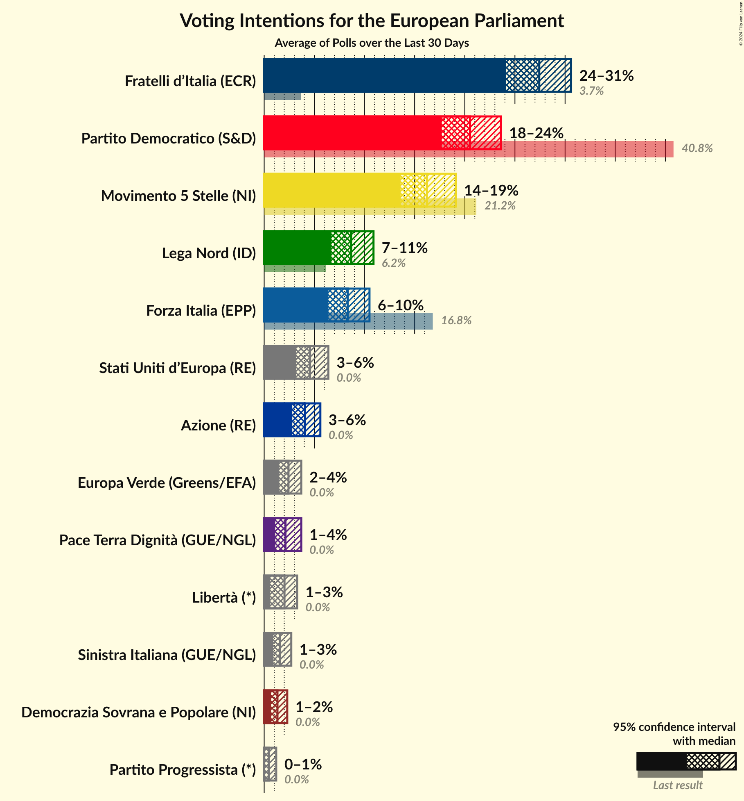

### Confidence Intervals

| Party | Last Result | Median | 80% Confidence Interval | 90% Confidence Interval | 95% Confidence Interval | 99% Confidence Interval |
|:-----:|:-----------:|:------:|:-----------------------:|:-----------------------:|:-----------------------:|:-----------------------:|
| <a href="#partito-democratico-(s&d)">Partito Democratico (S&D)</a> | 40.8% | 20.5% | 18.7–22.5% |18.2–23.1% | 17.7–23.6% | 16.9–24.8% |
| <a href="#movimento-5-stelle-(ni)">Movimento 5 Stelle (NI)</a> | 21.2% | 16.2% | 14.5–18.1% |14.0–18.6% | 13.6–19.1% | 12.8–20.1% |
| <a href="#forza-italia-(epp)">Forza Italia (EPP)</a> | 16.8% | 8.3% | 7.1–9.7% |6.7–10.1% | 6.4–10.5% | 5.8–11.3% |
| <a href="#lega-nord-(id)">Lega Nord (ID)</a> | 6.2% | 8.7% | 7.4–10.1% |7.0–10.5% | 6.7–10.9% | 6.1–11.8% |
| <a href="#fratelli-d’italia-(ecr)">Fratelli d’Italia (ECR)</a> | 3.7% | 27.4% | 25.3–29.5% |24.7–30.1% | 24.1–30.6% | 22.9–31.7% |
| <a href="#südtiroler-volkspartei-(epp)">Südtiroler Volkspartei (EPP)</a> | 0.5% | N/A | N/A |N/A | N/A | N/A |
| <a href="#casapound-italia-(ni)">CasaPound Italia (NI)</a> | 0.0% | N/A | N/A |N/A | N/A | N/A |
| <a href="#civica-popolare-(re)">Civica Popolare (RE)</a> | 0.0% | N/A | N/A |N/A | N/A | N/A |
| <a href="#insieme-(*)">Insieme (*)</a> | 0.0% | N/A | N/A |N/A | N/A | N/A |
| <a href="#noi-con-l’italia-(ecr)">Noi con l’Italia (ECR)</a> | 0.0% | N/A | N/A |N/A | N/A | N/A |
| <a href="#più-europa-(re)">Più Europa (RE)</a> | 0.0% | N/A | N/A |N/A | N/A | N/A |
| <a href="#liberi-e-uguali-(s&d)">Liberi e Uguali (S&D)</a> | 0.0% | N/A | N/A |N/A | N/A | N/A |
| <a href="#potere-al-popolo-(gue/ngl)">Potere al Popolo (GUE/NGL)</a> | 0.0% | N/A | N/A |N/A | N/A | N/A |
| <a href="#azione-(re)">Azione (RE)</a> | 0.0% | 4.1% | 3.2–5.0% |3.0–5.4% | 2.8–5.6% | 2.5–6.3% |
| <a href="#europa-verde-(greens/efa)">Europa Verde (Greens/EFA)</a> | 0.0% | 2.4% | 1.8–3.2% |1.6–3.4% | 1.5–3.7% | 1.2–4.2% |
| <a href="#cambiamo!-(ecr)">Cambiamo! (ECR)</a> | 0.0% | N/A | N/A |N/A | N/A | N/A |
| <a href="#italia-viva-(re)">Italia Viva (RE)</a> | 0.0% | N/A | N/A |N/A | N/A | N/A |
| <a href="#coraggio-italia-(ecr)">Coraggio Italia (ECR)</a> | 0.0% | N/A | N/A |N/A | N/A | N/A |
| <a href="#articolo-uno-(s&d)">Articolo Uno (S&D)</a> | 0.0% | N/A | N/A |N/A | N/A | N/A |
| <a href="#sinistra-italiana-(gue/ngl)">Sinistra Italiana (GUE/NGL)</a> | 0.0% | 1.6% | 1.1–2.2% |1.0–2.5% | 0.9–2.7% | 0.7–3.2% |
| <a href="#più-europa–azione-(re)">Più Europa–Azione (RE)</a> | 0.0% | N/A | N/A |N/A | N/A | N/A |
| <a href="#italexit–per-l’italia-con-paragone-(*)">Italexit–Per l’Italia con Paragone (*)</a> | 0.0% | N/A | N/A |N/A | N/A | N/A |
| <a href="#insieme-per-il-futuro-(ni)">Insieme per il Futuro (NI)</a> | 0.0% | N/A | N/A |N/A | N/A | N/A |
| <a href="#impegno-civico-(ni)">Impegno Civico (NI)</a> | 0.0% | N/A | N/A |N/A | N/A | N/A |
| <a href="#alleanza-verdi-e-sinistra-(greens/efa)">Alleanza Verdi e Sinistra (Greens/EFA)</a> | 0.0% | N/A | N/A |N/A | N/A | N/A |
| <a href="#azione–italia-viva-(re)">Azione–Italia Viva (RE)</a> | 0.0% | N/A | N/A |N/A | N/A | N/A |
| <a href="#noi-moderati-(epp)">Noi Moderati (EPP)</a> | 0.0% | N/A | N/A |N/A | N/A | N/A |
| <a href="#pace-terra-dignità-(gue/ngl)">Pace Terra Dignità (GUE/NGL)</a> | 0.0% | 2.1% | 1.4–3.1% |1.3–3.4% | 1.1–3.7% | 0.9–4.2% |
| <a href="#italia-sovrana-e-popolare-(ni)">Italia Sovrana e Popolare (NI)</a> | 0.0% | N/A | N/A |N/A | N/A | N/A |
| <a href="#democrazia-sovrana-e-popolare-(ni)">Democrazia Sovrana e Popolare (NI)</a> | 0.0% | 1.3% | 0.9–1.9% |0.8–2.1% | 0.7–2.3% | 0.5–2.7% |
| <a href="#partito-progressista-(*)">Partito Progressista (*)</a> | 0.0% | 0.5% | 0.2–0.9% |0.2–1.0% | 0.1–1.2% | 0.1–1.5% |
| <a href="#stati-uniti-d’europa-(re)">Stati Uniti d’Europa (RE)</a> | 0.0% | 4.6% | 3.7–5.7% |3.4–6.0% | 3.2–6.4% | 2.9–7.1% |
| <a href="#libertà-(*)">Libertà (*)</a> | 0.0% | 2.0% | 1.0–2.8% |0.8–3.1% | 0.6–3.3% | 0.4–3.7% |

### Partito Democratico (S&D)

*For a full overview of the results for this party, see the [Partito Democratico (S&D)](party-partitodemocraticosd.html) page.*

| Voting Intentions | Probability | Accumulated | Special Marks |
|:-----------------:|:-----------:|:-----------:|:-------------:|
| 14.5–15.5% | 0% | 100% |  |
| 15.5–16.5% | 0.2% | 100% |  |
| 16.5–17.5% | 2% | 99.8% |  |
| 17.5–18.5% | 6% | 98% |  |
| 18.5–19.5% | 17% | 92% |  |
| 19.5–20.5% | 25% | 75% |  |
| 20.5–21.5% | 25% | 50% | Median |
| 21.5–22.5% | 16% | 25% |  |
| 22.5–23.5% | 6% | 9% |  |
| 23.5–24.5% | 2% | 3% |  |
| 24.5–25.5% | 0.5% | 0.7% |  |
| 25.5–26.5% | 0.1% | 0.2% |  |
| 26.5–27.5% | 0% | 0% |  |
| 27.5–28.5% | 0% | 0% |  |
| 28.5–29.5% | 0% | 0% |  |
| 29.5–30.5% | 0% | 0% |  |
| 30.5–31.5% | 0% | 0% |  |
| 31.5–32.5% | 0% | 0% |  |
| 32.5–33.5% | 0% | 0% |  |
| 33.5–34.5% | 0% | 0% |  |
| 34.5–35.5% | 0% | 0% |  |
| 35.5–36.5% | 0% | 0% |  |
| 36.5–37.5% | 0% | 0% |  |
| 37.5–38.5% | 0% | 0% |  |
| 38.5–39.5% | 0% | 0% |  |
| 39.5–40.5% | 0% | 0% |  |
| 40.5–41.5% | 0% | 0% | Last Result |

### Movimento 5 Stelle (NI)

*For a full overview of the results for this party, see the [Movimento 5 Stelle (NI)](party-movimento5stelleni.html) page.*

| Voting Intentions | Probability | Accumulated | Special Marks |
|:-----------------:|:-----------:|:-----------:|:-------------:|
| 10.5–11.5% | 0% | 100% |  |
| 11.5–12.5% | 0.2% | 100% |  |
| 12.5–13.5% | 2% | 99.8% |  |
| 13.5–14.5% | 8% | 98% |  |
| 14.5–15.5% | 20% | 89% |  |
| 15.5–16.5% | 28% | 69% | Median |
| 16.5–17.5% | 23% | 41% |  |
| 17.5–18.5% | 12% | 18% |  |
| 18.5–19.5% | 4% | 5% |  |
| 19.5–20.5% | 1.0% | 1.3% |  |
| 20.5–21.5% | 0.2% | 0.2% | Last Result |
| 21.5–22.5% | 0% | 0% |  |

### Forza Italia (EPP)

*For a full overview of the results for this party, see the [Forza Italia (EPP)](party-forzaitaliaepp.html) page.*

| Voting Intentions | Probability | Accumulated | Special Marks |
|:-----------------:|:-----------:|:-----------:|:-------------:|
| 3.5–4.5% | 0% | 100% |  |
| 4.5–5.5% | 0.2% | 100% |  |
| 5.5–6.5% | 3% | 99.8% |  |
| 6.5–7.5% | 18% | 97% |  |
| 7.5–8.5% | 38% | 79% | Median |
| 8.5–9.5% | 29% | 41% |  |
| 9.5–10.5% | 10% | 12% |  |
| 10.5–11.5% | 2% | 2% |  |
| 11.5–12.5% | 0.2% | 0.3% |  |
| 12.5–13.5% | 0% | 0% |  |
| 13.5–14.5% | 0% | 0% |  |
| 14.5–15.5% | 0% | 0% |  |
| 15.5–16.5% | 0% | 0% |  |
| 16.5–17.5% | 0% | 0% | Last Result |

### Lega Nord (ID)

*For a full overview of the results for this party, see the [Lega Nord (ID)](party-leganordid.html) page.*

| Voting Intentions | Probability | Accumulated | Special Marks |
|:-----------------:|:-----------:|:-----------:|:-------------:|
| 3.5–4.5% | 0% | 100% |  |
| 4.5–5.5% | 0.1% | 100% |  |
| 5.5–6.5% | 1.5% | 99.9% | Last Result |
| 6.5–7.5% | 11% | 98% |  |
| 7.5–8.5% | 32% | 87% |  |
| 8.5–9.5% | 34% | 55% | Median |
| 9.5–10.5% | 16% | 21% |  |
| 10.5–11.5% | 4% | 5% |  |
| 11.5–12.5% | 0.7% | 0.8% |  |
| 12.5–13.5% | 0.1% | 0.1% |  |
| 13.5–14.5% | 0% | 0% |  |

### Fratelli d’Italia (ECR)

*For a full overview of the results for this party, see the [Fratelli d’Italia (ECR)](party-fratellid’italiaecr.html) page.*

| Voting Intentions | Probability | Accumulated | Special Marks |
|:-----------------:|:-----------:|:-----------:|:-------------:|
| 3.5–4.5% | 0% | 100% | Last Result |
| 4.5–5.5% | 0% | 100% |  |
| 5.5–6.5% | 0% | 100% |  |
| 6.5–7.5% | 0% | 100% |  |
| 7.5–8.5% | 0% | 100% |  |
| 8.5–9.5% | 0% | 100% |  |
| 9.5–10.5% | 0% | 100% |  |
| 10.5–11.5% | 0% | 100% |  |
| 11.5–12.5% | 0% | 100% |  |
| 12.5–13.5% | 0% | 100% |  |
| 13.5–14.5% | 0% | 100% |  |
| 14.5–15.5% | 0% | 100% |  |
| 15.5–16.5% | 0% | 100% |  |
| 16.5–17.5% | 0% | 100% |  |
| 17.5–18.5% | 0% | 100% |  |
| 18.5–19.5% | 0% | 100% |  |
| 19.5–20.5% | 0% | 100% |  |
| 20.5–21.5% | 0% | 100% |  |
| 21.5–22.5% | 0.2% | 99.9% |  |
| 22.5–23.5% | 0.9% | 99.7% |  |
| 23.5–24.5% | 3% | 98.8% |  |
| 24.5–25.5% | 8% | 96% |  |
| 25.5–26.5% | 17% | 87% |  |
| 26.5–27.5% | 24% | 71% | Median |
| 27.5–28.5% | 22% | 47% |  |
| 28.5–29.5% | 15% | 24% |  |
| 29.5–30.5% | 7% | 9% |  |
| 30.5–31.5% | 2% | 3% |  |
| 31.5–32.5% | 0.5% | 0.6% |  |
| 32.5–33.5% | 0.1% | 0.1% |  |
| 33.5–34.5% | 0% | 0% |  |

### Pace Terra Dignità (GUE/NGL)

*For a full overview of the results for this party, see the [Pace Terra Dignità (GUE/NGL)](party-paceterradignitàguengl.html) page.*

| Voting Intentions | Probability | Accumulated | Special Marks |
|:-----------------:|:-----------:|:-----------:|:-------------:|
| 0.0–0.5% | 0% | 100% | Last Result |
| 0.5–1.5% | 15% | 100% |  |
| 1.5–2.5% | 57% | 85% | Median |
| 2.5–3.5% | 24% | 28% |  |
| 3.5–4.5% | 4% | 4% |  |
| 4.5–5.5% | 0.2% | 0.2% |  |
| 5.5–6.5% | 0% | 0% |  |

### Azione (RE)

*For a full overview of the results for this party, see the [Azione (RE)](party-azionere.html) page.*

| Voting Intentions | Probability | Accumulated | Special Marks |
|:-----------------:|:-----------:|:-----------:|:-------------:|
| 0.0–0.5% | 0% | 100% | Last Result |
| 0.5–1.5% | 0% | 100% |  |
| 1.5–2.5% | 0.7% | 100% |  |
| 2.5–3.5% | 21% | 99.3% |  |
| 3.5–4.5% | 53% | 78% | Median |
| 4.5–5.5% | 22% | 25% |  |
| 5.5–6.5% | 3% | 3% |  |
| 6.5–7.5% | 0.2% | 0.2% |  |
| 7.5–8.5% | 0% | 0% |  |

### Libertà (*)

*For a full overview of the results for this party, see the [Libertà (*)](party-libertà.html) page.*

| Voting Intentions | Probability | Accumulated | Special Marks |
|:-----------------:|:-----------:|:-----------:|:-------------:|
| 0.0–0.5% | 2% | 100% | Last Result |
| 0.5–1.5% | 24% | 98% |  |
| 1.5–2.5% | 54% | 75% | Median |
| 2.5–3.5% | 20% | 21% |  |
| 3.5–4.5% | 1.0% | 1.0% |  |
| 4.5–5.5% | 0% | 0% |  |

### Stati Uniti d’Europa (RE)

*For a full overview of the results for this party, see the [Stati Uniti d’Europa (RE)](party-statiunitid’europare.html) page.*

| Voting Intentions | Probability | Accumulated | Special Marks |
|:-----------------:|:-----------:|:-----------:|:-------------:|
| 0.0–0.5% | 0% | 100% | Last Result |
| 0.5–1.5% | 0% | 100% |  |
| 1.5–2.5% | 0.1% | 100% |  |
| 2.5–3.5% | 7% | 99.9% |  |
| 3.5–4.5% | 41% | 92% |  |
| 4.5–5.5% | 38% | 51% | Median |
| 5.5–6.5% | 11% | 13% |  |
| 6.5–7.5% | 2% | 2% |  |
| 7.5–8.5% | 0.2% | 0.2% |  |
| 8.5–9.5% | 0% | 0% |  |

### Europa Verde (Greens/EFA)

*For a full overview of the results for this party, see the [Europa Verde (Greens/EFA)](party-europaverdegreensefa.html) page.*

| Voting Intentions | Probability | Accumulated | Special Marks |
|:-----------------:|:-----------:|:-----------:|:-------------:|
| 0.0–0.5% | 0% | 100% | Last Result |
| 0.5–1.5% | 4% | 100% |  |
| 1.5–2.5% | 57% | 96% | Median |
| 2.5–3.5% | 36% | 39% |  |
| 3.5–4.5% | 3% | 4% |  |
| 4.5–5.5% | 0.2% | 0.2% |  |
| 5.5–6.5% | 0% | 0% |  |

### Sinistra Italiana (GUE/NGL)

*For a full overview of the results for this party, see the [Sinistra Italiana (GUE/NGL)](party-sinistraitalianaguengl.html) page.*

| Voting Intentions | Probability | Accumulated | Special Marks |
|:-----------------:|:-----------:|:-----------:|:-------------:|
| 0.0–0.5% | 0.1% | 100% | Last Result |
| 0.5–1.5% | 46% | 99.9% |  |
| 1.5–2.5% | 50% | 54% | Median |
| 2.5–3.5% | 4% | 4% |  |
| 3.5–4.5% | 0.2% | 0.2% |  |
| 4.5–5.5% | 0% | 0% |  |

### Partito Progressista (*)

*For a full overview of the results for this party, see the [Partito Progressista (*)](party-partitoprogressista.html) page.*

| Voting Intentions | Probability | Accumulated | Special Marks |
|:-----------------:|:-----------:|:-----------:|:-------------:|
| 0.0–0.5% | 62% | 100% | Last Result, Median |
| 0.5–1.5% | 38% | 38% |  |
| 1.5–2.5% | 0.4% | 0.4% |  |
| 2.5–3.5% | 0% | 0% |  |

### Democrazia Sovrana e Popolare (NI)

*For a full overview of the results for this party, see the [Democrazia Sovrana e Popolare (NI)](party-democraziasovranaepopolareni.html) page.*

| Voting Intentions | Probability | Accumulated | Special Marks |
|:-----------------:|:-----------:|:-----------:|:-------------:|
| 0.0–0.5% | 0.5% | 100% | Last Result |
| 0.5–1.5% | 69% | 99.5% | Median |
| 1.5–2.5% | 29% | 30% |  |
| 2.5–3.5% | 0.8% | 0.8% |  |
| 3.5–4.5% | 0% | 0% |  |

## Seats

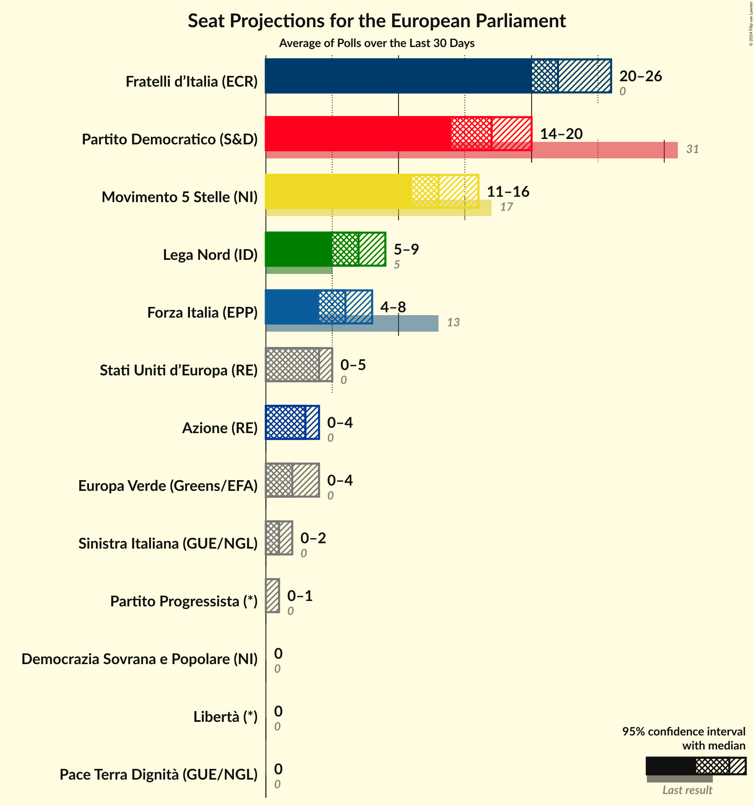

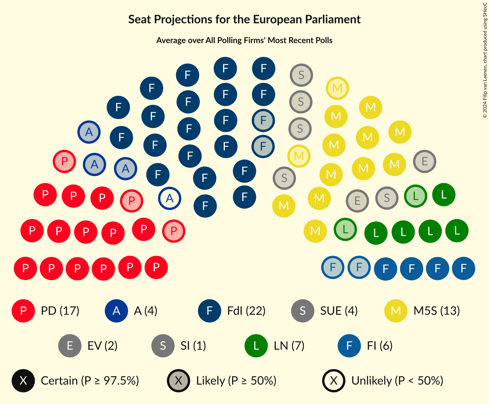

### Confidence Intervals

| Party | Last Result | Median | 80% Confidence Interval | 90% Confidence Interval | 95% Confidence Interval | 99% Confidence Interval |
|:-----:|:-----------:|:------:|:-----------------------:|:-----------------------:|:-----------------------:|:-----------------------:|
| <a href="#partito-democratico-(s&d)">Partito Democratico (S&D)</a> | 31 | 17 | 15–19 |15–19 | 14–20 | 13–21 |
| <a href="#movimento-5-stelle-(ni)">Movimento 5 Stelle (NI)</a> | 17 | 13 | 12–15 |12–15 | 11–16 | 10–17 |
| <a href="#forza-italia-(epp)">Forza Italia (EPP)</a> | 13 | 6 | 5–7 |4–7 | 4–8 | 4–8 |
| <a href="#lega-nord-(id)">Lega Nord (ID)</a> | 5 | 7 | 6–8 |6–9 | 5–9 | 5–10 |
| <a href="#fratelli-d’italia-(ecr)">Fratelli d’Italia (ECR)</a> | 0 | 22 | 20–24 |20–25 | 20–26 | 19–27 |
| <a href="#südtiroler-volkspartei-(epp)">Südtiroler Volkspartei (EPP)</a> | 1 | N/A | N/A |N/A | N/A | N/A |
| <a href="#casapound-italia-(ni)">CasaPound Italia (NI)</a> | 0 | N/A | N/A |N/A | N/A | N/A |
| <a href="#civica-popolare-(re)">Civica Popolare (RE)</a> | 0 | N/A | N/A |N/A | N/A | N/A |
| <a href="#insieme-(*)">Insieme (*)</a> | 0 | N/A | N/A |N/A | N/A | N/A |
| <a href="#noi-con-l’italia-(ecr)">Noi con l’Italia (ECR)</a> | 0 | N/A | N/A |N/A | N/A | N/A |
| <a href="#più-europa-(re)">Più Europa (RE)</a> | 0 | N/A | N/A |N/A | N/A | N/A |
| <a href="#liberi-e-uguali-(s&d)">Liberi e Uguali (S&D)</a> | 0 | N/A | N/A |N/A | N/A | N/A |
| <a href="#potere-al-popolo-(gue/ngl)">Potere al Popolo (GUE/NGL)</a> | 0 | N/A | N/A |N/A | N/A | N/A |
| <a href="#azione-(re)">Azione (RE)</a> | 0 | 3 | 0–4 |0–4 | 0–4 | 0–5 |
| <a href="#europa-verde-(greens/efa)">Europa Verde (Greens/EFA)</a> | 0 | 2 | 0–3 |0–4 | 0–4 | 0–4 |
| <a href="#cambiamo!-(ecr)">Cambiamo! (ECR)</a> | 0 | N/A | N/A |N/A | N/A | N/A |
| <a href="#italia-viva-(re)">Italia Viva (RE)</a> | 0 | N/A | N/A |N/A | N/A | N/A |
| <a href="#coraggio-italia-(ecr)">Coraggio Italia (ECR)</a> | 0 | N/A | N/A |N/A | N/A | N/A |
| <a href="#articolo-uno-(s&d)">Articolo Uno (S&D)</a> | 0 | N/A | N/A |N/A | N/A | N/A |
| <a href="#sinistra-italiana-(gue/ngl)">Sinistra Italiana (GUE/NGL)</a> | 0 | 1 | 0–2 |0–2 | 0–2 | 0–3 |
| <a href="#più-europa–azione-(re)">Più Europa–Azione (RE)</a> | 0 | N/A | N/A |N/A | N/A | N/A |
| <a href="#italexit–per-l’italia-con-paragone-(*)">Italexit–Per l’Italia con Paragone (*)</a> | 0 | N/A | N/A |N/A | N/A | N/A |
| <a href="#insieme-per-il-futuro-(ni)">Insieme per il Futuro (NI)</a> | 0 | N/A | N/A |N/A | N/A | N/A |
| <a href="#impegno-civico-(ni)">Impegno Civico (NI)</a> | 0 | N/A | N/A |N/A | N/A | N/A |
| <a href="#alleanza-verdi-e-sinistra-(greens/efa)">Alleanza Verdi e Sinistra (Greens/EFA)</a> | 0 | N/A | N/A |N/A | N/A | N/A |
| <a href="#azione–italia-viva-(re)">Azione–Italia Viva (RE)</a> | 0 | N/A | N/A |N/A | N/A | N/A |
| <a href="#noi-moderati-(epp)">Noi Moderati (EPP)</a> | 0 | N/A | N/A |N/A | N/A | N/A |
| <a href="#pace-terra-dignità-(gue/ngl)">Pace Terra Dignità (GUE/NGL)</a> | 0 | 0 | 0 |0 | 0 | 0–3 |
| <a href="#italia-sovrana-e-popolare-(ni)">Italia Sovrana e Popolare (NI)</a> | 0 | N/A | N/A |N/A | N/A | N/A |
| <a href="#democrazia-sovrana-e-popolare-(ni)">Democrazia Sovrana e Popolare (NI)</a> | 0 | 0 | 0 |0 | 0 | 0 |
| <a href="#partito-progressista-(*)">Partito Progressista (*)</a> | 0 | 0 | 0 |0–1 | 0–1 | 0–1 |
| <a href="#stati-uniti-d’europa-(re)">Stati Uniti d’Europa (RE)</a> | 0 | 4 | 0–5 |0–5 | 0–5 | 0–6 |
| <a href="#libertà-(*)">Libertà (*)</a> | 0 | 0 | 0 |0 | 0 | 0 |

### Partito Democratico (S&D)

*For a full overview of the results for this party, see the [Partito Democratico (S&D)](party-partitodemocraticosd.html) page.*

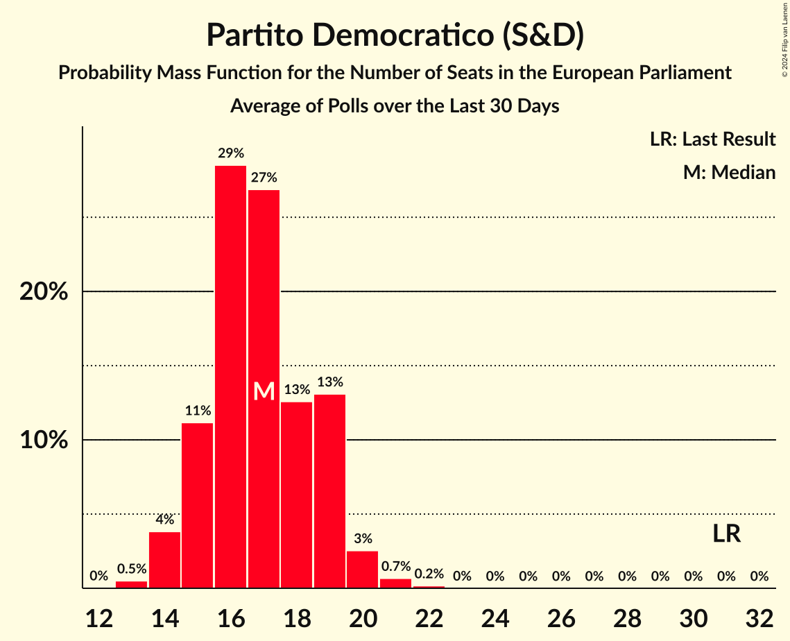

| Number of Seats | Probability | Accumulated | Special Marks |
|:---------------:|:-----------:|:-----------:|:-------------:|
| 13 | 0.5% | 100% |  |
| 14 | 4% | 99.5% |  |
| 15 | 11% | 96% |  |
| 16 | 29% | 84% |  |
| 17 | 27% | 56% | Median |
| 18 | 13% | 29% |  |
| 19 | 13% | 16% |  |
| 20 | 3% | 3% |  |
| 21 | 0.7% | 0.9% |  |
| 22 | 0.2% | 0.2% |  |
| 23 | 0% | 0% |  |
| 24 | 0% | 0% |  |
| 25 | 0% | 0% |  |
| 26 | 0% | 0% |  |
| 27 | 0% | 0% |  |
| 28 | 0% | 0% |  |
| 29 | 0% | 0% |  |
| 30 | 0% | 0% |  |
| 31 | 0% | 0% | Last Result |

### Movimento 5 Stelle (NI)

*For a full overview of the results for this party, see the [Movimento 5 Stelle (NI)](party-movimento5stelleni.html) page.*

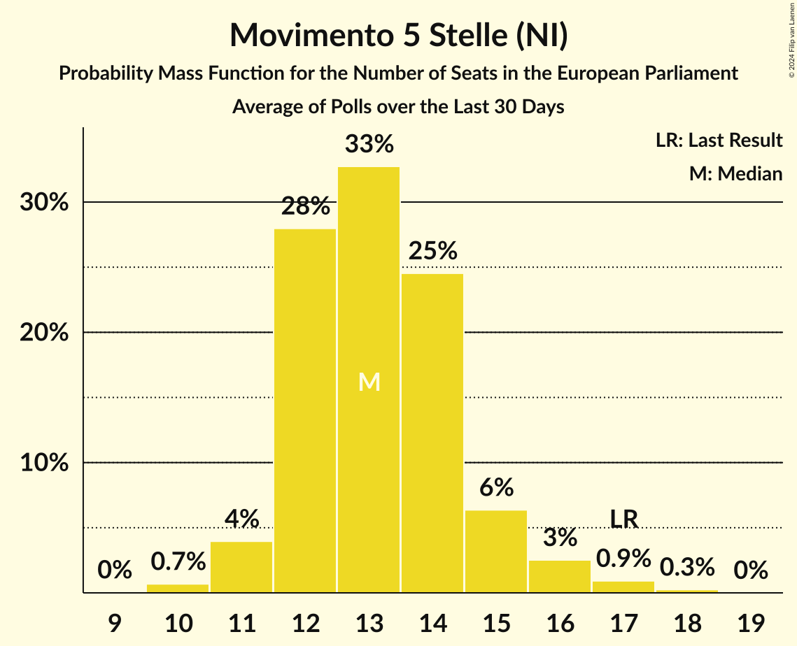

| Number of Seats | Probability | Accumulated | Special Marks |
|:---------------:|:-----------:|:-----------:|:-------------:|
| 10 | 0.7% | 100% |  |
| 11 | 4% | 99.3% |  |
| 12 | 28% | 95% |  |
| 13 | 33% | 67% | Median |
| 14 | 25% | 35% |  |
| 15 | 6% | 10% |  |
| 16 | 3% | 4% |  |
| 17 | 0.9% | 1.2% | Last Result |
| 18 | 0.3% | 0.3% |  |
| 19 | 0% | 0% |  |

### Forza Italia (EPP)

*For a full overview of the results for this party, see the [Forza Italia (EPP)](party-forzaitaliaepp.html) page.*

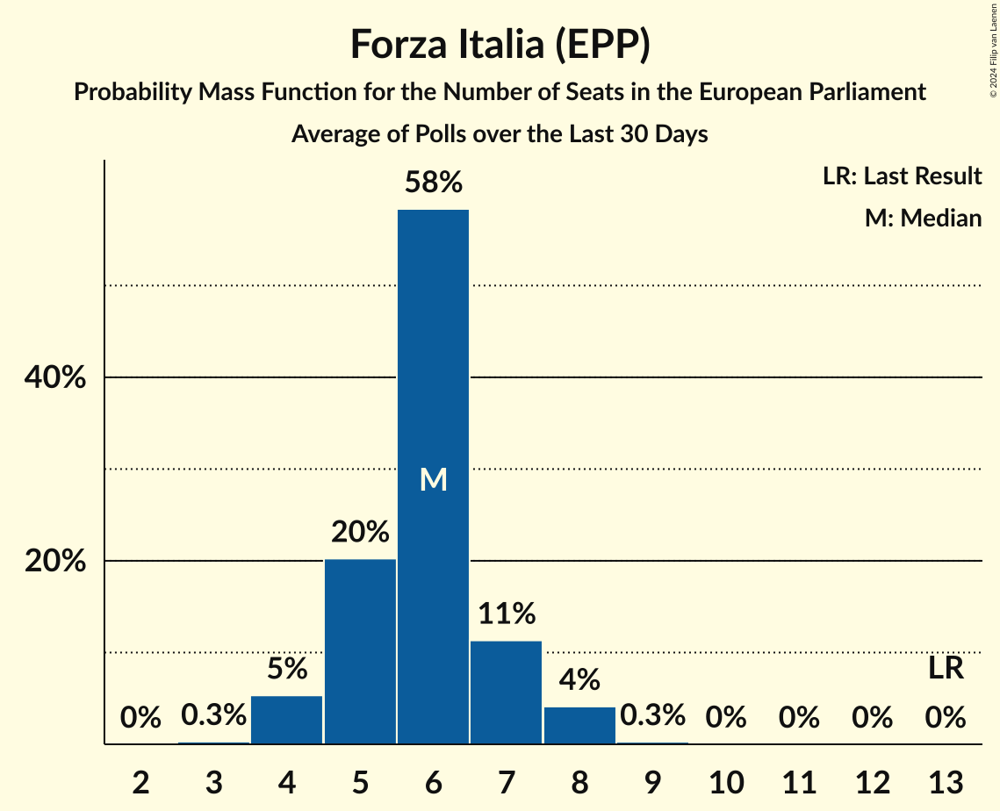

| Number of Seats | Probability | Accumulated | Special Marks |
|:---------------:|:-----------:|:-----------:|:-------------:|
| 3 | 0.3% | 100% |  |
| 4 | 5% | 99.7% |  |
| 5 | 20% | 94% |  |
| 6 | 58% | 74% | Median |
| 7 | 11% | 16% |  |
| 8 | 4% | 4% |  |
| 9 | 0.3% | 0.3% |  |
| 10 | 0% | 0% |  |
| 11 | 0% | 0% |  |
| 12 | 0% | 0% |  |
| 13 | 0% | 0% | Last Result |

### Lega Nord (ID)

*For a full overview of the results for this party, see the [Lega Nord (ID)](party-leganordid.html) page.*

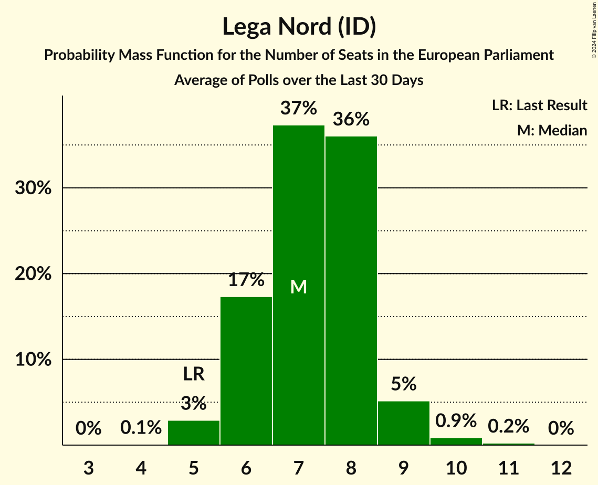

| Number of Seats | Probability | Accumulated | Special Marks |
|:---------------:|:-----------:|:-----------:|:-------------:|
| 4 | 0.1% | 100% |  |
| 5 | 3% | 99.9% | Last Result |
| 6 | 17% | 97% |  |
| 7 | 37% | 80% | Median |
| 8 | 36% | 42% |  |
| 9 | 5% | 6% |  |
| 10 | 0.9% | 1.1% |  |
| 11 | 0.2% | 0.2% |  |
| 12 | 0% | 0% |  |

### Fratelli d’Italia (ECR)

*For a full overview of the results for this party, see the [Fratelli d’Italia (ECR)](party-fratellid’italiaecr.html) page.*

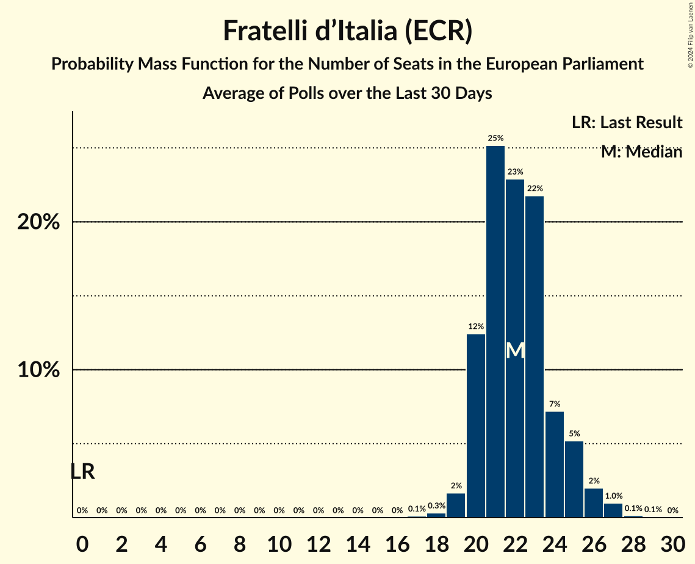

| Number of Seats | Probability | Accumulated | Special Marks |
|:---------------:|:-----------:|:-----------:|:-------------:|
| 0 | 0% | 100% | Last Result |
| 1 | 0% | 100% |  |
| 2 | 0% | 100% |  |
| 3 | 0% | 100% |  |
| 4 | 0% | 100% |  |
| 5 | 0% | 100% |  |
| 6 | 0% | 100% |  |
| 7 | 0% | 100% |  |
| 8 | 0% | 100% |  |
| 9 | 0% | 100% |  |
| 10 | 0% | 100% |  |
| 11 | 0% | 100% |  |
| 12 | 0% | 100% |  |
| 13 | 0% | 100% |  |
| 14 | 0% | 100% |  |
| 15 | 0% | 100% |  |
| 16 | 0% | 100% |  |
| 17 | 0.1% | 100% |  |
| 18 | 0.3% | 99.9% |  |
| 19 | 2% | 99.6% |  |
| 20 | 12% | 98% |  |
| 21 | 25% | 85% |  |
| 22 | 23% | 60% | Median |
| 23 | 22% | 37% |  |
| 24 | 7% | 16% |  |
| 25 | 5% | 8% |  |
| 26 | 2% | 3% |  |
| 27 | 1.0% | 1.2% |  |
| 28 | 0.1% | 0.2% |  |
| 29 | 0.1% | 0.1% |  |
| 30 | 0% | 0% |  |

### Südtiroler Volkspartei (EPP)

*For a full overview of the results for this party, see the [Südtiroler Volkspartei (EPP)](party-südtirolervolksparteiepp.html) page.*

### CasaPound Italia (NI)

*For a full overview of the results for this party, see the [CasaPound Italia (NI)](party-casapounditaliani.html) page.*

### Civica Popolare (RE)

*For a full overview of the results for this party, see the [Civica Popolare (RE)](party-civicapopolarere.html) page.*

### Insieme (*)

*For a full overview of the results for this party, see the [Insieme (*)](party-insieme.html) page.*

### Noi con l’Italia (ECR)

*For a full overview of the results for this party, see the [Noi con l’Italia (ECR)](party-noiconl’italiaecr.html) page.*

### Più Europa (RE)

*For a full overview of the results for this party, see the [Più Europa (RE)](party-piùeuropare.html) page.*

### Liberi e Uguali (S&D)

*For a full overview of the results for this party, see the [Liberi e Uguali (S&D)](party-liberieugualisd.html) page.*

### Potere al Popolo (GUE/NGL)

*For a full overview of the results for this party, see the [Potere al Popolo (GUE/NGL)](party-poterealpopologuengl.html) page.*

### Azione (RE)

*For a full overview of the results for this party, see the [Azione (RE)](party-azionere.html) page.*

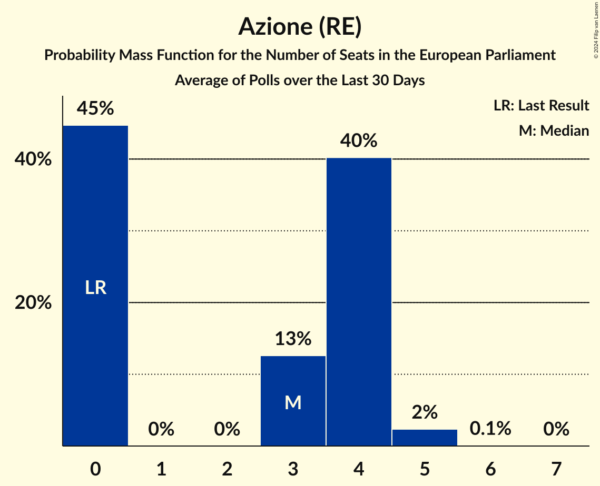

| Number of Seats | Probability | Accumulated | Special Marks |
|:---------------:|:-----------:|:-----------:|:-------------:|
| 0 | 45% | 100% | Last Result |
| 1 | 0% | 55% |  |
| 2 | 0% | 55% |  |
| 3 | 13% | 55% | Median |
| 4 | 40% | 43% |  |
| 5 | 2% | 2% |  |
| 6 | 0.1% | 0.1% |  |
| 7 | 0% | 0% |  |

### Europa Verde (Greens/EFA)

*For a full overview of the results for this party, see the [Europa Verde (Greens/EFA)](party-europaverdegreensefa.html) page.*

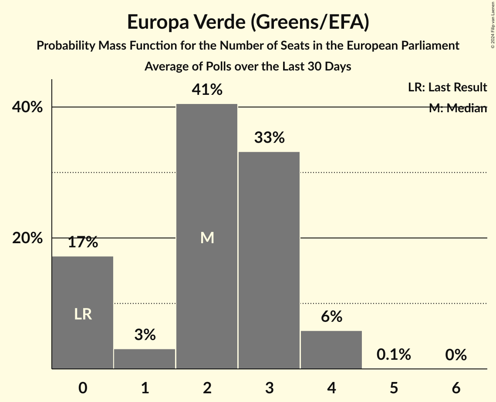

| Number of Seats | Probability | Accumulated | Special Marks |
|:---------------:|:-----------:|:-----------:|:-------------:|
| 0 | 17% | 100% | Last Result |
| 1 | 3% | 83% |  |
| 2 | 41% | 80% | Median |
| 3 | 33% | 39% |  |
| 4 | 6% | 6% |  |
| 5 | 0.1% | 0.1% |  |
| 6 | 0% | 0% |  |

### Cambiamo! (ECR)

*For a full overview of the results for this party, see the [Cambiamo! (ECR)](party-cambiamoecr.html) page.*

### Italia Viva (RE)

*For a full overview of the results for this party, see the [Italia Viva (RE)](party-italiavivare.html) page.*

### Coraggio Italia (ECR)

*For a full overview of the results for this party, see the [Coraggio Italia (ECR)](party-coraggioitaliaecr.html) page.*

### Articolo Uno (S&D)

*For a full overview of the results for this party, see the [Articolo Uno (S&D)](party-articolounosd.html) page.*

### Sinistra Italiana (GUE/NGL)

*For a full overview of the results for this party, see the [Sinistra Italiana (GUE/NGL)](party-sinistraitalianaguengl.html) page.*

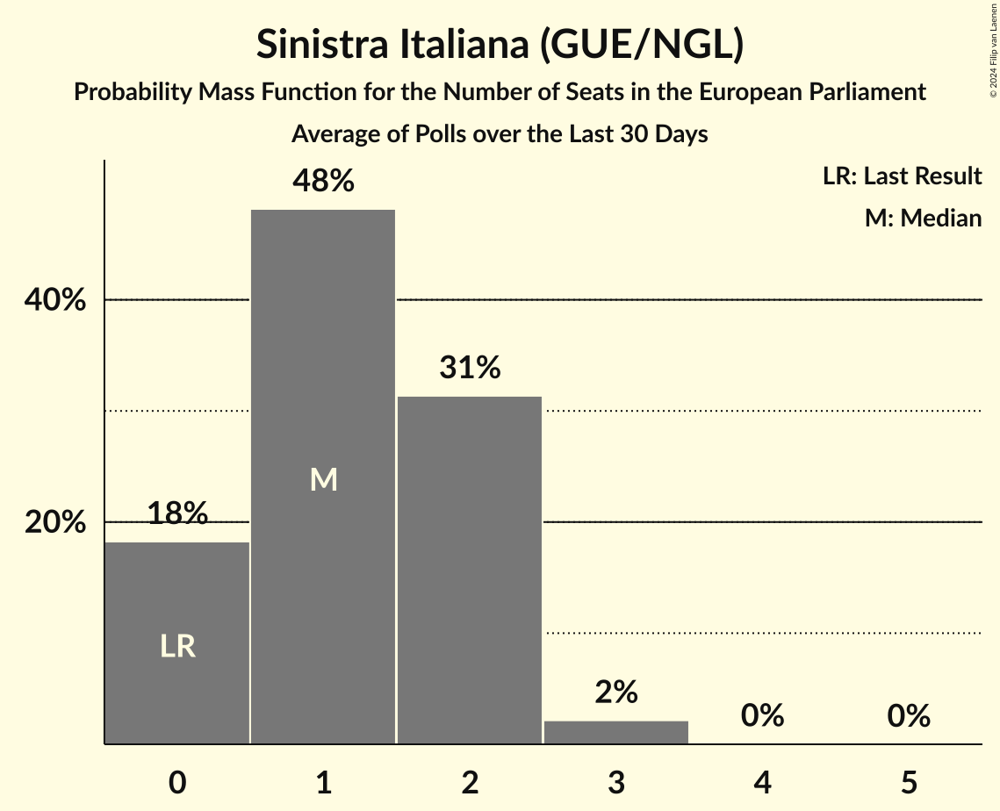

| Number of Seats | Probability | Accumulated | Special Marks |
|:---------------:|:-----------:|:-----------:|:-------------:|
| 0 | 18% | 100% | Last Result |
| 1 | 48% | 82% | Median |
| 2 | 31% | 34% |  |
| 3 | 2% | 2% |  |
| 4 | 0% | 0.1% |  |
| 5 | 0% | 0% |  |

### Più Europa–Azione (RE)

*For a full overview of the results for this party, see the [Più Europa–Azione (RE)](party-piùeuropa–azionere.html) page.*

### Italexit–Per l’Italia con Paragone (*)

*For a full overview of the results for this party, see the [Italexit–Per l’Italia con Paragone (*)](party-italexit–perl’italiaconparagone.html) page.*

### Insieme per il Futuro (NI)

*For a full overview of the results for this party, see the [Insieme per il Futuro (NI)](party-insiemeperilfuturoni.html) page.*

### Impegno Civico (NI)

*For a full overview of the results for this party, see the [Impegno Civico (NI)](party-impegnociviconi.html) page.*

### Alleanza Verdi e Sinistra (Greens/EFA)

*For a full overview of the results for this party, see the [Alleanza Verdi e Sinistra (Greens/EFA)](party-alleanzaverdiesinistragreensefa.html) page.*

### Azione–Italia Viva (RE)

*For a full overview of the results for this party, see the [Azione–Italia Viva (RE)](party-azione–italiavivare.html) page.*

### Noi Moderati (EPP)

*For a full overview of the results for this party, see the [Noi Moderati (EPP)](party-noimoderatiepp.html) page.*

### Pace Terra Dignità (GUE/NGL)

*For a full overview of the results for this party, see the [Pace Terra Dignità (GUE/NGL)](party-paceterradignitàguengl.html) page.*

| Number of Seats | Probability | Accumulated | Special Marks |
|:---------------:|:-----------:|:-----------:|:-------------:|
| 0 | 98.8% | 100% | Last Result, Median |
| 1 | 0% | 1.2% |  |
| 2 | 0% | 1.2% |  |
| 3 | 1.0% | 1.2% |  |
| 4 | 0.2% | 0.2% |  |
| 5 | 0% | 0% |  |

### Italia Sovrana e Popolare (NI)

*For a full overview of the results for this party, see the [Italia Sovrana e Popolare (NI)](party-italiasovranaepopolareni.html) page.*

### Democrazia Sovrana e Popolare (NI)

*For a full overview of the results for this party, see the [Democrazia Sovrana e Popolare (NI)](party-democraziasovranaepopolareni.html) page.*

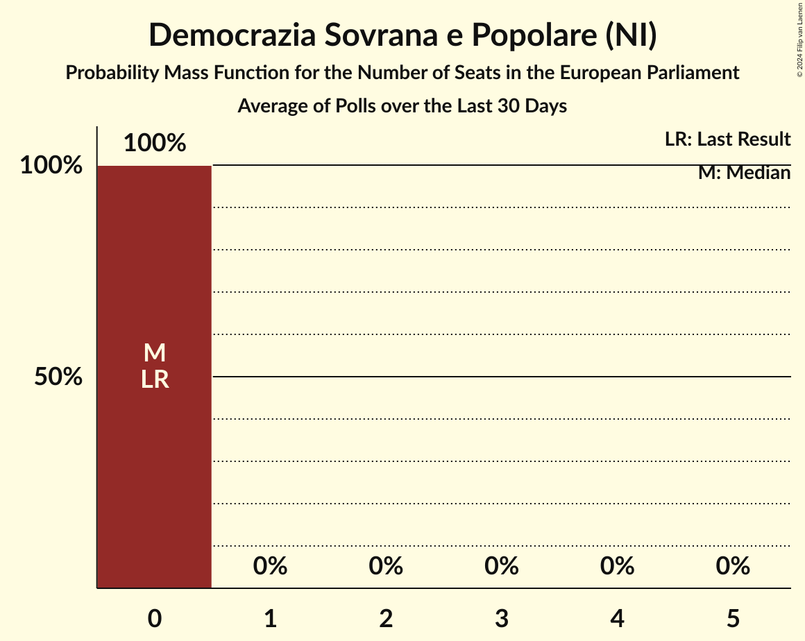

| Number of Seats | Probability | Accumulated | Special Marks |
|:---------------:|:-----------:|:-----------:|:-------------:|
| 0 | 100% | 100% | Last Result, Median |

### Partito Progressista (*)

*For a full overview of the results for this party, see the [Partito Progressista (*)](party-partitoprogressista.html) page.*

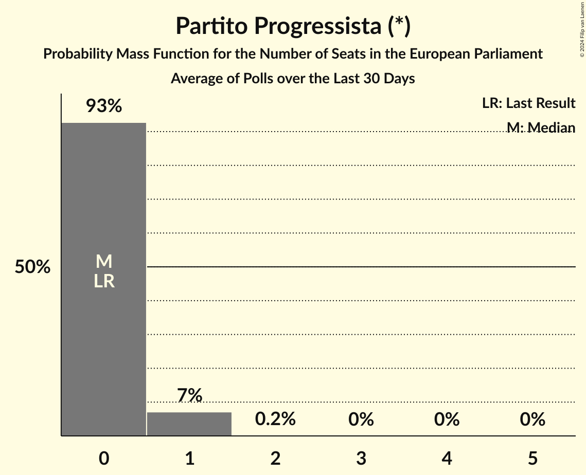

| Number of Seats | Probability | Accumulated | Special Marks |
|:---------------:|:-----------:|:-----------:|:-------------:|
| 0 | 93% | 100% | Last Result, Median |
| 1 | 7% | 7% |  |
| 2 | 0.2% | 0.2% |  |
| 3 | 0% | 0% |  |

### Stati Uniti d’Europa (RE)

*For a full overview of the results for this party, see the [Stati Uniti d’Europa (RE)](party-statiunitid’europare.html) page.*

| Number of Seats | Probability | Accumulated | Special Marks |
|:---------------:|:-----------:|:-----------:|:-------------:|
| 0 | 23% | 100% | Last Result |
| 1 | 0% | 77% |  |
| 2 | 0% | 77% |  |
| 3 | 14% | 77% |  |
| 4 | 51% | 63% | Median |
| 5 | 11% | 13% |  |
| 6 | 1.3% | 1.3% |  |
| 7 | 0% | 0% |  |

### Libertà (*)

*For a full overview of the results for this party, see the [Libertà (*)](party-libertà.html) page.*

| Number of Seats | Probability | Accumulated | Special Marks |
|:---------------:|:-----------:|:-----------:|:-------------:|
| 0 | 99.9% | 100% | Last Result, Median |
| 1 | 0% | 0.1% |  |
| 2 | 0% | 0.1% |  |
| 3 | 0% | 0.1% |  |
| 4 | 0.1% | 0.1% |  |
| 5 | 0% | 0% |  |

## Coalitions

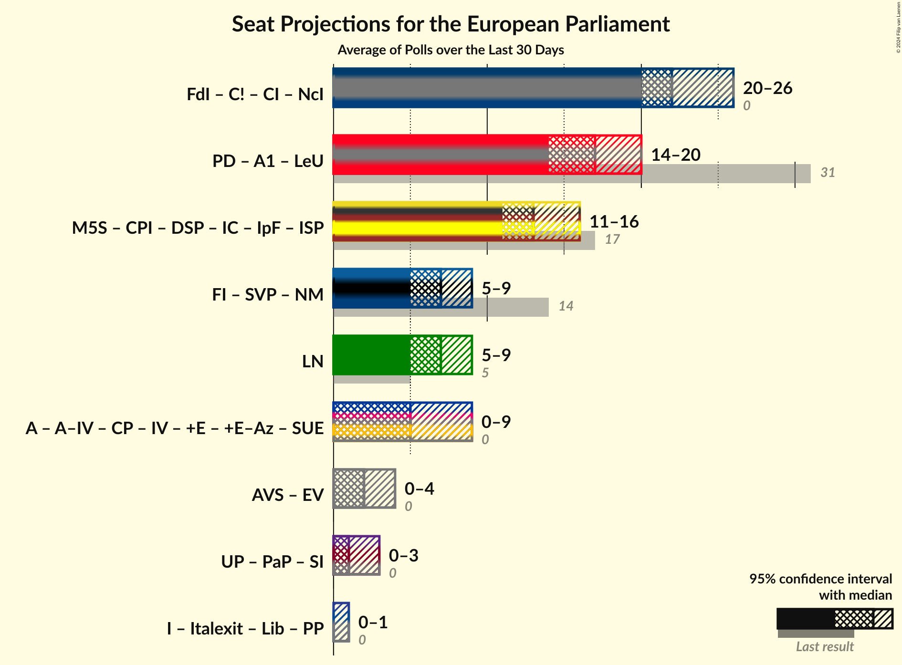

### Confidence Intervals

| Coalition | Last Result | Median | Majority? | 80% Confidence Interval | 90% Confidence Interval | 95% Confidence Interval | 99% Confidence Interval |
|:---------:|:-----------:|:------:|:---------:|:-----------------------:|:-----------------------:|:-----------------------:|:-----------------------:|
| Fratelli d’Italia (ECR) – Cambiamo! (ECR) – Coraggio Italia (ECR) – Noi con l’Italia (ECR) | 0 | 22 | 0% | 20–24 | 20–25 | 20–26 | 19–27 |
| Partito Democratico (S&D) – Articolo Uno (S&D) – Liberi e Uguali (S&D) | 31 | 17 | 0% | 15–19 | 15–19 | 14–20 | 13–21 |
| Movimento 5 Stelle (NI) – CasaPound Italia (NI) – Democrazia Sovrana e Popolare (NI) – Impegno Civico (NI) – Insieme per il Futuro (NI) – Italia Sovrana e Popolare (NI) | 17 | 13 | 0% | 12–15 | 12–15 | 11–16 | 10–17 |
| Forza Italia (EPP) – Südtiroler Volkspartei (EPP) – Noi Moderati (EPP) | 14 | 7 | 0% | 6–8 | 5–8 | 5–9 | 5–9 |
| Lega Nord (ID) | 5 | 7 | 0% | 6–8 | 6–9 | 5–9 | 5–10 |
| Azione (RE) – Azione–Italia Viva (RE) – Civica Popolare (RE) – Italia Viva (RE) – Più Europa (RE) – Più Europa–Azione (RE) – Stati Uniti d’Europa (RE) | 0 | 5 | 0% | 0–8 | 0–9 | 0–9 | 0–10 |
| Alleanza Verdi e Sinistra (Greens/EFA) – Europa Verde (Greens/EFA) | 0 | 2 | 0% | 0–3 | 0–4 | 0–4 | 0–4 |
| Pace Terra Dignità (GUE/NGL) – Potere al Popolo (GUE/NGL) – Sinistra Italiana (GUE/NGL) | 0 | 1 | 0% | 0–2 | 0–2 | 0–3 | 0–4 |
| Insieme (*) – Italexit–Per l’Italia con Paragone (*) – Libertà (*) – Partito Progressista (*) | 0 | 0 | 0% | 0 | 0–1 | 0–1 | 0–1 |

### Fratelli d’Italia (ECR) – Cambiamo! (ECR) – Coraggio Italia (ECR) – Noi con l’Italia (ECR)

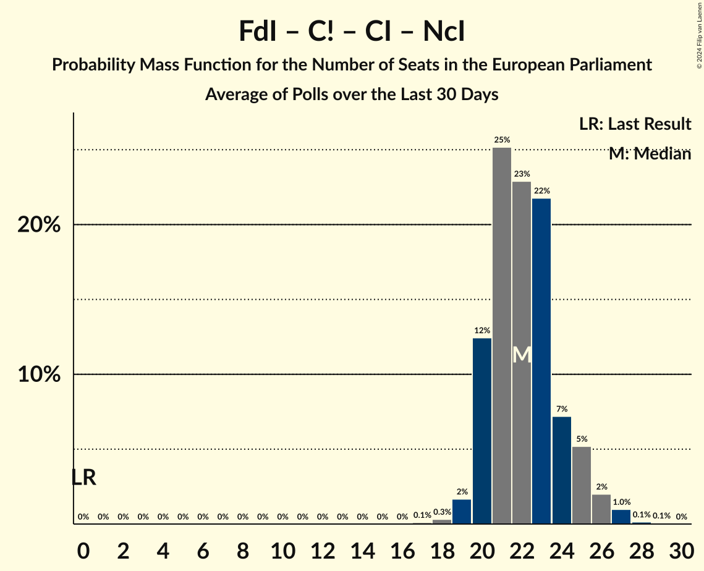

| Number of Seats | Probability | Accumulated | Special Marks |
|:---------------:|:-----------:|:-----------:|:-------------:|
| 0 | 0% | 100% | Last Result |
| 1 | 0% | 100% |  |
| 2 | 0% | 100% |  |
| 3 | 0% | 100% |  |
| 4 | 0% | 100% |  |
| 5 | 0% | 100% |  |
| 6 | 0% | 100% |  |
| 7 | 0% | 100% |  |
| 8 | 0% | 100% |  |
| 9 | 0% | 100% |  |
| 10 | 0% | 100% |  |
| 11 | 0% | 100% |  |
| 12 | 0% | 100% |  |
| 13 | 0% | 100% |  |
| 14 | 0% | 100% |  |
| 15 | 0% | 100% |  |
| 16 | 0% | 100% |  |
| 17 | 0.1% | 100% |  |
| 18 | 0.3% | 99.9% |  |
| 19 | 2% | 99.6% |  |
| 20 | 12% | 98% |  |
| 21 | 25% | 85% |  |
| 22 | 23% | 60% | Median |
| 23 | 22% | 37% |  |
| 24 | 7% | 16% |  |
| 25 | 5% | 8% |  |
| 26 | 2% | 3% |  |
| 27 | 1.0% | 1.2% |  |
| 28 | 0.1% | 0.2% |  |
| 29 | 0.1% | 0.1% |  |
| 30 | 0% | 0% |  |

### Partito Democratico (S&D) – Articolo Uno (S&D) – Liberi e Uguali (S&D)

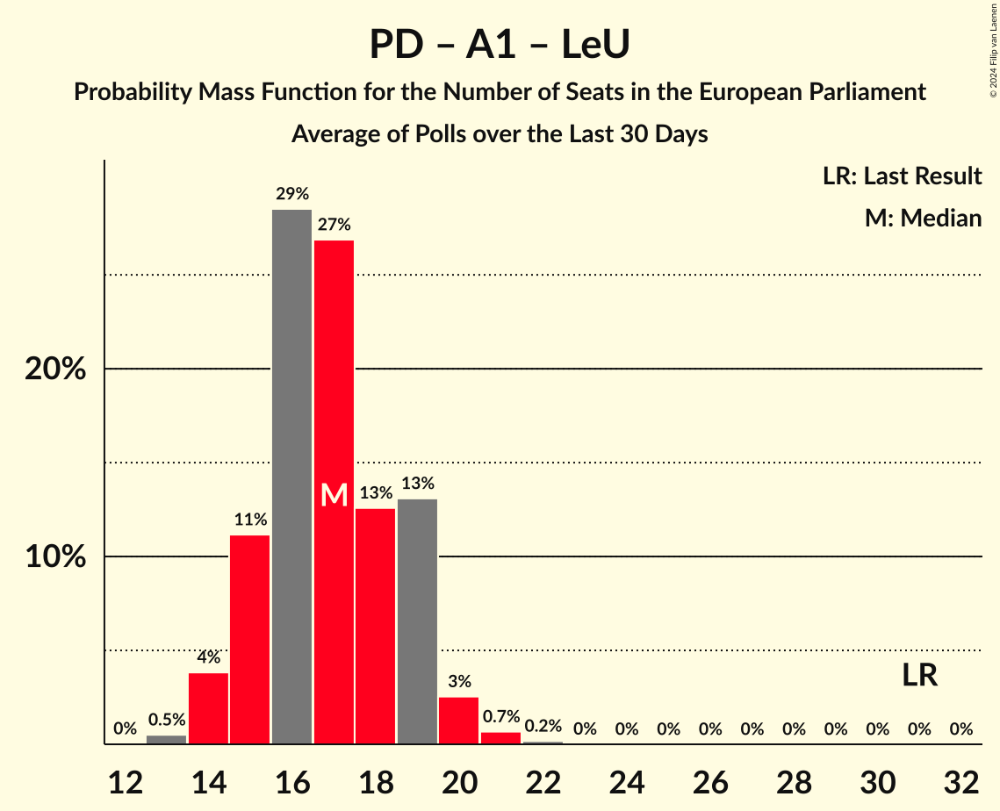

| Number of Seats | Probability | Accumulated | Special Marks |
|:---------------:|:-----------:|:-----------:|:-------------:|
| 13 | 0.5% | 100% |  |
| 14 | 4% | 99.5% |  |
| 15 | 11% | 96% |  |
| 16 | 29% | 84% |  |
| 17 | 27% | 56% | Median |
| 18 | 13% | 29% |  |
| 19 | 13% | 16% |  |
| 20 | 3% | 3% |  |
| 21 | 0.7% | 0.9% |  |
| 22 | 0.2% | 0.2% |  |
| 23 | 0% | 0% |  |
| 24 | 0% | 0% |  |
| 25 | 0% | 0% |  |
| 26 | 0% | 0% |  |
| 27 | 0% | 0% |  |
| 28 | 0% | 0% |  |
| 29 | 0% | 0% |  |
| 30 | 0% | 0% |  |
| 31 | 0% | 0% | Last Result |

### Movimento 5 Stelle (NI) – CasaPound Italia (NI) – Democrazia Sovrana e Popolare (NI) – Impegno Civico (NI) – Insieme per il Futuro (NI) – Italia Sovrana e Popolare (NI)

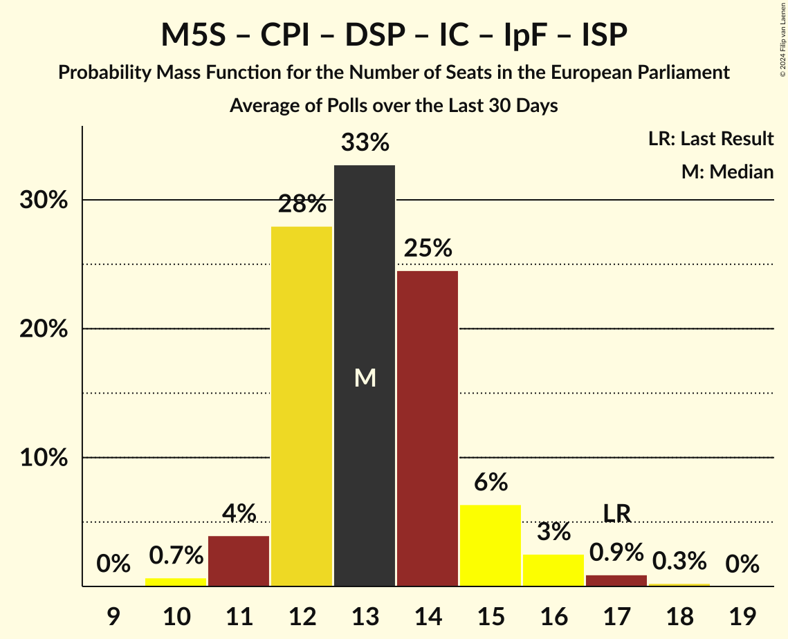

| Number of Seats | Probability | Accumulated | Special Marks |
|:---------------:|:-----------:|:-----------:|:-------------:|
| 10 | 0.7% | 100% |  |
| 11 | 4% | 99.3% |  |
| 12 | 28% | 95% |  |
| 13 | 33% | 67% | Median |
| 14 | 25% | 35% |  |
| 15 | 6% | 10% |  |
| 16 | 3% | 4% |  |
| 17 | 0.9% | 1.2% | Last Result |
| 18 | 0.3% | 0.3% |  |
| 19 | 0% | 0% |  |

### Forza Italia (EPP) – Südtiroler Volkspartei (EPP) – Noi Moderati (EPP)

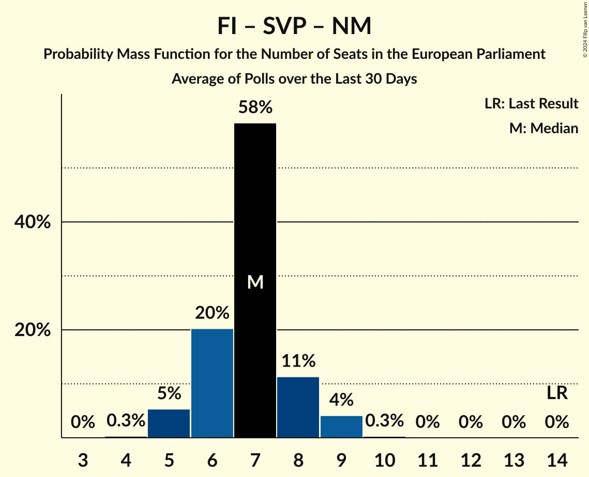

| Number of Seats | Probability | Accumulated | Special Marks |
|:---------------:|:-----------:|:-----------:|:-------------:|
| 4 | 0.3% | 100% |  |
| 5 | 5% | 99.7% |  |
| 6 | 20% | 94% | Median |
| 7 | 58% | 74% |  |
| 8 | 11% | 16% |  |
| 9 | 4% | 4% |  |
| 10 | 0.3% | 0.3% |  |
| 11 | 0% | 0% |  |
| 12 | 0% | 0% |  |
| 13 | 0% | 0% |  |
| 14 | 0% | 0% | Last Result |

### Lega Nord (ID)

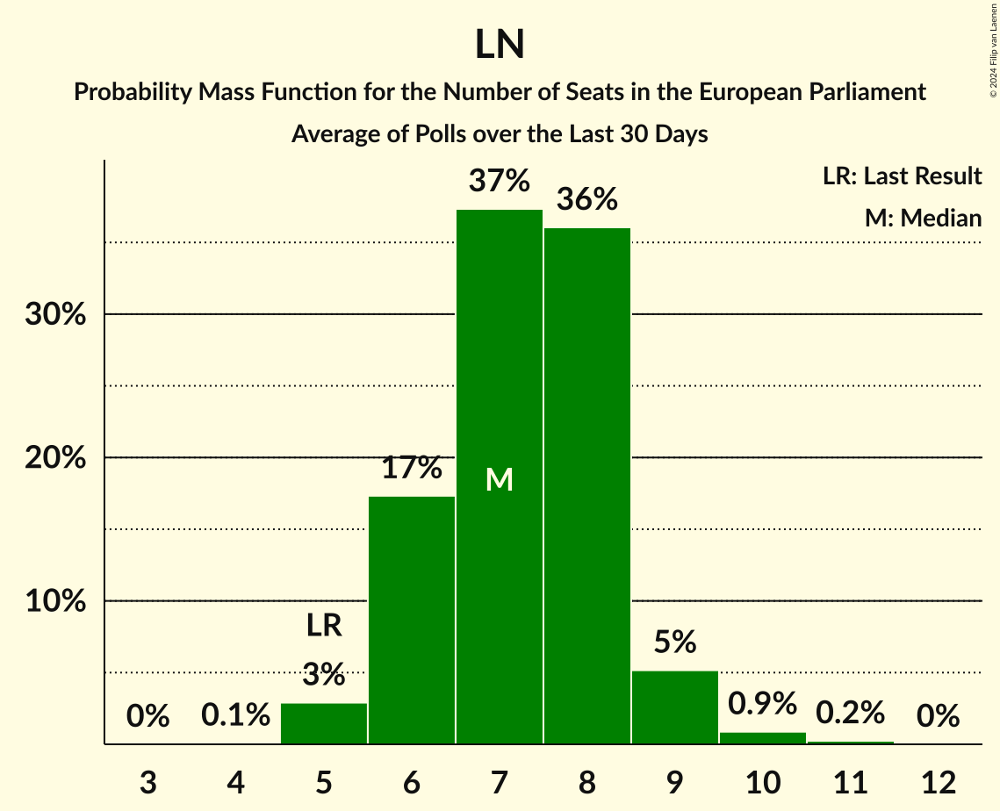

| Number of Seats | Probability | Accumulated | Special Marks |
|:---------------:|:-----------:|:-----------:|:-------------:|
| 4 | 0.1% | 100% |  |
| 5 | 3% | 99.9% | Last Result |
| 6 | 17% | 97% |  |
| 7 | 37% | 80% | Median |
| 8 | 36% | 42% |  |
| 9 | 5% | 6% |  |
| 10 | 0.9% | 1.1% |  |
| 11 | 0.2% | 0.2% |  |
| 12 | 0% | 0% |  |

### Azione (RE) – Azione–Italia Viva (RE) – Civica Popolare (RE) – Italia Viva (RE) – Più Europa (RE) – Più Europa–Azione (RE) – Stati Uniti d’Europa (RE)

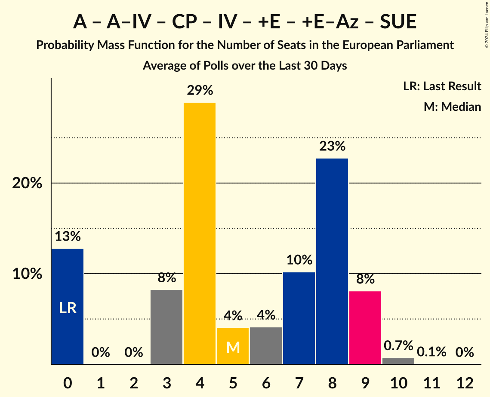

| Number of Seats | Probability | Accumulated | Special Marks |
|:---------------:|:-----------:|:-----------:|:-------------:|
| 0 | 13% | 100% | Last Result |
| 1 | 0% | 87% |  |
| 2 | 0% | 87% |  |
| 3 | 8% | 87% |  |
| 4 | 29% | 79% |  |
| 5 | 4% | 50% |  |
| 6 | 4% | 46% |  |
| 7 | 10% | 42% | Median |
| 8 | 23% | 32% |  |
| 9 | 8% | 9% |  |
| 10 | 0.7% | 0.8% |  |
| 11 | 0.1% | 0.1% |  |
| 12 | 0% | 0% |  |

### Alleanza Verdi e Sinistra (Greens/EFA) – Europa Verde (Greens/EFA)

| Number of Seats | Probability | Accumulated | Special Marks |
|:---------------:|:-----------:|:-----------:|:-------------:|
| 0 | 17% | 100% | Last Result |
| 1 | 3% | 83% |  |
| 2 | 41% | 80% | Median |
| 3 | 33% | 39% |  |
| 4 | 6% | 6% |  |
| 5 | 0.1% | 0.1% |  |
| 6 | 0% | 0% |  |

### Pace Terra Dignità (GUE/NGL) – Potere al Popolo (GUE/NGL) – Sinistra Italiana (GUE/NGL)

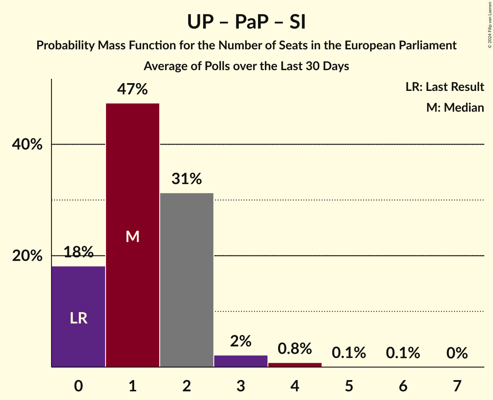

| Number of Seats | Probability | Accumulated | Special Marks |
|:---------------:|:-----------:|:-----------:|:-------------:|
| 0 | 18% | 100% | Last Result |
| 1 | 47% | 82% | Median |
| 2 | 31% | 34% |  |
| 3 | 2% | 3% |  |
| 4 | 0.8% | 1.0% |  |
| 5 | 0.1% | 0.1% |  |
| 6 | 0.1% | 0.1% |  |
| 7 | 0% | 0% |  |

### Insieme (*) – Italexit–Per l’Italia con Paragone (*) – Libertà (*) – Partito Progressista (*)

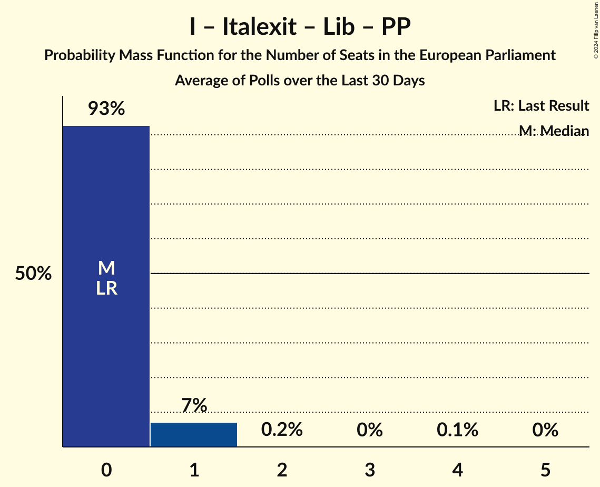

| Number of Seats | Probability | Accumulated | Special Marks |
|:---------------:|:-----------:|:-----------:|:-------------:|
| 0 | 93% | 100% | Last Result, Median |
| 1 | 7% | 7% |  |
| 2 | 0.2% | 0.2% |  |
| 3 | 0% | 0.1% |  |
| 4 | 0.1% | 0.1% |  |
| 5 | 0% | 0% |  |

## Technical Information

+ **Number of polls included in this average:** 5
+ **Lowest number of simulations done in a poll included in this average:** 2,097,152
+ **Total number of simulations done in the polls included in this average:** 10,485,760
+ **Error estimate:** 2.36%
