# Poll Average

<a href="#voting-intentions">Voting Intentions</a> | <a href="#seats">Seats</a> | <a href="#coalitions">Coalitions</a> | <a href="#technical-information">Technical Information</a>

## Summary

The table below lists the polls on which the average is based. They are the most recent polls (less than 30 days old) registered and analyzed so far.

| Period     | Polling firm/Commissioner(s) | PD | M5S | FI | LN | FdI | SVP | CPI | CP | I | NcI | +E | LeU | PaP |
|:----------:|:----------------------------:|:--:|:--:|:--:|:--:|:--:|:--:|:--:|:--:|:--:|:--:|:--:|:--:|:--:|
| 25 May 2014 | General Election | 40.8%   31 | 21.2%   17 | 16.8%   13 | 6.2%   5 | 3.7%   0 | 0.5%   1 | 0.0%   0 | 0.0%   0 | 0.0%   0 | 0.0%   0 | 0.0%   0 | 0.0%   0 | 0.0%   0 |
| N/A | Poll Average | 18–23%   13–18 | 19–25%   14–20 | 8–13%   6–10 | 29–37%   23–31 | 3–6%   0–6 | N/A   N/A | N/A   N/A | N/A   N/A | N/A   N/A | 0–2%   0 | 2–4%   0–3 | 1–4%   0–4 | 1–2%   0 |
| [4 April 2019](2019-04-04-IndexResearch.html) | Index Research   LA7 | 18–24%   14–18 | 18–24%   14–20 | 7–11%   5–9 | 30–37%   24–31 | 3–6%   0–6 | N/A   N/A | N/A   N/A | N/A   N/A | N/A   N/A | N/A   N/A | 2–4%   0–3 | 2–5%   0–4 | 1–3%   0 |
| [3 April 2019](2019-04-03-TermometroPolitico.html) | Termometro Politico | 20–23%   16–19 | 20–23%   17–19 | 8–10%   7–9 | 30–33%   25–29 | 4–5%   3–5 | N/A   N/A | N/A   N/A | N/A   N/A | N/A   N/A | N/A   N/A | 3–4%   0 | 3–4%   0–3 | 1%   0 |
| [3 April 2019](2019-04-03-Piepoli.html) | Piepoli   Rai 1 | 17–24%   14–15 | 19–26%   18 | 8–14%   8–9 | 27–35%   24–25 | 3–7%   5 | N/A   N/A | N/A   N/A | N/A   N/A | N/A   N/A | 0–2%   0 | 2–5%   0 | 2–5%   0 | N/A   N/A |
| [3 April 2019](2019-04-03-Euromedia.html) | Euromedia   Rai 1 | N/A   N/A | N/A   N/A | N/A   N/A | N/A   N/A | N/A   N/A | N/A   N/A | N/A   N/A | N/A   N/A | N/A   N/A | N/A   N/A | N/A   N/A | N/A   N/A | N/A   N/A |
| [2 April 2019](2019-04-02-NotoSondaggi.html) | Noto Sondaggi   Rai 3 | 19–24%   14–18 | 18–23%   15–19 | 9–13%   7–10 | 29–35%   23–29 | 4–7%   0–5 | N/A   N/A | N/A   N/A | N/A   N/A | N/A   N/A | 0–1%   0 | 3–5%   0–4 | 1–2%   0 | 1–2%   0 |
| [2 April 2019](2019-04-02-EMGAcqua.html) | EMG Acqua   Rai 3 | N/A   N/A | N/A   N/A | N/A   N/A | N/A   N/A | N/A   N/A | N/A   N/A | N/A   N/A | N/A   N/A | N/A   N/A | N/A   N/A | N/A   N/A | N/A   N/A | N/A   N/A |
| [31 March–1 April 2019](2019-04-01-Tecnè.html) | Tecnè   Quarta Repubblica | 18–23%   12–16 | 19–24%   14–18 | 10–14%   8–11 | 29–35%   22–27 | 3–6%   0–5 | N/A   N/A | N/A   N/A | N/A   N/A | N/A   N/A | N/A   N/A | N/A   N/A | N/A   N/A | N/A   N/A |
| [27 March–1 April 2019](2019-04-01-SWG.html) | SWG   LA7 | 19–23%   14–18 | 20–24%   16–20 | 8–11%   6–9 | 31–35%   25–29 | 4–6%   0–5 | N/A   N/A | N/A   N/A | N/A   N/A | N/A   N/A | N/A   N/A | 2–4%   0 | 1–2%   0 | 1–2%   0 |
| [29–30 March 2019](2019-03-30-QuorumandYouTrend.html) | Quorum and YouTrend   Sky TG 24 | 18–23%   14–18 | 20–25%   16–21 | 8–12%   7–10 | 29–35%   24–29 | 4–7%   3–6 | N/A   N/A | N/A   N/A | N/A   N/A | N/A   N/A | N/A   N/A | 2–4%   0 | 2–5%   0–4 | N/A   N/A |
| [26–27 March 2019](2019-03-27-Demopolis.html) | Demopolis | 19–23%   14–17 | 20–24%   15–19 | 8–11%   6–8 | 30–34%   23–27 | 3–5%   0–4 | N/A   N/A | N/A   N/A | N/A   N/A | N/A   N/A | N/A   N/A | N/A   N/A | N/A   N/A | N/A   N/A |
| [22–25 March 2019](2019-03-25-ScenariPolitici–Winpoll.html) | Scenari Politici–Winpoll | 19–23%   15–19 | 18–22%   15–19 | 8–11%   7–9 | 33–38%   28–33 | 3–5%   0–4 | N/A   N/A | N/A   N/A | N/A   N/A | N/A   N/A | N/A   N/A | 2–4%   0–3 | 1–2%   0 | 1–2%   0 |
| [11–13 March 2019](2019-03-13-DemosPi.html) | Demos & Pi   La Repubblica | 17–22%   12–17 | 21–26%   17–21 | 8–12%   6–9 | 32–37%   25–31 | 3–6%   0–5 | N/A   N/A | N/A   N/A | N/A   N/A | N/A   N/A | N/A   N/A | 2–4%   0 | 2–4%   0 | N/A   N/A |
| 25 May 2014 | General Election | 40.8%   31 | 21.2%   17 | 16.8%   13 | 6.2%   5 | 3.7%   0 | 0.5%   1 | 0.0%   0 | 0.0%   0 | 0.0%   0 | 0.0%   0 | 0.0%   0 | 0.0%   0 | 0.0%   0 |

Only polls for which at least the sample size has been published are included in the table above.

**Legend:**
+ **Top half of each row:** Voting intentions (95% confidence interval)
+ **Bottom half of each row:** Seat projections for the European Parliament (95% confidence interval)
+ **PD:** Partito Democratico (S&D)
+ **M5S:** Movimento 5 Stelle (EFDD)
+ **FI:** Forza Italia (EPP)
+ **LN:** Lega Nord (ENF)
+ **FdI:** Fratelli d’Italia (ECR)
+ **SVP:** Südtiroler Volkspartei (EPP)
+ **CPI:** CasaPound Italia (*)
+ **CP:** Civica Popolare (*)
+ **I:** Insieme (*)
+ **NcI:** Noi con l’Italia (EPP)
+ **+E:** Più Europa (ALDE)
+ **LeU:** Liberi e Uguali (S&D)
+ **PaP:** Potere al Popolo (GUE/NGL)
+ **N/A (single party):** Party not included the published results
+ **N/A (entire row):** Calculation for this opinion poll not started yet

## Voting Intentions

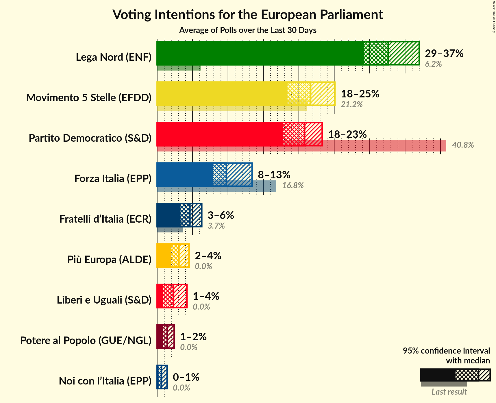

### Confidence Intervals

| Party | Last Result | Median | 80% Confidence Interval | 90% Confidence Interval | 95% Confidence Interval | 99% Confidence Interval |
|:-----:|:-----------:|:------:|:-----------------------:|:-----------------------:|:-----------------------:|:-----------------------:|
| <a href="#partito-democratico-(s&d)">Partito Democratico (S&D)</a> | 40.8% | 20.8% | 18.8–22.4% |18.2–22.8% | 17.7–23.2% | 16.7–24.1% |
| <a href="#movimento-5-stelle-(efdd)">Movimento 5 Stelle (EFDD)</a> | 21.2% | 21.7% | 19.8–23.8% |19.2–24.4% | 18.8–25.0% | 18.0–26.2% |
| <a href="#forza-italia-(epp)">Forza Italia (EPP)</a> | 16.8% | 9.6% | 8.5–11.8% |8.1–12.5% | 7.9–13.1% | 7.4–14.0% |
| <a href="#lega-nord-(enf)">Lega Nord (ENF)</a> | 6.2% | 32.6% | 30.4–35.6% |29.6–36.4% | 28.9–37.0% | 27.3–38.1% |
| <a href="#fratelli-d’italia-(ecr)">Fratelli d’Italia (ECR)</a> | 3.7% | 4.6% | 3.8–5.7% |3.5–6.1% | 3.3–6.4% | 3.0–7.1% |
| <a href="#südtiroler-volkspartei-(epp)">Südtiroler Volkspartei (EPP)</a> | 0.5% | N/A | N/A |N/A | N/A | N/A |
| <a href="#casapound-italia-(*)">CasaPound Italia (*)</a> | 0.0% | N/A | N/A |N/A | N/A | N/A |
| <a href="#civica-popolare-(*)">Civica Popolare (*)</a> | 0.0% | N/A | N/A |N/A | N/A | N/A |
| <a href="#insieme-(*)">Insieme (*)</a> | 0.0% | N/A | N/A |N/A | N/A | N/A |
| <a href="#noi-con-l’italia-(epp)">Noi con l’Italia (EPP)</a> | 0.0% | 0.6% | 0.3–1.1% |0.3–1.3% | 0.2–1.5% | 0.1–2.0% |
| <a href="#più-europa-(alde)">Più Europa (ALDE)</a> | 0.0% | 3.0% | 2.3–3.8% |2.1–4.1% | 1.9–4.4% | 1.6–4.9% |
| <a href="#liberi-e-uguali-(s&d)">Liberi e Uguali (S&D)</a> | 0.0% | 2.7% | 1.1–3.9% |1.0–4.2% | 0.8–4.4% | 0.6–5.0% |
| <a href="#potere-al-popolo-(gue/ngl)">Potere al Popolo (GUE/NGL)</a> | 0.0% | 1.3% | 0.9–1.9% |0.8–2.1% | 0.7–2.3% | 0.5–2.7% |

### Partito Democratico (S&D)

*For a full overview of the results for this party, see the [Partito Democratico (S&D)](party-partitodemocraticosd.html) page.*

| Voting Intentions | Probability | Accumulated | Special Marks |
|:-----------------:|:-----------:|:-----------:|:-------------:|
| 14.5–15.5% | 0% | 100% |  |
| 15.5–16.5% | 0.3% | 100% |  |
| 16.5–17.5% | 2% | 99.6% |  |
| 17.5–18.5% | 6% | 98% |  |
| 18.5–19.5% | 13% | 92% |  |
| 19.5–20.5% | 23% | 79% |  |
| 20.5–21.5% | 29% | 56% | Median |
| 21.5–22.5% | 20% | 27% |  |
| 22.5–23.5% | 6% | 7% |  |
| 23.5–24.5% | 1.2% | 1.4% |  |
| 24.5–25.5% | 0.2% | 0.2% |  |
| 25.5–26.5% | 0% | 0% |  |
| 26.5–27.5% | 0% | 0% |  |
| 27.5–28.5% | 0% | 0% |  |
| 28.5–29.5% | 0% | 0% |  |
| 29.5–30.5% | 0% | 0% |  |
| 30.5–31.5% | 0% | 0% |  |
| 31.5–32.5% | 0% | 0% |  |
| 32.5–33.5% | 0% | 0% |  |
| 33.5–34.5% | 0% | 0% |  |
| 34.5–35.5% | 0% | 0% |  |
| 35.5–36.5% | 0% | 0% |  |
| 36.5–37.5% | 0% | 0% |  |
| 37.5–38.5% | 0% | 0% |  |
| 38.5–39.5% | 0% | 0% |  |
| 39.5–40.5% | 0% | 0% |  |
| 40.5–41.5% | 0% | 0% | Last Result |

### Movimento 5 Stelle (EFDD)

*For a full overview of the results for this party, see the [Movimento 5 Stelle (EFDD)](party-movimento5stelleefdd.html) page.*

| Voting Intentions | Probability | Accumulated | Special Marks |
|:-----------------:|:-----------:|:-----------:|:-------------:|
| 15.5–16.5% | 0% | 100% |  |
| 16.5–17.5% | 0.2% | 100% |  |
| 17.5–18.5% | 1.4% | 99.8% |  |
| 18.5–19.5% | 6% | 98% |  |
| 19.5–20.5% | 15% | 92% |  |
| 20.5–21.5% | 25% | 78% | Last Result |
| 21.5–22.5% | 24% | 53% | Median |
| 22.5–23.5% | 16% | 28% |  |
| 23.5–24.5% | 8% | 13% |  |
| 24.5–25.5% | 3% | 4% |  |
| 25.5–26.5% | 0.9% | 1.2% |  |
| 26.5–27.5% | 0.2% | 0.3% |  |
| 27.5–28.5% | 0% | 0.1% |  |
| 28.5–29.5% | 0% | 0% |  |

### Forza Italia (EPP)

*For a full overview of the results for this party, see the [Forza Italia (EPP)](party-forzaitaliaepp.html) page.*

| Voting Intentions | Probability | Accumulated | Special Marks |
|:-----------------:|:-----------:|:-----------:|:-------------:|
| 5.5–6.5% | 0% | 100% |  |
| 6.5–7.5% | 0.9% | 100% |  |
| 7.5–8.5% | 11% | 99.1% |  |
| 8.5–9.5% | 35% | 88% |  |
| 9.5–10.5% | 26% | 53% | Median |
| 10.5–11.5% | 14% | 27% |  |
| 11.5–12.5% | 8% | 12% |  |
| 12.5–13.5% | 4% | 5% |  |
| 13.5–14.5% | 1.0% | 1.2% |  |
| 14.5–15.5% | 0.2% | 0.2% |  |
| 15.5–16.5% | 0% | 0% |  |
| 16.5–17.5% | 0% | 0% | Last Result |

### Lega Nord (ENF)

*For a full overview of the results for this party, see the [Lega Nord (ENF)](party-leganordenf.html) page.*

| Voting Intentions | Probability | Accumulated | Special Marks |
|:-----------------:|:-----------:|:-----------:|:-------------:|
| 5.5–6.5% | 0% | 100% | Last Result |
| 6.5–7.5% | 0% | 100% |  |
| 7.5–8.5% | 0% | 100% |  |
| 8.5–9.5% | 0% | 100% |  |
| 9.5–10.5% | 0% | 100% |  |
| 10.5–11.5% | 0% | 100% |  |
| 11.5–12.5% | 0% | 100% |  |
| 12.5–13.5% | 0% | 100% |  |
| 13.5–14.5% | 0% | 100% |  |
| 14.5–15.5% | 0% | 100% |  |
| 15.5–16.5% | 0% | 100% |  |
| 16.5–17.5% | 0% | 100% |  |
| 17.5–18.5% | 0% | 100% |  |
| 18.5–19.5% | 0% | 100% |  |
| 19.5–20.5% | 0% | 100% |  |
| 20.5–21.5% | 0% | 100% |  |
| 21.5–22.5% | 0% | 100% |  |
| 22.5–23.5% | 0% | 100% |  |
| 23.5–24.5% | 0% | 100% |  |
| 24.5–25.5% | 0% | 100% |  |
| 25.5–26.5% | 0.2% | 99.9% |  |
| 26.5–27.5% | 0.5% | 99.8% |  |
| 27.5–28.5% | 1.1% | 99.3% |  |
| 28.5–29.5% | 3% | 98% |  |
| 29.5–30.5% | 7% | 95% |  |
| 30.5–31.5% | 16% | 88% |  |
| 31.5–32.5% | 23% | 73% |  |
| 32.5–33.5% | 18% | 50% | Median |
| 33.5–34.5% | 13% | 32% |  |
| 34.5–35.5% | 9% | 19% |  |
| 35.5–36.5% | 6% | 10% |  |
| 36.5–37.5% | 3% | 4% |  |
| 37.5–38.5% | 0.9% | 1.1% |  |
| 38.5–39.5% | 0.2% | 0.2% |  |
| 39.5–40.5% | 0% | 0% |  |

### Fratelli d’Italia (ECR)

*For a full overview of the results for this party, see the [Fratelli d’Italia (ECR)](party-fratellid’italiaecr.html) page.*

| Voting Intentions | Probability | Accumulated | Special Marks |
|:-----------------:|:-----------:|:-----------:|:-------------:|
| 1.5–2.5% | 0% | 100% |  |
| 2.5–3.5% | 5% | 100% |  |
| 3.5–4.5% | 41% | 95% | Last Result |
| 4.5–5.5% | 40% | 53% | Median |
| 5.5–6.5% | 11% | 13% |  |
| 6.5–7.5% | 2% | 2% |  |
| 7.5–8.5% | 0.2% | 0.2% |  |
| 8.5–9.5% | 0% | 0% |  |

### Liberi e Uguali (S&D)

*For a full overview of the results for this party, see the [Liberi e Uguali (S&D)](party-liberieugualisd.html) page.*

| Voting Intentions | Probability | Accumulated | Special Marks |
|:-----------------:|:-----------:|:-----------:|:-------------:|
| 0.0–0.5% | 0.1% | 100% | Last Result |
| 0.5–1.5% | 24% | 99.9% |  |
| 1.5–2.5% | 23% | 76% |  |
| 2.5–3.5% | 32% | 53% | Median |
| 3.5–4.5% | 20% | 22% |  |
| 4.5–5.5% | 2% | 2% |  |
| 5.5–6.5% | 0.1% | 0.1% |  |
| 6.5–7.5% | 0% | 0% |  |

### Più Europa (ALDE)

*For a full overview of the results for this party, see the [Più Europa (ALDE)](party-piùeuropaalde.html) page.*

| Voting Intentions | Probability | Accumulated | Special Marks |
|:-----------------:|:-----------:|:-----------:|:-------------:|
| 0.0–0.5% | 0% | 100% | Last Result |
| 0.5–1.5% | 0.3% | 100% |  |
| 1.5–2.5% | 20% | 99.7% |  |
| 2.5–3.5% | 61% | 80% | Median |
| 3.5–4.5% | 17% | 18% |  |
| 4.5–5.5% | 1.4% | 1.5% |  |
| 5.5–6.5% | 0.1% | 0.1% |  |
| 6.5–7.5% | 0% | 0% |  |

### Potere al Popolo (GUE/NGL)

*For a full overview of the results for this party, see the [Potere al Popolo (GUE/NGL)](party-poterealpopologuengl.html) page.*

| Voting Intentions | Probability | Accumulated | Special Marks |
|:-----------------:|:-----------:|:-----------:|:-------------:|
| 0.0–0.5% | 0.5% | 100% | Last Result |
| 0.5–1.5% | 69% | 99.5% | Median |
| 1.5–2.5% | 30% | 30% |  |
| 2.5–3.5% | 0.8% | 0.8% |  |
| 3.5–4.5% | 0% | 0% |  |

### Noi con l’Italia (EPP)

*For a full overview of the results for this party, see the [Noi con l’Italia (EPP)](party-noiconl’italiaepp.html) page.*

| Voting Intentions | Probability | Accumulated | Special Marks |
|:-----------------:|:-----------:|:-----------:|:-------------:|
| 0.0–0.5% | 39% | 100% | Last Result |
| 0.5–1.5% | 59% | 61% | Median |
| 1.5–2.5% | 2% | 2% |  |
| 2.5–3.5% | 0.1% | 0.1% |  |
| 3.5–4.5% | 0% | 0% |  |

## Seats

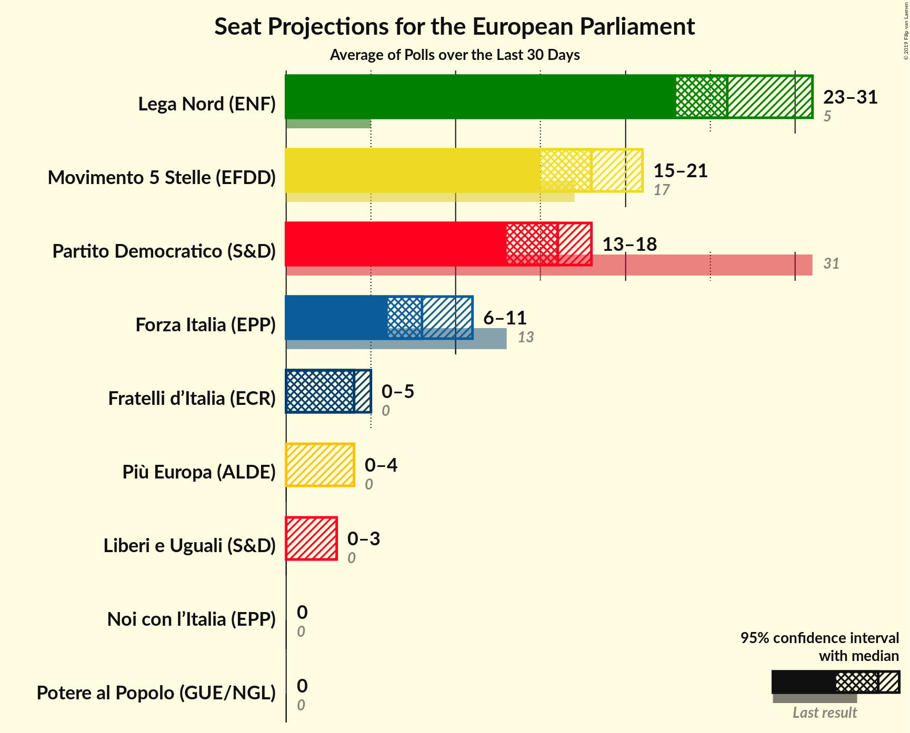

### Confidence Intervals

| Party | Last Result | Median | 80% Confidence Interval | 90% Confidence Interval | 95% Confidence Interval | 99% Confidence Interval |
|:-----:|:-----------:|:------:|:-----------------------:|:-----------------------:|:-----------------------:|:-----------------------:|
| <a href="#partito-democratico-(s&d)">Partito Democratico (S&D)</a> | 31 | 16 | 14–18 |14–18 | 13–18 | 12–19 |
| <a href="#movimento-5-stelle-(efdd)">Movimento 5 Stelle (EFDD)</a> | 17 | 18 | 16–19 |15–20 | 14–20 | 14–21 |
| <a href="#forza-italia-(epp)">Forza Italia (EPP)</a> | 13 | 8 | 7–9 |7–10 | 6–10 | 6–11 |
| <a href="#lega-nord-(enf)">Lega Nord (ENF)</a> | 5 | 26 | 24–30 |24–31 | 23–31 | 22–32 |
| <a href="#fratelli-d’italia-(ecr)">Fratelli d’Italia (ECR)</a> | 0 | 4 | 0–5 |0–5 | 0–6 | 0–6 |
| <a href="#südtiroler-volkspartei-(epp)">Südtiroler Volkspartei (EPP)</a> | 1 | N/A | N/A |N/A | N/A | N/A |
| <a href="#casapound-italia-(*)">CasaPound Italia (*)</a> | 0 | N/A | N/A |N/A | N/A | N/A |
| <a href="#civica-popolare-(*)">Civica Popolare (*)</a> | 0 | N/A | N/A |N/A | N/A | N/A |
| <a href="#insieme-(*)">Insieme (*)</a> | 0 | N/A | N/A |N/A | N/A | N/A |
| <a href="#noi-con-l’italia-(epp)">Noi con l’Italia (EPP)</a> | 0 | 0 | 0 |0 | 0 | 0 |
| <a href="#più-europa-(alde)">Più Europa (ALDE)</a> | 0 | 0 | 0 |0 | 0–3 | 0–4 |
| <a href="#liberi-e-uguali-(s&d)">Liberi e Uguali (S&D)</a> | 0 | 0 | 0 |0–3 | 0–4 | 0–4 |
| <a href="#potere-al-popolo-(gue/ngl)">Potere al Popolo (GUE/NGL)</a> | 0 | 0 | 0 |0 | 0 | 0 |

### Partito Democratico (S&D)

*For a full overview of the results for this party, see the [Partito Democratico (S&D)](party-partitodemocraticosd.html) page.*

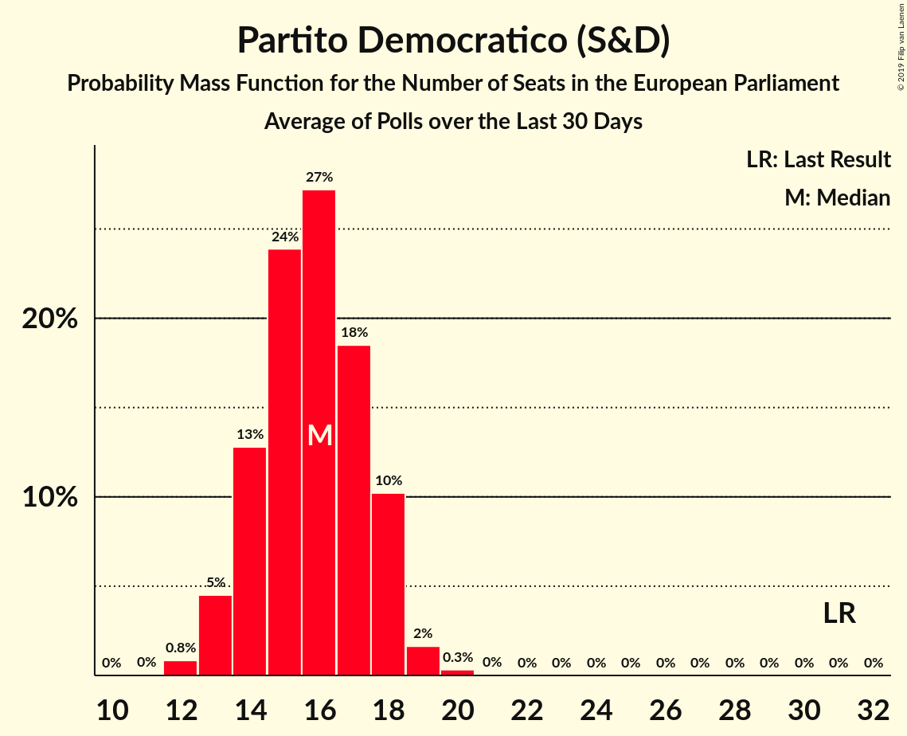

| Number of Seats | Probability | Accumulated | Special Marks |
|:---------------:|:-----------:|:-----------:|:-------------:|
| 12 | 0.6% | 100% |  |
| 13 | 4% | 99.4% |  |
| 14 | 17% | 95% |  |
| 15 | 26% | 78% |  |
| 16 | 23% | 52% | Median |
| 17 | 19% | 29% |  |
| 18 | 9% | 11% |  |
| 19 | 1.2% | 1.3% |  |
| 20 | 0.2% | 0.2% |  |
| 21 | 0% | 0% |  |
| 22 | 0% | 0% |  |
| 23 | 0% | 0% |  |
| 24 | 0% | 0% |  |
| 25 | 0% | 0% |  |
| 26 | 0% | 0% |  |
| 27 | 0% | 0% |  |
| 28 | 0% | 0% |  |
| 29 | 0% | 0% |  |
| 30 | 0% | 0% |  |
| 31 | 0% | 0% | Last Result |

### Movimento 5 Stelle (EFDD)

*For a full overview of the results for this party, see the [Movimento 5 Stelle (EFDD)](party-movimento5stelleefdd.html) page.*

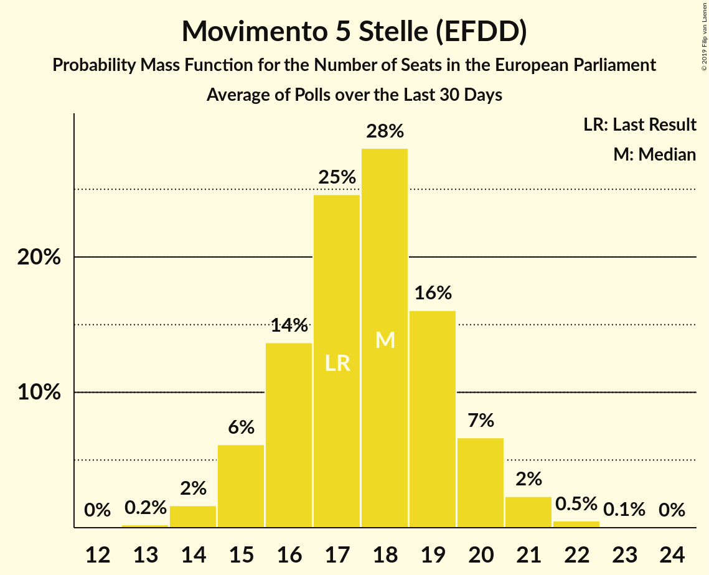

| Number of Seats | Probability | Accumulated | Special Marks |
|:---------------:|:-----------:|:-----------:|:-------------:|
| 13 | 0.1% | 100% |  |
| 14 | 3% | 99.9% |  |
| 15 | 4% | 97% |  |
| 16 | 11% | 93% |  |
| 17 | 21% | 82% | Last Result |
| 18 | 35% | 61% | Median |
| 19 | 18% | 26% |  |
| 20 | 7% | 8% |  |
| 21 | 2% | 2% |  |
| 22 | 0.3% | 0.3% |  |
| 23 | 0% | 0% |  |

### Forza Italia (EPP)

*For a full overview of the results for this party, see the [Forza Italia (EPP)](party-forzaitaliaepp.html) page.*

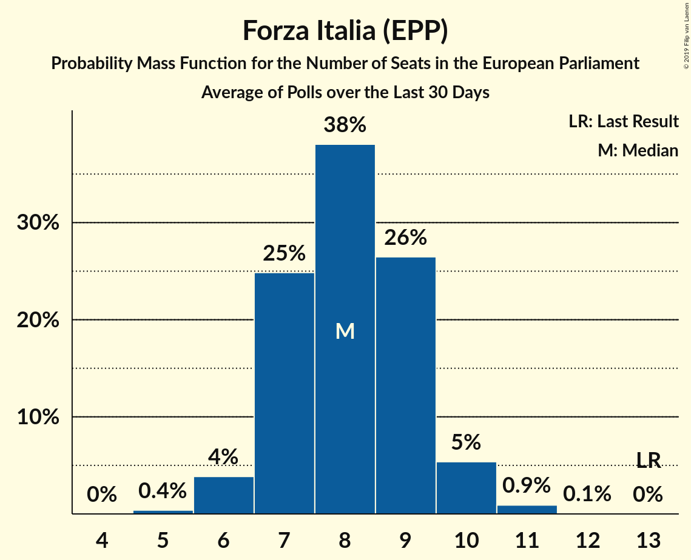

| Number of Seats | Probability | Accumulated | Special Marks |
|:---------------:|:-----------:|:-----------:|:-------------:|
| 5 | 0.4% | 100% |  |
| 6 | 4% | 99.6% |  |
| 7 | 25% | 96% |  |
| 8 | 38% | 71% | Median |
| 9 | 26% | 33% |  |
| 10 | 5% | 6% |  |
| 11 | 0.9% | 1.0% |  |
| 12 | 0.1% | 0.1% |  |
| 13 | 0% | 0% | Last Result |

### Lega Nord (ENF)

*For a full overview of the results for this party, see the [Lega Nord (ENF)](party-leganordenf.html) page.*

| Number of Seats | Probability | Accumulated | Special Marks |
|:---------------:|:-----------:|:-----------:|:-------------:|
| 5 | 0% | 100% | Last Result |
| 6 | 0% | 100% |  |
| 7 | 0% | 100% |  |
| 8 | 0% | 100% |  |
| 9 | 0% | 100% |  |
| 10 | 0% | 100% |  |
| 11 | 0% | 100% |  |
| 12 | 0% | 100% |  |
| 13 | 0% | 100% |  |
| 14 | 0% | 100% |  |
| 15 | 0% | 100% |  |
| 16 | 0% | 100% |  |
| 17 | 0% | 100% |  |
| 18 | 0% | 100% |  |
| 19 | 0% | 100% |  |
| 20 | 0% | 100% |  |
| 21 | 0.1% | 100% |  |
| 22 | 0.7% | 99.9% |  |
| 23 | 4% | 99.2% |  |
| 24 | 13% | 96% |  |
| 25 | 21% | 83% |  |
| 26 | 16% | 62% | Median |
| 27 | 15% | 46% |  |
| 28 | 13% | 30% |  |
| 29 | 5% | 17% |  |
| 30 | 4% | 12% |  |
| 31 | 6% | 7% |  |
| 32 | 1.2% | 2% |  |
| 33 | 0.4% | 0.5% |  |
| 34 | 0% | 0.1% |  |
| 35 | 0% | 0% |  |

### Fratelli d’Italia (ECR)

*For a full overview of the results for this party, see the [Fratelli d’Italia (ECR)](party-fratellid’italiaecr.html) page.*

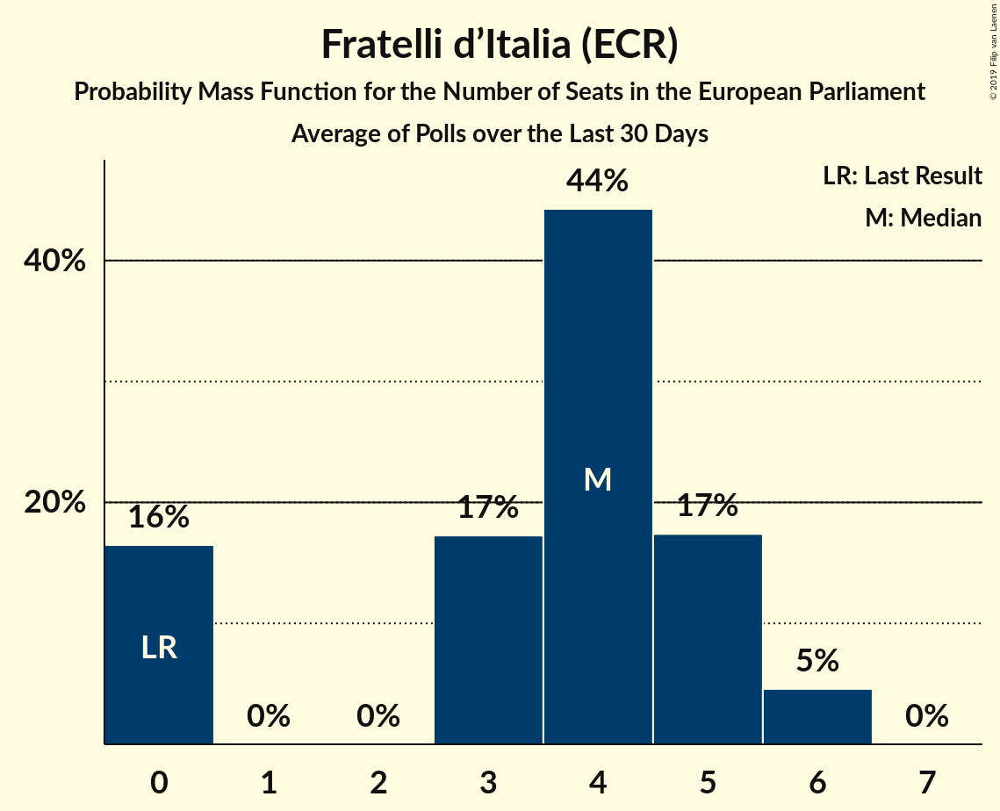

| Number of Seats | Probability | Accumulated | Special Marks |
|:---------------:|:-----------:|:-----------:|:-------------:|
| 0 | 17% | 100% | Last Result |
| 1 | 0% | 83% |  |
| 2 | 0% | 83% |  |
| 3 | 14% | 83% |  |
| 4 | 46% | 69% | Median |
| 5 | 18% | 23% |  |
| 6 | 5% | 5% |  |
| 7 | 0% | 0% |  |

### Liberi e Uguali (S&D)

*For a full overview of the results for this party, see the [Liberi e Uguali (S&D)](party-liberieugualisd.html) page.*

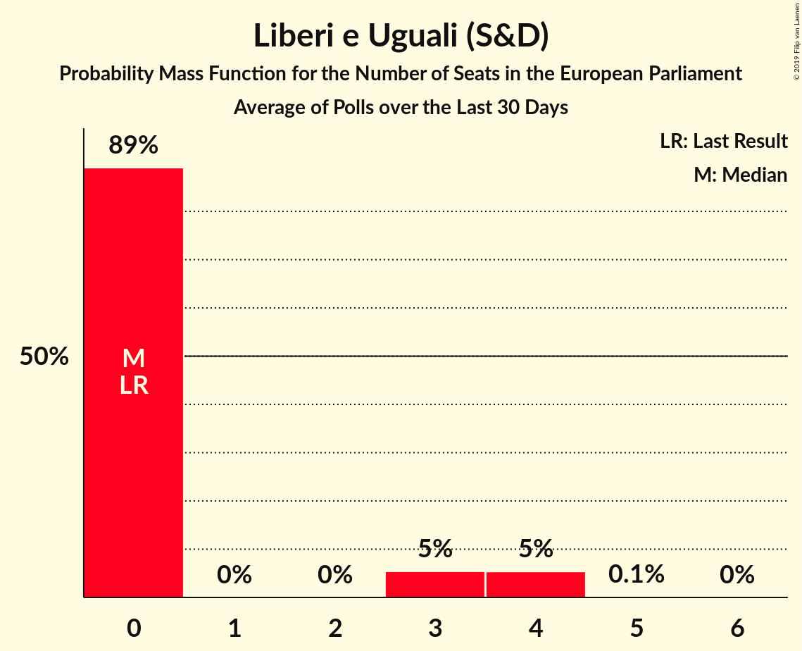

| Number of Seats | Probability | Accumulated | Special Marks |
|:---------------:|:-----------:|:-----------:|:-------------:|
| 0 | 94% | 100% | Last Result, Median |
| 1 | 0% | 6% |  |
| 2 | 0% | 6% |  |
| 3 | 3% | 6% |  |
| 4 | 3% | 3% |  |
| 5 | 0.1% | 0.1% |  |
| 6 | 0% | 0% |  |

### Più Europa (ALDE)

*For a full overview of the results for this party, see the [Più Europa (ALDE)](party-piùeuropaalde.html) page.*

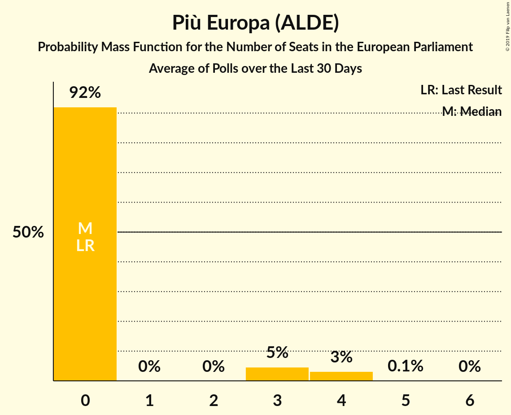

| Number of Seats | Probability | Accumulated | Special Marks |
|:---------------:|:-----------:|:-----------:|:-------------:|
| 0 | 96% | 100% | Last Result, Median |
| 1 | 0% | 4% |  |
| 2 | 0% | 4% |  |
| 3 | 2% | 4% |  |
| 4 | 1.3% | 1.4% |  |
| 5 | 0.1% | 0.1% |  |
| 6 | 0% | 0% |  |

### Potere al Popolo (GUE/NGL)

*For a full overview of the results for this party, see the [Potere al Popolo (GUE/NGL)](party-poterealpopologuengl.html) page.*

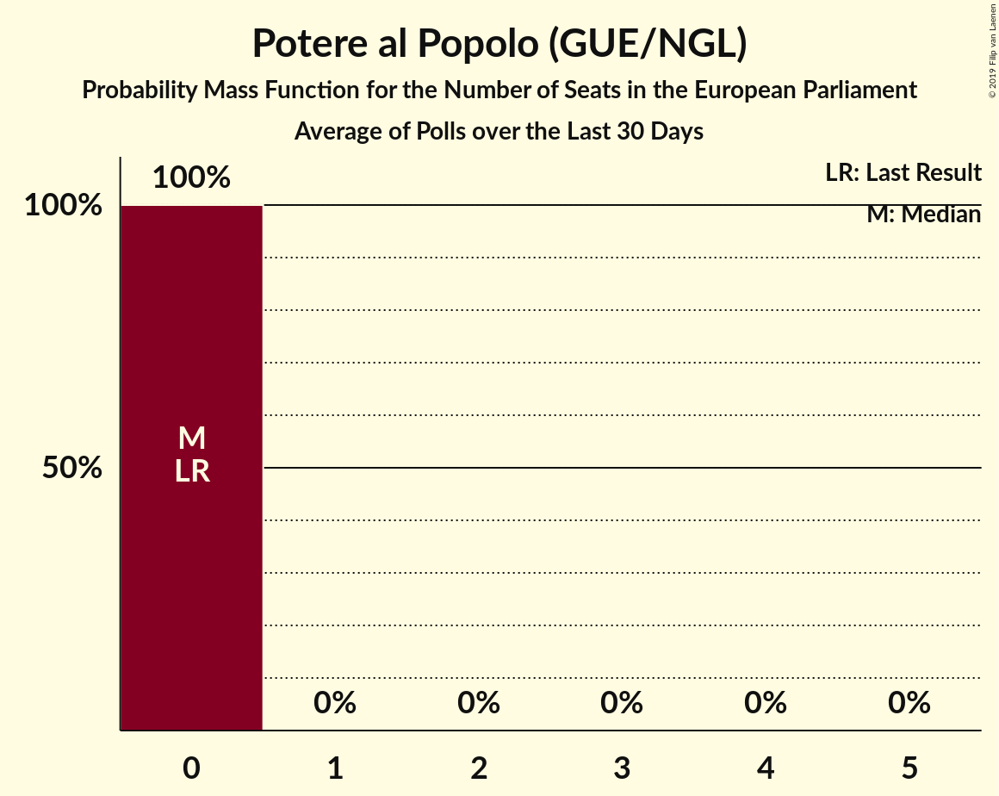

| Number of Seats | Probability | Accumulated | Special Marks |
|:---------------:|:-----------:|:-----------:|:-------------:|
| 0 | 100% | 100% | Last Result, Median |

### Noi con l’Italia (EPP)

*For a full overview of the results for this party, see the [Noi con l’Italia (EPP)](party-noiconl’italiaepp.html) page.*

| Number of Seats | Probability | Accumulated | Special Marks |
|:---------------:|:-----------:|:-----------:|:-------------:|
| 0 | 100% | 100% | Last Result, Median |

## Coalitions

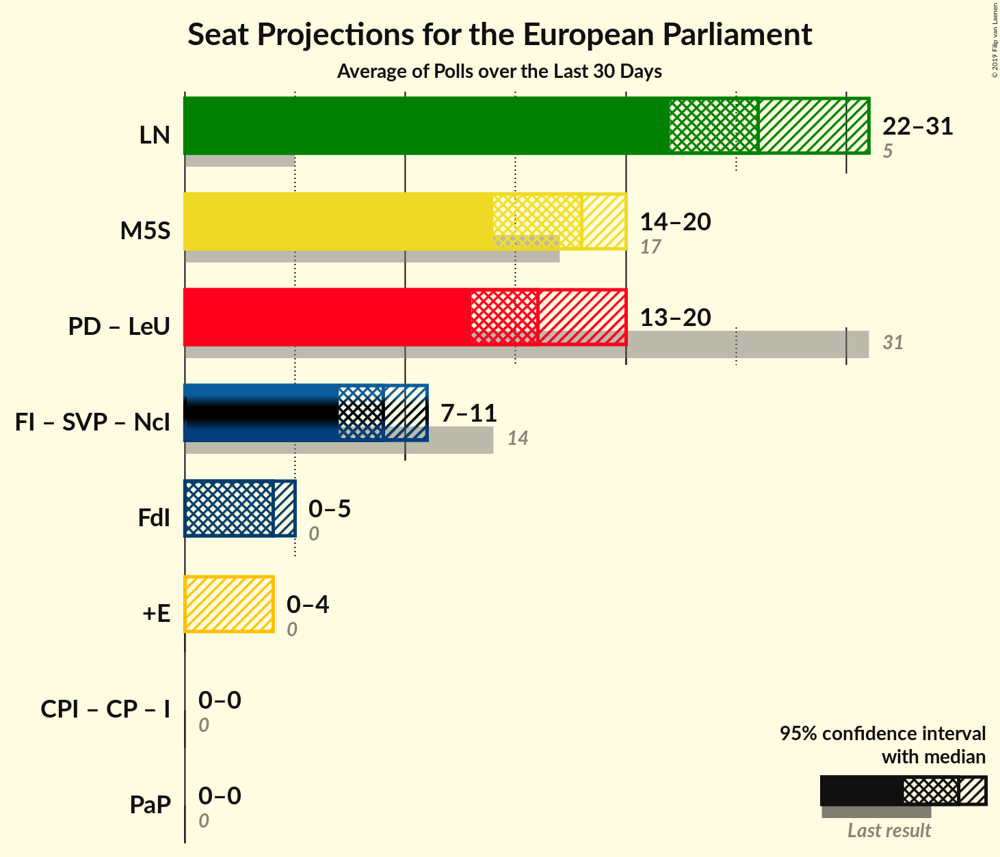

### Confidence Intervals

| Coalition | Last Result | Median | Majority? | 80% Confidence Interval | 90% Confidence Interval | 95% Confidence Interval | 99% Confidence Interval |
|:---------:|:-----------:|:------:|:---------:|:-----------------------:|:-----------------------:|:-----------------------:|:-----------------------:|
| Lega Nord (ENF) | 5 | 26 | 0% | 24–30 | 24–31 | 23–31 | 22–32 |
| Movimento 5 Stelle (EFDD) | 17 | 18 | 0% | 16–19 | 15–20 | 14–20 | 14–21 |
| Partito Democratico (S&D) – Liberi e Uguali (S&D) | 31 | 16 | 0% | 14–18 | 14–19 | 13–19 | 12–21 |
| Forza Italia (EPP) – Südtiroler Volkspartei (EPP) – Noi con l’Italia (EPP) | 14 | 9 | 0% | 8–10 | 8–11 | 7–11 | 7–12 |
| Fratelli d’Italia (ECR) | 0 | 4 | 0% | 0–5 | 0–5 | 0–6 | 0–6 |
| Più Europa (ALDE) | 0 | 0 | 0% | 0 | 0 | 0–3 | 0–4 |
| CasaPound Italia (*) – Civica Popolare (*) – Insieme (*) | 0 | 0 | 0% | 0 | 0 | 0 | 0 |
| Potere al Popolo (GUE/NGL) | 0 | 0 | 0% | 0 | 0 | 0 | 0 |

### Lega Nord (ENF)

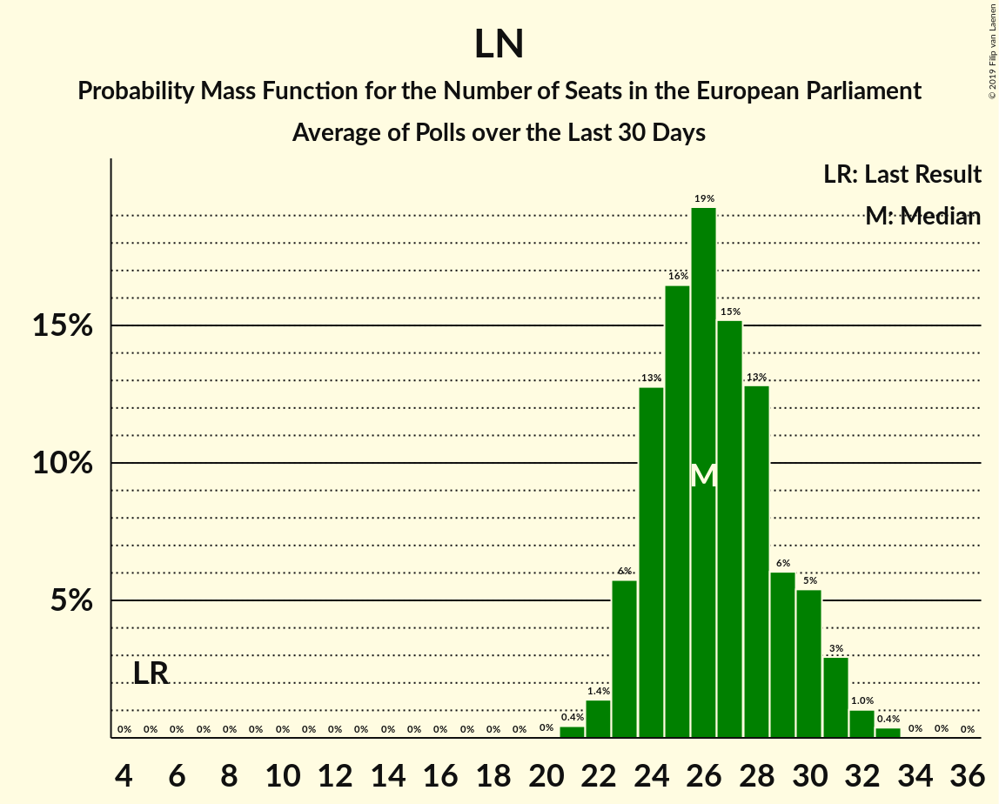

| Number of Seats | Probability | Accumulated | Special Marks |
|:---------------:|:-----------:|:-----------:|:-------------:|
| 5 | 0% | 100% | Last Result |
| 6 | 0% | 100% |  |
| 7 | 0% | 100% |  |
| 8 | 0% | 100% |  |
| 9 | 0% | 100% |  |
| 10 | 0% | 100% |  |
| 11 | 0% | 100% |  |
| 12 | 0% | 100% |  |
| 13 | 0% | 100% |  |
| 14 | 0% | 100% |  |
| 15 | 0% | 100% |  |
| 16 | 0% | 100% |  |
| 17 | 0% | 100% |  |
| 18 | 0% | 100% |  |
| 19 | 0% | 100% |  |
| 20 | 0% | 100% |  |
| 21 | 0.1% | 100% |  |
| 22 | 0.7% | 99.9% |  |
| 23 | 4% | 99.2% |  |
| 24 | 13% | 96% |  |
| 25 | 21% | 83% |  |
| 26 | 16% | 62% | Median |
| 27 | 15% | 46% |  |
| 28 | 13% | 30% |  |
| 29 | 5% | 17% |  |
| 30 | 4% | 12% |  |
| 31 | 6% | 7% |  |
| 32 | 1.2% | 2% |  |
| 33 | 0.4% | 0.5% |  |
| 34 | 0% | 0.1% |  |
| 35 | 0% | 0% |  |

### Movimento 5 Stelle (EFDD)

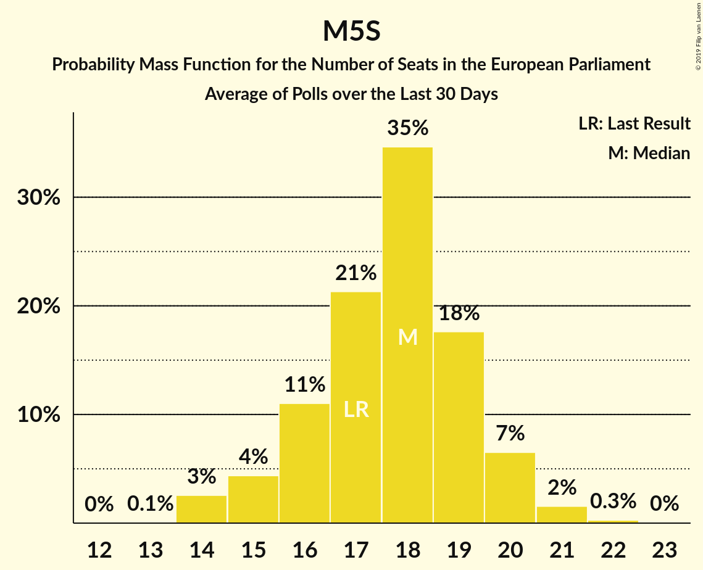

| Number of Seats | Probability | Accumulated | Special Marks |
|:---------------:|:-----------:|:-----------:|:-------------:|
| 13 | 0.1% | 100% |  |
| 14 | 3% | 99.9% |  |
| 15 | 4% | 97% |  |
| 16 | 11% | 93% |  |
| 17 | 21% | 82% | Last Result |
| 18 | 35% | 61% | Median |
| 19 | 18% | 26% |  |
| 20 | 7% | 8% |  |
| 21 | 2% | 2% |  |
| 22 | 0.3% | 0.3% |  |
| 23 | 0% | 0% |  |

### Partito Democratico (S&D) – Liberi e Uguali (S&D)

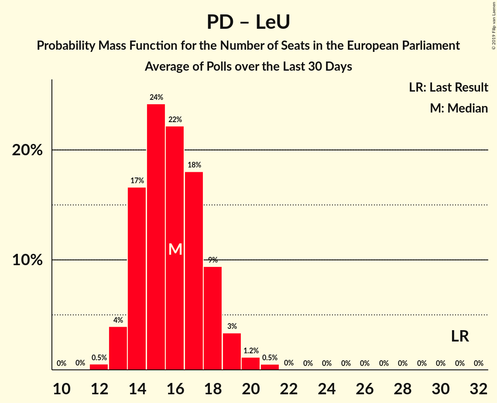

| Number of Seats | Probability | Accumulated | Special Marks |
|:---------------:|:-----------:|:-----------:|:-------------:|
| 12 | 0.5% | 100% |  |
| 13 | 4% | 99.4% |  |
| 14 | 17% | 95% |  |
| 15 | 24% | 79% |  |
| 16 | 22% | 55% | Median |
| 17 | 18% | 33% |  |
| 18 | 9% | 14% |  |
| 19 | 3% | 5% |  |
| 20 | 1.2% | 2% |  |
| 21 | 0.5% | 0.6% |  |
| 22 | 0% | 0% |  |
| 23 | 0% | 0% |  |
| 24 | 0% | 0% |  |
| 25 | 0% | 0% |  |
| 26 | 0% | 0% |  |
| 27 | 0% | 0% |  |
| 28 | 0% | 0% |  |
| 29 | 0% | 0% |  |
| 30 | 0% | 0% |  |
| 31 | 0% | 0% | Last Result |

### Forza Italia (EPP) – Südtiroler Volkspartei (EPP) – Noi con l’Italia (EPP)

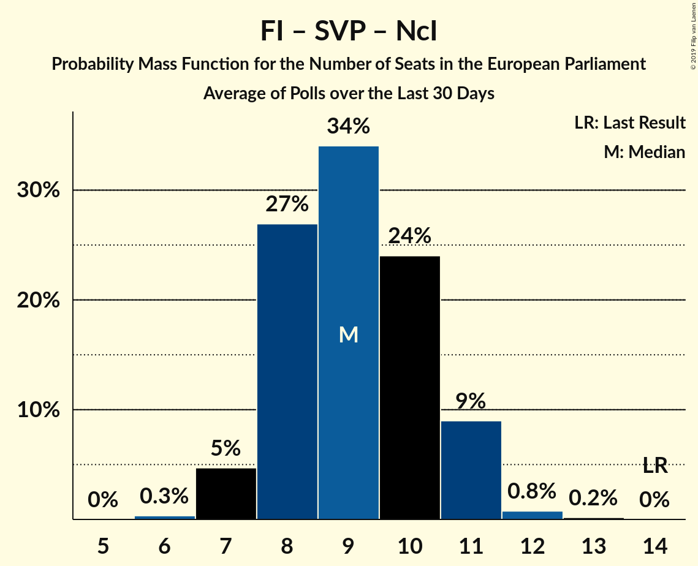

| Number of Seats | Probability | Accumulated | Special Marks |
|:---------------:|:-----------:|:-----------:|:-------------:|
| 6 | 0.4% | 100% |  |
| 7 | 4% | 99.6% |  |
| 8 | 25% | 96% | Median |
| 9 | 38% | 71% |  |
| 10 | 26% | 33% |  |
| 11 | 5% | 6% |  |
| 12 | 0.9% | 1.0% |  |
| 13 | 0.1% | 0.1% |  |
| 14 | 0% | 0% | Last Result |

### Fratelli d’Italia (ECR)

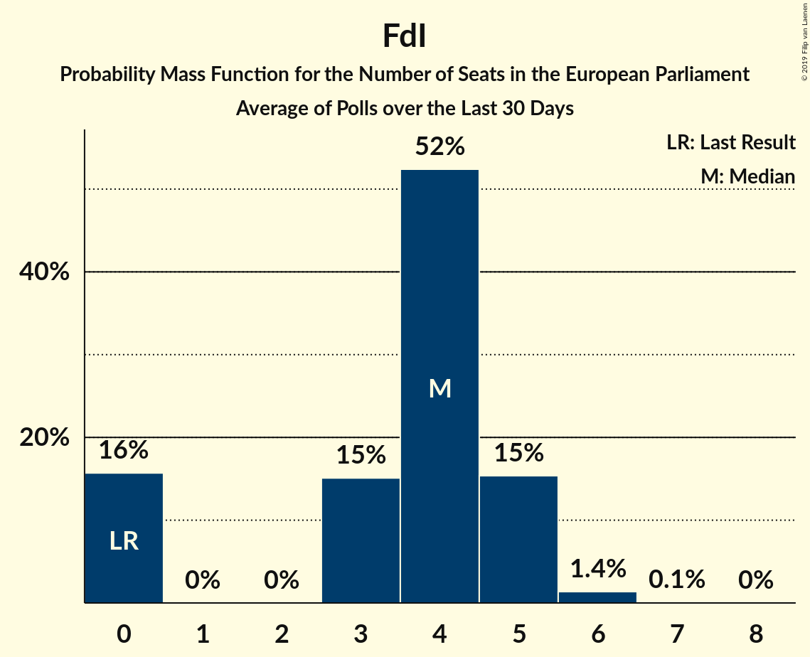

| Number of Seats | Probability | Accumulated | Special Marks |
|:---------------:|:-----------:|:-----------:|:-------------:|
| 0 | 17% | 100% | Last Result |
| 1 | 0% | 83% |  |
| 2 | 0% | 83% |  |
| 3 | 14% | 83% |  |
| 4 | 46% | 69% | Median |
| 5 | 18% | 23% |  |
| 6 | 5% | 5% |  |
| 7 | 0% | 0% |  |

### Più Europa (ALDE)

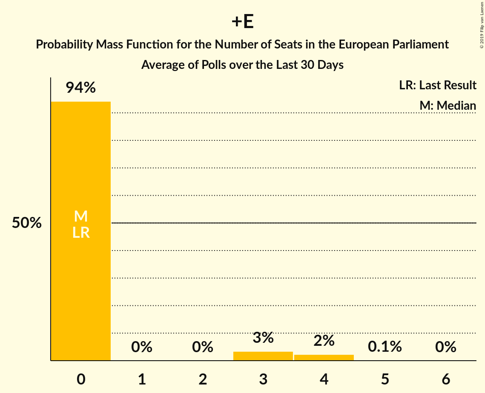

| Number of Seats | Probability | Accumulated | Special Marks |
|:---------------:|:-----------:|:-----------:|:-------------:|
| 0 | 97% | 100% | Last Result, Median |
| 1 | 0% | 3% |  |
| 2 | 0% | 3% |  |
| 3 | 2% | 3% |  |
| 4 | 1.1% | 1.1% |  |
| 5 | 0% | 0% |  |

### CasaPound Italia (*) – Civica Popolare (*) – Insieme (*)

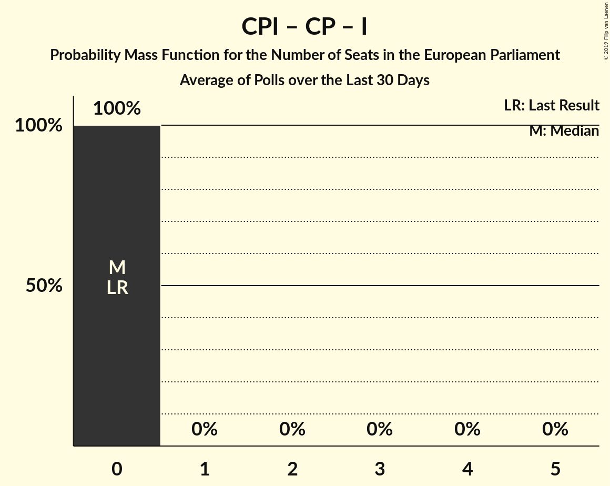

| Number of Seats | Probability | Accumulated | Special Marks |
|:---------------:|:-----------:|:-----------:|:-------------:|
| 0 | 100% | 100% | Last Result, Median |

### Potere al Popolo (GUE/NGL)

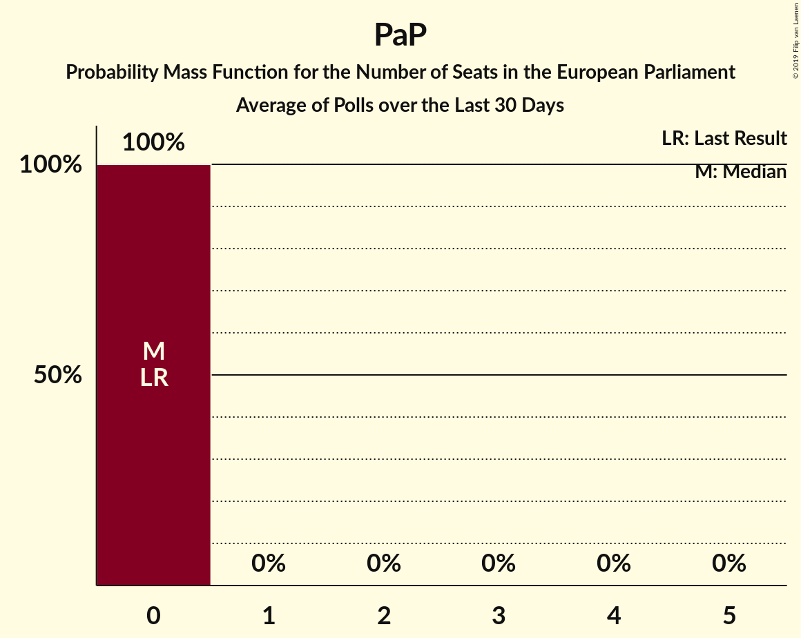

| Number of Seats | Probability | Accumulated | Special Marks |
|:---------------:|:-----------:|:-----------:|:-------------:|
| 0 | 100% | 100% | Last Result, Median |

## Technical Information

+ **Number of polls included in this average:** 12
+ **Lowest number of simulations done in a poll included in this average:** 0
+ **Total number of simulations done in the polls included in this average:** 6,817,792
+ **Error estimate:** 8.58%
