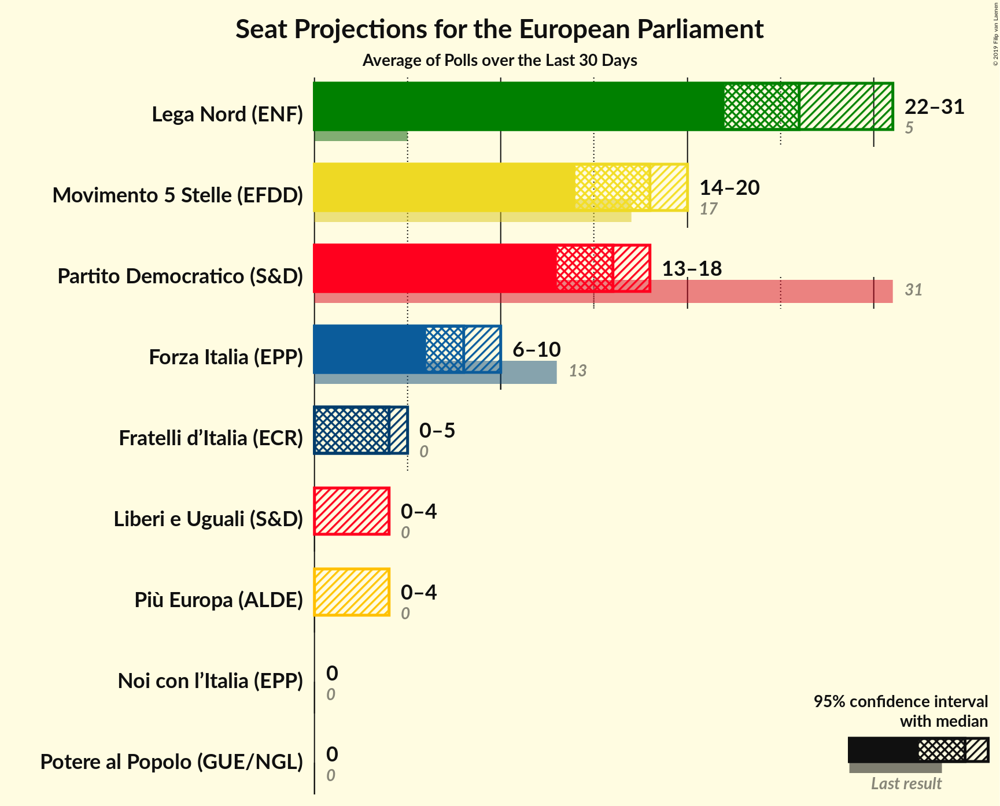
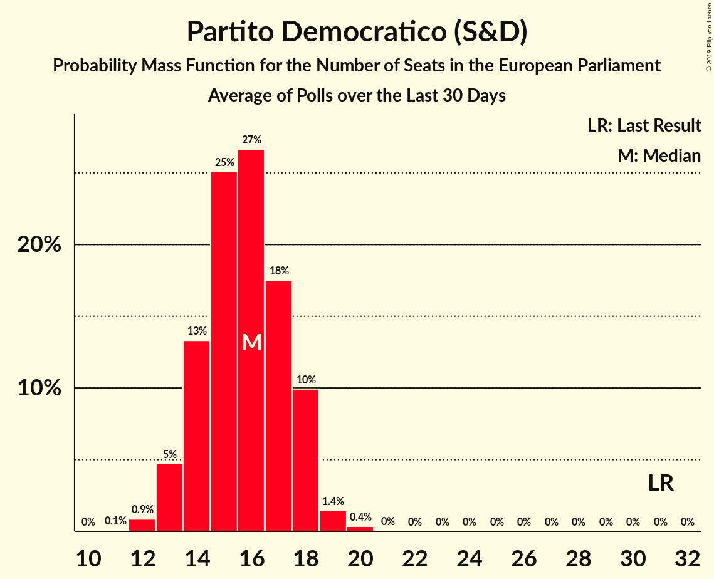
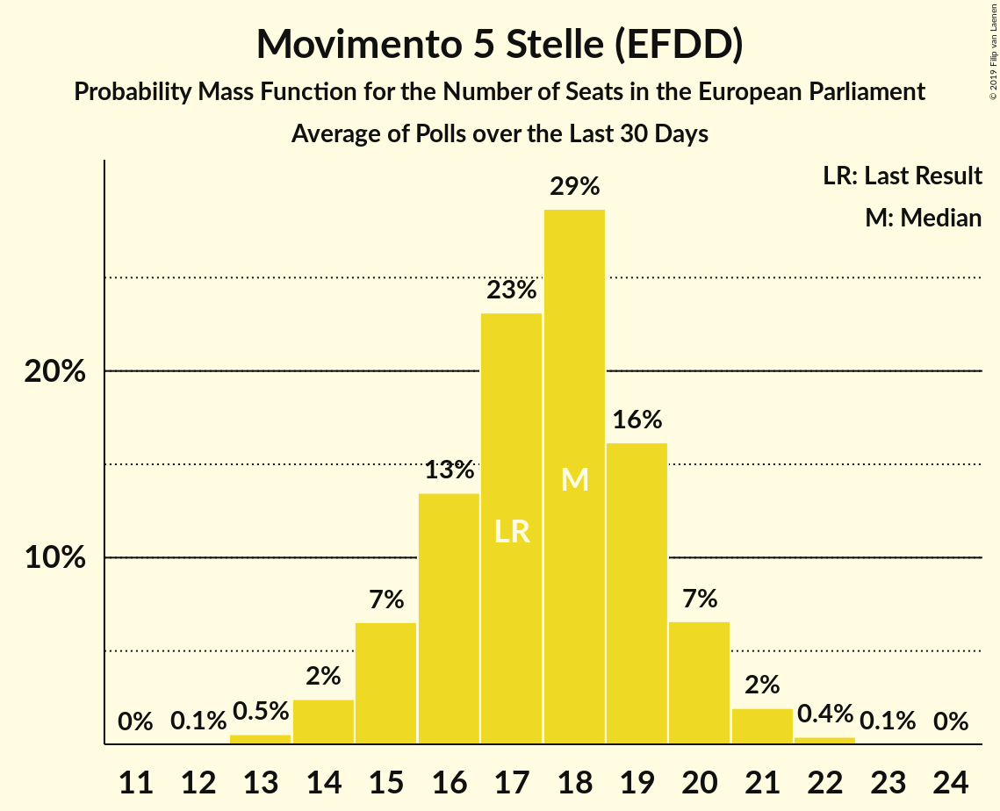
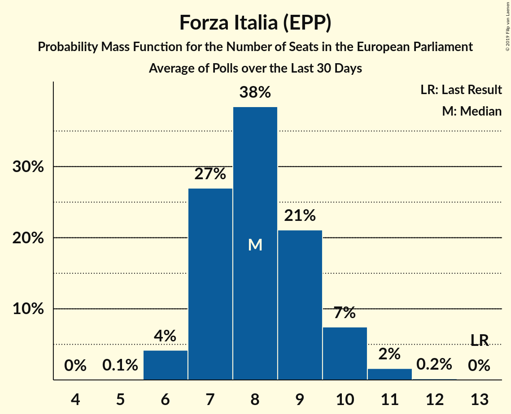
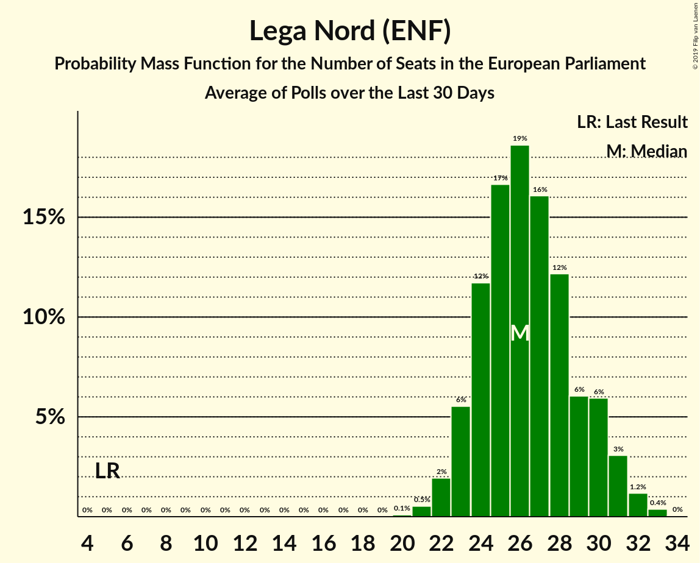
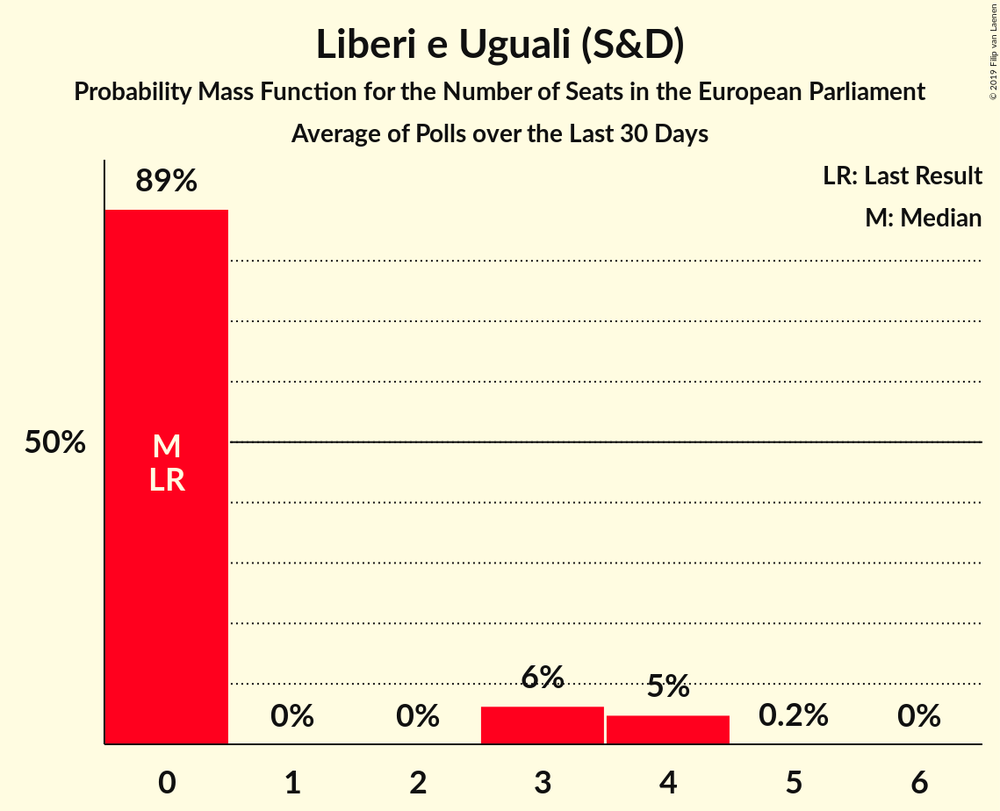
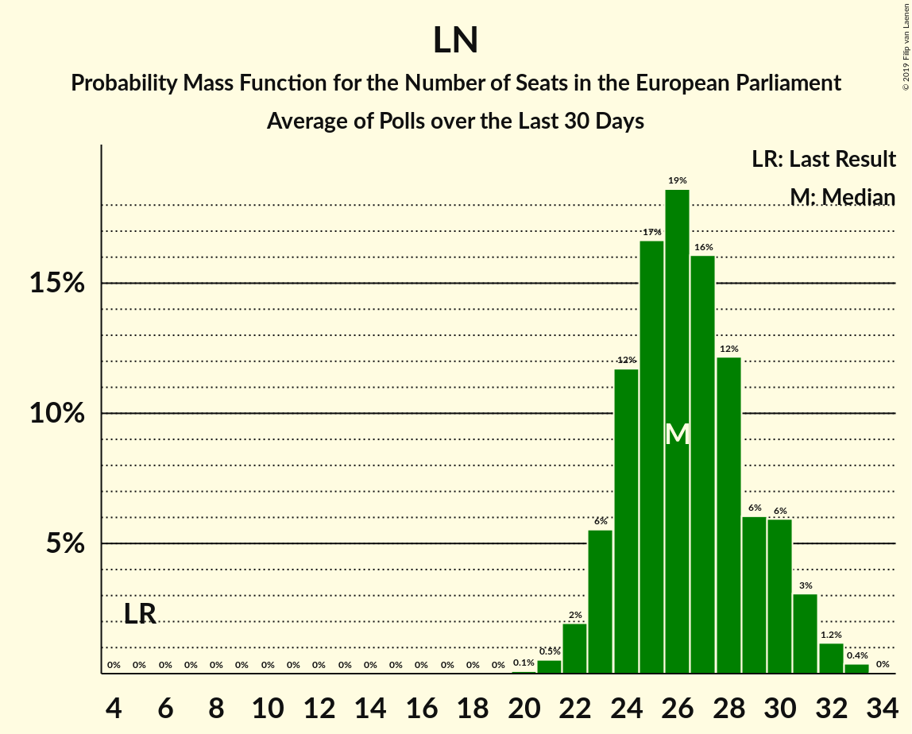
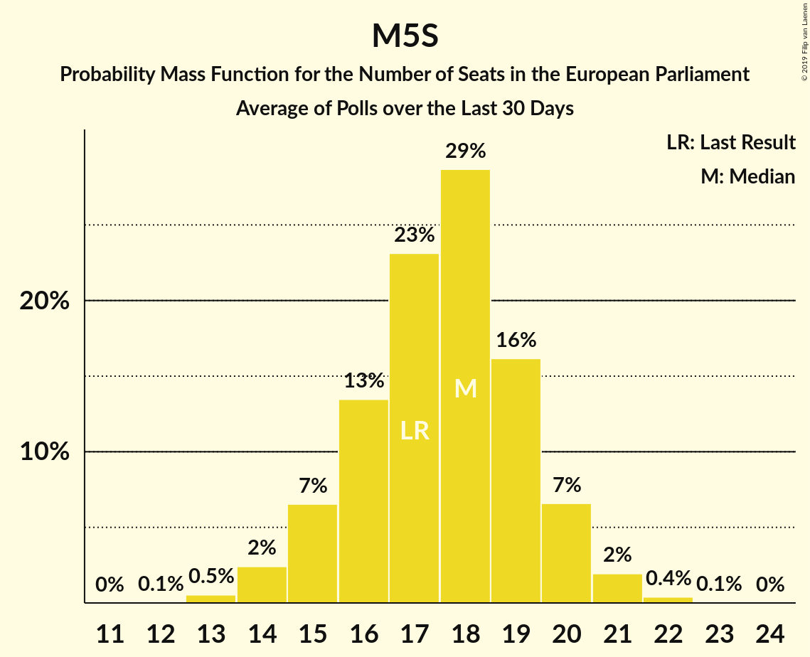
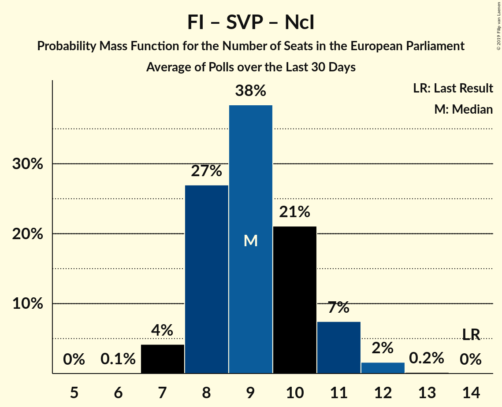
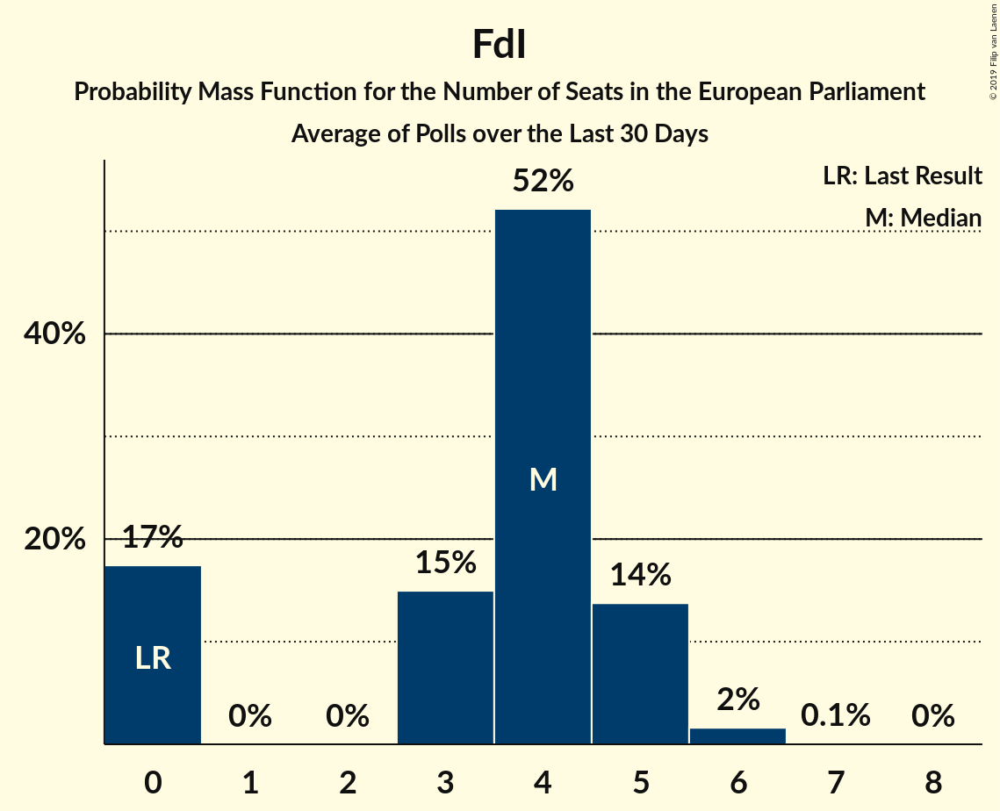

# Poll Average

<a href="#voting-intentions">Voting Intentions</a> | <a href="#seats">Seats</a> | <a href="#coalitions">Coalitions</a> | <a href="#technical-information">Technical Information</a>

## Summary

The table below lists the polls on which the average is based. They are the most recent polls (less than 30 days old) registered and analyzed so far.

| Period     | Polling firm/Commissioner(s) | PD | M5S | FI | LN | FdI | SVP | CPI | CP | I | NcI | +E | LeU | PaP |
|:----------:|:----------------------------:|:--:|:--:|:--:|:--:|:--:|:--:|:--:|:--:|:--:|:--:|:--:|:--:|:--:|
| 25 May 2014 | General Election | 40.8%   31 | 21.2%   17 | 16.8%   13 | 6.2%   5 | 3.7%   0 | 0.5%   1 | 0.0%   0 | 0.0%   0 | 0.0%   0 | 0.0%   0 | 0.0%   0 | 0.0%   0 | 0.0%   0 |
| N/A | Poll Average | 17–23%   13–18 | 18–25%   14–21 | 8–13%   6–10 | 30–38%   24–31 | 3–6%   0–5 | N/A   N/A | N/A   N/A | N/A   N/A | N/A   N/A | 0–1%   0 | 2–5%   0–4 | 2–4%   0 | 1–3%   0 |
| [26 March 2019](2019-03-26-NotoSondaggi.html) | Noto Sondaggi   Rai 3 | 19–24%   N/A | 19–24%   N/A | 9–13%   N/A | 29–35%   N/A | 3–6%   N/A | N/A   N/A | N/A   N/A | N/A   N/A | N/A   N/A | 0–1%   N/A | 2–5%   N/A | 1–3%   N/A | 1–2%   N/A |
| [22–25 March 2019](2019-03-25-ScenariPolitici–Winpoll.html) | Scenari Politici–Winpoll | N/A   N/A | N/A   N/A | N/A   N/A | N/A   N/A | N/A   N/A | N/A   N/A | N/A   N/A | N/A   N/A | N/A   N/A | N/A   N/A | N/A   N/A | N/A   N/A | N/A   N/A |
| [20–25 March 2019](2019-03-25-SWG.html) | SWG   LA7 | N/A   N/A | N/A   N/A | N/A   N/A | N/A   N/A | N/A   N/A | N/A   N/A | N/A   N/A | N/A   N/A | N/A   N/A | N/A   N/A | N/A   N/A | N/A   N/A | N/A   N/A |
| [20–21 March 2019](2019-03-21-Tecnè.html) | Tecnè   Rete 4 | 19–24%   13–17 | 18–22%   13–17 | 10–14%   7–11 | 30–36%   23–28 | 3–6%   0–5 | N/A   N/A | N/A   N/A | N/A   N/A | N/A   N/A | N/A   N/A | N/A   N/A | N/A   N/A | N/A   N/A |
| [21 March 2019](2019-03-21-Piepoli.html) | Piepoli   Rai 1 | N/A   N/A | N/A   N/A | N/A   N/A | N/A   N/A | N/A   N/A | N/A   N/A | N/A   N/A | N/A   N/A | N/A   N/A | N/A   N/A | N/A   N/A | N/A   N/A | N/A   N/A |
| [20–21 March 2019](2019-03-21-Euromedia.html) | Euromedia   Rai 1 | 18–24%   13–18 | 17–23%   14–18 | 9–14%   7–11 | 30–36%   24–30 | 3–6%   0–5 | N/A   N/A | N/A   N/A | N/A   N/A | N/A   N/A | N/A   N/A | 3–5%   0–4 | 1–4%   0 | N/A   N/A |
| [19–20 March 2019](2019-03-20-IndexResearch.html) | Index Research   LA7 | 19–24%   15–20 | 18–23%   15–20 | 7–11%   6–10 | 32–38%   27–32 | 3–6%   0–5 | N/A   N/A | N/A   N/A | N/A   N/A | N/A   N/A | N/A   N/A | 2–4%   0 | 2–4%   0–3 | 1–3%   0 |
| [19 March 2019](2019-03-19-EMGAcqua.html) | EMG Acqua   Rai 3 | 19–23%   14–18 | 22–25%   17–21 | 9–12%   7–9 | 29–33%   23–27 | 4–6%   0–5 | N/A   N/A | N/A   N/A | N/A   N/A | N/A   N/A | 0–1%   0 | 2–4%   0 | N/A   N/A | 1–2%   0 |
| [11–13 March 2019](2019-03-13-DemosPi.html) | Demos & Pi   La Repubblica | 17–22%   12–17 | 21–26%   17–21 | 8–12%   6–9 | 32–37%   25–31 | 3–6%   0–4 | N/A   N/A | N/A   N/A | N/A   N/A | N/A   N/A | N/A   N/A | 2–4%   0 | 2–4%   0 | N/A   N/A |
| [12–13 March 2019](2019-03-13-Demopolis.html) | Demopolis | 18–22%   13–17 | 21–25%   16–20 | 7–10%   6–8 | 31–35%   24–28 | 3–5%   0–4 | N/A   N/A | N/A   N/A | N/A   N/A | N/A   N/A | N/A   N/A | N/A   N/A | N/A   N/A | N/A   N/A |
| [26–28 February 2019](2019-02-28-Ipsos.html) | Ipsos   Corriere della Sera | 16–21%   12–16 | 19–24%   15–20 | 7–11%   6–9 | 33–39%   26–32 | 3–5%   0–4 | N/A   N/A | N/A   N/A | N/A   N/A | N/A   N/A | 0–1%   0 | 3–5%   0–4 | 2–4%   0 | N/A   N/A |
| [22–27 February 2019](2019-02-27-BiDiMedia.html) | BiDiMedia | 17–21%   13–17 | 20–25%   17–22 | 8–11%   7–10 | 30–35%   24–30 | 3–5%   0–4 | N/A   N/A | N/A   N/A | N/A   N/A | N/A   N/A | 0–1%   0 | 2–4%   0 | 2–4%   0 | 1–3%   0 |
| 25 May 2014 | General Election | 40.8%   31 | 21.2%   17 | 16.8%   13 | 6.2%   5 | 3.7%   0 | 0.5%   1 | 0.0%   0 | 0.0%   0 | 0.0%   0 | 0.0%   0 | 0.0%   0 | 0.0%   0 | 0.0%   0 |

Only polls for which at least the sample size has been published are included in the table above.

**Legend:**
+ **Top half of each row:** Voting intentions (95% confidence interval)
+ **Bottom half of each row:** Seat projections for the European Parliament (95% confidence interval)
+ **PD:** Partito Democratico (S&D)
+ **M5S:** Movimento 5 Stelle (EFDD)
+ **FI:** Forza Italia (EPP)
+ **LN:** Lega Nord (ENF)
+ **FdI:** Fratelli d’Italia (ECR)
+ **SVP:** Südtiroler Volkspartei (EPP)
+ **CPI:** CasaPound Italia (*)
+ **CP:** Civica Popolare (*)
+ **I:** Insieme (*)
+ **NcI:** Noi con l’Italia (EPP)
+ **+E:** Più Europa (ALDE)
+ **LeU:** Liberi e Uguali (S&D)
+ **PaP:** Potere al Popolo (GUE/NGL)
+ **N/A (single party):** Party not included the published results
+ **N/A (entire row):** Calculation for this opinion poll not started yet

## Voting Intentions

### Confidence Intervals

| Party | Last Result | Median | 80% Confidence Interval | 90% Confidence Interval | 95% Confidence Interval | 99% Confidence Interval |
|:-----:|:-----------:|:------:|:-----------------------:|:-----------------------:|:-----------------------:|:-----------------------:|
| <a href="#partito-democratico-(s&d)">Partito Democratico (S&D)</a> | 40.8% | 20.3% | 18.1–22.3% |17.6–22.8% | 17.1–23.3% | 16.2–24.3% |
| <a href="#movimento-5-stelle-(efdd)">Movimento 5 Stelle (EFDD)</a> | 21.2% | 21.7% | 19.2–24.0% |18.6–24.5% | 18.1–25.0% | 17.1–25.9% |
| <a href="#forza-italia-(epp)">Forza Italia (EPP)</a> | 16.8% | 9.9% | 8.3–12.0% |7.9–12.6% | 7.6–13.0% | 7.0–13.9% |
| <a href="#lega-nord-(enf)">Lega Nord (ENF)</a> | 6.2% | 33.2% | 30.7–36.1% |30.1–36.9% | 29.7–37.5% | 28.8–38.8% |
| <a href="#fratelli-d’italia-(ecr)">Fratelli d’Italia (ECR)</a> | 3.7% | 4.4% | 3.5–5.4% |3.2–5.6% | 3.1–5.9% | 2.7–6.5% |
| <a href="#südtiroler-volkspartei-(epp)">Südtiroler Volkspartei (EPP)</a> | 0.5% | N/A | N/A |N/A | N/A | N/A |
| <a href="#casapound-italia-(*)">CasaPound Italia (*)</a> | 0.0% | N/A | N/A |N/A | N/A | N/A |
| <a href="#civica-popolare-(*)">Civica Popolare (*)</a> | 0.0% | N/A | N/A |N/A | N/A | N/A |
| <a href="#insieme-(*)">Insieme (*)</a> | 0.0% | N/A | N/A |N/A | N/A | N/A |
| <a href="#noi-con-l’italia-(epp)">Noi con l’Italia (EPP)</a> | 0.0% | 0.6% | 0.3–1.0% |0.3–1.1% | 0.2–1.2% | 0.2–1.4% |
| <a href="#più-europa-(alde)">Più Europa (ALDE)</a> | 0.0% | 3.2% | 2.3–4.3% |2.1–4.6% | 1.9–4.9% | 1.6–5.4% |
| <a href="#liberi-e-uguali-(s&d)">Liberi e Uguali (S&D)</a> | 0.0% | 2.5% | 1.8–3.3% |1.7–3.5% | 1.5–3.7% | 1.3–4.2% |
| <a href="#potere-al-popolo-(gue/ngl)">Potere al Popolo (GUE/NGL)</a> | 0.0% | 1.6% | 1.0–2.2% |0.8–2.4% | 0.8–2.6% | 0.5–3.0% |

### Partito Democratico (S&D)

*For a full overview of the results for this party, see the [Partito Democratico (S&D)](party-partitodemocraticosd.html) page.*

| Voting Intentions | Probability | Accumulated | Special Marks |
|:-----------------:|:-----------:|:-----------:|:-------------:|
| 13.5–14.5% | 0% | 100% |  |
| 14.5–15.5% | 0.1% | 100% |  |
| 15.5–16.5% | 0.9% | 99.9% |  |
| 16.5–17.5% | 4% | 99.0% |  |
| 17.5–18.5% | 10% | 95% |  |
| 18.5–19.5% | 18% | 85% |  |
| 19.5–20.5% | 23% | 67% | Median |
| 20.5–21.5% | 22% | 43% |  |
| 21.5–22.5% | 14% | 21% |  |
| 22.5–23.5% | 5% | 7% |  |
| 23.5–24.5% | 1.4% | 2% |  |
| 24.5–25.5% | 0.3% | 0.3% |  |
| 25.5–26.5% | 0% | 0% |  |
| 26.5–27.5% | 0% | 0% |  |
| 27.5–28.5% | 0% | 0% |  |
| 28.5–29.5% | 0% | 0% |  |
| 29.5–30.5% | 0% | 0% |  |
| 30.5–31.5% | 0% | 0% |  |
| 31.5–32.5% | 0% | 0% |  |
| 32.5–33.5% | 0% | 0% |  |
| 33.5–34.5% | 0% | 0% |  |
| 34.5–35.5% | 0% | 0% |  |
| 35.5–36.5% | 0% | 0% |  |
| 36.5–37.5% | 0% | 0% |  |
| 37.5–38.5% | 0% | 0% |  |
| 38.5–39.5% | 0% | 0% |  |
| 39.5–40.5% | 0% | 0% |  |
| 40.5–41.5% | 0% | 0% | Last Result |

### Movimento 5 Stelle (EFDD)

*For a full overview of the results for this party, see the [Movimento 5 Stelle (EFDD)](party-movimento5stelleefdd.html) page.*

| Voting Intentions | Probability | Accumulated | Special Marks |
|:-----------------:|:-----------:|:-----------:|:-------------:|
| 14.5–15.5% | 0% | 100% |  |
| 15.5–16.5% | 0.1% | 100% |  |
| 16.5–17.5% | 0.9% | 99.9% |  |
| 17.5–18.5% | 4% | 98.9% |  |
| 18.5–19.5% | 10% | 95% |  |
| 19.5–20.5% | 15% | 85% |  |
| 20.5–21.5% | 18% | 71% | Last Result |
| 21.5–22.5% | 19% | 53% | Median |
| 22.5–23.5% | 18% | 34% |  |
| 23.5–24.5% | 11% | 16% |  |
| 24.5–25.5% | 4% | 5% |  |
| 25.5–26.5% | 0.8% | 1.0% |  |
| 26.5–27.5% | 0.1% | 0.1% |  |
| 27.5–28.5% | 0% | 0% |  |

### Forza Italia (EPP)

*For a full overview of the results for this party, see the [Forza Italia (EPP)](party-forzaitaliaepp.html) page.*

| Voting Intentions | Probability | Accumulated | Special Marks |
|:-----------------:|:-----------:|:-----------:|:-------------:|
| 4.5–5.5% | 0% | 100% |  |
| 5.5–6.5% | 0.1% | 100% |  |
| 6.5–7.5% | 2% | 99.9% |  |
| 7.5–8.5% | 13% | 98% |  |
| 8.5–9.5% | 26% | 85% |  |
| 9.5–10.5% | 25% | 59% | Median |
| 10.5–11.5% | 18% | 34% |  |
| 11.5–12.5% | 11% | 16% |  |
| 12.5–13.5% | 4% | 5% |  |
| 13.5–14.5% | 0.9% | 1.0% |  |
| 14.5–15.5% | 0.1% | 0.1% |  |
| 15.5–16.5% | 0% | 0% |  |
| 16.5–17.5% | 0% | 0% | Last Result |

### Lega Nord (ENF)

*For a full overview of the results for this party, see the [Lega Nord (ENF)](party-leganordenf.html) page.*

| Voting Intentions | Probability | Accumulated | Special Marks |
|:-----------------:|:-----------:|:-----------:|:-------------:|
| 5.5–6.5% | 0% | 100% | Last Result |
| 6.5–7.5% | 0% | 100% |  |
| 7.5–8.5% | 0% | 100% |  |
| 8.5–9.5% | 0% | 100% |  |
| 9.5–10.5% | 0% | 100% |  |
| 10.5–11.5% | 0% | 100% |  |
| 11.5–12.5% | 0% | 100% |  |
| 12.5–13.5% | 0% | 100% |  |
| 13.5–14.5% | 0% | 100% |  |
| 14.5–15.5% | 0% | 100% |  |
| 15.5–16.5% | 0% | 100% |  |
| 16.5–17.5% | 0% | 100% |  |
| 17.5–18.5% | 0% | 100% |  |
| 18.5–19.5% | 0% | 100% |  |
| 19.5–20.5% | 0% | 100% |  |
| 20.5–21.5% | 0% | 100% |  |
| 21.5–22.5% | 0% | 100% |  |
| 22.5–23.5% | 0% | 100% |  |
| 23.5–24.5% | 0% | 100% |  |
| 24.5–25.5% | 0% | 100% |  |
| 25.5–26.5% | 0% | 100% |  |
| 26.5–27.5% | 0% | 100% |  |
| 27.5–28.5% | 0.3% | 100% |  |
| 28.5–29.5% | 2% | 99.7% |  |
| 29.5–30.5% | 6% | 98% |  |
| 30.5–31.5% | 12% | 92% |  |
| 31.5–32.5% | 17% | 79% |  |
| 32.5–33.5% | 19% | 62% | Median |
| 33.5–34.5% | 17% | 43% |  |
| 34.5–35.5% | 12% | 27% |  |
| 35.5–36.5% | 8% | 15% |  |
| 36.5–37.5% | 4% | 7% |  |
| 37.5–38.5% | 2% | 2% |  |
| 38.5–39.5% | 0.5% | 0.7% |  |
| 39.5–40.5% | 0.1% | 0.1% |  |
| 40.5–41.5% | 0% | 0% |  |

### Fratelli d’Italia (ECR)

*For a full overview of the results for this party, see the [Fratelli d’Italia (ECR)](party-fratellid’italiaecr.html) page.*

| Voting Intentions | Probability | Accumulated | Special Marks |
|:-----------------:|:-----------:|:-----------:|:-------------:|
| 0.5–1.5% | 0% | 100% |  |
| 1.5–2.5% | 0.1% | 100% |  |
| 2.5–3.5% | 13% | 99.9% |  |
| 3.5–4.5% | 47% | 87% | Last Result, Median |
| 4.5–5.5% | 33% | 40% |  |
| 5.5–6.5% | 6% | 6% |  |
| 6.5–7.5% | 0.4% | 0.4% |  |
| 7.5–8.5% | 0% | 0% |  |

### Liberi e Uguali (S&D)

*For a full overview of the results for this party, see the [Liberi e Uguali (S&D)](party-liberieugualisd.html) page.*

| Voting Intentions | Probability | Accumulated | Special Marks |
|:-----------------:|:-----------:|:-----------:|:-------------:|
| 0.0–0.5% | 0% | 100% | Last Result |
| 0.5–1.5% | 3% | 100% |  |
| 1.5–2.5% | 52% | 97% | Median |
| 2.5–3.5% | 41% | 45% |  |
| 3.5–4.5% | 4% | 4% |  |
| 4.5–5.5% | 0.1% | 0.1% |  |
| 5.5–6.5% | 0% | 0% |  |

### Più Europa (ALDE)

*For a full overview of the results for this party, see the [Più Europa (ALDE)](party-piùeuropaalde.html) page.*

| Voting Intentions | Probability | Accumulated | Special Marks |
|:-----------------:|:-----------:|:-----------:|:-------------:|
| 0.0–0.5% | 0% | 100% | Last Result |
| 0.5–1.5% | 0.3% | 100% |  |
| 1.5–2.5% | 19% | 99.7% |  |
| 2.5–3.5% | 49% | 80% | Median |
| 3.5–4.5% | 26% | 32% |  |
| 4.5–5.5% | 5% | 6% |  |
| 5.5–6.5% | 0.4% | 0.4% |  |
| 6.5–7.5% | 0% | 0% |  |

### Noi con l’Italia (EPP)

*For a full overview of the results for this party, see the [Noi con l’Italia (EPP)](party-noiconl’italiaepp.html) page.*

| Voting Intentions | Probability | Accumulated | Special Marks |
|:-----------------:|:-----------:|:-----------:|:-------------:|
| 0.0–0.5% | 37% | 100% | Last Result |
| 0.5–1.5% | 63% | 63% | Median |
| 1.5–2.5% | 0.3% | 0.3% |  |
| 2.5–3.5% | 0% | 0% |  |

### Potere al Popolo (GUE/NGL)

*For a full overview of the results for this party, see the [Potere al Popolo (GUE/NGL)](party-poterealpopologuengl.html) page.*

| Voting Intentions | Probability | Accumulated | Special Marks |
|:-----------------:|:-----------:|:-----------:|:-------------:|
| 0.0–0.5% | 0.6% | 100% | Last Result |
| 0.5–1.5% | 46% | 99.4% |  |
| 1.5–2.5% | 51% | 54% | Median |
| 2.5–3.5% | 3% | 3% |  |
| 3.5–4.5% | 0.1% | 0.1% |  |
| 4.5–5.5% | 0% | 0% |  |

## Seats

### Confidence Intervals

| Party | Last Result | Median | 80% Confidence Interval | 90% Confidence Interval | 95% Confidence Interval | 99% Confidence Interval |
|:-----:|:-----------:|:------:|:-----------------------:|:-----------------------:|:-----------------------:|:-----------------------:|
| <a href="#partito-democratico-(s&d)">Partito Democratico (S&D)</a> | 31 | 15 | 14–17 |13–18 | 13–18 | 12–19 |
| <a href="#movimento-5-stelle-(efdd)">Movimento 5 Stelle (EFDD)</a> | 17 | 18 | 15–20 |15–20 | 14–21 | 13–22 |
| <a href="#forza-italia-(epp)">Forza Italia (EPP)</a> | 13 | 8 | 7–9 |6–10 | 6–10 | 6–11 |
| <a href="#lega-nord-(enf)">Lega Nord (ENF)</a> | 5 | 27 | 25–30 |24–31 | 24–31 | 23–32 |
| <a href="#fratelli-d’italia-(ecr)">Fratelli d’Italia (ECR)</a> | 0 | 3 | 0–4 |0–5 | 0–5 | 0–5 |
| <a href="#südtiroler-volkspartei-(epp)">Südtiroler Volkspartei (EPP)</a> | 1 | N/A | N/A |N/A | N/A | N/A |
| <a href="#casapound-italia-(*)">CasaPound Italia (*)</a> | 0 | N/A | N/A |N/A | N/A | N/A |
| <a href="#civica-popolare-(*)">Civica Popolare (*)</a> | 0 | N/A | N/A |N/A | N/A | N/A |
| <a href="#insieme-(*)">Insieme (*)</a> | 0 | N/A | N/A |N/A | N/A | N/A |
| <a href="#noi-con-l’italia-(epp)">Noi con l’Italia (EPP)</a> | 0 | 0 | 0 |0 | 0 | 0 |
| <a href="#più-europa-(alde)">Più Europa (ALDE)</a> | 0 | 0 | 0–3 |0–4 | 0–4 | 0–4 |
| <a href="#liberi-e-uguali-(s&d)">Liberi e Uguali (S&D)</a> | 0 | 0 | 0 |0 | 0 | 0–3 |
| <a href="#potere-al-popolo-(gue/ngl)">Potere al Popolo (GUE/NGL)</a> | 0 | 0 | 0 |0 | 0 | 0 |

### Partito Democratico (S&D)

*For a full overview of the results for this party, see the [Partito Democratico (S&D)](party-partitodemocraticosd.html) page.*

| Number of Seats | Probability | Accumulated | Special Marks |
|:---------------:|:-----------:|:-----------:|:-------------:|
| 11 | 0.1% | 100% |  |
| 12 | 1.5% | 99.9% |  |
| 13 | 8% | 98% |  |
| 14 | 21% | 91% |  |
| 15 | 29% | 70% | Median |
| 16 | 22% | 40% |  |
| 17 | 12% | 18% |  |
| 18 | 4% | 6% |  |
| 19 | 2% | 2% |  |
| 20 | 0.4% | 0.4% |  |
| 21 | 0.1% | 0.1% |  |
| 22 | 0% | 0% |  |
| 23 | 0% | 0% |  |
| 24 | 0% | 0% |  |
| 25 | 0% | 0% |  |
| 26 | 0% | 0% |  |
| 27 | 0% | 0% |  |
| 28 | 0% | 0% |  |
| 29 | 0% | 0% |  |
| 30 | 0% | 0% |  |
| 31 | 0% | 0% | Last Result |

### Movimento 5 Stelle (EFDD)

*For a full overview of the results for this party, see the [Movimento 5 Stelle (EFDD)](party-movimento5stelleefdd.html) page.*

| Number of Seats | Probability | Accumulated | Special Marks |
|:---------------:|:-----------:|:-----------:|:-------------:|
| 13 | 0.7% | 100% |  |
| 14 | 4% | 99.2% |  |
| 15 | 10% | 95% |  |
| 16 | 14% | 85% |  |
| 17 | 20% | 71% | Last Result |
| 18 | 22% | 52% | Median |
| 19 | 18% | 30% |  |
| 20 | 8% | 12% |  |
| 21 | 3% | 3% |  |
| 22 | 0.5% | 0.5% |  |
| 23 | 0% | 0.1% |  |
| 24 | 0% | 0% |  |

### Forza Italia (EPP)

*For a full overview of the results for this party, see the [Forza Italia (EPP)](party-forzaitaliaepp.html) page.*

| Number of Seats | Probability | Accumulated | Special Marks |
|:---------------:|:-----------:|:-----------:|:-------------:|
| 5 | 0.3% | 100% |  |
| 6 | 7% | 99.7% |  |
| 7 | 29% | 92% |  |
| 8 | 33% | 63% | Median |
| 9 | 21% | 30% |  |
| 10 | 7% | 9% |  |
| 11 | 1.5% | 2% |  |
| 12 | 0.2% | 0.2% |  |
| 13 | 0% | 0% | Last Result |

### Lega Nord (ENF)

*For a full overview of the results for this party, see the [Lega Nord (ENF)](party-leganordenf.html) page.*

| Number of Seats | Probability | Accumulated | Special Marks |
|:---------------:|:-----------:|:-----------:|:-------------:|
| 5 | 0% | 100% | Last Result |
| 6 | 0% | 100% |  |
| 7 | 0% | 100% |  |
| 8 | 0% | 100% |  |
| 9 | 0% | 100% |  |
| 10 | 0% | 100% |  |
| 11 | 0% | 100% |  |
| 12 | 0% | 100% |  |
| 13 | 0% | 100% |  |
| 14 | 0% | 100% |  |
| 15 | 0% | 100% |  |
| 16 | 0% | 100% |  |
| 17 | 0% | 100% |  |
| 18 | 0% | 100% |  |
| 19 | 0% | 100% |  |
| 20 | 0% | 100% |  |
| 21 | 0% | 100% |  |
| 22 | 0.2% | 100% |  |
| 23 | 2% | 99.8% |  |
| 24 | 8% | 98% |  |
| 25 | 17% | 90% |  |
| 26 | 18% | 73% |  |
| 27 | 16% | 55% | Median |
| 28 | 14% | 40% |  |
| 29 | 11% | 26% |  |
| 30 | 9% | 15% |  |
| 31 | 4% | 6% |  |
| 32 | 1.4% | 2% |  |
| 33 | 0.3% | 0.4% |  |
| 34 | 0.1% | 0.1% |  |
| 35 | 0% | 0% |  |

### Fratelli d’Italia (ECR)

*For a full overview of the results for this party, see the [Fratelli d’Italia (ECR)](party-fratellid’italiaecr.html) page.*

| Number of Seats | Probability | Accumulated | Special Marks |
|:---------------:|:-----------:|:-----------:|:-------------:|
| 0 | 35% | 100% | Last Result |
| 1 | 0% | 65% |  |
| 2 | 0% | 65% |  |
| 3 | 17% | 65% | Median |
| 4 | 43% | 49% |  |
| 5 | 5% | 5% |  |
| 6 | 0.2% | 0.2% |  |
| 7 | 0% | 0% |  |

### Liberi e Uguali (S&D)

*For a full overview of the results for this party, see the [Liberi e Uguali (S&D)](party-liberieugualisd.html) page.*

| Number of Seats | Probability | Accumulated | Special Marks |
|:---------------:|:-----------:|:-----------:|:-------------:|
| 0 | 98.9% | 100% | Last Result, Median |
| 1 | 0% | 1.1% |  |
| 2 | 0% | 1.1% |  |
| 3 | 0.6% | 1.1% |  |
| 4 | 0.4% | 0.5% |  |
| 5 | 0% | 0% |  |

### Più Europa (ALDE)

*For a full overview of the results for this party, see the [Più Europa (ALDE)](party-piùeuropaalde.html) page.*

| Number of Seats | Probability | Accumulated | Special Marks |
|:---------------:|:-----------:|:-----------:|:-------------:|
| 0 | 85% | 100% | Last Result, Median |
| 1 | 0% | 15% |  |
| 2 | 0% | 15% |  |
| 3 | 6% | 15% |  |
| 4 | 9% | 9% |  |
| 5 | 0.4% | 0.4% |  |
| 6 | 0% | 0% |  |

### Potere al Popolo (GUE/NGL)

*For a full overview of the results for this party, see the [Potere al Popolo (GUE/NGL)](party-poterealpopologuengl.html) page.*

| Number of Seats | Probability | Accumulated | Special Marks |
|:---------------:|:-----------:|:-----------:|:-------------:|
| 0 | 100% | 100% | Last Result, Median |

### Noi con l’Italia (EPP)

*For a full overview of the results for this party, see the [Noi con l’Italia (EPP)](party-noiconl’italiaepp.html) page.*

| Number of Seats | Probability | Accumulated | Special Marks |
|:---------------:|:-----------:|:-----------:|:-------------:|
| 0 | 100% | 100% | Last Result, Median |

## Coalitions

### Confidence Intervals

| Coalition | Last Result | Median | Majority? | 80% Confidence Interval | 90% Confidence Interval | 95% Confidence Interval | 99% Confidence Interval |
|:---------:|:-----------:|:------:|:---------:|:-----------------------:|:-----------------------:|:-----------------------:|:-----------------------:|
| Lega Nord (ENF) | 5 | 27 | 0% | 25–30 | 24–31 | 24–31 | 23–32 |
| Movimento 5 Stelle (EFDD) | 17 | 18 | 0% | 15–20 | 15–20 | 14–21 | 13–22 |
| Partito Democratico (S&D) – Liberi e Uguali (S&D) | 31 | 15 | 0% | 14–17 | 13–18 | 13–18 | 12–20 |
| Forza Italia (EPP) – Südtiroler Volkspartei (EPP) – Noi con l’Italia (EPP) | 14 | 9 | 0% | 8–10 | 7–11 | 7–11 | 7–12 |
| Fratelli d’Italia (ECR) | 0 | 3 | 0% | 0–4 | 0–5 | 0–5 | 0–5 |
| Più Europa (ALDE) | 0 | 0 | 0% | 0–3 | 0–4 | 0–4 | 0–4 |
| CasaPound Italia (*) – Civica Popolare (*) – Insieme (*) | 0 | 0 | 0% | 0 | 0 | 0 | 0 |
| Potere al Popolo (GUE/NGL) | 0 | 0 | 0% | 0 | 0 | 0 | 0 |

### Lega Nord (ENF)

| Number of Seats | Probability | Accumulated | Special Marks |
|:---------------:|:-----------:|:-----------:|:-------------:|
| 5 | 0% | 100% | Last Result |
| 6 | 0% | 100% |  |
| 7 | 0% | 100% |  |
| 8 | 0% | 100% |  |
| 9 | 0% | 100% |  |
| 10 | 0% | 100% |  |
| 11 | 0% | 100% |  |
| 12 | 0% | 100% |  |
| 13 | 0% | 100% |  |
| 14 | 0% | 100% |  |
| 15 | 0% | 100% |  |
| 16 | 0% | 100% |  |
| 17 | 0% | 100% |  |
| 18 | 0% | 100% |  |
| 19 | 0% | 100% |  |
| 20 | 0% | 100% |  |
| 21 | 0% | 100% |  |
| 22 | 0.2% | 100% |  |
| 23 | 2% | 99.8% |  |
| 24 | 8% | 98% |  |
| 25 | 17% | 90% |  |
| 26 | 18% | 73% |  |
| 27 | 16% | 55% | Median |
| 28 | 14% | 40% |  |
| 29 | 11% | 26% |  |
| 30 | 9% | 15% |  |
| 31 | 4% | 6% |  |
| 32 | 1.4% | 2% |  |
| 33 | 0.3% | 0.4% |  |
| 34 | 0.1% | 0.1% |  |
| 35 | 0% | 0% |  |

### Movimento 5 Stelle (EFDD)

| Number of Seats | Probability | Accumulated | Special Marks |
|:---------------:|:-----------:|:-----------:|:-------------:|
| 13 | 0.7% | 100% |  |
| 14 | 4% | 99.2% |  |
| 15 | 10% | 95% |  |
| 16 | 14% | 85% |  |
| 17 | 20% | 71% | Last Result |
| 18 | 22% | 52% | Median |
| 19 | 18% | 30% |  |
| 20 | 8% | 12% |  |
| 21 | 3% | 3% |  |
| 22 | 0.5% | 0.5% |  |
| 23 | 0% | 0.1% |  |
| 24 | 0% | 0% |  |

### Partito Democratico (S&D) – Liberi e Uguali (S&D)

| Number of Seats | Probability | Accumulated | Special Marks |
|:---------------:|:-----------:|:-----------:|:-------------:|
| 11 | 0.1% | 100% |  |
| 12 | 1.5% | 99.9% |  |
| 13 | 8% | 98% |  |
| 14 | 21% | 91% |  |
| 15 | 29% | 70% | Median |
| 16 | 22% | 41% |  |
| 17 | 12% | 19% |  |
| 18 | 4% | 7% |  |
| 19 | 2% | 2% |  |
| 20 | 0.5% | 0.7% |  |
| 21 | 0.1% | 0.2% |  |
| 22 | 0% | 0% |  |
| 23 | 0% | 0% |  |
| 24 | 0% | 0% |  |
| 25 | 0% | 0% |  |
| 26 | 0% | 0% |  |
| 27 | 0% | 0% |  |
| 28 | 0% | 0% |  |
| 29 | 0% | 0% |  |
| 30 | 0% | 0% |  |
| 31 | 0% | 0% | Last Result |

### Forza Italia (EPP) – Südtiroler Volkspartei (EPP) – Noi con l’Italia (EPP)

| Number of Seats | Probability | Accumulated | Special Marks |
|:---------------:|:-----------:|:-----------:|:-------------:|
| 6 | 0.3% | 100% |  |
| 7 | 7% | 99.7% |  |
| 8 | 29% | 92% | Median |
| 9 | 33% | 63% |  |
| 10 | 21% | 30% |  |
| 11 | 7% | 9% |  |
| 12 | 1.5% | 2% |  |
| 13 | 0.2% | 0.2% |  |
| 14 | 0% | 0% | Last Result |

### Fratelli d’Italia (ECR)

| Number of Seats | Probability | Accumulated | Special Marks |
|:---------------:|:-----------:|:-----------:|:-------------:|
| 0 | 35% | 100% | Last Result |
| 1 | 0% | 65% |  |
| 2 | 0% | 65% |  |
| 3 | 17% | 65% | Median |
| 4 | 43% | 49% |  |
| 5 | 5% | 5% |  |
| 6 | 0.2% | 0.2% |  |
| 7 | 0% | 0% |  |

### Più Europa (ALDE)

| Number of Seats | Probability | Accumulated | Special Marks |
|:---------------:|:-----------:|:-----------:|:-------------:|
| 0 | 88% | 100% | Last Result, Median |
| 1 | 0% | 12% |  |
| 2 | 0% | 12% |  |
| 3 | 5% | 12% |  |
| 4 | 7% | 7% |  |
| 5 | 0.3% | 0.3% |  |
| 6 | 0% | 0% |  |

### CasaPound Italia (*) – Civica Popolare (*) – Insieme (*)

| Number of Seats | Probability | Accumulated | Special Marks |
|:---------------:|:-----------:|:-----------:|:-------------:|
| 0 | 100% | 100% | Last Result, Median |

### Potere al Popolo (GUE/NGL)

| Number of Seats | Probability | Accumulated | Special Marks |
|:---------------:|:-----------:|:-----------:|:-------------:|
| 0 | 100% | 100% | Last Result, Median |

## Technical Information

+ **Number of polls included in this average:** 12
+ **Lowest number of simulations done in a poll included in this average:** 0
+ **Total number of simulations done in the polls included in this average:** 5,636,096
+ **Error estimate:** 2.00%
