# Poll Average

<a href="#voting-intentions">Voting Intentions</a> | <a href="#seats">Seats</a> | <a href="#coalitions">Coalitions</a> | <a href="#technical-information">Technical Information</a>

## Summary

The table below lists the polls on which the average is based. They are the most recent polls (less than 90 days old) registered and analyzed so far.

| Period     | Polling firm/Commissioner(s) | PD | M5S | FI | LN | FdI | SVP | CPI | CP | I | NcI | +E | LeU | PaP |
|:----------:|:----------------------------:|:--:|:--:|:--:|:--:|:--:|:--:|:--:|:--:|:--:|:--:|:--:|:--:|:--:|
| 25 May 2014 | General Election | 40.8%   31 | 21.2%   17 | 16.8%   13 | 6.2%   5 | 3.7%   0 | 0.5%   1 | 0.0%   0 | 0.0%   0 | 0.0%   0 | 0.0%   0 | 0.0%   0 | 0.0%   0 | 0.0%   0 |
| N/A | Poll Average | 18–24%   12–18 | 19–25%   14–20 | 7–13%   6–10 | 29–38%   22–30 | 4–7%   0–6 | N/A   N/A | 0–2%   0 | N/A   N/A | N/A   N/A | N/A   N/A | 2–5%   0–4 | 1–5%   0–4 | 1–2%   0 |
| [25 April 2019](2019-04-25-EMGAcqua.html) | EMG Acqua   Rai 3 | 21–25%   14–18 | 21–25%   16–19 | 9–12%   7–9 | 29–34%   22–26 | 4–7%   3–5 | N/A   N/A | N/A   N/A | N/A   N/A | N/A   N/A | N/A   N/A | 2–4%   0 | N/A   N/A | N/A   N/A |
| [17–23 April 2019](2019-04-23-SWG.html) | SWG   LA7 | 20–24%   14–17 | 19–23%   14–17 | 7–10%   6–8 | 31–36%   23–27 | 4–6%   3–5 | N/A   N/A | N/A   N/A | N/A   N/A | N/A   N/A | N/A   N/A | 2–4%   0–3 | N/A   N/A | N/A   N/A |
| [22–23 April 2019](2019-04-23-Demopolis.html) | Demopolis | 19–23%   13–16 | 20–24%   15–18 | 7–9%   5–7 | 31–35%   22–26 | 4–6%   0–5 | N/A   N/A | N/A   N/A | N/A   N/A | N/A   N/A | N/A   N/A | N/A   N/A | N/A   N/A | N/A   N/A |
| [19–22 April 2019](2019-04-22-TermometroPolitico.html) | Termometro Politico | 20–25%   14–19 | 21–26%   17–21 | 7–11%   6–9 | 29–34%   23–27 | 4–7%   4–6 | N/A   N/A | 0–2%   0 | N/A   N/A | N/A   N/A | N/A   N/A | 2–4%   0–3 | 1–3%   0 | N/A   N/A |
| [20 April 2019](2019-04-20-Ipsos.html) | Ipsos   Corriere della Sera | 16–21%   12–16 | 20–25%   15–20 | 7–11%   6–8 | 34–40%   26–32 | 3–6%   0–5 | N/A   N/A | N/A   N/A | N/A   N/A | N/A   N/A | N/A   N/A | 2–4%   0–3 | 1–3%   0 | N/A   N/A |
| [18 April 2019](2019-04-18-Tecnè.html) | Tecnè   TGcom24 | 18–23%   12–16 | 20–25%   14–18 | 10–14%   7–10 | 29–35%   21–26 | 4–6%   0–5 | N/A   N/A | N/A   N/A | N/A   N/A | N/A   N/A | N/A   N/A | N/A   N/A | N/A   N/A | N/A   N/A |
| [17 April 2019](2019-04-17-IndexResearch.html) | Index Research   LA7 | 17–23%   12–17 | 19–25%   15–20 | 7–11%   6–9 | 30–36%   22–28 | 3–6%   0–5 | N/A   N/A | N/A   N/A | N/A   N/A | N/A   N/A | N/A   N/A | 2–5%   0–3 | 3–6%   0–5 | N/A   N/A |
| [16 April 2019](2019-04-16-Piepoli.html) | Piepoli   Rai 1 | 17–24%   12–18 | 19–27%   15–21 | 8–14%   6–11 | 27–35%   21–28 | 4–8%   0–6 | N/A   N/A | N/A   N/A | N/A   N/A | N/A   N/A | N/A   N/A | 2–5%   0–4 | 2–6%   0–4 | N/A   N/A |
| [16 April 2019](2019-04-16-NotoSondaggi.html) | Noto Sondaggi   Rai 3 | 19–24%   13–18 | 18–23%   14–18 | 7–11%   6–9 | 31–36%   23–29 | 5–8%   4–6 | N/A   N/A | N/A   N/A | N/A   N/A | N/A   N/A | N/A   N/A | 3–5%   0–4 | 2–4%   0–3 | N/A   N/A |
| [16 April 2019](2019-04-16-Euromedia.html) | Euromedia   Rai 1 | 17–22%   12–17 | 18–24%   14–19 | 9–13%   7–10 | 30–36%   23–29 | 4–7%   3–6 | N/A   N/A | N/A   N/A | N/A   N/A | N/A   N/A | N/A   N/A | 3–5%   0–4 | 2–4%   0–3 | N/A   N/A |
| [11–12 April 2019](2019-04-12-Quorum.html) | Quorum   Sky TG 24 | 19–24%   14–18 | 20–25%   15–20 | 8–12%   6–9 | 30–36%   23–29 | 4–7%   0–5 | N/A   N/A | N/A   N/A | N/A   N/A | N/A   N/A | N/A   N/A | 1–3%   0 | 2–4%   0 | N/A   N/A |
| [5–8 April 2019](2019-04-08-ScenariPolitici–Winpoll.html) | Scenari Politici–Winpoll | 19–23%   14–18 | 19–23%   15–19 | 8–11%   7–9 | 33–38%   27–31 | 3–5%   0–4 | N/A   N/A | N/A   N/A | N/A   N/A | N/A   N/A | N/A   N/A | 2–4%   0 | 1–3%   0 | 1–2%   0 |
| [29–30 March 2019](2019-03-30-QuorumandYouTrend.html) | Quorum and YouTrend   Sky TG 24 | 18–23%   13–17 | 20–25%   16–20 | 8–12%   6–10 | 29–35%   23–28 | 4–7%   3–5 | N/A   N/A | N/A   N/A | N/A   N/A | N/A   N/A | N/A   N/A | 2–4%   0 | 2–5%   0–4 | N/A   N/A |
| 25 May 2014 | General Election | 40.8%   31 | 21.2%   17 | 16.8%   13 | 6.2%   5 | 3.7%   0 | 0.5%   1 | 0.0%   0 | 0.0%   0 | 0.0%   0 | 0.0%   0 | 0.0%   0 | 0.0%   0 | 0.0%   0 |

Only polls for which at least the sample size has been published are included in the table above.

**Legend:**
+ **Top half of each row:** Voting intentions (95% confidence interval)
+ **Bottom half of each row:** Seat projections for the European Parliament (95% confidence interval)
+ **PD:** Partito Democratico (S&D)
+ **M5S:** Movimento 5 Stelle (EFDD)
+ **FI:** Forza Italia (EPP)
+ **LN:** Lega Nord (EAPN)
+ **FdI:** Fratelli d’Italia (ECR)
+ **SVP:** Südtiroler Volkspartei (EPP)
+ **CPI:** CasaPound Italia (NI)
+ **CP:** Civica Popolare (ALDE)
+ **I:** Insieme (*)
+ **NcI:** Noi con l’Italia (ECR)
+ **+E:** Più Europa (ALDE)
+ **LeU:** Liberi e Uguali (S&D)
+ **PaP:** Potere al Popolo (GUE/NGL)
+ **N/A (single party):** Party not included the published results
+ **N/A (entire row):** Calculation for this opinion poll not started yet

## Voting Intentions

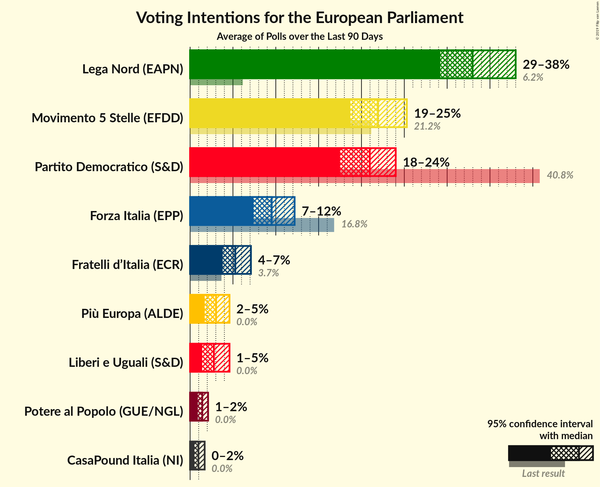

### Confidence Intervals

| Party | Last Result | Median | 80% Confidence Interval | 90% Confidence Interval | 95% Confidence Interval | 99% Confidence Interval |
|:-----:|:-----------:|:------:|:-----------------------:|:-----------------------:|:-----------------------:|:-----------------------:|
| <a href="#partito-democratico-(s&d)">Partito Democratico (S&D)</a> | 40.8% | 20.9% | 18.7–22.9% |18.0–23.4% | 17.5–23.9% | 16.6–24.9% |
| <a href="#movimento-5-stelle-(efdd)">Movimento 5 Stelle (EFDD)</a> | 21.2% | 21.9% | 19.8–24.1% |19.3–24.7% | 18.8–25.2% | 17.9–26.3% |
| <a href="#forza-italia-(epp)">Forza Italia (EPP)</a> | 16.8% | 9.6% | 8.1–11.5% |7.7–12.1% | 7.4–12.6% | 6.9–13.6% |
| <a href="#lega-nord-(eapn)">Lega Nord (EAPN)</a> | 6.2% | 32.9% | 30.5–36.1% |29.8–37.1% | 29.2–37.9% | 27.9–39.3% |
| <a href="#fratelli-d’italia-(ecr)">Fratelli d’Italia (ECR)</a> | 3.7% | 5.2% | 4.2–6.4% |4.0–6.7% | 3.8–7.1% | 3.4–7.8% |
| <a href="#südtiroler-volkspartei-(epp)">Südtiroler Volkspartei (EPP)</a> | 0.5% | N/A | N/A |N/A | N/A | N/A |
| <a href="#casapound-italia-(ni)">CasaPound Italia (NI)</a> | 0.0% | 1.0% | 0.6–1.4% |0.5–1.6% | 0.5–1.7% | 0.4–2.0% |
| <a href="#civica-popolare-(alde)">Civica Popolare (ALDE)</a> | 0.0% | N/A | N/A |N/A | N/A | N/A |
| <a href="#insieme-(*)">Insieme (*)</a> | 0.0% | N/A | N/A |N/A | N/A | N/A |
| <a href="#noi-con-l’italia-(ecr)">Noi con l’Italia (ECR)</a> | 0.0% | N/A | N/A |N/A | N/A | N/A |
| <a href="#più-europa-(alde)">Più Europa (ALDE)</a> | 0.0% | 3.0% | 2.2–4.0% |2.0–4.3% | 1.8–4.6% | 1.4–5.2% |
| <a href="#liberi-e-uguali-(s&d)">Liberi e Uguali (S&D)</a> | 0.0% | 2.9% | 1.8–4.4% |1.6–4.8% | 1.4–5.2% | 1.2–5.9% |
| <a href="#potere-al-popolo-(gue/ngl)">Potere al Popolo (GUE/NGL)</a> | 0.0% | 1.4% | 1.1–1.9% |1.0–2.0% | 0.9–2.1% | 0.8–2.4% |

### Partito Democratico (S&D)

*For a full overview of the results for this party, see the [Partito Democratico (S&D)](party-partitodemocraticosd.html) page.*

| Voting Intentions | Probability | Accumulated | Special Marks |
|:-----------------:|:-----------:|:-----------:|:-------------:|
| 14.5–15.5% | 0% | 100% |  |
| 15.5–16.5% | 0.4% | 99.9% |  |
| 16.5–17.5% | 2% | 99.5% |  |
| 17.5–18.5% | 6% | 97% |  |
| 18.5–19.5% | 13% | 91% |  |
| 19.5–20.5% | 21% | 78% |  |
| 20.5–21.5% | 25% | 58% | Median |
| 21.5–22.5% | 19% | 33% |  |
| 22.5–23.5% | 10% | 14% |  |
| 23.5–24.5% | 3% | 4% |  |
| 24.5–25.5% | 0.7% | 0.9% |  |
| 25.5–26.5% | 0.1% | 0.1% |  |
| 26.5–27.5% | 0% | 0% |  |
| 27.5–28.5% | 0% | 0% |  |
| 28.5–29.5% | 0% | 0% |  |
| 29.5–30.5% | 0% | 0% |  |
| 30.5–31.5% | 0% | 0% |  |
| 31.5–32.5% | 0% | 0% |  |
| 32.5–33.5% | 0% | 0% |  |
| 33.5–34.5% | 0% | 0% |  |
| 34.5–35.5% | 0% | 0% |  |
| 35.5–36.5% | 0% | 0% |  |
| 36.5–37.5% | 0% | 0% |  |
| 37.5–38.5% | 0% | 0% |  |
| 38.5–39.5% | 0% | 0% |  |
| 39.5–40.5% | 0% | 0% |  |
| 40.5–41.5% | 0% | 0% | Last Result |

### Movimento 5 Stelle (EFDD)

*For a full overview of the results for this party, see the [Movimento 5 Stelle (EFDD)](party-movimento5stelleefdd.html) page.*

| Voting Intentions | Probability | Accumulated | Special Marks |
|:-----------------:|:-----------:|:-----------:|:-------------:|
| 15.5–16.5% | 0% | 100% |  |
| 16.5–17.5% | 0.2% | 100% |  |
| 17.5–18.5% | 1.5% | 99.7% |  |
| 18.5–19.5% | 6% | 98% |  |
| 19.5–20.5% | 13% | 93% |  |
| 20.5–21.5% | 21% | 80% | Last Result |
| 21.5–22.5% | 23% | 59% | Median |
| 22.5–23.5% | 19% | 36% |  |
| 23.5–24.5% | 11% | 17% |  |
| 24.5–25.5% | 4% | 6% |  |
| 25.5–26.5% | 1.2% | 2% |  |
| 26.5–27.5% | 0.3% | 0.4% |  |
| 27.5–28.5% | 0.1% | 0.1% |  |
| 28.5–29.5% | 0% | 0% |  |

### Forza Italia (EPP)

*For a full overview of the results for this party, see the [Forza Italia (EPP)](party-forzaitaliaepp.html) page.*

| Voting Intentions | Probability | Accumulated | Special Marks |
|:-----------------:|:-----------:|:-----------:|:-------------:|
| 4.5–5.5% | 0% | 100% |  |
| 5.5–6.5% | 0.2% | 100% |  |
| 6.5–7.5% | 4% | 99.8% |  |
| 7.5–8.5% | 16% | 96% |  |
| 8.5–9.5% | 28% | 80% |  |
| 9.5–10.5% | 26% | 52% | Median |
| 10.5–11.5% | 16% | 25% |  |
| 11.5–12.5% | 7% | 9% |  |
| 12.5–13.5% | 2% | 3% |  |
| 13.5–14.5% | 0.5% | 0.5% |  |
| 14.5–15.5% | 0.1% | 0.1% |  |
| 15.5–16.5% | 0% | 0% |  |
| 16.5–17.5% | 0% | 0% | Last Result |

### Lega Nord (EAPN)

*For a full overview of the results for this party, see the [Lega Nord (EAPN)](party-leganordeapn.html) page.*

| Voting Intentions | Probability | Accumulated | Special Marks |
|:-----------------:|:-----------:|:-----------:|:-------------:|
| 5.5–6.5% | 0% | 100% | Last Result |
| 6.5–7.5% | 0% | 100% |  |
| 7.5–8.5% | 0% | 100% |  |
| 8.5–9.5% | 0% | 100% |  |
| 9.5–10.5% | 0% | 100% |  |
| 10.5–11.5% | 0% | 100% |  |
| 11.5–12.5% | 0% | 100% |  |
| 12.5–13.5% | 0% | 100% |  |
| 13.5–14.5% | 0% | 100% |  |
| 14.5–15.5% | 0% | 100% |  |
| 15.5–16.5% | 0% | 100% |  |
| 16.5–17.5% | 0% | 100% |  |
| 17.5–18.5% | 0% | 100% |  |
| 18.5–19.5% | 0% | 100% |  |
| 19.5–20.5% | 0% | 100% |  |
| 20.5–21.5% | 0% | 100% |  |
| 21.5–22.5% | 0% | 100% |  |
| 22.5–23.5% | 0% | 100% |  |
| 23.5–24.5% | 0% | 100% |  |
| 24.5–25.5% | 0% | 100% |  |
| 25.5–26.5% | 0.1% | 100% |  |
| 26.5–27.5% | 0.2% | 99.9% |  |
| 27.5–28.5% | 0.8% | 99.7% |  |
| 28.5–29.5% | 3% | 98.9% |  |
| 29.5–30.5% | 7% | 96% |  |
| 30.5–31.5% | 14% | 89% |  |
| 31.5–32.5% | 19% | 76% |  |
| 32.5–33.5% | 19% | 57% | Median |
| 33.5–34.5% | 15% | 38% |  |
| 34.5–35.5% | 9% | 23% |  |
| 35.5–36.5% | 6% | 14% |  |
| 36.5–37.5% | 4% | 7% |  |
| 37.5–38.5% | 2% | 3% |  |
| 38.5–39.5% | 0.9% | 1.2% |  |
| 39.5–40.5% | 0.3% | 0.4% |  |
| 40.5–41.5% | 0.1% | 0.1% |  |
| 41.5–42.5% | 0% | 0% |  |

### Fratelli d’Italia (ECR)

*For a full overview of the results for this party, see the [Fratelli d’Italia (ECR)](party-fratellid’italiaecr.html) page.*

| Voting Intentions | Probability | Accumulated | Special Marks |
|:-----------------:|:-----------:|:-----------:|:-------------:|
| 1.5–2.5% | 0% | 100% |  |
| 2.5–3.5% | 1.1% | 100% |  |
| 3.5–4.5% | 20% | 98.9% | Last Result |
| 4.5–5.5% | 45% | 79% | Median |
| 5.5–6.5% | 27% | 34% |  |
| 6.5–7.5% | 6% | 7% |  |
| 7.5–8.5% | 0.8% | 0.9% |  |
| 8.5–9.5% | 0.1% | 0.1% |  |
| 9.5–10.5% | 0% | 0% |  |

### Più Europa (ALDE)

*For a full overview of the results for this party, see the [Più Europa (ALDE)](party-piùeuropaalde.html) page.*

| Voting Intentions | Probability | Accumulated | Special Marks |
|:-----------------:|:-----------:|:-----------:|:-------------:|
| 0.0–0.5% | 0% | 100% | Last Result |
| 0.5–1.5% | 1.1% | 100% |  |
| 1.5–2.5% | 21% | 98.9% |  |
| 2.5–3.5% | 55% | 78% | Median |
| 3.5–4.5% | 20% | 23% |  |
| 4.5–5.5% | 3% | 3% |  |
| 5.5–6.5% | 0.2% | 0.2% |  |
| 6.5–7.5% | 0% | 0% |  |

### Liberi e Uguali (S&D)

*For a full overview of the results for this party, see the [Liberi e Uguali (S&D)](party-liberieugualisd.html) page.*

| Voting Intentions | Probability | Accumulated | Special Marks |
|:-----------------:|:-----------:|:-----------:|:-------------:|
| 0.0–0.5% | 0% | 100% | Last Result |
| 0.5–1.5% | 4% | 100% |  |
| 1.5–2.5% | 32% | 96% |  |
| 2.5–3.5% | 36% | 63% | Median |
| 3.5–4.5% | 19% | 27% |  |
| 4.5–5.5% | 6% | 8% |  |
| 5.5–6.5% | 1.1% | 1.2% |  |
| 6.5–7.5% | 0.1% | 0.1% |  |
| 7.5–8.5% | 0% | 0% |  |

### CasaPound Italia (NI)

*For a full overview of the results for this party, see the [CasaPound Italia (NI)](party-casapounditaliani.html) page.*

| Voting Intentions | Probability | Accumulated | Special Marks |
|:-----------------:|:-----------:|:-----------:|:-------------:|
| 0.0–0.5% | 5% | 100% | Last Result |
| 0.5–1.5% | 89% | 95% | Median |
| 1.5–2.5% | 5% | 5% |  |
| 2.5–3.5% | 0% | 0% |  |

### Potere al Popolo (GUE/NGL)

*For a full overview of the results for this party, see the [Potere al Popolo (GUE/NGL)](party-poterealpopologuengl.html) page.*

| Voting Intentions | Probability | Accumulated | Special Marks |
|:-----------------:|:-----------:|:-----------:|:-------------:|
| 0.0–0.5% | 0% | 100% | Last Result |
| 0.5–1.5% | 64% | 100% | Median |
| 1.5–2.5% | 36% | 36% |  |
| 2.5–3.5% | 0.2% | 0.2% |  |
| 3.5–4.5% | 0% | 0% |  |

## Seats

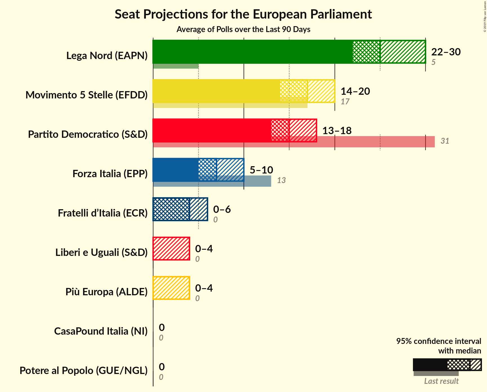

### Confidence Intervals

| Party | Last Result | Median | 80% Confidence Interval | 90% Confidence Interval | 95% Confidence Interval | 99% Confidence Interval |
|:-----:|:-----------:|:------:|:-----------------------:|:-----------------------:|:-----------------------:|:-----------------------:|
| <a href="#partito-democratico-(s&d)">Partito Democratico (S&D)</a> | 31 | 15 | 13–17 |13–17 | 12–18 | 12–19 |
| <a href="#movimento-5-stelle-(efdd)">Movimento 5 Stelle (EFDD)</a> | 17 | 17 | 15–19 |15–19 | 14–20 | 14–21 |
| <a href="#forza-italia-(epp)">Forza Italia (EPP)</a> | 13 | 7 | 6–9 |6–9 | 6–10 | 5–10 |
| <a href="#lega-nord-(eapn)">Lega Nord (EAPN)</a> | 5 | 25 | 23–29 |23–29 | 22–30 | 21–32 |
| <a href="#fratelli-d’italia-(ecr)">Fratelli d’Italia (ECR)</a> | 0 | 4 | 3–5 |0–5 | 0–6 | 0–6 |
| <a href="#südtiroler-volkspartei-(epp)">Südtiroler Volkspartei (EPP)</a> | 1 | N/A | N/A |N/A | N/A | N/A |
| <a href="#casapound-italia-(ni)">CasaPound Italia (NI)</a> | 0 | 0 | 0 |0 | 0 | 0 |
| <a href="#civica-popolare-(alde)">Civica Popolare (ALDE)</a> | 0 | N/A | N/A |N/A | N/A | N/A |
| <a href="#insieme-(*)">Insieme (*)</a> | 0 | N/A | N/A |N/A | N/A | N/A |
| <a href="#noi-con-l’italia-(ecr)">Noi con l’Italia (ECR)</a> | 0 | N/A | N/A |N/A | N/A | N/A |
| <a href="#più-europa-(alde)">Più Europa (ALDE)</a> | 0 | 0 | 0 |0–3 | 0–4 | 0–4 |
| <a href="#liberi-e-uguali-(s&d)">Liberi e Uguali (S&D)</a> | 0 | 0 | 0–3 |0–4 | 0–4 | 0–5 |
| <a href="#potere-al-popolo-(gue/ngl)">Potere al Popolo (GUE/NGL)</a> | 0 | 0 | 0 |0 | 0 | 0 |

### Partito Democratico (S&D)

*For a full overview of the results for this party, see the [Partito Democratico (S&D)](party-partitodemocraticosd.html) page.*

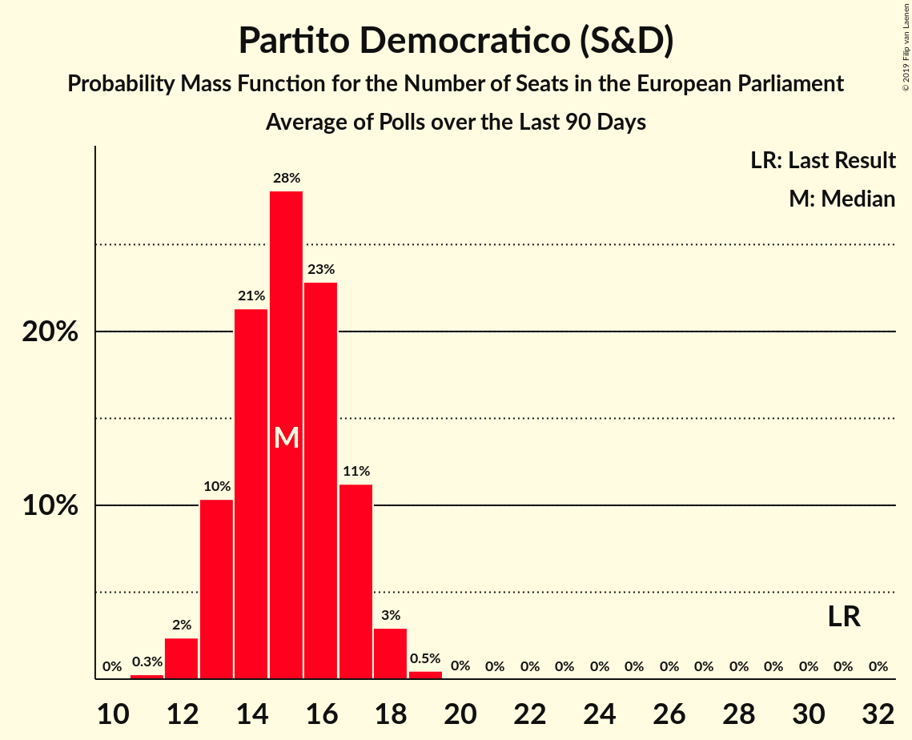

| Number of Seats | Probability | Accumulated | Special Marks |
|:---------------:|:-----------:|:-----------:|:-------------:|
| 11 | 0.3% | 100% |  |
| 12 | 2% | 99.7% |  |
| 13 | 11% | 97% |  |
| 14 | 22% | 86% |  |
| 15 | 27% | 65% | Median |
| 16 | 23% | 37% |  |
| 17 | 11% | 15% |  |
| 18 | 3% | 3% |  |
| 19 | 0.5% | 0.5% |  |
| 20 | 0% | 0% |  |
| 21 | 0% | 0% |  |
| 22 | 0% | 0% |  |
| 23 | 0% | 0% |  |
| 24 | 0% | 0% |  |
| 25 | 0% | 0% |  |
| 26 | 0% | 0% |  |
| 27 | 0% | 0% |  |
| 28 | 0% | 0% |  |
| 29 | 0% | 0% |  |
| 30 | 0% | 0% |  |
| 31 | 0% | 0% | Last Result |

### Movimento 5 Stelle (EFDD)

*For a full overview of the results for this party, see the [Movimento 5 Stelle (EFDD)](party-movimento5stelleefdd.html) page.*

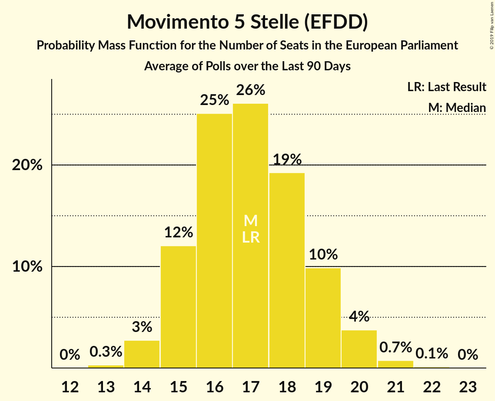

| Number of Seats | Probability | Accumulated | Special Marks |
|:---------------:|:-----------:|:-----------:|:-------------:|
| 13 | 0.3% | 100% |  |
| 14 | 3% | 99.7% |  |
| 15 | 12% | 97% |  |
| 16 | 25% | 85% |  |
| 17 | 26% | 60% | Last Result, Median |
| 18 | 19% | 34% |  |
| 19 | 10% | 15% |  |
| 20 | 4% | 5% |  |
| 21 | 0.8% | 0.9% |  |
| 22 | 0.1% | 0.1% |  |
| 23 | 0% | 0% |  |

### Forza Italia (EPP)

*For a full overview of the results for this party, see the [Forza Italia (EPP)](party-forzaitaliaepp.html) page.*

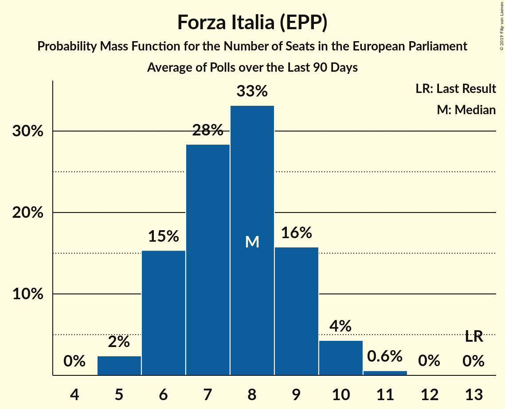

| Number of Seats | Probability | Accumulated | Special Marks |
|:---------------:|:-----------:|:-----------:|:-------------:|
| 5 | 2% | 100% |  |
| 6 | 15% | 98% |  |
| 7 | 34% | 83% | Median |
| 8 | 32% | 49% |  |
| 9 | 14% | 17% |  |
| 10 | 3% | 3% |  |
| 11 | 0.4% | 0.4% |  |
| 12 | 0% | 0% |  |
| 13 | 0% | 0% | Last Result |

### Lega Nord (EAPN)

*For a full overview of the results for this party, see the [Lega Nord (EAPN)](party-leganordeapn.html) page.*

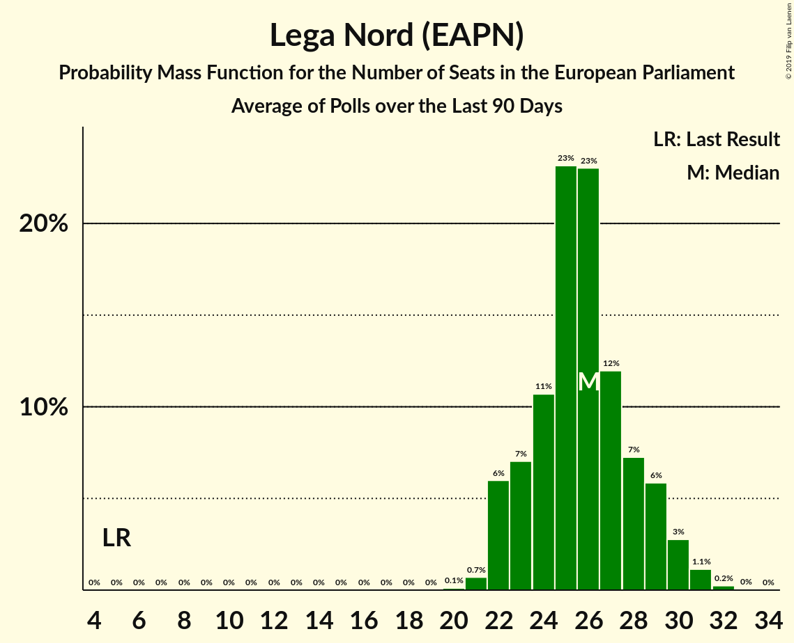

| Number of Seats | Probability | Accumulated | Special Marks |
|:---------------:|:-----------:|:-----------:|:-------------:|
| 5 | 0% | 100% | Last Result |
| 6 | 0% | 100% |  |
| 7 | 0% | 100% |  |
| 8 | 0% | 100% |  |
| 9 | 0% | 100% |  |
| 10 | 0% | 100% |  |
| 11 | 0% | 100% |  |
| 12 | 0% | 100% |  |
| 13 | 0% | 100% |  |
| 14 | 0% | 100% |  |
| 15 | 0% | 100% |  |
| 16 | 0% | 100% |  |
| 17 | 0% | 100% |  |
| 18 | 0% | 100% |  |
| 19 | 0% | 100% |  |
| 20 | 0.1% | 100% |  |
| 21 | 0.8% | 99.9% |  |
| 22 | 4% | 99.1% |  |
| 23 | 11% | 96% |  |
| 24 | 20% | 85% |  |
| 25 | 20% | 65% | Median |
| 26 | 16% | 45% |  |
| 27 | 10% | 28% |  |
| 28 | 7% | 18% |  |
| 29 | 6% | 11% |  |
| 30 | 3% | 5% |  |
| 31 | 1.4% | 2% |  |
| 32 | 0.4% | 0.6% |  |
| 33 | 0.1% | 0.2% |  |
| 34 | 0.1% | 0.1% |  |
| 35 | 0% | 0% |  |

### Fratelli d’Italia (ECR)

*For a full overview of the results for this party, see the [Fratelli d’Italia (ECR)](party-fratellid’italiaecr.html) page.*

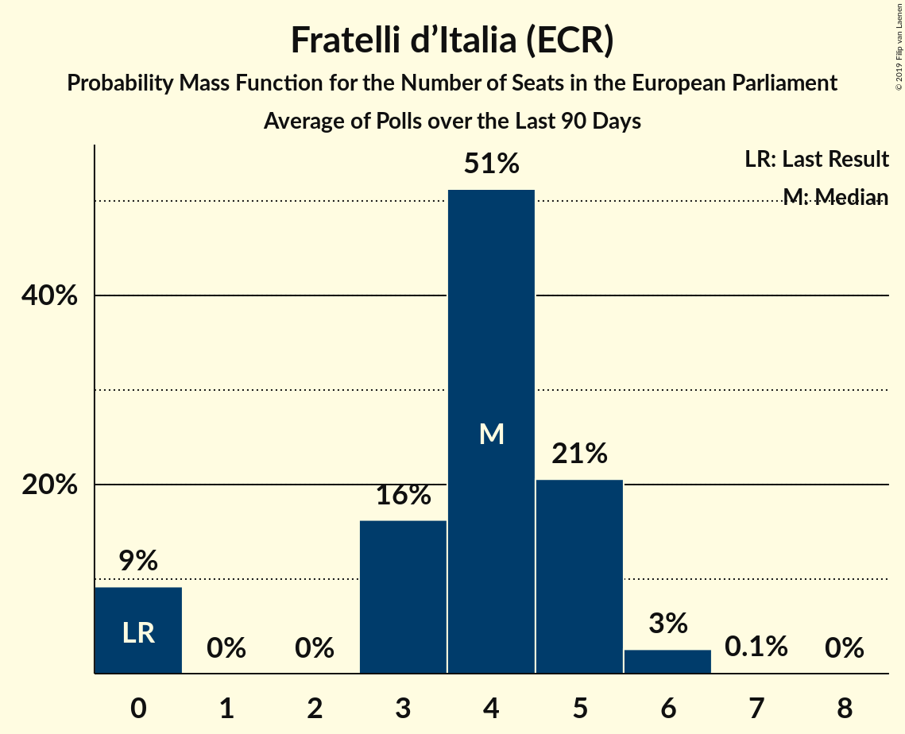

| Number of Seats | Probability | Accumulated | Special Marks |
|:---------------:|:-----------:|:-----------:|:-------------:|
| 0 | 6% | 100% | Last Result |
| 1 | 0% | 94% |  |
| 2 | 0% | 94% |  |
| 3 | 14% | 94% |  |
| 4 | 55% | 80% | Median |
| 5 | 21% | 24% |  |
| 6 | 3% | 3% |  |
| 7 | 0.1% | 0.2% |  |
| 8 | 0% | 0% |  |

### Più Europa (ALDE)

*For a full overview of the results for this party, see the [Più Europa (ALDE)](party-piùeuropaalde.html) page.*

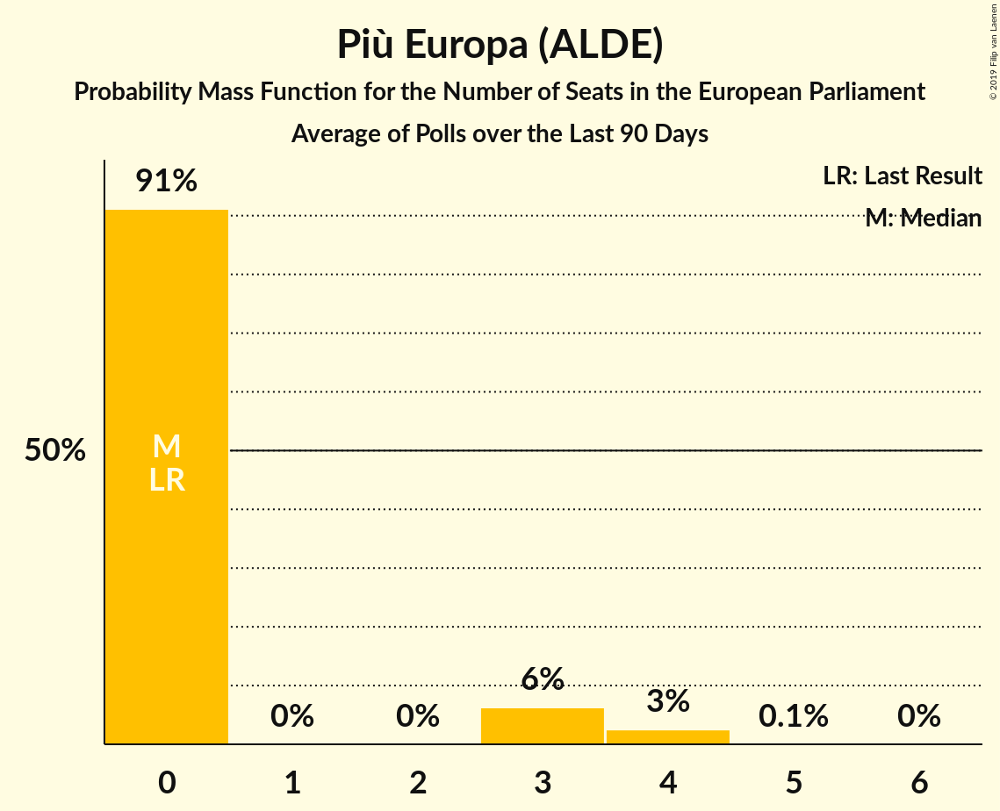

| Number of Seats | Probability | Accumulated | Special Marks |
|:---------------:|:-----------:|:-----------:|:-------------:|
| 0 | 91% | 100% | Last Result, Median |
| 1 | 0% | 9% |  |
| 2 | 0% | 9% |  |
| 3 | 6% | 9% |  |
| 4 | 3% | 3% |  |
| 5 | 0.1% | 0.1% |  |
| 6 | 0% | 0% |  |

### Liberi e Uguali (S&D)

*For a full overview of the results for this party, see the [Liberi e Uguali (S&D)](party-liberieugualisd.html) page.*

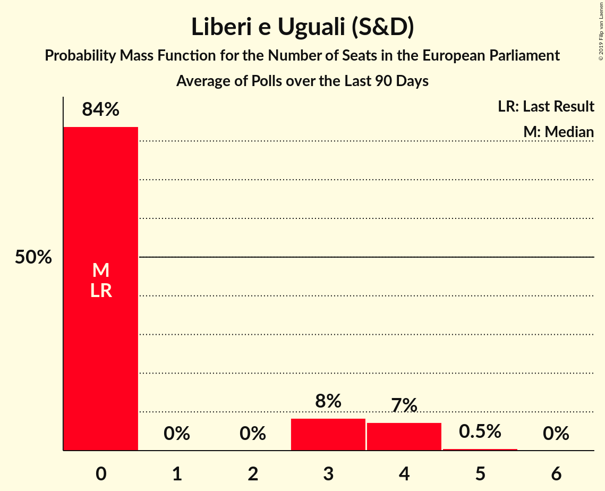

| Number of Seats | Probability | Accumulated | Special Marks |
|:---------------:|:-----------:|:-----------:|:-------------:|
| 0 | 83% | 100% | Last Result, Median |
| 1 | 0% | 17% |  |
| 2 | 0% | 17% |  |
| 3 | 8% | 17% |  |
| 4 | 8% | 9% |  |
| 5 | 0.5% | 0.5% |  |
| 6 | 0% | 0% |  |

### CasaPound Italia (NI)

*For a full overview of the results for this party, see the [CasaPound Italia (NI)](party-casapounditaliani.html) page.*

| Number of Seats | Probability | Accumulated | Special Marks |
|:---------------:|:-----------:|:-----------:|:-------------:|
| 0 | 100% | 100% | Last Result, Median |

### Potere al Popolo (GUE/NGL)

*For a full overview of the results for this party, see the [Potere al Popolo (GUE/NGL)](party-poterealpopologuengl.html) page.*

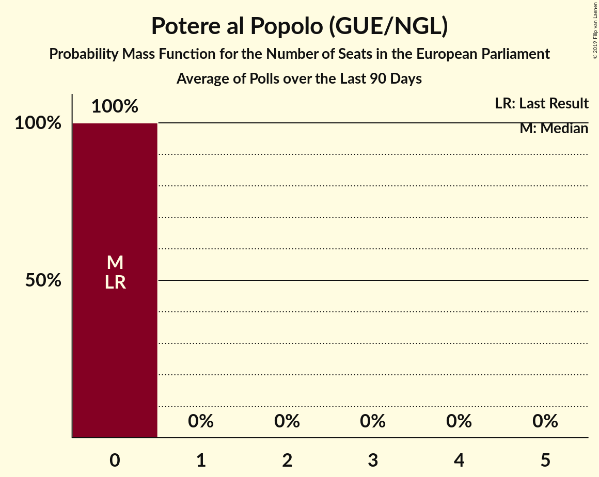

| Number of Seats | Probability | Accumulated | Special Marks |
|:---------------:|:-----------:|:-----------:|:-------------:|
| 0 | 100% | 100% | Last Result, Median |

## Coalitions

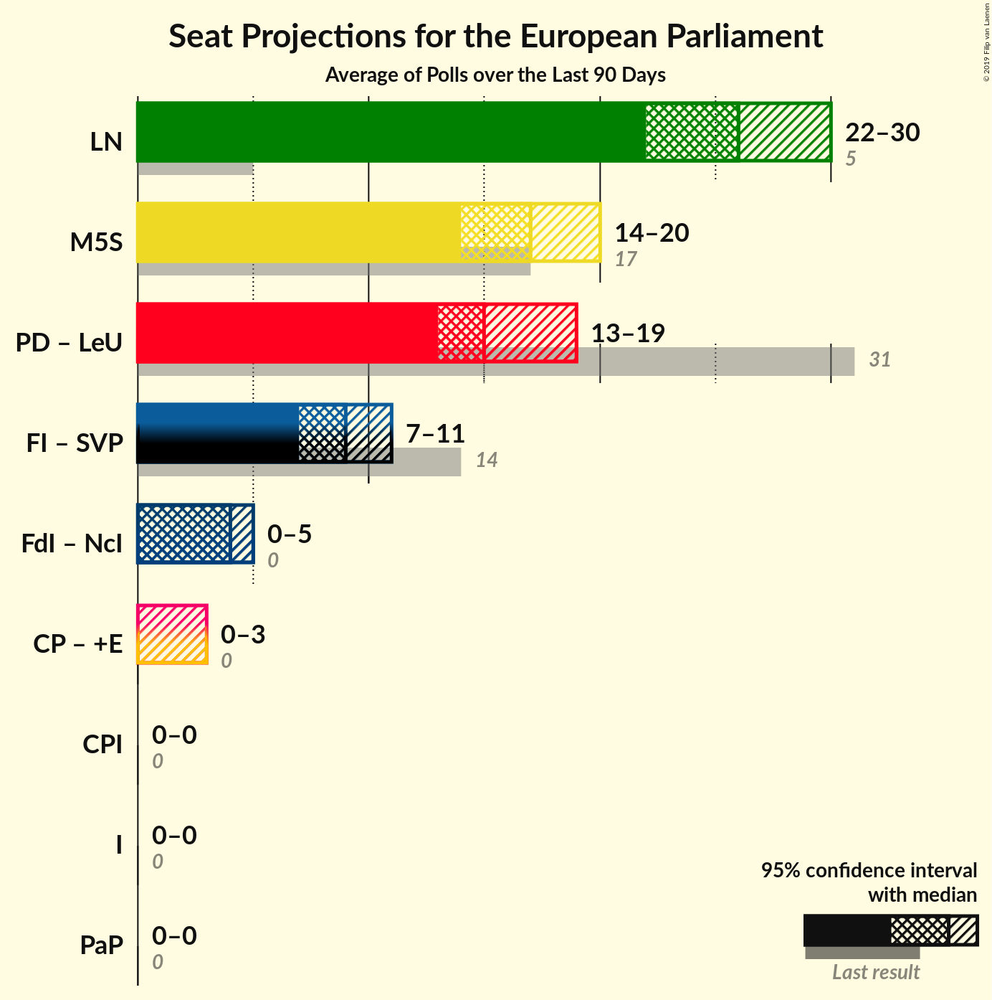

### Confidence Intervals

| Coalition | Last Result | Median | Majority? | 80% Confidence Interval | 90% Confidence Interval | 95% Confidence Interval | 99% Confidence Interval |
|:---------:|:-----------:|:------:|:---------:|:-----------------------:|:-----------------------:|:-----------------------:|:-----------------------:|
| Lega Nord (EAPN) | 5 | 25 | 0% | 23–29 | 23–29 | 22–30 | 21–32 |
| Movimento 5 Stelle (EFDD) | 17 | 17 | 0% | 15–19 | 15–19 | 14–20 | 14–21 |
| Partito Democratico (S&D) – Liberi e Uguali (S&D) | 31 | 15 | 0% | 13–17 | 13–18 | 13–19 | 12–20 |
| Forza Italia (EPP) – Südtiroler Volkspartei (EPP) | 14 | 8 | 0% | 7–10 | 7–10 | 7–11 | 6–11 |
| Fratelli d’Italia (ECR) – Noi con l’Italia (ECR) | 0 | 4 | 0% | 3–5 | 0–5 | 0–6 | 0–6 |
| Civica Popolare (ALDE) – Più Europa (ALDE) | 0 | 0 | 0% | 0 | 0–3 | 0–3 | 0–4 |
| CasaPound Italia (NI) | 0 | 0 | 0% | 0 | 0 | 0 | 0 |
| Insieme (*) | 0 | 0 | 0% | 0 | 0 | 0 | 0 |
| Potere al Popolo (GUE/NGL) | 0 | 0 | 0% | 0 | 0 | 0 | 0 |

### Lega Nord (EAPN)

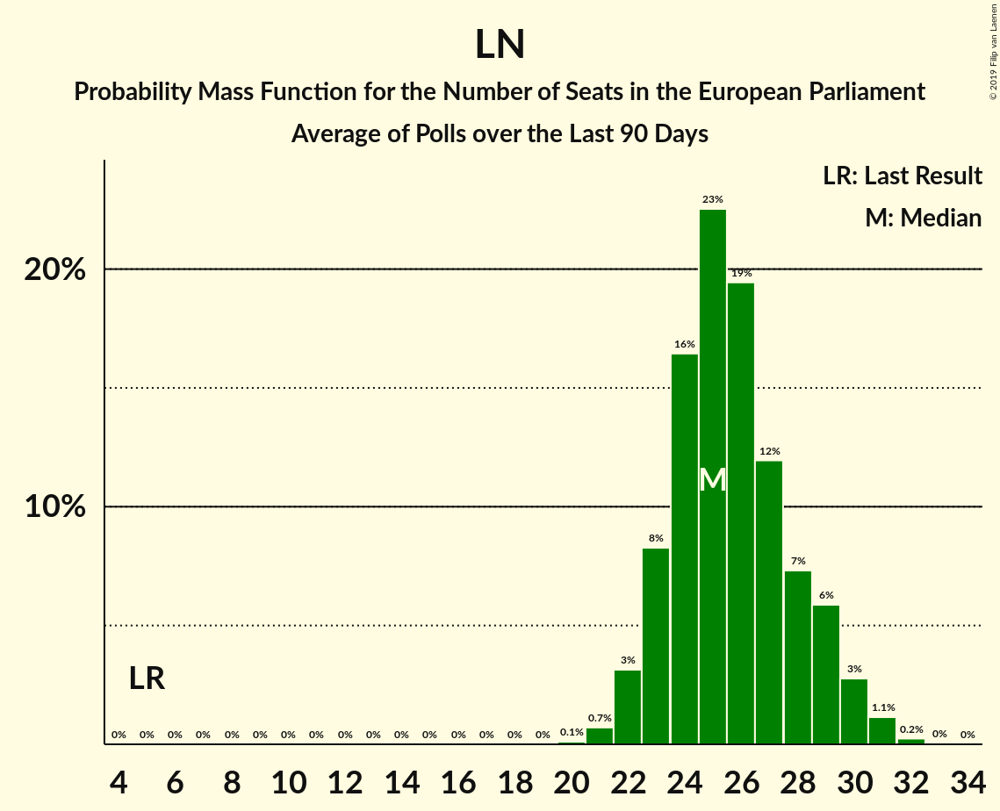

| Number of Seats | Probability | Accumulated | Special Marks |
|:---------------:|:-----------:|:-----------:|:-------------:|
| 5 | 0% | 100% | Last Result |
| 6 | 0% | 100% |  |
| 7 | 0% | 100% |  |
| 8 | 0% | 100% |  |
| 9 | 0% | 100% |  |
| 10 | 0% | 100% |  |
| 11 | 0% | 100% |  |
| 12 | 0% | 100% |  |
| 13 | 0% | 100% |  |
| 14 | 0% | 100% |  |
| 15 | 0% | 100% |  |
| 16 | 0% | 100% |  |
| 17 | 0% | 100% |  |
| 18 | 0% | 100% |  |
| 19 | 0% | 100% |  |
| 20 | 0.1% | 100% |  |
| 21 | 0.8% | 99.9% |  |
| 22 | 4% | 99.1% |  |
| 23 | 11% | 96% |  |
| 24 | 20% | 85% |  |
| 25 | 20% | 65% | Median |
| 26 | 16% | 45% |  |
| 27 | 10% | 28% |  |
| 28 | 7% | 18% |  |
| 29 | 6% | 11% |  |
| 30 | 3% | 5% |  |
| 31 | 1.4% | 2% |  |
| 32 | 0.4% | 0.6% |  |
| 33 | 0.1% | 0.2% |  |
| 34 | 0.1% | 0.1% |  |
| 35 | 0% | 0% |  |

### Movimento 5 Stelle (EFDD)

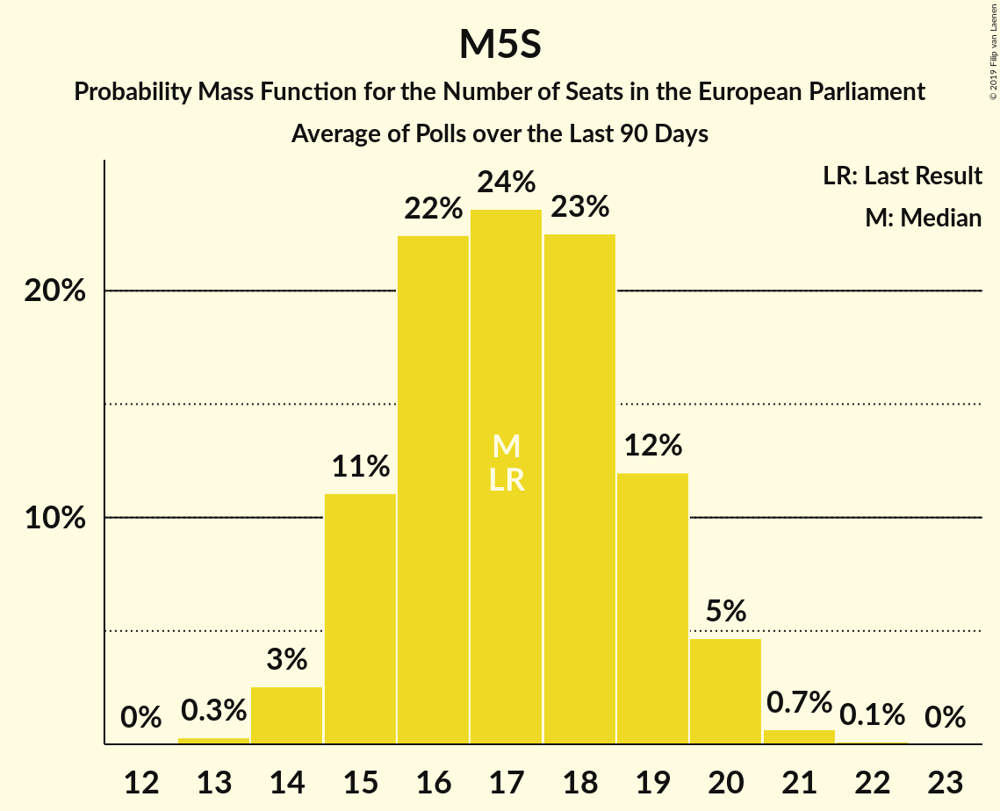

| Number of Seats | Probability | Accumulated | Special Marks |
|:---------------:|:-----------:|:-----------:|:-------------:|
| 13 | 0.3% | 100% |  |
| 14 | 3% | 99.7% |  |
| 15 | 12% | 97% |  |
| 16 | 25% | 85% |  |
| 17 | 26% | 60% | Last Result, Median |
| 18 | 19% | 34% |  |
| 19 | 10% | 15% |  |
| 20 | 4% | 5% |  |
| 21 | 0.8% | 0.9% |  |
| 22 | 0.1% | 0.1% |  |
| 23 | 0% | 0% |  |

### Partito Democratico (S&D) – Liberi e Uguali (S&D)

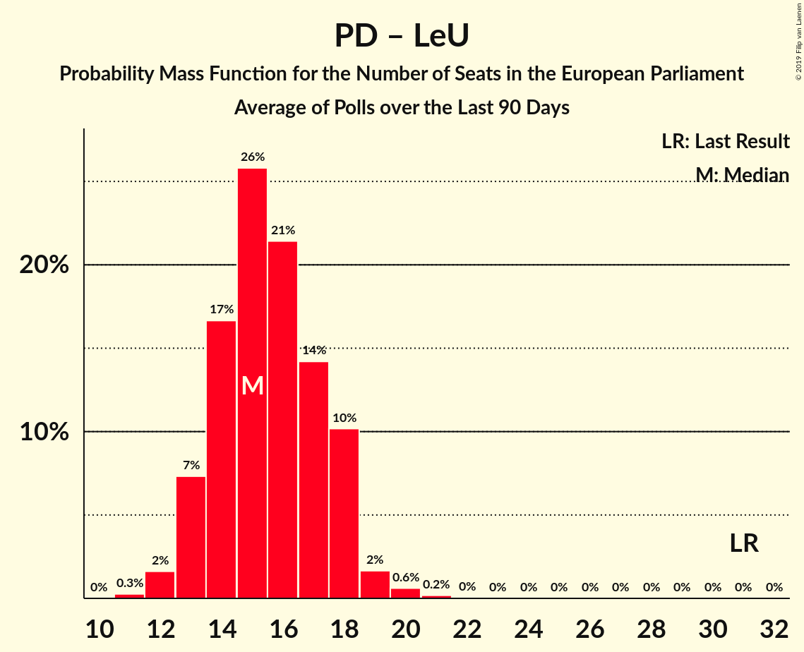

| Number of Seats | Probability | Accumulated | Special Marks |
|:---------------:|:-----------:|:-----------:|:-------------:|
| 11 | 0.3% | 100% |  |
| 12 | 2% | 99.7% |  |
| 13 | 9% | 98% |  |
| 14 | 18% | 90% |  |
| 15 | 25% | 71% | Median |
| 16 | 23% | 47% |  |
| 17 | 14% | 24% |  |
| 18 | 6% | 10% |  |
| 19 | 3% | 4% |  |
| 20 | 0.9% | 1.2% |  |
| 21 | 0.2% | 0.3% |  |
| 22 | 0.1% | 0.1% |  |
| 23 | 0% | 0% |  |
| 24 | 0% | 0% |  |
| 25 | 0% | 0% |  |
| 26 | 0% | 0% |  |
| 27 | 0% | 0% |  |
| 28 | 0% | 0% |  |
| 29 | 0% | 0% |  |
| 30 | 0% | 0% |  |
| 31 | 0% | 0% | Last Result |

### Forza Italia (EPP) – Südtiroler Volkspartei (EPP)

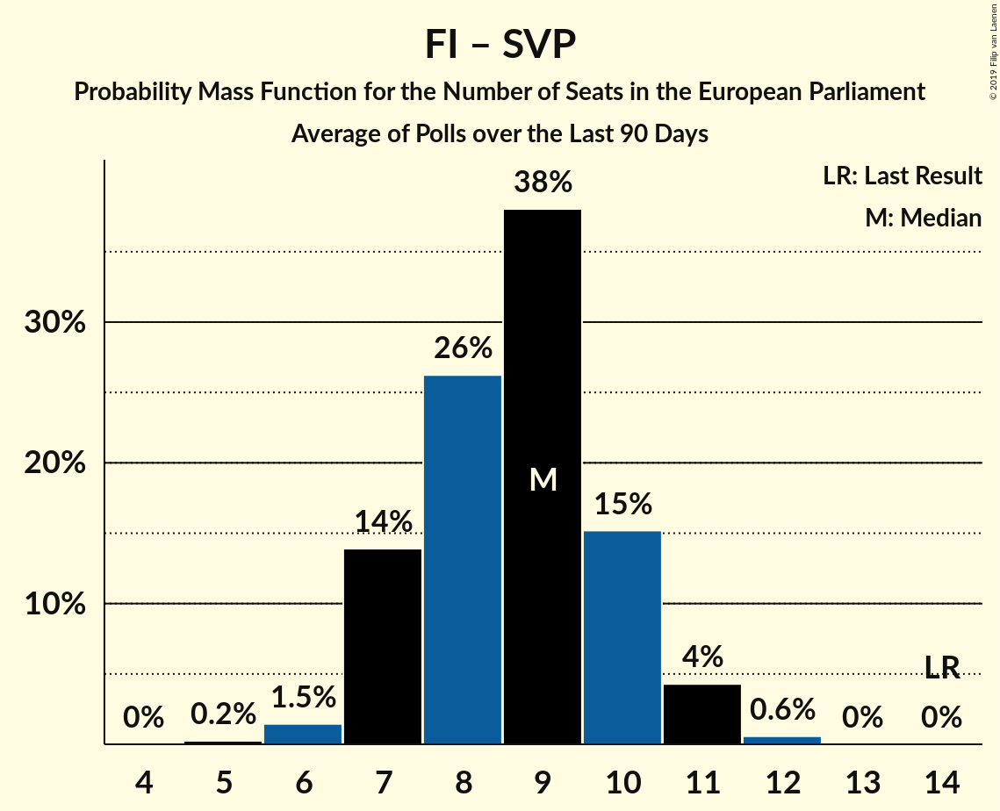

| Number of Seats | Probability | Accumulated | Special Marks |
|:---------------:|:-----------:|:-----------:|:-------------:|
| 6 | 2% | 100% |  |
| 7 | 15% | 98% | Median |
| 8 | 34% | 83% |  |
| 9 | 32% | 49% |  |
| 10 | 14% | 17% |  |
| 11 | 3% | 3% |  |
| 12 | 0.4% | 0.4% |  |
| 13 | 0% | 0% |  |
| 14 | 0% | 0% | Last Result |

### Fratelli d’Italia (ECR) – Noi con l’Italia (ECR)

| Number of Seats | Probability | Accumulated | Special Marks |
|:---------------:|:-----------:|:-----------:|:-------------:|
| 0 | 6% | 100% | Last Result |
| 1 | 0% | 94% |  |
| 2 | 0% | 94% |  |
| 3 | 14% | 94% |  |
| 4 | 55% | 80% | Median |
| 5 | 21% | 24% |  |
| 6 | 3% | 3% |  |
| 7 | 0.1% | 0.2% |  |
| 8 | 0% | 0% |  |

### Civica Popolare (ALDE) – Più Europa (ALDE)

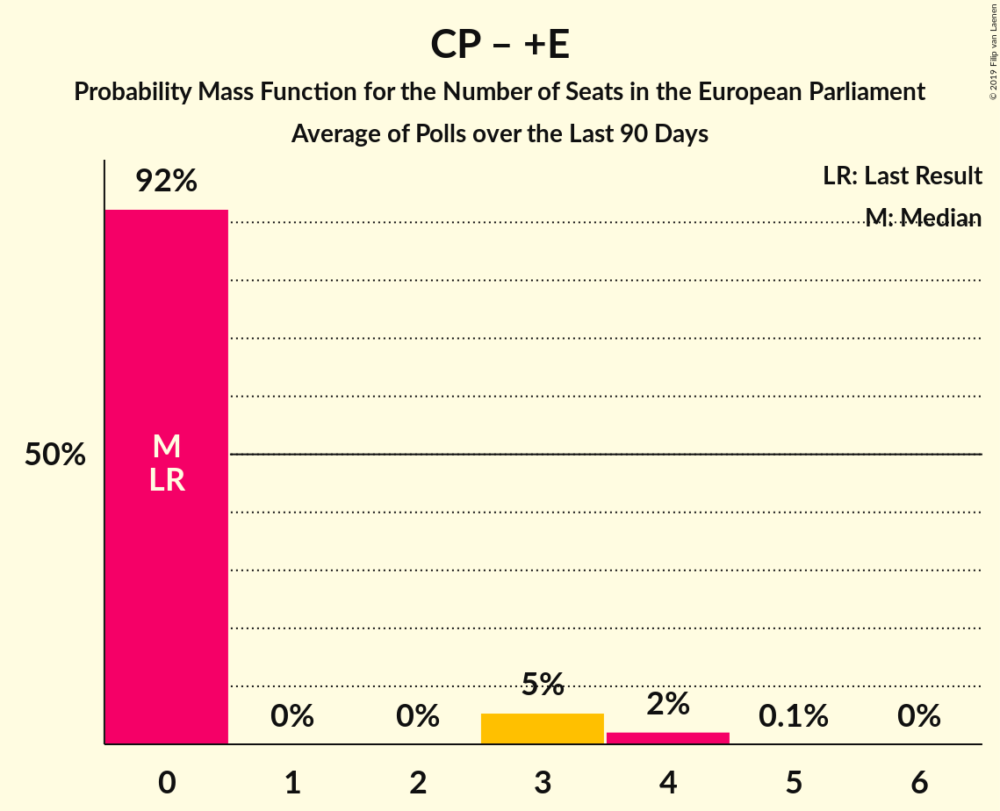

| Number of Seats | Probability | Accumulated | Special Marks |
|:---------------:|:-----------:|:-----------:|:-------------:|
| 0 | 93% | 100% | Last Result, Median |
| 1 | 0% | 7% |  |
| 2 | 0% | 7% |  |
| 3 | 5% | 7% |  |
| 4 | 2% | 2% |  |
| 5 | 0.1% | 0.1% |  |
| 6 | 0% | 0% |  |

### CasaPound Italia (NI)

| Number of Seats | Probability | Accumulated | Special Marks |
|:---------------:|:-----------:|:-----------:|:-------------:|
| 0 | 100% | 100% | Last Result, Median |

### Insieme (*)

| Number of Seats | Probability | Accumulated | Special Marks |
|:---------------:|:-----------:|:-----------:|:-------------:|
| 0 | 100% | 100% | Last Result, Median |

### Potere al Popolo (GUE/NGL)

| Number of Seats | Probability | Accumulated | Special Marks |
|:---------------:|:-----------:|:-----------:|:-------------:|
| 0 | 100% | 100% | Last Result, Median |

## Technical Information

+ **Number of polls included in this average:** 13
+ **Lowest number of simulations done in a poll included in this average:** 131,072
+ **Total number of simulations done in the polls included in this average:** 9,830,400
+ **Error estimate:** 2.35%
