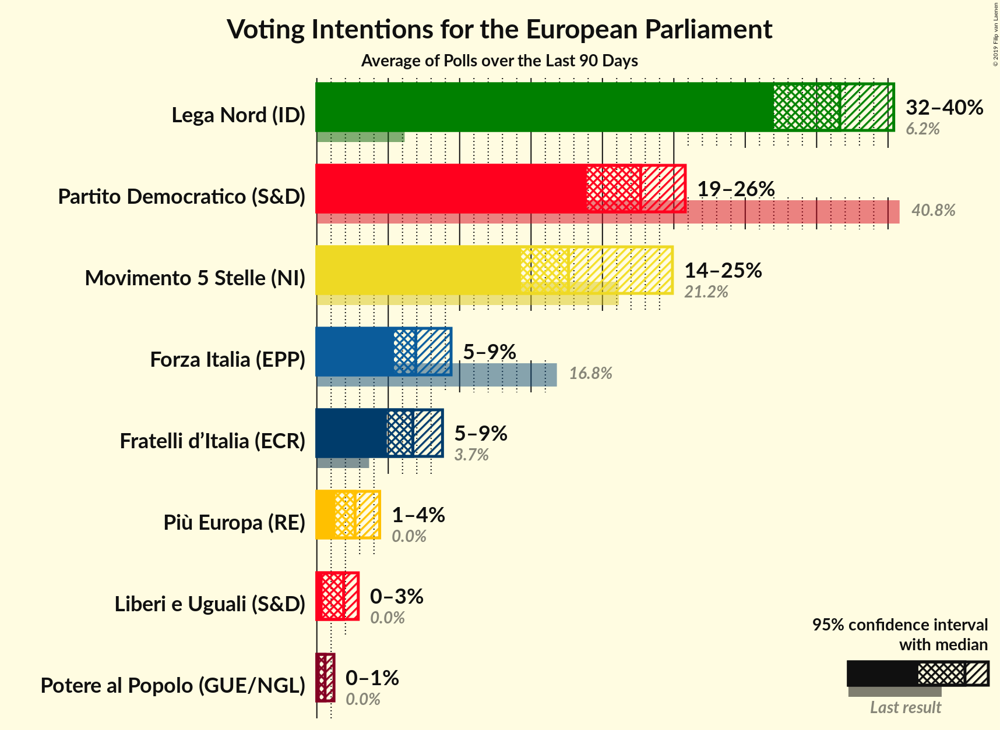
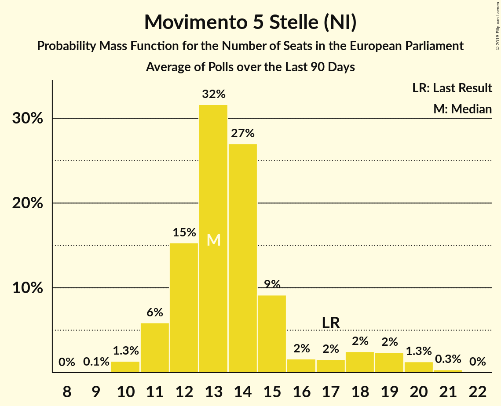
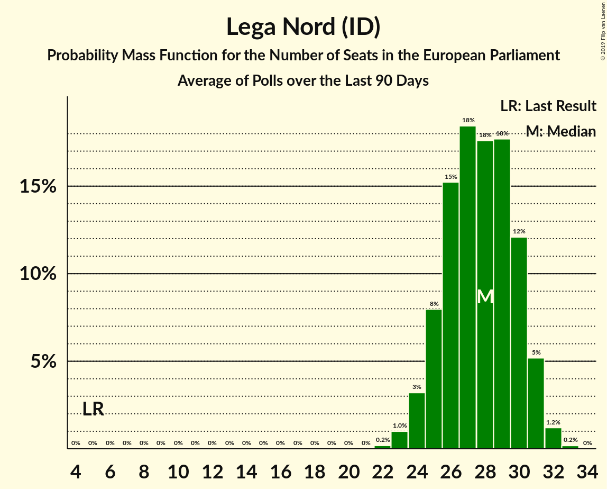

# Poll Average

<a href="#voting-intentions">Voting Intentions</a> | <a href="#seats">Seats</a> | <a href="#coalitions">Coalitions</a> | <a href="#technical-information">Technical Information</a>

## Summary

The table below lists the polls on which the average is based. They are the most recent polls (less than 90 days old) registered and analyzed so far.

| Period     | Polling firm/Commissioner(s) | PD | M5S | FI | LN | FdI | SVP | CPI | CP | I | NcI | +E | LeU | PaP |
|:----------:|:----------------------------:|:--:|:--:|:--:|:--:|:--:|:--:|:--:|:--:|:--:|:--:|:--:|:--:|:--:|
| 26 May 2019 | General Election | 40.8%   31 | 21.2%   17 | 16.8%   13 | 6.2%   5 | 3.7%   0 | 0.5%   1 | 0.0%   0 | 0.0%   0 | 0.0%   0 | 0.0%   0 | 0.0%   0 | 0.0%   0 | 0.0%   0 |
| N/A | Poll Average | 20–26%   14–19 | 15–25%   12–19 | 5–9%   4–7 | 32–40%   24–31 | 5–9%   4–7 | N/A   N/A | N/A   N/A | N/A   N/A | N/A   N/A | N/A   N/A | 1–4%   0 | 0–2%   0 | 0–1%   0 |
| [10–15 July 2019](2019-07-15-SWG.html) | SWG   LA7 | 20–24%   14–18 | 16–20%   12–15 | 6–8%   4–7 | 35–40%   27–32 | 5–8%   4–6 | N/A   N/A | N/A   N/A | N/A   N/A | N/A   N/A | N/A   N/A | 2–4%   0–3 | 1–3%   0 | N/A   N/A |
| [1–14 July 2019](2019-07-14-TermometroPolitico.html) | Termometro Politico | 20–25%   14–18 | 15–19%   11–15 | 5–8%   4–6 | 35–41%   27–31 | 6–9%   4–6 | N/A   N/A | N/A   N/A | N/A   N/A | N/A   N/A | N/A   N/A | 2–3%   0 | 1–3%   0 | N/A   N/A |
| [10–11 July 2019](2019-07-11-Tecnè.html) | Tecnè   Rete 4 | 21–26%   15–19 | 15–20%   11–15 | 6–10%   5–8 | 34–40%   26–31 | 5–9%   4–7 | N/A   N/A | N/A   N/A | N/A   N/A | N/A   N/A | N/A   N/A | 2–3%   0 | 1–2%   0 | N/A   N/A |
| [8–10 July 2019](2019-07-10-GPF.html) | GPF   Rete 4 | 20–25%   14–19 | 21–27%   16–21 | 6–9%   4–7 | 31–37%   23–29 | 5–8%   3–6 | N/A   N/A | N/A   N/A | N/A   N/A | N/A   N/A | N/A   N/A | 2–4%   0–3 | 0–1%   0 | N/A   N/A |
| [5 July 2019](2019-07-05-NotoSondaggi.html) | Noto Sondaggi   Quotidiano Nazionale | 21–27%   15–20 | 15–19%   11–15 | 5–8%   4–6 | 35–41%   27–32 | 6–10%   5–8 | N/A   N/A | N/A   N/A | N/A   N/A | N/A   N/A | N/A   N/A | 1–2%   0 | 1–2%   0 | 0–1%   0 |
| [29 June–4 July 2019](2019-07-04-BiDiMedia.html) | BiDiMedia | 22–26%   15–19 | 16–20%   12–15 | 5–8%   4–6 | 33–37%   25–28 | 6–8%   4–6 | N/A   N/A | N/A   N/A | N/A   N/A | N/A   N/A | N/A   N/A | 2–4%   0 | 1–3%   0 | N/A   N/A |
| [27 June 2019](2019-06-27-EMG.html) | EMG   Rai 3 | 21–25%   16–19 | 17–20%   13–16 | 7–10%   6–8 | 34–38%   26–30 | 6–8%   4–6 | N/A   N/A | N/A   N/A | N/A   N/A | N/A   N/A | N/A   N/A | 2–4%   0 | 1–3%   0 | N/A   N/A |
| [25–26 June 2019](2019-06-26-Ipsos.html) | Ipsos   Corriere della Sera | 22–28%   16–20 | 15–20%   12–15 | 6–9%   5–7 | 33–39%   26–30 | 6–10%   5–8 | N/A   N/A | N/A   N/A | N/A   N/A | N/A   N/A | N/A   N/A | 1–3%   0 | 1–2%   0 | N/A   N/A |
| [19–20 June 2019](2019-06-20-Demopolis.html) | Demopolis   LA7 | 20–24%   14–17 | 17–21%   12–15 | 6–8%   4–6 | 33–38%   24–27 | 6–8%   4–6 | N/A   N/A | N/A   N/A | N/A   N/A | N/A   N/A | N/A   N/A | N/A   N/A | N/A   N/A | N/A   N/A |
| 26 May 2019 | General Election | 40.8%   31 | 21.2%   17 | 16.8%   13 | 6.2%   5 | 3.7%   0 | 0.5%   1 | 0.0%   0 | 0.0%   0 | 0.0%   0 | 0.0%   0 | 0.0%   0 | 0.0%   0 | 0.0%   0 |

Only polls for which at least the sample size has been published are included in the table above.

**Legend:**
+ **Top half of each row:** Voting intentions (95% confidence interval)
+ **Bottom half of each row:** Seat projections for the European Parliament (95% confidence interval)
+ **PD:** Partito Democratico (S&D)
+ **M5S:** Movimento 5 Stelle (NI)
+ **FI:** Forza Italia (EPP)
+ **LN:** Lega Nord (ID)
+ **FdI:** Fratelli d’Italia (ECR)
+ **SVP:** Südtiroler Volkspartei (EPP)
+ **CPI:** CasaPound Italia (NI)
+ **CP:** Civica Popolare (RE)
+ **I:** Insieme (*)
+ **NcI:** Noi con l’Italia (ECR)
+ **+E:** Più Europa (RE)
+ **LeU:** Liberi e Uguali (S&D)
+ **PaP:** Potere al Popolo (GUE/NGL)
+ **N/A (single party):** Party not included the published results
+ **N/A (entire row):** Calculation for this opinion poll not started yet

## Voting Intentions

### Confidence Intervals

| Party | Last Result | Median | 80% Confidence Interval | 90% Confidence Interval | 95% Confidence Interval | 99% Confidence Interval |
|:-----:|:-----------:|:------:|:-----------------------:|:-----------------------:|:-----------------------:|:-----------------------:|
| <a href="#partito-democratico-(s&d)">Partito Democratico (S&D)</a> | 40.8% | 23.1% | 21.3–25.2% |20.8–25.8% | 20.4–26.4% | 19.6–27.5% |
| <a href="#movimento-5-stelle-(ni)">Movimento 5 Stelle (NI)</a> | 21.2% | 18.0% | 16.3–22.0% |15.8–24.0% | 15.4–25.0% | 14.6–26.4% |
| <a href="#forza-italia-(epp)">Forza Italia (EPP)</a> | 16.8% | 7.1% | 6.0–8.5% |5.7–8.9% | 5.4–9.2% | 5.0–9.9% |
| <a href="#lega-nord-(id)">Lega Nord (ID)</a> | 6.2% | 36.3% | 33.9–38.8% |33.2–39.5% | 32.5–40.0% | 31.2–41.0% |
| <a href="#fratelli-d’italia-(ecr)">Fratelli d’Italia (ECR)</a> | 3.7% | 6.9% | 5.8–8.3% |5.5–8.8% | 5.3–9.2% | 4.7–9.9% |
| <a href="#südtiroler-volkspartei-(epp)">Südtiroler Volkspartei (EPP)</a> | 0.5% | N/A | N/A |N/A | N/A | N/A |
| <a href="#casapound-italia-(ni)">CasaPound Italia (NI)</a> | 0.0% | N/A | N/A |N/A | N/A | N/A |
| <a href="#civica-popolare-(re)">Civica Popolare (RE)</a> | 0.0% | N/A | N/A |N/A | N/A | N/A |
| <a href="#insieme-(*)">Insieme (*)</a> | 0.0% | N/A | N/A |N/A | N/A | N/A |
| <a href="#noi-con-l’italia-(ecr)">Noi con l’Italia (ECR)</a> | 0.0% | N/A | N/A |N/A | N/A | N/A |
| <a href="#più-europa-(re)">Più Europa (RE)</a> | 0.0% | 2.5% | 1.6–3.3% |1.4–3.5% | 1.2–3.7% | 1.0–4.1% |
| <a href="#liberi-e-uguali-(s&d)">Liberi e Uguali (S&D)</a> | 0.0% | 1.6% | 0.6–2.2% |0.4–2.4% | 0.3–2.5% | 0.2–2.8% |
| <a href="#potere-al-popolo-(gue/ngl)">Potere al Popolo (GUE/NGL)</a> | 0.0% | 0.6% | 0.3–0.9% |0.3–1.0% | 0.2–1.2% | 0.2–1.4% |

### Partito Democratico (S&D)

*For a full overview of the results for this party, see the [Partito Democratico (S&D)](party-partitodemocraticosd.html) page.*

| Voting Intentions | Probability | Accumulated | Special Marks |
|:-----------------:|:-----------:|:-----------:|:-------------:|
| 17.5–18.5% | 0% | 100% |  |
| 18.5–19.5% | 0.4% | 100% |  |
| 19.5–20.5% | 3% | 99.5% |  |
| 20.5–21.5% | 11% | 97% |  |
| 21.5–22.5% | 21% | 86% |  |
| 22.5–23.5% | 26% | 65% | Median |
| 23.5–24.5% | 21% | 39% |  |
| 24.5–25.5% | 11% | 18% |  |
| 25.5–26.5% | 5% | 7% |  |
| 26.5–27.5% | 2% | 2% |  |
| 27.5–28.5% | 0.4% | 0.5% |  |
| 28.5–29.5% | 0.1% | 0.1% |  |
| 29.5–30.5% | 0% | 0% |  |
| 30.5–31.5% | 0% | 0% |  |
| 31.5–32.5% | 0% | 0% |  |
| 32.5–33.5% | 0% | 0% |  |
| 33.5–34.5% | 0% | 0% |  |
| 34.5–35.5% | 0% | 0% |  |
| 35.5–36.5% | 0% | 0% |  |
| 36.5–37.5% | 0% | 0% |  |
| 37.5–38.5% | 0% | 0% |  |
| 38.5–39.5% | 0% | 0% |  |
| 39.5–40.5% | 0% | 0% |  |
| 40.5–41.5% | 0% | 0% | Last Result |

### Movimento 5 Stelle (NI)

*For a full overview of the results for this party, see the [Movimento 5 Stelle (NI)](party-movimento5stelleni.html) page.*

| Voting Intentions | Probability | Accumulated | Special Marks |
|:-----------------:|:-----------:|:-----------:|:-------------:|
| 12.5–13.5% | 0% | 100% |  |
| 13.5–14.5% | 0.4% | 100% |  |
| 14.5–15.5% | 3% | 99.6% |  |
| 15.5–16.5% | 11% | 97% |  |
| 16.5–17.5% | 23% | 86% |  |
| 17.5–18.5% | 28% | 63% | Median |
| 18.5–19.5% | 18% | 35% |  |
| 19.5–20.5% | 5% | 17% |  |
| 20.5–21.5% | 1.3% | 12% | Last Result |
| 21.5–22.5% | 2% | 11% |  |
| 22.5–23.5% | 3% | 9% |  |
| 23.5–24.5% | 3% | 6% |  |
| 24.5–25.5% | 2% | 4% |  |
| 25.5–26.5% | 1.0% | 1.5% |  |
| 26.5–27.5% | 0.3% | 0.4% |  |
| 27.5–28.5% | 0.1% | 0.1% |  |
| 28.5–29.5% | 0% | 0% |  |

### Forza Italia (EPP)

*For a full overview of the results for this party, see the [Forza Italia (EPP)](party-forzaitaliaepp.html) page.*

| Voting Intentions | Probability | Accumulated | Special Marks |
|:-----------------:|:-----------:|:-----------:|:-------------:|
| 3.5–4.5% | 0.1% | 100% |  |
| 4.5–5.5% | 3% | 99.9% |  |
| 5.5–6.5% | 25% | 96% |  |
| 6.5–7.5% | 37% | 71% | Median |
| 7.5–8.5% | 25% | 35% |  |
| 8.5–9.5% | 9% | 10% |  |
| 9.5–10.5% | 1.1% | 1.1% |  |
| 10.5–11.5% | 0.1% | 0.1% |  |
| 11.5–12.5% | 0% | 0% |  |
| 12.5–13.5% | 0% | 0% |  |
| 13.5–14.5% | 0% | 0% |  |
| 14.5–15.5% | 0% | 0% |  |
| 15.5–16.5% | 0% | 0% |  |
| 16.5–17.5% | 0% | 0% | Last Result |

### Lega Nord (ID)

*For a full overview of the results for this party, see the [Lega Nord (ID)](party-leganordid.html) page.*

| Voting Intentions | Probability | Accumulated | Special Marks |
|:-----------------:|:-----------:|:-----------:|:-------------:|
| 5.5–6.5% | 0% | 100% | Last Result |
| 6.5–7.5% | 0% | 100% |  |
| 7.5–8.5% | 0% | 100% |  |
| 8.5–9.5% | 0% | 100% |  |
| 9.5–10.5% | 0% | 100% |  |
| 10.5–11.5% | 0% | 100% |  |
| 11.5–12.5% | 0% | 100% |  |
| 12.5–13.5% | 0% | 100% |  |
| 13.5–14.5% | 0% | 100% |  |
| 14.5–15.5% | 0% | 100% |  |
| 15.5–16.5% | 0% | 100% |  |
| 16.5–17.5% | 0% | 100% |  |
| 17.5–18.5% | 0% | 100% |  |
| 18.5–19.5% | 0% | 100% |  |
| 19.5–20.5% | 0% | 100% |  |
| 20.5–21.5% | 0% | 100% |  |
| 21.5–22.5% | 0% | 100% |  |
| 22.5–23.5% | 0% | 100% |  |
| 23.5–24.5% | 0% | 100% |  |
| 24.5–25.5% | 0% | 100% |  |
| 25.5–26.5% | 0% | 100% |  |
| 26.5–27.5% | 0% | 100% |  |
| 27.5–28.5% | 0% | 100% |  |
| 28.5–29.5% | 0% | 100% |  |
| 29.5–30.5% | 0.2% | 100% |  |
| 30.5–31.5% | 0.6% | 99.8% |  |
| 31.5–32.5% | 2% | 99.2% |  |
| 32.5–33.5% | 5% | 97% |  |
| 33.5–34.5% | 11% | 93% |  |
| 34.5–35.5% | 17% | 82% |  |
| 35.5–36.5% | 20% | 65% | Median |
| 36.5–37.5% | 18% | 45% |  |
| 37.5–38.5% | 14% | 27% |  |
| 38.5–39.5% | 8% | 13% |  |
| 39.5–40.5% | 3% | 4% |  |
| 40.5–41.5% | 0.9% | 1.1% |  |
| 41.5–42.5% | 0.2% | 0.2% |  |
| 42.5–43.5% | 0% | 0% |  |

### Fratelli d’Italia (ECR)

*For a full overview of the results for this party, see the [Fratelli d’Italia (ECR)](party-fratellid’italiaecr.html) page.*

| Voting Intentions | Probability | Accumulated | Special Marks |
|:-----------------:|:-----------:|:-----------:|:-------------:|
| 2.5–3.5% | 0% | 100% |  |
| 3.5–4.5% | 0.3% | 100% | Last Result |
| 4.5–5.5% | 5% | 99.7% |  |
| 5.5–6.5% | 29% | 95% |  |
| 6.5–7.5% | 40% | 66% | Median |
| 7.5–8.5% | 19% | 26% |  |
| 8.5–9.5% | 6% | 7% |  |
| 9.5–10.5% | 1.0% | 1.1% |  |
| 10.5–11.5% | 0.1% | 0.1% |  |
| 11.5–12.5% | 0% | 0% |  |

### Liberi e Uguali (S&D)

*For a full overview of the results for this party, see the [Liberi e Uguali (S&D)](party-liberieugualisd.html) page.*

| Voting Intentions | Probability | Accumulated | Special Marks |
|:-----------------:|:-----------:|:-----------:|:-------------:|
| 0.0–0.5% | 8% | 100% | Last Result |
| 0.5–1.5% | 37% | 92% |  |
| 1.5–2.5% | 52% | 54% | Median |
| 2.5–3.5% | 2% | 2% |  |
| 3.5–4.5% | 0% | 0% |  |

### Più Europa (RE)

*For a full overview of the results for this party, see the [Più Europa (RE)](party-piùeuropare.html) page.*

| Voting Intentions | Probability | Accumulated | Special Marks |
|:-----------------:|:-----------:|:-----------:|:-------------:|
| 0.0–0.5% | 0% | 100% | Last Result |
| 0.5–1.5% | 8% | 100% |  |
| 1.5–2.5% | 43% | 92% |  |
| 2.5–3.5% | 45% | 49% | Median |
| 3.5–4.5% | 5% | 5% |  |
| 4.5–5.5% | 0.1% | 0.1% |  |
| 5.5–6.5% | 0% | 0% |  |

### Potere al Popolo (GUE/NGL)

*For a full overview of the results for this party, see the [Potere al Popolo (GUE/NGL)](party-poterealpopologuengl.html) page.*

| Voting Intentions | Probability | Accumulated | Special Marks |
|:-----------------:|:-----------:|:-----------:|:-------------:|
| 0.0–0.5% | 47% | 100% | Last Result |
| 0.5–1.5% | 53% | 53% | Median |
| 1.5–2.5% | 0.2% | 0.2% |  |
| 2.5–3.5% | 0% | 0% |  |

## Seats

### Confidence Intervals

| Party | Last Result | Median | 80% Confidence Interval | 90% Confidence Interval | 95% Confidence Interval | 99% Confidence Interval |
|:-----:|:-----------:|:------:|:-----------------------:|:-----------------------:|:-----------------------:|:-----------------------:|
| <a href="#partito-democratico-(s&d)">Partito Democratico (S&D)</a> | 31 | 17 | 15–18 |15–19 | 14–19 | 14–20 |
| <a href="#movimento-5-stelle-(ni)">Movimento 5 Stelle (NI)</a> | 17 | 14 | 12–17 |12–18 | 12–19 | 11–20 |
| <a href="#forza-italia-(epp)">Forza Italia (EPP)</a> | 13 | 5 | 5–7 |4–7 | 4–7 | 4–8 |
| <a href="#lega-nord-(id)">Lega Nord (ID)</a> | 5 | 28 | 26–30 |25–31 | 24–31 | 24–32 |
| <a href="#fratelli-d’italia-(ecr)">Fratelli d’Italia (ECR)</a> | 0 | 5 | 4–6 |4–7 | 4–7 | 4–8 |
| <a href="#südtiroler-volkspartei-(epp)">Südtiroler Volkspartei (EPP)</a> | 1 | N/A | N/A |N/A | N/A | N/A |
| <a href="#casapound-italia-(ni)">CasaPound Italia (NI)</a> | 0 | N/A | N/A |N/A | N/A | N/A |
| <a href="#civica-popolare-(re)">Civica Popolare (RE)</a> | 0 | N/A | N/A |N/A | N/A | N/A |
| <a href="#insieme-(*)">Insieme (*)</a> | 0 | N/A | N/A |N/A | N/A | N/A |
| <a href="#noi-con-l’italia-(ecr)">Noi con l’Italia (ECR)</a> | 0 | N/A | N/A |N/A | N/A | N/A |
| <a href="#più-europa-(re)">Più Europa (RE)</a> | 0 | 0 | 0 |0 | 0 | 0–3 |
| <a href="#liberi-e-uguali-(s&d)">Liberi e Uguali (S&D)</a> | 0 | 0 | 0 |0 | 0 | 0 |
| <a href="#potere-al-popolo-(gue/ngl)">Potere al Popolo (GUE/NGL)</a> | 0 | 0 | 0 |0 | 0 | 0 |

### Partito Democratico (S&D)

*For a full overview of the results for this party, see the [Partito Democratico (S&D)](party-partitodemocraticosd.html) page.*

| Number of Seats | Probability | Accumulated | Special Marks |
|:---------------:|:-----------:|:-----------:|:-------------:|
| 13 | 0.3% | 100% |  |
| 14 | 4% | 99.6% |  |
| 15 | 14% | 96% |  |
| 16 | 23% | 82% |  |
| 17 | 30% | 59% | Median |
| 18 | 20% | 29% |  |
| 19 | 7% | 10% |  |
| 20 | 2% | 2% |  |
| 21 | 0.3% | 0.3% |  |
| 22 | 0% | 0% |  |
| 23 | 0% | 0% |  |
| 24 | 0% | 0% |  |
| 25 | 0% | 0% |  |
| 26 | 0% | 0% |  |
| 27 | 0% | 0% |  |
| 28 | 0% | 0% |  |
| 29 | 0% | 0% |  |
| 30 | 0% | 0% |  |
| 31 | 0% | 0% | Last Result |

### Movimento 5 Stelle (NI)

*For a full overview of the results for this party, see the [Movimento 5 Stelle (NI)](party-movimento5stelleni.html) page.*

| Number of Seats | Probability | Accumulated | Special Marks |
|:---------------:|:-----------:|:-----------:|:-------------:|
| 11 | 1.0% | 100% |  |
| 12 | 10% | 98.9% |  |
| 13 | 29% | 89% |  |
| 14 | 32% | 60% | Median |
| 15 | 15% | 28% |  |
| 16 | 3% | 13% |  |
| 17 | 2% | 11% | Last Result |
| 18 | 3% | 8% |  |
| 19 | 3% | 5% |  |
| 20 | 1.4% | 2% |  |
| 21 | 0.4% | 0.4% |  |
| 22 | 0% | 0.1% |  |
| 23 | 0% | 0% |  |

### Forza Italia (EPP)

*For a full overview of the results for this party, see the [Forza Italia (EPP)](party-forzaitaliaepp.html) page.*

| Number of Seats | Probability | Accumulated | Special Marks |
|:---------------:|:-----------:|:-----------:|:-------------:|
| 3 | 0.1% | 100% |  |
| 4 | 9% | 99.9% |  |
| 5 | 45% | 91% | Median |
| 6 | 33% | 46% |  |
| 7 | 12% | 13% |  |
| 8 | 1.0% | 1.0% |  |
| 9 | 0% | 0% |  |
| 10 | 0% | 0% |  |
| 11 | 0% | 0% |  |
| 12 | 0% | 0% |  |
| 13 | 0% | 0% | Last Result |

### Lega Nord (ID)

*For a full overview of the results for this party, see the [Lega Nord (ID)](party-leganordid.html) page.*

| Number of Seats | Probability | Accumulated | Special Marks |
|:---------------:|:-----------:|:-----------:|:-------------:|
| 5 | 0% | 100% | Last Result |
| 6 | 0% | 100% |  |
| 7 | 0% | 100% |  |
| 8 | 0% | 100% |  |
| 9 | 0% | 100% |  |
| 10 | 0% | 100% |  |
| 11 | 0% | 100% |  |
| 12 | 0% | 100% |  |
| 13 | 0% | 100% |  |
| 14 | 0% | 100% |  |
| 15 | 0% | 100% |  |
| 16 | 0% | 100% |  |
| 17 | 0% | 100% |  |
| 18 | 0% | 100% |  |
| 19 | 0% | 100% |  |
| 20 | 0% | 100% |  |
| 21 | 0% | 100% |  |
| 22 | 0% | 100% |  |
| 23 | 0.4% | 100% |  |
| 24 | 2% | 99.6% |  |
| 25 | 7% | 97% |  |
| 26 | 14% | 90% |  |
| 27 | 18% | 76% |  |
| 28 | 21% | 59% | Median |
| 29 | 20% | 37% |  |
| 30 | 12% | 17% |  |
| 31 | 5% | 6% |  |
| 32 | 1.0% | 1.2% |  |
| 33 | 0.1% | 0.1% |  |
| 34 | 0% | 0% |  |

### Fratelli d’Italia (ECR)

*For a full overview of the results for this party, see the [Fratelli d’Italia (ECR)](party-fratellid’italiaecr.html) page.*

| Number of Seats | Probability | Accumulated | Special Marks |
|:---------------:|:-----------:|:-----------:|:-------------:|
| 0 | 0% | 100% | Last Result |
| 1 | 0% | 100% |  |
| 2 | 0% | 100% |  |
| 3 | 0.3% | 100% |  |
| 4 | 12% | 99.6% |  |
| 5 | 50% | 88% | Median |
| 6 | 29% | 38% |  |
| 7 | 8% | 9% |  |
| 8 | 0.8% | 0.8% |  |
| 9 | 0% | 0% |  |

### Liberi e Uguali (S&D)

*For a full overview of the results for this party, see the [Liberi e Uguali (S&D)](party-liberieugualisd.html) page.*

| Number of Seats | Probability | Accumulated | Special Marks |
|:---------------:|:-----------:|:-----------:|:-------------:|
| 0 | 100% | 100% | Last Result, Median |

### Più Europa (RE)

*For a full overview of the results for this party, see the [Più Europa (RE)](party-piùeuropare.html) page.*

| Number of Seats | Probability | Accumulated | Special Marks |
|:---------------:|:-----------:|:-----------:|:-------------:|
| 0 | 99.2% | 100% | Last Result, Median |
| 1 | 0% | 0.8% |  |
| 2 | 0% | 0.8% |  |
| 3 | 0.8% | 0.8% |  |
| 4 | 0.1% | 0.1% |  |
| 5 | 0% | 0% |  |

### Potere al Popolo (GUE/NGL)

*For a full overview of the results for this party, see the [Potere al Popolo (GUE/NGL)](party-poterealpopologuengl.html) page.*

| Number of Seats | Probability | Accumulated | Special Marks |
|:---------------:|:-----------:|:-----------:|:-------------:|
| 0 | 100% | 100% | Last Result, Median |

## Coalitions

### Confidence Intervals

| Coalition | Last Result | Median | Majority? | 80% Confidence Interval | 90% Confidence Interval | 95% Confidence Interval | 99% Confidence Interval |
|:---------:|:-----------:|:------:|:---------:|:-----------------------:|:-----------------------:|:-----------------------:|:-----------------------:|
| Lega Nord (ID) | 5 | 28 | 0% | 26–30 | 25–31 | 24–31 | 24–32 |
| Partito Democratico (S&D) – Liberi e Uguali (S&D) | 31 | 17 | 0% | 15–18 | 15–19 | 14–19 | 14–20 |
| Movimento 5 Stelle (NI) – CasaPound Italia (NI) | 17 | 14 | 0% | 12–17 | 12–18 | 12–19 | 11–20 |
| Forza Italia (EPP) – Südtiroler Volkspartei (EPP) | 14 | 6 | 0% | 6–8 | 5–8 | 5–8 | 5–9 |
| Fratelli d’Italia (ECR) – Noi con l’Italia (ECR) | 0 | 5 | 0% | 4–6 | 4–7 | 4–7 | 4–8 |
| Civica Popolare (RE) – Più Europa (RE) | 0 | 0 | 0% | 0 | 0 | 0 | 0–3 |
| Insieme (*) | 0 | 0 | 0% | 0 | 0 | 0 | 0 |
| Potere al Popolo (GUE/NGL) | 0 | 0 | 0% | 0 | 0 | 0 | 0 |

### Lega Nord (ID)

| Number of Seats | Probability | Accumulated | Special Marks |
|:---------------:|:-----------:|:-----------:|:-------------:|
| 5 | 0% | 100% | Last Result |
| 6 | 0% | 100% |  |
| 7 | 0% | 100% |  |
| 8 | 0% | 100% |  |
| 9 | 0% | 100% |  |
| 10 | 0% | 100% |  |
| 11 | 0% | 100% |  |
| 12 | 0% | 100% |  |
| 13 | 0% | 100% |  |
| 14 | 0% | 100% |  |
| 15 | 0% | 100% |  |
| 16 | 0% | 100% |  |
| 17 | 0% | 100% |  |
| 18 | 0% | 100% |  |
| 19 | 0% | 100% |  |
| 20 | 0% | 100% |  |
| 21 | 0% | 100% |  |
| 22 | 0% | 100% |  |
| 23 | 0.4% | 100% |  |
| 24 | 2% | 99.6% |  |
| 25 | 7% | 97% |  |
| 26 | 14% | 90% |  |
| 27 | 18% | 76% |  |
| 28 | 21% | 59% | Median |
| 29 | 20% | 37% |  |
| 30 | 12% | 17% |  |
| 31 | 5% | 6% |  |
| 32 | 1.0% | 1.2% |  |
| 33 | 0.1% | 0.1% |  |
| 34 | 0% | 0% |  |

### Partito Democratico (S&D) – Liberi e Uguali (S&D)

| Number of Seats | Probability | Accumulated | Special Marks |
|:---------------:|:-----------:|:-----------:|:-------------:|
| 13 | 0.3% | 100% |  |
| 14 | 4% | 99.6% |  |
| 15 | 14% | 96% |  |
| 16 | 23% | 82% |  |
| 17 | 30% | 59% | Median |
| 18 | 20% | 29% |  |
| 19 | 7% | 10% |  |
| 20 | 2% | 2% |  |
| 21 | 0.3% | 0.3% |  |
| 22 | 0% | 0% |  |
| 23 | 0% | 0% |  |
| 24 | 0% | 0% |  |
| 25 | 0% | 0% |  |
| 26 | 0% | 0% |  |
| 27 | 0% | 0% |  |
| 28 | 0% | 0% |  |
| 29 | 0% | 0% |  |
| 30 | 0% | 0% |  |
| 31 | 0% | 0% | Last Result |

### Movimento 5 Stelle (NI) – CasaPound Italia (NI)

| Number of Seats | Probability | Accumulated | Special Marks |
|:---------------:|:-----------:|:-----------:|:-------------:|
| 11 | 1.0% | 100% |  |
| 12 | 10% | 98.9% |  |
| 13 | 29% | 89% |  |
| 14 | 32% | 60% | Median |
| 15 | 15% | 28% |  |
| 16 | 3% | 13% |  |
| 17 | 2% | 11% | Last Result |
| 18 | 3% | 8% |  |
| 19 | 3% | 5% |  |
| 20 | 1.4% | 2% |  |
| 21 | 0.4% | 0.4% |  |
| 22 | 0% | 0.1% |  |
| 23 | 0% | 0% |  |

### Forza Italia (EPP) – Südtiroler Volkspartei (EPP)

| Number of Seats | Probability | Accumulated | Special Marks |
|:---------------:|:-----------:|:-----------:|:-------------:|
| 4 | 0.1% | 100% |  |
| 5 | 9% | 99.9% | Median |
| 6 | 45% | 91% |  |
| 7 | 33% | 46% |  |
| 8 | 12% | 13% |  |
| 9 | 1.0% | 1.0% |  |
| 10 | 0% | 0% |  |
| 11 | 0% | 0% |  |
| 12 | 0% | 0% |  |
| 13 | 0% | 0% |  |
| 14 | 0% | 0% | Last Result |

### Fratelli d’Italia (ECR) – Noi con l’Italia (ECR)

| Number of Seats | Probability | Accumulated | Special Marks |
|:---------------:|:-----------:|:-----------:|:-------------:|
| 0 | 0% | 100% | Last Result |
| 1 | 0% | 100% |  |
| 2 | 0% | 100% |  |
| 3 | 0.3% | 100% |  |
| 4 | 12% | 99.6% |  |
| 5 | 50% | 88% | Median |
| 6 | 29% | 38% |  |
| 7 | 8% | 9% |  |
| 8 | 0.8% | 0.8% |  |
| 9 | 0% | 0% |  |

### Civica Popolare (RE) – Più Europa (RE)

| Number of Seats | Probability | Accumulated | Special Marks |
|:---------------:|:-----------:|:-----------:|:-------------:|
| 0 | 99.3% | 100% | Last Result, Median |
| 1 | 0% | 0.7% |  |
| 2 | 0% | 0.7% |  |
| 3 | 0.7% | 0.7% |  |
| 4 | 0.1% | 0.1% |  |
| 5 | 0% | 0% |  |

### Insieme (*)

| Number of Seats | Probability | Accumulated | Special Marks |
|:---------------:|:-----------:|:-----------:|:-------------:|
| 0 | 100% | 100% | Last Result, Median |

### Potere al Popolo (GUE/NGL)

| Number of Seats | Probability | Accumulated | Special Marks |
|:---------------:|:-----------:|:-----------:|:-------------:|
| 0 | 100% | 100% | Last Result, Median |

## Technical Information

+ **Number of polls included in this average:** 9
+ **Lowest number of simulations done in a poll included in this average:** 1,048,576
+ **Total number of simulations done in the polls included in this average:** 9,437,184
+ **Error estimate:** 2.70%
