# Poll Average

<a href="#voting-intentions">Voting Intentions</a> | <a href="#seats">Seats</a> | <a href="#coalitions">Coalitions</a> | <a href="#technical-information">Technical Information</a>

## Summary

The table below lists the polls on which the average is based. They are the most recent polls (less than 90 days old) registered and analyzed so far.

| Period     | Polling firm/Commissioner(s) | PD | M5S | FI | LN | FdI | SVP | CPI | CP | I | NcI | +E | LeU | PaP |
|:----------:|:----------------------------:|:--:|:--:|:--:|:--:|:--:|:--:|:--:|:--:|:--:|:--:|:--:|:--:|:--:|
| 26 May 2019 | General Election | 40.8%   31 | 21.2%   17 | 16.8%   13 | 6.2%   5 | 3.7%   0 | 0.5%   1 | 0.0%   0 | 0.0%   0 | 0.0%   0 | 0.0%   0 | 0.0%   0 | 0.0%   0 | 0.0%   0 |
| N/A | Poll Average | 20–26%   14–19 | 15–24%   11–18 | 5–9%   4–7 | 29–40%   22–30 | 6–10%   4–7 | N/A   N/A | N/A   N/A | N/A   N/A | N/A   N/A | N/A   N/A | 2–4%   0–3 | 1–3%   0 | N/A   N/A |
| [23–25 August 2019](2019-08-25-Demopolis.html) | Demopolis | 22–25%   15–17 | 18–20%   13–15 | 5–7%   4–5 | 31–35%   23–25 | 6–8%   4–6 | N/A   N/A | N/A   N/A | N/A   N/A | N/A   N/A | N/A   N/A | N/A   N/A | N/A   N/A | N/A   N/A |
| [21–23 August 2019](2019-08-23-TermometroPolitico.html) | Termometro Politico   La7 | 23–26%   16–19 | 16–19%   12–15 | 5–7%   4–5 | 35–38%   26–29 | 6–8%   5–6 | N/A   N/A | N/A   N/A | N/A   N/A | N/A   N/A | N/A   N/A | 2–3%   0 | 1–2%   0 | N/A   N/A |
| [21–23 August 2019](2019-08-23-ScenariPolitici–Winpoll.html) | Scenari Politici–Winpoll   Il Sole 24 Ore | 22–27%   16–20 | 15–19%   12–15 | 6–8%   4–6 | 32–37%   24–29 | 7–10%   5–8 | N/A   N/A | N/A   N/A | N/A   N/A | N/A   N/A | N/A   N/A | 2–4%   0–3 | 2–3%   0 | N/A   N/A |
| [21 August 2019](2019-08-21-Tecnè.html) | Tecnè | 22–27%   16–20 | 18–23%   14–18 | 7–10%   5–8 | 29–34%   22–26 | 5–8%   4–6 | N/A   N/A | N/A   N/A | N/A   N/A | N/A   N/A | N/A   N/A | 2–4%   0 | 1–2%   0 | N/A   N/A |
| [21 August 2019](2019-08-21-IZI.html) | IZI | 21–26%   15–18 | 14–18%   10–14 | 5–8%   4–6 | 33–39%   25–29 | 7–10%   5–7 | N/A   N/A | N/A   N/A | N/A   N/A | N/A   N/A | N/A   N/A | 1–3%   0 | N/A   N/A | N/A   N/A |
| [20–21 August 2019](2019-08-21-GPF.html) | GPF | 20–27%   14–19 | 20–27%   15–19 | 4–8%   3–6 | 28–35%   20–25 | 5–9%   4–7 | N/A   N/A | N/A   N/A | N/A   N/A | N/A   N/A | N/A   N/A | N/A   N/A | N/A   N/A | N/A   N/A |
| [1–9 August 2019](2019-08-09-NotoSondaggi.html) | Noto Sondaggi | 20–26%   14–18 | 14–19%   10–14 | 5–8%   4–6 | 35–41%   25–30 | 6–10%   5–7 | N/A   N/A | N/A   N/A | N/A   N/A | N/A   N/A | N/A   N/A | N/A   N/A | N/A   N/A | N/A   N/A |
| [30–31 July 2019](2019-07-31-Ipsos.html) | Ipsos   Corriere della Sera | 18–23%   13–17 | 16–20%   12–16 | 6–9%   4–7 | 33–39%   25–30 | 6–9%   5–7 | N/A   N/A | N/A   N/A | N/A   N/A | N/A   N/A | N/A   N/A | 3–5%   0–4 | 1–3%   0 | N/A   N/A |
| [24–29 July 2019](2019-07-29-SWG.html) | SWG   La7 | 20–24%   14–18 | 16–19%   12–15 | 5–8%   4–6 | 36–40%   27–31 | 5–8%   4–6 | N/A   N/A | N/A   N/A | N/A   N/A | N/A   N/A | N/A   N/A | 2–4%   0 | 2–3%   0 | N/A   N/A |
| 26 May 2019 | General Election | 40.8%   31 | 21.2%   17 | 16.8%   13 | 6.2%   5 | 3.7%   0 | 0.5%   1 | 0.0%   0 | 0.0%   0 | 0.0%   0 | 0.0%   0 | 0.0%   0 | 0.0%   0 | 0.0%   0 |

Only polls for which at least the sample size has been published are included in the table above.

**Legend:**
+ **Top half of each row:** Voting intentions (95% confidence interval)
+ **Bottom half of each row:** Seat projections for the European Parliament (95% confidence interval)
+ **PD:** Partito Democratico (S&D)
+ **M5S:** Movimento 5 Stelle (NI)
+ **FI:** Forza Italia (EPP)
+ **LN:** Lega Nord (ID)
+ **FdI:** Fratelli d’Italia (ECR)
+ **SVP:** Südtiroler Volkspartei (EPP)
+ **CPI:** CasaPound Italia (NI)
+ **CP:** Civica Popolare (RE)
+ **I:** Insieme (*)
+ **NcI:** Noi con l’Italia (ECR)
+ **+E:** Più Europa (RE)
+ **LeU:** Liberi e Uguali (S&D)
+ **PaP:** Potere al Popolo (GUE/NGL)
+ **N/A (single party):** Party not included the published results
+ **N/A (entire row):** Calculation for this opinion poll not started yet

## Voting Intentions

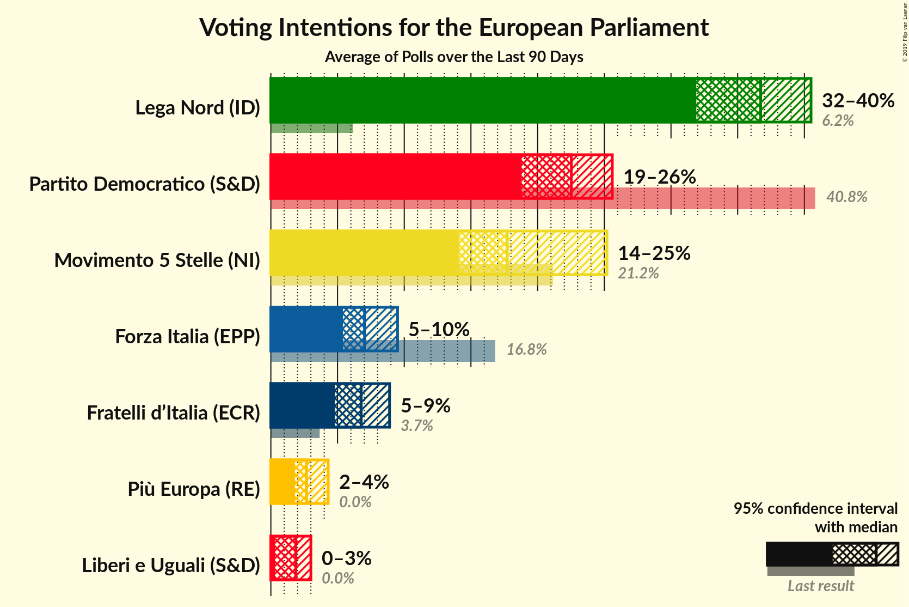

### Confidence Intervals

| Party | Last Result | Median | 80% Confidence Interval | 90% Confidence Interval | 95% Confidence Interval | 99% Confidence Interval |
|:-----:|:-----------:|:------:|:-----------------------:|:-----------------------:|:-----------------------:|:-----------------------:|
| <a href="#partito-democratico-(s&d)">Partito Democratico (S&D)</a> | 40.8% | 23.3% | 20.9–25.3% |20.1–25.8% | 19.5–26.4% | 18.4–27.4% |
| <a href="#movimento-5-stelle-(ni)">Movimento 5 Stelle (NI)</a> | 21.2% | 17.9% | 15.8–22.1% |15.2–23.5% | 14.8–24.5% | 14.0–26.2% |
| <a href="#forza-italia-(epp)">Forza Italia (EPP)</a> | 16.8% | 6.5% | 5.5–8.1% |5.3–8.6% | 5.1–9.1% | 4.5–9.9% |
| <a href="#lega-nord-(id)">Lega Nord (ID)</a> | 6.2% | 35.2% | 31.0–38.4% |30.0–39.2% | 29.3–39.8% | 27.9–40.9% |
| <a href="#fratelli-d’italia-(ecr)">Fratelli d’Italia (ECR)</a> | 3.7% | 7.3% | 6.2–8.8% |5.9–9.2% | 5.6–9.5% | 5.1–10.1% |
| <a href="#südtiroler-volkspartei-(epp)">Südtiroler Volkspartei (EPP)</a> | 0.5% | N/A | N/A |N/A | N/A | N/A |
| <a href="#casapound-italia-(ni)">CasaPound Italia (NI)</a> | 0.0% | N/A | N/A |N/A | N/A | N/A |
| <a href="#civica-popolare-(re)">Civica Popolare (RE)</a> | 0.0% | N/A | N/A |N/A | N/A | N/A |
| <a href="#insieme-(*)">Insieme (*)</a> | 0.0% | N/A | N/A |N/A | N/A | N/A |
| <a href="#noi-con-l’italia-(ecr)">Noi con l’Italia (ECR)</a> | 0.0% | N/A | N/A |N/A | N/A | N/A |
| <a href="#più-europa-(re)">Più Europa (RE)</a> | 0.0% | 2.7% | 1.9–3.7% |1.7–4.0% | 1.6–4.3% | 1.3–4.8% |
| <a href="#liberi-e-uguali-(s&d)">Liberi e Uguali (S&D)</a> | 0.0% | 2.0% | 1.4–2.6% |1.2–2.8% | 1.1–3.0% | 0.8–3.3% |
| <a href="#potere-al-popolo-(gue/ngl)">Potere al Popolo (GUE/NGL)</a> | 0.0% | N/A | N/A |N/A | N/A | N/A |

### Partito Democratico (S&D)

*For a full overview of the results for this party, see the [Partito Democratico (S&D)](party-partitodemocraticosd.html) page.*

| Voting Intentions | Probability | Accumulated | Special Marks |
|:-----------------:|:-----------:|:-----------:|:-------------:|
| 15.5–16.5% | 0% | 100% |  |
| 16.5–17.5% | 0.1% | 100% |  |
| 17.5–18.5% | 0.5% | 99.9% |  |
| 18.5–19.5% | 2% | 99.4% |  |
| 19.5–20.5% | 5% | 97% |  |
| 20.5–21.5% | 9% | 93% |  |
| 21.5–22.5% | 16% | 84% |  |
| 22.5–23.5% | 23% | 68% | Median |
| 23.5–24.5% | 23% | 44% |  |
| 24.5–25.5% | 14% | 21% |  |
| 25.5–26.5% | 5% | 7% |  |
| 26.5–27.5% | 2% | 2% |  |
| 27.5–28.5% | 0.3% | 0.4% |  |
| 28.5–29.5% | 0.1% | 0.1% |  |
| 29.5–30.5% | 0% | 0% |  |
| 30.5–31.5% | 0% | 0% |  |
| 31.5–32.5% | 0% | 0% |  |
| 32.5–33.5% | 0% | 0% |  |
| 33.5–34.5% | 0% | 0% |  |
| 34.5–35.5% | 0% | 0% |  |
| 35.5–36.5% | 0% | 0% |  |
| 36.5–37.5% | 0% | 0% |  |
| 37.5–38.5% | 0% | 0% |  |
| 38.5–39.5% | 0% | 0% |  |
| 39.5–40.5% | 0% | 0% |  |
| 40.5–41.5% | 0% | 0% | Last Result |

### Movimento 5 Stelle (NI)

*For a full overview of the results for this party, see the [Movimento 5 Stelle (NI)](party-movimento5stelleni.html) page.*

| Voting Intentions | Probability | Accumulated | Special Marks |
|:-----------------:|:-----------:|:-----------:|:-------------:|
| 11.5–12.5% | 0% | 100% |  |
| 12.5–13.5% | 0.2% | 100% |  |
| 13.5–14.5% | 1.5% | 99.8% |  |
| 14.5–15.5% | 6% | 98% |  |
| 15.5–16.5% | 14% | 93% |  |
| 16.5–17.5% | 21% | 78% |  |
| 17.5–18.5% | 20% | 58% | Median |
| 18.5–19.5% | 13% | 37% |  |
| 19.5–20.5% | 7% | 24% |  |
| 20.5–21.5% | 5% | 17% | Last Result |
| 21.5–22.5% | 4% | 13% |  |
| 22.5–23.5% | 3% | 8% |  |
| 23.5–24.5% | 2% | 5% |  |
| 24.5–25.5% | 1.5% | 2% |  |
| 25.5–26.5% | 0.7% | 1.0% |  |
| 26.5–27.5% | 0.2% | 0.3% |  |
| 27.5–28.5% | 0.1% | 0.1% |  |
| 28.5–29.5% | 0% | 0% |  |

### Forza Italia (EPP)

*For a full overview of the results for this party, see the [Forza Italia (EPP)](party-forzaitaliaepp.html) page.*

| Voting Intentions | Probability | Accumulated | Special Marks |
|:-----------------:|:-----------:|:-----------:|:-------------:|
| 2.5–3.5% | 0% | 100% |  |
| 3.5–4.5% | 0.6% | 100% |  |
| 4.5–5.5% | 9% | 99.4% |  |
| 5.5–6.5% | 41% | 90% |  |
| 6.5–7.5% | 31% | 49% | Median |
| 7.5–8.5% | 12% | 18% |  |
| 8.5–9.5% | 4% | 6% |  |
| 9.5–10.5% | 1.0% | 1.1% |  |
| 10.5–11.5% | 0.1% | 0.1% |  |
| 11.5–12.5% | 0% | 0% |  |
| 12.5–13.5% | 0% | 0% |  |
| 13.5–14.5% | 0% | 0% |  |
| 14.5–15.5% | 0% | 0% |  |
| 15.5–16.5% | 0% | 0% |  |
| 16.5–17.5% | 0% | 0% | Last Result |

### Lega Nord (ID)

*For a full overview of the results for this party, see the [Lega Nord (ID)](party-leganordid.html) page.*

| Voting Intentions | Probability | Accumulated | Special Marks |
|:-----------------:|:-----------:|:-----------:|:-------------:|
| 5.5–6.5% | 0% | 100% | Last Result |
| 6.5–7.5% | 0% | 100% |  |
| 7.5–8.5% | 0% | 100% |  |
| 8.5–9.5% | 0% | 100% |  |
| 9.5–10.5% | 0% | 100% |  |
| 10.5–11.5% | 0% | 100% |  |
| 11.5–12.5% | 0% | 100% |  |
| 12.5–13.5% | 0% | 100% |  |
| 13.5–14.5% | 0% | 100% |  |
| 14.5–15.5% | 0% | 100% |  |
| 15.5–16.5% | 0% | 100% |  |
| 16.5–17.5% | 0% | 100% |  |
| 17.5–18.5% | 0% | 100% |  |
| 18.5–19.5% | 0% | 100% |  |
| 19.5–20.5% | 0% | 100% |  |
| 20.5–21.5% | 0% | 100% |  |
| 21.5–22.5% | 0% | 100% |  |
| 22.5–23.5% | 0% | 100% |  |
| 23.5–24.5% | 0% | 100% |  |
| 24.5–25.5% | 0% | 100% |  |
| 25.5–26.5% | 0.1% | 100% |  |
| 26.5–27.5% | 0.2% | 99.9% |  |
| 27.5–28.5% | 0.8% | 99.7% |  |
| 28.5–29.5% | 2% | 98.9% |  |
| 29.5–30.5% | 4% | 97% |  |
| 30.5–31.5% | 6% | 93% |  |
| 31.5–32.5% | 9% | 87% |  |
| 32.5–33.5% | 11% | 78% |  |
| 33.5–34.5% | 10% | 67% |  |
| 34.5–35.5% | 10% | 57% | Median |
| 35.5–36.5% | 13% | 47% |  |
| 36.5–37.5% | 14% | 33% |  |
| 37.5–38.5% | 10% | 19% |  |
| 38.5–39.5% | 6% | 9% |  |
| 39.5–40.5% | 2% | 3% |  |
| 40.5–41.5% | 0.7% | 0.9% |  |
| 41.5–42.5% | 0.1% | 0.2% |  |
| 42.5–43.5% | 0% | 0% |  |

### Fratelli d’Italia (ECR)

*For a full overview of the results for this party, see the [Fratelli d’Italia (ECR)](party-fratellid’italiaecr.html) page.*

| Voting Intentions | Probability | Accumulated | Special Marks |
|:-----------------:|:-----------:|:-----------:|:-------------:|
| 2.5–3.5% | 0% | 100% |  |
| 3.5–4.5% | 0.1% | 100% | Last Result |
| 4.5–5.5% | 2% | 99.9% |  |
| 5.5–6.5% | 18% | 98% |  |
| 6.5–7.5% | 39% | 80% | Median |
| 7.5–8.5% | 26% | 40% |  |
| 8.5–9.5% | 12% | 14% |  |
| 9.5–10.5% | 2% | 2% |  |
| 10.5–11.5% | 0.1% | 0.2% |  |
| 11.5–12.5% | 0% | 0% |  |

### Liberi e Uguali (S&D)

*For a full overview of the results for this party, see the [Liberi e Uguali (S&D)](party-liberieugualisd.html) page.*

| Voting Intentions | Probability | Accumulated | Special Marks |
|:-----------------:|:-----------:|:-----------:|:-------------:|
| 0.0–0.5% | 0% | 100% | Last Result |
| 0.5–1.5% | 17% | 100% |  |
| 1.5–2.5% | 69% | 83% | Median |
| 2.5–3.5% | 14% | 14% |  |
| 3.5–4.5% | 0.2% | 0.2% |  |
| 4.5–5.5% | 0% | 0% |  |

### Più Europa (RE)

*For a full overview of the results for this party, see the [Più Europa (RE)](party-piùeuropare.html) page.*

| Voting Intentions | Probability | Accumulated | Special Marks |
|:-----------------:|:-----------:|:-----------:|:-------------:|
| 0.0–0.5% | 0% | 100% | Last Result |
| 0.5–1.5% | 2% | 100% |  |
| 1.5–2.5% | 42% | 98% |  |
| 2.5–3.5% | 42% | 56% | Median |
| 3.5–4.5% | 13% | 14% |  |
| 4.5–5.5% | 1.0% | 1.1% |  |
| 5.5–6.5% | 0% | 0% |  |

## Seats

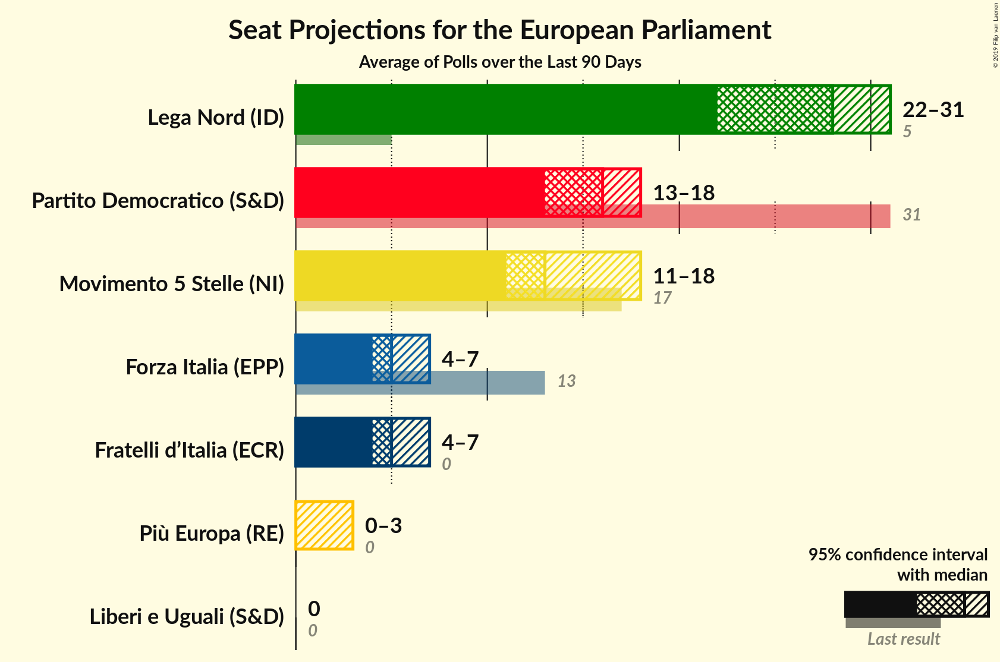

### Confidence Intervals

| Party | Last Result | Median | 80% Confidence Interval | 90% Confidence Interval | 95% Confidence Interval | 99% Confidence Interval |
|:-----:|:-----------:|:------:|:-----------------------:|:-----------------------:|:-----------------------:|:-----------------------:|
| <a href="#partito-democratico-(s&d)">Partito Democratico (S&D)</a> | 31 | 16 | 15–18 |14–19 | 14–19 | 13–20 |
| <a href="#movimento-5-stelle-(ni)">Movimento 5 Stelle (NI)</a> | 17 | 14 | 12–16 |11–17 | 11–18 | 10–19 |
| <a href="#forza-italia-(epp)">Forza Italia (EPP)</a> | 13 | 5 | 4–6 |4–7 | 4–7 | 3–8 |
| <a href="#lega-nord-(id)">Lega Nord (ID)</a> | 5 | 27 | 23–29 |22–30 | 22–30 | 20–31 |
| <a href="#fratelli-d’italia-(ecr)">Fratelli d’Italia (ECR)</a> | 0 | 5 | 5–7 |4–7 | 4–7 | 4–8 |
| <a href="#südtiroler-volkspartei-(epp)">Südtiroler Volkspartei (EPP)</a> | 1 | N/A | N/A |N/A | N/A | N/A |
| <a href="#casapound-italia-(ni)">CasaPound Italia (NI)</a> | 0 | N/A | N/A |N/A | N/A | N/A |
| <a href="#civica-popolare-(re)">Civica Popolare (RE)</a> | 0 | N/A | N/A |N/A | N/A | N/A |
| <a href="#insieme-(*)">Insieme (*)</a> | 0 | N/A | N/A |N/A | N/A | N/A |
| <a href="#noi-con-l’italia-(ecr)">Noi con l’Italia (ECR)</a> | 0 | N/A | N/A |N/A | N/A | N/A |
| <a href="#più-europa-(re)">Più Europa (RE)</a> | 0 | 0 | 0 |0–3 | 0–3 | 0–4 |
| <a href="#liberi-e-uguali-(s&d)">Liberi e Uguali (S&D)</a> | 0 | 0 | 0 |0 | 0 | 0 |
| <a href="#potere-al-popolo-(gue/ngl)">Potere al Popolo (GUE/NGL)</a> | 0 | N/A | N/A |N/A | N/A | N/A |

### Partito Democratico (S&D)

*For a full overview of the results for this party, see the [Partito Democratico (S&D)](party-partitodemocraticosd.html) page.*

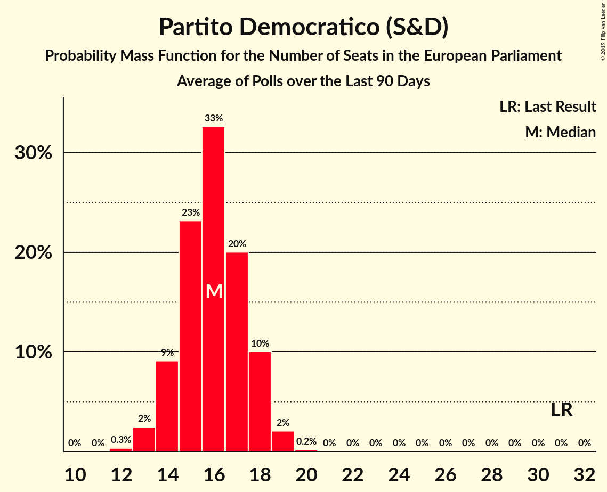

| Number of Seats | Probability | Accumulated | Special Marks |
|:---------------:|:-----------:|:-----------:|:-------------:|
| 12 | 0.2% | 100% |  |
| 13 | 2% | 99.8% |  |
| 14 | 6% | 98% |  |
| 15 | 18% | 92% |  |
| 16 | 28% | 74% | Median |
| 17 | 24% | 46% |  |
| 18 | 15% | 22% |  |
| 19 | 5% | 7% |  |
| 20 | 1.2% | 1.4% |  |
| 21 | 0.2% | 0.2% |  |
| 22 | 0% | 0% |  |
| 23 | 0% | 0% |  |
| 24 | 0% | 0% |  |
| 25 | 0% | 0% |  |
| 26 | 0% | 0% |  |
| 27 | 0% | 0% |  |
| 28 | 0% | 0% |  |
| 29 | 0% | 0% |  |
| 30 | 0% | 0% |  |
| 31 | 0% | 0% | Last Result |

### Movimento 5 Stelle (NI)

*For a full overview of the results for this party, see the [Movimento 5 Stelle (NI)](party-movimento5stelleni.html) page.*

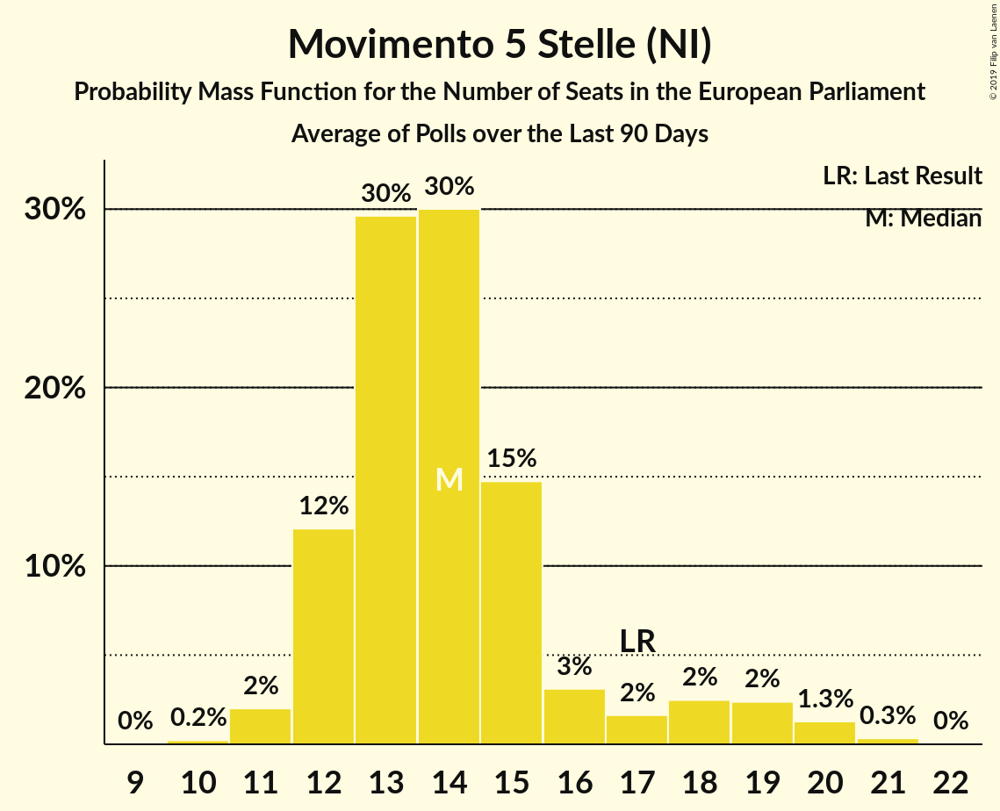

| Number of Seats | Probability | Accumulated | Special Marks |
|:---------------:|:-----------:|:-----------:|:-------------:|
| 10 | 0.9% | 100% |  |
| 11 | 6% | 99.1% |  |
| 12 | 15% | 93% |  |
| 13 | 27% | 78% |  |
| 14 | 25% | 51% | Median |
| 15 | 9% | 26% |  |
| 16 | 8% | 17% |  |
| 17 | 6% | 10% | Last Result |
| 18 | 3% | 4% |  |
| 19 | 1.0% | 1.2% |  |
| 20 | 0.2% | 0.2% |  |
| 21 | 0% | 0% |  |

### Forza Italia (EPP)

*For a full overview of the results for this party, see the [Forza Italia (EPP)](party-forzaitaliaepp.html) page.*

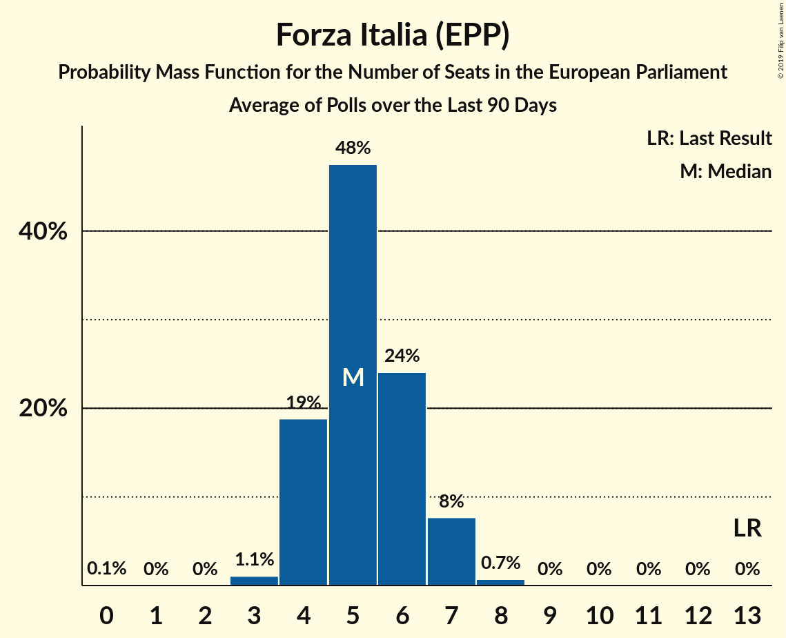

| Number of Seats | Probability | Accumulated | Special Marks |
|:---------------:|:-----------:|:-----------:|:-------------:|
| 0 | 0.1% | 100% |  |
| 1 | 0% | 99.9% |  |
| 2 | 0% | 99.9% |  |
| 3 | 1.2% | 99.9% |  |
| 4 | 27% | 98.7% |  |
| 5 | 48% | 72% | Median |
| 6 | 18% | 24% |  |
| 7 | 5% | 6% |  |
| 8 | 0.6% | 0.6% |  |
| 9 | 0% | 0% |  |
| 10 | 0% | 0% |  |
| 11 | 0% | 0% |  |
| 12 | 0% | 0% |  |
| 13 | 0% | 0% | Last Result |

### Lega Nord (ID)

*For a full overview of the results for this party, see the [Lega Nord (ID)](party-leganordid.html) page.*

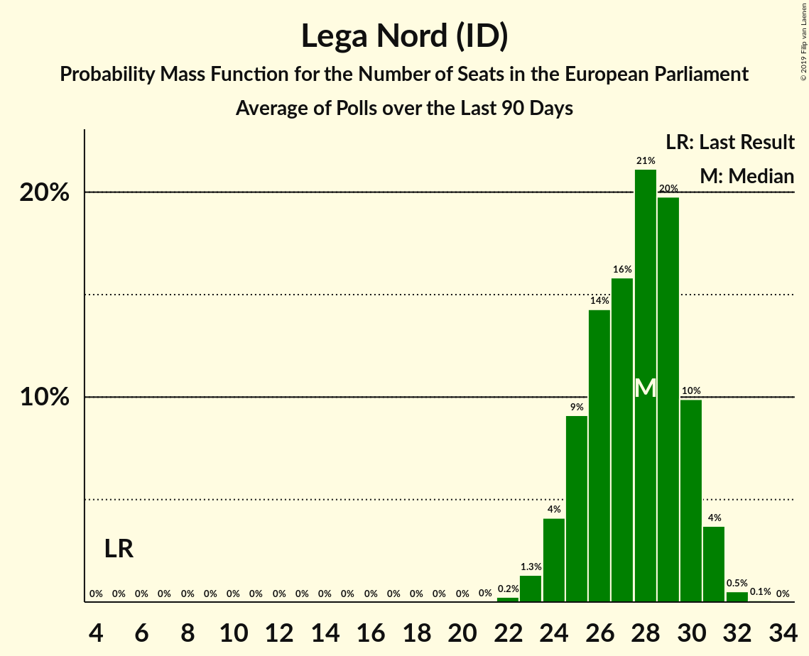

| Number of Seats | Probability | Accumulated | Special Marks |
|:---------------:|:-----------:|:-----------:|:-------------:|
| 5 | 0% | 100% | Last Result |
| 6 | 0% | 100% |  |
| 7 | 0% | 100% |  |
| 8 | 0% | 100% |  |
| 9 | 0% | 100% |  |
| 10 | 0% | 100% |  |
| 11 | 0% | 100% |  |
| 12 | 0% | 100% |  |
| 13 | 0% | 100% |  |
| 14 | 0% | 100% |  |
| 15 | 0% | 100% |  |
| 16 | 0% | 100% |  |
| 17 | 0% | 100% |  |
| 18 | 0% | 100% |  |
| 19 | 0.1% | 100% |  |
| 20 | 0.5% | 99.9% |  |
| 21 | 2% | 99.4% |  |
| 22 | 4% | 98% |  |
| 23 | 8% | 94% |  |
| 24 | 13% | 86% |  |
| 25 | 9% | 73% |  |
| 26 | 12% | 64% |  |
| 27 | 17% | 52% | Median |
| 28 | 19% | 34% |  |
| 29 | 10% | 16% |  |
| 30 | 4% | 6% |  |
| 31 | 1.2% | 1.4% |  |
| 32 | 0.2% | 0.2% |  |
| 33 | 0% | 0% |  |

### Fratelli d’Italia (ECR)

*For a full overview of the results for this party, see the [Fratelli d’Italia (ECR)](party-fratellid’italiaecr.html) page.*

| Number of Seats | Probability | Accumulated | Special Marks |
|:---------------:|:-----------:|:-----------:|:-------------:|
| 0 | 0% | 100% | Last Result |
| 1 | 0% | 100% |  |
| 2 | 0% | 100% |  |
| 3 | 0.2% | 100% |  |
| 4 | 7% | 99.8% |  |
| 5 | 45% | 93% | Median |
| 6 | 35% | 48% |  |
| 7 | 12% | 13% |  |
| 8 | 1.0% | 1.0% |  |
| 9 | 0% | 0% |  |

### Liberi e Uguali (S&D)

*For a full overview of the results for this party, see the [Liberi e Uguali (S&D)](party-liberieugualisd.html) page.*

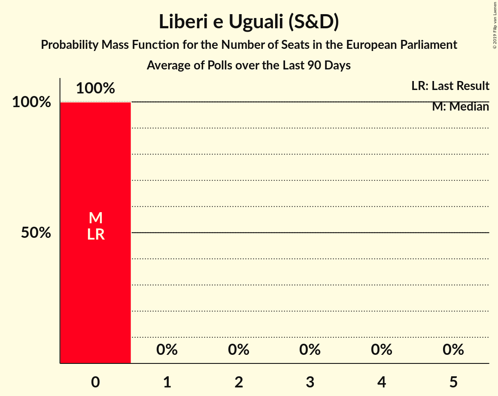

| Number of Seats | Probability | Accumulated | Special Marks |
|:---------------:|:-----------:|:-----------:|:-------------:|
| 0 | 100% | 100% | Last Result, Median |

### Più Europa (RE)

*For a full overview of the results for this party, see the [Più Europa (RE)](party-piùeuropare.html) page.*

| Number of Seats | Probability | Accumulated | Special Marks |
|:---------------:|:-----------:|:-----------:|:-------------:|
| 0 | 95% | 100% | Last Result, Median |
| 1 | 0% | 5% |  |
| 2 | 0% | 5% |  |
| 3 | 4% | 5% |  |
| 4 | 0.8% | 0.8% |  |
| 5 | 0% | 0% |  |

## Coalitions

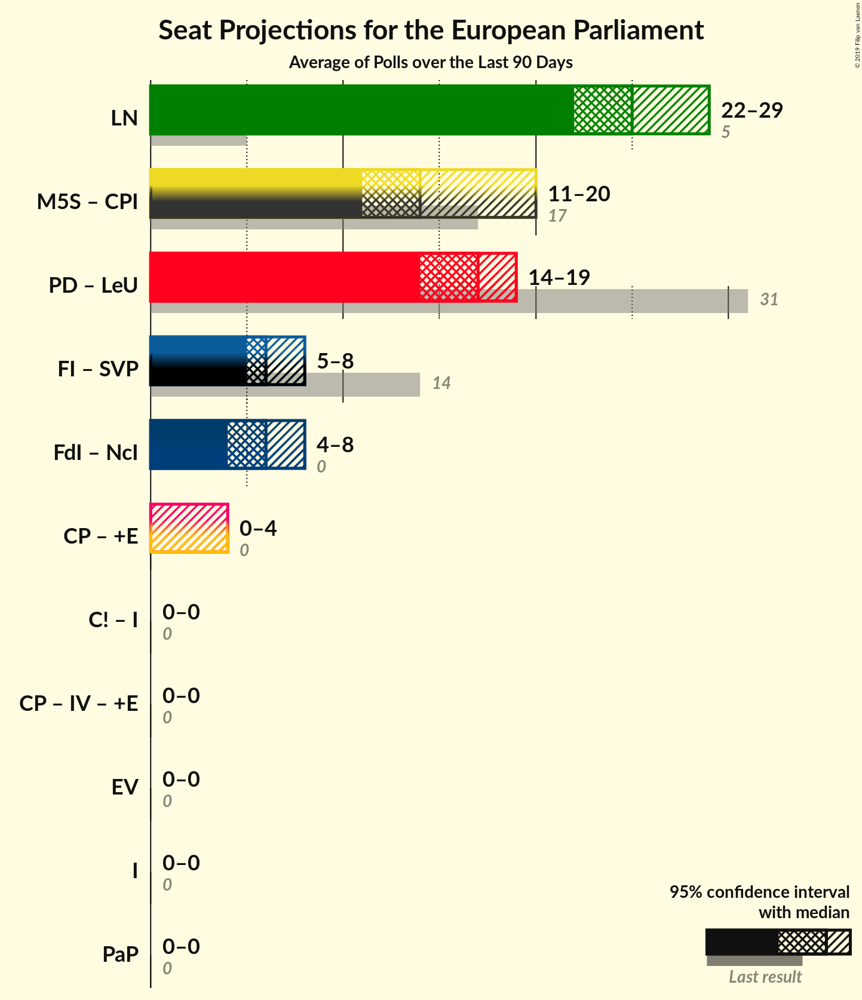

### Confidence Intervals

| Coalition | Last Result | Median | Majority? | 80% Confidence Interval | 90% Confidence Interval | 95% Confidence Interval | 99% Confidence Interval |
|:---------:|:-----------:|:------:|:---------:|:-----------------------:|:-----------------------:|:-----------------------:|:-----------------------:|
| Lega Nord (ID) | 5 | 27 | 0% | 23–29 | 22–30 | 22–30 | 20–31 |
| Partito Democratico (S&D) – Liberi e Uguali (S&D) | 31 | 16 | 0% | 15–18 | 14–19 | 14–19 | 13–20 |
| Movimento 5 Stelle (NI) – CasaPound Italia (NI) | 17 | 14 | 0% | 12–16 | 11–17 | 11–18 | 10–19 |
| Forza Italia (EPP) – Südtiroler Volkspartei (EPP) | 14 | 6 | 0% | 5–7 | 5–8 | 5–8 | 4–9 |
| Fratelli d’Italia (ECR) – Noi con l’Italia (ECR) | 0 | 5 | 0% | 5–7 | 4–7 | 4–7 | 4–8 |
| Civica Popolare (RE) – Più Europa (RE) | 0 | 0 | 0% | 0 | 0 | 0–3 | 0–4 |
| Insieme (*) | 0 | 0 | 0% | 0 | 0 | 0 | 0 |
| Potere al Popolo (GUE/NGL) | 0 | 0 | 0% | 0 | 0 | 0 | 0 |

### Lega Nord (ID)

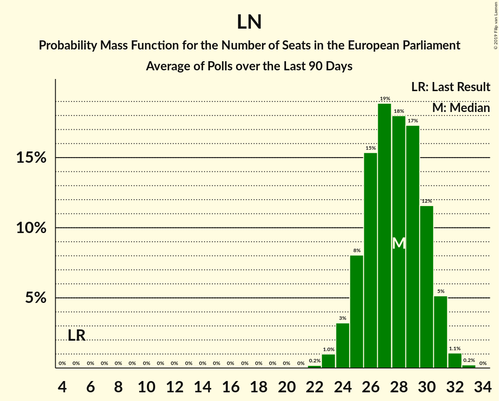

| Number of Seats | Probability | Accumulated | Special Marks |
|:---------------:|:-----------:|:-----------:|:-------------:|
| 5 | 0% | 100% | Last Result |
| 6 | 0% | 100% |  |
| 7 | 0% | 100% |  |
| 8 | 0% | 100% |  |
| 9 | 0% | 100% |  |
| 10 | 0% | 100% |  |
| 11 | 0% | 100% |  |
| 12 | 0% | 100% |  |
| 13 | 0% | 100% |  |
| 14 | 0% | 100% |  |
| 15 | 0% | 100% |  |
| 16 | 0% | 100% |  |
| 17 | 0% | 100% |  |
| 18 | 0% | 100% |  |
| 19 | 0.1% | 100% |  |
| 20 | 0.5% | 99.9% |  |
| 21 | 2% | 99.4% |  |
| 22 | 4% | 98% |  |
| 23 | 8% | 94% |  |
| 24 | 13% | 86% |  |
| 25 | 9% | 73% |  |
| 26 | 12% | 64% |  |
| 27 | 17% | 52% | Median |
| 28 | 19% | 34% |  |
| 29 | 10% | 16% |  |
| 30 | 4% | 6% |  |
| 31 | 1.2% | 1.4% |  |
| 32 | 0.2% | 0.2% |  |
| 33 | 0% | 0% |  |

### Partito Democratico (S&D) – Liberi e Uguali (S&D)

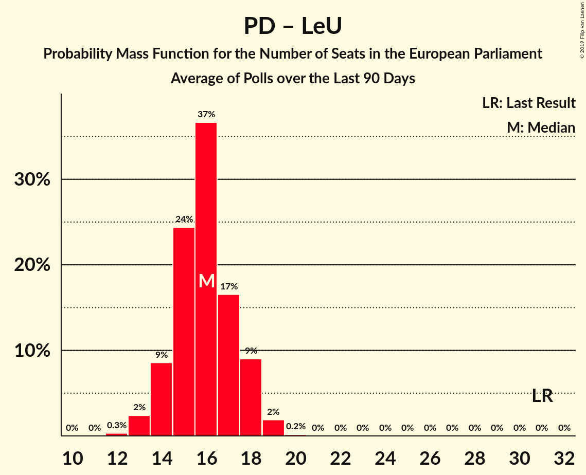

| Number of Seats | Probability | Accumulated | Special Marks |
|:---------------:|:-----------:|:-----------:|:-------------:|
| 12 | 0.2% | 100% |  |
| 13 | 2% | 99.8% |  |
| 14 | 6% | 98% |  |
| 15 | 18% | 92% |  |
| 16 | 28% | 74% | Median |
| 17 | 24% | 46% |  |
| 18 | 15% | 22% |  |
| 19 | 5% | 7% |  |
| 20 | 1.2% | 1.4% |  |
| 21 | 0.2% | 0.2% |  |
| 22 | 0% | 0% |  |
| 23 | 0% | 0% |  |
| 24 | 0% | 0% |  |
| 25 | 0% | 0% |  |
| 26 | 0% | 0% |  |
| 27 | 0% | 0% |  |
| 28 | 0% | 0% |  |
| 29 | 0% | 0% |  |
| 30 | 0% | 0% |  |
| 31 | 0% | 0% | Last Result |

### Movimento 5 Stelle (NI) – CasaPound Italia (NI)

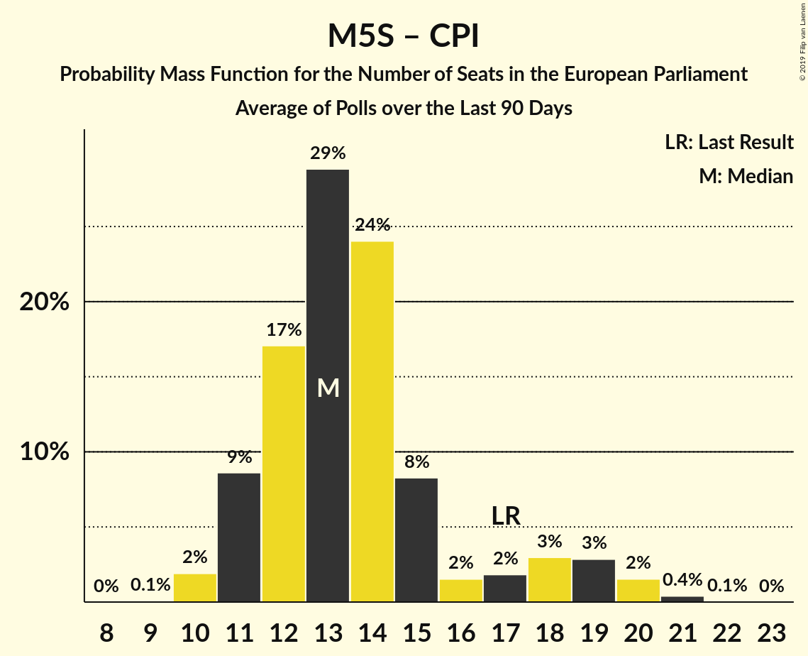

| Number of Seats | Probability | Accumulated | Special Marks |
|:---------------:|:-----------:|:-----------:|:-------------:|
| 10 | 0.9% | 100% |  |
| 11 | 6% | 99.1% |  |
| 12 | 15% | 93% |  |
| 13 | 27% | 78% |  |
| 14 | 25% | 51% | Median |
| 15 | 9% | 26% |  |
| 16 | 8% | 17% |  |
| 17 | 6% | 10% | Last Result |
| 18 | 3% | 4% |  |
| 19 | 1.0% | 1.2% |  |
| 20 | 0.2% | 0.2% |  |
| 21 | 0% | 0% |  |

### Forza Italia (EPP) – Südtiroler Volkspartei (EPP)

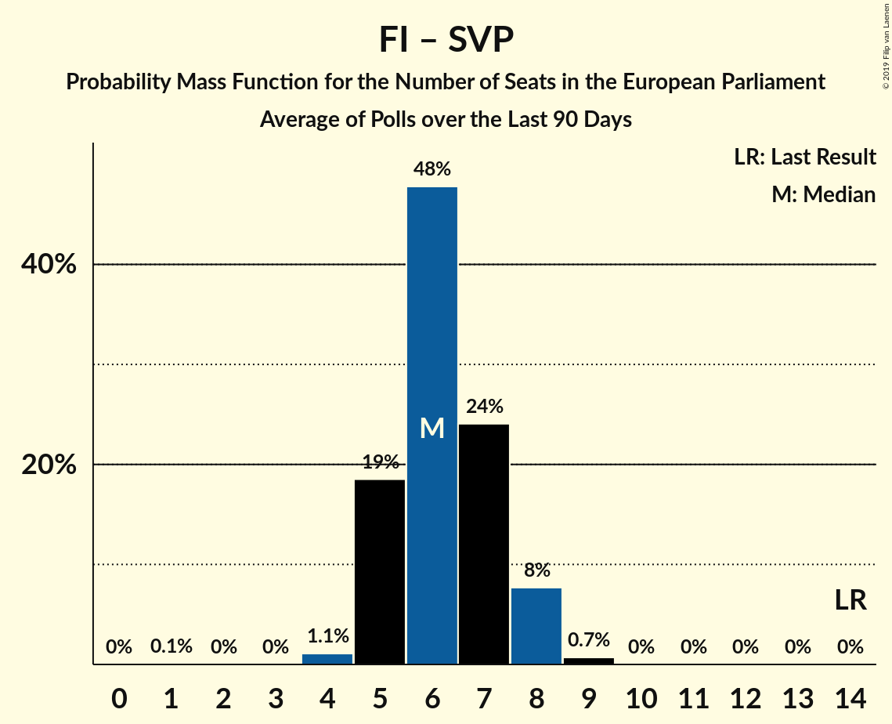

| Number of Seats | Probability | Accumulated | Special Marks |
|:---------------:|:-----------:|:-----------:|:-------------:|
| 1 | 0.1% | 100% |  |
| 2 | 0% | 99.9% |  |
| 3 | 0% | 99.9% |  |
| 4 | 1.2% | 99.9% |  |
| 5 | 27% | 98.7% | Median |
| 6 | 48% | 72% |  |
| 7 | 18% | 24% |  |
| 8 | 5% | 6% |  |
| 9 | 0.6% | 0.6% |  |
| 10 | 0% | 0% |  |
| 11 | 0% | 0% |  |
| 12 | 0% | 0% |  |
| 13 | 0% | 0% |  |
| 14 | 0% | 0% | Last Result |

### Fratelli d’Italia (ECR) – Noi con l’Italia (ECR)

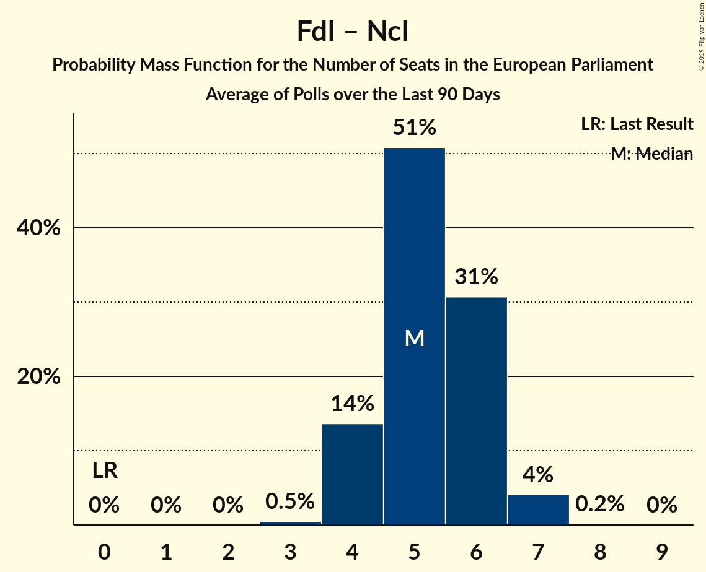

| Number of Seats | Probability | Accumulated | Special Marks |
|:---------------:|:-----------:|:-----------:|:-------------:|
| 0 | 0% | 100% | Last Result |
| 1 | 0% | 100% |  |
| 2 | 0% | 100% |  |
| 3 | 0.2% | 100% |  |
| 4 | 7% | 99.8% |  |
| 5 | 45% | 93% | Median |
| 6 | 35% | 48% |  |
| 7 | 12% | 13% |  |
| 8 | 1.0% | 1.0% |  |
| 9 | 0% | 0% |  |

### Civica Popolare (RE) – Più Europa (RE)

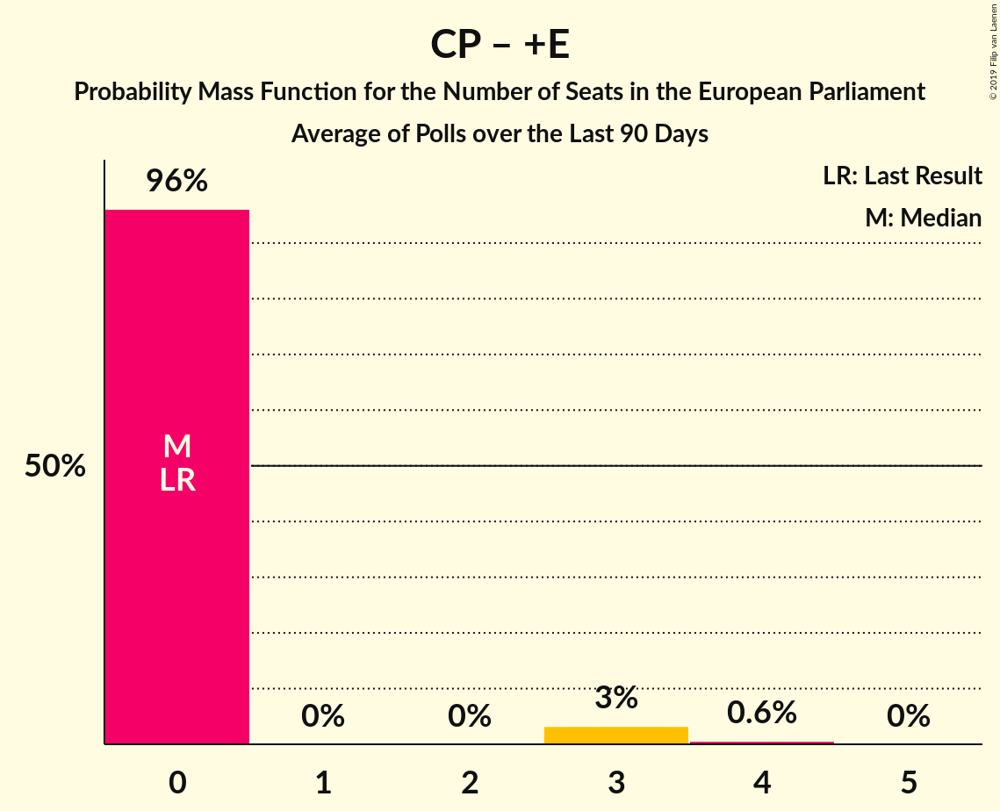

| Number of Seats | Probability | Accumulated | Special Marks |
|:---------------:|:-----------:|:-----------:|:-------------:|
| 0 | 97% | 100% | Last Result, Median |
| 1 | 0% | 3% |  |
| 2 | 0% | 3% |  |
| 3 | 3% | 3% |  |
| 4 | 0.5% | 0.5% |  |
| 5 | 0% | 0% |  |

### Insieme (*)

| Number of Seats | Probability | Accumulated | Special Marks |
|:---------------:|:-----------:|:-----------:|:-------------:|
| 0 | 100% | 100% | Last Result, Median |

### Potere al Popolo (GUE/NGL)

| Number of Seats | Probability | Accumulated | Special Marks |
|:---------------:|:-----------:|:-----------:|:-------------:|
| 0 | 100% | 100% | Last Result, Median |

## Technical Information

+ **Number of polls included in this average:** 9
+ **Lowest number of simulations done in a poll included in this average:** 1,048,576
+ **Total number of simulations done in the polls included in this average:** 9,437,184
+ **Error estimate:** 1.94%
