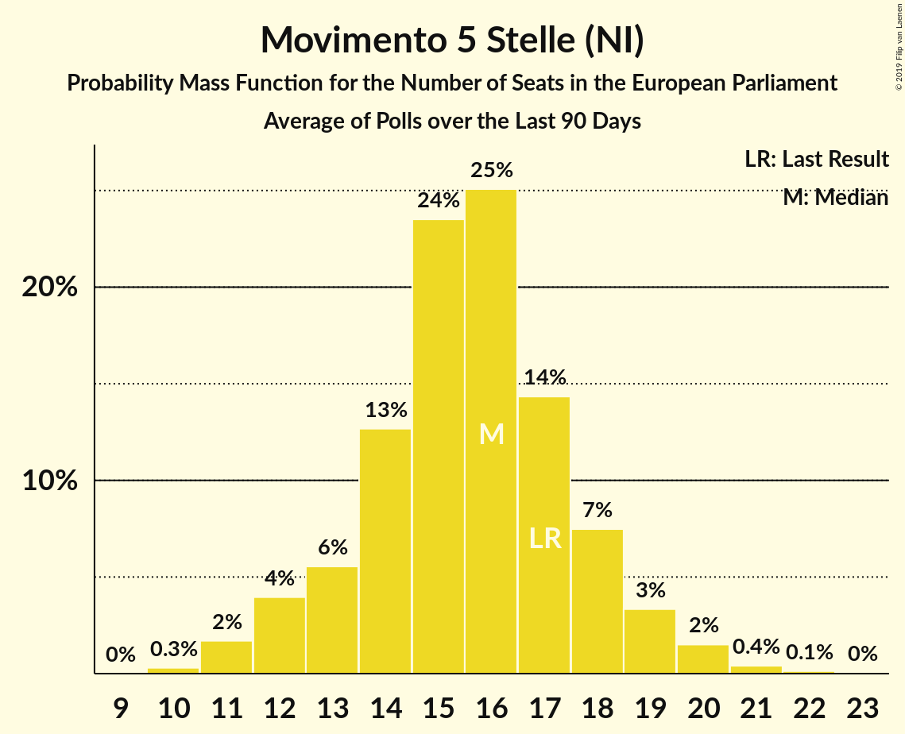
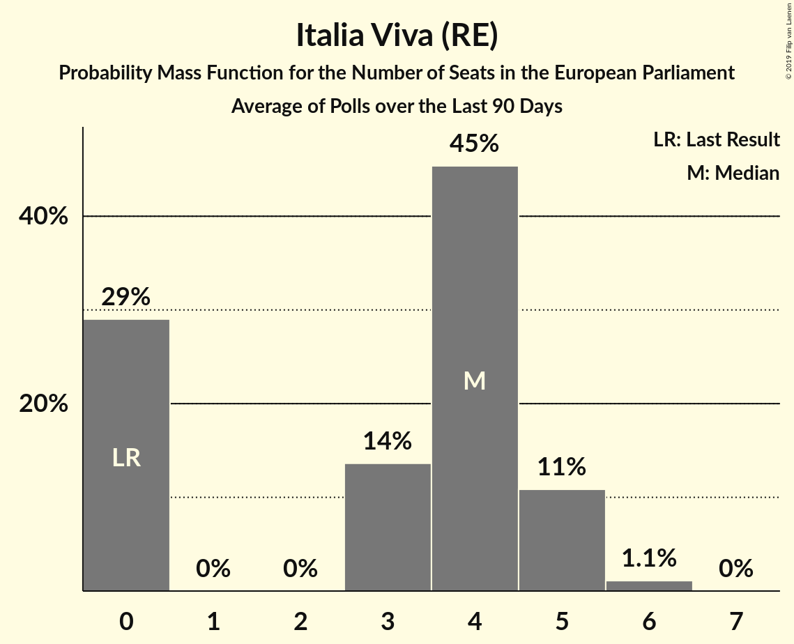
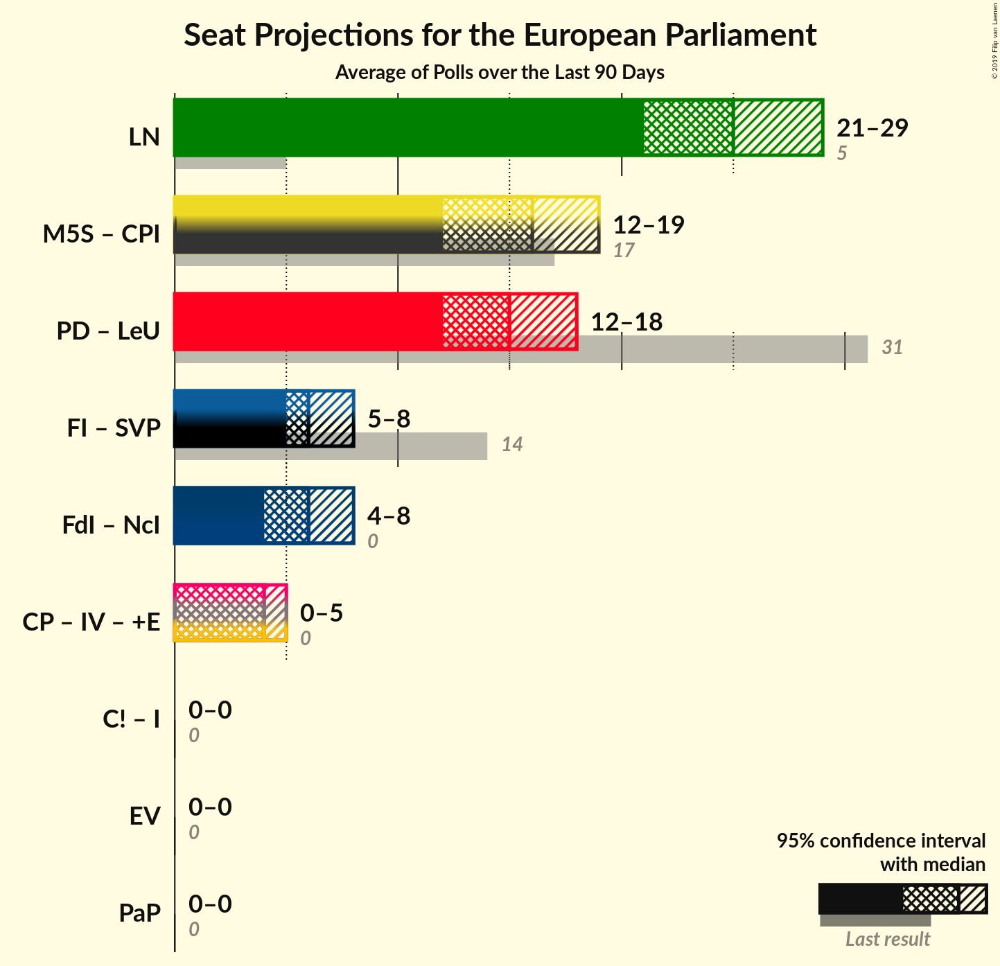

# Poll Average

<a href="#voting-intentions">Voting Intentions</a> | <a href="#seats">Seats</a> | <a href="#coalitions">Coalitions</a> | <a href="#technical-information">Technical Information</a>

## Summary

The table below lists the polls on which the average is based. They are the most recent polls (less than 90 days old) registered and analyzed so far.

| Period     | Polling firm/Commissioner(s) | PD | M5S | FI | LN | FdI | SVP | CPI | CP | I | NcI | +E | LeU | PaP | EV | C! | IV |
|:----------:|:----------------------------:|:--:|:--:|:--:|:--:|:--:|:--:|:--:|:--:|:--:|:--:|:--:|:--:|:--:|:--:|:--:|:--:|
| 26 May 2019 | General Election | 40.8%   31 | 21.2%   17 | 16.8%   13 | 6.2%   5 | 3.7%   0 | 0.5%   1 | 0.0%   0 | 0.0%   0 | 0.0%   0 | 0.0%   0 | 0.0%   0 | 0.0%   0 | 0.0%   0 | 0.0%   0 | 0.0%   0 | 0.0%   0 |
| N/A | Poll Average | 17–26%   13–19 | 15–26%   11–20 | 5–9%   4–7 | 28–38%   21–30 | 6–10%   4–8 | N/A   N/A | N/A   N/A | N/A   N/A | N/A   N/A | N/A   N/A | 1–5%   0–4 | 1–4%   0 | N/A   N/A | 1–3%   0 | 0–2%   0 | 3–7%   0–5 |
| [18–20 September 2019](2019-09-20-ScenariPolitici–Winpoll.html) | Scenari Politici–Winpoll   Il Sole 24 Ore | 19–23%   13–17 | 13–17%   10–13 | 5–7%   4–5 | 31–36%   24–28 | 7–10%   6–8 | N/A   N/A | N/A   N/A | N/A   N/A | N/A   N/A | N/A   N/A | 1–2%   0 | 2–4%   0 | N/A   N/A | 1–2%   0 | N/A   N/A | 5–8%   4–6 |
| [17–19 September 2019](2019-09-19-TermometroPolitico.html) | Termometro Politico   La7 | 18–21%   13–16 | 17–20%   14–16 | 4–6%   3–5 | 34–39%   26–32 | 7–10%   6–8 | N/A   N/A | N/A   N/A | N/A   N/A | N/A   N/A | N/A   N/A | 1–2%   0 | 1–2%   0 | N/A   N/A | 1–2%   0 | 0–1%   0 | 3–5%   0–4 |
| [18–19 September 2019](2019-09-19-Tecnè.html) | Tecnè   Rete 4 | 17–22%   13–17 | 18–23%   15–18 | 6–10%   5–8 | 30–36%   24–30 | 6–9%   5–7 | N/A   N/A | N/A   N/A | N/A   N/A | N/A   N/A | N/A   N/A | 2–3%   0 | 1–3%   0 | N/A   N/A | 1–2%   0 | 0–1%   0 | 3–5%   0–4 |
| [18–19 September 2019](2019-09-19-Demopolis.html) | Demopolis   Rai 3 | 19–23%   13–16 | 20–24%   15–18 | 5–8%   4–6 | 33–38%   24–28 | N/A   N/A | N/A   N/A | N/A   N/A | N/A   N/A | N/A   N/A | N/A   N/A | N/A   N/A | N/A   N/A | N/A   N/A | N/A   N/A | N/A   N/A | 5–7%   3–5 |
| [17–18 September 2019](2019-09-18-Euromedia.html) | Euromedia   Rai 1 | 15–20%   11–15 | 17–22%   13–17 | 5–8%   4–6 | 29–35%   23–28 | 5–9%   5–7 | N/A   N/A | N/A   N/A | N/A   N/A | N/A   N/A | N/A   N/A | 1–3%   0 | 2–4%   0 | N/A   N/A | 1–2%   0 | 1–2%   0 | 4–7%   0–5 |
| [14–18 September 2019](2019-09-18-BiDiMedia.html) | BiDiMedia | 20–24%   15–18 | 18–22%   14–17 | 5–7%   4–6 | 28–32%   22–25 | 6–9%   5–7 | N/A   N/A | N/A   N/A | N/A   N/A | N/A   N/A | N/A   N/A | 2–3%   0 | 1–3%   0 | N/A   N/A | 1–3%   0 | 1–2%   0 | N/A   N/A |
| [16–17 September 2019](2019-09-17-Ixè.html) | Ixè   Rai 3 | 19–24%   14–18 | 19–25%   15–19 | 6–9%   5–7 | 27–33%   21–26 | 7–10%   5–8 | N/A   N/A | N/A   N/A | N/A   N/A | N/A   N/A | N/A   N/A | 3–5%   0–4 | 2–4%   0–3 | N/A   N/A | 1–3%   0 | N/A   N/A | N/A   N/A |
| [17 September 2019](2019-09-17-EMG.html) | EMG   Rai 3 | 18–22%   14–18 | 17–20%   13–17 | 6–8%   5–7 | 31–35%   24–29 | 6–8%   5–7 | N/A   N/A | N/A   N/A | N/A   N/A | N/A   N/A | N/A   N/A | 2–4%   0 | 1–3%   0 | N/A   N/A | 1–2%   0 | 1–2%   0 | 3–4%   0–3 |
| [11–16 September 2019](2019-09-16-SWG.html) | SWG   La7 | 19–24%   15–18 | 18–23%   15–19 | 5–7%   4–6 | 32–36%   26–30 | 6–8%   5–7 | N/A   N/A | N/A   N/A | N/A   N/A | N/A   N/A | N/A   N/A | 2–3%   0 | 2–3%   0 | N/A   N/A | 2–3%   0 | 1–3%   0 | N/A   N/A |
| [10–12 September 2019](2019-09-12-DemosPi.html) | Demos & Pi   La Repubblica | 20–25%   14–18 | 18–23%   14–18 | 5–8%   4–6 | 30–35%   23–27 | 6–9%   4–7 | N/A   N/A | N/A   N/A | N/A   N/A | N/A   N/A | N/A   N/A | 2–4%   0 | 2–4%   0–3 | N/A   N/A | N/A   N/A | N/A   N/A | N/A   N/A |
| [9–10 September 2019](2019-09-10-NotoSondaggi.html) | Noto Sondaggi | 20–25%   15–19 | 17–22%   13–17 | 4–7%   0–5 | 31–37%   25–30 | 6–9%   4–7 | N/A   N/A | N/A   N/A | N/A   N/A | N/A   N/A | N/A   N/A | 1–3%   0 | 1–3%   0 | N/A   N/A | 1–2%   0 | 1–2%   0 | N/A   N/A |
| [7–9 September 2019](2019-09-09-Piepoli.html) | Piepoli   Rai 1 | 20–28%   14–20 | 17–24%   13–18 | 5–10%   4–7 | 26–34%   19–25 | 5–9%   3–7 | N/A   N/A | N/A   N/A | N/A   N/A | N/A   N/A | N/A   N/A | 2–6%   0–4 | N/A   N/A | N/A   N/A | N/A   N/A | N/A   N/A | N/A   N/A |
| [4–5 September 2019](2019-09-05-GPF.html) | GPF   La Notizia | 21–27%   15–19 | 22–27%   17–21 | 5–8%   4–6 | 28–33%   21–26 | 5–8%   4–7 | N/A   N/A | N/A   N/A | N/A   N/A | N/A   N/A | N/A   N/A | 2–4%   0 | 1–2%   0 | N/A   N/A | N/A   N/A | N/A   N/A | N/A   N/A |
| [29–30 August 2019](2019-08-30-Quorum–YouTrend.html) | Quorum – YouTrend   Sky Tg24 | 20–25%   14–18 | 16–21%   12–16 | 5–9%   4–7 | 29–35%   22–27 | 7–11%   5–8 | N/A   N/A | N/A   N/A | N/A   N/A | N/A   N/A | N/A   N/A | 3–6%   0–4 | 2–4%   0–3 | N/A   N/A | N/A   N/A | N/A   N/A | N/A   N/A |
| [26–29 August 2019](2019-08-29-Ipsos.html) | Ipsos   Corriere della Sera | 20–25%   15–19 | 22–27%   17–21 | 5–8%   4–6 | 29–35%   23–27 | 6–10%   5–8 | N/A   N/A | N/A   N/A | N/A   N/A | N/A   N/A | N/A   N/A | 1–3%   0 | 2–4%   0 | N/A   N/A | N/A   N/A | N/A   N/A | N/A   N/A |
| [21 August 2019](2019-08-21-IZI.html) | IZI | 21–26%   15–18 | 14–18%   10–14 | 5–8%   4–6 | 33–39%   25–29 | 7–10%   5–7 | N/A   N/A | N/A   N/A | N/A   N/A | N/A   N/A | N/A   N/A | 1–3%   0 | N/A   N/A | N/A   N/A | N/A   N/A | N/A   N/A | N/A   N/A |
| 26 May 2019 | General Election | 40.8%   31 | 21.2%   17 | 16.8%   13 | 6.2%   5 | 3.7%   0 | 0.5%   1 | 0.0%   0 | 0.0%   0 | 0.0%   0 | 0.0%   0 | 0.0%   0 | 0.0%   0 | 0.0%   0 | 0.0%   0 | 0.0%   0 | 0.0%   0 |

Only polls for which at least the sample size has been published are included in the table above.

**Legend:**
+ **Top half of each row:** Voting intentions (95% confidence interval)
+ **Bottom half of each row:** Seat projections for the European Parliament (95% confidence interval)
+ **PD:** Partito Democratico (S&D)
+ **M5S:** Movimento 5 Stelle (NI)
+ **FI:** Forza Italia (EPP)
+ **LN:** Lega Nord (ID)
+ **FdI:** Fratelli d’Italia (ECR)
+ **SVP:** Südtiroler Volkspartei (EPP)
+ **CPI:** CasaPound Italia (NI)
+ **CP:** Civica Popolare (RE)
+ **I:** Insieme (*)
+ **NcI:** Noi con l’Italia (ECR)
+ **+E:** Più Europa (RE)
+ **LeU:** Liberi e Uguali (S&D)
+ **PaP:** Potere al Popolo (GUE/NGL)
+ **EV:** Europa Verde (Greens/EFA)
+ **C!:** Cambiamo! (*)
+ **IV:** Italia Viva (RE)
+ **N/A (single party):** Party not included the published results
+ **N/A (entire row):** Calculation for this opinion poll not started yet

## Voting Intentions

### Confidence Intervals

| Party | Last Result | Median | 80% Confidence Interval | 90% Confidence Interval | 95% Confidence Interval | 99% Confidence Interval |
|:-----:|:-----------:|:------:|:-----------------------:|:-----------------------:|:-----------------------:|:-----------------------:|
| <a href="#partito-democratico-(s&d)">Partito Democratico (S&D)</a> | 40.8% | 21.6% | 18.9–24.2% |18.1–25.0% | 17.2–25.7% | 15.8–27.1% |
| <a href="#movimento-5-stelle-(ni)">Movimento 5 Stelle (NI)</a> | 21.2% | 19.9% | 16.4–23.7% |15.2–24.7% | 14.6–25.5% | 13.7–26.7% |
| <a href="#forza-italia-(epp)">Forza Italia (EPP)</a> | 16.8% | 6.4% | 5.2–7.8% |4.9–8.3% | 4.7–8.7% | 4.3–9.5% |
| <a href="#lega-nord-(id)">Lega Nord (ID)</a> | 6.2% | 32.7% | 29.5–36.1% |28.7–36.9% | 28.1–37.5% | 26.8–38.6% |
| <a href="#fratelli-d’italia-(ecr)">Fratelli d’Italia (ECR)</a> | 3.7% | 7.6% | 6.3–9.0% |6.0–9.4% | 5.6–9.8% | 5.0–10.5% |
| <a href="#südtiroler-volkspartei-(epp)">Südtiroler Volkspartei (EPP)</a> | 0.5% | N/A | N/A |N/A | N/A | N/A |
| <a href="#casapound-italia-(ni)">CasaPound Italia (NI)</a> | 0.0% | N/A | N/A |N/A | N/A | N/A |
| <a href="#civica-popolare-(re)">Civica Popolare (RE)</a> | 0.0% | N/A | N/A |N/A | N/A | N/A |
| <a href="#insieme-(*)">Insieme (*)</a> | 0.0% | N/A | N/A |N/A | N/A | N/A |
| <a href="#noi-con-l’italia-(ecr)">Noi con l’Italia (ECR)</a> | 0.0% | N/A | N/A |N/A | N/A | N/A |
| <a href="#più-europa-(re)">Più Europa (RE)</a> | 0.0% | 2.4% | 1.3–4.0% |1.1–4.5% | 1.0–4.9% | 0.8–5.5% |
| <a href="#liberi-e-uguali-(s&d)">Liberi e Uguali (S&D)</a> | 0.0% | 2.3% | 1.5–3.4% |1.3–3.7% | 1.2–3.9% | 0.9–4.4% |
| <a href="#potere-al-popolo-(gue/ngl)">Potere al Popolo (GUE/NGL)</a> | 0.0% | N/A | N/A |N/A | N/A | N/A |
| <a href="#europa-verde-(greens/efa)">Europa Verde (Greens/EFA)</a> | 0.0% | 1.5% | 1.0–2.2% |0.9–2.5% | 0.8–2.7% | 0.6–3.1% |
| <a href="#cambiamo!-(*)">Cambiamo! (*)</a> | 0.0% | 1.3% | 0.7–2.0% |0.6–2.3% | 0.5–2.5% | 0.4–2.8% |
| <a href="#italia-viva-(re)">Italia Viva (RE)</a> | 0.0% | 4.4% | 3.2–6.5% |3.0–6.9% | 2.8–7.2% | 2.5–7.7% |

### Partito Democratico (S&D)

*For a full overview of the results for this party, see the [Partito Democratico (S&D)](party-partitodemocraticosd.html) page.*

| Voting Intentions | Probability | Accumulated | Special Marks |
|:-----------------:|:-----------:|:-----------:|:-------------:|
| 13.5–14.5% | 0% | 100% |  |
| 14.5–15.5% | 0.3% | 100% |  |
| 15.5–16.5% | 1.0% | 99.7% |  |
| 16.5–17.5% | 2% | 98.7% |  |
| 17.5–18.5% | 4% | 97% |  |
| 18.5–19.5% | 9% | 93% |  |
| 19.5–20.5% | 15% | 84% |  |
| 20.5–21.5% | 19% | 69% |  |
| 21.5–22.5% | 19% | 50% | Median |
| 22.5–23.5% | 15% | 32% |  |
| 23.5–24.5% | 9% | 17% |  |
| 24.5–25.5% | 5% | 7% |  |
| 25.5–26.5% | 2% | 3% |  |
| 26.5–27.5% | 0.6% | 0.9% |  |
| 27.5–28.5% | 0.2% | 0.3% |  |
| 28.5–29.5% | 0.1% | 0.1% |  |
| 29.5–30.5% | 0% | 0% |  |
| 30.5–31.5% | 0% | 0% |  |
| 31.5–32.5% | 0% | 0% |  |
| 32.5–33.5% | 0% | 0% |  |
| 33.5–34.5% | 0% | 0% |  |
| 34.5–35.5% | 0% | 0% |  |
| 35.5–36.5% | 0% | 0% |  |
| 36.5–37.5% | 0% | 0% |  |
| 37.5–38.5% | 0% | 0% |  |
| 38.5–39.5% | 0% | 0% |  |
| 39.5–40.5% | 0% | 0% |  |
| 40.5–41.5% | 0% | 0% | Last Result |

### Movimento 5 Stelle (NI)

*For a full overview of the results for this party, see the [Movimento 5 Stelle (NI)](party-movimento5stelleni.html) page.*

| Voting Intentions | Probability | Accumulated | Special Marks |
|:-----------------:|:-----------:|:-----------:|:-------------:|
| 11.5–12.5% | 0% | 100% |  |
| 12.5–13.5% | 0.3% | 100% |  |
| 13.5–14.5% | 2% | 99.7% |  |
| 14.5–15.5% | 4% | 98% |  |
| 15.5–16.5% | 4% | 94% |  |
| 16.5–17.5% | 6% | 89% |  |
| 17.5–18.5% | 12% | 84% |  |
| 18.5–19.5% | 16% | 72% |  |
| 19.5–20.5% | 15% | 56% | Median |
| 20.5–21.5% | 13% | 41% | Last Result |
| 21.5–22.5% | 10% | 27% |  |
| 22.5–23.5% | 7% | 18% |  |
| 23.5–24.5% | 5% | 11% |  |
| 24.5–25.5% | 3% | 6% |  |
| 25.5–26.5% | 2% | 2% |  |
| 26.5–27.5% | 0.5% | 0.6% |  |
| 27.5–28.5% | 0.1% | 0.1% |  |
| 28.5–29.5% | 0% | 0% |  |

### Forza Italia (EPP)

*For a full overview of the results for this party, see the [Forza Italia (EPP)](party-forzaitaliaepp.html) page.*

| Voting Intentions | Probability | Accumulated | Special Marks |
|:-----------------:|:-----------:|:-----------:|:-------------:|
| 2.5–3.5% | 0% | 100% |  |
| 3.5–4.5% | 1.3% | 100% |  |
| 4.5–5.5% | 18% | 98.7% |  |
| 5.5–6.5% | 38% | 81% | Median |
| 6.5–7.5% | 29% | 43% |  |
| 7.5–8.5% | 11% | 15% |  |
| 8.5–9.5% | 3% | 3% |  |
| 9.5–10.5% | 0.4% | 0.5% |  |
| 10.5–11.5% | 0% | 0% |  |
| 11.5–12.5% | 0% | 0% |  |
| 12.5–13.5% | 0% | 0% |  |
| 13.5–14.5% | 0% | 0% |  |
| 14.5–15.5% | 0% | 0% |  |
| 15.5–16.5% | 0% | 0% |  |
| 16.5–17.5% | 0% | 0% | Last Result |

### Lega Nord (ID)

*For a full overview of the results for this party, see the [Lega Nord (ID)](party-leganordid.html) page.*

| Voting Intentions | Probability | Accumulated | Special Marks |
|:-----------------:|:-----------:|:-----------:|:-------------:|
| 5.5–6.5% | 0% | 100% | Last Result |
| 6.5–7.5% | 0% | 100% |  |
| 7.5–8.5% | 0% | 100% |  |
| 8.5–9.5% | 0% | 100% |  |
| 9.5–10.5% | 0% | 100% |  |
| 10.5–11.5% | 0% | 100% |  |
| 11.5–12.5% | 0% | 100% |  |
| 12.5–13.5% | 0% | 100% |  |
| 13.5–14.5% | 0% | 100% |  |
| 14.5–15.5% | 0% | 100% |  |
| 15.5–16.5% | 0% | 100% |  |
| 16.5–17.5% | 0% | 100% |  |
| 17.5–18.5% | 0% | 100% |  |
| 18.5–19.5% | 0% | 100% |  |
| 19.5–20.5% | 0% | 100% |  |
| 20.5–21.5% | 0% | 100% |  |
| 21.5–22.5% | 0% | 100% |  |
| 22.5–23.5% | 0% | 100% |  |
| 23.5–24.5% | 0% | 100% |  |
| 24.5–25.5% | 0.1% | 100% |  |
| 25.5–26.5% | 0.3% | 99.9% |  |
| 26.5–27.5% | 0.9% | 99.7% |  |
| 27.5–28.5% | 3% | 98.7% |  |
| 28.5–29.5% | 6% | 96% |  |
| 29.5–30.5% | 10% | 90% |  |
| 30.5–31.5% | 12% | 80% |  |
| 31.5–32.5% | 15% | 67% |  |
| 32.5–33.5% | 15% | 53% | Median |
| 33.5–34.5% | 13% | 38% |  |
| 34.5–35.5% | 10% | 24% |  |
| 35.5–36.5% | 8% | 15% |  |
| 36.5–37.5% | 5% | 7% |  |
| 37.5–38.5% | 2% | 2% |  |
| 38.5–39.5% | 0.4% | 0.5% |  |
| 39.5–40.5% | 0.1% | 0.1% |  |
| 40.5–41.5% | 0% | 0% |  |

### Fratelli d’Italia (ECR)

*For a full overview of the results for this party, see the [Fratelli d’Italia (ECR)](party-fratellid’italiaecr.html) page.*

| Voting Intentions | Probability | Accumulated | Special Marks |
|:-----------------:|:-----------:|:-----------:|:-------------:|
| 2.5–3.5% | 0% | 100% |  |
| 3.5–4.5% | 0.1% | 100% | Last Result |
| 4.5–5.5% | 2% | 99.9% |  |
| 5.5–6.5% | 14% | 98% |  |
| 6.5–7.5% | 33% | 84% |  |
| 7.5–8.5% | 31% | 51% | Median |
| 8.5–9.5% | 16% | 20% |  |
| 9.5–10.5% | 3% | 4% |  |
| 10.5–11.5% | 0.4% | 0.4% |  |
| 11.5–12.5% | 0% | 0% |  |

### Liberi e Uguali (S&D)

*For a full overview of the results for this party, see the [Liberi e Uguali (S&D)](party-liberieugualisd.html) page.*

| Voting Intentions | Probability | Accumulated | Special Marks |
|:-----------------:|:-----------:|:-----------:|:-------------:|
| 0.0–0.5% | 0% | 100% | Last Result |
| 0.5–1.5% | 11% | 100% |  |
| 1.5–2.5% | 50% | 89% | Median |
| 2.5–3.5% | 32% | 39% |  |
| 3.5–4.5% | 6% | 6% |  |
| 4.5–5.5% | 0.3% | 0.3% |  |
| 5.5–6.5% | 0% | 0% |  |

### Più Europa (RE)

*For a full overview of the results for this party, see the [Più Europa (RE)](party-piùeuropare.html) page.*

| Voting Intentions | Probability | Accumulated | Special Marks |
|:-----------------:|:-----------:|:-----------:|:-------------:|
| 0.0–0.5% | 0% | 100% | Last Result |
| 0.5–1.5% | 15% | 100% |  |
| 1.5–2.5% | 41% | 85% | Median |
| 2.5–3.5% | 27% | 44% |  |
| 3.5–4.5% | 12% | 16% |  |
| 4.5–5.5% | 4% | 4% |  |
| 5.5–6.5% | 0.4% | 0.4% |  |
| 6.5–7.5% | 0% | 0% |  |

### Europa Verde (Greens/EFA)

*For a full overview of the results for this party, see the [Europa Verde (Greens/EFA)](party-europaverdegreensefa.html) page.*

| Voting Intentions | Probability | Accumulated | Special Marks |
|:-----------------:|:-----------:|:-----------:|:-------------:|
| 0.0–0.5% | 0.2% | 100% | Last Result |
| 0.5–1.5% | 53% | 99.8% |  |
| 1.5–2.5% | 43% | 47% | Median |
| 2.5–3.5% | 4% | 4% |  |
| 3.5–4.5% | 0% | 0% |  |

### Italia Viva (RE)

*For a full overview of the results for this party, see the [Italia Viva (RE)](party-italiavivare.html) page.*

| Voting Intentions | Probability | Accumulated | Special Marks |
|:-----------------:|:-----------:|:-----------:|:-------------:|
| 0.0–0.5% | 0% | 100% | Last Result |
| 0.5–1.5% | 0% | 100% |  |
| 1.5–2.5% | 0.5% | 100% |  |
| 2.5–3.5% | 24% | 99.5% |  |
| 3.5–4.5% | 29% | 76% | Median |
| 4.5–5.5% | 18% | 47% |  |
| 5.5–6.5% | 21% | 30% |  |
| 6.5–7.5% | 8% | 9% |  |
| 7.5–8.5% | 0.9% | 0.9% |  |
| 8.5–9.5% | 0% | 0% |  |

### Cambiamo! (*)

*For a full overview of the results for this party, see the [Cambiamo! (*)](party-cambiamo.html) page.*

| Voting Intentions | Probability | Accumulated | Special Marks |
|:-----------------:|:-----------:|:-----------:|:-------------:|
| 0.0–0.5% | 5% | 100% | Last Result |
| 0.5–1.5% | 64% | 95% | Median |
| 1.5–2.5% | 29% | 31% |  |
| 2.5–3.5% | 2% | 2% |  |
| 3.5–4.5% | 0% | 0% |  |

## Seats

### Confidence Intervals

| Party | Last Result | Median | 80% Confidence Interval | 90% Confidence Interval | 95% Confidence Interval | 99% Confidence Interval |
|:-----:|:-----------:|:------:|:-----------------------:|:-----------------------:|:-----------------------:|:-----------------------:|
| <a href="#partito-democratico-(s&d)">Partito Democratico (S&D)</a> | 31 | 16 | 14–18 |13–18 | 13–19 | 12–19 |
| <a href="#movimento-5-stelle-(ni)">Movimento 5 Stelle (NI)</a> | 17 | 16 | 12–18 |12–19 | 11–20 | 10–21 |
| <a href="#forza-italia-(epp)">Forza Italia (EPP)</a> | 13 | 5 | 4–6 |4–7 | 4–7 | 3–7 |
| <a href="#lega-nord-(id)">Lega Nord (ID)</a> | 5 | 25 | 23–28 |22–29 | 21–30 | 20–31 |
| <a href="#fratelli-d’italia-(ecr)">Fratelli d’Italia (ECR)</a> | 0 | 6 | 5–7 |5–7 | 4–8 | 4–8 |
| <a href="#südtiroler-volkspartei-(epp)">Südtiroler Volkspartei (EPP)</a> | 1 | N/A | N/A |N/A | N/A | N/A |
| <a href="#casapound-italia-(ni)">CasaPound Italia (NI)</a> | 0 | N/A | N/A |N/A | N/A | N/A |
| <a href="#civica-popolare-(re)">Civica Popolare (RE)</a> | 0 | N/A | N/A |N/A | N/A | N/A |
| <a href="#insieme-(*)">Insieme (*)</a> | 0 | N/A | N/A |N/A | N/A | N/A |
| <a href="#noi-con-l’italia-(ecr)">Noi con l’Italia (ECR)</a> | 0 | N/A | N/A |N/A | N/A | N/A |
| <a href="#più-europa-(re)">Più Europa (RE)</a> | 0 | 0 | 0–3 |0–3 | 0–4 | 0–4 |
| <a href="#liberi-e-uguali-(s&d)">Liberi e Uguali (S&D)</a> | 0 | 0 | 0 |0 | 0 | 0–3 |
| <a href="#potere-al-popolo-(gue/ngl)">Potere al Popolo (GUE/NGL)</a> | 0 | N/A | N/A |N/A | N/A | N/A |
| <a href="#europa-verde-(greens/efa)">Europa Verde (Greens/EFA)</a> | 0 | 0 | 0 |0 | 0 | 0 |
| <a href="#cambiamo!-(*)">Cambiamo! (*)</a> | 0 | 0 | 0 |0 | 0 | 0 |
| <a href="#italia-viva-(re)">Italia Viva (RE)</a> | 0 | 3 | 0–5 |0–5 | 0–5 | 0–6 |

### Partito Democratico (S&D)

*For a full overview of the results for this party, see the [Partito Democratico (S&D)](party-partitodemocraticosd.html) page.*

| Number of Seats | Probability | Accumulated | Special Marks |
|:---------------:|:-----------:|:-----------:|:-------------:|
| 10 | 0.1% | 100% |  |
| 11 | 0.3% | 99.9% |  |
| 12 | 1.4% | 99.6% |  |
| 13 | 4% | 98% |  |
| 14 | 14% | 95% |  |
| 15 | 22% | 80% |  |
| 16 | 22% | 59% | Median |
| 17 | 22% | 37% |  |
| 18 | 12% | 15% |  |
| 19 | 2% | 3% |  |
| 20 | 0.4% | 0.5% |  |
| 21 | 0.1% | 0.1% |  |
| 22 | 0% | 0% |  |
| 23 | 0% | 0% |  |
| 24 | 0% | 0% |  |
| 25 | 0% | 0% |  |
| 26 | 0% | 0% |  |
| 27 | 0% | 0% |  |
| 28 | 0% | 0% |  |
| 29 | 0% | 0% |  |
| 30 | 0% | 0% |  |
| 31 | 0% | 0% | Last Result |

### Movimento 5 Stelle (NI)

*For a full overview of the results for this party, see the [Movimento 5 Stelle (NI)](party-movimento5stelleni.html) page.*

| Number of Seats | Probability | Accumulated | Special Marks |
|:---------------:|:-----------:|:-----------:|:-------------:|
| 10 | 0.6% | 100% |  |
| 11 | 4% | 99.4% |  |
| 12 | 6% | 96% |  |
| 13 | 5% | 90% |  |
| 14 | 11% | 84% |  |
| 15 | 20% | 73% |  |
| 16 | 20% | 54% | Median |
| 17 | 15% | 34% | Last Result |
| 18 | 11% | 19% |  |
| 19 | 5% | 8% |  |
| 20 | 2% | 4% |  |
| 21 | 1.0% | 1.1% |  |
| 22 | 0.1% | 0.1% |  |
| 23 | 0% | 0% |  |

### Forza Italia (EPP)

*For a full overview of the results for this party, see the [Forza Italia (EPP)](party-forzaitaliaepp.html) page.*

| Number of Seats | Probability | Accumulated | Special Marks |
|:---------------:|:-----------:|:-----------:|:-------------:|
| 0 | 0.3% | 100% |  |
| 1 | 0% | 99.7% |  |
| 2 | 0% | 99.7% |  |
| 3 | 0.7% | 99.7% |  |
| 4 | 28% | 99.0% |  |
| 5 | 43% | 71% | Median |
| 6 | 22% | 28% |  |
| 7 | 6% | 6% |  |
| 8 | 0.3% | 0.3% |  |
| 9 | 0% | 0% |  |
| 10 | 0% | 0% |  |
| 11 | 0% | 0% |  |
| 12 | 0% | 0% |  |
| 13 | 0% | 0% | Last Result |

### Lega Nord (ID)

*For a full overview of the results for this party, see the [Lega Nord (ID)](party-leganordid.html) page.*

| Number of Seats | Probability | Accumulated | Special Marks |
|:---------------:|:-----------:|:-----------:|:-------------:|
| 5 | 0% | 100% | Last Result |
| 6 | 0% | 100% |  |
| 7 | 0% | 100% |  |
| 8 | 0% | 100% |  |
| 9 | 0% | 100% |  |
| 10 | 0% | 100% |  |
| 11 | 0% | 100% |  |
| 12 | 0% | 100% |  |
| 13 | 0% | 100% |  |
| 14 | 0% | 100% |  |
| 15 | 0% | 100% |  |
| 16 | 0% | 100% |  |
| 17 | 0% | 100% |  |
| 18 | 0.1% | 100% |  |
| 19 | 0.2% | 99.9% |  |
| 20 | 0.7% | 99.7% |  |
| 21 | 2% | 99.0% |  |
| 22 | 5% | 97% |  |
| 23 | 13% | 92% |  |
| 24 | 13% | 79% |  |
| 25 | 17% | 66% | Median |
| 26 | 17% | 49% |  |
| 27 | 18% | 32% |  |
| 28 | 7% | 15% |  |
| 29 | 5% | 7% |  |
| 30 | 2% | 3% |  |
| 31 | 0.4% | 0.5% |  |
| 32 | 0.1% | 0.2% |  |
| 33 | 0% | 0% |  |

### Fratelli d’Italia (ECR)

*For a full overview of the results for this party, see the [Fratelli d’Italia (ECR)](party-fratellid’italiaecr.html) page.*

| Number of Seats | Probability | Accumulated | Special Marks |
|:---------------:|:-----------:|:-----------:|:-------------:|
| 0 | 0% | 100% | Last Result |
| 1 | 0% | 100% |  |
| 2 | 0% | 100% |  |
| 3 | 0.3% | 100% |  |
| 4 | 3% | 99.7% |  |
| 5 | 27% | 97% |  |
| 6 | 46% | 69% | Median |
| 7 | 19% | 24% |  |
| 8 | 4% | 5% |  |
| 9 | 0.1% | 0.1% |  |
| 10 | 0% | 0% |  |

### Liberi e Uguali (S&D)

*For a full overview of the results for this party, see the [Liberi e Uguali (S&D)](party-liberieugualisd.html) page.*

| Number of Seats | Probability | Accumulated | Special Marks |
|:---------------:|:-----------:|:-----------:|:-------------:|
| 0 | 98% | 100% | Last Result, Median |
| 1 | 0% | 2% |  |
| 2 | 0% | 2% |  |
| 3 | 2% | 2% |  |
| 4 | 0.3% | 0.3% |  |
| 5 | 0% | 0% |  |

### Più Europa (RE)

*For a full overview of the results for this party, see the [Più Europa (RE)](party-piùeuropare.html) page.*

| Number of Seats | Probability | Accumulated | Special Marks |
|:---------------:|:-----------:|:-----------:|:-------------:|
| 0 | 89% | 100% | Last Result, Median |
| 1 | 0% | 11% |  |
| 2 | 0% | 11% |  |
| 3 | 7% | 11% |  |
| 4 | 4% | 4% |  |
| 5 | 0.1% | 0.1% |  |
| 6 | 0% | 0% |  |

### Europa Verde (Greens/EFA)

*For a full overview of the results for this party, see the [Europa Verde (Greens/EFA)](party-europaverdegreensefa.html) page.*

| Number of Seats | Probability | Accumulated | Special Marks |
|:---------------:|:-----------:|:-----------:|:-------------:|
| 0 | 100% | 100% | Last Result, Median |

### Italia Viva (RE)

*For a full overview of the results for this party, see the [Italia Viva (RE)](party-italiavivare.html) page.*

| Number of Seats | Probability | Accumulated | Special Marks |
|:---------------:|:-----------:|:-----------:|:-------------:|
| 0 | 40% | 100% | Last Result |
| 1 | 0% | 60% |  |
| 2 | 0% | 60% |  |
| 3 | 10% | 60% | Median |
| 4 | 31% | 49% |  |
| 5 | 16% | 18% |  |
| 6 | 2% | 2% |  |
| 7 | 0% | 0% |  |

### Cambiamo! (*)

*For a full overview of the results for this party, see the [Cambiamo! (*)](party-cambiamo.html) page.*

| Number of Seats | Probability | Accumulated | Special Marks |
|:---------------:|:-----------:|:-----------:|:-------------:|
| 0 | 100% | 100% | Last Result, Median |

## Coalitions

### Confidence Intervals

| Coalition | Last Result | Median | Majority? | 80% Confidence Interval | 90% Confidence Interval | 95% Confidence Interval | 99% Confidence Interval |
|:---------:|:-----------:|:------:|:---------:|:-----------------------:|:-----------------------:|:-----------------------:|:-----------------------:|
| Lega Nord (ID) | 5 | 25 | 0% | 23–28 | 22–29 | 21–30 | 20–31 |
| Movimento 5 Stelle (NI) – CasaPound Italia (NI) | 17 | 16 | 0% | 12–18 | 12–19 | 11–20 | 10–21 |
| Partito Democratico (S&D) – Liberi e Uguali (S&D) | 31 | 16 | 0% | 14–18 | 13–18 | 13–19 | 12–20 |
| Forza Italia (EPP) – Südtiroler Volkspartei (EPP) | 14 | 6 | 0% | 5–7 | 5–8 | 5–8 | 4–8 |
| Fratelli d’Italia (ECR) – Noi con l’Italia (ECR) | 0 | 6 | 0% | 5–7 | 0–7 | 0–8 | 0–8 |
| Civica Popolare (RE) – Italia Viva (RE) – Più Europa (RE) | 0 | 0 | 0% | 0–4 | 0–5 | 0–5 | 0–6 |
| Cambiamo! (*) – Insieme (*) | 0 | 0 | 0% | 0 | 0 | 0 | 0 |
| Europa Verde (Greens/EFA) | 0 | 0 | 0% | 0 | 0 | 0 | 0 |
| Potere al Popolo (GUE/NGL) | 0 | 0 | 0% | 0 | 0 | 0 | 0 |

### Lega Nord (ID)

| Number of Seats | Probability | Accumulated | Special Marks |
|:---------------:|:-----------:|:-----------:|:-------------:|
| 5 | 0% | 100% | Last Result |
| 6 | 0% | 100% |  |
| 7 | 0% | 100% |  |
| 8 | 0% | 100% |  |
| 9 | 0% | 100% |  |
| 10 | 0% | 100% |  |
| 11 | 0% | 100% |  |
| 12 | 0% | 100% |  |
| 13 | 0% | 100% |  |
| 14 | 0% | 100% |  |
| 15 | 0% | 100% |  |
| 16 | 0% | 100% |  |
| 17 | 0% | 100% |  |
| 18 | 0.1% | 100% |  |
| 19 | 0.2% | 99.9% |  |
| 20 | 0.7% | 99.7% |  |
| 21 | 2% | 99.0% |  |
| 22 | 5% | 97% |  |
| 23 | 13% | 92% |  |
| 24 | 13% | 79% |  |
| 25 | 17% | 66% | Median |
| 26 | 17% | 49% |  |
| 27 | 18% | 32% |  |
| 28 | 7% | 15% |  |
| 29 | 5% | 7% |  |
| 30 | 2% | 3% |  |
| 31 | 0.4% | 0.5% |  |
| 32 | 0.1% | 0.2% |  |
| 33 | 0% | 0% |  |

### Movimento 5 Stelle (NI) – CasaPound Italia (NI)

| Number of Seats | Probability | Accumulated | Special Marks |
|:---------------:|:-----------:|:-----------:|:-------------:|
| 10 | 0.6% | 100% |  |
| 11 | 4% | 99.4% |  |
| 12 | 6% | 96% |  |
| 13 | 5% | 90% |  |
| 14 | 11% | 84% |  |
| 15 | 20% | 73% |  |
| 16 | 20% | 54% | Median |
| 17 | 15% | 34% | Last Result |
| 18 | 11% | 19% |  |
| 19 | 5% | 8% |  |
| 20 | 2% | 4% |  |
| 21 | 1.0% | 1.1% |  |
| 22 | 0.1% | 0.1% |  |
| 23 | 0% | 0% |  |

### Partito Democratico (S&D) – Liberi e Uguali (S&D)

| Number of Seats | Probability | Accumulated | Special Marks |
|:---------------:|:-----------:|:-----------:|:-------------:|
| 10 | 0.1% | 100% |  |
| 11 | 0.3% | 99.9% |  |
| 12 | 1.4% | 99.6% |  |
| 13 | 4% | 98% |  |
| 14 | 14% | 95% |  |
| 15 | 21% | 81% |  |
| 16 | 22% | 60% | Median |
| 17 | 22% | 38% |  |
| 18 | 13% | 16% |  |
| 19 | 2% | 3% |  |
| 20 | 0.6% | 0.7% |  |
| 21 | 0.1% | 0.1% |  |
| 22 | 0% | 0% |  |
| 23 | 0% | 0% |  |
| 24 | 0% | 0% |  |
| 25 | 0% | 0% |  |
| 26 | 0% | 0% |  |
| 27 | 0% | 0% |  |
| 28 | 0% | 0% |  |
| 29 | 0% | 0% |  |
| 30 | 0% | 0% |  |
| 31 | 0% | 0% | Last Result |

### Forza Italia (EPP) – Südtiroler Volkspartei (EPP)

| Number of Seats | Probability | Accumulated | Special Marks |
|:---------------:|:-----------:|:-----------:|:-------------:|
| 1 | 0.3% | 100% |  |
| 2 | 0% | 99.7% |  |
| 3 | 0% | 99.7% |  |
| 4 | 0.7% | 99.7% |  |
| 5 | 28% | 99.0% | Median |
| 6 | 43% | 71% |  |
| 7 | 22% | 28% |  |
| 8 | 6% | 6% |  |
| 9 | 0.3% | 0.3% |  |
| 10 | 0% | 0% |  |
| 11 | 0% | 0% |  |
| 12 | 0% | 0% |  |
| 13 | 0% | 0% |  |
| 14 | 0% | 0% | Last Result |

### Fratelli d’Italia (ECR) – Noi con l’Italia (ECR)

| Number of Seats | Probability | Accumulated | Special Marks |
|:---------------:|:-----------:|:-----------:|:-------------:|
| 0 | 6% | 100% | Last Result |
| 1 | 0% | 94% |  |
| 2 | 0% | 94% |  |
| 3 | 0.3% | 94% |  |
| 4 | 3% | 93% |  |
| 5 | 26% | 91% |  |
| 6 | 43% | 65% | Median |
| 7 | 18% | 22% |  |
| 8 | 4% | 4% |  |
| 9 | 0.1% | 0.1% |  |
| 10 | 0% | 0% |  |

### Civica Popolare (RE) – Italia Viva (RE) – Più Europa (RE)

| Number of Seats | Probability | Accumulated | Special Marks |
|:---------------:|:-----------:|:-----------:|:-------------:|
| 0 | 67% | 100% | Last Result |
| 1 | 0% | 33% |  |
| 2 | 0% | 33% |  |
| 3 | 10% | 33% | Median |
| 4 | 16% | 23% |  |
| 5 | 6% | 7% |  |
| 6 | 0.9% | 0.9% |  |
| 7 | 0% | 0% |  |

### Cambiamo! (*) – Insieme (*)

| Number of Seats | Probability | Accumulated | Special Marks |
|:---------------:|:-----------:|:-----------:|:-------------:|
| 0 | 100% | 100% | Last Result, Median |

### Europa Verde (Greens/EFA)

| Number of Seats | Probability | Accumulated | Special Marks |
|:---------------:|:-----------:|:-----------:|:-------------:|
| 0 | 100% | 100% | Last Result, Median |

### Potere al Popolo (GUE/NGL)

| Number of Seats | Probability | Accumulated | Special Marks |
|:---------------:|:-----------:|:-----------:|:-------------:|
| 0 | 100% | 100% | Last Result, Median |

## Technical Information

+ **Number of polls included in this average:** 16
+ **Lowest number of simulations done in a poll included in this average:** 131,072
+ **Total number of simulations done in the polls included in this average:** 6,684,672
+ **Error estimate:** 2.42%
