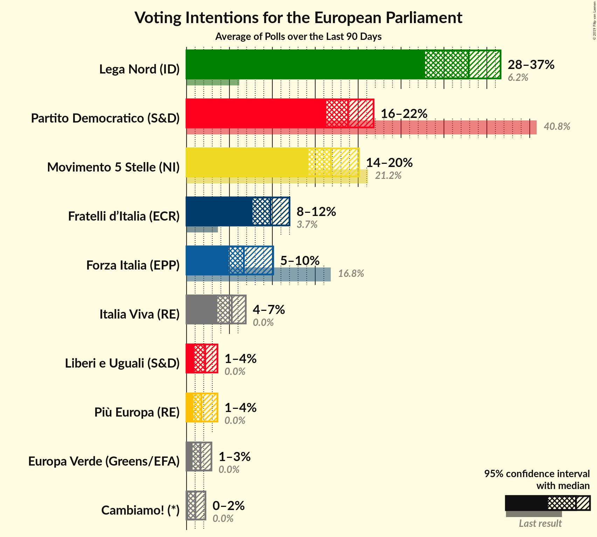

# Poll Average

<a href="#voting-intentions">Voting Intentions</a> | <a href="#seats">Seats</a> | <a href="#coalitions">Coalitions</a> | <a href="#technical-information">Technical Information</a>

## Summary

The table below lists the polls on which the average is based. They are the most recent polls (less than 90 days old) registered and analyzed so far.

| Period     | Polling firm/Commissioner(s) | PD | M5S | FI | LN | FdI | SVP | CPI | CP | I | NcI | +E | LeU | PaP | A | EV | C! | IV |
|:----------:|:----------------------------:|:--:|:--:|:--:|:--:|:--:|:--:|:--:|:--:|:--:|:--:|:--:|:--:|:--:|:--:|:--:|:--:|:--:|
| 26 May 2019 | General Election | 40.8%   31 | 21.2%   17 | 16.8%   13 | 6.2%   5 | 3.7%   0 | 0.5%   1 | 0.0%   0 | 0.0%   0 | 0.0%   0 | 0.0%   0 | 0.0%   0 | 0.0%   0 | 0.0%   0 | 0.0%   0 | 0.0%   0 | 0.0%   0 | 0.0%   0 |
| N/A | Poll Average | 16–22%   12–17 | 14–20%   11–16 | 5–10%   4–8 | 28–37%   21–30 | 8–12%   6–10 | N/A   N/A | N/A   N/A | N/A   N/A | N/A   N/A | N/A   N/A | 1–4%   0 | 1–4%   0 | N/A   N/A | N/A   N/A | 1–3%   0 | 0–2%   0 | 4–7%   0–5 |
| [28–29 November 2019](2019-11-29-Tecnè.html) | Tecnè   Agenzia Dire | 17–22%   12–16 | 14–18%   11–15 | 7–10%   5–8 | 32–38%   26–31 | 8–11%   6–9 | N/A   N/A | N/A   N/A | N/A   N/A | N/A   N/A | N/A   N/A | 1–3%   0 | 1–3%   0 | N/A   N/A | N/A   N/A | 1–2%   0 | N/A   N/A | 3–6%   0–4 |
| [27–28 November 2019](2019-11-28-TermometroPolitico.html) | Termometro Politico   La7 | 17–20%   13–16 | 14–17%   11–14 | 5–7%   4–6 | 33–37%   26–30 | 9–12%   7–9 | N/A   N/A | N/A   N/A | N/A   N/A | N/A   N/A | N/A   N/A | 1–2%   0 | 2–3%   0 | N/A   N/A | N/A   N/A | 1–2%   0 | 0–1%   0 | 4–6%   3–5 |
| [26–27 November 2019](2019-11-27-Ipsos.html) | Ipsos   Corriere della Sera | 16–21%   12–16 | 14–19%   12–16 | 5–8%   4–6 | 29–35%   23–28 | 9–13%   7–10 | N/A   N/A | N/A   N/A | N/A   N/A | N/A   N/A | N/A   N/A | 1–2%   0 | 1–3%   0 | N/A   N/A | N/A   N/A | 2–3%   0 | N/A   N/A | 4–7%   3–6 |
| [1–27 November 2019](2019-11-27-Index.html) | Index   La7 | 17–22%   12–17 | 14–20%   11–16 | 5–9%   4–7 | 30–36%   23–29 | 7–11%   6–9 | N/A   N/A | N/A   N/A | N/A   N/A | N/A   N/A | N/A   N/A | 1–3%   0 | 2–4%   0 | N/A   N/A | N/A   N/A | 1–3%   0 | N/A   N/A | 4–7%   0–5 |
| [27 November 2019](2019-11-27-EMG.html) | EMG   Rai 3 | 18–22%   13–16 | 15–18%   12–14 | 6–9%   5–7 | 30–35%   24–28 | 9–11%   7–9 | N/A   N/A | N/A   N/A | N/A   N/A | N/A   N/A | N/A   N/A | 1–3%   0 | 1–3%   0 | N/A   N/A | N/A   N/A | 1–2%   0 | 1–2%   0 | 4–6%   4–5 |
| [25–26 November 2019](2019-11-26-Ixè.html) | Ixè   Rai 3 | 18–23%   13–17 | 14–19%   11–15 | 6–9%   5–7 | 29–34%   23–28 | 9–13%   7–10 | N/A   N/A | N/A   N/A | N/A   N/A | N/A   N/A | N/A   N/A | 2–4%   0–3 | 1–3%   0 | N/A   N/A | N/A   N/A | 1–2%   0 | N/A   N/A | 3–6%   0–5 |
| [20–25 November 2019](2019-11-25-SWG.html) | SWG   La7 | 16–20%   12–15 | 15–19%   12–15 | 5–7%   4–6 | 31–36%   25–29 | 9–12%   7–10 | N/A   N/A | N/A   N/A | N/A   N/A | N/A   N/A | N/A   N/A | 1–2%   0 | 2–4%   0–3 | N/A   N/A | N/A   N/A | 1–3%   0 | 1–2%   0 | 4–7%   4–6 |
| [21–22 November 2019](2019-11-22-Piepoli.html) | Piepoli   Rai 2 | 16–23%   12–18 | 14–21%   11–17 | 6–10%   5–8 | 28–36%   21–28 | 7–12%   5–9 | N/A   N/A | N/A   N/A | N/A   N/A | N/A   N/A | N/A   N/A | 1–4%   0 | 1–4%   0 | N/A   N/A | N/A   N/A | 1–3%   0 | N/A   N/A | 3–7%   0–6 |
| [21 November 2019](2019-11-21-NotoSondaggi.html) | Noto Sondaggi   Rai 1 | 16–21%   12–15 | 17–22%   13–17 | 5–8%   4–6 | 31–36%   24–29 | 7–11%   6–9 | N/A   N/A | N/A   N/A | N/A   N/A | N/A   N/A | N/A   N/A | 1–2%   0 | 1–2%   0 | N/A   N/A | N/A   N/A | 1–2%   0 | 1–3%   0 | 4–7%   3–6 |
| [18–19 November 2019](2019-11-19-BiDiMedia.html) | BiDiMedia | 17–21%   12–15 | 16–20%   13–16 | 5–7%   4–5 | 30–35%   24–28 | 8–11%   6–8 | N/A   N/A | N/A   N/A | N/A   N/A | N/A   N/A | N/A   N/A | 1–2%   0 | 2–3%   0 | N/A   N/A | N/A   N/A | 1–2%   0 | 1–2%   0 | 4–7%   3–5 |
| [10–12 November 2019](2019-11-12-Demopolis.html) | Demopolis   Rai 3 | 17–21%   11–14 | 15–19%   12–14 | 5–7%   3–5 | 32–36%   24–27 | 8–11%   6–8 | N/A   N/A | N/A   N/A | N/A   N/A | N/A   N/A | N/A   N/A | N/A   N/A | 2–3%   0 | N/A   N/A | N/A   N/A | N/A   N/A | N/A   N/A | 5–7%   4–5 |
| [1–11 November 2019](2019-11-11-Euromedia.html) | Euromedia   Rai 1 | 16–21%   11–15 | 13–18%   10–14 | 5–9%   4–7 | 30–36%   23–28 | 7–11%   6–9 | N/A   N/A | N/A   N/A | N/A   N/A | N/A   N/A | N/A   N/A | 1–2%   0 | 1–3%   0 | N/A   N/A | N/A   N/A | 1–3%   0 | 0–1%   0 | 4–8%   3–6 |
| [4–5 November 2019](2019-11-05-IZI.html) | IZI | 16–21%   11–15 | 16–20%   12–15 | 8–11%   6–9 | 26–31%   19–24 | 9–13%   7–9 | N/A   N/A | N/A   N/A | N/A   N/A | N/A   N/A | N/A   N/A | 2–4%   0 | N/A   N/A | N/A   N/A | N/A   N/A | N/A   N/A | N/A   N/A | 4–6%   0–5 |
| 26 May 2019 | General Election | 40.8%   31 | 21.2%   17 | 16.8%   13 | 6.2%   5 | 3.7%   0 | 0.5%   1 | 0.0%   0 | 0.0%   0 | 0.0%   0 | 0.0%   0 | 0.0%   0 | 0.0%   0 | 0.0%   0 | 0.0%   0 | 0.0%   0 | 0.0%   0 | 0.0%   0 |

Only polls for which at least the sample size has been published are included in the table above.

**Legend:**
+ **Top half of each row:** Voting intentions (95% confidence interval)
+ **Bottom half of each row:** Seat projections for the European Parliament (95% confidence interval)
+ **PD:** Partito Democratico (S&D)
+ **M5S:** Movimento 5 Stelle (NI)
+ **FI:** Forza Italia (EPP)
+ **LN:** Lega Nord (ID)
+ **FdI:** Fratelli d’Italia (ECR)
+ **SVP:** Südtiroler Volkspartei (EPP)
+ **CPI:** CasaPound Italia (NI)
+ **CP:** Civica Popolare (RE)
+ **I:** Insieme (*)
+ **NcI:** Noi con l’Italia (ECR)
+ **+E:** Più Europa (RE)
+ **LeU:** Liberi e Uguali (S&D)
+ **PaP:** Potere al Popolo (GUE/NGL)
+ **A:** Azione (S&D
+ **EV:** Europa Verde (Greens/EFA)
+ **C!:** Cambiamo! (*)
+ **IV:** Italia Viva (RE)
+ **N/A (single party):** Party not included the published results
+ **N/A (entire row):** Calculation for this opinion poll not started yet

## Voting Intentions

### Confidence Intervals

| Party | Last Result | Median | 80% Confidence Interval | 90% Confidence Interval | 95% Confidence Interval | 99% Confidence Interval |
|:-----:|:-----------:|:------:|:-----------------------:|:-----------------------:|:-----------------------:|:-----------------------:|
| <a href="#partito-democratico-(s&d)">Partito Democratico (S&D)</a> | 40.8% | 18.8% | 17.1–20.7% |16.7–21.3% | 16.3–21.8% | 15.5–23.0% |
| <a href="#movimento-5-stelle-(ni)">Movimento 5 Stelle (NI)</a> | 21.2% | 16.8% | 15.0–18.9% |14.6–19.5% | 14.2–20.1% | 13.5–21.3% |
| <a href="#forza-italia-(epp)">Forza Italia (EPP)</a> | 16.8% | 6.7% | 5.4–8.8% |5.1–9.5% | 4.9–10.1% | 4.5–11.0% |
| <a href="#lega-nord-(id)">Lega Nord (ID)</a> | 6.2% | 32.9% | 29.9–35.3% |28.7–36.0% | 27.8–36.6% | 26.4–37.9% |
| <a href="#fratelli-d’italia-(ecr)">Fratelli d’Italia (ECR)</a> | 3.7% | 9.8% | 8.4–11.2% |8.0–11.6% | 7.7–12.0% | 7.0–12.8% |
| <a href="#südtiroler-volkspartei-(epp)">Südtiroler Volkspartei (EPP)</a> | 0.5% | N/A | N/A |N/A | N/A | N/A |
| <a href="#casapound-italia-(ni)">CasaPound Italia (NI)</a> | 0.0% | N/A | N/A |N/A | N/A | N/A |
| <a href="#civica-popolare-(re)">Civica Popolare (RE)</a> | 0.0% | N/A | N/A |N/A | N/A | N/A |
| <a href="#insieme-(*)">Insieme (*)</a> | 0.0% | N/A | N/A |N/A | N/A | N/A |
| <a href="#noi-con-l’italia-(ecr)">Noi con l’Italia (ECR)</a> | 0.0% | N/A | N/A |N/A | N/A | N/A |
| <a href="#più-europa-(re)">Più Europa (RE)</a> | 0.0% | 1.7% | 1.0–2.9% |0.9–3.3% | 0.8–3.6% | 0.6–4.1% |
| <a href="#liberi-e-uguali-(s&d)">Liberi e Uguali (S&D)</a> | 0.0% | 2.2% | 1.4–3.1% |1.1–3.4% | 0.9–3.6% | 0.6–4.1% |
| <a href="#potere-al-popolo-(gue/ngl)">Potere al Popolo (GUE/NGL)</a> | 0.0% | N/A | N/A |N/A | N/A | N/A |
| <a href="#azione-(s&d">Azione (S&D</a> | 0.0% | N/A | N/A |N/A | N/A | N/A |
| <a href="#europa-verde-(greens/efa)">Europa Verde (Greens/EFA)</a> | 0.0% | 1.6% | 1.0–2.4% |0.8–2.7% | 0.7–2.9% | 0.6–3.4% |
| <a href="#cambiamo!-(*)">Cambiamo! (*)</a> | 0.0% | 1.0% | 0.3–1.8% |0.2–2.0% | 0.2–2.2% | 0.1–2.7% |
| <a href="#italia-viva-(re)">Italia Viva (RE)</a> | 0.0% | 5.3% | 4.2–6.3% |3.9–6.6% | 3.6–6.9% | 3.2–7.5% |

