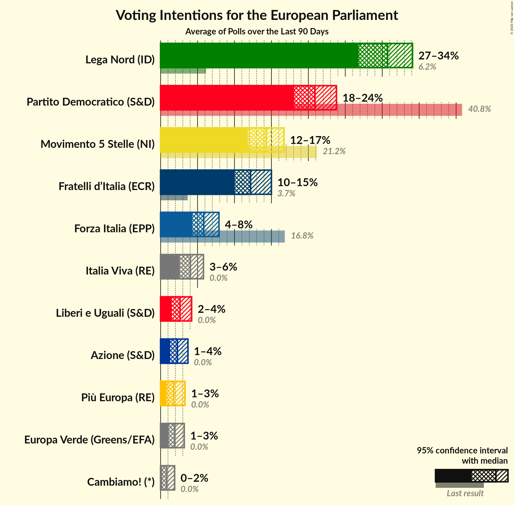
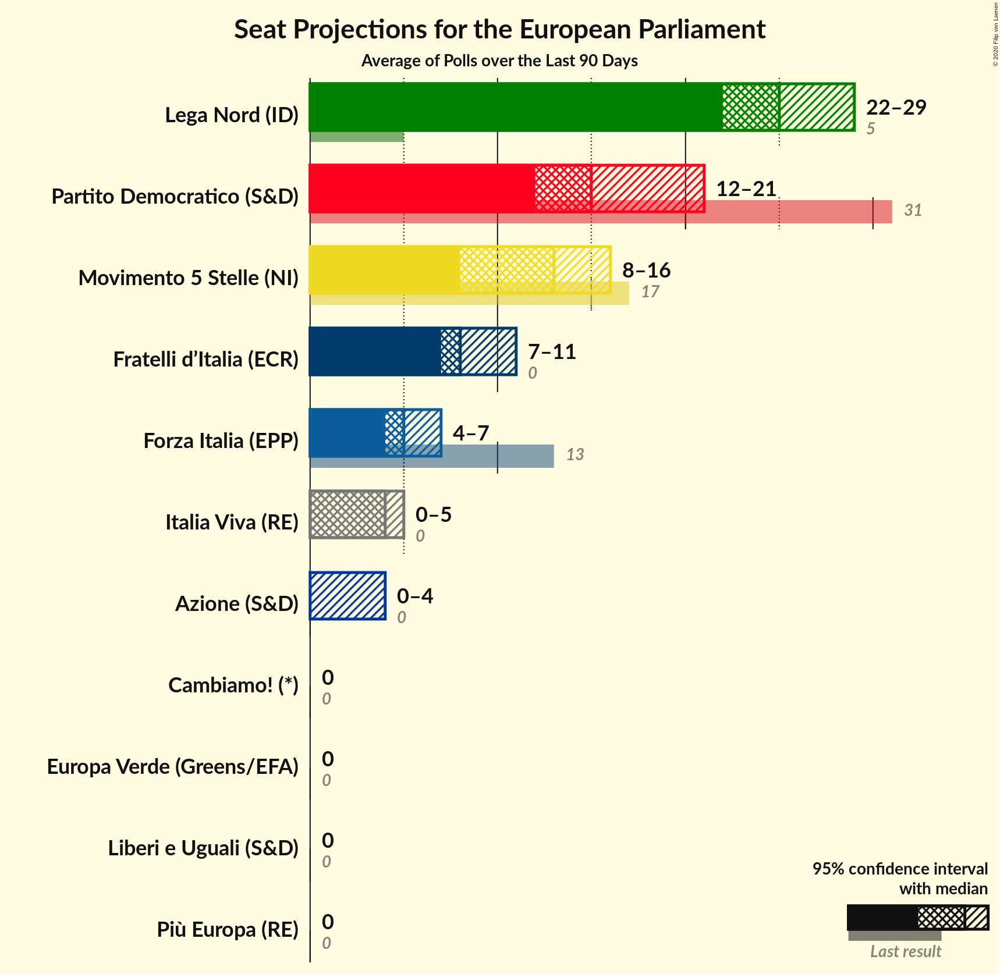

# Poll Average

<a href="#voting-intentions">Voting Intentions</a> | <a href="#seats">Seats</a> | <a href="#coalitions">Coalitions</a> | <a href="#technical-information">Technical Information</a>

## Summary

The table below lists the polls on which the average is based. They are the most recent polls (less than 90 days old) registered and analyzed so far.

| Period     | Polling firm/Commissioner(s) | PD | M5S | FI | LN | FdI | SVP | CPI | CP | I | NcI | +E | LeU | PaP | A | EV | C! | IV |
|:----------:|:----------------------------:|:--:|:--:|:--:|:--:|:--:|:--:|:--:|:--:|:--:|:--:|:--:|:--:|:--:|:--:|:--:|:--:|:--:|
| 26 May 2019 | General Election | 40.8%   31 | 21.2%   17 | 16.8%   13 | 6.2%   5 | 3.7%   0 | 0.5%   1 | 0.0%   0 | 0.0%   0 | 0.0%   0 | 0.0%   0 | 0.0%   0 | 0.0%   0 | 0.0%   0 | 0.0%   0 | 0.0%   0 | 0.0%   0 | 0.0%   0 |
| N/A | Poll Average | 18–24%   14–20 | 12–17%   10–15 | 4–8%   4–7 | 27–34%   22–30 | 10–15%   8–13 | N/A   N/A | N/A   N/A | N/A   N/A | N/A   N/A | N/A   N/A | 1–3%   0 | 1–4%   0–3 | N/A   N/A | 1–4%   0 | 1–3%   0 | 0–2%   0 | 3–6%   0–5 |
| [25–29 February 2020](2020-02-29-Piepoli.html) | Piepoli   Rai 2 | 18–25%   14–20 | 12–18%   9–15 | 5–9%   4–8 | 27–35%   22–29 | 8–14%   7–12 | N/A   N/A | N/A   N/A | N/A   N/A | N/A   N/A | N/A   N/A | 1–4%   0 | 1–4%   0 | N/A   N/A | 1–3%   0 | 1–3%   0 | N/A   N/A | 3–7%   0–6 |
| [27–28 February 2020](2020-02-28-Tecnè.html) | Tecnè   Agenzia Dire | 19–24%   15–20 | 11–16%   10–14 | 6–9%   5–8 | 27–33%   23–29 | 11–15%   10–13 | N/A   N/A | N/A   N/A | N/A   N/A | N/A   N/A | N/A   N/A | 1–3%   0 | 2–4%   0 | N/A   N/A | 1–3%   0 | 1–2%   0 | N/A   N/A | 3–5%   0–4 |
| [26–27 February 2020](2020-02-27-TermometroPolitico.html) | Termometro Politico   La7 | 19–23%   15–19 | 14–17%   12–15 | 4–6%   4–5 | 31–35%   26–30 | 10–13%   9–11 | N/A   N/A | N/A   N/A | N/A   N/A | N/A   N/A | N/A   N/A | 1–2%   0 | 1–3%   0 | N/A   N/A | 2–3%   0 | 1–2%   0 | N/A   N/A | 3–5%   0–4 |
| [27 February 2020](2020-02-27-Ipsos.html) | Ipsos   Corriere della Sera | 17–22%   13–18 | 12–16%   10–14 | 5–8%   4–7 | 29–35%   24–30 | 11–16%   10–13 | N/A   N/A | N/A   N/A | N/A   N/A | N/A   N/A | N/A   N/A | 1–3%   0 | 1–3%   0 | N/A   N/A | 1–3%   0 | 2–4%   0 | N/A   N/A | 3–5%   0–4 |
| [25–26 February 2020](2020-02-26-EMG.html) | EMG | 19–23%   15–19 | 13–16%   11–14 | 5–8%   5–6 | 28–32%   24–27 | 11–14%   9–11 | N/A   N/A | N/A   N/A | N/A   N/A | N/A   N/A | N/A   N/A | 1–3%   0 | 2–4%   0 | N/A   N/A | 2–3%   0 | 1–3%   0 | 0–1%   0 | 4–6%   3–5 |
| [24–25 February 2020](2020-02-25-Ixè.html) | Ixè   Rai 3 | 19–24%   16–21 | 13–18%   12–16 | 5–8%   4–7 | 25–31%   22–28 | 12–16%   10–14 | N/A   N/A | N/A   N/A | N/A   N/A | N/A   N/A | N/A   N/A | 2–4%   0 | 2–4%   0 | N/A   N/A | 1–3%   0 | 1–3%   0 | 0–1%   0 | 2–4%   0–4 |
| [19–24 February 2020](2020-02-24-SWG.html) | SWG   Agenzia Dire | 18–22%   15–19 | 12–15%   10–14 | 4–7%   4–6 | 29–34%   25–32 | 10–13%   9–12 | N/A   N/A | N/A   N/A | N/A   N/A | N/A   N/A | N/A   N/A | 1–3%   0 | 2–5%   0–4 | N/A   N/A | 2–4%   0–4 | 2–3%   0 | 1–2%   0 | 3–5%   0–4 |
| [19 February 2020](2020-02-19-Index.html) | Index   La7 | N/A   N/A | N/A   N/A | N/A   N/A | N/A   N/A | N/A   N/A | N/A   N/A | N/A   N/A | N/A   N/A | N/A   N/A | N/A   N/A | N/A   N/A | N/A   N/A | N/A   N/A | N/A   N/A | N/A   N/A | N/A   N/A | N/A   N/A |
| [17–18 February 2020](2020-02-18-Euromedia.html) | Euromedia   Rai 1 | 18–23%   14–19 | 12–17%   10–14 | 5–8%   4–7 | 28–34%   23–29 | 10–14%   8–12 | N/A   N/A | N/A   N/A | N/A   N/A | N/A   N/A | N/A   N/A | 1–2%   0 | 1–4%   0 | N/A   N/A | 2–4%   0–3 | 1–3%   0 | 0–1%   0 | 4–7%   0–6 |
| [16–18 February 2020](2020-02-18-Demopolis.html) | Demopolis | 19–23%   14–17 | 13–16%   10–13 | 4–6%   3–5 | 29–33%   23–27 | 11–14%   9–11 | N/A   N/A | N/A   N/A | N/A   N/A | N/A   N/A | N/A   N/A | N/A   N/A | 3–4%   0 | N/A   N/A | N/A   N/A | N/A   N/A | N/A   N/A | 3–5%   0–4 |
| [10–13 February 2020](2020-02-13-DemosPi.html) | Demos & Pi   La Repubblica | 18–23%   14–18 | 12–17%   10–14 | 5–8%   4–6 | 27–32%   21–26 | 11–15%   9–12 | N/A   N/A | N/A   N/A | N/A   N/A | N/A   N/A | N/A   N/A | 2–4%   0 | 3–5%   0–4 | N/A   N/A | N/A   N/A | N/A   N/A | N/A   N/A | 3–5%   0–4 |
| [11–13 February 2020](2020-02-13-BiDiMedia.html) | BiDiMedia | 19–23%   15–18 | 13–16%   11–13 | 5–7%   4–6 | 28–32%   23–27 | 10–13%   8–11 | N/A   N/A | N/A   N/A | N/A   N/A | N/A   N/A | N/A   N/A | 1–2%   0 | 2–3%   0 | N/A   N/A | 2–3%   0 | 1–3%   0 | 0–1%   0 | 3–5%   0–4 |
| [30 January–2 February 2020](2020-02-02-ScenariPolitici–Winpoll.html) | Scenari Politici–Winpoll | 20–25%   16–21 | 11–15%   9–13 | 4–6%   0–5 | 29–35%   24–30 | 10–14%   8–12 | N/A   N/A | N/A   N/A | N/A   N/A | N/A   N/A | N/A   N/A | 1–2%   0 | 2–3%   0 | N/A   N/A | 2–4%   0 | 1–3%   0 | N/A   N/A | 3–5%   0–4 |
| 26 May 2019 | General Election | 40.8%   31 | 21.2%   17 | 16.8%   13 | 6.2%   5 | 3.7%   0 | 0.5%   1 | 0.0%   0 | 0.0%   0 | 0.0%   0 | 0.0%   0 | 0.0%   0 | 0.0%   0 | 0.0%   0 | 0.0%   0 | 0.0%   0 | 0.0%   0 | 0.0%   0 |

Only polls for which at least the sample size has been published are included in the table above.

**Legend:**
+ **Top half of each row:** Voting intentions (95% confidence interval)
+ **Bottom half of each row:** Seat projections for the European Parliament (95% confidence interval)
+ **PD:** Partito Democratico (S&D)
+ **M5S:** Movimento 5 Stelle (NI)
+ **FI:** Forza Italia (EPP)
+ **LN:** Lega Nord (ID)
+ **FdI:** Fratelli d’Italia (ECR)
+ **SVP:** Südtiroler Volkspartei (EPP)
+ **CPI:** CasaPound Italia (NI)
+ **CP:** Civica Popolare (RE)
+ **I:** Insieme (*)
+ **NcI:** Noi con l’Italia (ECR)
+ **+E:** Più Europa (RE)
+ **LeU:** Liberi e Uguali (S&D)
+ **PaP:** Potere al Popolo (GUE/NGL)
+ **A:** Azione (S&D)
+ **EV:** Europa Verde (Greens/EFA)
+ **C!:** Cambiamo! (*)
+ **IV:** Italia Viva (RE)
+ **N/A (single party):** Party not included the published results
+ **N/A (entire row):** Calculation for this opinion poll not started yet

## Voting Intentions

### Confidence Intervals

| Party | Last Result | Median | 80% Confidence Interval | 90% Confidence Interval | 95% Confidence Interval | 99% Confidence Interval |
|:-----:|:-----------:|:------:|:-----------------------:|:-----------------------:|:-----------------------:|:-----------------------:|
| <a href="#partito-democratico-(s&d)">Partito Democratico (S&D)</a> | 40.8% | 20.9% | 19.2–22.8% |18.6–23.4% | 18.2–24.0% | 17.3–25.1% |
| <a href="#movimento-5-stelle-(ni)">Movimento 5 Stelle (NI)</a> | 21.2% | 14.3% | 12.6–15.9% |12.1–16.4% | 11.7–16.8% | 11.0–17.8% |
| <a href="#forza-italia-(epp)">Forza Italia (EPP)</a> | 16.8% | 5.9% | 4.8–7.3% |4.5–7.7% | 4.3–8.1% | 3.8–8.9% |
| <a href="#lega-nord-(id)">Lega Nord (ID)</a> | 6.2% | 30.7% | 28.2–33.0% |27.4–33.6% | 26.7–34.1% | 25.5–35.1% |
| <a href="#fratelli-d’italia-(ecr)">Fratelli d’Italia (ECR)</a> | 3.7% | 12.1% | 10.6–14.0% |10.1–14.5% | 9.7–15.0% | 8.9–15.9% |
| <a href="#südtiroler-volkspartei-(epp)">Südtiroler Volkspartei (EPP)</a> | 0.5% | N/A | N/A |N/A | N/A | N/A |
| <a href="#casapound-italia-(ni)">CasaPound Italia (NI)</a> | 0.0% | N/A | N/A |N/A | N/A | N/A |
| <a href="#civica-popolare-(re)">Civica Popolare (RE)</a> | 0.0% | N/A | N/A |N/A | N/A | N/A |
| <a href="#insieme-(*)">Insieme (*)</a> | 0.0% | N/A | N/A |N/A | N/A | N/A |
| <a href="#noi-con-l’italia-(ecr)">Noi con l’Italia (ECR)</a> | 0.0% | N/A | N/A |N/A | N/A | N/A |
| <a href="#più-europa-(re)">Più Europa (RE)</a> | 0.0% | 1.8% | 1.1–2.8% |0.9–3.1% | 0.8–3.3% | 0.6–3.8% |
| <a href="#liberi-e-uguali-(s&d)">Liberi e Uguali (S&D)</a> | 0.0% | 2.6% | 1.8–3.6% |1.6–3.9% | 1.4–4.2% | 1.1–4.7% |
| <a href="#potere-al-popolo-(gue/ngl)">Potere al Popolo (GUE/NGL)</a> | 0.0% | N/A | N/A |N/A | N/A | N/A |
| <a href="#azione-(s&d)">Azione (S&D)</a> | 0.0% | 2.2% | 1.5–3.2% |1.3–3.5% | 1.2–3.7% | 0.9–4.2% |
| <a href="#europa-verde-(greens/efa)">Europa Verde (Greens/EFA)</a> | 0.0% | 1.9% | 1.3–2.7% |1.2–2.9% | 1.0–3.1% | 0.8–3.6% |
| <a href="#cambiamo!-(*)">Cambiamo! (*)</a> | 0.0% | 0.8% | 0.3–1.4% |0.2–1.6% | 0.1–1.8% | 0.1–2.2% |
| <a href="#italia-viva-(re)">Italia Viva (RE)</a> | 0.0% | 4.1% | 3.1–5.3% |2.9–5.7% | 2.6–6.1% | 2.2–6.9% |

### Partito Democratico (S&D)

*For a full overview of the results for this party, see the [Partito Democratico (S&D)](party-partitodemocraticosd.html) page.*

| Voting Intentions | Probability | Accumulated | Special Marks |
|:-----------------:|:-----------:|:-----------:|:-------------:|
| 14.5–15.5% | 0% | 100% |  |
| 15.5–16.5% | 0.1% | 100% |  |
| 16.5–17.5% | 0.7% | 99.9% |  |
| 17.5–18.5% | 4% | 99.2% |  |
| 18.5–19.5% | 11% | 96% |  |
| 19.5–20.5% | 23% | 85% |  |
| 20.5–21.5% | 29% | 61% | Median |
| 21.5–22.5% | 19% | 32% |  |
| 22.5–23.5% | 8% | 13% |  |
| 23.5–24.5% | 3% | 4% |  |
| 24.5–25.5% | 0.9% | 1.1% |  |
| 25.5–26.5% | 0.2% | 0.2% |  |
| 26.5–27.5% | 0% | 0% |  |
| 27.5–28.5% | 0% | 0% |  |
| 28.5–29.5% | 0% | 0% |  |
| 29.5–30.5% | 0% | 0% |  |
| 30.5–31.5% | 0% | 0% |  |
| 31.5–32.5% | 0% | 0% |  |
| 32.5–33.5% | 0% | 0% |  |
| 33.5–34.5% | 0% | 0% |  |
| 34.5–35.5% | 0% | 0% |  |
| 35.5–36.5% | 0% | 0% |  |
| 36.5–37.5% | 0% | 0% |  |
| 37.5–38.5% | 0% | 0% |  |
| 38.5–39.5% | 0% | 0% |  |
| 39.5–40.5% | 0% | 0% |  |
| 40.5–41.5% | 0% | 0% | Last Result |

### Movimento 5 Stelle (NI)

*For a full overview of the results for this party, see the [Movimento 5 Stelle (NI)](party-movimento5stelleni.html) page.*

| Voting Intentions | Probability | Accumulated | Special Marks |
|:-----------------:|:-----------:|:-----------:|:-------------:|
| 8.5–9.5% | 0% | 100% |  |
| 9.5–10.5% | 0.2% | 100% |  |
| 10.5–11.5% | 2% | 99.8% |  |
| 11.5–12.5% | 7% | 98% |  |
| 12.5–13.5% | 19% | 91% |  |
| 13.5–14.5% | 30% | 72% | Median |
| 14.5–15.5% | 26% | 43% |  |
| 15.5–16.5% | 12% | 16% |  |
| 16.5–17.5% | 3% | 4% |  |
| 17.5–18.5% | 0.6% | 0.8% |  |
| 18.5–19.5% | 0.1% | 0.1% |  |
| 19.5–20.5% | 0% | 0% |  |
| 20.5–21.5% | 0% | 0% | Last Result |

### Forza Italia (EPP)

*For a full overview of the results for this party, see the [Forza Italia (EPP)](party-forzaitaliaepp.html) page.*

| Voting Intentions | Probability | Accumulated | Special Marks |
|:-----------------:|:-----------:|:-----------:|:-------------:|
| 1.5–2.5% | 0% | 100% |  |
| 2.5–3.5% | 0.2% | 100% |  |
| 3.5–4.5% | 6% | 99.8% |  |
| 4.5–5.5% | 31% | 94% |  |
| 5.5–6.5% | 36% | 63% | Median |
| 6.5–7.5% | 20% | 27% |  |
| 7.5–8.5% | 6% | 7% |  |
| 8.5–9.5% | 1.0% | 1.1% |  |
| 9.5–10.5% | 0.1% | 0.1% |  |
| 10.5–11.5% | 0% | 0% |  |
| 11.5–12.5% | 0% | 0% |  |
| 12.5–13.5% | 0% | 0% |  |
| 13.5–14.5% | 0% | 0% |  |
| 14.5–15.5% | 0% | 0% |  |
| 15.5–16.5% | 0% | 0% |  |
| 16.5–17.5% | 0% | 0% | Last Result |

### Lega Nord (ID)

*For a full overview of the results for this party, see the [Lega Nord (ID)](party-leganordid.html) page.*

| Voting Intentions | Probability | Accumulated | Special Marks |
|:-----------------:|:-----------:|:-----------:|:-------------:|
| 5.5–6.5% | 0% | 100% | Last Result |
| 6.5–7.5% | 0% | 100% |  |
| 7.5–8.5% | 0% | 100% |  |
| 8.5–9.5% | 0% | 100% |  |
| 9.5–10.5% | 0% | 100% |  |
| 10.5–11.5% | 0% | 100% |  |
| 11.5–12.5% | 0% | 100% |  |
| 12.5–13.5% | 0% | 100% |  |
| 13.5–14.5% | 0% | 100% |  |
| 14.5–15.5% | 0% | 100% |  |
| 15.5–16.5% | 0% | 100% |  |
| 16.5–17.5% | 0% | 100% |  |
| 17.5–18.5% | 0% | 100% |  |
| 18.5–19.5% | 0% | 100% |  |
| 19.5–20.5% | 0% | 100% |  |
| 20.5–21.5% | 0% | 100% |  |
| 21.5–22.5% | 0% | 100% |  |
| 22.5–23.5% | 0% | 100% |  |
| 23.5–24.5% | 0.1% | 100% |  |
| 24.5–25.5% | 0.5% | 99.9% |  |
| 25.5–26.5% | 2% | 99.4% |  |
| 26.5–27.5% | 4% | 98% |  |
| 27.5–28.5% | 8% | 94% |  |
| 28.5–29.5% | 14% | 87% |  |
| 29.5–30.5% | 20% | 73% |  |
| 30.5–31.5% | 21% | 53% | Median |
| 31.5–32.5% | 17% | 32% |  |
| 32.5–33.5% | 10% | 15% |  |
| 33.5–34.5% | 4% | 5% |  |
| 34.5–35.5% | 1.0% | 1.2% |  |
| 35.5–36.5% | 0.2% | 0.2% |  |
| 36.5–37.5% | 0% | 0% |  |

### Fratelli d’Italia (ECR)

*For a full overview of the results for this party, see the [Fratelli d’Italia (ECR)](party-fratellid’italiaecr.html) page.*

| Voting Intentions | Probability | Accumulated | Special Marks |
|:-----------------:|:-----------:|:-----------:|:-------------:|
| 3.5–4.5% | 0% | 100% | Last Result |
| 4.5–5.5% | 0% | 100% |  |
| 5.5–6.5% | 0% | 100% |  |
| 6.5–7.5% | 0% | 100% |  |
| 7.5–8.5% | 0.2% | 100% |  |
| 8.5–9.5% | 1.5% | 99.7% |  |
| 9.5–10.5% | 8% | 98% |  |
| 10.5–11.5% | 23% | 90% |  |
| 11.5–12.5% | 29% | 68% | Median |
| 12.5–13.5% | 22% | 39% |  |
| 13.5–14.5% | 12% | 16% |  |
| 14.5–15.5% | 4% | 5% |  |
| 15.5–16.5% | 0.8% | 0.9% |  |
| 16.5–17.5% | 0.1% | 0.1% |  |
| 17.5–18.5% | 0% | 0% |  |

### Liberi e Uguali (S&D)

*For a full overview of the results for this party, see the [Liberi e Uguali (S&D)](party-liberieugualisd.html) page.*

| Voting Intentions | Probability | Accumulated | Special Marks |
|:-----------------:|:-----------:|:-----------:|:-------------:|
| 0.0–0.5% | 0% | 100% | Last Result |
| 0.5–1.5% | 4% | 100% |  |
| 1.5–2.5% | 44% | 96% |  |
| 2.5–3.5% | 40% | 52% | Median |
| 3.5–4.5% | 11% | 12% |  |
| 4.5–5.5% | 0.9% | 0.9% |  |
| 5.5–6.5% | 0% | 0% |  |

### Più Europa (RE)

*For a full overview of the results for this party, see the [Più Europa (RE)](party-piùeuropare.html) page.*

| Voting Intentions | Probability | Accumulated | Special Marks |
|:-----------------:|:-----------:|:-----------:|:-------------:|
| 0.0–0.5% | 0.4% | 100% | Last Result |
| 0.5–1.5% | 36% | 99.6% |  |
| 1.5–2.5% | 47% | 64% | Median |
| 2.5–3.5% | 15% | 16% |  |
| 3.5–4.5% | 1.2% | 1.2% |  |
| 4.5–5.5% | 0% | 0% |  |

### Europa Verde (Greens/EFA)

*For a full overview of the results for this party, see the [Europa Verde (Greens/EFA)](party-europaverdegreensefa.html) page.*

| Voting Intentions | Probability | Accumulated | Special Marks |
|:-----------------:|:-----------:|:-----------:|:-------------:|
| 0.0–0.5% | 0% | 100% | Last Result |
| 0.5–1.5% | 25% | 100% |  |
| 1.5–2.5% | 61% | 75% | Median |
| 2.5–3.5% | 13% | 14% |  |
| 3.5–4.5% | 0.6% | 0.6% |  |
| 4.5–5.5% | 0% | 0% |  |

### Azione (S&D)

*For a full overview of the results for this party, see the [Azione (S&D)](party-azionesd.html) page.*

| Voting Intentions | Probability | Accumulated | Special Marks |
|:-----------------:|:-----------:|:-----------:|:-------------:|
| 0.0–0.5% | 0% | 100% | Last Result |
| 0.5–1.5% | 12% | 100% |  |
| 1.5–2.5% | 57% | 88% | Median |
| 2.5–3.5% | 27% | 31% |  |
| 3.5–4.5% | 4% | 4% |  |
| 4.5–5.5% | 0.1% | 0.1% |  |
| 5.5–6.5% | 0% | 0% |  |

### Italia Viva (RE)

*For a full overview of the results for this party, see the [Italia Viva (RE)](party-italiavivare.html) page.*

| Voting Intentions | Probability | Accumulated | Special Marks |
|:-----------------:|:-----------:|:-----------:|:-------------:|
| 0.0–0.5% | 0% | 100% | Last Result |
| 0.5–1.5% | 0% | 100% |  |
| 1.5–2.5% | 2% | 100% |  |
| 2.5–3.5% | 22% | 98% |  |
| 3.5–4.5% | 48% | 76% | Median |
| 4.5–5.5% | 22% | 28% |  |
| 5.5–6.5% | 6% | 7% |  |
| 6.5–7.5% | 0.9% | 1.0% |  |
| 7.5–8.5% | 0.1% | 0.1% |  |
| 8.5–9.5% | 0% | 0% |  |

### Cambiamo! (*)

*For a full overview of the results for this party, see the [Cambiamo! (*)](party-cambiamo.html) page.*

| Voting Intentions | Probability | Accumulated | Special Marks |
|:-----------------:|:-----------:|:-----------:|:-------------:|
| 0.0–0.5% | 27% | 100% | Last Result |
| 0.5–1.5% | 66% | 73% | Median |
| 1.5–2.5% | 7% | 7% |  |
| 2.5–3.5% | 0.1% | 0.1% |  |
| 3.5–4.5% | 0% | 0% |  |

## Seats

### Confidence Intervals

| Party | Last Result | Median | 80% Confidence Interval | 90% Confidence Interval | 95% Confidence Interval | 99% Confidence Interval |
|:-----:|:-----------:|:------:|:-----------------------:|:-----------------------:|:-----------------------:|:-----------------------:|
| <a href="#partito-democratico-(s&d)">Partito Democratico (S&D)</a> | 31 | 17 | 15–19 |15–19 | 14–20 | 13–21 |
| <a href="#movimento-5-stelle-(ni)">Movimento 5 Stelle (NI)</a> | 17 | 12 | 11–14 |10–14 | 10–15 | 9–16 |
| <a href="#forza-italia-(epp)">Forza Italia (EPP)</a> | 13 | 5 | 4–6 |4–7 | 4–7 | 0–8 |
| <a href="#lega-nord-(id)">Lega Nord (ID)</a> | 5 | 26 | 23–29 |23–29 | 22–30 | 21–32 |
| <a href="#fratelli-d’italia-(ecr)">Fratelli d’Italia (ECR)</a> | 0 | 10 | 9–12 |8–13 | 8–13 | 7–14 |
| <a href="#südtiroler-volkspartei-(epp)">Südtiroler Volkspartei (EPP)</a> | 1 | N/A | N/A |N/A | N/A | N/A |
| <a href="#casapound-italia-(ni)">CasaPound Italia (NI)</a> | 0 | N/A | N/A |N/A | N/A | N/A |
| <a href="#civica-popolare-(re)">Civica Popolare (RE)</a> | 0 | N/A | N/A |N/A | N/A | N/A |
| <a href="#insieme-(*)">Insieme (*)</a> | 0 | N/A | N/A |N/A | N/A | N/A |
| <a href="#noi-con-l’italia-(ecr)">Noi con l’Italia (ECR)</a> | 0 | N/A | N/A |N/A | N/A | N/A |
| <a href="#più-europa-(re)">Più Europa (RE)</a> | 0 | 0 | 0 |0 | 0 | 0 |
| <a href="#liberi-e-uguali-(s&d)">Liberi e Uguali (S&D)</a> | 0 | 0 | 0 |0 | 0–3 | 0–4 |
| <a href="#potere-al-popolo-(gue/ngl)">Potere al Popolo (GUE/NGL)</a> | 0 | N/A | N/A |N/A | N/A | N/A |
| <a href="#azione-(s&d)">Azione (S&D)</a> | 0 | 0 | 0 |0 | 0 | 0–4 |
| <a href="#europa-verde-(greens/efa)">Europa Verde (Greens/EFA)</a> | 0 | 0 | 0 |0 | 0 | 0 |
| <a href="#cambiamo!-(*)">Cambiamo! (*)</a> | 0 | 0 | 0 |0 | 0 | 0 |
| <a href="#italia-viva-(re)">Italia Viva (RE)</a> | 0 | 3 | 0–4 |0–5 | 0–5 | 0–6 |

