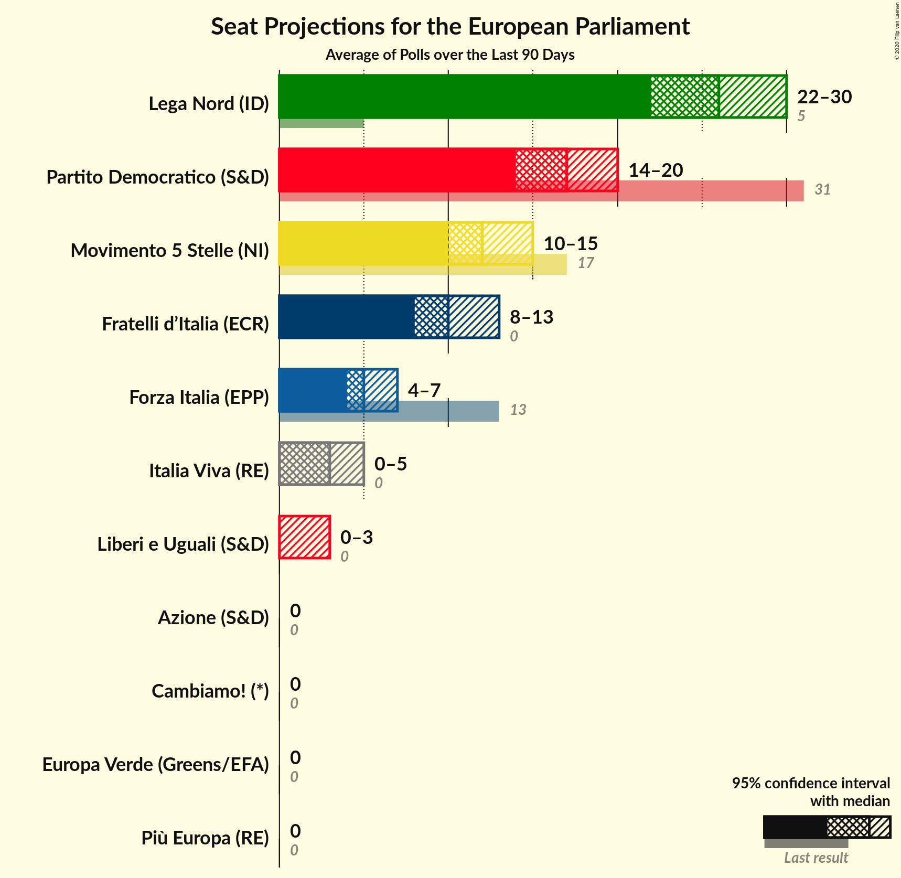
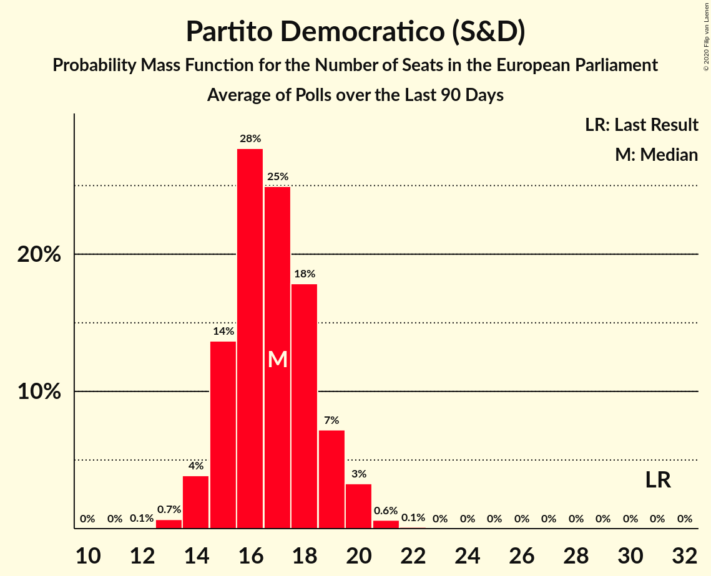
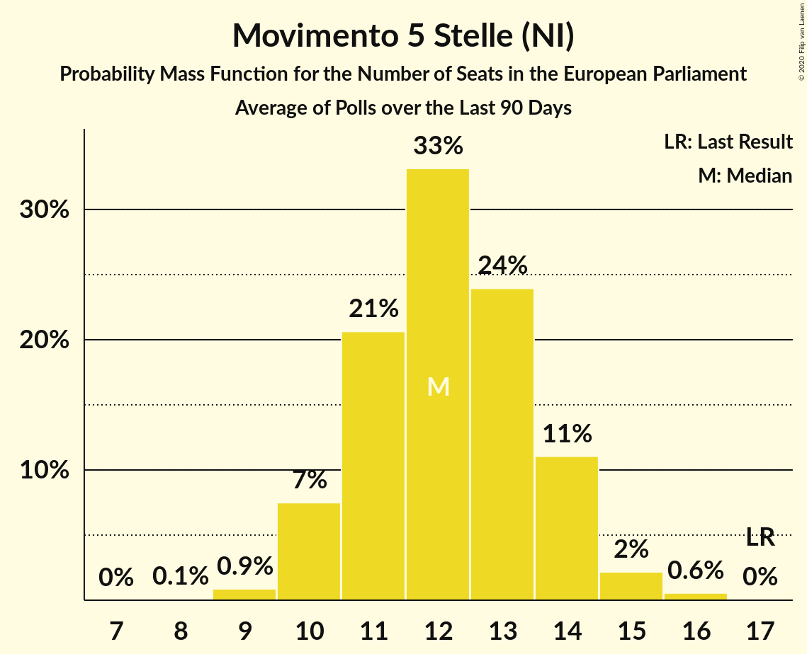
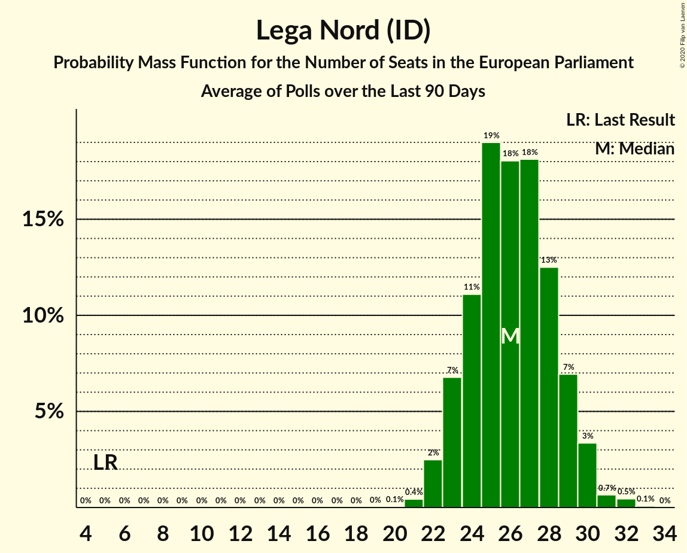

# Poll Average

<a href="#voting-intentions">Voting Intentions</a> | <a href="#seats">Seats</a> | <a href="#coalitions">Coalitions</a> | <a href="#technical-information">Technical Information</a>

## Summary

The table below lists the polls on which the average is based. They are the most recent polls (less than 90 days old) registered and analyzed so far.

| Period     | Polling firm/Commissioner(s) | PD | M5S | FI | LN | FdI | SVP | CPI | CP | I | NcI | +E | LeU | PaP | A | EV | C! | IV |
|:----------:|:----------------------------:|:--:|:--:|:--:|:--:|:--:|:--:|:--:|:--:|:--:|:--:|:--:|:--:|:--:|:--:|:--:|:--:|:--:|
| 26 May 2019 | General Election | 40.8%   31 | 21.2%   17 | 16.8%   13 | 6.2%   5 | 3.7%   0 | 0.5%   1 | 0.0%   0 | 0.0%   0 | 0.0%   0 | 0.0%   0 | 0.0%   0 | 0.0%   0 | 0.0%   0 | 0.0%   0 | 0.0%   0 | 0.0%   0 | 0.0%   0 |
| N/A | Poll Average | 18–26%   14–21 | 10–17%   9–15 | 4–8%   4–7 | 27–34%   22–30 | 9–14%   8–12 | N/A   N/A | N/A   N/A | N/A   N/A | N/A   N/A | N/A   N/A | 1–4%   0 | 2–4%   0–3 | N/A   N/A | 1–4%   0 | 1–3%   0 | 0–2%   0 | 3–6%   0–5 |
| [16–17 February 2020](2020-02-17-Tecnè.html) | Tecnè   Quarta Repubblica | 18–23%   15–19 | 11–16%   10–14 | 6–9%   5–8 | 28–33%   24–29 | 11–15%   9–12 | N/A   N/A | N/A   N/A | N/A   N/A | N/A   N/A | N/A   N/A | 1–3%   0 | 2–4%   0 | N/A   N/A | 2–4%   0 | 1–3%   0 | N/A   N/A | 3–5%   0–5 |
| [12–17 February 2020](2020-02-17-SWG.html) | SWG   La7 | 18–23%   15–19 | 11–15%   10–13 | 4–6%   4–6 | 30–35%   27–32 | 10–13%   9–12 | N/A   N/A | N/A   N/A | N/A   N/A | N/A   N/A | N/A   N/A | 1–3%   0 | 2–4%   0 | N/A   N/A | 2–4%   0–3 | 2–3%   0 | 1–2%   0 | 3–5%   0–5 |
| [12–13 February 2020](2020-02-13-TermometroPolitico.html) | Termometro Politico   La7 | 19–21%   15–17 | 14–16%   12–14 | 4–6%   4–5 | 31–34%   26–29 | 10–12%   9–10 | N/A   N/A | N/A   N/A | N/A   N/A | N/A   N/A | N/A   N/A | 1–2%   0 | 3–4%   0 | N/A   N/A | 2%   0 | 1–2%   0 | N/A   N/A | 4–6%   4–5 |
| [10–13 February 2020](2020-02-13-DemosPi.html) | Demos & Pi   La Repubblica | 18–23%   14–18 | 12–17%   10–14 | 5–8%   4–6 | 27–32%   21–26 | 11–15%   9–12 | N/A   N/A | N/A   N/A | N/A   N/A | N/A   N/A | N/A   N/A | 2–4%   0 | 3–5%   0–4 | N/A   N/A | N/A   N/A | N/A   N/A | N/A   N/A | 3–5%   0–4 |
| [13 February 2020](2020-02-13-Demopolis.html) | Demopolis | 18–23%   13–17 | 13–17%   10–14 | 5–8%   4–6 | 27–33%   21–26 | 9–13%   7–10 | N/A   N/A | N/A   N/A | N/A   N/A | N/A   N/A | N/A   N/A | N/A   N/A | 2–4%   0–3 | N/A   N/A | N/A   N/A | N/A   N/A | N/A   N/A | 3–6%   0–5 |
| [11–13 February 2020](2020-02-13-BiDiMedia.html) | BiDiMedia | 19–23%   15–18 | 13–16%   11–13 | 5–7%   4–6 | 28–32%   23–27 | 10–13%   8–11 | N/A   N/A | N/A   N/A | N/A   N/A | N/A   N/A | N/A   N/A | 1–2%   0 | 2–3%   0 | N/A   N/A | 2–3%   0 | 1–3%   0 | 0–1%   0 | 3–5%   0–4 |
| [12 February 2020](2020-02-12-Index.html) | Index   La7 | 17–23%   14–19 | 13–18%   11–15 | 4–8%   4–7 | 28–34%   25–30 | 9–14%   8–12 | N/A   N/A | N/A   N/A | N/A   N/A | N/A   N/A | N/A   N/A | 1–3%   0 | 2–5%   0–4 | N/A   N/A | 1–3%   0 | 1–3%   0 | 1–2%   0 | 3–6%   0–5 |
| [11–12 February 2020](2020-02-12-EMG.html) | EMG   Rai 3 | 19–24%   16–20 | 13–16%   10–14 | 5–8%   4–7 | 28–32%   24–28 | 10–13%   9–12 | N/A   N/A | N/A   N/A | N/A   N/A | N/A   N/A | N/A   N/A | 1–3%   0 | 2–4%   0 | N/A   N/A | 2–3%   0 | 1–3%   0 | 1–2%   0 | 4–6%   0–6 |
| [11 February 2020](2020-02-11-Ixè.html) | Ixè   Rai 3 | 18–23%   15–20 | 13–17%   12–16 | 5–9%   5–8 | 26–31%   23–29 | 11–15%   9–13 | N/A   N/A | N/A   N/A | N/A   N/A | N/A   N/A | N/A   N/A | 2–4%   0 | 2–4%   0–3 | N/A   N/A | 1–2%   0 | 1–3%   0 | 0–2%   0 | 2–4%   0–4 |
| [30 January–2 February 2020](2020-02-02-ScenariPolitici–Winpoll.html) | Scenari Politici–Winpoll | 20–25%   16–21 | 11–15%   9–13 | 4–6%   0–5 | 29–35%   24–30 | 10–14%   8–12 | N/A   N/A | N/A   N/A | N/A   N/A | N/A   N/A | N/A   N/A | 1–2%   0 | 2–3%   0 | N/A   N/A | 2–4%   0 | 1–3%   0 | N/A   N/A | 3–5%   0–4 |
| [29–31 January 2020](2020-01-31-Piepoli.html) | Piepoli   Rai 2 | 17–24%   13–18 | 13–19%   10–16 | 5–9%   4–8 | 27–35%   22–29 | 8–13%   6–11 | N/A   N/A | N/A   N/A | N/A   N/A | N/A   N/A | N/A   N/A | 2–4%   0–4 | 1–4%   0 | N/A   N/A | 0–2%   0 | 1–3%   0 | N/A   N/A | 3–7%   0–5 |
| [28–30 January 2020](2020-01-30-Ipsos.html) | Ipsos | 18–23%   14–19 | 12–16%   10–14 | 5–8%   4–7 | 29–35%   24–30 | 10–14%   9–13 | N/A   N/A | N/A   N/A | N/A   N/A | N/A   N/A | N/A   N/A | 1–2%   0 | 2–4%   0 | N/A   N/A | 2–3%   0 | 1–2%   0 | N/A   N/A | 3–6%   0–5 |
| [28 January 2020](2020-01-28-MGResearch.html) | MG Research   Affaritaliani.it | 22–28%   18–23 | 9–13%   7–11 | 4–7%   3–6 | 27–34%   23–29 | 9–13%   8–11 | N/A   N/A | N/A   N/A | N/A   N/A | N/A   N/A | N/A   N/A | 2–4%   0–4 | 2–4%   0–3 | N/A   N/A | 2–5%   0–4 | N/A   N/A | N/A   N/A | 3–6%   0–5 |
| 26 May 2019 | General Election | 40.8%   31 | 21.2%   17 | 16.8%   13 | 6.2%   5 | 3.7%   0 | 0.5%   1 | 0.0%   0 | 0.0%   0 | 0.0%   0 | 0.0%   0 | 0.0%   0 | 0.0%   0 | 0.0%   0 | 0.0%   0 | 0.0%   0 | 0.0%   0 | 0.0%   0 |

Only polls for which at least the sample size has been published are included in the table above.

**Legend:**
+ **Top half of each row:** Voting intentions (95% confidence interval)
+ **Bottom half of each row:** Seat projections for the European Parliament (95% confidence interval)
+ **PD:** Partito Democratico (S&D)
+ **M5S:** Movimento 5 Stelle (NI)
+ **FI:** Forza Italia (EPP)
+ **LN:** Lega Nord (ID)
+ **FdI:** Fratelli d’Italia (ECR)
+ **SVP:** Südtiroler Volkspartei (EPP)
+ **CPI:** CasaPound Italia (NI)
+ **CP:** Civica Popolare (RE)
+ **I:** Insieme (*)
+ **NcI:** Noi con l’Italia (ECR)
+ **+E:** Più Europa (RE)
+ **LeU:** Liberi e Uguali (S&D)
+ **PaP:** Potere al Popolo (GUE/NGL)
+ **A:** Azione (S&D)
+ **EV:** Europa Verde (Greens/EFA)
+ **C!:** Cambiamo! (*)
+ **IV:** Italia Viva (RE)
+ **N/A (single party):** Party not included the published results
+ **N/A (entire row):** Calculation for this opinion poll not started yet

## Voting Intentions

### Confidence Intervals

| Party | Last Result | Median | 80% Confidence Interval | 90% Confidence Interval | 95% Confidence Interval | 99% Confidence Interval |
|:-----:|:-----------:|:------:|:-----------------------:|:-----------------------:|:-----------------------:|:-----------------------:|
| <a href="#partito-democratico-(s&d)">Partito Democratico (S&D)</a> | 40.8% | 20.8% | 19.0–23.4% |18.5–24.8% | 18.0–25.8% | 17.0–27.4% |
| <a href="#movimento-5-stelle-(ni)">Movimento 5 Stelle (NI)</a> | 21.2% | 14.2% | 11.9–16.0% |10.9–16.6% | 10.1–17.2% | 9.0–18.4% |
| <a href="#forza-italia-(epp)">Forza Italia (EPP)</a> | 16.8% | 6.0% | 4.8–7.4% |4.5–7.9% | 4.3–8.2% | 3.8–9.0% |
| <a href="#lega-nord-(id)">Lega Nord (ID)</a> | 6.2% | 30.7% | 28.3–33.2% |27.6–33.7% | 27.0–34.2% | 25.9–35.3% |
| <a href="#fratelli-d’italia-(ecr)">Fratelli d’Italia (ECR)</a> | 3.7% | 11.6% | 10.1–13.3% |9.6–13.9% | 9.2–14.3% | 8.2–15.2% |
| <a href="#südtiroler-volkspartei-(epp)">Südtiroler Volkspartei (EPP)</a> | 0.5% | N/A | N/A |N/A | N/A | N/A |
| <a href="#casapound-italia-(ni)">CasaPound Italia (NI)</a> | 0.0% | N/A | N/A |N/A | N/A | N/A |
| <a href="#civica-popolare-(re)">Civica Popolare (RE)</a> | 0.0% | N/A | N/A |N/A | N/A | N/A |
| <a href="#insieme-(*)">Insieme (*)</a> | 0.0% | N/A | N/A |N/A | N/A | N/A |
| <a href="#noi-con-l’italia-(ecr)">Noi con l’Italia (ECR)</a> | 0.0% | N/A | N/A |N/A | N/A | N/A |
| <a href="#più-europa-(re)">Più Europa (RE)</a> | 0.0% | 1.9% | 1.1–3.2% |1.0–3.5% | 0.8–3.8% | 0.6–4.4% |
| <a href="#liberi-e-uguali-(s&d)">Liberi e Uguali (S&D)</a> | 0.0% | 2.8% | 2.1–3.7% |1.9–4.0% | 1.7–4.3% | 1.3–4.8% |
| <a href="#potere-al-popolo-(gue/ngl)">Potere al Popolo (GUE/NGL)</a> | 0.0% | N/A | N/A |N/A | N/A | N/A |
| <a href="#azione-(s&d)">Azione (S&D)</a> | 0.0% | 2.3% | 1.3–3.4% |1.0–3.7% | 0.8–4.1% | 0.5–4.7% |
| <a href="#europa-verde-(greens/efa)">Europa Verde (Greens/EFA)</a> | 0.0% | 1.9% | 1.2–2.6% |1.1–2.8% | 1.0–3.0% | 0.8–3.4% |
| <a href="#cambiamo!-(*)">Cambiamo! (*)</a> | 0.0% | 1.0% | 0.6–1.5% |0.5–1.7% | 0.5–1.8% | 0.4–2.1% |
| <a href="#italia-viva-(re)">Italia Viva (RE)</a> | 0.0% | 4.3% | 3.3–5.3% |3.1–5.6% | 2.8–5.9% | 2.4–6.5% |

### Partito Democratico (S&D)

*For a full overview of the results for this party, see the [Partito Democratico (S&D)](party-partitodemocraticosd.html) page.*

| Voting Intentions | Probability | Accumulated | Special Marks |
|:-----------------:|:-----------:|:-----------:|:-------------:|
| 14.5–15.5% | 0% | 100% |  |
| 15.5–16.5% | 0.2% | 100% |  |
| 16.5–17.5% | 1.0% | 99.8% |  |
| 17.5–18.5% | 4% | 98.8% |  |
| 18.5–19.5% | 14% | 95% |  |
| 19.5–20.5% | 25% | 80% |  |
| 20.5–21.5% | 24% | 55% | Median |
| 21.5–22.5% | 15% | 32% |  |
| 22.5–23.5% | 7% | 17% |  |
| 23.5–24.5% | 4% | 9% |  |
| 24.5–25.5% | 3% | 6% |  |
| 25.5–26.5% | 2% | 3% |  |
| 26.5–27.5% | 0.9% | 1.3% |  |
| 27.5–28.5% | 0.3% | 0.4% |  |
| 28.5–29.5% | 0.1% | 0.1% |  |
| 29.5–30.5% | 0% | 0% |  |
| 30.5–31.5% | 0% | 0% |  |
| 31.5–32.5% | 0% | 0% |  |
| 32.5–33.5% | 0% | 0% |  |
| 33.5–34.5% | 0% | 0% |  |
| 34.5–35.5% | 0% | 0% |  |
| 35.5–36.5% | 0% | 0% |  |
| 36.5–37.5% | 0% | 0% |  |
| 37.5–38.5% | 0% | 0% |  |
| 38.5–39.5% | 0% | 0% |  |
| 39.5–40.5% | 0% | 0% |  |
| 40.5–41.5% | 0% | 0% | Last Result |

### Movimento 5 Stelle (NI)

*For a full overview of the results for this party, see the [Movimento 5 Stelle (NI)](party-movimento5stelleni.html) page.*

| Voting Intentions | Probability | Accumulated | Special Marks |
|:-----------------:|:-----------:|:-----------:|:-------------:|
| 6.5–7.5% | 0% | 100% |  |
| 7.5–8.5% | 0.2% | 100% |  |
| 8.5–9.5% | 1.1% | 99.8% |  |
| 9.5–10.5% | 3% | 98.8% |  |
| 10.5–11.5% | 4% | 96% |  |
| 11.5–12.5% | 8% | 92% |  |
| 12.5–13.5% | 17% | 84% |  |
| 13.5–14.5% | 26% | 67% | Median |
| 14.5–15.5% | 24% | 41% |  |
| 15.5–16.5% | 11% | 16% |  |
| 16.5–17.5% | 4% | 5% |  |
| 17.5–18.5% | 1.1% | 2% |  |
| 18.5–19.5% | 0.3% | 0.4% |  |
| 19.5–20.5% | 0.1% | 0.1% |  |
| 20.5–21.5% | 0% | 0% | Last Result |

### Forza Italia (EPP)

*For a full overview of the results for this party, see the [Forza Italia (EPP)](party-forzaitaliaepp.html) page.*

| Voting Intentions | Probability | Accumulated | Special Marks |
|:-----------------:|:-----------:|:-----------:|:-------------:|
| 1.5–2.5% | 0% | 100% |  |
| 2.5–3.5% | 0.2% | 100% |  |
| 3.5–4.5% | 5% | 99.8% |  |
| 4.5–5.5% | 29% | 94% |  |
| 5.5–6.5% | 36% | 65% | Median |
| 6.5–7.5% | 22% | 30% |  |
| 7.5–8.5% | 7% | 8% |  |
| 8.5–9.5% | 1.2% | 1.3% |  |
| 9.5–10.5% | 0.1% | 0.1% |  |
| 10.5–11.5% | 0% | 0% |  |
| 11.5–12.5% | 0% | 0% |  |
| 12.5–13.5% | 0% | 0% |  |
| 13.5–14.5% | 0% | 0% |  |
| 14.5–15.5% | 0% | 0% |  |
| 15.5–16.5% | 0% | 0% |  |
| 16.5–17.5% | 0% | 0% | Last Result |

### Lega Nord (ID)

*For a full overview of the results for this party, see the [Lega Nord (ID)](party-leganordid.html) page.*

| Voting Intentions | Probability | Accumulated | Special Marks |
|:-----------------:|:-----------:|:-----------:|:-------------:|
| 5.5–6.5% | 0% | 100% | Last Result |
| 6.5–7.5% | 0% | 100% |  |
| 7.5–8.5% | 0% | 100% |  |
| 8.5–9.5% | 0% | 100% |  |
| 9.5–10.5% | 0% | 100% |  |
| 10.5–11.5% | 0% | 100% |  |
| 11.5–12.5% | 0% | 100% |  |
| 12.5–13.5% | 0% | 100% |  |
| 13.5–14.5% | 0% | 100% |  |
| 14.5–15.5% | 0% | 100% |  |
| 15.5–16.5% | 0% | 100% |  |
| 16.5–17.5% | 0% | 100% |  |
| 17.5–18.5% | 0% | 100% |  |
| 18.5–19.5% | 0% | 100% |  |
| 19.5–20.5% | 0% | 100% |  |
| 20.5–21.5% | 0% | 100% |  |
| 21.5–22.5% | 0% | 100% |  |
| 22.5–23.5% | 0% | 100% |  |
| 23.5–24.5% | 0% | 100% |  |
| 24.5–25.5% | 0.2% | 100% |  |
| 25.5–26.5% | 1.1% | 99.7% |  |
| 26.5–27.5% | 3% | 98.7% |  |
| 27.5–28.5% | 8% | 95% |  |
| 28.5–29.5% | 15% | 87% |  |
| 29.5–30.5% | 19% | 72% |  |
| 30.5–31.5% | 18% | 53% | Median |
| 31.5–32.5% | 16% | 34% |  |
| 32.5–33.5% | 12% | 18% |  |
| 33.5–34.5% | 5% | 6% |  |
| 34.5–35.5% | 1.3% | 2% |  |
| 35.5–36.5% | 0.3% | 0.3% |  |
| 36.5–37.5% | 0% | 0.1% |  |
| 37.5–38.5% | 0% | 0% |  |

### Fratelli d’Italia (ECR)

*For a full overview of the results for this party, see the [Fratelli d’Italia (ECR)](party-fratellid’italiaecr.html) page.*

| Voting Intentions | Probability | Accumulated | Special Marks |
|:-----------------:|:-----------:|:-----------:|:-------------:|
| 3.5–4.5% | 0% | 100% | Last Result |
| 4.5–5.5% | 0% | 100% |  |
| 5.5–6.5% | 0% | 100% |  |
| 6.5–7.5% | 0.1% | 100% |  |
| 7.5–8.5% | 0.8% | 99.9% |  |
| 8.5–9.5% | 4% | 99.0% |  |
| 9.5–10.5% | 13% | 95% |  |
| 10.5–11.5% | 31% | 82% |  |
| 11.5–12.5% | 28% | 51% | Median |
| 12.5–13.5% | 15% | 23% |  |
| 13.5–14.5% | 6% | 8% |  |
| 14.5–15.5% | 1.5% | 2% |  |
| 15.5–16.5% | 0.2% | 0.2% |  |
| 16.5–17.5% | 0% | 0% |  |

### Liberi e Uguali (S&D)

*For a full overview of the results for this party, see the [Liberi e Uguali (S&D)](party-liberieugualisd.html) page.*

| Voting Intentions | Probability | Accumulated | Special Marks |
|:-----------------:|:-----------:|:-----------:|:-------------:|
| 0.0–0.5% | 0% | 100% | Last Result |
| 0.5–1.5% | 2% | 100% |  |
| 1.5–2.5% | 30% | 98% |  |
| 2.5–3.5% | 54% | 68% | Median |
| 3.5–4.5% | 13% | 14% |  |
| 4.5–5.5% | 1.1% | 1.1% |  |
| 5.5–6.5% | 0% | 0% |  |

### Più Europa (RE)

*For a full overview of the results for this party, see the [Più Europa (RE)](party-piùeuropare.html) page.*

| Voting Intentions | Probability | Accumulated | Special Marks |
|:-----------------:|:-----------:|:-----------:|:-------------:|
| 0.0–0.5% | 0.2% | 100% | Last Result |
| 0.5–1.5% | 32% | 99.8% |  |
| 1.5–2.5% | 42% | 68% | Median |
| 2.5–3.5% | 22% | 26% |  |
| 3.5–4.5% | 4% | 4% |  |
| 4.5–5.5% | 0.3% | 0.3% |  |
| 5.5–6.5% | 0% | 0% |  |

### Europa Verde (Greens/EFA)

*For a full overview of the results for this party, see the [Europa Verde (Greens/EFA)](party-europaverdegreensefa.html) page.*

| Voting Intentions | Probability | Accumulated | Special Marks |
|:-----------------:|:-----------:|:-----------:|:-------------:|
| 0.0–0.5% | 0% | 100% | Last Result |
| 0.5–1.5% | 27% | 100% |  |
| 1.5–2.5% | 62% | 73% | Median |
| 2.5–3.5% | 11% | 12% |  |
| 3.5–4.5% | 0.3% | 0.3% |  |
| 4.5–5.5% | 0% | 0% |  |

### Azione (S&D)

*For a full overview of the results for this party, see the [Azione (S&D)](party-azionesd.html) page.*

| Voting Intentions | Probability | Accumulated | Special Marks |
|:-----------------:|:-----------:|:-----------:|:-------------:|
| 0.0–0.5% | 0.6% | 100% | Last Result |
| 0.5–1.5% | 15% | 99.4% |  |
| 1.5–2.5% | 45% | 84% | Median |
| 2.5–3.5% | 32% | 39% |  |
| 3.5–4.5% | 6% | 7% |  |
| 4.5–5.5% | 0.7% | 0.7% |  |
| 5.5–6.5% | 0% | 0% |  |

### Italia Viva (RE)

*For a full overview of the results for this party, see the [Italia Viva (RE)](party-italiavivare.html) page.*

| Voting Intentions | Probability | Accumulated | Special Marks |
|:-----------------:|:-----------:|:-----------:|:-------------:|
| 0.0–0.5% | 0% | 100% | Last Result |
| 0.5–1.5% | 0% | 100% |  |
| 1.5–2.5% | 0.8% | 100% |  |
| 2.5–3.5% | 15% | 99.2% |  |
| 3.5–4.5% | 45% | 84% | Median |
| 4.5–5.5% | 33% | 39% |  |
| 5.5–6.5% | 5% | 6% |  |
| 6.5–7.5% | 0.5% | 0.5% |  |
| 7.5–8.5% | 0% | 0% |  |

### Cambiamo! (*)

*For a full overview of the results for this party, see the [Cambiamo! (*)](party-cambiamo.html) page.*

| Voting Intentions | Probability | Accumulated | Special Marks |
|:-----------------:|:-----------:|:-----------:|:-------------:|
| 0.0–0.5% | 5% | 100% | Last Result |
| 0.5–1.5% | 86% | 95% | Median |
| 1.5–2.5% | 9% | 9% |  |
| 2.5–3.5% | 0% | 0% |  |
| 3.5–4.5% | 0% | 0% |  |

## Seats

### Confidence Intervals

| Party | Last Result | Median | 80% Confidence Interval | 90% Confidence Interval | 95% Confidence Interval | 99% Confidence Interval |
|:-----:|:-----------:|:------:|:-----------------------:|:-----------------------:|:-----------------------:|:-----------------------:|
| <a href="#partito-democratico-(s&d)">Partito Democratico (S&D)</a> | 31 | 17 | 15–19 |14–20 | 14–21 | 13–23 |
| <a href="#movimento-5-stelle-(ni)">Movimento 5 Stelle (NI)</a> | 17 | 12 | 10–14 |9–14 | 9–15 | 8–16 |
| <a href="#forza-italia-(epp)">Forza Italia (EPP)</a> | 13 | 5 | 4–6 |4–7 | 4–7 | 0–8 |
| <a href="#lega-nord-(id)">Lega Nord (ID)</a> | 5 | 26 | 23–29 |23–29 | 22–30 | 21–31 |
| <a href="#fratelli-d’italia-(ecr)">Fratelli d’Italia (ECR)</a> | 0 | 10 | 8–11 |8–12 | 8–12 | 7–13 |
| <a href="#südtiroler-volkspartei-(epp)">Südtiroler Volkspartei (EPP)</a> | 1 | N/A | N/A |N/A | N/A | N/A |
| <a href="#casapound-italia-(ni)">CasaPound Italia (NI)</a> | 0 | N/A | N/A |N/A | N/A | N/A |
| <a href="#civica-popolare-(re)">Civica Popolare (RE)</a> | 0 | N/A | N/A |N/A | N/A | N/A |
| <a href="#insieme-(*)">Insieme (*)</a> | 0 | N/A | N/A |N/A | N/A | N/A |
| <a href="#noi-con-l’italia-(ecr)">Noi con l’Italia (ECR)</a> | 0 | N/A | N/A |N/A | N/A | N/A |
| <a href="#più-europa-(re)">Più Europa (RE)</a> | 0 | 0 | 0 |0 | 0 | 0–4 |
| <a href="#liberi-e-uguali-(s&d)">Liberi e Uguali (S&D)</a> | 0 | 0 | 0 |0 | 0–3 | 0–4 |
| <a href="#potere-al-popolo-(gue/ngl)">Potere al Popolo (GUE/NGL)</a> | 0 | N/A | N/A |N/A | N/A | N/A |
| <a href="#azione-(s&d)">Azione (S&D)</a> | 0 | 0 | 0 |0 | 0 | 0–4 |
| <a href="#europa-verde-(greens/efa)">Europa Verde (Greens/EFA)</a> | 0 | 0 | 0 |0 | 0 | 0 |
| <a href="#cambiamo!-(*)">Cambiamo! (*)</a> | 0 | 0 | 0 |0 | 0 | 0 |
| <a href="#italia-viva-(re)">Italia Viva (RE)</a> | 0 | 4 | 0–5 |0–5 | 0–5 | 0–6 |

### Partito Democratico (S&D)

*For a full overview of the results for this party, see the [Partito Democratico (S&D)](party-partitodemocraticosd.html) page.*

| Number of Seats | Probability | Accumulated | Special Marks |
|:---------------:|:-----------:|:-----------:|:-------------:|
| 12 | 0.2% | 100% |  |
| 13 | 1.3% | 99.8% |  |
| 14 | 5% | 98% |  |
| 15 | 13% | 94% |  |
| 16 | 24% | 81% |  |
| 17 | 27% | 57% | Median |
| 18 | 13% | 29% |  |
| 19 | 7% | 16% |  |
| 20 | 5% | 9% |  |
| 21 | 3% | 4% |  |
| 22 | 1.4% | 2% |  |
| 23 | 0.4% | 0.5% |  |
| 24 | 0.2% | 0.2% |  |
| 25 | 0% | 0% |  |
| 26 | 0% | 0% |  |
| 27 | 0% | 0% |  |
| 28 | 0% | 0% |  |
| 29 | 0% | 0% |  |
| 30 | 0% | 0% |  |
| 31 | 0% | 0% | Last Result |

### Movimento 5 Stelle (NI)

*For a full overview of the results for this party, see the [Movimento 5 Stelle (NI)](party-movimento5stelleni.html) page.*

| Number of Seats | Probability | Accumulated | Special Marks |
|:---------------:|:-----------:|:-----------:|:-------------:|
| 7 | 0.4% | 100% |  |
| 8 | 2% | 99.6% |  |
| 9 | 4% | 98% |  |
| 10 | 9% | 94% |  |
| 11 | 18% | 85% |  |
| 12 | 34% | 67% | Median |
| 13 | 21% | 33% |  |
| 14 | 8% | 12% |  |
| 15 | 3% | 4% |  |
| 16 | 0.6% | 0.6% |  |
| 17 | 0.1% | 0.1% | Last Result |
| 18 | 0% | 0% |  |

### Forza Italia (EPP)

*For a full overview of the results for this party, see the [Forza Italia (EPP)](party-forzaitaliaepp.html) page.*

| Number of Seats | Probability | Accumulated | Special Marks |
|:---------------:|:-----------:|:-----------:|:-------------:|
| 0 | 1.0% | 100% |  |
| 1 | 0% | 99.0% |  |
| 2 | 0% | 99.0% |  |
| 3 | 0.4% | 99.0% |  |
| 4 | 23% | 98.6% |  |
| 5 | 43% | 75% | Median |
| 6 | 23% | 33% |  |
| 7 | 8% | 9% |  |
| 8 | 2% | 2% |  |
| 9 | 0% | 0% |  |
| 10 | 0% | 0% |  |
| 11 | 0% | 0% |  |
| 12 | 0% | 0% |  |
| 13 | 0% | 0% | Last Result |

### Lega Nord (ID)

*For a full overview of the results for this party, see the [Lega Nord (ID)](party-leganordid.html) page.*

| Number of Seats | Probability | Accumulated | Special Marks |
|:---------------:|:-----------:|:-----------:|:-------------:|
| 5 | 0% | 100% | Last Result |
| 6 | 0% | 100% |  |
| 7 | 0% | 100% |  |
| 8 | 0% | 100% |  |
| 9 | 0% | 100% |  |
| 10 | 0% | 100% |  |
| 11 | 0% | 100% |  |
| 12 | 0% | 100% |  |
| 13 | 0% | 100% |  |
| 14 | 0% | 100% |  |
| 15 | 0% | 100% |  |
| 16 | 0% | 100% |  |
| 17 | 0% | 100% |  |
| 18 | 0% | 100% |  |
| 19 | 0% | 100% |  |
| 20 | 0.1% | 100% |  |
| 21 | 0.7% | 99.9% |  |
| 22 | 3% | 99.2% |  |
| 23 | 8% | 97% |  |
| 24 | 11% | 88% |  |
| 25 | 17% | 77% |  |
| 26 | 15% | 60% | Median |
| 27 | 16% | 45% |  |
| 28 | 17% | 29% |  |
| 29 | 7% | 11% |  |
| 30 | 3% | 4% |  |
| 31 | 0.4% | 0.8% |  |
| 32 | 0.3% | 0.4% |  |
| 33 | 0.1% | 0.1% |  |
| 34 | 0% | 0% |  |

### Fratelli d’Italia (ECR)

*For a full overview of the results for this party, see the [Fratelli d’Italia (ECR)](party-fratellid’italiaecr.html) page.*

| Number of Seats | Probability | Accumulated | Special Marks |
|:---------------:|:-----------:|:-----------:|:-------------:|
| 0 | 0% | 100% | Last Result |
| 1 | 0% | 100% |  |
| 2 | 0% | 100% |  |
| 3 | 0% | 100% |  |
| 4 | 0% | 100% |  |
| 5 | 0% | 100% |  |
| 6 | 0.3% | 100% |  |
| 7 | 2% | 99.7% |  |
| 8 | 10% | 98% |  |
| 9 | 29% | 88% |  |
| 10 | 31% | 59% | Median |
| 11 | 18% | 28% |  |
| 12 | 8% | 10% |  |
| 13 | 2% | 2% |  |
| 14 | 0.1% | 0.2% |  |
| 15 | 0% | 0% |  |

### Liberi e Uguali (S&D)

*For a full overview of the results for this party, see the [Liberi e Uguali (S&D)](party-liberieugualisd.html) page.*

| Number of Seats | Probability | Accumulated | Special Marks |
|:---------------:|:-----------:|:-----------:|:-------------:|
| 0 | 96% | 100% | Last Result, Median |
| 1 | 0% | 4% |  |
| 2 | 0% | 4% |  |
| 3 | 2% | 4% |  |
| 4 | 2% | 2% |  |
| 5 | 0% | 0% |  |

### Più Europa (RE)

*For a full overview of the results for this party, see the [Più Europa (RE)](party-piùeuropare.html) page.*

| Number of Seats | Probability | Accumulated | Special Marks |
|:---------------:|:-----------:|:-----------:|:-------------:|
| 0 | 99.0% | 100% | Last Result, Median |
| 1 | 0% | 1.0% |  |
| 2 | 0% | 1.0% |  |
| 3 | 0.3% | 1.0% |  |
| 4 | 0.6% | 0.7% |  |
| 5 | 0% | 0% |  |

### Europa Verde (Greens/EFA)

*For a full overview of the results for this party, see the [Europa Verde (Greens/EFA)](party-europaverdegreensefa.html) page.*

| Number of Seats | Probability | Accumulated | Special Marks |
|:---------------:|:-----------:|:-----------:|:-------------:|
| 0 | 100% | 100% | Last Result, Median |

### Azione (S&D)

*For a full overview of the results for this party, see the [Azione (S&D)](party-azionesd.html) page.*

| Number of Seats | Probability | Accumulated | Special Marks |
|:---------------:|:-----------:|:-----------:|:-------------:|
| 0 | 98% | 100% | Last Result, Median |
| 1 | 0% | 2% |  |
| 2 | 0% | 2% |  |
| 3 | 0.5% | 2% |  |
| 4 | 1.5% | 2% |  |
| 5 | 0.1% | 0.1% |  |
| 6 | 0% | 0% |  |

### Italia Viva (RE)

*For a full overview of the results for this party, see the [Italia Viva (RE)](party-italiavivare.html) page.*

| Number of Seats | Probability | Accumulated | Special Marks |
|:---------------:|:-----------:|:-----------:|:-------------:|
| 0 | 37% | 100% | Last Result |
| 1 | 0% | 63% |  |
| 2 | 0% | 63% |  |
| 3 | 9% | 63% |  |
| 4 | 43% | 54% | Median |
| 5 | 10% | 11% |  |
| 6 | 0.8% | 0.9% |  |
| 7 | 0% | 0% |  |

### Cambiamo! (*)

*For a full overview of the results for this party, see the [Cambiamo! (*)](party-cambiamo.html) page.*

| Number of Seats | Probability | Accumulated | Special Marks |
|:---------------:|:-----------:|:-----------:|:-------------:|
| 0 | 100% | 100% | Last Result, Median |

## Coalitions

### Confidence Intervals

| Coalition | Last Result | Median | Majority? | 80% Confidence Interval | 90% Confidence Interval | 95% Confidence Interval | 99% Confidence Interval |
|:---------:|:-----------:|:------:|:---------:|:-----------------------:|:-----------------------:|:-----------------------:|:-----------------------:|
| Lega Nord (ID) | 5 | 26 | 0% | 23–29 | 23–29 | 22–30 | 21–31 |
| Partito Democratico (S&D) – Azione (S&D) – Liberi e Uguali (S&D) | 31 | 17 | 0% | 15–20 | 14–21 | 14–22 | 13–24 |
| Movimento 5 Stelle (NI) – CasaPound Italia (NI) | 17 | 12 | 0% | 10–14 | 9–14 | 9–15 | 8–16 |
| Fratelli d’Italia (ECR) – Noi con l’Italia (ECR) | 0 | 10 | 0% | 8–11 | 8–12 | 8–12 | 7–13 |
| Forza Italia (EPP) – Südtiroler Volkspartei (EPP) | 14 | 6 | 0% | 5–7 | 5–8 | 5–8 | 1–9 |
| Civica Popolare (RE) – Italia Viva (RE) – Più Europa (RE) | 0 | 4 | 0% | 0–5 | 0–5 | 0–5 | 0–7 |
| Cambiamo! (*) – Insieme (*) | 0 | 0 | 0% | 0 | 0 | 0 | 0 |
| Europa Verde (Greens/EFA) | 0 | 0 | 0% | 0 | 0 | 0 | 0 |
| Potere al Popolo (GUE/NGL) | 0 | 0 | 0% | 0 | 0 | 0 | 0 |

### Lega Nord (ID)

| Number of Seats | Probability | Accumulated | Special Marks |
|:---------------:|:-----------:|:-----------:|:-------------:|
| 5 | 0% | 100% | Last Result |
| 6 | 0% | 100% |  |
| 7 | 0% | 100% |  |
| 8 | 0% | 100% |  |
| 9 | 0% | 100% |  |
| 10 | 0% | 100% |  |
| 11 | 0% | 100% |  |
| 12 | 0% | 100% |  |
| 13 | 0% | 100% |  |
| 14 | 0% | 100% |  |
| 15 | 0% | 100% |  |
| 16 | 0% | 100% |  |
| 17 | 0% | 100% |  |
| 18 | 0% | 100% |  |
| 19 | 0% | 100% |  |
| 20 | 0.1% | 100% |  |
| 21 | 0.7% | 99.9% |  |
| 22 | 3% | 99.2% |  |
| 23 | 8% | 97% |  |
| 24 | 11% | 88% |  |
| 25 | 17% | 77% |  |
| 26 | 15% | 60% | Median |
| 27 | 16% | 45% |  |
| 28 | 17% | 29% |  |
| 29 | 7% | 11% |  |
| 30 | 3% | 4% |  |
| 31 | 0.4% | 0.8% |  |
| 32 | 0.3% | 0.4% |  |
| 33 | 0.1% | 0.1% |  |
| 34 | 0% | 0% |  |

### Partito Democratico (S&D) – Azione (S&D) – Liberi e Uguali (S&D)

| Number of Seats | Probability | Accumulated | Special Marks |
|:---------------:|:-----------:|:-----------:|:-------------:|
| 12 | 0.2% | 100% |  |
| 13 | 1.1% | 99.8% |  |
| 14 | 4% | 98.7% |  |
| 15 | 12% | 95% |  |
| 16 | 24% | 83% |  |
| 17 | 27% | 60% | Median |
| 18 | 14% | 33% |  |
| 19 | 7% | 19% |  |
| 20 | 6% | 12% |  |
| 21 | 3% | 6% |  |
| 22 | 2% | 4% |  |
| 23 | 0.8% | 2% |  |
| 24 | 0.5% | 0.8% |  |
| 25 | 0.2% | 0.4% |  |
| 26 | 0.1% | 0.2% |  |
| 27 | 0% | 0.1% |  |
| 28 | 0% | 0% |  |
| 29 | 0% | 0% |  |
| 30 | 0% | 0% |  |
| 31 | 0% | 0% | Last Result |

### Movimento 5 Stelle (NI) – CasaPound Italia (NI)

| Number of Seats | Probability | Accumulated | Special Marks |
|:---------------:|:-----------:|:-----------:|:-------------:|
| 7 | 0.4% | 100% |  |
| 8 | 2% | 99.6% |  |
| 9 | 4% | 98% |  |
| 10 | 9% | 94% |  |
| 11 | 18% | 85% |  |
| 12 | 34% | 67% | Median |
| 13 | 21% | 33% |  |
| 14 | 8% | 12% |  |
| 15 | 3% | 4% |  |
| 16 | 0.6% | 0.6% |  |
| 17 | 0.1% | 0.1% | Last Result |
| 18 | 0% | 0% |  |

### Fratelli d’Italia (ECR) – Noi con l’Italia (ECR)

| Number of Seats | Probability | Accumulated | Special Marks |
|:---------------:|:-----------:|:-----------:|:-------------:|
| 0 | 0% | 100% | Last Result |
| 1 | 0% | 100% |  |
| 2 | 0% | 100% |  |
| 3 | 0% | 100% |  |
| 4 | 0% | 100% |  |
| 5 | 0% | 100% |  |
| 6 | 0.3% | 100% |  |
| 7 | 2% | 99.7% |  |
| 8 | 10% | 98% |  |
| 9 | 29% | 88% |  |
| 10 | 31% | 59% | Median |
| 11 | 18% | 28% |  |
| 12 | 8% | 10% |  |
| 13 | 2% | 2% |  |
| 14 | 0.1% | 0.2% |  |
| 15 | 0% | 0% |  |

### Forza Italia (EPP) – Südtiroler Volkspartei (EPP)

| Number of Seats | Probability | Accumulated | Special Marks |
|:---------------:|:-----------:|:-----------:|:-------------:|
| 1 | 1.0% | 100% |  |
| 2 | 0% | 99.0% |  |
| 3 | 0% | 99.0% |  |
| 4 | 0.4% | 99.0% |  |
| 5 | 23% | 98.6% | Median |
| 6 | 43% | 75% |  |
| 7 | 23% | 33% |  |
| 8 | 8% | 9% |  |
| 9 | 2% | 2% |  |
| 10 | 0% | 0% |  |
| 11 | 0% | 0% |  |
| 12 | 0% | 0% |  |
| 13 | 0% | 0% |  |
| 14 | 0% | 0% | Last Result |

### Civica Popolare (RE) – Italia Viva (RE) – Più Europa (RE)

| Number of Seats | Probability | Accumulated | Special Marks |
|:---------------:|:-----------:|:-----------:|:-------------:|
| 0 | 37% | 100% | Last Result |
| 1 | 0% | 63% |  |
| 2 | 0% | 63% |  |
| 3 | 9% | 63% |  |
| 4 | 43% | 55% | Median |
| 5 | 10% | 11% |  |
| 6 | 0.9% | 1.4% |  |
| 7 | 0.2% | 0.5% |  |
| 8 | 0.3% | 0.3% |  |
| 9 | 0% | 0% |  |

### Cambiamo! (*) – Insieme (*)

| Number of Seats | Probability | Accumulated | Special Marks |
|:---------------:|:-----------:|:-----------:|:-------------:|
| 0 | 100% | 100% | Last Result, Median |

### Europa Verde (Greens/EFA)

| Number of Seats | Probability | Accumulated | Special Marks |
|:---------------:|:-----------:|:-----------:|:-------------:|
| 0 | 100% | 100% | Last Result, Median |

### Potere al Popolo (GUE/NGL)

| Number of Seats | Probability | Accumulated | Special Marks |
|:---------------:|:-----------:|:-----------:|:-------------:|
| 0 | 100% | 100% | Last Result, Median |

## Technical Information

+ **Number of polls included in this average:** 13
+ **Lowest number of simulations done in a poll included in this average:** 1,048,576
+ **Total number of simulations done in the polls included in this average:** 13,631,488
+ **Error estimate:** 3.84%
