# Poll Average

<a href="#voting-intentions">Voting Intentions</a> | <a href="#seats">Seats</a> | <a href="#coalitions">Coalitions</a> | <a href="#technical-information">Technical Information</a>

## Summary

The table below lists the polls on which the average is based. They are the most recent polls (less than 90 days old) registered and analyzed so far.

| Period     | Polling firm/Commissioner(s) | M5S | PaP | SI | UP | EV | AVS | PD | LeU | A1 | CP | +E | A | IV | +E–Az | A–IV | PLD | SUE | NM | FI | SVP | FdI | NcI | C! | CI | LN | CPI | DSP | FN | IC | IpF | ISP | I | Italexit | PP | Lib | ScN |
|:----------:|:----------------------------:|:--:|:--:|:--:|:--:|:--:|:--:|:--:|:--:|:--:|:--:|:--:|:--:|:--:|:--:|:--:|:--:|:--:|:--:|:--:|:--:|:--:|:--:|:--:|:--:|:--:|:--:|:--:|:--:|:--:|:--:|:--:|:--:|:--:|:--:|:--:|:--:|
| 9 June 2024 | General Election | 0.0%   0 | 0.0%   0 | 0.0%   0 | 0.0%   0 | 0.0%   0 | 0.0%   0 | 0.0%   0 | 0.0%   0 | 0.0%   0 | 0.0%   0 | 0.0%   0 | 0.0%   0 | 0.0%   0 | 0.0%   0 | 0.0%   0 | 0.0%   0 | 0.0%   0 | 0.0%   0 | 0.0%   0 | 0.0%   0 | 0.0%   0 | 0.0%   0 | 0.0%   0 | 0.0%   0 | 0.0%   0 | 0.0%   0 | 0.0%   0 | 0.0%   0 | 0.0%   0 | 0.0%   0 | 0.0%   0 | 0.0%   0 | 0.0%   0 | 0.0%   0 | 0.0%   0 | 0.0%   0 |
| N/A | Poll Average | 11–16%   9–14 | N/A   N/A | 2–4%   1–3 | N/A   N/A | 2–5%   2–5 | N/A   N/A | 19–25%   15–22 | N/A   N/A | N/A   N/A | N/A   N/A | 1–3%   0 | 2–4%   0–4 | 2–4%   0 | N/A   N/A | N/A   N/A | 0–2%   0 | N/A   N/A | 0–2%   0 | 6–10%   4–8 | N/A   N/A | 25–31%   21–27 | N/A   N/A | N/A   N/A | N/A   N/A | 5–9%   4–8 | N/A   N/A | 1–2%   0 | 3–6%   0–5 | N/A   N/A | N/A   N/A | N/A   N/A | N/A   N/A | N/A   N/A | 0–1%   0–1 | N/A   N/A | N/A   N/A |
| [27 May–1 June 2026](2026-06-01-SWG.html) | SWG   La7 | 11–15%   10–12 | N/A   N/A | 2–3%   1–3 | N/A   N/A | 3–5%   3–5 | N/A   N/A | 20–25%   16–20 | N/A   N/A | N/A   N/A | N/A   N/A | 1–2%   0 | 3–5%   0–4 | 2–3%   0 | N/A   N/A | N/A   N/A | N/A   N/A | N/A   N/A | 1–2%   0 | 6–9%   4–6 | N/A   N/A | 26–31%   21–26 | N/A   N/A | N/A   N/A | N/A   N/A | 5–7%   4–6 | N/A   N/A | N/A   N/A | 4–6%   0–5 | N/A   N/A | N/A   N/A | N/A   N/A | N/A   N/A | N/A   N/A | 0–1%   0–1 | N/A   N/A | N/A   N/A |
| [28–29 May 2026](2026-05-29-Tecnè.html) | Tecnè   Agenzia Dire | 10–15%   9–12 | N/A   N/A | 2–3%   1–3 | N/A   N/A | 3–5%   2–5 | N/A   N/A | 20–25%   17–22 | N/A   N/A | N/A   N/A | N/A   N/A | 1–2%   0 | 2–4%   0 | 2–4%   0 | N/A   N/A | N/A   N/A | N/A   N/A | N/A   N/A | 0–2%   0 | 7–11%   5–8 | N/A   N/A | 27–32%   23–28 | N/A   N/A | N/A   N/A | N/A   N/A | 6–9%   5–7 | N/A   N/A | N/A   N/A | 3–5%   0–4 | N/A   N/A | N/A   N/A | N/A   N/A | N/A   N/A | N/A   N/A | 0–1%   0–1 | N/A   N/A | N/A   N/A |
| [26–28 May 2026](2026-05-28-TermometroPolitico.html) | Termometro Politico | 11–14%   10–12 | N/A   N/A | 2–3%   2–3 | N/A   N/A | 3–4%   3–4 | N/A   N/A | 20–24%   18–22 | N/A   N/A | N/A   N/A | N/A   N/A | 1–2%   0 | 2–4%   0 | 2–3%   0 | N/A   N/A | N/A   N/A | N/A   N/A | N/A   N/A | 1–2%   0 | 7–9%   5–7 | N/A   N/A | 26–30%   23–27 | N/A   N/A | N/A   N/A | N/A   N/A | 6–8%   5–7 | N/A   N/A | 1–2%   0 | 3–5%   0–4 | N/A   N/A | N/A   N/A | N/A   N/A | N/A   N/A | N/A   N/A | 0–1%   0–1 | N/A   N/A | N/A   N/A |
| [25–28 May 2026](2026-05-28-Ipsos.html) | Ipsos   Corriere della Sera | 12–17%   10–14 | N/A   N/A | 2–4%   1–3 | N/A   N/A | 3–5%   2–5 | N/A   N/A | 18–23%   14–19 | N/A   N/A | N/A   N/A | N/A   N/A | 1–2%   0 | 2–4%   0–3 | 1–3%   0 | N/A   N/A | N/A   N/A | N/A   N/A | N/A   N/A | 0–2%   0 | 7–10%   5–7 | N/A   N/A | 25–30%   20–25 | N/A   N/A | N/A   N/A | N/A   N/A | 4–7%   4–6 | N/A   N/A | N/A   N/A | 4–6%   0–5 | N/A   N/A | N/A   N/A | N/A   N/A | N/A   N/A | N/A   N/A | 0–1%   0–1 | N/A   N/A | N/A   N/A |
| [26–27 May 2026](2026-05-27-Quorum–YouTrend.html) | Quorum – YouTrend   Sky TG24 | 11–16%   10–14 | N/A   N/A | 1–4%   1–3 | N/A   N/A | 2–5%   2–5 | N/A   N/A | 19–25%   16–21 | N/A   N/A | N/A   N/A | N/A   N/A | 1–2%   0 | 2–5%   0–4 | 1–3%   0 | N/A   N/A | N/A   N/A | 1–2%   0 | N/A   N/A | 1–2%   0 | 6–10%   4–7 | N/A   N/A | 25–31%   21–26 | N/A   N/A | N/A   N/A | N/A   N/A | 4–8%   4–6 | N/A   N/A | N/A   N/A | 3–6%   0–5 | N/A   N/A | N/A   N/A | N/A   N/A | N/A   N/A | N/A   N/A | 0–1%   0–1 | N/A   N/A | N/A   N/A |
| [19–20 May 2026](2026-05-20-Eumetra.html) | Eumetra   La7 | 11–15%   9–13 | N/A   N/A | 2–4%   1–3 | N/A   N/A | 3–5%   3–5 | N/A   N/A | 19–25%   17–21 | N/A   N/A | N/A   N/A | N/A   N/A | 1–3%   0 | 2–5%   0–3 | 2–4%   0 | N/A   N/A | N/A   N/A | N/A   N/A | N/A   N/A | 1–2%   0 | 7–10%   5–7 | N/A   N/A | 25–32%   23–26 | N/A   N/A | N/A   N/A | N/A   N/A | 5–9%   5–7 | N/A   N/A | N/A   N/A | 3–5%   0–5 | N/A   N/A | N/A   N/A | N/A   N/A | N/A   N/A | N/A   N/A | 0–1%   0–1 | N/A   N/A | N/A   N/A |
| [18–19 May 2026](2026-05-19-OnlyNumbers.html) | Only Numbers | 10–15%   8–12 | N/A   N/A | 1–4%   1–3 | N/A   N/A | 2–5%   2–5 | N/A   N/A | 19–25%   16–21 | N/A   N/A | N/A   N/A | N/A   N/A | 1–3%   0 | 2–5%   0–4 | 2–4%   0–4 | N/A   N/A | N/A   N/A | N/A   N/A | N/A   N/A | 0–2%   0 | 7–11%   4–9 | N/A   N/A | 25–32%   21–27 | N/A   N/A | N/A   N/A | N/A   N/A | 6–10%   5–8 | N/A   N/A | N/A   N/A | 3–6%   0–5 | N/A   N/A | N/A   N/A | N/A   N/A | N/A   N/A | N/A   N/A | 0–1%   0–1 | N/A   N/A | N/A   N/A |
| [6–19 May 2026](2026-05-19-EMG.html) | EMG | 11–15%   9–13 | N/A   N/A | 2–4%   1–3 | N/A   N/A | 3–5%   3–5 | N/A   N/A | 19–24%   17–21 | N/A   N/A | N/A   N/A | N/A   N/A | 1–3%   0 | 2–4%   0 | 2–4%   0 | N/A   N/A | N/A   N/A | 1–3%   0 | N/A   N/A | 1–3%   0 | 7–11%   6–8 | N/A   N/A | 24–29%   21–26 | N/A   N/A | N/A   N/A | N/A   N/A | 6–10%   6–9 | N/A   N/A | 1–2%   0 | 3–5%   0–4 | N/A   N/A | N/A   N/A | N/A   N/A | N/A   N/A | N/A   N/A | 0–1%   0–1 | N/A   N/A | N/A   N/A |
| [4–6 May 2026](2026-05-06-DemosPi.html) | Demos & Pi   La Repubblica | 11–15%   9–13 | N/A   N/A | 1–3%   1–3 | N/A   N/A | 2–4%   2–4 | N/A   N/A | 19–24%   16–21 | N/A   N/A | N/A   N/A | N/A   N/A | 1–3%   0 | 3–5%   0–4 | 1–3%   0 | N/A   N/A | N/A   N/A | N/A   N/A | N/A   N/A | N/A   N/A | 6–10%   4–8 | N/A   N/A | 26–32%   22–28 | N/A   N/A | N/A   N/A | N/A   N/A | 6–10%   5–8 | N/A   N/A | N/A   N/A | 3–5%   0–4 | N/A   N/A | N/A   N/A | N/A   N/A | N/A   N/A | N/A   N/A | 0–1%   0–1 | N/A   N/A | N/A   N/A |
| [4–5 May 2026](2026-05-05-BiDiMedia.html) | BiDiMedia | 11–15%   10–14 | N/A   N/A | 2–4%   1–3 | N/A   N/A | 3–5%   3–5 | N/A   N/A | 20–25%   17–23 | N/A   N/A | N/A   N/A | N/A   N/A | 1–2%   0 | 2–4%   0–4 | 1–3%   0 | N/A   N/A | N/A   N/A | 0–1%   0 | N/A   N/A | 0–2%   0 | 6–10%   4–7 | N/A   N/A | 25–31%   21–27 | N/A   N/A | N/A   N/A | N/A   N/A | 5–8%   4–7 | N/A   N/A | 1–2%   0 | 2–5%   0–4 | N/A   N/A | N/A   N/A | N/A   N/A | N/A   N/A | N/A   N/A | 0–1%   0–1 | N/A   N/A | N/A   N/A |
| 9 June 2024 | General Election | 0.0%   0 | 0.0%   0 | 0.0%   0 | 0.0%   0 | 0.0%   0 | 0.0%   0 | 0.0%   0 | 0.0%   0 | 0.0%   0 | 0.0%   0 | 0.0%   0 | 0.0%   0 | 0.0%   0 | 0.0%   0 | 0.0%   0 | 0.0%   0 | 0.0%   0 | 0.0%   0 | 0.0%   0 | 0.0%   0 | 0.0%   0 | 0.0%   0 | 0.0%   0 | 0.0%   0 | 0.0%   0 | 0.0%   0 | 0.0%   0 | 0.0%   0 | 0.0%   0 | 0.0%   0 | 0.0%   0 | 0.0%   0 | 0.0%   0 | 0.0%   0 | 0.0%   0 | 0.0%   0 |

Only polls for which at least the sample size has been published are included in the table above.

**Legend:**
+ **Top half of each row:** Voting intentions (95% confidence interval)
+ **Bottom half of each row:** Seat projections for the European Parliament (95% confidence interval)
+ **M5S:** Movimento 5 Stelle (GUE/NGL)
+ **PaP:** Potere al Popolo (GUE/NGL)
+ **SI:** Sinistra Italiana (GUE/NGL)
+ **UP:** Pace Terra Dignità (GUE/NGL)
+ **EV:** Europa Verde (Greens/EFA)
+ **AVS:** Alleanza Verdi e Sinistra (Greens/EFA)
+ **PD:** Partito Democratico (S&D)
+ **LeU:** Liberi e Uguali (S&D)
+ **A1:** Articolo Uno (S&D)
+ **CP:** Civica Popolare (RE)
+ **+E:** Più Europa (RE)
+ **A:** Azione (RE)
+ **IV:** Italia Viva (RE)
+ **+E–Az:** Più Europa–Azione (RE)
+ **A–IV:** Azione–Italia Viva (RE)
+ **PLD:** Partito Liberaldemocratico (RE)
+ **SUE:** Stati Uniti d’Europa (RE)
+ **NM:** Noi Moderati (EPP)
+ **FI:** Forza Italia (EPP)
+ **SVP:** Südtiroler Volkspartei (EPP)
+ **FdI:** Fratelli d’Italia (ECR)
+ **NcI:** Noi con l’Italia (ECR)
+ **C!:** Cambiamo! (ECR)
+ **CI:** Coraggio Italia (ECR)
+ **LN:** Lega Nord (PfE)
+ **CPI:** CasaPound Italia (NI)
+ **DSP:** Democrazia Sovrana e Popolare (NI)
+ **FN:** Futuro Nazionale (NI)
+ **IC:** Impegno Civico (NI)
+ **IpF:** Insieme per il Futuro (NI)
+ **ISP:** Italia Sovrana e Popolare (NI)
+ **I:** Insieme (*)
+ **Italexit:** Italexit–Per l’Italia con Paragone (*)
+ **PP:** Partito Progressista (*)
+ **Lib:** Libertà (*)
+ **ScN:** Sud chiama Nord (*)
+ **N/A (single party):** Party not included the published results
+ **N/A (entire row):** Calculation for this opinion poll not started yet

## Voting Intentions

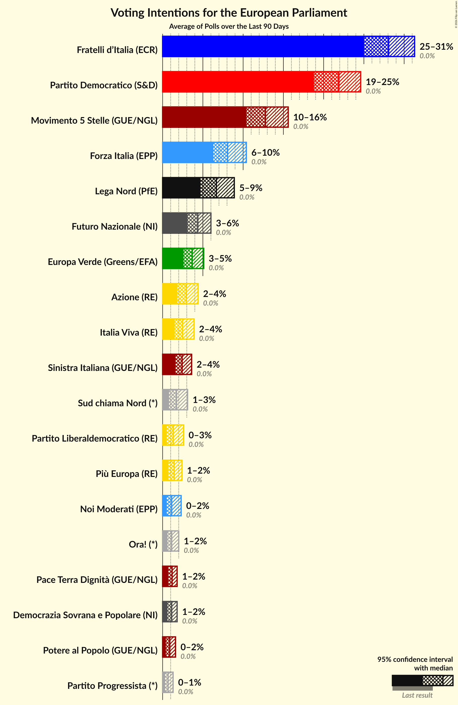

### Confidence Intervals

| Party | Last Result | Median | 80% Confidence Interval | 90% Confidence Interval | 95% Confidence Interval | 99% Confidence Interval |
|:-----:|:-----------:|:------:|:-----------------------:|:-----------------------:|:-----------------------:|:-----------------------:|
| <a href="#movimento-5-stelle-(gue/ngl)">Movimento 5 Stelle (GUE/NGL)</a> | 0.0% | 13.0% | 11.5–14.7% |11.1–15.2% | 10.8–15.7% | 10.1–16.6% |
| <a href="#potere-al-popolo-(gue/ngl)">Potere al Popolo (GUE/NGL)</a> | 0.0% | N/A | N/A |N/A | N/A | N/A |
| <a href="#sinistra-italiana-(gue/ngl)">Sinistra Italiana (GUE/NGL)</a> | 0.0% | 2.4% | 1.8–3.1% |1.7–3.3% | 1.5–3.5% | 1.3–3.9% |
| <a href="#pace-terra-dignità-(gue/ngl)">Pace Terra Dignità (GUE/NGL)</a> | 0.0% | N/A | N/A |N/A | N/A | N/A |
| <a href="#europa-verde-(greens/efa)">Europa Verde (Greens/EFA)</a> | 0.0% | 3.6% | 2.9–4.5% |2.7–4.7% | 2.5–5.0% | 2.2–5.4% |
| <a href="#alleanza-verdi-e-sinistra-(greens/efa)">Alleanza Verdi e Sinistra (Greens/EFA)</a> | 0.0% | N/A | N/A |N/A | N/A | N/A |
| <a href="#partito-democratico-(s&d)">Partito Democratico (S&D)</a> | 0.0% | 21.9% | 20.0–23.7% |19.4–24.3% | 18.9–24.7% | 18.0–25.7% |
| <a href="#liberi-e-uguali-(s&d)">Liberi e Uguali (S&D)</a> | 0.0% | N/A | N/A |N/A | N/A | N/A |
| <a href="#articolo-uno-(s&d)">Articolo Uno (S&D)</a> | 0.0% | N/A | N/A |N/A | N/A | N/A |
| <a href="#civica-popolare-(re)">Civica Popolare (RE)</a> | 0.0% | N/A | N/A |N/A | N/A | N/A |
| <a href="#più-europa-(re)">Più Europa (RE)</a> | 0.0% | 1.6% | 1.1–2.3% |1.0–2.5% | 0.8–2.7% | 0.7–3.1% |
| <a href="#azione-(re)">Azione (RE)</a> | 0.0% | 3.1% | 2.4–4.0% |2.2–4.3% | 2.1–4.5% | 1.8–5.0% |
| <a href="#italia-viva-(re)">Italia Viva (RE)</a> | 0.0% | 2.4% | 1.8–3.1% |1.6–3.4% | 1.5–3.6% | 1.2–4.1% |
| <a href="#più-europa–azione-(re)">Più Europa–Azione (RE)</a> | 0.0% | N/A | N/A |N/A | N/A | N/A |
| <a href="#azione–italia-viva-(re)">Azione–Italia Viva (RE)</a> | 0.0% | N/A | N/A |N/A | N/A | N/A |
| <a href="#partito-liberaldemocratico-(re)">Partito Liberaldemocratico (RE)</a> | 0.0% | 1.2% | 0.6–2.0% |0.5–2.2% | 0.4–2.4% | 0.3–2.7% |
| <a href="#stati-uniti-d’europa-(re)">Stati Uniti d’Europa (RE)</a> | 0.0% | N/A | N/A |N/A | N/A | N/A |
| <a href="#noi-moderati-(epp)">Noi Moderati (EPP)</a> | 0.0% | 1.1% | 0.6–1.7% |0.5–1.9% | 0.5–2.1% | 0.3–2.5% |
| <a href="#forza-italia-(epp)">Forza Italia (EPP)</a> | 0.0% | 8.1% | 7.0–9.5% |6.7–9.9% | 6.4–10.2% | 5.9–11.0% |
| <a href="#südtiroler-volkspartei-(epp)">Südtiroler Volkspartei (EPP)</a> | 0.0% | N/A | N/A |N/A | N/A | N/A |
| <a href="#fratelli-d’italia-(ecr)">Fratelli d’Italia (ECR)</a> | 0.0% | 28.1% | 26.0–30.1% |25.4–30.7% | 24.9–31.3% | 23.9–32.3% |
| <a href="#noi-con-l’italia-(ecr)">Noi con l’Italia (ECR)</a> | 0.0% | N/A | N/A |N/A | N/A | N/A |
| <a href="#cambiamo!-(ecr)">Cambiamo! (ECR)</a> | 0.0% | N/A | N/A |N/A | N/A | N/A |
| <a href="#coraggio-italia-(ecr)">Coraggio Italia (ECR)</a> | 0.0% | N/A | N/A |N/A | N/A | N/A |
| <a href="#lega-nord-(pfe)">Lega Nord (PfE)</a> | 0.0% | 6.8% | 5.4–8.4% |5.1–8.8% | 4.8–9.2% | 4.4–10.0% |
| <a href="#casapound-italia-(ni)">CasaPound Italia (NI)</a> | 0.0% | N/A | N/A |N/A | N/A | N/A |
| <a href="#democrazia-sovrana-e-popolare-(ni)">Democrazia Sovrana e Popolare (NI)</a> | 0.0% | 1.2% | 0.8–1.7% |0.7–1.8% | 0.6–1.9% | 0.5–2.2% |
| <a href="#futuro-nazionale-(ni)">Futuro Nazionale (NI)</a> | 0.0% | 4.1% | 3.1–5.1% |2.9–5.4% | 2.7–5.7% | 2.4–6.3% |
| <a href="#impegno-civico-(ni)">Impegno Civico (NI)</a> | 0.0% | N/A | N/A |N/A | N/A | N/A |
| <a href="#insieme-per-il-futuro-(ni)">Insieme per il Futuro (NI)</a> | 0.0% | N/A | N/A |N/A | N/A | N/A |
| <a href="#italia-sovrana-e-popolare-(ni)">Italia Sovrana e Popolare (NI)</a> | 0.0% | N/A | N/A |N/A | N/A | N/A |
| <a href="#insieme-(*)">Insieme (*)</a> | 0.0% | N/A | N/A |N/A | N/A | N/A |
| <a href="#italexit–per-l’italia-con-paragone-(*)">Italexit–Per l’Italia con Paragone (*)</a> | 0.0% | N/A | N/A |N/A | N/A | N/A |
| <a href="#partito-progressista-(*)">Partito Progressista (*)</a> | 0.0% | 0.6% | 0.4–1.0% |0.3–1.2% | 0.3–1.3% | 0.2–1.6% |
| <a href="#libertà-(*)">Libertà (*)</a> | 0.0% | N/A | N/A |N/A | N/A | N/A |
| <a href="#sud-chiama-nord-(*)">Sud chiama Nord (*)</a> | 0.0% | N/A | N/A |N/A | N/A | N/A |

### Noi Moderati (EPP)

*For a full overview of the results for this party, see the [Noi Moderati (EPP)](party-noimoderatiepp.html) page.*

| Voting Intentions | Probability | Accumulated | Special Marks |
|:-----------------:|:-----------:|:-----------:|:-------------:|
| 0.0–0.5% | 5% | 100% | Last Result |
| 0.5–1.5% | 80% | 95% | Median |
| 1.5–2.5% | 15% | 15% |  |
| 2.5–3.5% | 0.4% | 0.4% |  |
| 3.5–4.5% | 0% | 0% |  |

### Italia Viva (RE)

*For a full overview of the results for this party, see the [Italia Viva (RE)](party-italiavivare.html) page.*

| Voting Intentions | Probability | Accumulated | Special Marks |
|:-----------------:|:-----------:|:-----------:|:-------------:|
| 0.0–0.5% | 0% | 100% | Last Result |
| 0.5–1.5% | 4% | 100% |  |
| 1.5–2.5% | 56% | 96% | Median |
| 2.5–3.5% | 37% | 40% |  |
| 3.5–4.5% | 3% | 3% |  |
| 4.5–5.5% | 0.1% | 0.1% |  |
| 5.5–6.5% | 0% | 0% |  |

### Più Europa (RE)

*For a full overview of the results for this party, see the [Più Europa (RE)](party-piùeuropare.html) page.*

| Voting Intentions | Probability | Accumulated | Special Marks |
|:-----------------:|:-----------:|:-----------:|:-------------:|
| 0.0–0.5% | 0.1% | 100% | Last Result |
| 0.5–1.5% | 44% | 99.9% |  |
| 1.5–2.5% | 51% | 56% | Median |
| 2.5–3.5% | 4% | 4% |  |
| 3.5–4.5% | 0.1% | 0.1% |  |
| 4.5–5.5% | 0% | 0% |  |

### Fratelli d’Italia (ECR)

*For a full overview of the results for this party, see the [Fratelli d’Italia (ECR)](party-fratellid’italiaecr.html) page.*

| Voting Intentions | Probability | Accumulated | Special Marks |
|:-----------------:|:-----------:|:-----------:|:-------------:|
| 0.0–0.5% | 0% | 100% | Last Result |
| 0.5–1.5% | 0% | 100% |  |
| 1.5–2.5% | 0% | 100% |  |
| 2.5–3.5% | 0% | 100% |  |
| 3.5–4.5% | 0% | 100% |  |
| 4.5–5.5% | 0% | 100% |  |
| 5.5–6.5% | 0% | 100% |  |
| 6.5–7.5% | 0% | 100% |  |
| 7.5–8.5% | 0% | 100% |  |
| 8.5–9.5% | 0% | 100% |  |
| 9.5–10.5% | 0% | 100% |  |
| 10.5–11.5% | 0% | 100% |  |
| 11.5–12.5% | 0% | 100% |  |
| 12.5–13.5% | 0% | 100% |  |
| 13.5–14.5% | 0% | 100% |  |
| 14.5–15.5% | 0% | 100% |  |
| 15.5–16.5% | 0% | 100% |  |
| 16.5–17.5% | 0% | 100% |  |
| 17.5–18.5% | 0% | 100% |  |
| 18.5–19.5% | 0% | 100% |  |
| 19.5–20.5% | 0% | 100% |  |
| 20.5–21.5% | 0% | 100% |  |
| 21.5–22.5% | 0% | 100% |  |
| 22.5–23.5% | 0.2% | 100% |  |
| 23.5–24.5% | 1.3% | 99.7% |  |
| 24.5–25.5% | 4% | 98% |  |
| 25.5–26.5% | 11% | 94% |  |
| 26.5–27.5% | 20% | 83% |  |
| 27.5–28.5% | 25% | 63% | Median |
| 28.5–29.5% | 21% | 38% |  |
| 29.5–30.5% | 11% | 18% |  |
| 30.5–31.5% | 5% | 6% |  |
| 31.5–32.5% | 1.4% | 2% |  |
| 32.5–33.5% | 0.3% | 0.3% |  |
| 33.5–34.5% | 0% | 0% |  |
| 34.5–35.5% | 0% | 0% |  |

### Futuro Nazionale (NI)

*For a full overview of the results for this party, see the [Futuro Nazionale (NI)](party-futuronazionaleni.html) page.*

| Voting Intentions | Probability | Accumulated | Special Marks |
|:-----------------:|:-----------:|:-----------:|:-------------:|
| 0.0–0.5% | 0% | 100% | Last Result |
| 0.5–1.5% | 0% | 100% |  |
| 1.5–2.5% | 1.1% | 100% |  |
| 2.5–3.5% | 23% | 98.9% |  |
| 3.5–4.5% | 49% | 76% | Median |
| 4.5–5.5% | 23% | 27% |  |
| 5.5–6.5% | 4% | 4% |  |
| 6.5–7.5% | 0.2% | 0.2% |  |
| 7.5–8.5% | 0% | 0% |  |

### Partito Progressista (*)

*For a full overview of the results for this party, see the [Partito Progressista (*)](party-partitoprogressista.html) page.*

| Voting Intentions | Probability | Accumulated | Special Marks |
|:-----------------:|:-----------:|:-----------:|:-------------:|
| 0.0–0.5% | 34% | 100% | Last Result |
| 0.5–1.5% | 66% | 66% | Median |
| 1.5–2.5% | 0.7% | 0.7% |  |
| 2.5–3.5% | 0% | 0% |  |

### Partito Democratico (S&D)

*For a full overview of the results for this party, see the [Partito Democratico (S&D)](party-partitodemocraticosd.html) page.*

| Voting Intentions | Probability | Accumulated | Special Marks |
|:-----------------:|:-----------:|:-----------:|:-------------:|
| 0.0–0.5% | 0% | 100% | Last Result |
| 0.5–1.5% | 0% | 100% |  |
| 1.5–2.5% | 0% | 100% |  |
| 2.5–3.5% | 0% | 100% |  |
| 3.5–4.5% | 0% | 100% |  |
| 4.5–5.5% | 0% | 100% |  |
| 5.5–6.5% | 0% | 100% |  |
| 6.5–7.5% | 0% | 100% |  |
| 7.5–8.5% | 0% | 100% |  |
| 8.5–9.5% | 0% | 100% |  |
| 9.5–10.5% | 0% | 100% |  |
| 10.5–11.5% | 0% | 100% |  |
| 11.5–12.5% | 0% | 100% |  |
| 12.5–13.5% | 0% | 100% |  |
| 13.5–14.5% | 0% | 100% |  |
| 14.5–15.5% | 0% | 100% |  |
| 15.5–16.5% | 0% | 100% |  |
| 16.5–17.5% | 0.2% | 100% |  |
| 17.5–18.5% | 1.2% | 99.8% |  |
| 18.5–19.5% | 4% | 98.6% |  |
| 19.5–20.5% | 11% | 94% |  |
| 20.5–21.5% | 23% | 83% |  |
| 21.5–22.5% | 28% | 60% | Median |
| 22.5–23.5% | 20% | 32% |  |
| 23.5–24.5% | 9% | 12% |  |
| 24.5–25.5% | 3% | 3% |  |
| 25.5–26.5% | 0.5% | 0.6% |  |
| 26.5–27.5% | 0.1% | 0.1% |  |
| 27.5–28.5% | 0% | 0% |  |

### Movimento 5 Stelle (GUE/NGL)

*For a full overview of the results for this party, see the [Movimento 5 Stelle (GUE/NGL)](party-movimento5stelleguengl.html) page.*

| Voting Intentions | Probability | Accumulated | Special Marks |
|:-----------------:|:-----------:|:-----------:|:-------------:|
| 0.0–0.5% | 0% | 100% | Last Result |
| 0.5–1.5% | 0% | 100% |  |
| 1.5–2.5% | 0% | 100% |  |
| 2.5–3.5% | 0% | 100% |  |
| 3.5–4.5% | 0% | 100% |  |
| 4.5–5.5% | 0% | 100% |  |
| 5.5–6.5% | 0% | 100% |  |
| 6.5–7.5% | 0% | 100% |  |
| 7.5–8.5% | 0% | 100% |  |
| 8.5–9.5% | 0.1% | 100% |  |
| 9.5–10.5% | 1.4% | 99.9% |  |
| 10.5–11.5% | 9% | 98.5% |  |
| 11.5–12.5% | 25% | 90% |  |
| 12.5–13.5% | 33% | 65% | Median |
| 13.5–14.5% | 21% | 32% |  |
| 14.5–15.5% | 8% | 11% |  |
| 15.5–16.5% | 2% | 3% |  |
| 16.5–17.5% | 0.5% | 0.6% |  |
| 17.5–18.5% | 0.1% | 0.1% |  |
| 18.5–19.5% | 0% | 0% |  |

### Forza Italia (EPP)

*For a full overview of the results for this party, see the [Forza Italia (EPP)](party-forzaitaliaepp.html) page.*

| Voting Intentions | Probability | Accumulated | Special Marks |
|:-----------------:|:-----------:|:-----------:|:-------------:|
| 0.0–0.5% | 0% | 100% | Last Result |
| 0.5–1.5% | 0% | 100% |  |
| 1.5–2.5% | 0% | 100% |  |
| 2.5–3.5% | 0% | 100% |  |
| 3.5–4.5% | 0% | 100% |  |
| 4.5–5.5% | 0.1% | 100% |  |
| 5.5–6.5% | 4% | 99.9% |  |
| 6.5–7.5% | 22% | 96% |  |
| 7.5–8.5% | 40% | 74% | Median |
| 8.5–9.5% | 25% | 34% |  |
| 9.5–10.5% | 8% | 9% |  |
| 10.5–11.5% | 1.2% | 1.3% |  |
| 11.5–12.5% | 0.1% | 0.1% |  |
| 12.5–13.5% | 0% | 0% |  |

### Lega Nord (PfE)

*For a full overview of the results for this party, see the [Lega Nord (PfE)](party-leganordpfe.html) page.*

| Voting Intentions | Probability | Accumulated | Special Marks |
|:-----------------:|:-----------:|:-----------:|:-------------:|
| 0.0–0.5% | 0% | 100% | Last Result |
| 0.5–1.5% | 0% | 100% |  |
| 1.5–2.5% | 0% | 100% |  |
| 2.5–3.5% | 0% | 100% |  |
| 3.5–4.5% | 1.0% | 100% |  |
| 4.5–5.5% | 12% | 99.0% |  |
| 5.5–6.5% | 29% | 87% |  |
| 6.5–7.5% | 31% | 58% | Median |
| 7.5–8.5% | 19% | 27% |  |
| 8.5–9.5% | 7% | 8% |  |
| 9.5–10.5% | 1.2% | 1.3% |  |
| 10.5–11.5% | 0.1% | 0.1% |  |
| 11.5–12.5% | 0% | 0% |  |

### Sinistra Italiana (GUE/NGL)

*For a full overview of the results for this party, see the [Sinistra Italiana (GUE/NGL)](party-sinistraitalianaguengl.html) page.*

| Voting Intentions | Probability | Accumulated | Special Marks |
|:-----------------:|:-----------:|:-----------:|:-------------:|
| 0.0–0.5% | 0% | 100% | Last Result |
| 0.5–1.5% | 3% | 100% |  |
| 1.5–2.5% | 61% | 97% | Median |
| 2.5–3.5% | 34% | 36% |  |
| 3.5–4.5% | 2% | 2% |  |
| 4.5–5.5% | 0% | 0% |  |

### Azione (RE)

*For a full overview of the results for this party, see the [Azione (RE)](party-azionere.html) page.*

| Voting Intentions | Probability | Accumulated | Special Marks |
|:-----------------:|:-----------:|:-----------:|:-------------:|
| 0.0–0.5% | 0% | 100% | Last Result |
| 0.5–1.5% | 0.1% | 100% |  |
| 1.5–2.5% | 15% | 99.9% |  |
| 2.5–3.5% | 59% | 85% | Median |
| 3.5–4.5% | 24% | 26% |  |
| 4.5–5.5% | 2% | 2% |  |
| 5.5–6.5% | 0.1% | 0.1% |  |
| 6.5–7.5% | 0% | 0% |  |

### Europa Verde (Greens/EFA)

*For a full overview of the results for this party, see the [Europa Verde (Greens/EFA)](party-europaverdegreensefa.html) page.*

| Voting Intentions | Probability | Accumulated | Special Marks |
|:-----------------:|:-----------:|:-----------:|:-------------:|
| 0.0–0.5% | 0% | 100% | Last Result |
| 0.5–1.5% | 0% | 100% |  |
| 1.5–2.5% | 3% | 100% |  |
| 2.5–3.5% | 45% | 97% |  |
| 3.5–4.5% | 45% | 53% | Median |
| 4.5–5.5% | 7% | 8% |  |
| 5.5–6.5% | 0.3% | 0.3% |  |
| 6.5–7.5% | 0% | 0% |  |

### Democrazia Sovrana e Popolare (NI)

*For a full overview of the results for this party, see the [Democrazia Sovrana e Popolare (NI)](party-democraziasovranaepopolareni.html) page.*

| Voting Intentions | Probability | Accumulated | Special Marks |
|:-----------------:|:-----------:|:-----------:|:-------------:|
| 0.0–0.5% | 1.0% | 100% | Last Result |
| 0.5–1.5% | 83% | 99.0% | Median |
| 1.5–2.5% | 16% | 16% |  |
| 2.5–3.5% | 0.1% | 0.1% |  |
| 3.5–4.5% | 0% | 0% |  |

### Partito Liberaldemocratico (RE)

*For a full overview of the results for this party, see the [Partito Liberaldemocratico (RE)](party-partitoliberaldemocraticore.html) page.*

| Voting Intentions | Probability | Accumulated | Special Marks |
|:-----------------:|:-----------:|:-----------:|:-------------:|
| 0.0–0.5% | 7% | 100% | Last Result |
| 0.5–1.5% | 63% | 93% | Median |
| 1.5–2.5% | 29% | 30% |  |
| 2.5–3.5% | 1.2% | 1.2% |  |
| 3.5–4.5% | 0% | 0% |  |

## Seats

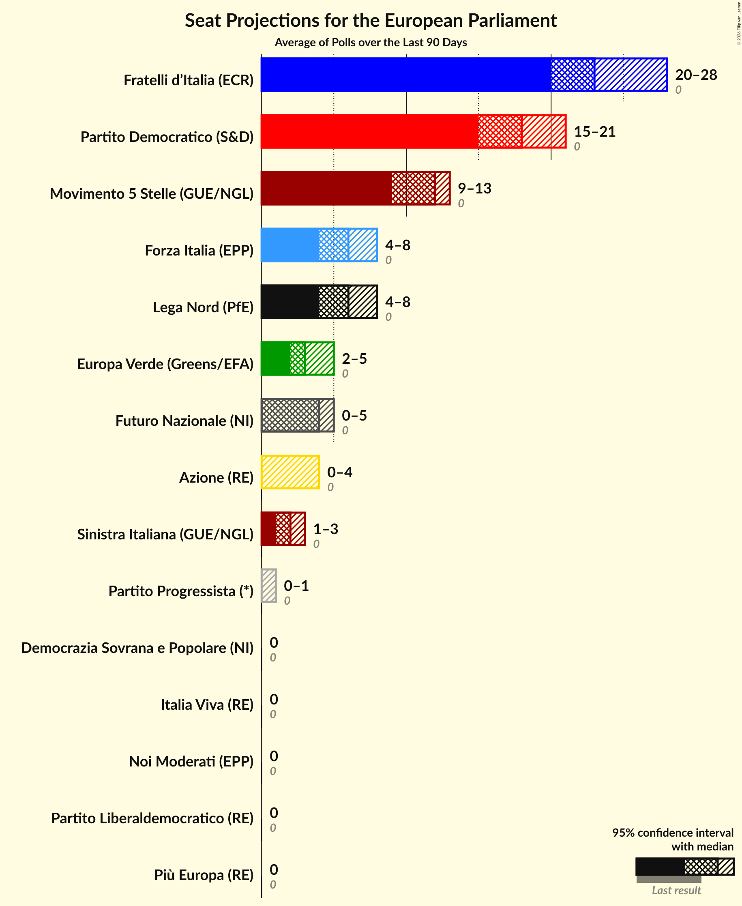

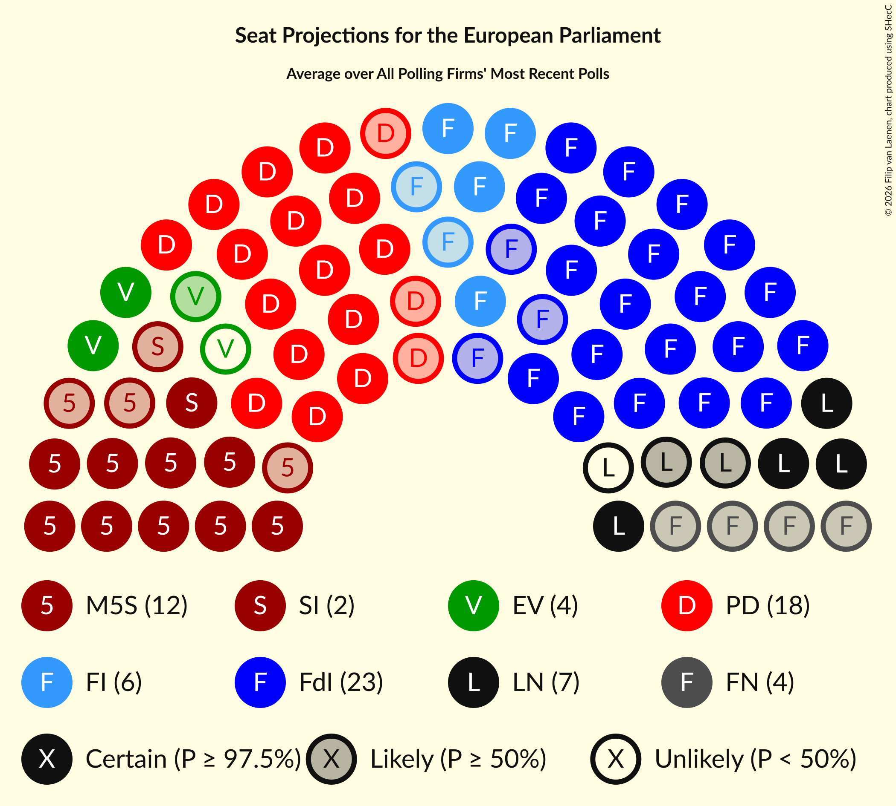

### Confidence Intervals

| Party | Last Result | Median | 80% Confidence Interval | 90% Confidence Interval | 95% Confidence Interval | 99% Confidence Interval |
|:-----:|:-----------:|:------:|:-----------------------:|:-----------------------:|:-----------------------:|:-----------------------:|
| <a href="#movimento-5-stelle-(gue/ngl)">Movimento 5 Stelle (GUE/NGL)</a> | 0 | 11 | 10–13 |9–14 | 9–14 | 9–14 |
| <a href="#potere-al-popolo-(gue/ngl)">Potere al Popolo (GUE/NGL)</a> | 0 | N/A | N/A |N/A | N/A | N/A |
| <a href="#sinistra-italiana-(gue/ngl)">Sinistra Italiana (GUE/NGL)</a> | 0 | 2 | 1–3 |1–3 | 1–3 | 1–4 |
| <a href="#pace-terra-dignità-(gue/ngl)">Pace Terra Dignità (GUE/NGL)</a> | 0 | N/A | N/A |N/A | N/A | N/A |
| <a href="#europa-verde-(greens/efa)">Europa Verde (Greens/EFA)</a> | 0 | 3 | 3–4 |3–5 | 2–5 | 2–5 |
| <a href="#alleanza-verdi-e-sinistra-(greens/efa)">Alleanza Verdi e Sinistra (Greens/EFA)</a> | 0 | N/A | N/A |N/A | N/A | N/A |
| <a href="#partito-democratico-(s&d)">Partito Democratico (S&D)</a> | 0 | 19 | 17–21 |16–21 | 15–22 | 14–22 |
| <a href="#liberi-e-uguali-(s&d)">Liberi e Uguali (S&D)</a> | 0 | N/A | N/A |N/A | N/A | N/A |
| <a href="#articolo-uno-(s&d)">Articolo Uno (S&D)</a> | 0 | N/A | N/A |N/A | N/A | N/A |
| <a href="#civica-popolare-(re)">Civica Popolare (RE)</a> | 0 | N/A | N/A |N/A | N/A | N/A |
| <a href="#più-europa-(re)">Più Europa (RE)</a> | 0 | 0 | 0 |0 | 0 | 0 |
| <a href="#azione-(re)">Azione (RE)</a> | 0 | 0 | 0–3 |0–4 | 0–4 | 0–4 |
| <a href="#italia-viva-(re)">Italia Viva (RE)</a> | 0 | 0 | 0 |0 | 0 | 0–4 |
| <a href="#più-europa–azione-(re)">Più Europa–Azione (RE)</a> | 0 | N/A | N/A |N/A | N/A | N/A |
| <a href="#azione–italia-viva-(re)">Azione–Italia Viva (RE)</a> | 0 | N/A | N/A |N/A | N/A | N/A |
| <a href="#partito-liberaldemocratico-(re)">Partito Liberaldemocratico (RE)</a> | 0 | 0 | 0 |0 | 0 | 0 |
| <a href="#stati-uniti-d’europa-(re)">Stati Uniti d’Europa (RE)</a> | 0 | N/A | N/A |N/A | N/A | N/A |
| <a href="#noi-moderati-(epp)">Noi Moderati (EPP)</a> | 0 | 0 | 0 |0 | 0 | 0 |
| <a href="#forza-italia-(epp)">Forza Italia (EPP)</a> | 0 | 6 | 5–8 |5–8 | 4–8 | 4–9 |
| <a href="#südtiroler-volkspartei-(epp)">Südtiroler Volkspartei (EPP)</a> | 0 | N/A | N/A |N/A | N/A | N/A |
| <a href="#fratelli-d’italia-(ecr)">Fratelli d’Italia (ECR)</a> | 0 | 24 | 22–26 |21–27 | 21–27 | 20–28 |
| <a href="#noi-con-l’italia-(ecr)">Noi con l’Italia (ECR)</a> | 0 | N/A | N/A |N/A | N/A | N/A |
| <a href="#cambiamo!-(ecr)">Cambiamo! (ECR)</a> | 0 | N/A | N/A |N/A | N/A | N/A |
| <a href="#coraggio-italia-(ecr)">Coraggio Italia (ECR)</a> | 0 | N/A | N/A |N/A | N/A | N/A |
| <a href="#lega-nord-(pfe)">Lega Nord (PfE)</a> | 0 | 6 | 4–8 |4–8 | 4–8 | 4–9 |
| <a href="#casapound-italia-(ni)">CasaPound Italia (NI)</a> | 0 | N/A | N/A |N/A | N/A | N/A |
| <a href="#democrazia-sovrana-e-popolare-(ni)">Democrazia Sovrana e Popolare (NI)</a> | 0 | 0 | 0 |0 | 0 | 0 |
| <a href="#futuro-nazionale-(ni)">Futuro Nazionale (NI)</a> | 0 | 0 | 0–4 |0–5 | 0–5 | 0–5 |
| <a href="#impegno-civico-(ni)">Impegno Civico (NI)</a> | 0 | N/A | N/A |N/A | N/A | N/A |
| <a href="#insieme-per-il-futuro-(ni)">Insieme per il Futuro (NI)</a> | 0 | N/A | N/A |N/A | N/A | N/A |
| <a href="#italia-sovrana-e-popolare-(ni)">Italia Sovrana e Popolare (NI)</a> | 0 | N/A | N/A |N/A | N/A | N/A |
| <a href="#insieme-(*)">Insieme (*)</a> | 0 | N/A | N/A |N/A | N/A | N/A |
| <a href="#italexit–per-l’italia-con-paragone-(*)">Italexit–Per l’Italia con Paragone (*)</a> | 0 | N/A | N/A |N/A | N/A | N/A |
| <a href="#partito-progressista-(*)">Partito Progressista (*)</a> | 0 | 0 | 0–1 |0–1 | 0–1 | 0–1 |
| <a href="#libertà-(*)">Libertà (*)</a> | 0 | N/A | N/A |N/A | N/A | N/A |
| <a href="#sud-chiama-nord-(*)">Sud chiama Nord (*)</a> | 0 | N/A | N/A |N/A | N/A | N/A |

### Movimento 5 Stelle (GUE/NGL)

*For a full overview of the results for this party, see the [Movimento 5 Stelle (GUE/NGL)](party-movimento5stelleguengl.html) page.*

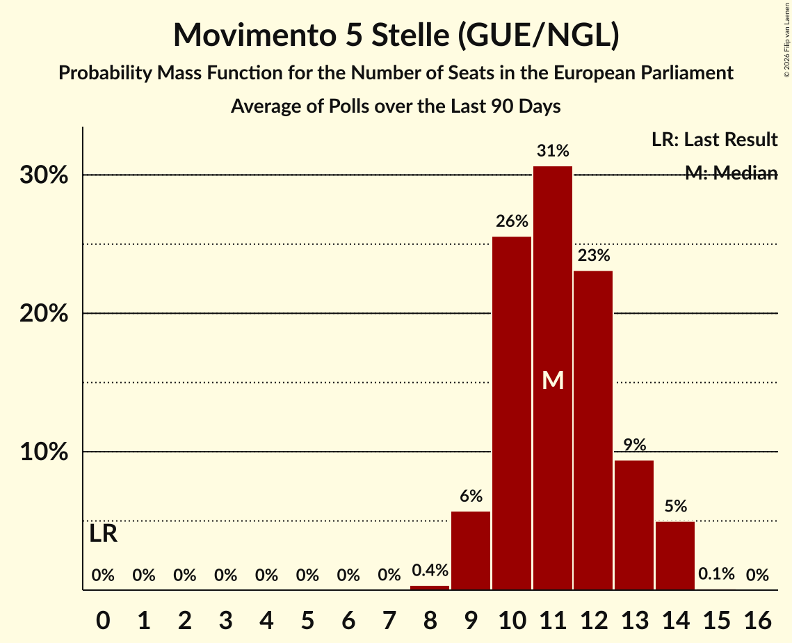

| Number of Seats | Probability | Accumulated | Special Marks |
|:---------------:|:-----------:|:-----------:|:-------------:|
| 0 | 0% | 100% | Last Result |
| 1 | 0% | 100% |  |
| 2 | 0% | 100% |  |
| 3 | 0% | 100% |  |
| 4 | 0% | 100% |  |
| 5 | 0% | 100% |  |
| 6 | 0% | 100% |  |
| 7 | 0% | 100% |  |
| 8 | 0.4% | 100% |  |
| 9 | 6% | 99.6% |  |
| 10 | 26% | 94% |  |
| 11 | 31% | 68% | Median |
| 12 | 23% | 38% |  |
| 13 | 9% | 15% |  |
| 14 | 5% | 5% |  |
| 15 | 0.1% | 0.1% |  |
| 16 | 0% | 0% |  |

### Potere al Popolo (GUE/NGL)

*For a full overview of the results for this party, see the [Potere al Popolo (GUE/NGL)](party-poterealpopologuengl.html) page.*

### Sinistra Italiana (GUE/NGL)

*For a full overview of the results for this party, see the [Sinistra Italiana (GUE/NGL)](party-sinistraitalianaguengl.html) page.*

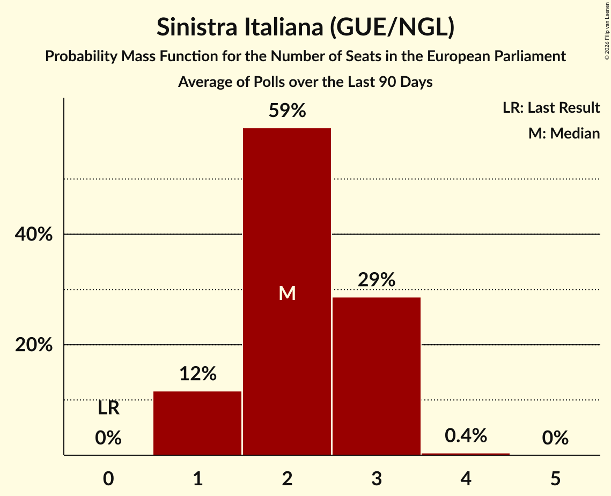

| Number of Seats | Probability | Accumulated | Special Marks |
|:---------------:|:-----------:|:-----------:|:-------------:|
| 0 | 0% | 100% | Last Result |
| 1 | 11% | 100% |  |
| 2 | 69% | 89% | Median |
| 3 | 19% | 20% |  |
| 4 | 0.7% | 0.7% |  |
| 5 | 0% | 0% |  |

### Pace Terra Dignità (GUE/NGL)

*For a full overview of the results for this party, see the [Pace Terra Dignità (GUE/NGL)](party-paceterradignitàguengl.html) page.*

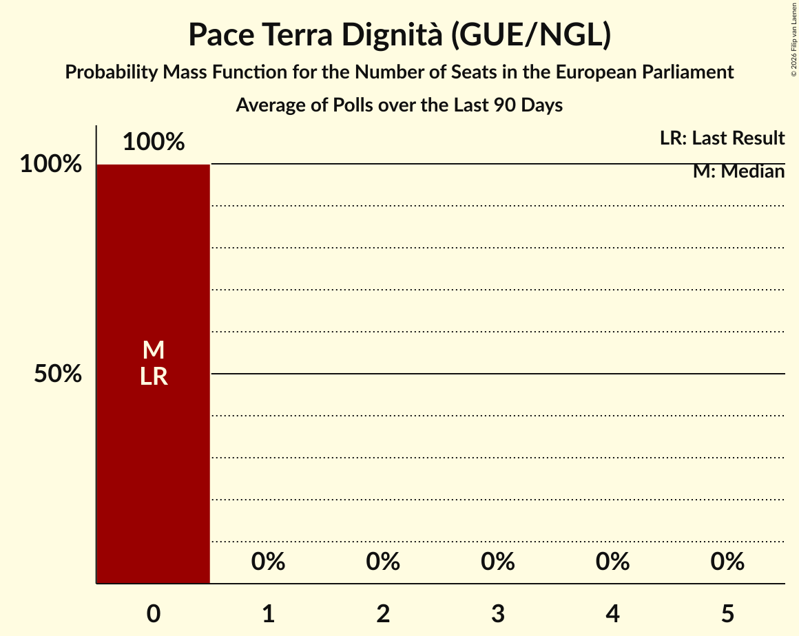

### Europa Verde (Greens/EFA)

*For a full overview of the results for this party, see the [Europa Verde (Greens/EFA)](party-europaverdegreensefa.html) page.*

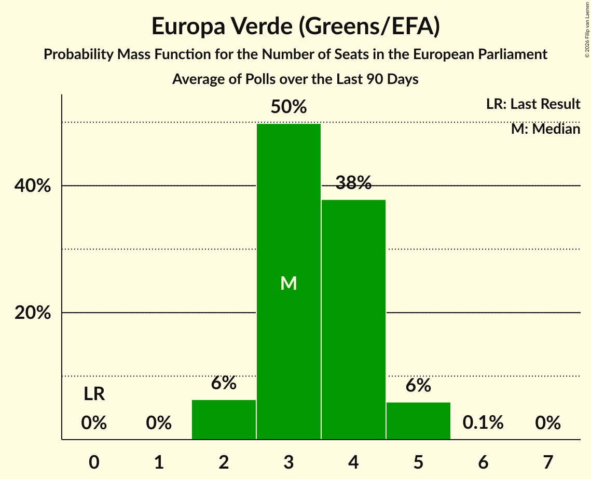

| Number of Seats | Probability | Accumulated | Special Marks |
|:---------------:|:-----------:|:-----------:|:-------------:|
| 0 | 0% | 100% | Last Result |
| 1 | 0% | 100% |  |
| 2 | 4% | 100% |  |
| 3 | 53% | 96% | Median |
| 4 | 36% | 43% |  |
| 5 | 7% | 7% |  |
| 6 | 0.1% | 0.1% |  |
| 7 | 0% | 0% |  |

### Alleanza Verdi e Sinistra (Greens/EFA)

*For a full overview of the results for this party, see the [Alleanza Verdi e Sinistra (Greens/EFA)](party-alleanzaverdiesinistragreensefa.html) page.*

### Partito Democratico (S&D)

*For a full overview of the results for this party, see the [Partito Democratico (S&D)](party-partitodemocraticosd.html) page.*

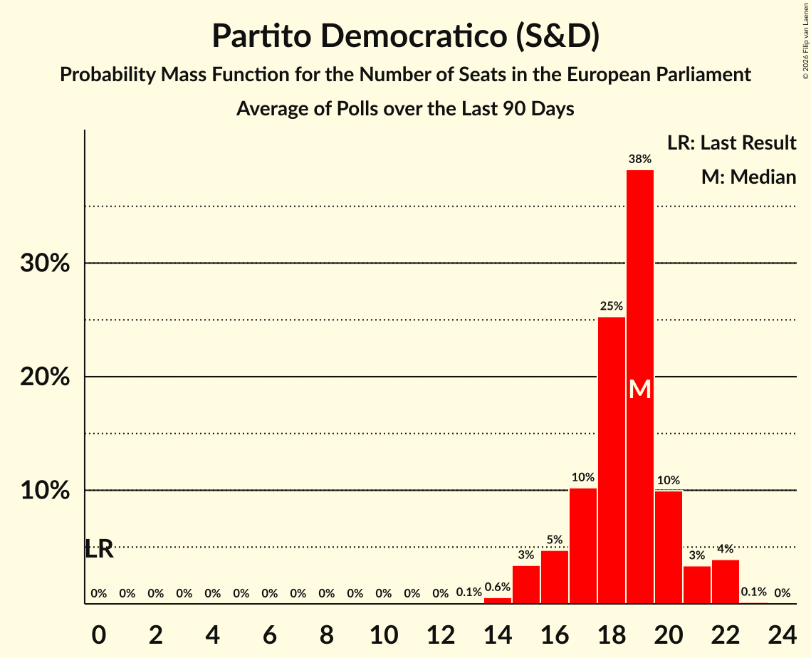

| Number of Seats | Probability | Accumulated | Special Marks |
|:---------------:|:-----------:|:-----------:|:-------------:|
| 0 | 0% | 100% | Last Result |
| 1 | 0% | 100% |  |
| 2 | 0% | 100% |  |
| 3 | 0% | 100% |  |
| 4 | 0% | 100% |  |
| 5 | 0% | 100% |  |
| 6 | 0% | 100% |  |
| 7 | 0% | 100% |  |
| 8 | 0% | 100% |  |
| 9 | 0% | 100% |  |
| 10 | 0% | 100% |  |
| 11 | 0% | 100% |  |
| 12 | 0% | 100% |  |
| 13 | 0.1% | 100% |  |
| 14 | 0.6% | 99.9% |  |
| 15 | 4% | 99.2% |  |
| 16 | 3% | 95% |  |
| 17 | 11% | 92% |  |
| 18 | 26% | 80% |  |
| 19 | 18% | 55% | Median |
| 20 | 20% | 37% |  |
| 21 | 12% | 17% |  |
| 22 | 5% | 5% |  |
| 23 | 0.4% | 0.4% |  |
| 24 | 0% | 0% |  |

### Liberi e Uguali (S&D)

*For a full overview of the results for this party, see the [Liberi e Uguali (S&D)](party-liberieugualisd.html) page.*

### Articolo Uno (S&D)

*For a full overview of the results for this party, see the [Articolo Uno (S&D)](party-articolounosd.html) page.*

### Civica Popolare (RE)

*For a full overview of the results for this party, see the [Civica Popolare (RE)](party-civicapopolarere.html) page.*

### Più Europa (RE)

*For a full overview of the results for this party, see the [Più Europa (RE)](party-piùeuropare.html) page.*

| Number of Seats | Probability | Accumulated | Special Marks |
|:---------------:|:-----------:|:-----------:|:-------------:|
| 0 | 100% | 100% | Last Result, Median |

### Azione (RE)

*For a full overview of the results for this party, see the [Azione (RE)](party-azionere.html) page.*

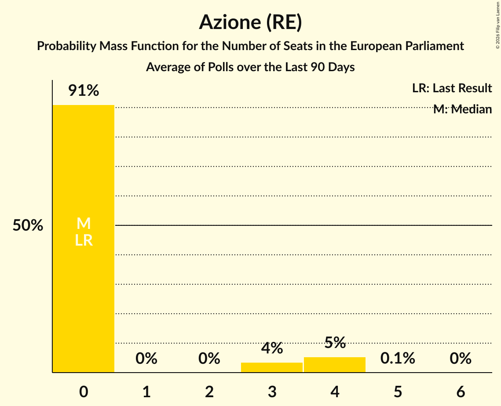

| Number of Seats | Probability | Accumulated | Special Marks |
|:---------------:|:-----------:|:-----------:|:-------------:|
| 0 | 89% | 100% | Last Result, Median |
| 1 | 0% | 11% |  |
| 2 | 0% | 11% |  |
| 3 | 4% | 11% |  |
| 4 | 6% | 6% |  |
| 5 | 0.1% | 0.1% |  |
| 6 | 0% | 0% |  |

### Italia Viva (RE)

*For a full overview of the results for this party, see the [Italia Viva (RE)](party-italiavivare.html) page.*

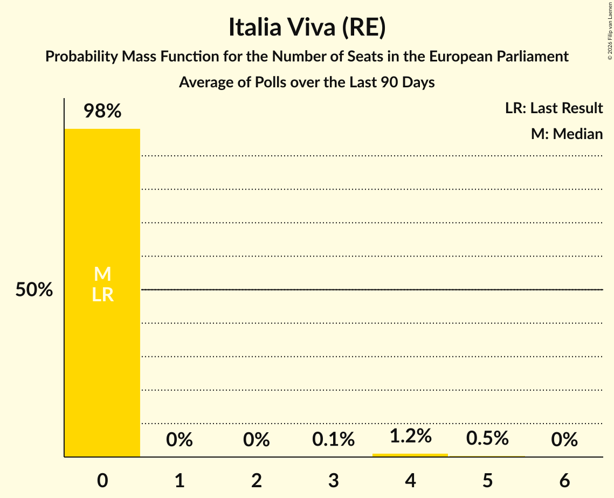

| Number of Seats | Probability | Accumulated | Special Marks |
|:---------------:|:-----------:|:-----------:|:-------------:|
| 0 | 99.2% | 100% | Last Result, Median |
| 1 | 0% | 0.8% |  |
| 2 | 0% | 0.8% |  |
| 3 | 0.3% | 0.8% |  |
| 4 | 0.5% | 0.5% |  |
| 5 | 0% | 0% |  |

### Più Europa–Azione (RE)

*For a full overview of the results for this party, see the [Più Europa–Azione (RE)](party-piùeuropa–azionere.html) page.*

### Azione–Italia Viva (RE)

*For a full overview of the results for this party, see the [Azione–Italia Viva (RE)](party-azione–italiavivare.html) page.*

### Partito Liberaldemocratico (RE)

*For a full overview of the results for this party, see the [Partito Liberaldemocratico (RE)](party-partitoliberaldemocraticore.html) page.*

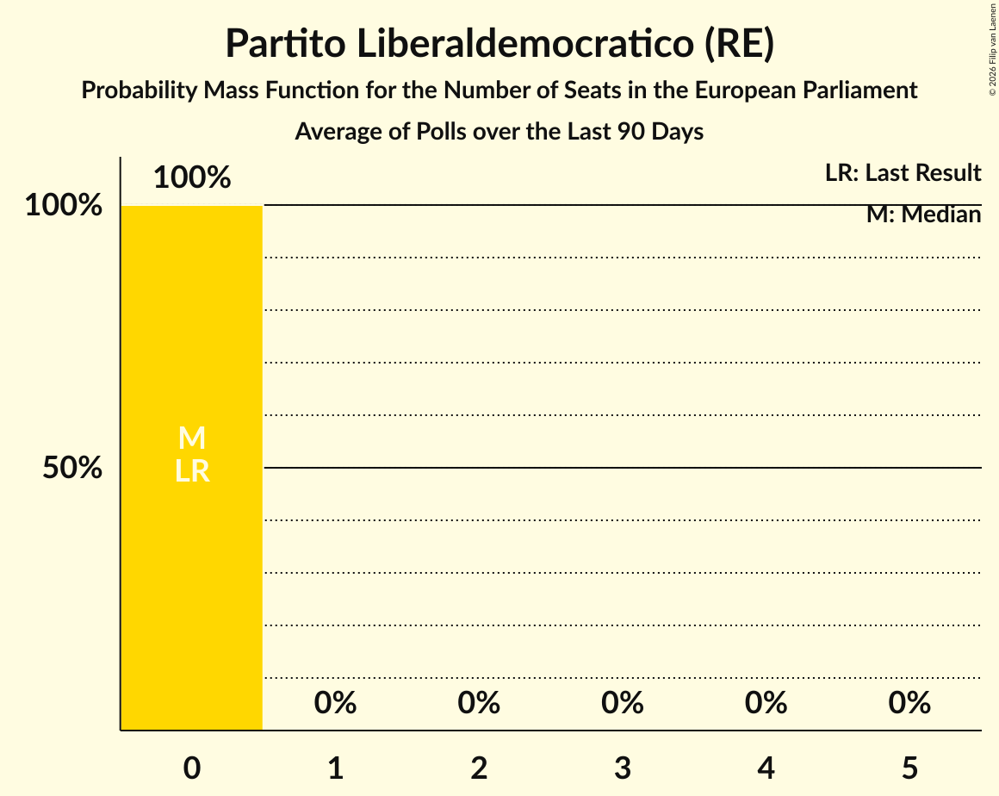

| Number of Seats | Probability | Accumulated | Special Marks |
|:---------------:|:-----------:|:-----------:|:-------------:|
| 0 | 100% | 100% | Last Result, Median |

### Stati Uniti d’Europa (RE)

*For a full overview of the results for this party, see the [Stati Uniti d’Europa (RE)](party-statiunitid’europare.html) page.*

### Noi Moderati (EPP)

*For a full overview of the results for this party, see the [Noi Moderati (EPP)](party-noimoderatiepp.html) page.*

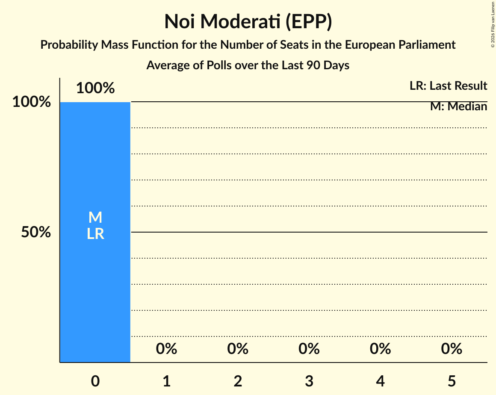

| Number of Seats | Probability | Accumulated | Special Marks |
|:---------------:|:-----------:|:-----------:|:-------------:|
| 0 | 100% | 100% | Last Result, Median |

### Forza Italia (EPP)

*For a full overview of the results for this party, see the [Forza Italia (EPP)](party-forzaitaliaepp.html) page.*

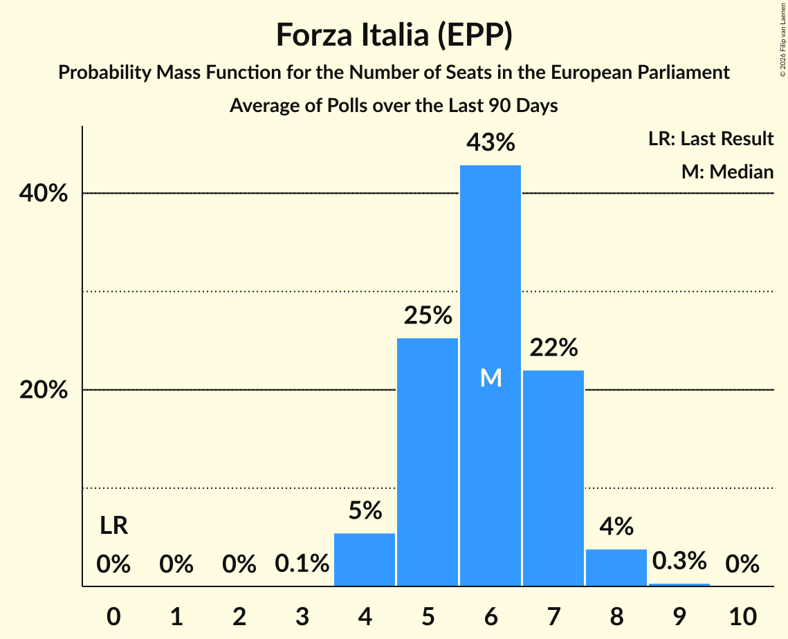

| Number of Seats | Probability | Accumulated | Special Marks |
|:---------------:|:-----------:|:-----------:|:-------------:|
| 0 | 0% | 100% | Last Result |
| 1 | 0% | 100% |  |
| 2 | 0% | 100% |  |
| 3 | 0% | 100% |  |
| 4 | 4% | 100% |  |
| 5 | 26% | 96% |  |
| 6 | 44% | 70% | Median |
| 7 | 15% | 26% |  |
| 8 | 11% | 11% |  |
| 9 | 0.8% | 0.9% |  |
| 10 | 0% | 0% |  |

### Südtiroler Volkspartei (EPP)

*For a full overview of the results for this party, see the [Südtiroler Volkspartei (EPP)](party-südtirolervolksparteiepp.html) page.*

### Fratelli d’Italia (ECR)

*For a full overview of the results for this party, see the [Fratelli d’Italia (ECR)](party-fratellid’italiaecr.html) page.*

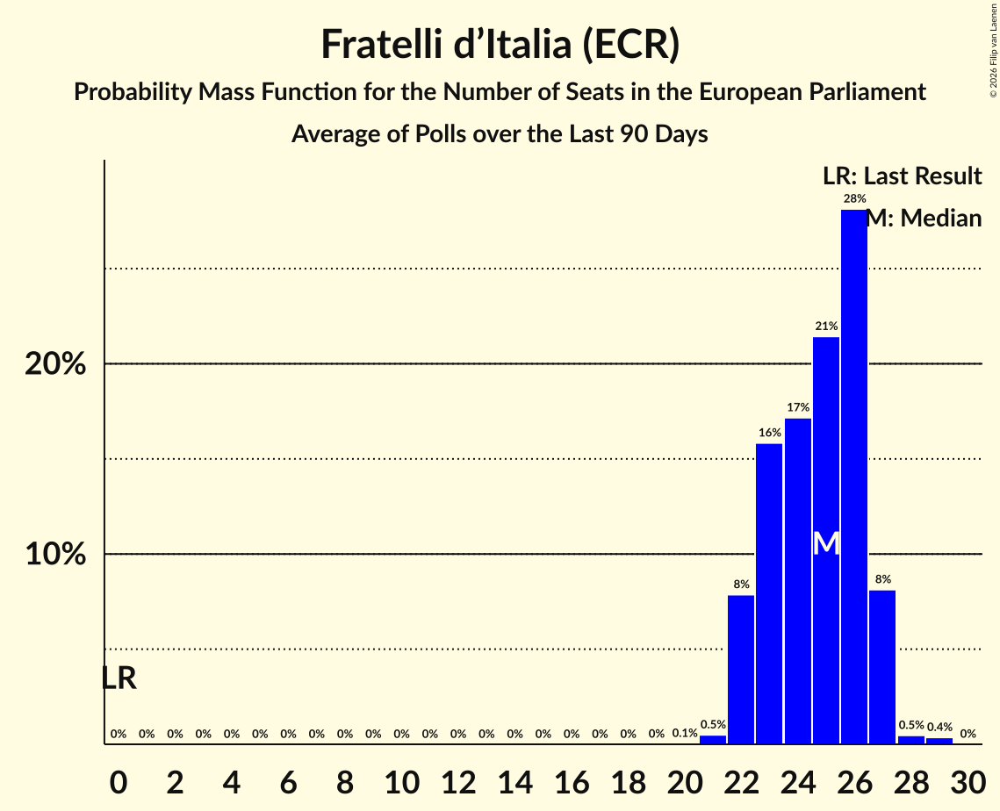

| Number of Seats | Probability | Accumulated | Special Marks |
|:---------------:|:-----------:|:-----------:|:-------------:|
| 0 | 0% | 100% | Last Result |
| 1 | 0% | 100% |  |
| 2 | 0% | 100% |  |
| 3 | 0% | 100% |  |
| 4 | 0% | 100% |  |
| 5 | 0% | 100% |  |
| 6 | 0% | 100% |  |
| 7 | 0% | 100% |  |
| 8 | 0% | 100% |  |
| 9 | 0% | 100% |  |
| 10 | 0% | 100% |  |
| 11 | 0% | 100% |  |
| 12 | 0% | 100% |  |
| 13 | 0% | 100% |  |
| 14 | 0% | 100% |  |
| 15 | 0% | 100% |  |
| 16 | 0% | 100% |  |
| 17 | 0% | 100% |  |
| 18 | 0% | 100% |  |
| 19 | 0.1% | 100% |  |
| 20 | 0.5% | 99.9% |  |
| 21 | 5% | 99.4% |  |
| 22 | 18% | 94% |  |
| 23 | 16% | 76% |  |
| 24 | 23% | 60% | Median |
| 25 | 13% | 37% |  |
| 26 | 19% | 24% |  |
| 27 | 3% | 5% |  |
| 28 | 2% | 2% |  |
| 29 | 0.1% | 0.1% |  |
| 30 | 0% | 0% |  |

### Noi con l’Italia (ECR)

*For a full overview of the results for this party, see the [Noi con l’Italia (ECR)](party-noiconl’italiaecr.html) page.*

### Cambiamo! (ECR)

*For a full overview of the results for this party, see the [Cambiamo! (ECR)](party-cambiamoecr.html) page.*

### Coraggio Italia (ECR)

*For a full overview of the results for this party, see the [Coraggio Italia (ECR)](party-coraggioitaliaecr.html) page.*

### Lega Nord (PfE)

*For a full overview of the results for this party, see the [Lega Nord (PfE)](party-leganordpfe.html) page.*

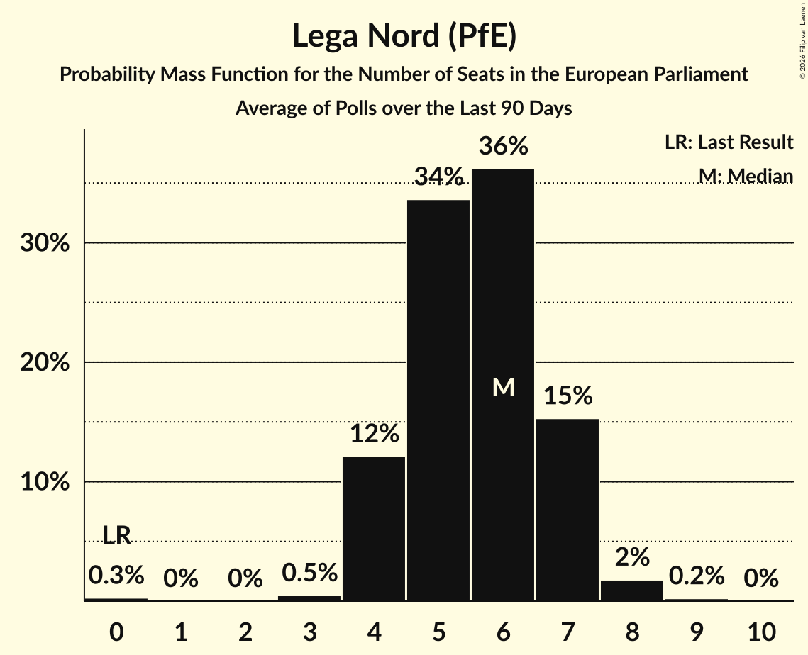

| Number of Seats | Probability | Accumulated | Special Marks |
|:---------------:|:-----------:|:-----------:|:-------------:|
| 0 | 0.1% | 100% | Last Result |
| 1 | 0% | 99.9% |  |
| 2 | 0% | 99.9% |  |
| 3 | 0.1% | 99.9% |  |
| 4 | 12% | 99.8% |  |
| 5 | 23% | 87% |  |
| 6 | 33% | 64% | Median |
| 7 | 19% | 31% |  |
| 8 | 11% | 12% |  |
| 9 | 1.0% | 1.0% |  |
| 10 | 0% | 0% |  |

### CasaPound Italia (NI)

*For a full overview of the results for this party, see the [CasaPound Italia (NI)](party-casapounditaliani.html) page.*

### Democrazia Sovrana e Popolare (NI)

*For a full overview of the results for this party, see the [Democrazia Sovrana e Popolare (NI)](party-democraziasovranaepopolareni.html) page.*

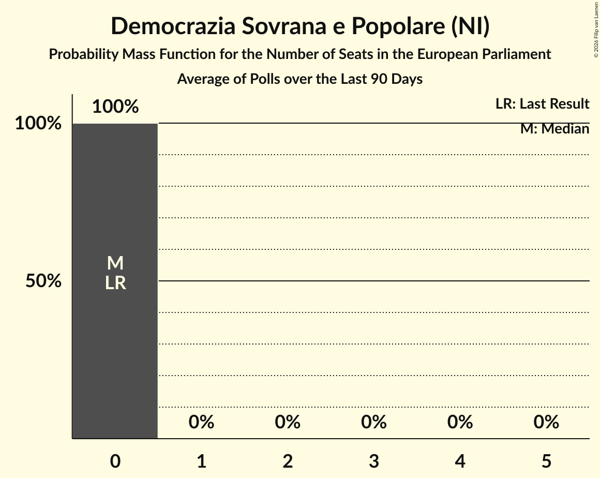

| Number of Seats | Probability | Accumulated | Special Marks |
|:---------------:|:-----------:|:-----------:|:-------------:|
| 0 | 100% | 100% | Last Result, Median |

### Futuro Nazionale (NI)

*For a full overview of the results for this party, see the [Futuro Nazionale (NI)](party-futuronazionaleni.html) page.*

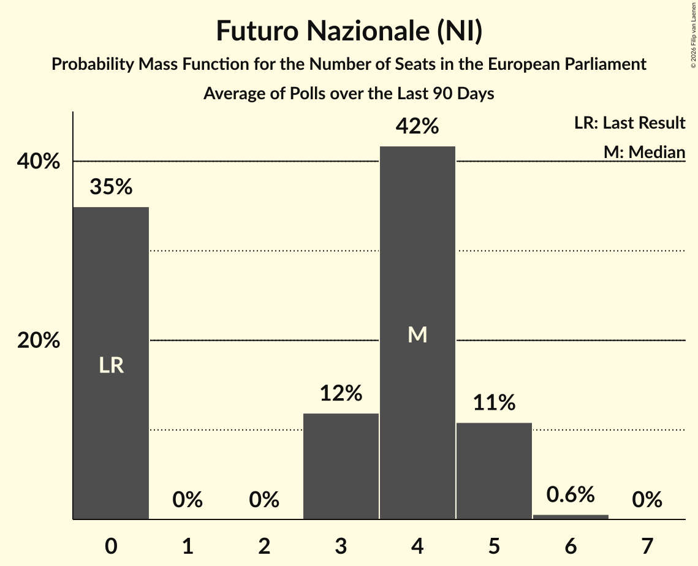

| Number of Seats | Probability | Accumulated | Special Marks |
|:---------------:|:-----------:|:-----------:|:-------------:|
| 0 | 54% | 100% | Last Result, Median |
| 1 | 0% | 46% |  |
| 2 | 0% | 46% |  |
| 3 | 8% | 46% |  |
| 4 | 29% | 38% |  |
| 5 | 8% | 8% |  |
| 6 | 0.2% | 0.2% |  |
| 7 | 0% | 0% |  |

### Impegno Civico (NI)

*For a full overview of the results for this party, see the [Impegno Civico (NI)](party-impegnociviconi.html) page.*

### Insieme per il Futuro (NI)

*For a full overview of the results for this party, see the [Insieme per il Futuro (NI)](party-insiemeperilfuturoni.html) page.*

### Italia Sovrana e Popolare (NI)

*For a full overview of the results for this party, see the [Italia Sovrana e Popolare (NI)](party-italiasovranaepopolareni.html) page.*

### Insieme (*)

*For a full overview of the results for this party, see the [Insieme (*)](party-insieme.html) page.*

### Italexit–Per l’Italia con Paragone (*)

*For a full overview of the results for this party, see the [Italexit–Per l’Italia con Paragone (*)](party-italexit–perl’italiaconparagone.html) page.*

### Partito Progressista (*)

*For a full overview of the results for this party, see the [Partito Progressista (*)](party-partitoprogressista.html) page.*

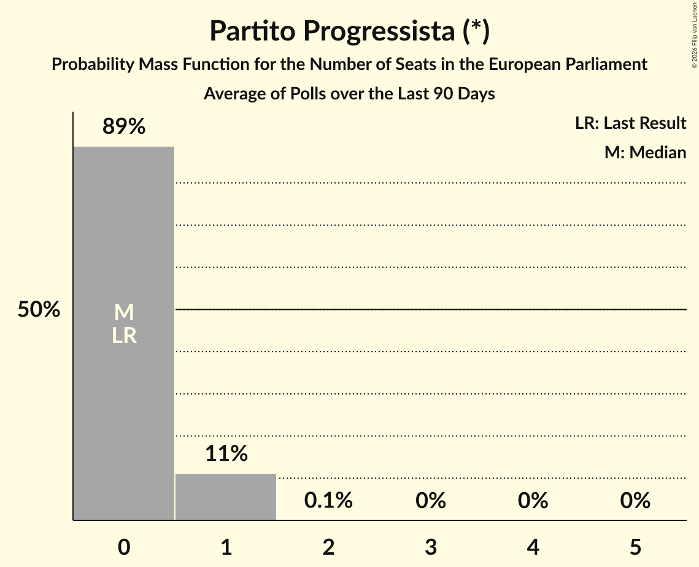

| Number of Seats | Probability | Accumulated | Special Marks |
|:---------------:|:-----------:|:-----------:|:-------------:|
| 0 | 74% | 100% | Last Result, Median |
| 1 | 25% | 26% |  |
| 2 | 0.1% | 0.1% |  |
| 3 | 0% | 0% |  |

### Libertà (*)

*For a full overview of the results for this party, see the [Libertà (*)](party-libertà.html) page.*

### Sud chiama Nord (*)

*For a full overview of the results for this party, see the [Sud chiama Nord (*)](party-sudchiamanord.html) page.*

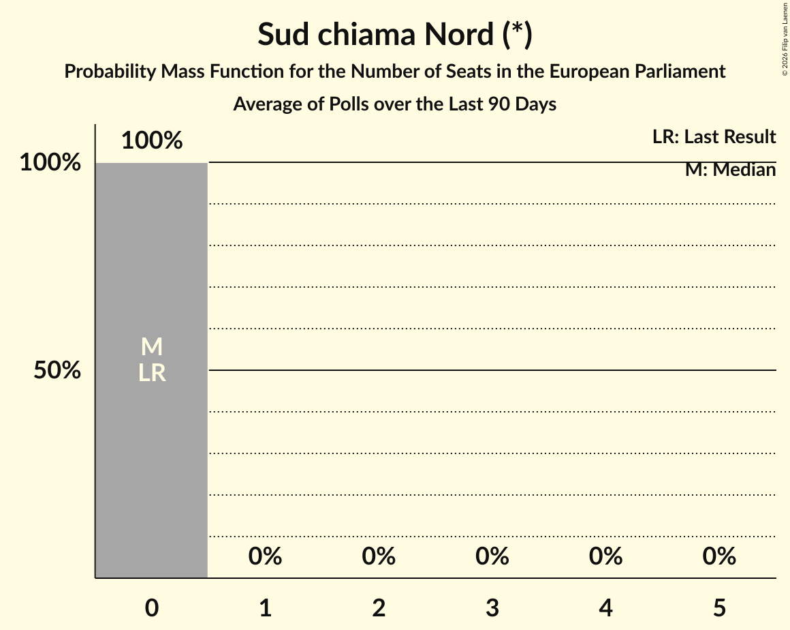

## Coalitions

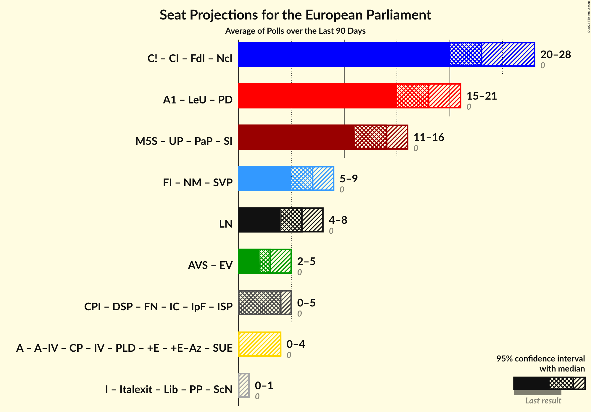

### Confidence Intervals

| Coalition | Last Result | Median | Majority? | 80% Confidence Interval | 90% Confidence Interval | 95% Confidence Interval | 99% Confidence Interval |
|:---------:|:-----------:|:------:|:---------:|:-----------------------:|:-----------------------:|:-----------------------:|:-----------------------:|
| Cambiamo! (ECR) – Coraggio Italia (ECR) – Fratelli d’Italia (ECR) – Noi con l’Italia (ECR) | 0 | 24 | 0% | 22–26 | 21–27 | 21–27 | 20–28 |
| Articolo Uno (S&D) – Liberi e Uguali (S&D) – Partito Democratico (S&D) | 0 | 19 | 0% | 17–21 | 16–21 | 15–22 | 14–22 |
| Movimento 5 Stelle (GUE/NGL) – Pace Terra Dignità (GUE/NGL) – Potere al Popolo (GUE/NGL) – Sinistra Italiana (GUE/NGL) | 0 | 13 | 0% | 12–15 | 11–16 | 11–16 | 10–17 |
| Forza Italia (EPP) – Noi Moderati (EPP) – Südtiroler Volkspartei (EPP) | 0 | 7 | 0% | 6–9 | 6–9 | 5–9 | 5–10 |
| Lega Nord (PfE) | 0 | 6 | 0% | 4–8 | 4–8 | 4–8 | 4–9 |
| Alleanza Verdi e Sinistra (Greens/EFA) – Europa Verde (Greens/EFA) | 0 | 3 | 0% | 3–4 | 3–5 | 2–5 | 2–5 |
| CasaPound Italia (NI) – Democrazia Sovrana e Popolare (NI) – Futuro Nazionale (NI) – Impegno Civico (NI) – Insieme per il Futuro (NI) – Italia Sovrana e Popolare (NI) | 0 | 0 | 0% | 0–4 | 0–5 | 0–5 | 0–5 |
| Azione (RE) – Azione–Italia Viva (RE) – Civica Popolare (RE) – Italia Viva (RE) – Partito Liberaldemocratico (RE) – Più Europa (RE) – Più Europa–Azione (RE) – Stati Uniti d’Europa (RE) | 0 | 0 | 0% | 0–3 | 0–4 | 0–4 | 0–4 |
| Insieme (*) – Italexit–Per l’Italia con Paragone (*) – Libertà (*) – Partito Progressista (*) – Sud chiama Nord (*) | 0 | 0 | 0% | 0–1 | 0–1 | 0–1 | 0–1 |

### Cambiamo! (ECR) – Coraggio Italia (ECR) – Fratelli d’Italia (ECR) – Noi con l’Italia (ECR)

| Number of Seats | Probability | Accumulated | Special Marks |
|:---------------:|:-----------:|:-----------:|:-------------:|
| 0 | 0% | 100% | Last Result |
| 1 | 0% | 100% |  |
| 2 | 0% | 100% |  |
| 3 | 0% | 100% |  |
| 4 | 0% | 100% |  |
| 5 | 0% | 100% |  |
| 6 | 0% | 100% |  |
| 7 | 0% | 100% |  |
| 8 | 0% | 100% |  |
| 9 | 0% | 100% |  |
| 10 | 0% | 100% |  |
| 11 | 0% | 100% |  |
| 12 | 0% | 100% |  |
| 13 | 0% | 100% |  |
| 14 | 0% | 100% |  |
| 15 | 0% | 100% |  |
| 16 | 0% | 100% |  |
| 17 | 0% | 100% |  |
| 18 | 0% | 100% |  |
| 19 | 0.1% | 100% |  |
| 20 | 0.5% | 99.9% |  |
| 21 | 5% | 99.4% |  |
| 22 | 18% | 94% |  |
| 23 | 16% | 76% |  |
| 24 | 23% | 60% | Median |
| 25 | 13% | 37% |  |
| 26 | 19% | 24% |  |
| 27 | 3% | 5% |  |
| 28 | 2% | 2% |  |
| 29 | 0.1% | 0.1% |  |
| 30 | 0% | 0% |  |

### Articolo Uno (S&D) – Liberi e Uguali (S&D) – Partito Democratico (S&D)

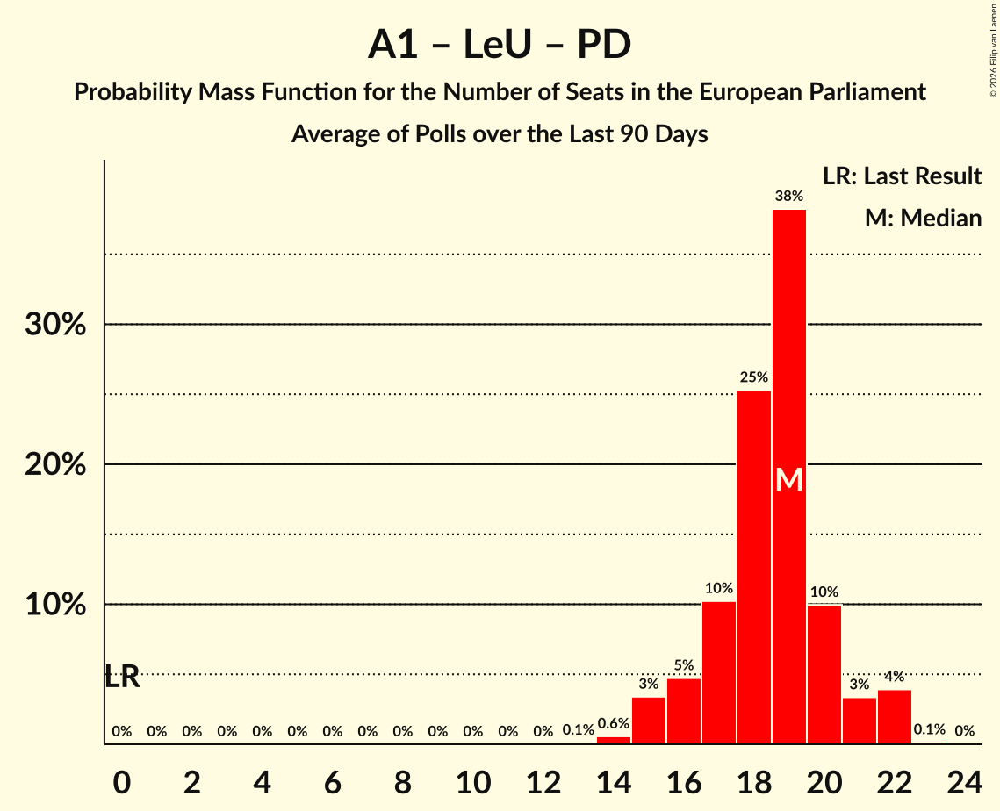

| Number of Seats | Probability | Accumulated | Special Marks |
|:---------------:|:-----------:|:-----------:|:-------------:|
| 0 | 0% | 100% | Last Result |
| 1 | 0% | 100% |  |
| 2 | 0% | 100% |  |
| 3 | 0% | 100% |  |
| 4 | 0% | 100% |  |
| 5 | 0% | 100% |  |
| 6 | 0% | 100% |  |
| 7 | 0% | 100% |  |
| 8 | 0% | 100% |  |
| 9 | 0% | 100% |  |
| 10 | 0% | 100% |  |
| 11 | 0% | 100% |  |
| 12 | 0% | 100% |  |
| 13 | 0.1% | 100% |  |
| 14 | 0.6% | 99.9% |  |
| 15 | 4% | 99.2% |  |
| 16 | 3% | 95% |  |
| 17 | 11% | 92% |  |
| 18 | 26% | 80% |  |
| 19 | 18% | 55% | Median |
| 20 | 20% | 37% |  |
| 21 | 12% | 17% |  |
| 22 | 5% | 5% |  |
| 23 | 0.4% | 0.4% |  |
| 24 | 0% | 0% |  |

### Movimento 5 Stelle (GUE/NGL) – Pace Terra Dignità (GUE/NGL) – Potere al Popolo (GUE/NGL) – Sinistra Italiana (GUE/NGL)

| Number of Seats | Probability | Accumulated | Special Marks |
|:---------------:|:-----------:|:-----------:|:-------------:|
| 0 | 0% | 100% | Last Result |
| 1 | 0% | 100% |  |
| 2 | 0% | 100% |  |
| 3 | 0% | 100% |  |
| 4 | 0% | 100% |  |
| 5 | 0% | 100% |  |
| 6 | 0% | 100% |  |
| 7 | 0% | 100% |  |
| 8 | 0% | 100% |  |
| 9 | 0% | 100% |  |
| 10 | 0.7% | 100% |  |
| 11 | 7% | 99.3% |  |
| 12 | 23% | 93% |  |
| 13 | 28% | 70% | Median |
| 14 | 26% | 42% |  |
| 15 | 7% | 16% |  |
| 16 | 9% | 9% |  |
| 17 | 0.4% | 0.5% |  |
| 18 | 0.1% | 0.1% |  |
| 19 | 0% | 0% |  |

### Forza Italia (EPP) – Noi Moderati (EPP) – Südtiroler Volkspartei (EPP)

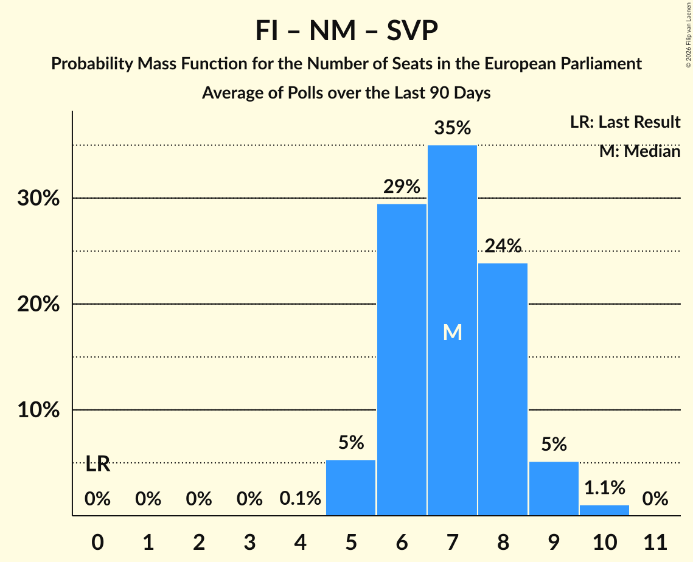

| Number of Seats | Probability | Accumulated | Special Marks |
|:---------------:|:-----------:|:-----------:|:-------------:|
| 0 | 0% | 100% | Last Result |
| 1 | 0% | 100% |  |
| 2 | 0% | 100% |  |
| 3 | 0% | 100% |  |
| 4 | 0% | 100% |  |
| 5 | 4% | 100% |  |
| 6 | 26% | 96% | Median |
| 7 | 44% | 70% |  |
| 8 | 15% | 26% |  |
| 9 | 11% | 11% |  |
| 10 | 0.8% | 0.9% |  |
| 11 | 0% | 0% |  |

### Lega Nord (PfE)

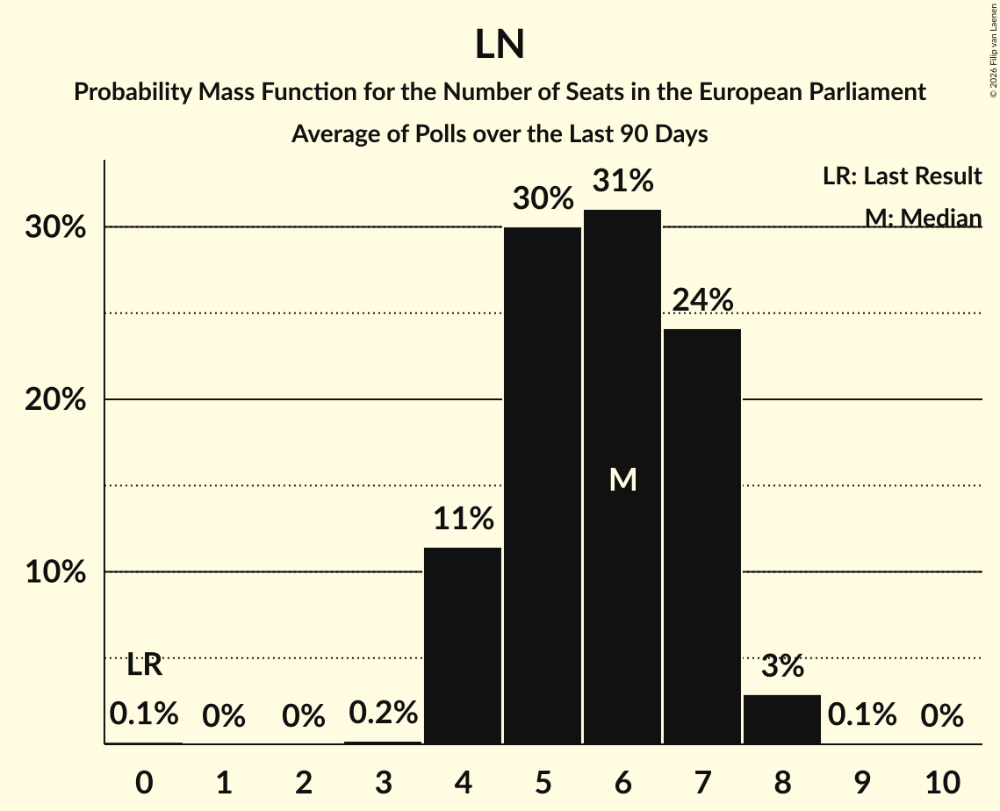

| Number of Seats | Probability | Accumulated | Special Marks |
|:---------------:|:-----------:|:-----------:|:-------------:|
| 0 | 0.1% | 100% | Last Result |
| 1 | 0% | 99.9% |  |
| 2 | 0% | 99.9% |  |
| 3 | 0.1% | 99.9% |  |
| 4 | 12% | 99.8% |  |
| 5 | 23% | 87% |  |
| 6 | 33% | 64% | Median |
| 7 | 19% | 31% |  |
| 8 | 11% | 12% |  |
| 9 | 1.0% | 1.0% |  |
| 10 | 0% | 0% |  |

### Alleanza Verdi e Sinistra (Greens/EFA) – Europa Verde (Greens/EFA)

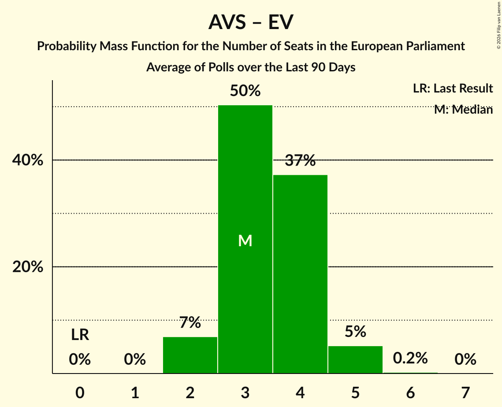

| Number of Seats | Probability | Accumulated | Special Marks |
|:---------------:|:-----------:|:-----------:|:-------------:|
| 0 | 0% | 100% | Last Result |
| 1 | 0% | 100% |  |
| 2 | 4% | 100% |  |
| 3 | 53% | 96% | Median |
| 4 | 36% | 43% |  |
| 5 | 7% | 7% |  |
| 6 | 0.1% | 0.1% |  |
| 7 | 0% | 0% |  |

### CasaPound Italia (NI) – Democrazia Sovrana e Popolare (NI) – Futuro Nazionale (NI) – Impegno Civico (NI) – Insieme per il Futuro (NI) – Italia Sovrana e Popolare (NI)

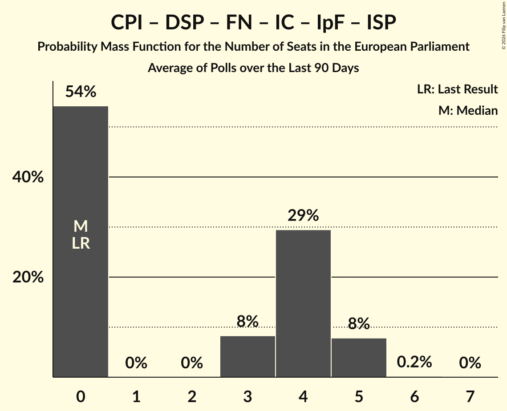

| Number of Seats | Probability | Accumulated | Special Marks |
|:---------------:|:-----------:|:-----------:|:-------------:|
| 0 | 54% | 100% | Last Result, Median |
| 1 | 0% | 46% |  |
| 2 | 0% | 46% |  |
| 3 | 8% | 46% |  |
| 4 | 29% | 38% |  |
| 5 | 8% | 8% |  |
| 6 | 0.2% | 0.2% |  |
| 7 | 0% | 0% |  |

### Azione (RE) – Azione–Italia Viva (RE) – Civica Popolare (RE) – Italia Viva (RE) – Partito Liberaldemocratico (RE) – Più Europa (RE) – Più Europa–Azione (RE) – Stati Uniti d’Europa (RE)

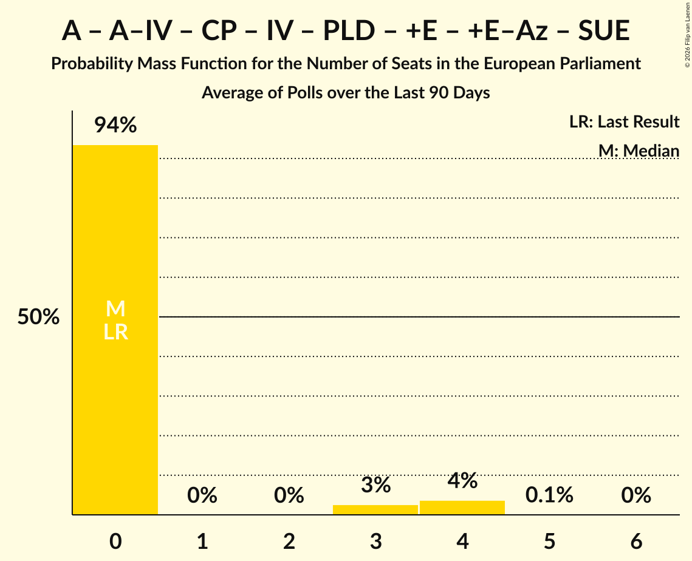

| Number of Seats | Probability | Accumulated | Special Marks |
|:---------------:|:-----------:|:-----------:|:-------------:|
| 0 | 88% | 100% | Last Result, Median |
| 1 | 0% | 12% |  |
| 2 | 0% | 12% |  |
| 3 | 5% | 12% |  |
| 4 | 7% | 7% |  |
| 5 | 0.1% | 0.2% |  |
| 6 | 0% | 0.1% |  |
| 7 | 0% | 0% |  |

### Insieme (*) – Italexit–Per l’Italia con Paragone (*) – Libertà (*) – Partito Progressista (*) – Sud chiama Nord (*)

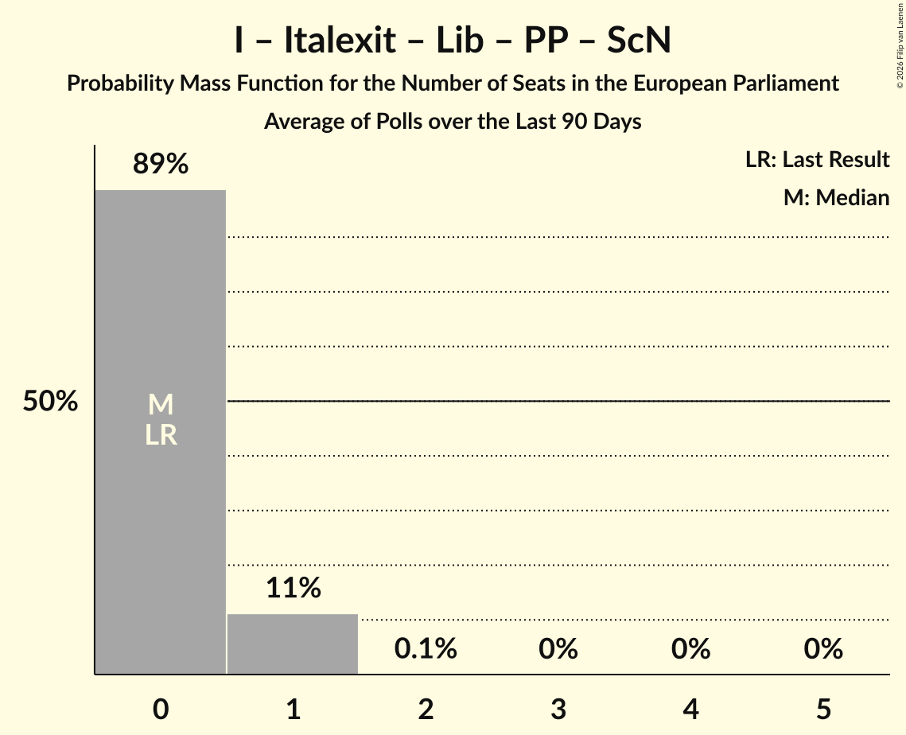

| Number of Seats | Probability | Accumulated | Special Marks |
|:---------------:|:-----------:|:-----------:|:-------------:|
| 0 | 74% | 100% | Last Result, Median |
| 1 | 25% | 26% |  |
| 2 | 0.1% | 0.1% |  |
| 3 | 0% | 0% |  |

## Technical Information

+ **Number of polls included in this average:** 10
+ **Lowest number of simulations done in a poll included in this average:** 2,097,152
+ **Total number of simulations done in the polls included in this average:** 20,971,520
+ **Error estimate:** 3.41%
