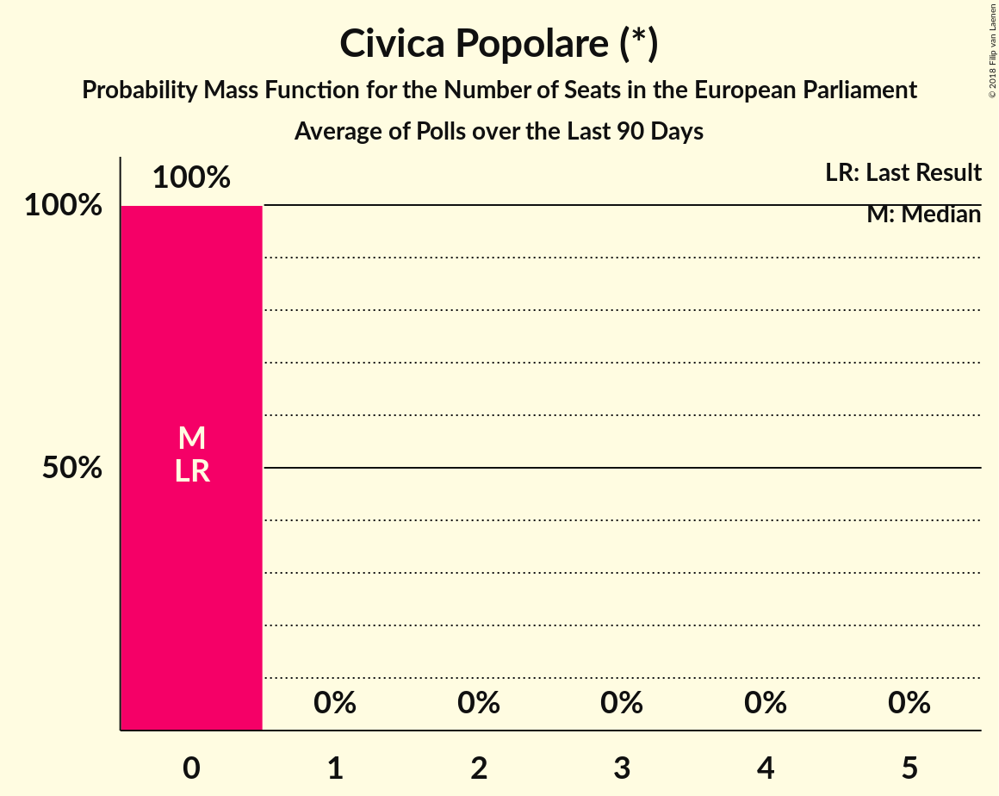

# Poll Average

<a href="#voting-intentions">Voting Intentions</a> | <a href="#seats">Seats</a> | <a href="#coalitions">Coalitions</a> | <a href="#technical-information">Technical Information</a>

## Summary

The table below lists the polls on which the average is based. They are the most recent polls (less than 90 days old) registered and analyzed so far.

| Period     | Polling firm/Commissioner(s) | PD | M5S | FI | LN | FdI | SVP | CPI | CP | I | NcI | +E | LeU | PaP |
|:----------:|:----------------------------:|:--:|:--:|:--:|:--:|:--:|:--:|:--:|:--:|:--:|:--:|:--:|:--:|:--:|
| 25 May 2014 | General Election | 40.8%   31 | 21.1%   17 | 16.8%   13 | 6.2%   5 | 3.7%   0 | 0.5%   1 | 0.0%   0 | 0.0%   0 | 0.0%   0 | 0.0%   0 | 0.0%   0 | 0.0%   0 | 0.0%   0 |
| N/A | Poll Average | 16–25%   12–19 | 26–37%   22–31 | 10–19%   8–15 | 12–24%   10–20 | 3–6%   0–5 | N/A   N/A | 0–2%   0 | 0–2%   0 | 0–2%   0 | 0–3%   0 | 1–3%   0 | 2–6%   0–5 | 1–3%   0 |
| [18–19 April 2018](2018-04-19-Ipsos.html) | Ipsos   Corriere della Sera | 17–22%   13–17 | 31–36%   25–30 | 11–15%   9–12 | 17–22%   14–18 | 3–6%   0–5 | N/A   N/A | N/A   N/A | N/A   N/A | N/A   N/A | 0–2%   0 | 1–3%   0 | 2–4%   0 | N/A   N/A |
| [16–18 April 2018](2018-04-18-SWG.html) | SWG | 17–21%   13–17 | 31–35%   25–30 | 9–12%   8–10 | 21–25%   18–22 | 4–5%   0–5 | N/A   N/A | N/A   N/A | N/A   N/A | N/A   N/A | 0–1%   0 | 1–3%   0 | 2–3%   0 | 1–2%   0 |
| [13 April 2018](2018-04-13-Euromedia.html) | Euromedia   Rete 4 | 16–20%   12–16 | 31–37%   25–31 | 11–15%   9–12 | 18–23%   15–19 | 3–5%   0–4 | N/A   N/A | N/A   N/A | N/A   N/A | N/A   N/A | 0–1%   0 | 1–3%   0 | 2–4%   0–3 | N/A   N/A |
| [9–11 April 2018](2018-04-11-Ixè.html) | Ixè   Huffington Post | 14–19%   11–15 | 31–37%   26–32 | 10–14%   9–12 | 19–24%   15–20 | 3–6%   0–5 | N/A   N/A | N/A   N/A | N/A   N/A | N/A   N/A | 0–1%   0 | 1–2%   0 | 3–5%   0–4 | 2–4%   0 |
| [11 April 2018](2018-04-11-IndexResearch.html) | Index Research   LA7 | 16–21%   11–16 | 31–37%   24–30 | 10–14%   8–11 | 20–26%   16–21 | 3–5%   0–4 | N/A   N/A | N/A   N/A | N/A   N/A | N/A   N/A | 0–1%   0 | N/A   N/A | 1–3%   0 | N/A   N/A |
| [3 April 2018](2018-04-03-Tecnè.html) | Tecnè   Canale 5 | 16–21%   12–16 | 31–37%   25–30 | 11–15%   9–13 | 17–22%   14–18 | 3–5%   0–4 | N/A   N/A | N/A   N/A | N/A   N/A | N/A   N/A | N/A   N/A | 1–3%   0 | 2–4%   0 | N/A   N/A |
| [2–3 April 2018](2018-04-03-Demopolis.html) | Demopolis   LA7 | 16–20%   11–15 | 33–37%   25–30 | 11–14%   9–11 | 18–22%   14–17 | 4–6%   0–4 | N/A   N/A | N/A   N/A | N/A   N/A | N/A   N/A | N/A   N/A | N/A   N/A | 2–4%   0 | N/A   N/A |
| [28 March 2018](2018-03-28-Piepoli.html) | Piepoli | 14–21%   11–16 | 30–38%   24–31 | 11–17%   9–14 | 16–23%   13–18 | 3–6%   0–5 | N/A   N/A | N/A   N/A | N/A   N/A | N/A   N/A | 0–2%   0 | 1–4%   0 | 1–4%   0–3 | N/A   N/A |
| [21–25 March 2018](2018-03-25-Bidimedia.html) | Bidimedia | 16–21%   12–17 | 30–37%   26–32 | 11–15%   9–13 | 17–22%   14–19 | 3–6%   0–5 | N/A   N/A | 1–2%   0 | N/A   N/A | N/A   N/A | 1–2%   0 | 1–3%   0 | 2–4%   0–4 | 1–2%   0 |
| [12–15 March 2018](2018-03-15-DemosPi.html) | Demos & Pi   La Repubblica | 16–21%   12–15 | 31–36%   24–29 | 11–15%   9–12 | 16–20%   13–16 | 4–6%   0–5 | N/A   N/A | N/A   N/A | N/A   N/A | N/A   N/A | N/A   N/A | 1–3%   0 | 3–5%   0–4 | N/A   N/A |
| [12–16 February 2018](2018-02-16-TermometroPolitico.html) | Termometro Politico | 20–23%   16–18 | 25–28%   21–23 | 15–17%   13–14 | 14–16%   12–14 | 4–6%   4–5 | N/A   N/A | 1–2%   0 | 1%   0 | 1%   0 | 1–2%   0 | 2–3%   0 | 5–6%   4–5 | 1–2%   0 |
| [12–14 February 2018](2018-02-14-Index.html) | Index | 20–26%   16–21 | 25–31%   21–25 | 14–19%   12–16 | 12–16%   10–14 | 4–7%   0–5 | N/A   N/A | N/A   N/A | 1–2%   0 | 1–2%   0 | 2–4%   0 | 1–4%   0 | 4–8%   4–6 | N/A   N/A |
| [5–14 February 2018](2018-02-14-Demetra.html) | Demetra | 23–25%   18–19 | 28–31%   23–25 | 14–16%   12–13 | 14–16%   11–13 | 4–5%   3–4 | N/A   N/A | 0–1%   0 | 0–1%   0 | 0–1%   0 | 0–1%   0 | 2–3%   0 | 5–6%   4–5 | 1–2%   0 |
| [8–11 February 2018](2018-02-11-LorienConsulting.html) | Lorien Consulting | 21–26%   16–21 | 25–30%   20–26 | 16–20%   13–17 | 10–14%   9–12 | 3–6%   0–5 | N/A   N/A | 1–2%   0 | 1–2%   0 | 0–2%   0 | 1–2%   0 | 1–2%   0 | 4–7%   0–5 | 2–4%   0–4 |
| [9–11 February 2018](2018-02-11-EMG.html) | EMG   TG LA7 | 21–25%   17–20 | 25–30%   21–27 | 14–18%   12–16 | 12–16%   11–13 | 4–6%   0–5 | N/A   N/A | 0–1%   0 | 1–2%   0 | 1–2%   0 | 2–4%   0 | 2–3%   0 | 4–6%   4–5 | 0–1%   0 |
| 25 May 2014 | General Election | 40.8%   31 | 21.1%   17 | 16.8%   13 | 6.2%   5 | 3.7%   0 | 0.5%   1 | 0.0%   0 | 0.0%   0 | 0.0%   0 | 0.0%   0 | 0.0%   0 | 0.0%   0 | 0.0%   0 |

Only polls for which at least the sample size has been published are included in the table above.

**Legend:**
+ **Top half of each row:** Voting intentions (95% confidence interval)
+ **Bottom half of each row:** Seat projections for the European Parliament (95% confidence interval)
+ **PD:** Partito Democratico (S&D)
+ **M5S:** Movimento 5 Stelle (EFDD)
+ **FI:** Forza Italia (EPP)
+ **LN:** Lega Nord (ENF)
+ **FdI:** Fratelli d’Italia (*)
+ **SVP:** Südtiroler Volkspartei (EPP)
+ **CPI:** CasaPound Italia (*)
+ **CP:** Civica Popolare (*)
+ **I:** Insieme (*)
+ **NcI:** Noi con l’Italia (EPP)
+ **+E:** Più Europa (ALDE)
+ **LeU:** Liberi e Uguali (S&D)
+ **PaP:** Potere al Popolo (GUE/NGL)
+ **N/A (single party):** Party not included the published results
+ **N/A (entire row):** Calculation for this opinion poll not started yet

## Voting Intentions

### Confidence Intervals

| Party | Last Result | Median | 80% Confidence Interval | 90% Confidence Interval | 95% Confidence Interval | 99% Confidence Interval |
|:-----:|:-----------:|:------:|:-----------------------:|:-----------------------:|:-----------------------:|:-----------------------:|
| <a href="#partito-democratico-(s&d)">Partito Democratico (S&D)</a> | 40.8% | 19.2% | 16.7–23.7% |16.1–24.2% | 15.6–24.7% | 14.6–25.9% |
| <a href="#movimento-5-stelle-(efdd)">Movimento 5 Stelle (EFDD)</a> | 21.1% | 32.8% | 26.7–35.6% |26.1–36.2% | 25.6–36.8% | 24.8–37.9% |
| <a href="#forza-italia-(epp)">Forza Italia (EPP)</a> | 16.8% | 13.4% | 11.1–16.8% |10.5–17.8% | 10.1–18.6% | 9.4–19.8% |
| <a href="#lega-nord-(enf)">Lega Nord (ENF)</a> | 6.2% | 19.1% | 13.4–22.7% |12.5–23.6% | 11.9–24.2% | 10.9–25.3% |
| <a href="#fratelli-d’italia-(*)">Fratelli d’Italia (*)</a> | 3.7% | 4.5% | 3.6–5.4% |3.3–5.6% | 3.1–5.9% | 2.6–6.5% |
| <a href="#südtiroler-volkspartei-(epp)">Südtiroler Volkspartei (EPP)</a> | 0.5% | N/A | N/A |N/A | N/A | N/A |
| <a href="#casapound-italia-(*)">CasaPound Italia (*)</a> | 0.0% | 1.1% | 0.5–1.9% |0.5–2.1% | 0.4–2.2% | 0.3–2.5% |
| <a href="#civica-popolare-(*)">Civica Popolare (*)</a> | 0.0% | 1.0% | 0.6–1.8% |0.5–2.0% | 0.5–2.2% | 0.4–2.6% |
| <a href="#insieme-(*)">Insieme (*)</a> | 0.0% | 0.9% | 0.5–1.7% |0.4–1.9% | 0.4–2.1% | 0.3–2.4% |
| <a href="#noi-con-l’italia-(epp)">Noi con l’Italia (EPP)</a> | 0.0% | 1.0% | 0.5–2.6% |0.4–2.9% | 0.3–3.2% | 0.2–3.7% |
| <a href="#più-europa-(alde)">Più Europa (ALDE)</a> | 0.0% | 2.1% | 1.3–2.8% |1.2–3.0% | 1.0–3.2% | 0.8–3.6% |
| <a href="#liberi-e-uguali-(s&d)">Liberi e Uguali (S&D)</a> | 0.0% | 3.5% | 2.2–5.6% |1.9–6.0% | 1.7–6.4% | 1.4–7.2% |
| <a href="#potere-al-popolo-(gue/ngl)">Potere al Popolo (GUE/NGL)</a> | 0.0% | 1.5% | 0.8–2.8% |0.7–3.1% | 0.6–3.4% | 0.5–3.9% |

### Partito Democratico (S&D)

*For a full overview of the results for this party, see the [Partito Democratico (S&D)](party-partitodemocraticosd.html) page.*

| Voting Intentions | Probability | Accumulated | Special Marks |
|:-----------------:|:-----------:|:-----------:|:-------------:|
| 12.5–13.5% | 0.1% | 100% |  |
| 13.5–14.5% | 0.4% | 99.9% |  |
| 14.5–15.5% | 2% | 99.5% |  |
| 15.5–16.5% | 6% | 98% |  |
| 16.5–17.5% | 13% | 91% |  |
| 17.5–18.5% | 18% | 79% |  |
| 18.5–19.5% | 16% | 60% | Median |
| 19.5–20.5% | 9% | 44% |  |
| 20.5–21.5% | 8% | 35% |  |
| 21.5–22.5% | 7% | 27% |  |
| 22.5–23.5% | 9% | 20% |  |
| 23.5–24.5% | 8% | 11% |  |
| 24.5–25.5% | 2% | 3% |  |
| 25.5–26.5% | 0.7% | 0.8% |  |
| 26.5–27.5% | 0.1% | 0.2% |  |
| 27.5–28.5% | 0% | 0% |  |
| 28.5–29.5% | 0% | 0% |  |
| 29.5–30.5% | 0% | 0% |  |
| 30.5–31.5% | 0% | 0% |  |
| 31.5–32.5% | 0% | 0% |  |
| 32.5–33.5% | 0% | 0% |  |
| 33.5–34.5% | 0% | 0% |  |
| 34.5–35.5% | 0% | 0% |  |
| 35.5–36.5% | 0% | 0% |  |
| 36.5–37.5% | 0% | 0% |  |
| 37.5–38.5% | 0% | 0% |  |
| 38.5–39.5% | 0% | 0% |  |
| 39.5–40.5% | 0% | 0% |  |
| 40.5–41.5% | 0% | 0% | Last Result |

### Movimento 5 Stelle (EFDD)

*For a full overview of the results for this party, see the [Movimento 5 Stelle (EFDD)](party-movimento5stelleefdd.html) page.*

| Voting Intentions | Probability | Accumulated | Special Marks |
|:-----------------:|:-----------:|:-----------:|:-------------:|
| 20.5–21.5% | 0% | 100% | Last Result |
| 21.5–22.5% | 0% | 100% |  |
| 22.5–23.5% | 0% | 100% |  |
| 23.5–24.5% | 0.3% | 100% |  |
| 24.5–25.5% | 2% | 99.7% |  |
| 25.5–26.5% | 7% | 98% |  |
| 26.5–27.5% | 8% | 91% |  |
| 27.5–28.5% | 6% | 83% |  |
| 28.5–29.5% | 7% | 77% |  |
| 29.5–30.5% | 4% | 71% |  |
| 30.5–31.5% | 4% | 66% |  |
| 31.5–32.5% | 9% | 62% |  |
| 32.5–33.5% | 15% | 54% | Median |
| 33.5–34.5% | 16% | 39% |  |
| 34.5–35.5% | 12% | 23% |  |
| 35.5–36.5% | 7% | 10% |  |
| 36.5–37.5% | 3% | 3% |  |
| 37.5–38.5% | 0.7% | 0.9% |  |
| 38.5–39.5% | 0.2% | 0.2% |  |
| 39.5–40.5% | 0% | 0% |  |

### Forza Italia (EPP)

*For a full overview of the results for this party, see the [Forza Italia (EPP)](party-forzaitaliaepp.html) page.*

| Voting Intentions | Probability | Accumulated | Special Marks |
|:-----------------:|:-----------:|:-----------:|:-------------:|
| 7.5–8.5% | 0% | 100% |  |
| 8.5–9.5% | 0.8% | 100% |  |
| 9.5–10.5% | 5% | 99.2% |  |
| 10.5–11.5% | 10% | 95% |  |
| 11.5–12.5% | 17% | 85% |  |
| 12.5–13.5% | 19% | 67% | Median |
| 13.5–14.5% | 12% | 48% |  |
| 14.5–15.5% | 12% | 36% |  |
| 15.5–16.5% | 11% | 24% |  |
| 16.5–17.5% | 6% | 12% | Last Result |
| 17.5–18.5% | 4% | 6% |  |
| 18.5–19.5% | 2% | 3% |  |
| 19.5–20.5% | 0.6% | 0.7% |  |
| 20.5–21.5% | 0.1% | 0.1% |  |
| 21.5–22.5% | 0% | 0% |  |

### Lega Nord (ENF)

*For a full overview of the results for this party, see the [Lega Nord (ENF)](party-leganordenf.html) page.*

| Voting Intentions | Probability | Accumulated | Special Marks |
|:-----------------:|:-----------:|:-----------:|:-------------:|
| 5.5–6.5% | 0% | 100% | Last Result |
| 6.5–7.5% | 0% | 100% |  |
| 7.5–8.5% | 0% | 100% |  |
| 8.5–9.5% | 0% | 100% |  |
| 9.5–10.5% | 0.2% | 100% |  |
| 10.5–11.5% | 1.4% | 99.8% |  |
| 11.5–12.5% | 3% | 98% |  |
| 12.5–13.5% | 6% | 95% |  |
| 13.5–14.5% | 10% | 89% |  |
| 14.5–15.5% | 11% | 79% |  |
| 15.5–16.5% | 2% | 68% |  |
| 16.5–17.5% | 3% | 66% |  |
| 17.5–18.5% | 7% | 63% |  |
| 18.5–19.5% | 12% | 56% | Median |
| 19.5–20.5% | 14% | 44% |  |
| 20.5–21.5% | 11% | 30% |  |
| 21.5–22.5% | 8% | 19% |  |
| 22.5–23.5% | 6% | 11% |  |
| 23.5–24.5% | 4% | 5% |  |
| 24.5–25.5% | 1.2% | 2% |  |
| 25.5–26.5% | 0.3% | 0.3% |  |
| 26.5–27.5% | 0.1% | 0.1% |  |
| 27.5–28.5% | 0% | 0% |  |

### Fratelli d’Italia (*)

*For a full overview of the results for this party, see the [Fratelli d’Italia (*)](party-fratellid’italia.html) page.*

| Voting Intentions | Probability | Accumulated | Special Marks |
|:-----------------:|:-----------:|:-----------:|:-------------:|
| 0.5–1.5% | 0% | 100% |  |
| 1.5–2.5% | 0.3% | 100% |  |
| 2.5–3.5% | 9% | 99.7% |  |
| 3.5–4.5% | 45% | 91% | Last Result, Median |
| 4.5–5.5% | 39% | 46% |  |
| 5.5–6.5% | 6% | 6% |  |
| 6.5–7.5% | 0.4% | 0.4% |  |
| 7.5–8.5% | 0% | 0% |  |

### Liberi e Uguali (S&D)

*For a full overview of the results for this party, see the [Liberi e Uguali (S&D)](party-liberieugualisd.html) page.*

| Voting Intentions | Probability | Accumulated | Special Marks |
|:-----------------:|:-----------:|:-----------:|:-------------:|
| 0.0–0.5% | 0% | 100% | Last Result |
| 0.5–1.5% | 1.2% | 100% |  |
| 1.5–2.5% | 20% | 98.8% |  |
| 2.5–3.5% | 30% | 79% | Median |
| 3.5–4.5% | 15% | 48% |  |
| 4.5–5.5% | 22% | 34% |  |
| 5.5–6.5% | 10% | 11% |  |
| 6.5–7.5% | 2% | 2% |  |
| 7.5–8.5% | 0.2% | 0.3% |  |
| 8.5–9.5% | 0% | 0% |  |

### Più Europa (ALDE)

*For a full overview of the results for this party, see the [Più Europa (ALDE)](party-piùeuropaalde.html) page.*

| Voting Intentions | Probability | Accumulated | Special Marks |
|:-----------------:|:-----------:|:-----------:|:-------------:|
| 0.0–0.5% | 0% | 100% | Last Result |
| 0.5–1.5% | 17% | 100% |  |
| 1.5–2.5% | 58% | 83% | Median |
| 2.5–3.5% | 24% | 25% |  |
| 3.5–4.5% | 0.5% | 0.6% |  |
| 4.5–5.5% | 0% | 0% |  |

### Noi con l’Italia (EPP)

*For a full overview of the results for this party, see the [Noi con l’Italia (EPP)](party-noiconl’italiaepp.html) page.*

| Voting Intentions | Probability | Accumulated | Special Marks |
|:-----------------:|:-----------:|:-----------:|:-------------:|
| 0.0–0.5% | 17% | 100% | Last Result |
| 0.5–1.5% | 54% | 83% | Median |
| 1.5–2.5% | 20% | 30% |  |
| 2.5–3.5% | 9% | 10% |  |
| 3.5–4.5% | 0.7% | 0.7% |  |
| 4.5–5.5% | 0% | 0% |  |

### Potere al Popolo (GUE/NGL)

*For a full overview of the results for this party, see the [Potere al Popolo (GUE/NGL)](party-poterealpopologuengl.html) page.*

| Voting Intentions | Probability | Accumulated | Special Marks |
|:-----------------:|:-----------:|:-----------:|:-------------:|
| 0.0–0.5% | 1.3% | 100% | Last Result |
| 0.5–1.5% | 49% | 98.7% |  |
| 1.5–2.5% | 34% | 50% | Median |
| 2.5–3.5% | 14% | 16% |  |
| 3.5–4.5% | 1.5% | 1.5% |  |
| 4.5–5.5% | 0% | 0% |  |

### CasaPound Italia (*)

*For a full overview of the results for this party, see the [CasaPound Italia (*)](party-casapounditalia.html) page.*

| Voting Intentions | Probability | Accumulated | Special Marks |
|:-----------------:|:-----------:|:-----------:|:-------------:|
| 0.0–0.5% | 11% | 100% | Last Result |
| 0.5–1.5% | 57% | 89% | Median |
| 1.5–2.5% | 31% | 31% |  |
| 2.5–3.5% | 0.4% | 0.4% |  |
| 3.5–4.5% | 0% | 0% |  |

### Insieme (*)

*For a full overview of the results for this party, see the [Insieme (*)](party-insieme.html) page.*

| Voting Intentions | Probability | Accumulated | Special Marks |
|:-----------------:|:-----------:|:-----------:|:-------------:|
| 0.0–0.5% | 16% | 100% | Last Result |
| 0.5–1.5% | 69% | 84% | Median |
| 1.5–2.5% | 15% | 15% |  |
| 2.5–3.5% | 0.2% | 0.2% |  |
| 3.5–4.5% | 0% | 0% |  |

### Civica Popolare (*)

*For a full overview of the results for this party, see the [Civica Popolare (*)](party-civicapopolare.html) page.*

| Voting Intentions | Probability | Accumulated | Special Marks |
|:-----------------:|:-----------:|:-----------:|:-------------:|
| 0.0–0.5% | 6% | 100% | Last Result |
| 0.5–1.5% | 78% | 94% | Median |
| 1.5–2.5% | 16% | 17% |  |
| 2.5–3.5% | 0.5% | 0.5% |  |
| 3.5–4.5% | 0% | 0% |  |

## Seats

### Confidence Intervals

| Party | Last Result | Median | 80% Confidence Interval | 90% Confidence Interval | 95% Confidence Interval | 99% Confidence Interval |
|:-----:|:-----------:|:------:|:-----------------------:|:-----------------------:|:-----------------------:|:-----------------------:|
| <a href="#partito-democratico-(s&d)">Partito Democratico (S&D)</a> | 31 | 15 | 12–19 |12–19 | 12–19 | 11–21 |
| <a href="#movimento-5-stelle-(efdd)">Movimento 5 Stelle (EFDD)</a> | 17 | 27 | 23–29 |22–30 | 22–31 | 21–32 |
| <a href="#forza-italia-(epp)">Forza Italia (EPP)</a> | 13 | 11 | 9–14 |9–15 | 8–15 | 8–16 |
| <a href="#lega-nord-(enf)">Lega Nord (ENF)</a> | 5 | 15 | 11–19 |10–20 | 10–20 | 9–21 |
| <a href="#fratelli-d’italia-(*)">Fratelli d’Italia (*)</a> | 0 | 4 | 0–4 |0–5 | 0–5 | 0–5 |
| <a href="#südtiroler-volkspartei-(epp)">Südtiroler Volkspartei (EPP)</a> | 1 | N/A | N/A |N/A | N/A | N/A |
| <a href="#casapound-italia-(*)">CasaPound Italia (*)</a> | 0 | 0 | 0 |0 | 0 | 0 |
| <a href="#civica-popolare-(*)">Civica Popolare (*)</a> | 0 | 0 | 0 |0 | 0 | 0 |
| <a href="#insieme-(*)">Insieme (*)</a> | 0 | 0 | 0 |0 | 0 | 0 |
| <a href="#noi-con-l’italia-(epp)">Noi con l’Italia (EPP)</a> | 0 | 0 | 0 |0 | 0 | 0 |
| <a href="#più-europa-(alde)">Più Europa (ALDE)</a> | 0 | 0 | 0 |0 | 0 | 0 |
| <a href="#liberi-e-uguali-(s&d)">Liberi e Uguali (S&D)</a> | 0 | 0 | 0–5 |0–5 | 0–5 | 0–6 |
| <a href="#potere-al-popolo-(gue/ngl)">Potere al Popolo (GUE/NGL)</a> | 0 | 0 | 0 |0 | 0 | 0–4 |

### Partito Democratico (S&D)

*For a full overview of the results for this party, see the [Partito Democratico (S&D)](party-partitodemocraticosd.html) page.*

| Number of Seats | Probability | Accumulated | Special Marks |
|:---------------:|:-----------:|:-----------:|:-------------:|
| 10 | 0.2% | 100% |  |
| 11 | 2% | 99.8% |  |
| 12 | 8% | 98% |  |
| 13 | 19% | 90% |  |
| 14 | 17% | 71% |  |
| 15 | 13% | 54% | Median |
| 16 | 7% | 40% |  |
| 17 | 6% | 33% |  |
| 18 | 16% | 27% |  |
| 19 | 8% | 11% |  |
| 20 | 1.1% | 2% |  |
| 21 | 1.0% | 1.1% |  |
| 22 | 0.1% | 0.2% |  |
| 23 | 0% | 0% |  |
| 24 | 0% | 0% |  |
| 25 | 0% | 0% |  |
| 26 | 0% | 0% |  |
| 27 | 0% | 0% |  |
| 28 | 0% | 0% |  |
| 29 | 0% | 0% |  |
| 30 | 0% | 0% |  |
| 31 | 0% | 0% | Last Result |

### Movimento 5 Stelle (EFDD)

*For a full overview of the results for this party, see the [Movimento 5 Stelle (EFDD)](party-movimento5stelleefdd.html) page.*

| Number of Seats | Probability | Accumulated | Special Marks |
|:---------------:|:-----------:|:-----------:|:-------------:|
| 17 | 0% | 100% | Last Result |
| 18 | 0% | 100% |  |
| 19 | 0% | 100% |  |
| 20 | 0.4% | 100% |  |
| 21 | 2% | 99.6% |  |
| 22 | 4% | 98% |  |
| 23 | 13% | 94% |  |
| 24 | 10% | 81% |  |
| 25 | 8% | 71% |  |
| 26 | 11% | 63% |  |
| 27 | 17% | 52% | Median |
| 28 | 17% | 35% |  |
| 29 | 11% | 18% |  |
| 30 | 5% | 7% |  |
| 31 | 2% | 3% |  |
| 32 | 0.9% | 1.1% |  |
| 33 | 0.2% | 0.2% |  |
| 34 | 0% | 0% |  |

### Forza Italia (EPP)

*For a full overview of the results for this party, see the [Forza Italia (EPP)](party-forzaitaliaepp.html) page.*

| Number of Seats | Probability | Accumulated | Special Marks |
|:---------------:|:-----------:|:-----------:|:-------------:|
| 7 | 0.2% | 100% |  |
| 8 | 4% | 99.8% |  |
| 9 | 14% | 96% |  |
| 10 | 22% | 82% |  |
| 11 | 18% | 60% | Median |
| 12 | 14% | 43% |  |
| 13 | 17% | 29% | Last Result |
| 14 | 6% | 12% |  |
| 15 | 4% | 6% |  |
| 16 | 2% | 2% |  |
| 17 | 0.3% | 0.4% |  |
| 18 | 0% | 0.1% |  |
| 19 | 0% | 0% |  |

### Lega Nord (ENF)

*For a full overview of the results for this party, see the [Lega Nord (ENF)](party-leganordenf.html) page.*

| Number of Seats | Probability | Accumulated | Special Marks |
|:---------------:|:-----------:|:-----------:|:-------------:|
| 5 | 0% | 100% | Last Result |
| 6 | 0% | 100% |  |
| 7 | 0% | 100% |  |
| 8 | 0.1% | 100% |  |
| 9 | 1.4% | 99.9% |  |
| 10 | 4% | 98.6% |  |
| 11 | 7% | 95% |  |
| 12 | 17% | 88% |  |
| 13 | 6% | 71% |  |
| 14 | 6% | 65% |  |
| 15 | 12% | 60% | Median |
| 16 | 14% | 47% |  |
| 17 | 11% | 33% |  |
| 18 | 10% | 22% |  |
| 19 | 7% | 13% |  |
| 20 | 3% | 5% |  |
| 21 | 2% | 2% |  |
| 22 | 0.3% | 0.3% |  |
| 23 | 0% | 0% |  |

### Fratelli d’Italia (*)

*For a full overview of the results for this party, see the [Fratelli d’Italia (*)](party-fratellid’italia.html) page.*

| Number of Seats | Probability | Accumulated | Special Marks |
|:---------------:|:-----------:|:-----------:|:-------------:|
| 0 | 24% | 100% | Last Result |
| 1 | 0% | 76% |  |
| 2 | 0% | 76% |  |
| 3 | 15% | 76% |  |
| 4 | 52% | 61% | Median |
| 5 | 9% | 9% |  |
| 6 | 0.3% | 0.3% |  |
| 7 | 0% | 0% |  |

### Liberi e Uguali (S&D)

*For a full overview of the results for this party, see the [Liberi e Uguali (S&D)](party-liberieugualisd.html) page.*

| Number of Seats | Probability | Accumulated | Special Marks |
|:---------------:|:-----------:|:-----------:|:-------------:|
| 0 | 60% | 100% | Last Result, Median |
| 1 | 0% | 40% |  |
| 2 | 0% | 40% |  |
| 3 | 4% | 40% |  |
| 4 | 19% | 37% |  |
| 5 | 17% | 18% |  |
| 6 | 1.0% | 1.1% |  |
| 7 | 0.1% | 0.1% |  |
| 8 | 0% | 0% |  |

### Più Europa (ALDE)

*For a full overview of the results for this party, see the [Più Europa (ALDE)](party-piùeuropaalde.html) page.*

| Number of Seats | Probability | Accumulated | Special Marks |
|:---------------:|:-----------:|:-----------:|:-------------:|
| 0 | 99.9% | 100% | Last Result, Median |
| 1 | 0% | 0.1% |  |
| 2 | 0% | 0.1% |  |
| 3 | 0.1% | 0.1% |  |
| 4 | 0% | 0% |  |

### Noi con l’Italia (EPP)

*For a full overview of the results for this party, see the [Noi con l’Italia (EPP)](party-noiconl’italiaepp.html) page.*

| Number of Seats | Probability | Accumulated | Special Marks |
|:---------------:|:-----------:|:-----------:|:-------------:|
| 0 | 100% | 100% | Last Result, Median |

### Potere al Popolo (GUE/NGL)

*For a full overview of the results for this party, see the [Potere al Popolo (GUE/NGL)](party-poterealpopologuengl.html) page.*

| Number of Seats | Probability | Accumulated | Special Marks |
|:---------------:|:-----------:|:-----------:|:-------------:|
| 0 | 98.7% | 100% | Last Result, Median |
| 1 | 0% | 1.3% |  |
| 2 | 0% | 1.3% |  |
| 3 | 0.7% | 1.3% |  |
| 4 | 0.6% | 0.6% |  |
| 5 | 0% | 0% |  |

### CasaPound Italia (*)

*For a full overview of the results for this party, see the [CasaPound Italia (*)](party-casapounditalia.html) page.*

| Number of Seats | Probability | Accumulated | Special Marks |
|:---------------:|:-----------:|:-----------:|:-------------:|
| 0 | 100% | 100% | Last Result, Median |

### Insieme (*)

*For a full overview of the results for this party, see the [Insieme (*)](party-insieme.html) page.*

| Number of Seats | Probability | Accumulated | Special Marks |
|:---------------:|:-----------:|:-----------:|:-------------:|
| 0 | 100% | 100% | Last Result, Median |

### Civica Popolare (*)

*For a full overview of the results for this party, see the [Civica Popolare (*)](party-civicapopolare.html) page.*

| Number of Seats | Probability | Accumulated | Special Marks |
|:---------------:|:-----------:|:-----------:|:-------------:|
| 0 | 100% | 100% | Last Result, Median |

## Coalitions

### Confidence Intervals

| Coalition | Last Result | Median | Majority? | 80% Confidence Interval | 90% Confidence Interval | 95% Confidence Interval | 99% Confidence Interval |
|:---------:|:-----------:|:------:|:---------:|:-----------------------:|:-----------------------:|:-----------------------:|:-----------------------:|
| Movimento 5 Stelle (EFDD) | 17 | 27 | 0% | 23–29 | 22–30 | 22–31 | 21–32 |
| Partito Democratico (S&D) – Liberi e Uguali (S&D) | 31 | 15 | 0% | 13–23 | 12–23 | 12–24 | 11–26 |
| Lega Nord (ENF) | 5 | 15 | 0% | 11–19 | 10–20 | 10–20 | 9–21 |
| Forza Italia (EPP) – Südtiroler Volkspartei (EPP) – Noi con l’Italia (EPP) | 14 | 12 | 0% | 10–15 | 10–16 | 9–16 | 9–17 |
| Fratelli d’Italia (*) – CasaPound Italia (*) – Civica Popolare (*) – Insieme (*) | 0 | 4 | 0% | 0–4 | 0–5 | 0–5 | 0–5 |
| Più Europa (ALDE) | 0 | 0 | 0% | 0 | 0 | 0 | 0 |
| Potere al Popolo (GUE/NGL) | 0 | 0 | 0% | 0 | 0 | 0 | 0–3 |

### Movimento 5 Stelle (EFDD)

| Number of Seats | Probability | Accumulated | Special Marks |
|:---------------:|:-----------:|:-----------:|:-------------:|
| 17 | 0% | 100% | Last Result |
| 18 | 0% | 100% |  |
| 19 | 0% | 100% |  |
| 20 | 0.4% | 100% |  |
| 21 | 2% | 99.6% |  |
| 22 | 4% | 98% |  |
| 23 | 13% | 94% |  |
| 24 | 10% | 81% |  |
| 25 | 8% | 71% |  |
| 26 | 11% | 63% |  |
| 27 | 17% | 52% | Median |
| 28 | 17% | 35% |  |
| 29 | 11% | 18% |  |
| 30 | 5% | 7% |  |
| 31 | 2% | 3% |  |
| 32 | 0.9% | 1.1% |  |
| 33 | 0.2% | 0.2% |  |
| 34 | 0% | 0% |  |

### Partito Democratico (S&D) – Liberi e Uguali (S&D)

| Number of Seats | Probability | Accumulated | Special Marks |
|:---------------:|:-----------:|:-----------:|:-------------:|
| 10 | 0.2% | 100% |  |
| 11 | 1.4% | 99.8% |  |
| 12 | 7% | 98% |  |
| 13 | 16% | 92% |  |
| 14 | 16% | 76% |  |
| 15 | 14% | 60% | Median |
| 16 | 8% | 46% |  |
| 17 | 3% | 39% |  |
| 18 | 2% | 35% |  |
| 19 | 0.4% | 34% |  |
| 20 | 0.8% | 33% |  |
| 21 | 3% | 32% |  |
| 22 | 8% | 29% |  |
| 23 | 16% | 21% |  |
| 24 | 3% | 5% |  |
| 25 | 1.2% | 2% |  |
| 26 | 0.5% | 0.5% |  |
| 27 | 0% | 0.1% |  |
| 28 | 0% | 0% |  |
| 29 | 0% | 0% |  |
| 30 | 0% | 0% |  |
| 31 | 0% | 0% | Last Result |

### Lega Nord (ENF)

| Number of Seats | Probability | Accumulated | Special Marks |
|:---------------:|:-----------:|:-----------:|:-------------:|
| 5 | 0% | 100% | Last Result |
| 6 | 0% | 100% |  |
| 7 | 0% | 100% |  |
| 8 | 0.1% | 100% |  |
| 9 | 1.4% | 99.9% |  |
| 10 | 4% | 98.6% |  |
| 11 | 7% | 95% |  |
| 12 | 17% | 88% |  |
| 13 | 6% | 71% |  |
| 14 | 6% | 65% |  |
| 15 | 12% | 60% | Median |
| 16 | 14% | 47% |  |
| 17 | 11% | 33% |  |
| 18 | 10% | 22% |  |
| 19 | 7% | 13% |  |
| 20 | 3% | 5% |  |
| 21 | 2% | 2% |  |
| 22 | 0.3% | 0.3% |  |
| 23 | 0% | 0% |  |

### Forza Italia (EPP) – Südtiroler Volkspartei (EPP) – Noi con l’Italia (EPP)

| Number of Seats | Probability | Accumulated | Special Marks |
|:---------------:|:-----------:|:-----------:|:-------------:|
| 8 | 0.2% | 100% |  |
| 9 | 4% | 99.8% |  |
| 10 | 14% | 96% |  |
| 11 | 22% | 82% | Median |
| 12 | 18% | 60% |  |
| 13 | 14% | 43% |  |
| 14 | 17% | 29% | Last Result |
| 15 | 6% | 12% |  |
| 16 | 4% | 6% |  |
| 17 | 2% | 2% |  |
| 18 | 0.3% | 0.4% |  |
| 19 | 0% | 0.1% |  |
| 20 | 0% | 0% |  |

### Fratelli d’Italia (*) – CasaPound Italia (*) – Civica Popolare (*) – Insieme (*)

| Number of Seats | Probability | Accumulated | Special Marks |
|:---------------:|:-----------:|:-----------:|:-------------:|
| 0 | 24% | 100% | Last Result |
| 1 | 0% | 76% |  |
| 2 | 0% | 76% |  |
| 3 | 15% | 76% |  |
| 4 | 52% | 61% | Median |
| 5 | 9% | 9% |  |
| 6 | 0.3% | 0.3% |  |
| 7 | 0% | 0% |  |

### Più Europa (ALDE)

| Number of Seats | Probability | Accumulated | Special Marks |
|:---------------:|:-----------:|:-----------:|:-------------:|
| 0 | 99.9% | 100% | Last Result, Median |
| 1 | 0% | 0.1% |  |
| 2 | 0% | 0.1% |  |
| 3 | 0.1% | 0.1% |  |
| 4 | 0% | 0% |  |

### Potere al Popolo (GUE/NGL)

| Number of Seats | Probability | Accumulated | Special Marks |
|:---------------:|:-----------:|:-----------:|:-------------:|
| 0 | 99.4% | 100% | Last Result, Median |
| 1 | 0% | 0.6% |  |
| 2 | 0% | 0.6% |  |
| 3 | 0.3% | 0.6% |  |
| 4 | 0.3% | 0.3% |  |
| 5 | 0% | 0% |  |

## Technical Information

