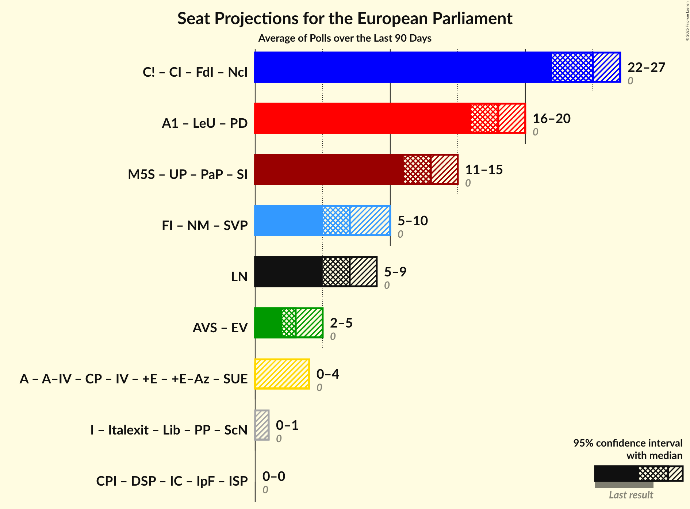

# Poll Average

<a href="#voting-intentions">Voting Intentions</a> | <a href="#seats">Seats</a> | <a href="#coalitions">Coalitions</a> | <a href="#technical-information">Technical Information</a>

## Summary

The table below lists the polls on which the average is based. They are the most recent polls (less than 90 days old) registered and analyzed so far.

| Period     | Polling firm/Commissioner(s) | CPI | CP | FdI | I | NcI | +E | FI | SVP | LN | LeU | PD | M5S | PaP |
|:----------:|:----------------------------:|:--:|:--:|:--:|:--:|:--:|:--:|:--:|:--:|:--:|:--:|:--:|:--:|:--:|
| 25 May 2014 | General Election | 0.0%   0 | 0.0%   0 | 0.0%   0 | 0.0%   0 | 0.0%   0 | 0.0%   0 | 0.0%   0 | 0.0%   0 | 0.0%   0 | 0.0%   0 | 0.0%   0 | 0.0%   0 | 0.0%   0 |
| N/A | Poll Average | 0–2%   0 | 0–2%   0 | 4–6%   0–6 | 0–2%   0 | 0–4%   0–3 | 2–4%   0 | 14–20%   12–17 | N/A   N/A | 10–16%   9–13 | 4–8%   4–6 | 20–26%   15–20 | 25–31%   18–23 | 1–3%   0 |
| [12–16 February 2018](2018-02-16-TermometroPolitico.html) | Termometro Politico | 1–2%   0 | 1%   0 | 4–6%   3–4 | 1%   0 | 1–2%   0 | 2–3%   0 | 15–17%   12–13 | N/A   N/A | 14–16%   12–13 | 5–6%   4–5 | 20–23%   16–18 | 25–28%   21–23 | 1–2%   0 |
| [14–15 February 2018](2018-02-15-Demopolis.html) | Demopolis | N/A   N/A | 1–2%   0 | 4–6%   4 | 1–2%   0 | 2–3%   0 | 2–3%   0 | 15–18%   12 | N/A   N/A | 13–16%   12 | 5–7%   5 | 21–24%   17 | 26–30%   22 | N/A   N/A |
| [12–14 February 2018](2018-02-14-SWG.html) | SWG | N/A   N/A | 1–2%   0 | 4–5%   0–3 | 0–1%   0 | 2–3%   0 | 2–4%   0 | 14–17%   13 | N/A   N/A | 12–15%   11–13 | 5–7%   5–6 | 22–25%   18–20 | 26–30%   21–22 | 1%   0 |
| [13–14 February 2018](2018-02-14-Piepoli.html) | Piepoli | 0–2%   0 | 0–2%   0 | 3–7%   0–6 | 0–2%   0 | 2–5%   0–3 | 2–5%   0 | 13–20%   12–14 | N/A   N/A | 10–16%   8–12 | 4–8%   4–6 | 21–29%   15–20 | 23–31%   18–21 | N/A   N/A |
| [12–14 February 2018](2018-02-14-Ixè.html) | Ixè   Huffington Post | N/A   N/A | 0–1%   0 | 4–6%   0–4 | 0–1%   0 | 1–3%   0 | 3–5%   0–3 | 16–21%   14–15 | N/A   N/A | 9–13%   9 | 5–8%   5–6 | 19–24%   16–20 | 25–31%   20–23 | 1–3%   0 |
| [12–14 February 2018](2018-02-14-Index.html) | Index | N/A   N/A | 1–2%   0 | 4–7%   0–4 | 1–2%   0 | 2–4%   0 | 1–4%   0 | 14–19%   13–16 | N/A   N/A | 12–16%   11–13 | 4–8%   5–6 | 20–26%   17–18 | 25–31%   20–22 | N/A   N/A |
| [14 February 2018](2018-02-14-Euromedia.html) | Euromedia | 0–1%   0 | 0–1%   0 | 4–7%   0–6 | 0–2%   0 | 1–4%   0 | 1–4%   0 | 15–20%   13–16 | N/A   N/A | 12–17%   9–12 | 4–8%   4–6 | 19–25%   15–20 | 24–30%   21–25 | N/A   N/A |
| [12–14 February 2018](2018-02-14-DemosPi.html) | Demos & Pi   La Repubblica | N/A   N/A | N/A   N/A | 4–6%   3–5 | N/A   N/A | N/A   N/A | 2–5%   0–3 | 14–19%   10–12 | N/A   N/A | 11–15%   9–12 | 5–8%   4–5 | 19–25%   13–17 | 25–31%   20–22 | N/A   N/A |
| [5–14 February 2018](2018-02-14-Demetra.html) | Demetra | 0–1%   0 | 0–1%   0 | 4–5%   3–4 | 0–1%   0 | 0–1%   0 | 2–3%   0 | 14–16%   12–13 | N/A   N/A | 14–16%   11–12 | 5–6%   3–4 | 23–25%   18 | 28–31%   22–24 | 1–2%   0 |
| [12–13 February 2018](2018-02-13-Tecnè.html) | Tecnè | N/A   N/A | N/A   N/A | 4–7%   3–5 | N/A   N/A | 2–4%   0–4 | 2–4%   0 | 16–21%   12–17 | N/A   N/A | 11–15%   9–14 | 4–7%   3–5 | 19–24%   16–19 | 26–31%   20–23 | N/A   N/A |
| [8–12 February 2018](2018-02-12-Bidimedia.html) | Bidimedia | N/A   N/A | N/A   N/A | N/A   N/A | N/A   N/A | N/A   N/A | N/A   N/A | N/A   N/A | N/A   N/A | N/A   N/A | N/A   N/A | N/A   N/A | N/A   N/A | N/A   N/A |
| [8–11 February 2018](2018-02-11-LorienConsulting.html) | Lorien Consulting | N/A   N/A | N/A   N/A | N/A   N/A | N/A   N/A | N/A   N/A | N/A   N/A | N/A   N/A | N/A   N/A | N/A   N/A | N/A   N/A | N/A   N/A | N/A   N/A | N/A   N/A |
| [9–11 February 2018](2018-02-11-EMG.html) | EMG   TG LA7 | N/A   N/A | N/A   N/A | N/A   N/A | N/A   N/A | N/A   N/A | N/A   N/A | N/A   N/A | N/A   N/A | N/A   N/A | N/A   N/A | N/A   N/A | N/A   N/A | N/A   N/A |
| 25 May 2014 | General Election | 0.0%   0 | 0.0%   0 | 0.0%   0 | 0.0%   0 | 0.0%   0 | 0.0%   0 | 0.0%   0 | 0.0%   0 | 0.0%   0 | 0.0%   0 | 0.0%   0 | 0.0%   0 | 0.0%   0 |

Only polls for which at least the sample size has been published are included in the table above.

**Legend:**
+ **Top half of each row:** Voting intentions (95% confidence interval)
+ **Bottom half of each row:** Seat projections for the European Parliament (95% confidence interval)
+ **CPI:** CasaPound Italia (—)
+ **CP:** Civica Popolare (—)
+ **FdI:** Fratelli d’Italia (—)
+ **I:** Insieme (—)
+ **NcI:** Noi con l’Italia (—)
+ **+E:** Più Europa (—)
+ **FI:** Forza Italia (EPP)
+ **SVP:** Südtiroler Volkspartei (EPP)
+ **LN:** Lega Nord (ENF)
+ **LeU:** Liberi e Uguali (S&D)
+ **PD:** Partito Democratico (S&D)
+ **M5S:** Movimento 5 Stelle (EFDD)
+ **PaP:** Potere al Popolo (GUE/NGL)
+ **N/A (single party):** Party not included the published results
+ **N/A (entire row):** Calculation for this opinion poll not started yet

## Voting Intentions

### Confidence Intervals

| Party | Last Result | Median | 80% Confidence Interval | 90% Confidence Interval | 95% Confidence Interval | 99% Confidence Interval |
|:-----:|:-----------:|:------:|:-----------------------:|:-----------------------:|:-----------------------:|:-----------------------:|
| <a href="#casapound-italia-(—)">CasaPound Italia (—)</a> | 0.0% | 0.8% | 0.4–1.9% |0.4–2.0% | 0.3–2.1% | 0.2–2.3% |
| <a href="#civica-popolare-(—)">Civica Popolare (—)</a> | 0.0% | 0.9% | 0.5–1.4% |0.4–1.6% | 0.3–1.8% | 0.2–2.2% |
| <a href="#fratelli-d’italia-(—)">Fratelli d’Italia (—)</a> | 0.0% | 4.8% | 4.1–5.8% |3.9–6.1% | 3.7–6.4% | 3.3–7.1% |
| <a href="#insieme-(—)">Insieme (—)</a> | 0.0% | 0.9% | 0.5–1.3% |0.4–1.5% | 0.4–1.7% | 0.3–2.2% |
| <a href="#noi-con-l’italia-(—)">Noi con l’Italia (—)</a> | 0.0% | 2.2% | 0.8–3.2% |0.6–3.6% | 0.5–3.9% | 0.4–4.6% |
| <a href="#più-europa-(—)">Più Europa (—)</a> | 0.0% | 2.8% | 2.1–3.8% |1.9–4.1% | 1.7–4.4% | 1.4–4.9% |
| <a href="#forza-italia-(epp)">Forza Italia (EPP)</a> | 0.0% | 16.4% | 14.8–18.7% |14.4–19.3% | 14.1–19.9% | 13.3–20.8% |
| <a href="#südtiroler-volkspartei-(epp)">Südtiroler Volkspartei (EPP)</a> | 0.0% | N/A | N/A |N/A | N/A | N/A |
| <a href="#lega-nord-(enf)">Lega Nord (ENF)</a> | 0.0% | 13.8% | 11.5–15.2% |10.7–15.6% | 10.1–15.9% | 9.3–16.8% |
| <a href="#liberi-e-uguali-(s&d)">Liberi e Uguali (S&D)</a> | 0.0% | 5.8% | 4.9–6.9% |4.7–7.2% | 4.5–7.6% | 4.0–8.3% |
| <a href="#partito-democratico-(s&d)">Partito Democratico (S&D)</a> | 0.0% | 22.6% | 20.7–24.5% |20.2–25.3% | 19.8–26.1% | 18.9–27.9% |
| <a href="#movimento-5-stelle-(efdd)">Movimento 5 Stelle (EFDD)</a> | 0.0% | 27.9% | 25.8–29.7% |25.2–30.2% | 24.7–30.6% | 23.5–31.6% |
| <a href="#potere-al-popolo-(gue/ngl)">Potere al Popolo (GUE/NGL)</a> | 0.0% | 1.5% | 0.9–2.2% |0.8–2.5% | 0.7–2.7% | 0.6–3.1% |

### Partito Democratico (S&D)

*For a full overview of the results for this party, see the [Partito Democratico (S&D)](party-partitodemocraticosd.html) page.*

| Voting Intentions | Probability | Accumulated | Special Marks |
|:-----------------:|:-----------:|:-----------:|:-------------:|
| 0.0–0.5% | 0% | 100% | Last Result |
| 0.5–1.5% | 0% | 100% |  |
| 1.5–2.5% | 0% | 100% |  |
| 2.5–3.5% | 0% | 100% |  |
| 3.5–4.5% | 0% | 100% |  |
| 4.5–5.5% | 0% | 100% |  |
| 5.5–6.5% | 0% | 100% |  |
| 6.5–7.5% | 0% | 100% |  |
| 7.5–8.5% | 0% | 100% |  |
| 8.5–9.5% | 0% | 100% |  |
| 9.5–10.5% | 0% | 100% |  |
| 10.5–11.5% | 0% | 100% |  |
| 11.5–12.5% | 0% | 100% |  |
| 12.5–13.5% | 0% | 100% |  |
| 13.5–14.5% | 0% | 100% |  |
| 14.5–15.5% | 0% | 100% |  |
| 15.5–16.5% | 0% | 100% |  |
| 16.5–17.5% | 0% | 100% |  |
| 17.5–18.5% | 0.2% | 100% |  |
| 18.5–19.5% | 1.5% | 99.8% |  |
| 19.5–20.5% | 7% | 98% |  |
| 20.5–21.5% | 19% | 92% |  |
| 21.5–22.5% | 23% | 73% |  |
| 22.5–23.5% | 23% | 50% | Median |
| 23.5–24.5% | 17% | 27% |  |
| 24.5–25.5% | 6% | 10% |  |
| 25.5–26.5% | 2% | 4% |  |
| 26.5–27.5% | 1.0% | 2% |  |
| 27.5–28.5% | 0.5% | 0.7% |  |
| 28.5–29.5% | 0.2% | 0.2% |  |
| 29.5–30.5% | 0.1% | 0.1% |  |
| 30.5–31.5% | 0% | 0% |  |

### Più Europa (—)

*For a full overview of the results for this party, see the [Più Europa (—)](party-piùeuropa—.html) page.*

| Voting Intentions | Probability | Accumulated | Special Marks |
|:-----------------:|:-----------:|:-----------:|:-------------:|
| 0.0–0.5% | 0% | 100% | Last Result |
| 0.5–1.5% | 1.1% | 100% |  |
| 1.5–2.5% | 31% | 98.9% |  |
| 2.5–3.5% | 54% | 68% | Median |
| 3.5–4.5% | 13% | 14% |  |
| 4.5–5.5% | 1.5% | 2% |  |
| 5.5–6.5% | 0.1% | 0.1% |  |
| 6.5–7.5% | 0% | 0% |  |

### Insieme (—)

*For a full overview of the results for this party, see the [Insieme (—)](party-insieme—.html) page.*

| Voting Intentions | Probability | Accumulated | Special Marks |
|:-----------------:|:-----------:|:-----------:|:-------------:|
| 0.0–0.5% | 16% | 100% | Last Result |
| 0.5–1.5% | 79% | 84% | Median |
| 1.5–2.5% | 5% | 5% |  |
| 2.5–3.5% | 0.2% | 0.2% |  |
| 3.5–4.5% | 0% | 0% |  |

### Civica Popolare (—)

*For a full overview of the results for this party, see the [Civica Popolare (—)](party-civicapopolare—.html) page.*

| Voting Intentions | Probability | Accumulated | Special Marks |
|:-----------------:|:-----------:|:-----------:|:-------------:|
| 0.0–0.5% | 15% | 100% | Last Result |
| 0.5–1.5% | 80% | 85% | Median |
| 1.5–2.5% | 5% | 5% |  |
| 2.5–3.5% | 0.1% | 0.1% |  |
| 3.5–4.5% | 0% | 0% |  |

### Forza Italia (EPP)

*For a full overview of the results for this party, see the [Forza Italia (EPP)](party-forzaitaliaepp.html) page.*

| Voting Intentions | Probability | Accumulated | Special Marks |
|:-----------------:|:-----------:|:-----------:|:-------------:|
| 0.0–0.5% | 0% | 100% | Last Result |
| 0.5–1.5% | 0% | 100% |  |
| 1.5–2.5% | 0% | 100% |  |
| 2.5–3.5% | 0% | 100% |  |
| 3.5–4.5% | 0% | 100% |  |
| 4.5–5.5% | 0% | 100% |  |
| 5.5–6.5% | 0% | 100% |  |
| 6.5–7.5% | 0% | 100% |  |
| 7.5–8.5% | 0% | 100% |  |
| 8.5–9.5% | 0% | 100% |  |
| 9.5–10.5% | 0% | 100% |  |
| 10.5–11.5% | 0% | 100% |  |
| 11.5–12.5% | 0.1% | 100% |  |
| 12.5–13.5% | 0.7% | 99.9% |  |
| 13.5–14.5% | 6% | 99.2% |  |
| 14.5–15.5% | 22% | 93% |  |
| 15.5–16.5% | 26% | 72% | Median |
| 16.5–17.5% | 20% | 45% |  |
| 17.5–18.5% | 14% | 25% |  |
| 18.5–19.5% | 8% | 11% |  |
| 19.5–20.5% | 3% | 4% |  |
| 20.5–21.5% | 0.7% | 0.8% |  |
| 21.5–22.5% | 0.1% | 0.1% |  |
| 22.5–23.5% | 0% | 0% |  |

### Lega Nord (ENF)

*For a full overview of the results for this party, see the [Lega Nord (ENF)](party-leganordenf.html) page.*

| Voting Intentions | Probability | Accumulated | Special Marks |
|:-----------------:|:-----------:|:-----------:|:-------------:|
| 0.0–0.5% | 0% | 100% | Last Result |
| 0.5–1.5% | 0% | 100% |  |
| 1.5–2.5% | 0% | 100% |  |
| 2.5–3.5% | 0% | 100% |  |
| 3.5–4.5% | 0% | 100% |  |
| 4.5–5.5% | 0% | 100% |  |
| 5.5–6.5% | 0% | 100% |  |
| 6.5–7.5% | 0% | 100% |  |
| 7.5–8.5% | 0.1% | 100% |  |
| 8.5–9.5% | 0.8% | 99.9% |  |
| 9.5–10.5% | 3% | 99.1% |  |
| 10.5–11.5% | 7% | 96% |  |
| 11.5–12.5% | 12% | 89% |  |
| 12.5–13.5% | 21% | 77% |  |
| 13.5–14.5% | 28% | 56% | Median |
| 14.5–15.5% | 23% | 28% |  |
| 15.5–16.5% | 4% | 5% |  |
| 16.5–17.5% | 0.7% | 0.8% |  |
| 17.5–18.5% | 0.1% | 0.1% |  |
| 18.5–19.5% | 0% | 0% |  |

### Fratelli d’Italia (—)

*For a full overview of the results for this party, see the [Fratelli d’Italia (—)](party-fratellid’italia—.html) page.*

| Voting Intentions | Probability | Accumulated | Special Marks |
|:-----------------:|:-----------:|:-----------:|:-------------:|
| 0.0–0.5% | 0% | 100% | Last Result |
| 0.5–1.5% | 0% | 100% |  |
| 1.5–2.5% | 0% | 100% |  |
| 2.5–3.5% | 2% | 100% |  |
| 3.5–4.5% | 32% | 98% |  |
| 4.5–5.5% | 51% | 66% | Median |
| 5.5–6.5% | 14% | 15% |  |
| 6.5–7.5% | 2% | 2% |  |
| 7.5–8.5% | 0.2% | 0.2% |  |
| 8.5–9.5% | 0% | 0% |  |

### Noi con l’Italia (—)

*For a full overview of the results for this party, see the [Noi con l’Italia (—)](party-noiconl’italia—.html) page.*

| Voting Intentions | Probability | Accumulated | Special Marks |
|:-----------------:|:-----------:|:-----------:|:-------------:|
| 0.0–0.5% | 3% | 100% | Last Result |
| 0.5–1.5% | 13% | 97% |  |
| 1.5–2.5% | 52% | 84% | Median |
| 2.5–3.5% | 26% | 32% |  |
| 3.5–4.5% | 5% | 6% |  |
| 4.5–5.5% | 0.5% | 0.6% |  |
| 5.5–6.5% | 0% | 0% |  |
| 6.5–7.5% | 0% | 0% |  |

### Movimento 5 Stelle (EFDD)

*For a full overview of the results for this party, see the [Movimento 5 Stelle (EFDD)](party-movimento5stelleefdd.html) page.*

| Voting Intentions | Probability | Accumulated | Special Marks |
|:-----------------:|:-----------:|:-----------:|:-------------:|
| 0.0–0.5% | 0% | 100% | Last Result |
| 0.5–1.5% | 0% | 100% |  |
| 1.5–2.5% | 0% | 100% |  |
| 2.5–3.5% | 0% | 100% |  |
| 3.5–4.5% | 0% | 100% |  |
| 4.5–5.5% | 0% | 100% |  |
| 5.5–6.5% | 0% | 100% |  |
| 6.5–7.5% | 0% | 100% |  |
| 7.5–8.5% | 0% | 100% |  |
| 8.5–9.5% | 0% | 100% |  |
| 9.5–10.5% | 0% | 100% |  |
| 10.5–11.5% | 0% | 100% |  |
| 11.5–12.5% | 0% | 100% |  |
| 12.5–13.5% | 0% | 100% |  |
| 13.5–14.5% | 0% | 100% |  |
| 14.5–15.5% | 0% | 100% |  |
| 15.5–16.5% | 0% | 100% |  |
| 16.5–17.5% | 0% | 100% |  |
| 17.5–18.5% | 0% | 100% |  |
| 18.5–19.5% | 0% | 100% |  |
| 19.5–20.5% | 0% | 100% |  |
| 20.5–21.5% | 0% | 100% |  |
| 21.5–22.5% | 0.1% | 100% |  |
| 22.5–23.5% | 0.4% | 99.9% |  |
| 23.5–24.5% | 2% | 99.5% |  |
| 24.5–25.5% | 5% | 98% |  |
| 25.5–26.5% | 15% | 93% |  |
| 26.5–27.5% | 21% | 78% |  |
| 27.5–28.5% | 23% | 57% | Median |
| 28.5–29.5% | 21% | 34% |  |
| 29.5–30.5% | 10% | 13% |  |
| 30.5–31.5% | 2% | 3% |  |
| 31.5–32.5% | 0.4% | 0.5% |  |
| 32.5–33.5% | 0.1% | 0.1% |  |
| 33.5–34.5% | 0% | 0% |  |

### Liberi e Uguali (S&D)

*For a full overview of the results for this party, see the [Liberi e Uguali (S&D)](party-liberieugualisd.html) page.*

| Voting Intentions | Probability | Accumulated | Special Marks |
|:-----------------:|:-----------:|:-----------:|:-------------:|
| 0.0–0.5% | 0% | 100% | Last Result |
| 0.5–1.5% | 0% | 100% |  |
| 1.5–2.5% | 0% | 100% |  |
| 2.5–3.5% | 0.1% | 100% |  |
| 3.5–4.5% | 3% | 99.9% |  |
| 4.5–5.5% | 36% | 97% |  |
| 5.5–6.5% | 43% | 61% | Median |
| 6.5–7.5% | 15% | 17% |  |
| 7.5–8.5% | 2% | 3% |  |
| 8.5–9.5% | 0.2% | 0.3% |  |
| 9.5–10.5% | 0% | 0% |  |

### Potere al Popolo (GUE/NGL)

*For a full overview of the results for this party, see the [Potere al Popolo (GUE/NGL)](party-poterealpopologuengl.html) page.*

| Voting Intentions | Probability | Accumulated | Special Marks |
|:-----------------:|:-----------:|:-----------:|:-------------:|
| 0.0–0.5% | 0.4% | 100% | Last Result |
| 0.5–1.5% | 55% | 99.6% | Median |
| 1.5–2.5% | 40% | 44% |  |
| 2.5–3.5% | 4% | 4% |  |
| 3.5–4.5% | 0.1% | 0.1% |  |
| 4.5–5.5% | 0% | 0% |  |

### CasaPound Italia (—)

*For a full overview of the results for this party, see the [CasaPound Italia (—)](party-casapounditalia—.html) page.*

| Voting Intentions | Probability | Accumulated | Special Marks |
|:-----------------:|:-----------:|:-----------:|:-------------:|
| 0.0–0.5% | 21% | 100% | Last Result |
| 0.5–1.5% | 55% | 79% | Median |
| 1.5–2.5% | 24% | 24% |  |
| 2.5–3.5% | 0% | 0% |  |
| 3.5–4.5% | 0% | 0% |  |

## Seats

### Confidence Intervals

| Party | Last Result | Median | 80% Confidence Interval | 90% Confidence Interval | 95% Confidence Interval | 99% Confidence Interval |
|:-----:|:-----------:|:------:|:-----------------------:|:-----------------------:|:-----------------------:|:-----------------------:|
| <a href="#casapound-italia-(—)">CasaPound Italia (—)</a> | 0 | 0 | 0 |0 | 0 | 0 |
| <a href="#civica-popolare-(—)">Civica Popolare (—)</a> | 0 | 0 | 0 |0 | 0 | 0 |
| <a href="#fratelli-d’italia-(—)">Fratelli d’Italia (—)</a> | 0 | 4 | 0–4 |0–6 | 0–6 | 0–6 |
| <a href="#insieme-(—)">Insieme (—)</a> | 0 | 0 | 0 |0 | 0 | 0 |
| <a href="#noi-con-l’italia-(—)">Noi con l’Italia (—)</a> | 0 | 0 | 0–3 |0–3 | 0–3 | 0–3 |
| <a href="#più-europa-(—)">Più Europa (—)</a> | 0 | 0 | 0 |0 | 0 | 0–3 |
| <a href="#forza-italia-(epp)">Forza Italia (EPP)</a> | 0 | 13 | 12–16 |12–17 | 12–17 | 11–17 |
| <a href="#südtiroler-volkspartei-(epp)">Südtiroler Volkspartei (EPP)</a> | 0 | N/A | N/A |N/A | N/A | N/A |
| <a href="#lega-nord-(enf)">Lega Nord (ENF)</a> | 0 | 12 | 9–13 |9–13 | 9–13 | 8–14 |
| <a href="#liberi-e-uguali-(s&d)">Liberi e Uguali (S&D)</a> | 0 | 5 | 4–6 |4–6 | 4–6 | 0–6 |
| <a href="#partito-democratico-(s&d)">Partito Democratico (S&D)</a> | 0 | 17 | 15–18 |15–19 | 15–20 | 13–20 |
| <a href="#movimento-5-stelle-(efdd)">Movimento 5 Stelle (EFDD)</a> | 0 | 22 | 20–23 |18–23 | 18–23 | 18–25 |
| <a href="#potere-al-popolo-(gue/ngl)">Potere al Popolo (GUE/NGL)</a> | 0 | 0 | 0 |0 | 0 | 0 |

### Partito Democratico (S&D)

*For a full overview of the results for this party, see the [Partito Democratico (S&D)](party-partitodemocraticosd.html) page.*

| Number of Seats | Probability | Accumulated | Special Marks |
|:---------------:|:-----------:|:-----------:|:-------------:|
| 0 | 0% | 100% | Last Result |
| 1 | 0% | 100% |  |
| 2 | 0% | 100% |  |
| 3 | 0% | 100% |  |
| 4 | 0% | 100% |  |
| 5 | 0% | 100% |  |
| 6 | 0% | 100% |  |
| 7 | 0% | 100% |  |
| 8 | 0% | 100% |  |
| 9 | 0% | 100% |  |
| 10 | 0% | 100% |  |
| 11 | 0% | 100% |  |
| 12 | 0% | 100% |  |
| 13 | 1.0% | 100% |  |
| 14 | 0.6% | 99.0% |  |
| 15 | 16% | 98% |  |
| 16 | 11% | 82% |  |
| 17 | 24% | 71% | Median |
| 18 | 42% | 47% |  |
| 19 | 1.4% | 5% |  |
| 20 | 4% | 4% |  |
| 21 | 0% | 0% |  |

### Più Europa (—)

*For a full overview of the results for this party, see the [Più Europa (—)](party-piùeuropa—.html) page.*

| Number of Seats | Probability | Accumulated | Special Marks |
|:---------------:|:-----------:|:-----------:|:-------------:|
| 0 | 98.8% | 100% | Last Result, Median |
| 1 | 0% | 1.2% |  |
| 2 | 0% | 1.2% |  |
| 3 | 0.9% | 1.2% |  |
| 4 | 0.3% | 0.3% |  |
| 5 | 0% | 0% |  |

### Insieme (—)

*For a full overview of the results for this party, see the [Insieme (—)](party-insieme—.html) page.*

| Number of Seats | Probability | Accumulated | Special Marks |
|:---------------:|:-----------:|:-----------:|:-------------:|
| 0 | 100% | 100% | Last Result, Median |

### Civica Popolare (—)

*For a full overview of the results for this party, see the [Civica Popolare (—)](party-civicapopolare—.html) page.*

| Number of Seats | Probability | Accumulated | Special Marks |
|:---------------:|:-----------:|:-----------:|:-------------:|
| 0 | 100% | 100% | Last Result, Median |

### Forza Italia (EPP)

*For a full overview of the results for this party, see the [Forza Italia (EPP)](party-forzaitaliaepp.html) page.*

| Number of Seats | Probability | Accumulated | Special Marks |
|:---------------:|:-----------:|:-----------:|:-------------:|
| 0 | 0% | 100% | Last Result |
| 1 | 0% | 100% |  |
| 2 | 0% | 100% |  |
| 3 | 0% | 100% |  |
| 4 | 0% | 100% |  |
| 5 | 0% | 100% |  |
| 6 | 0% | 100% |  |
| 7 | 0% | 100% |  |
| 8 | 0% | 100% |  |
| 9 | 0% | 100% |  |
| 10 | 0.3% | 100% |  |
| 11 | 0.6% | 99.6% |  |
| 12 | 31% | 99.1% |  |
| 13 | 25% | 68% | Median |
| 14 | 19% | 43% |  |
| 15 | 11% | 24% |  |
| 16 | 7% | 13% |  |
| 17 | 6% | 6% |  |
| 18 | 0.2% | 0.2% |  |
| 19 | 0% | 0% |  |

### Lega Nord (ENF)

*For a full overview of the results for this party, see the [Lega Nord (ENF)](party-leganordenf.html) page.*

| Number of Seats | Probability | Accumulated | Special Marks |
|:---------------:|:-----------:|:-----------:|:-------------:|
| 0 | 0% | 100% | Last Result |
| 1 | 0% | 100% |  |
| 2 | 0% | 100% |  |
| 3 | 0% | 100% |  |
| 4 | 0% | 100% |  |
| 5 | 0% | 100% |  |
| 6 | 0% | 100% |  |
| 7 | 0% | 100% |  |
| 8 | 0.8% | 100% |  |
| 9 | 19% | 99.1% |  |
| 10 | 15% | 81% |  |
| 11 | 4% | 65% |  |
| 12 | 42% | 61% | Median |
| 13 | 18% | 19% |  |
| 14 | 0.6% | 0.6% |  |
| 15 | 0% | 0% |  |

### Fratelli d’Italia (—)

*For a full overview of the results for this party, see the [Fratelli d’Italia (—)](party-fratellid’italia—.html) page.*

| Number of Seats | Probability | Accumulated | Special Marks |
|:---------------:|:-----------:|:-----------:|:-------------:|
| 0 | 23% | 100% | Last Result |
| 1 | 0% | 77% |  |
| 2 | 0% | 77% |  |
| 3 | 19% | 77% |  |
| 4 | 51% | 58% | Median |
| 5 | 0.8% | 8% |  |
| 6 | 7% | 7% |  |
| 7 | 0% | 0% |  |

### Noi con l’Italia (—)

*For a full overview of the results for this party, see the [Noi con l’Italia (—)](party-noiconl’italia—.html) page.*

| Number of Seats | Probability | Accumulated | Special Marks |
|:---------------:|:-----------:|:-----------:|:-------------:|
| 0 | 89% | 100% | Last Result, Median |
| 1 | 0% | 11% |  |
| 2 | 0% | 11% |  |
| 3 | 11% | 11% |  |
| 4 | 0.4% | 0.4% |  |
| 5 | 0% | 0% |  |

### Movimento 5 Stelle (EFDD)

*For a full overview of the results for this party, see the [Movimento 5 Stelle (EFDD)](party-movimento5stelleefdd.html) page.*

| Number of Seats | Probability | Accumulated | Special Marks |
|:---------------:|:-----------:|:-----------:|:-------------:|
| 0 | 0% | 100% | Last Result |
| 1 | 0% | 100% |  |
| 2 | 0% | 100% |  |
| 3 | 0% | 100% |  |
| 4 | 0% | 100% |  |
| 5 | 0% | 100% |  |
| 6 | 0% | 100% |  |
| 7 | 0% | 100% |  |
| 8 | 0% | 100% |  |
| 9 | 0% | 100% |  |
| 10 | 0% | 100% |  |
| 11 | 0% | 100% |  |
| 12 | 0% | 100% |  |
| 13 | 0% | 100% |  |
| 14 | 0% | 100% |  |
| 15 | 0% | 100% |  |
| 16 | 0.1% | 100% |  |
| 17 | 0% | 99.9% |  |
| 18 | 9% | 99.9% |  |
| 19 | 0.4% | 91% |  |
| 20 | 21% | 90% |  |
| 21 | 11% | 70% |  |
| 22 | 43% | 58% | Median |
| 23 | 13% | 15% |  |
| 24 | 1.2% | 2% |  |
| 25 | 0.3% | 0.7% |  |
| 26 | 0.1% | 0.4% |  |
| 27 | 0.2% | 0.2% |  |
| 28 | 0% | 0% |  |

### Liberi e Uguali (S&D)

*For a full overview of the results for this party, see the [Liberi e Uguali (S&D)](party-liberieugualisd.html) page.*

| Number of Seats | Probability | Accumulated | Special Marks |
|:---------------:|:-----------:|:-----------:|:-------------:|
| 0 | 0.5% | 100% | Last Result |
| 1 | 0% | 99.5% |  |
| 2 | 0% | 99.5% |  |
| 3 | 1.3% | 99.5% |  |
| 4 | 33% | 98% |  |
| 5 | 31% | 65% | Median |
| 6 | 34% | 35% |  |
| 7 | 0.3% | 0.3% |  |
| 8 | 0% | 0% |  |

### Potere al Popolo (GUE/NGL)

*For a full overview of the results for this party, see the [Potere al Popolo (GUE/NGL)](party-poterealpopologuengl.html) page.*

| Number of Seats | Probability | Accumulated | Special Marks |
|:---------------:|:-----------:|:-----------:|:-------------:|
| 0 | 100% | 100% | Last Result, Median |

### CasaPound Italia (—)

*For a full overview of the results for this party, see the [CasaPound Italia (—)](party-casapounditalia—.html) page.*

| Number of Seats | Probability | Accumulated | Special Marks |
|:---------------:|:-----------:|:-----------:|:-------------:|
| 0 | 100% | 100% | Last Result, Median |

## Coalitions

### Confidence Intervals

| Coalition | Last Result | Median | Majority? | 80% Confidence Interval | 90% Confidence Interval | 95% Confidence Interval | 99% Confidence Interval |
|:---------:|:-----------:|:------:|:---------:|:-----------------------:|:-----------------------:|:-----------------------:|:-----------------------:|
| Liberi e Uguali (S&D) – Partito Democratico (S&D) | 0 | 22 | 0% | 21–24 | 19–24 | 19–26 | 17–26 |
| Movimento 5 Stelle (EFDD) | 0 | 22 | 0% | 20–23 | 18–23 | 18–23 | 18–25 |
| Forza Italia (EPP) – Südtiroler Volkspartei (EPP) | 0 | 14 | 0% | 13–17 | 13–18 | 13–18 | 12–18 |
| Lega Nord (ENF) | 0 | 12 | 0% | 9–13 | 9–13 | 9–13 | 8–14 |
| CasaPound Italia (—) – Civica Popolare (—) – Fratelli d’Italia (—) – Insieme (—) – Noi con l’Italia (—) – Più Europa (—) | 0 | 4 | 0% | 0–7 | 0–7 | 0–7 | 0–7 |
| Potere al Popolo (GUE/NGL) | 0 | 0 | 0% | 0 | 0 | 0 | 0 |

### Liberi e Uguali (S&D) – Partito Democratico (S&D)

| Number of Seats | Probability | Accumulated | Special Marks |
|:---------------:|:-----------:|:-----------:|:-------------:|
| 0 | 0% | 100% | Last Result |
| 1 | 0% | 100% |  |
| 2 | 0% | 100% |  |
| 3 | 0% | 100% |  |
| 4 | 0% | 100% |  |
| 5 | 0% | 100% |  |
| 6 | 0% | 100% |  |
| 7 | 0% | 100% |  |
| 8 | 0% | 100% |  |
| 9 | 0% | 100% |  |
| 10 | 0% | 100% |  |
| 11 | 0% | 100% |  |
| 12 | 0% | 100% |  |
| 13 | 0% | 100% |  |
| 14 | 0% | 100% |  |
| 15 | 0% | 100% |  |
| 16 | 0.1% | 99.9% |  |
| 17 | 1.3% | 99.8% |  |
| 18 | 0.4% | 98.5% |  |
| 19 | 7% | 98% |  |
| 20 | 1.0% | 91% |  |
| 21 | 14% | 90% |  |
| 22 | 52% | 77% | Median |
| 23 | 7% | 25% |  |
| 24 | 14% | 18% |  |
| 25 | 1.0% | 4% |  |
| 26 | 3% | 3% |  |
| 27 | 0.1% | 0.1% |  |
| 28 | 0% | 0% |  |

### Movimento 5 Stelle (EFDD)

| Number of Seats | Probability | Accumulated | Special Marks |
|:---------------:|:-----------:|:-----------:|:-------------:|
| 0 | 0% | 100% | Last Result |
| 1 | 0% | 100% |  |
| 2 | 0% | 100% |  |
| 3 | 0% | 100% |  |
| 4 | 0% | 100% |  |
| 5 | 0% | 100% |  |
| 6 | 0% | 100% |  |
| 7 | 0% | 100% |  |
| 8 | 0% | 100% |  |
| 9 | 0% | 100% |  |
| 10 | 0% | 100% |  |
| 11 | 0% | 100% |  |
| 12 | 0% | 100% |  |
| 13 | 0% | 100% |  |
| 14 | 0% | 100% |  |
| 15 | 0% | 100% |  |
| 16 | 0.1% | 100% |  |
| 17 | 0% | 99.9% |  |
| 18 | 9% | 99.9% |  |
| 19 | 0.4% | 91% |  |
| 20 | 21% | 90% |  |
| 21 | 11% | 70% |  |
| 22 | 43% | 58% | Median |
| 23 | 13% | 15% |  |
| 24 | 1.2% | 2% |  |
| 25 | 0.3% | 0.7% |  |
| 26 | 0.1% | 0.4% |  |
| 27 | 0.2% | 0.2% |  |
| 28 | 0% | 0% |  |

### Forza Italia (EPP) – Südtiroler Volkspartei (EPP)

| Number of Seats | Probability | Accumulated | Special Marks |
|:---------------:|:-----------:|:-----------:|:-------------:|
| 0 | 0% | 100% | Last Result |
| 1 | 0% | 100% |  |
| 2 | 0% | 100% |  |
| 3 | 0% | 100% |  |
| 4 | 0% | 100% |  |
| 5 | 0% | 100% |  |
| 6 | 0% | 100% |  |
| 7 | 0% | 100% |  |
| 8 | 0% | 100% |  |
| 9 | 0% | 100% |  |
| 10 | 0% | 100% |  |
| 11 | 0.3% | 100% |  |
| 12 | 0.6% | 99.6% |  |
| 13 | 31% | 99.1% | Median |
| 14 | 25% | 68% |  |
| 15 | 19% | 43% |  |
| 16 | 11% | 24% |  |
| 17 | 7% | 13% |  |
| 18 | 6% | 6% |  |
| 19 | 0.2% | 0.2% |  |
| 20 | 0% | 0% |  |

### Lega Nord (ENF)

| Number of Seats | Probability | Accumulated | Special Marks |
|:---------------:|:-----------:|:-----------:|:-------------:|
| 0 | 0% | 100% | Last Result |
| 1 | 0% | 100% |  |
| 2 | 0% | 100% |  |
| 3 | 0% | 100% |  |
| 4 | 0% | 100% |  |
| 5 | 0% | 100% |  |
| 6 | 0% | 100% |  |
| 7 | 0% | 100% |  |
| 8 | 0.8% | 100% |  |
| 9 | 19% | 99.1% |  |
| 10 | 15% | 81% |  |
| 11 | 4% | 65% |  |
| 12 | 42% | 61% | Median |
| 13 | 18% | 19% |  |
| 14 | 0.6% | 0.6% |  |
| 15 | 0% | 0% |  |

### CasaPound Italia (—) – Civica Popolare (—) – Fratelli d’Italia (—) – Insieme (—) – Noi con l’Italia (—) – Più Europa (—)

| Number of Seats | Probability | Accumulated | Special Marks |
|:---------------:|:-----------:|:-----------:|:-------------:|
| 0 | 22% | 100% | Last Result |
| 1 | 0% | 78% |  |
| 2 | 0% | 78% |  |
| 3 | 19% | 78% |  |
| 4 | 41% | 59% | Median |
| 5 | 0.8% | 18% |  |
| 6 | 7% | 17% |  |
| 7 | 10% | 10% |  |
| 8 | 0% | 0.4% |  |
| 9 | 0.2% | 0.4% |  |
| 10 | 0.2% | 0.2% |  |
| 11 | 0% | 0% |  |

### Potere al Popolo (GUE/NGL)

| Number of Seats | Probability | Accumulated | Special Marks |
|:---------------:|:-----------:|:-----------:|:-------------:|
| 0 | 100% | 100% | Last Result, Median |

## Technical Information

