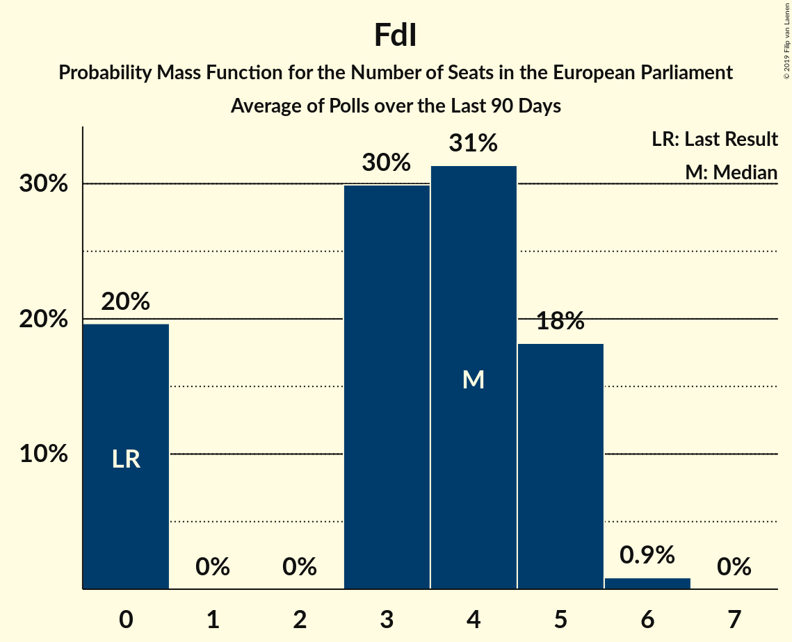

# Poll Average

<a href="#voting-intentions">Voting Intentions</a> | <a href="#seats">Seats</a> | <a href="#coalitions">Coalitions</a> | <a href="#technical-information">Technical Information</a>

## Summary

The table below lists the polls on which the average is based. They are the most recent polls (less than 90 days old) registered and analyzed so far.

| Period     | Polling firm/Commissioner(s) | PD | M5S | FI | LN | FdI | SVP | CPI | CP | I | NcI | +E | LeU | PaP |
|:----------:|:----------------------------:|:--:|:--:|:--:|:--:|:--:|:--:|:--:|:--:|:--:|:--:|:--:|:--:|:--:|
| 25 May 2014 | General Election | 40.8%   31 | 21.2%   17 | 16.8%   13 | 6.2%   5 | 3.7%   0 | 0.5%   1 | 0.0%   0 | 0.0%   0 | 0.0%   0 | 0.0%   0 | 0.0%   0 | 0.0%   0 | 0.0%   0 |
| N/A | Poll Average | 14–21%   11–16 | 20–30%   16–25 | 8–13%   6–11 | 29–38%   23–32 | 3–6%   0–5 | N/A   N/A | N/A   N/A | N/A   N/A | N/A   N/A | 0–1%   0 | 2–5%   0–4 | 1–4%   0–3 | 1–3%   0 |
| [27–28 February 2019](2019-02-28-Tecnè.html) | Tecnè | 16–21%   11–15 | 20–25%   15–19 | 10–14%   8–11 | 30–35%   22–27 | 4–6%   0–5 | N/A   N/A | N/A   N/A | N/A   N/A | N/A   N/A | N/A   N/A | N/A   N/A | N/A   N/A | N/A   N/A |
| [26–28 February 2019](2019-02-28-Ipsos.html) | Ipsos   Corriere della Sera | 16–21%   12–16 | 19–24%   15–20 | 7–11%   6–9 | 33–39%   26–32 | 3–5%   0–4 | N/A   N/A | N/A   N/A | N/A   N/A | N/A   N/A | 0–1%   0 | 3–5%   0–4 | 2–4%   0 | N/A   N/A |
| [26–27 February 2019](2019-02-27-IndexResearch.html) | Index Research   LA7 | 15–21%   12–17 | 19–25%   16–22 | 7–11%   6–10 | 31–38%   26–33 | 3–6%   0–5 | N/A   N/A | N/A   N/A | N/A   N/A | N/A   N/A | N/A   N/A | 2–4%   0–4 | 2–5%   0–4 | 1–3%   0 |
| [22–27 February 2019](2019-02-27-BiDiMedia.html) | BiDiMedia | 17–21%   13–17 | 20–25%   17–22 | 8–11%   7–10 | 30–35%   24–30 | 3–5%   0–4 | N/A   N/A | N/A   N/A | N/A   N/A | N/A   N/A | 0–1%   0 | 2–4%   0 | 2–4%   0 | 1–3%   0 |
| [26 February 2019](2019-02-26-EMGAcqua.html) | EMG Acqua   Rai 3 | 16–20%   12–15 | 22–26%   17–21 | 9–12%   7–10 | 29–34%   23–27 | 4–6%   3–5 | N/A   N/A | N/A   N/A | N/A   N/A | N/A   N/A | 0–1%   0 | 2–4%   0 | N/A   N/A | 1–2%   0 |
| [20–25 February 2019](2019-02-25-SWG.html) | SWG   LA7 | 17–21%   13–17 | 21–25%   17–21 | 7–10%   6–9 | 31–36%   26–31 | 3–5%   0–5 | N/A   N/A | N/A   N/A | N/A   N/A | N/A   N/A | N/A   N/A | 2–4%   0–3 | 2–4%   0 | 2–3%   0 |
| [25 February 2019](2019-02-25-Piepoli.html) | Piepoli   Rai 1 | 15–22%   11–17 | 21–29%   17–24 | 9–14%   7–12 | 28–36%   22–29 | 3–7%   0–6 | N/A   N/A | N/A   N/A | N/A   N/A | N/A   N/A | 0–2%   0 | 2–6%   0–4 | 1–3%   0 | N/A   N/A |
| [25 February 2019](2019-02-25-Euromedia.html) | Euromedia   Rai 1 | 16–21%   12–17 | 19–25%   15–20 | 9–13%   7–11 | 31–38%   25–31 | 3–6%   0–5 | N/A   N/A | N/A   N/A | N/A   N/A | N/A   N/A | N/A   N/A | 3–5%   0–4 | 1–3%   0 | N/A   N/A |
| [19 February 2019](2019-02-19-NotoSondaggi.html) | Noto Sondaggi   Rai 3 | 16–21%   15 | 19–24%   19 | 9–13%   8 | 32–38%   29 | 3–5%   0 | N/A   N/A | N/A   N/A | N/A   N/A | N/A   N/A | 0–1%   0 | 3–5%   0 | 1–3%   0 | 1–2%   0 |
| [14–17 February 2019](2019-02-17-ScenariPolitici–Winpoll.html) | Scenari Politici–Winpoll | 17–21%   13–17 | 21–25%   18–22 | 8–11%   7–9 | 34–39%   29–33 | 3–4%   0–4 | N/A   N/A | N/A   N/A | N/A   N/A | N/A   N/A | N/A   N/A | 2–4%   0 | 1–3%   0 | 1–2%   0 |
| [13–15 February 2019](2019-02-15-QuorumandYouTrend.html) | Quorum and YouTrend   Sky TG 24 | 16–21%   11–15 | 22–27%   16–21 | 9–12%   6–9 | 30–36%   23–27 | 4–7%   0–5 | N/A   N/A | N/A   N/A | N/A   N/A | N/A   N/A | N/A   N/A | N/A   N/A | N/A   N/A | N/A   N/A |
| [12–13 February 2019](2019-02-13-Demopolis.html) | Demopolis | 16–20%   11–14 | 23–27%   18–22 | 7–10%   6–8 | 31–35%   24–28 | 3–4%   0–3 | N/A   N/A | N/A   N/A | N/A   N/A | N/A   N/A | N/A   N/A | N/A   N/A | N/A   N/A | N/A   N/A |
| [28–30 January 2019](2019-01-30-DemosPi.html) | Demos & Pi   La Repubblica | 16–21%   12–16 | 22–28%   18–23 | 8–11%   6–10 | 31–37%   25–31 | 2–5%   0–4 | N/A   N/A | N/A   N/A | N/A   N/A | N/A   N/A | N/A   N/A | 2–4%   0–3 | 2–4%   0 | N/A   N/A |
| [23–30 December 2018](2018-12-30-GPFInspiringResearch.html) | GPF Inspiring Research   La Notizia | 15–20%   11–15 | 26–32%   21–27 | 9–13%   7–11 | 29–35%   23–29 | 3–6%   0–5 | N/A   N/A | N/A   N/A | N/A   N/A | N/A   N/A | 0–1%   0 | 1–3%   0 | 2–4%   0 | 1–2%   0 |
| [19–21 December 2018](2018-12-21-Ixè.html) | Ixè | N/A   N/A | N/A   N/A | N/A   N/A | N/A   N/A | N/A   N/A | N/A   N/A | N/A   N/A | N/A   N/A | N/A   N/A | N/A   N/A | N/A   N/A | N/A   N/A | N/A   N/A |
| [20 December 2018](2018-12-20-LorienConsulting.html) | Lorien Consulting | 13–17%   10–14 | 26–31%   21–27 | 9–13%   8–11 | 29–34%   24–30 | 2–5%   0–4 | N/A   N/A | N/A   N/A | N/A   N/A | N/A   N/A | 0–2%   0 | 1–3%   0 | 2–4%   0 | 1–3%   0 |
| [10–19 December 2018](2018-12-19-CISE.html) | CISE | 15–19%   11–16 | 25–30%   20–26 | 7–10%   6–9 | 28–33%   23–29 | 3–5%   0–4 | N/A   N/A | N/A   N/A | N/A   N/A | N/A   N/A | N/A   N/A | 3–5%   0–4 | 2–4%   0–4 | 2–4%   0 |
| 25 May 2014 | General Election | 40.8%   31 | 21.2%   17 | 16.8%   13 | 6.2%   5 | 3.7%   0 | 0.5%   1 | 0.0%   0 | 0.0%   0 | 0.0%   0 | 0.0%   0 | 0.0%   0 | 0.0%   0 | 0.0%   0 |

Only polls for which at least the sample size has been published are included in the table above.

**Legend:**
+ **Top half of each row:** Voting intentions (95% confidence interval)
+ **Bottom half of each row:** Seat projections for the European Parliament (95% confidence interval)
+ **PD:** Partito Democratico (S&D)
+ **M5S:** Movimento 5 Stelle (EFDD)
+ **FI:** Forza Italia (EPP)
+ **LN:** Lega Nord (ENF)
+ **FdI:** Fratelli d’Italia (ECR)
+ **SVP:** Südtiroler Volkspartei (EPP)
+ **CPI:** CasaPound Italia (*)
+ **CP:** Civica Popolare (*)
+ **I:** Insieme (*)
+ **NcI:** Noi con l’Italia (EPP)
+ **+E:** Più Europa (ALDE)
+ **LeU:** Liberi e Uguali (S&D)
+ **PaP:** Potere al Popolo (GUE/NGL)
+ **N/A (single party):** Party not included the published results
+ **N/A (entire row):** Calculation for this opinion poll not started yet

## Voting Intentions

### Confidence Intervals

| Party | Last Result | Median | 80% Confidence Interval | 90% Confidence Interval | 95% Confidence Interval | 99% Confidence Interval |
|:-----:|:-----------:|:------:|:-----------------------:|:-----------------------:|:-----------------------:|:-----------------------:|
| <a href="#partito-democratico-(s&d)">Partito Democratico (S&D)</a> | 40.8% | 18.1% | 16.0–19.9% |15.1–20.4% | 14.4–20.8% | 13.2–21.8% |
| <a href="#movimento-5-stelle-(efdd)">Movimento 5 Stelle (EFDD)</a> | 21.2% | 23.6% | 20.9–28.1% |20.2–29.1% | 19.7–29.9% | 18.7–31.2% |
| <a href="#forza-italia-(epp)">Forza Italia (EPP)</a> | 16.8% | 9.9% | 8.2–12.0% |7.8–12.6% | 7.5–13.1% | 6.9–14.0% |
| <a href="#lega-nord-(enf)">Lega Nord (ENF)</a> | 6.2% | 33.1% | 30.4–36.2% |29.7–37.0% | 29.1–37.6% | 27.9–38.7% |
| <a href="#fratelli-d’italia-(ecr)">Fratelli d’Italia (ECR)</a> | 3.7% | 4.2% | 3.2–5.4% |2.9–5.7% | 2.8–6.0% | 2.4–6.7% |
| <a href="#südtiroler-volkspartei-(epp)">Südtiroler Volkspartei (EPP)</a> | 0.5% | N/A | N/A |N/A | N/A | N/A |
| <a href="#casapound-italia-(*)">CasaPound Italia (*)</a> | 0.0% | N/A | N/A |N/A | N/A | N/A |
| <a href="#civica-popolare-(*)">Civica Popolare (*)</a> | 0.0% | N/A | N/A |N/A | N/A | N/A |
| <a href="#insieme-(*)">Insieme (*)</a> | 0.0% | N/A | N/A |N/A | N/A | N/A |
| <a href="#noi-con-l’italia-(epp)">Noi con l’Italia (EPP)</a> | 0.0% | 0.6% | 0.3–1.1% |0.2–1.2% | 0.1–1.4% | 0.1–1.7% |
| <a href="#più-europa-(alde)">Più Europa (ALDE)</a> | 0.0% | 3.1% | 2.0–4.3% |1.7–4.6% | 1.5–4.9% | 1.2–5.5% |
| <a href="#liberi-e-uguali-(s&d)">Liberi e Uguali (S&D)</a> | 0.0% | 2.5% | 1.6–3.5% |1.4–3.8% | 1.3–4.1% | 0.9–4.7% |
| <a href="#potere-al-popolo-(gue/ngl)">Potere al Popolo (GUE/NGL)</a> | 0.0% | 1.8% | 1.1–2.6% |0.9–2.8% | 0.8–3.1% | 0.6–3.5% |

### Partito Democratico (S&D)

*For a full overview of the results for this party, see the [Partito Democratico (S&D)](party-partitodemocraticosd.html) page.*

| Voting Intentions | Probability | Accumulated | Special Marks |
|:-----------------:|:-----------:|:-----------:|:-------------:|
| 10.5–11.5% | 0% | 100% |  |
| 11.5–12.5% | 0.1% | 100% |  |
| 12.5–13.5% | 0.8% | 99.9% |  |
| 13.5–14.5% | 2% | 99.1% |  |
| 14.5–15.5% | 4% | 97% |  |
| 15.5–16.5% | 9% | 93% |  |
| 16.5–17.5% | 19% | 84% |  |
| 17.5–18.5% | 28% | 64% | Median |
| 18.5–19.5% | 23% | 37% |  |
| 19.5–20.5% | 10% | 14% |  |
| 20.5–21.5% | 3% | 4% |  |
| 21.5–22.5% | 0.6% | 0.8% |  |
| 22.5–23.5% | 0.1% | 0.1% |  |
| 23.5–24.5% | 0% | 0% |  |
| 24.5–25.5% | 0% | 0% |  |
| 25.5–26.5% | 0% | 0% |  |
| 26.5–27.5% | 0% | 0% |  |
| 27.5–28.5% | 0% | 0% |  |
| 28.5–29.5% | 0% | 0% |  |
| 29.5–30.5% | 0% | 0% |  |
| 30.5–31.5% | 0% | 0% |  |
| 31.5–32.5% | 0% | 0% |  |
| 32.5–33.5% | 0% | 0% |  |
| 33.5–34.5% | 0% | 0% |  |
| 34.5–35.5% | 0% | 0% |  |
| 35.5–36.5% | 0% | 0% |  |
| 36.5–37.5% | 0% | 0% |  |
| 37.5–38.5% | 0% | 0% |  |
| 38.5–39.5% | 0% | 0% |  |
| 39.5–40.5% | 0% | 0% |  |
| 40.5–41.5% | 0% | 0% | Last Result |

### Movimento 5 Stelle (EFDD)

*For a full overview of the results for this party, see the [Movimento 5 Stelle (EFDD)](party-movimento5stelleefdd.html) page.*

| Voting Intentions | Probability | Accumulated | Special Marks |
|:-----------------:|:-----------:|:-----------:|:-------------:|
| 16.5–17.5% | 0% | 100% |  |
| 17.5–18.5% | 0.3% | 100% |  |
| 18.5–19.5% | 2% | 99.6% |  |
| 19.5–20.5% | 5% | 98% |  |
| 20.5–21.5% | 10% | 93% | Last Result |
| 21.5–22.5% | 15% | 82% |  |
| 22.5–23.5% | 16% | 67% |  |
| 23.5–24.5% | 14% | 51% | Median |
| 24.5–25.5% | 11% | 37% |  |
| 25.5–26.5% | 8% | 27% |  |
| 26.5–27.5% | 6% | 19% |  |
| 27.5–28.5% | 5% | 13% |  |
| 28.5–29.5% | 4% | 8% |  |
| 29.5–30.5% | 2% | 4% |  |
| 30.5–31.5% | 0.9% | 1.3% |  |
| 31.5–32.5% | 0.3% | 0.3% |  |
| 32.5–33.5% | 0% | 0.1% |  |
| 33.5–34.5% | 0% | 0% |  |

### Forza Italia (EPP)

*For a full overview of the results for this party, see the [Forza Italia (EPP)](party-forzaitaliaepp.html) page.*

| Voting Intentions | Probability | Accumulated | Special Marks |
|:-----------------:|:-----------:|:-----------:|:-------------:|
| 4.5–5.5% | 0% | 100% |  |
| 5.5–6.5% | 0.1% | 100% |  |
| 6.5–7.5% | 3% | 99.9% |  |
| 7.5–8.5% | 15% | 97% |  |
| 8.5–9.5% | 24% | 83% |  |
| 9.5–10.5% | 23% | 59% | Median |
| 10.5–11.5% | 20% | 36% |  |
| 11.5–12.5% | 11% | 16% |  |
| 12.5–13.5% | 4% | 5% |  |
| 13.5–14.5% | 1.0% | 1.2% |  |
| 14.5–15.5% | 0.2% | 0.2% |  |
| 15.5–16.5% | 0% | 0% |  |
| 16.5–17.5% | 0% | 0% | Last Result |

### Lega Nord (ENF)

*For a full overview of the results for this party, see the [Lega Nord (ENF)](party-leganordenf.html) page.*

| Voting Intentions | Probability | Accumulated | Special Marks |
|:-----------------:|:-----------:|:-----------:|:-------------:|
| 5.5–6.5% | 0% | 100% | Last Result |
| 6.5–7.5% | 0% | 100% |  |
| 7.5–8.5% | 0% | 100% |  |
| 8.5–9.5% | 0% | 100% |  |
| 9.5–10.5% | 0% | 100% |  |
| 10.5–11.5% | 0% | 100% |  |
| 11.5–12.5% | 0% | 100% |  |
| 12.5–13.5% | 0% | 100% |  |
| 13.5–14.5% | 0% | 100% |  |
| 14.5–15.5% | 0% | 100% |  |
| 15.5–16.5% | 0% | 100% |  |
| 16.5–17.5% | 0% | 100% |  |
| 17.5–18.5% | 0% | 100% |  |
| 18.5–19.5% | 0% | 100% |  |
| 19.5–20.5% | 0% | 100% |  |
| 20.5–21.5% | 0% | 100% |  |
| 21.5–22.5% | 0% | 100% |  |
| 22.5–23.5% | 0% | 100% |  |
| 23.5–24.5% | 0% | 100% |  |
| 24.5–25.5% | 0% | 100% |  |
| 25.5–26.5% | 0% | 100% |  |
| 26.5–27.5% | 0.2% | 99.9% |  |
| 27.5–28.5% | 0.9% | 99.7% |  |
| 28.5–29.5% | 3% | 98.8% |  |
| 29.5–30.5% | 7% | 96% |  |
| 30.5–31.5% | 13% | 88% |  |
| 31.5–32.5% | 17% | 75% |  |
| 32.5–33.5% | 17% | 59% | Median |
| 33.5–34.5% | 15% | 42% |  |
| 34.5–35.5% | 11% | 27% |  |
| 35.5–36.5% | 8% | 16% |  |
| 36.5–37.5% | 5% | 7% |  |
| 37.5–38.5% | 2% | 3% |  |
| 38.5–39.5% | 0.6% | 0.7% |  |
| 39.5–40.5% | 0.1% | 0.1% |  |
| 40.5–41.5% | 0% | 0% |  |

### Fratelli d’Italia (ECR)

*For a full overview of the results for this party, see the [Fratelli d’Italia (ECR)](party-fratellid’italiaecr.html) page.*

| Voting Intentions | Probability | Accumulated | Special Marks |
|:-----------------:|:-----------:|:-----------:|:-------------:|
| 0.5–1.5% | 0% | 100% |  |
| 1.5–2.5% | 1.0% | 100% |  |
| 2.5–3.5% | 22% | 99.0% |  |
| 3.5–4.5% | 42% | 77% | Last Result, Median |
| 4.5–5.5% | 27% | 35% |  |
| 5.5–6.5% | 7% | 8% |  |
| 6.5–7.5% | 0.7% | 0.7% |  |
| 7.5–8.5% | 0% | 0% |  |
| 8.5–9.5% | 0% | 0% |  |

### Liberi e Uguali (S&D)

*For a full overview of the results for this party, see the [Liberi e Uguali (S&D)](party-liberieugualisd.html) page.*

| Voting Intentions | Probability | Accumulated | Special Marks |
|:-----------------:|:-----------:|:-----------:|:-------------:|
| 0.0–0.5% | 0% | 100% | Last Result |
| 0.5–1.5% | 8% | 100% |  |
| 1.5–2.5% | 44% | 92% |  |
| 2.5–3.5% | 39% | 49% | Median |
| 3.5–4.5% | 9% | 10% |  |
| 4.5–5.5% | 0.8% | 0.8% |  |
| 5.5–6.5% | 0% | 0% |  |

### Più Europa (ALDE)

*For a full overview of the results for this party, see the [Più Europa (ALDE)](party-piùeuropaalde.html) page.*

| Voting Intentions | Probability | Accumulated | Special Marks |
|:-----------------:|:-----------:|:-----------:|:-------------:|
| 0.0–0.5% | 0% | 100% | Last Result |
| 0.5–1.5% | 3% | 100% |  |
| 1.5–2.5% | 21% | 97% |  |
| 2.5–3.5% | 45% | 76% | Median |
| 3.5–4.5% | 26% | 31% |  |
| 4.5–5.5% | 5% | 6% |  |
| 5.5–6.5% | 0.4% | 0.5% |  |
| 6.5–7.5% | 0% | 0% |  |

### Noi con l’Italia (EPP)

*For a full overview of the results for this party, see the [Noi con l’Italia (EPP)](party-noiconl’italiaepp.html) page.*

| Voting Intentions | Probability | Accumulated | Special Marks |
|:-----------------:|:-----------:|:-----------:|:-------------:|
| 0.0–0.5% | 39% | 100% | Last Result |
| 0.5–1.5% | 60% | 61% | Median |
| 1.5–2.5% | 1.2% | 1.2% |  |
| 2.5–3.5% | 0% | 0% |  |

### Potere al Popolo (GUE/NGL)

*For a full overview of the results for this party, see the [Potere al Popolo (GUE/NGL)](party-poterealpopologuengl.html) page.*

| Voting Intentions | Probability | Accumulated | Special Marks |
|:-----------------:|:-----------:|:-----------:|:-------------:|
| 0.0–0.5% | 0.3% | 100% | Last Result |
| 0.5–1.5% | 33% | 99.7% |  |
| 1.5–2.5% | 55% | 67% | Median |
| 2.5–3.5% | 11% | 12% |  |
| 3.5–4.5% | 0.4% | 0.4% |  |
| 4.5–5.5% | 0% | 0% |  |

## Seats

### Confidence Intervals

| Party | Last Result | Median | 80% Confidence Interval | 90% Confidence Interval | 95% Confidence Interval | 99% Confidence Interval |
|:-----:|:-----------:|:------:|:-----------------------:|:-----------------------:|:-----------------------:|:-----------------------:|
| <a href="#partito-democratico-(s&d)">Partito Democratico (S&D)</a> | 31 | 14 | 12–15 |11–16 | 11–16 | 10–17 |
| <a href="#movimento-5-stelle-(efdd)">Movimento 5 Stelle (EFDD)</a> | 17 | 19 | 17–24 |16–25 | 16–25 | 15–27 |
| <a href="#forza-italia-(epp)">Forza Italia (EPP)</a> | 13 | 8 | 7–10 |6–10 | 6–11 | 6–11 |
| <a href="#lega-nord-(enf)">Lega Nord (ENF)</a> | 5 | 27 | 24–30 |24–31 | 23–32 | 22–33 |
| <a href="#fratelli-d’italia-(ecr)">Fratelli d’Italia (ECR)</a> | 0 | 3 | 0–4 |0–5 | 0–5 | 0–5 |
| <a href="#südtiroler-volkspartei-(epp)">Südtiroler Volkspartei (EPP)</a> | 1 | N/A | N/A |N/A | N/A | N/A |
| <a href="#casapound-italia-(*)">CasaPound Italia (*)</a> | 0 | N/A | N/A |N/A | N/A | N/A |
| <a href="#civica-popolare-(*)">Civica Popolare (*)</a> | 0 | N/A | N/A |N/A | N/A | N/A |
| <a href="#insieme-(*)">Insieme (*)</a> | 0 | N/A | N/A |N/A | N/A | N/A |
| <a href="#noi-con-l’italia-(epp)">Noi con l’Italia (EPP)</a> | 0 | 0 | 0 |0 | 0 | 0 |
| <a href="#più-europa-(alde)">Più Europa (ALDE)</a> | 0 | 0 | 0–3 |0–4 | 0–4 | 0–4 |
| <a href="#liberi-e-uguali-(s&d)">Liberi e Uguali (S&D)</a> | 0 | 0 | 0 |0 | 0–3 | 0–4 |
| <a href="#potere-al-popolo-(gue/ngl)">Potere al Popolo (GUE/NGL)</a> | 0 | 0 | 0 |0 | 0 | 0 |

### Partito Democratico (S&D)

*For a full overview of the results for this party, see the [Partito Democratico (S&D)](party-partitodemocraticosd.html) page.*

| Number of Seats | Probability | Accumulated | Special Marks |
|:---------------:|:-----------:|:-----------:|:-------------:|
| 9 | 0.1% | 100% |  |
| 10 | 0.8% | 99.9% |  |
| 11 | 5% | 99.1% |  |
| 12 | 13% | 94% |  |
| 13 | 23% | 81% |  |
| 14 | 24% | 59% | Median |
| 15 | 25% | 34% |  |
| 16 | 7% | 10% |  |
| 17 | 2% | 2% |  |
| 18 | 0.3% | 0.3% |  |
| 19 | 0% | 0% |  |
| 20 | 0% | 0% |  |
| 21 | 0% | 0% |  |
| 22 | 0% | 0% |  |
| 23 | 0% | 0% |  |
| 24 | 0% | 0% |  |
| 25 | 0% | 0% |  |
| 26 | 0% | 0% |  |
| 27 | 0% | 0% |  |
| 28 | 0% | 0% |  |
| 29 | 0% | 0% |  |
| 30 | 0% | 0% |  |
| 31 | 0% | 0% | Last Result |

### Movimento 5 Stelle (EFDD)

*For a full overview of the results for this party, see the [Movimento 5 Stelle (EFDD)](party-movimento5stelleefdd.html) page.*

| Number of Seats | Probability | Accumulated | Special Marks |
|:---------------:|:-----------:|:-----------:|:-------------:|
| 14 | 0.2% | 100% |  |
| 15 | 1.4% | 99.8% |  |
| 16 | 5% | 98% |  |
| 17 | 9% | 94% | Last Result |
| 18 | 15% | 85% |  |
| 19 | 25% | 70% | Median |
| 20 | 15% | 45% |  |
| 21 | 9% | 31% |  |
| 22 | 5% | 22% |  |
| 23 | 5% | 17% |  |
| 24 | 5% | 11% |  |
| 25 | 4% | 6% |  |
| 26 | 2% | 2% |  |
| 27 | 0.6% | 0.6% |  |
| 28 | 0.1% | 0.1% |  |
| 29 | 0% | 0% |  |

### Forza Italia (EPP)

*For a full overview of the results for this party, see the [Forza Italia (EPP)](party-forzaitaliaepp.html) page.*

| Number of Seats | Probability | Accumulated | Special Marks |
|:---------------:|:-----------:|:-----------:|:-------------:|
| 5 | 0.3% | 100% |  |
| 6 | 6% | 99.7% |  |
| 7 | 24% | 93% |  |
| 8 | 35% | 69% | Median |
| 9 | 22% | 34% |  |
| 10 | 10% | 12% |  |
| 11 | 2% | 3% |  |
| 12 | 0.3% | 0.4% |  |
| 13 | 0% | 0% | Last Result |

### Lega Nord (ENF)

*For a full overview of the results for this party, see the [Lega Nord (ENF)](party-leganordenf.html) page.*

| Number of Seats | Probability | Accumulated | Special Marks |
|:---------------:|:-----------:|:-----------:|:-------------:|
| 5 | 0% | 100% | Last Result |
| 6 | 0% | 100% |  |
| 7 | 0% | 100% |  |
| 8 | 0% | 100% |  |
| 9 | 0% | 100% |  |
| 10 | 0% | 100% |  |
| 11 | 0% | 100% |  |
| 12 | 0% | 100% |  |
| 13 | 0% | 100% |  |
| 14 | 0% | 100% |  |
| 15 | 0% | 100% |  |
| 16 | 0% | 100% |  |
| 17 | 0% | 100% |  |
| 18 | 0% | 100% |  |
| 19 | 0% | 100% |  |
| 20 | 0% | 100% |  |
| 21 | 0.1% | 100% |  |
| 22 | 0.6% | 99.9% |  |
| 23 | 3% | 99.3% |  |
| 24 | 8% | 96% |  |
| 25 | 15% | 88% |  |
| 26 | 16% | 74% |  |
| 27 | 16% | 58% | Median |
| 28 | 12% | 42% |  |
| 29 | 15% | 30% |  |
| 30 | 6% | 15% |  |
| 31 | 4% | 9% |  |
| 32 | 3% | 4% |  |
| 33 | 1.2% | 1.4% |  |
| 34 | 0.2% | 0.2% |  |
| 35 | 0% | 0% |  |

### Fratelli d’Italia (ECR)

*For a full overview of the results for this party, see the [Fratelli d’Italia (ECR)](party-fratellid’italiaecr.html) page.*

| Number of Seats | Probability | Accumulated | Special Marks |
|:---------------:|:-----------:|:-----------:|:-------------:|
| 0 | 46% | 100% | Last Result |
| 1 | 0% | 54% |  |
| 2 | 0% | 54% |  |
| 3 | 12% | 54% | Median |
| 4 | 35% | 41% |  |
| 5 | 6% | 7% |  |
| 6 | 0.3% | 0.3% |  |
| 7 | 0% | 0% |  |

### Liberi e Uguali (S&D)

*For a full overview of the results for this party, see the [Liberi e Uguali (S&D)](party-liberieugualisd.html) page.*

| Number of Seats | Probability | Accumulated | Special Marks |
|:---------------:|:-----------:|:-----------:|:-------------:|
| 0 | 97% | 100% | Last Result, Median |
| 1 | 0% | 3% |  |
| 2 | 0% | 3% |  |
| 3 | 1.3% | 3% |  |
| 4 | 2% | 2% |  |
| 5 | 0.1% | 0.1% |  |
| 6 | 0% | 0% |  |

### Più Europa (ALDE)

*For a full overview of the results for this party, see the [Più Europa (ALDE)](party-piùeuropaalde.html) page.*

| Number of Seats | Probability | Accumulated | Special Marks |
|:---------------:|:-----------:|:-----------:|:-------------:|
| 0 | 85% | 100% | Last Result, Median |
| 1 | 0% | 15% |  |
| 2 | 0% | 15% |  |
| 3 | 5% | 15% |  |
| 4 | 9% | 9% |  |
| 5 | 0.4% | 0.4% |  |
| 6 | 0% | 0% |  |

### Noi con l’Italia (EPP)

*For a full overview of the results for this party, see the [Noi con l’Italia (EPP)](party-noiconl’italiaepp.html) page.*

| Number of Seats | Probability | Accumulated | Special Marks |
|:---------------:|:-----------:|:-----------:|:-------------:|
| 0 | 100% | 100% | Last Result, Median |

### Potere al Popolo (GUE/NGL)

*For a full overview of the results for this party, see the [Potere al Popolo (GUE/NGL)](party-poterealpopologuengl.html) page.*

| Number of Seats | Probability | Accumulated | Special Marks |
|:---------------:|:-----------:|:-----------:|:-------------:|
| 0 | 100% | 100% | Last Result, Median |

## Coalitions

### Confidence Intervals

| Coalition | Last Result | Median | Majority? | 80% Confidence Interval | 90% Confidence Interval | 95% Confidence Interval | 99% Confidence Interval |
|:---------:|:-----------:|:------:|:---------:|:-----------------------:|:-----------------------:|:-----------------------:|:-----------------------:|
| Lega Nord (ENF) | 5 | 27 | 0% | 24–30 | 24–31 | 23–32 | 22–33 |
| Movimento 5 Stelle (EFDD) | 17 | 19 | 0% | 17–24 | 16–25 | 16–25 | 15–27 |
| Partito Democratico (S&D) – Liberi e Uguali (S&D) | 31 | 14 | 0% | 12–16 | 11–16 | 11–17 | 10–18 |
| Forza Italia (EPP) – Südtiroler Volkspartei (EPP) – Noi con l’Italia (EPP) | 14 | 9 | 0% | 8–11 | 7–11 | 7–12 | 7–12 |
| Fratelli d’Italia (ECR) | 0 | 3 | 0% | 0–4 | 0–5 | 0–5 | 0–5 |
| Più Europa (ALDE) | 0 | 0 | 0% | 0–3 | 0–4 | 0–4 | 0–4 |
| CasaPound Italia (*) – Civica Popolare (*) – Insieme (*) | 0 | 0 | 0% | 0 | 0 | 0 | 0 |
| Potere al Popolo (GUE/NGL) | 0 | 0 | 0% | 0 | 0 | 0 | 0 |

### Lega Nord (ENF)

| Number of Seats | Probability | Accumulated | Special Marks |
|:---------------:|:-----------:|:-----------:|:-------------:|
| 5 | 0% | 100% | Last Result |
| 6 | 0% | 100% |  |
| 7 | 0% | 100% |  |
| 8 | 0% | 100% |  |
| 9 | 0% | 100% |  |
| 10 | 0% | 100% |  |
| 11 | 0% | 100% |  |
| 12 | 0% | 100% |  |
| 13 | 0% | 100% |  |
| 14 | 0% | 100% |  |
| 15 | 0% | 100% |  |
| 16 | 0% | 100% |  |
| 17 | 0% | 100% |  |
| 18 | 0% | 100% |  |
| 19 | 0% | 100% |  |
| 20 | 0% | 100% |  |
| 21 | 0.1% | 100% |  |
| 22 | 0.6% | 99.9% |  |
| 23 | 3% | 99.3% |  |
| 24 | 8% | 96% |  |
| 25 | 15% | 88% |  |
| 26 | 16% | 74% |  |
| 27 | 16% | 58% | Median |
| 28 | 12% | 42% |  |
| 29 | 15% | 30% |  |
| 30 | 6% | 15% |  |
| 31 | 4% | 9% |  |
| 32 | 3% | 4% |  |
| 33 | 1.2% | 1.4% |  |
| 34 | 0.2% | 0.2% |  |
| 35 | 0% | 0% |  |

### Movimento 5 Stelle (EFDD)

| Number of Seats | Probability | Accumulated | Special Marks |
|:---------------:|:-----------:|:-----------:|:-------------:|
| 14 | 0.2% | 100% |  |
| 15 | 1.4% | 99.8% |  |
| 16 | 5% | 98% |  |
| 17 | 9% | 94% | Last Result |
| 18 | 15% | 85% |  |
| 19 | 25% | 70% | Median |
| 20 | 15% | 45% |  |
| 21 | 9% | 31% |  |
| 22 | 5% | 22% |  |
| 23 | 5% | 17% |  |
| 24 | 5% | 11% |  |
| 25 | 4% | 6% |  |
| 26 | 2% | 2% |  |
| 27 | 0.6% | 0.6% |  |
| 28 | 0.1% | 0.1% |  |
| 29 | 0% | 0% |  |

### Partito Democratico (S&D) – Liberi e Uguali (S&D)

| Number of Seats | Probability | Accumulated | Special Marks |
|:---------------:|:-----------:|:-----------:|:-------------:|
| 9 | 0.1% | 100% |  |
| 10 | 0.8% | 99.9% |  |
| 11 | 5% | 99.1% |  |
| 12 | 13% | 95% |  |
| 13 | 22% | 82% |  |
| 14 | 24% | 60% | Median |
| 15 | 24% | 36% |  |
| 16 | 8% | 12% |  |
| 17 | 3% | 4% |  |
| 18 | 1.0% | 1.3% |  |
| 19 | 0.2% | 0.4% |  |
| 20 | 0.1% | 0.1% |  |
| 21 | 0% | 0% |  |
| 22 | 0% | 0% |  |
| 23 | 0% | 0% |  |
| 24 | 0% | 0% |  |
| 25 | 0% | 0% |  |
| 26 | 0% | 0% |  |
| 27 | 0% | 0% |  |
| 28 | 0% | 0% |  |
| 29 | 0% | 0% |  |
| 30 | 0% | 0% |  |
| 31 | 0% | 0% | Last Result |

### Forza Italia (EPP) – Südtiroler Volkspartei (EPP) – Noi con l’Italia (EPP)

| Number of Seats | Probability | Accumulated | Special Marks |
|:---------------:|:-----------:|:-----------:|:-------------:|
| 6 | 0.3% | 100% |  |
| 7 | 6% | 99.7% |  |
| 8 | 24% | 93% | Median |
| 9 | 35% | 69% |  |
| 10 | 22% | 34% |  |
| 11 | 10% | 12% |  |
| 12 | 2% | 3% |  |
| 13 | 0.3% | 0.4% |  |
| 14 | 0% | 0% | Last Result |

### Fratelli d’Italia (ECR)

| Number of Seats | Probability | Accumulated | Special Marks |
|:---------------:|:-----------:|:-----------:|:-------------:|
| 0 | 46% | 100% | Last Result |
| 1 | 0% | 54% |  |
| 2 | 0% | 54% |  |
| 3 | 12% | 54% | Median |
| 4 | 35% | 41% |  |
| 5 | 6% | 7% |  |
| 6 | 0.3% | 0.3% |  |
| 7 | 0% | 0% |  |

### Più Europa (ALDE)

| Number of Seats | Probability | Accumulated | Special Marks |
|:---------------:|:-----------:|:-----------:|:-------------:|
| 0 | 88% | 100% | Last Result, Median |
| 1 | 0% | 12% |  |
| 2 | 0% | 12% |  |
| 3 | 4% | 12% |  |
| 4 | 7% | 8% |  |
| 5 | 0.3% | 0.3% |  |
| 6 | 0% | 0% |  |

### CasaPound Italia (*) – Civica Popolare (*) – Insieme (*)

| Number of Seats | Probability | Accumulated | Special Marks |
|:---------------:|:-----------:|:-----------:|:-------------:|
| 0 | 100% | 100% | Last Result, Median |

### Potere al Popolo (GUE/NGL)

| Number of Seats | Probability | Accumulated | Special Marks |
|:---------------:|:-----------:|:-----------:|:-------------:|
| 0 | 100% | 100% | Last Result, Median |

## Technical Information

+ **Number of polls included in this average:** 17
+ **Lowest number of simulations done in a poll included in this average:** 0
+ **Total number of simulations done in the polls included in this average:** 15,729,664
+ **Error estimate:** 3.20%
