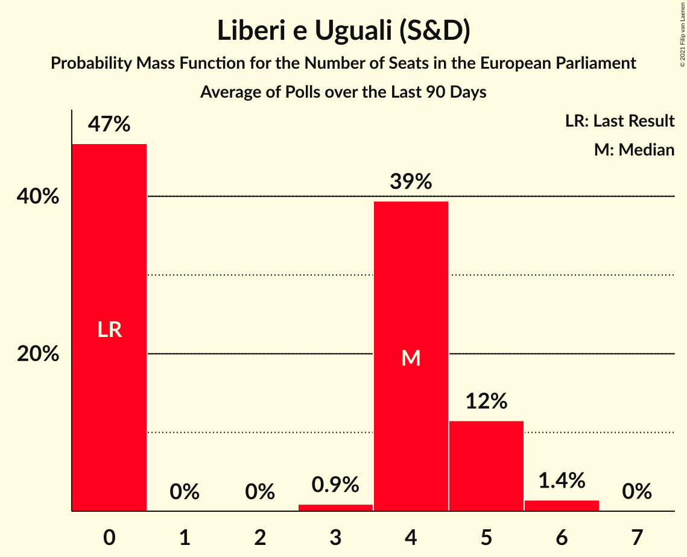

# Poll Average

<a href="#voting-intentions">Voting Intentions</a> | <a href="#seats">Seats</a> | <a href="#coalitions">Coalitions</a> | <a href="#technical-information">Technical Information</a>

## Summary

The table below lists the polls on which the average is based. They are the most recent polls (less than 90 days old) registered and analyzed so far.

| Period     | Polling firm/Commissioner(s) | PD | M5S | FI | LN | FdI | SVP | CPI | CP | I | NcI | +E | LeU | PaP |
|:----------:|:----------------------------:|:--:|:--:|:--:|:--:|:--:|:--:|:--:|:--:|:--:|:--:|:--:|:--:|:--:|
| 25 May 2014 | General Election | 40.8%   31 | 21.2%   17 | 16.8%   13 | 6.2%   5 | 3.7%   0 | 0.5%   1 | 0.0%   0 | 0.0%   0 | 0.0%   0 | 0.0%   0 | 0.0%   0 | 0.0%   0 | 0.0%   0 |
| N/A | Poll Average | 14–20%   11–16 | 23–31%   18–26 | 7–12%   6–10 | 28–36%   23–30 | 3–6%   0–5 | N/A   N/A | N/A   N/A | N/A   N/A | N/A   N/A | 0–2%   0 | 1–4%   0–4 | 1–4%   0 | 1–3%   0 |
| [8 January 2019](2019-01-08-EMGAcqua.html) | EMG Acqua   Rai 3 | 17–21%   13–16 | 24–28%   19–23 | 7–10%   6–8 | 29–33%   23–27 | 3–5%   0–4 | N/A   N/A | N/A   N/A | N/A   N/A | N/A   N/A | 0–1%   0 | 1–3%   0 | N/A   N/A | 1–3%   0 |
| [6–7 January 2019](2019-01-07-Tecnè.html) | Tecnè   Quarta Repubblica | 16–20%   11–15 | 22–28%   17–21 | 9–13%   7–10 | 29–35%   22–27 | 3–6%   0–4 | N/A   N/A | N/A   N/A | N/A   N/A | N/A   N/A | N/A   N/A | N/A   N/A | N/A   N/A | N/A   N/A |
| [3–7 January 2019](2019-01-07-SWG.html) | SWG   LA7 | 15–19%   12–16 | 24–29%   20–25 | 7–10%   6–8 | 30–35%   25–30 | 3–5%   0–4 | N/A   N/A | N/A   N/A | N/A   N/A | N/A   N/A | N/A   N/A | 2–4%   0 | 2–4%   0 | 2–3%   0 |
| [23–30 December 2018](2018-12-30-GPFInspiringResearch.html) | GPF Inspiring Research   La Notizia | 15–20%   11–15 | 26–32%   21–27 | 9–13%   7–11 | 29–35%   23–29 | 3–6%   0–5 | N/A   N/A | N/A   N/A | N/A   N/A | N/A   N/A | 0–1%   0 | 1–3%   0 | 2–4%   0 | 1–2%   0 |
| [20–21 December 2018](2018-12-21-Ipsos.html) | Ipsos   Corriere della Sera | 16–21%   12–16 | 24–30%   20–25 | 6–10%   5–8 | 30–36%   25–30 | 3–5%   0–4 | N/A   N/A | N/A   N/A | N/A   N/A | N/A   N/A | 0–2%   0 | 2–4%   0 | 2–4%   0 | N/A   N/A |
| [17–21 December 2018](2018-12-21-BiDiMedia.html) | BiDiMedia | 15–19%   11–15 | 24–29%   20–25 | 7–10%   5–8 | 29–34%   24–29 | 2–5%   0–4 | N/A   N/A | N/A   N/A | N/A   N/A | N/A   N/A | 0–1%   0 | 2–5%   0–4 | 1–3%   0 | 1–3%   0 |
| [20 December 2018](2018-12-20-LorienConsulting.html) | Lorien Consulting | 13–17%   10–14 | 26–31%   21–27 | 9–13%   8–11 | 29–34%   24–30 | 2–5%   0–4 | N/A   N/A | N/A   N/A | N/A   N/A | N/A   N/A | 0–2%   0 | 1–3%   0 | 2–4%   0 | 1–3%   0 |
| [10–19 December 2018](2018-12-19-CISE.html) | CISE | 15–19%   11–16 | 25–30%   20–26 | 7–10%   6–9 | 28–33%   23–29 | 3–5%   0–4 | N/A   N/A | N/A   N/A | N/A   N/A | N/A   N/A | N/A   N/A | 3–5%   0–4 | 2–4%   0–4 | 2–4%   0 |
| [12–14 December 2018](2018-12-14-QuorumandYouTrend.html) | Quorum and YouTrend   Sky TG 24 | 15–19%   10–14 | 25–31%   20–24 | 8–12%   6–9 | 29–35%   22–27 | 4–6%   0–5 | N/A   N/A | N/A   N/A | N/A   N/A | N/A   N/A | N/A   N/A | 1–3%   0 | N/A   N/A | N/A   N/A |
| [10–14 December 2018](2018-12-14-DemosPi.html) | Demos & Pi   La Repubblica | 15–20%   12–16 | 23–28%   19–25 | 8–11%   6–9 | 30–35%   25–30 | 3–5%   0–4 | N/A   N/A | N/A   N/A | N/A   N/A | N/A   N/A | N/A   N/A | 2–4%   0 | 2–4%   0–3 | 1–3%   0 |
| [12–13 December 2018](2018-12-13-Demopolis.html) | Demopolis | 15–19%   10–13 | 25–30%   20–23 | 7–10%   6–8 | 29–34%   23–27 | 2–4%   0–3 | N/A   N/A | N/A   N/A | N/A   N/A | N/A   N/A | N/A   N/A | N/A   N/A | N/A   N/A | N/A   N/A |
| [12 December 2018](2018-12-12-IndexResearch.html) | Index Research   LA7 | 15–20%   11–16 | 22–28%   18–23 | 6–10%   5–8 | 32–38%   26–32 | 3–6%   0–4 | N/A   N/A | N/A   N/A | N/A   N/A | N/A   N/A | N/A   N/A | 1–4%   0 | 1–3%   0 | 1–4%   0 |
| [10 December 2018](2018-12-10-Piepoli.html) | Piepoli   Rai 1 | 14–21%   10–16 | 25–33%   20–27 | 8–14%   7–11 | 27–35%   22–29 | 3–6%   0–5 | N/A   N/A | N/A   N/A | N/A   N/A | N/A   N/A | 0–2%   0 | 1–4%   0 | 2–4%   0–4 | N/A   N/A |
| [10 December 2018](2018-12-10-Euromedia.html) | Euromedia   Rai 1 | 15–20%   11–16 | 22–28%   17–23 | 8–12%   6–9 | 31–37%   25–31 | 3–6%   0–5 | N/A   N/A | N/A   N/A | N/A   N/A | N/A   N/A | 0–1%   0 | 2–5%   0–4 | 1–4%   0 | N/A   N/A |
| [22–24 November 2018](2018-11-24-ScenariPolitici–Winpoll.html) | Scenari Politici–Winpoll | 17–21%   14–17 | 24–29%   21–25 | 8–11%   7–10 | 29–34%   25–30 | 3–5%   0–4 | N/A   N/A | N/A   N/A | N/A   N/A | N/A   N/A | 1–2%   0 | 2–4%   0 | 1–3%   0 | 1–2%   0 |
| [7–9 November 2018](2018-11-09-Ixè.html) | Ixè   Huffington Post | 15–20%   12–16 | 23–29%   19–24 | 8–11%   6–10 | 27–33%   22–27 | 3–6%   0–5 | N/A   N/A | N/A   N/A | N/A   N/A | N/A   N/A | 0–1%   0 | 2–4%   0–3 | 2–4%   0 | 1–3%   0 |
| 25 May 2014 | General Election | 40.8%   31 | 21.2%   17 | 16.8%   13 | 6.2%   5 | 3.7%   0 | 0.5%   1 | 0.0%   0 | 0.0%   0 | 0.0%   0 | 0.0%   0 | 0.0%   0 | 0.0%   0 | 0.0%   0 |

Only polls for which at least the sample size has been published are included in the table above.

**Legend:**
+ **Top half of each row:** Voting intentions (95% confidence interval)
+ **Bottom half of each row:** Seat projections for the European Parliament (95% confidence interval)
+ **PD:** Partito Democratico (S&D)
+ **M5S:** Movimento 5 Stelle (EFDD)
+ **FI:** Forza Italia (EPP)
+ **LN:** Lega Nord (ENF)
+ **FdI:** Fratelli d’Italia (ECR)
+ **SVP:** Südtiroler Volkspartei (EPP)
+ **CPI:** CasaPound Italia (*)
+ **CP:** Civica Popolare (*)
+ **I:** Insieme (*)
+ **NcI:** Noi con l’Italia (EPP)
+ **+E:** Più Europa (ALDE)
+ **LeU:** Liberi e Uguali (S&D)
+ **PaP:** Potere al Popolo (GUE/NGL)
+ **N/A (single party):** Party not included the published results
+ **N/A (entire row):** Calculation for this opinion poll not started yet

## Voting Intentions

### Confidence Intervals

| Party | Last Result | Median | 80% Confidence Interval | 90% Confidence Interval | 95% Confidence Interval | 99% Confidence Interval |
|:-----:|:-----------:|:------:|:-----------------------:|:-----------------------:|:-----------------------:|:-----------------------:|
| <a href="#partito-democratico-(s&d)">Partito Democratico (S&D)</a> | 40.8% | 17.4% | 15.4–19.3% |14.8–19.9% | 14.2–20.3% | 13.2–21.2% |
| <a href="#movimento-5-stelle-(efdd)">Movimento 5 Stelle (EFDD)</a> | 21.2% | 26.6% | 24.3–29.1% |23.7–29.9% | 23.1–30.6% | 22.0–31.9% |
| <a href="#forza-italia-(epp)">Forza Italia (EPP)</a> | 16.8% | 9.2% | 7.6–11.3% |7.2–11.9% | 6.9–12.3% | 6.3–13.3% |
| <a href="#lega-nord-(enf)">Lega Nord (ENF)</a> | 6.2% | 31.8% | 29.6–34.3% |29.0–35.2% | 28.4–36.0% | 27.3–37.4% |
| <a href="#fratelli-d’italia-(ecr)">Fratelli d’Italia (ECR)</a> | 3.7% | 3.9% | 3.1–5.0% |2.9–5.3% | 2.7–5.6% | 2.4–6.3% |
| <a href="#südtiroler-volkspartei-(epp)">Südtiroler Volkspartei (EPP)</a> | 0.5% | N/A | N/A |N/A | N/A | N/A |
| <a href="#casapound-italia-(*)">CasaPound Italia (*)</a> | 0.0% | N/A | N/A |N/A | N/A | N/A |
| <a href="#civica-popolare-(*)">Civica Popolare (*)</a> | 0.0% | N/A | N/A |N/A | N/A | N/A |
| <a href="#insieme-(*)">Insieme (*)</a> | 0.0% | N/A | N/A |N/A | N/A | N/A |
| <a href="#noi-con-l’italia-(epp)">Noi con l’Italia (EPP)</a> | 0.0% | 0.7% | 0.3–1.3% |0.2–1.4% | 0.2–1.6% | 0.1–1.9% |
| <a href="#più-europa-(alde)">Più Europa (ALDE)</a> | 0.0% | 2.6% | 1.7–3.7% |1.5–4.1% | 1.4–4.4% | 1.1–4.9% |
| <a href="#liberi-e-uguali-(s&d)">Liberi e Uguali (S&D)</a> | 0.0% | 2.6% | 1.8–3.4% |1.6–3.7% | 1.4–3.9% | 1.2–4.4% |
| <a href="#potere-al-popolo-(gue/ngl)">Potere al Popolo (GUE/NGL)</a> | 0.0% | 2.0% | 1.3–2.7% |1.2–2.9% | 1.0–3.1% | 0.8–3.6% |

### Partito Democratico (S&D)

*For a full overview of the results for this party, see the [Partito Democratico (S&D)](party-partitodemocraticosd.html) page.*

| Voting Intentions | Probability | Accumulated | Special Marks |
|:-----------------:|:-----------:|:-----------:|:-------------:|
| 10.5–11.5% | 0% | 100% |  |
| 11.5–12.5% | 0.1% | 100% |  |
| 12.5–13.5% | 0.8% | 99.9% |  |
| 13.5–14.5% | 3% | 99.0% |  |
| 14.5–15.5% | 8% | 96% |  |
| 15.5–16.5% | 18% | 89% |  |
| 16.5–17.5% | 25% | 71% | Median |
| 17.5–18.5% | 23% | 45% |  |
| 18.5–19.5% | 14% | 22% |  |
| 19.5–20.5% | 6% | 8% |  |
| 20.5–21.5% | 1.5% | 2% |  |
| 21.5–22.5% | 0.2% | 0.2% |  |
| 22.5–23.5% | 0% | 0% |  |
| 23.5–24.5% | 0% | 0% |  |
| 24.5–25.5% | 0% | 0% |  |
| 25.5–26.5% | 0% | 0% |  |
| 26.5–27.5% | 0% | 0% |  |
| 27.5–28.5% | 0% | 0% |  |
| 28.5–29.5% | 0% | 0% |  |
| 29.5–30.5% | 0% | 0% |  |
| 30.5–31.5% | 0% | 0% |  |
| 31.5–32.5% | 0% | 0% |  |
| 32.5–33.5% | 0% | 0% |  |
| 33.5–34.5% | 0% | 0% |  |
| 34.5–35.5% | 0% | 0% |  |
| 35.5–36.5% | 0% | 0% |  |
| 36.5–37.5% | 0% | 0% |  |
| 37.5–38.5% | 0% | 0% |  |
| 38.5–39.5% | 0% | 0% |  |
| 39.5–40.5% | 0% | 0% |  |
| 40.5–41.5% | 0% | 0% | Last Result |

### Movimento 5 Stelle (EFDD)

*For a full overview of the results for this party, see the [Movimento 5 Stelle (EFDD)](party-movimento5stelleefdd.html) page.*

| Voting Intentions | Probability | Accumulated | Special Marks |
|:-----------------:|:-----------:|:-----------:|:-------------:|
| 19.5–20.5% | 0% | 100% |  |
| 20.5–21.5% | 0.2% | 100% | Last Result |
| 21.5–22.5% | 1.0% | 99.8% |  |
| 22.5–23.5% | 3% | 98.8% |  |
| 23.5–24.5% | 8% | 96% |  |
| 24.5–25.5% | 15% | 88% |  |
| 25.5–26.5% | 21% | 73% |  |
| 26.5–27.5% | 21% | 52% | Median |
| 27.5–28.5% | 15% | 31% |  |
| 28.5–29.5% | 9% | 16% |  |
| 29.5–30.5% | 4% | 7% |  |
| 30.5–31.5% | 2% | 3% |  |
| 31.5–32.5% | 0.6% | 0.8% |  |
| 32.5–33.5% | 0.2% | 0.2% |  |
| 33.5–34.5% | 0% | 0.1% |  |
| 34.5–35.5% | 0% | 0% |  |

### Forza Italia (EPP)

*For a full overview of the results for this party, see the [Forza Italia (EPP)](party-forzaitaliaepp.html) page.*

| Voting Intentions | Probability | Accumulated | Special Marks |
|:-----------------:|:-----------:|:-----------:|:-------------:|
| 4.5–5.5% | 0% | 100% |  |
| 5.5–6.5% | 1.1% | 100% |  |
| 6.5–7.5% | 8% | 98.9% |  |
| 7.5–8.5% | 23% | 91% |  |
| 8.5–9.5% | 27% | 68% | Median |
| 9.5–10.5% | 20% | 41% |  |
| 10.5–11.5% | 13% | 20% |  |
| 11.5–12.5% | 6% | 7% |  |
| 12.5–13.5% | 1.5% | 2% |  |
| 13.5–14.5% | 0.2% | 0.3% |  |
| 14.5–15.5% | 0% | 0% |  |
| 15.5–16.5% | 0% | 0% |  |
| 16.5–17.5% | 0% | 0% | Last Result |

### Lega Nord (ENF)

*For a full overview of the results for this party, see the [Lega Nord (ENF)](party-leganordenf.html) page.*

| Voting Intentions | Probability | Accumulated | Special Marks |
|:-----------------:|:-----------:|:-----------:|:-------------:|
| 5.5–6.5% | 0% | 100% | Last Result |
| 6.5–7.5% | 0% | 100% |  |
| 7.5–8.5% | 0% | 100% |  |
| 8.5–9.5% | 0% | 100% |  |
| 9.5–10.5% | 0% | 100% |  |
| 10.5–11.5% | 0% | 100% |  |
| 11.5–12.5% | 0% | 100% |  |
| 12.5–13.5% | 0% | 100% |  |
| 13.5–14.5% | 0% | 100% |  |
| 14.5–15.5% | 0% | 100% |  |
| 15.5–16.5% | 0% | 100% |  |
| 16.5–17.5% | 0% | 100% |  |
| 17.5–18.5% | 0% | 100% |  |
| 18.5–19.5% | 0% | 100% |  |
| 19.5–20.5% | 0% | 100% |  |
| 20.5–21.5% | 0% | 100% |  |
| 21.5–22.5% | 0% | 100% |  |
| 22.5–23.5% | 0% | 100% |  |
| 23.5–24.5% | 0% | 100% |  |
| 24.5–25.5% | 0% | 100% |  |
| 25.5–26.5% | 0.1% | 100% |  |
| 26.5–27.5% | 0.6% | 99.8% |  |
| 27.5–28.5% | 2% | 99.2% |  |
| 28.5–29.5% | 6% | 97% |  |
| 29.5–30.5% | 14% | 91% |  |
| 30.5–31.5% | 21% | 77% |  |
| 31.5–32.5% | 22% | 56% | Median |
| 32.5–33.5% | 16% | 33% |  |
| 33.5–34.5% | 9% | 17% |  |
| 34.5–35.5% | 5% | 8% |  |
| 35.5–36.5% | 2% | 4% |  |
| 36.5–37.5% | 1.0% | 1.4% |  |
| 37.5–38.5% | 0.3% | 0.4% |  |
| 38.5–39.5% | 0.1% | 0.1% |  |
| 39.5–40.5% | 0% | 0% |  |

### Fratelli d’Italia (ECR)

*For a full overview of the results for this party, see the [Fratelli d’Italia (ECR)](party-fratellid’italiaecr.html) page.*

| Voting Intentions | Probability | Accumulated | Special Marks |
|:-----------------:|:-----------:|:-----------:|:-------------:|
| 0.5–1.5% | 0% | 100% |  |
| 1.5–2.5% | 1.3% | 100% |  |
| 2.5–3.5% | 28% | 98.7% |  |
| 3.5–4.5% | 49% | 70% | Last Result, Median |
| 4.5–5.5% | 18% | 21% |  |
| 5.5–6.5% | 3% | 3% |  |
| 6.5–7.5% | 0.2% | 0.2% |  |
| 7.5–8.5% | 0% | 0% |  |

### Più Europa (ALDE)

*For a full overview of the results for this party, see the [Più Europa (ALDE)](party-piùeuropaalde.html) page.*

| Voting Intentions | Probability | Accumulated | Special Marks |
|:-----------------:|:-----------:|:-----------:|:-------------:|
| 0.0–0.5% | 0% | 100% | Last Result |
| 0.5–1.5% | 5% | 100% |  |
| 1.5–2.5% | 42% | 95% |  |
| 2.5–3.5% | 38% | 52% | Median |
| 3.5–4.5% | 12% | 14% |  |
| 4.5–5.5% | 1.4% | 1.5% |  |
| 5.5–6.5% | 0% | 0% |  |
| 6.5–7.5% | 0% | 0% |  |

### Noi con l’Italia (EPP)

*For a full overview of the results for this party, see the [Noi con l’Italia (EPP)](party-noiconl’italiaepp.html) page.*

| Voting Intentions | Probability | Accumulated | Special Marks |
|:-----------------:|:-----------:|:-----------:|:-------------:|
| 0.0–0.5% | 31% | 100% | Last Result |
| 0.5–1.5% | 67% | 69% | Median |
| 1.5–2.5% | 3% | 3% |  |
| 2.5–3.5% | 0% | 0% |  |

### Potere al Popolo (GUE/NGL)

*For a full overview of the results for this party, see the [Potere al Popolo (GUE/NGL)](party-poterealpopologuengl.html) page.*

| Voting Intentions | Probability | Accumulated | Special Marks |
|:-----------------:|:-----------:|:-----------:|:-------------:|
| 0.0–0.5% | 0% | 100% | Last Result |
| 0.5–1.5% | 22% | 100% |  |
| 1.5–2.5% | 63% | 78% | Median |
| 2.5–3.5% | 15% | 15% |  |
| 3.5–4.5% | 0.5% | 0.5% |  |
| 4.5–5.5% | 0% | 0% |  |

### Liberi e Uguali (S&D)

*For a full overview of the results for this party, see the [Liberi e Uguali (S&D)](party-liberieugualisd.html) page.*

| Voting Intentions | Probability | Accumulated | Special Marks |
|:-----------------:|:-----------:|:-----------:|:-------------:|
| 0.0–0.5% | 0% | 100% | Last Result |
| 0.5–1.5% | 4% | 100% |  |
| 1.5–2.5% | 45% | 96% |  |
| 2.5–3.5% | 44% | 51% | Median |
| 3.5–4.5% | 7% | 7% |  |
| 4.5–5.5% | 0.3% | 0.3% |  |
| 5.5–6.5% | 0% | 0% |  |

## Seats

### Confidence Intervals

| Party | Last Result | Median | 80% Confidence Interval | 90% Confidence Interval | 95% Confidence Interval | 99% Confidence Interval |
|:-----:|:-----------:|:------:|:-----------------------:|:-----------------------:|:-----------------------:|:-----------------------:|
| <a href="#partito-democratico-(s&d)">Partito Democratico (S&D)</a> | 31 | 13 | 11–15 |11–16 | 11–16 | 10–17 |
| <a href="#movimento-5-stelle-(efdd)">Movimento 5 Stelle (EFDD)</a> | 17 | 22 | 20–24 |19–25 | 18–26 | 17–27 |
| <a href="#forza-italia-(epp)">Forza Italia (EPP)</a> | 13 | 8 | 6–9 |6–10 | 6–10 | 5–11 |
| <a href="#lega-nord-(enf)">Lega Nord (ENF)</a> | 5 | 26 | 24–29 |23–29 | 23–30 | 22–31 |
| <a href="#fratelli-d’italia-(ecr)">Fratelli d’Italia (ECR)</a> | 0 | 0 | 0–4 |0–4 | 0–5 | 0–5 |
| <a href="#südtiroler-volkspartei-(epp)">Südtiroler Volkspartei (EPP)</a> | 1 | N/A | N/A |N/A | N/A | N/A |
| <a href="#casapound-italia-(*)">CasaPound Italia (*)</a> | 0 | N/A | N/A |N/A | N/A | N/A |
| <a href="#civica-popolare-(*)">Civica Popolare (*)</a> | 0 | N/A | N/A |N/A | N/A | N/A |
| <a href="#insieme-(*)">Insieme (*)</a> | 0 | N/A | N/A |N/A | N/A | N/A |
| <a href="#noi-con-l’italia-(epp)">Noi con l’Italia (EPP)</a> | 0 | 0 | 0 |0 | 0 | 0 |
| <a href="#più-europa-(alde)">Più Europa (ALDE)</a> | 0 | 0 | 0 |0–3 | 0–4 | 0–4 |
| <a href="#liberi-e-uguali-(s&d)">Liberi e Uguali (S&D)</a> | 0 | 0 | 0 |0 | 0 | 0–4 |
| <a href="#potere-al-popolo-(gue/ngl)">Potere al Popolo (GUE/NGL)</a> | 0 | 0 | 0 |0 | 0 | 0 |

### Partito Democratico (S&D)

*For a full overview of the results for this party, see the [Partito Democratico (S&D)](party-partitodemocraticosd.html) page.*

| Number of Seats | Probability | Accumulated | Special Marks |
|:---------------:|:-----------:|:-----------:|:-------------:|
| 9 | 0.1% | 100% |  |
| 10 | 1.4% | 99.9% |  |
| 11 | 9% | 98% |  |
| 12 | 20% | 90% |  |
| 13 | 26% | 70% | Median |
| 14 | 23% | 45% |  |
| 15 | 15% | 22% |  |
| 16 | 5% | 7% |  |
| 17 | 1.2% | 1.3% |  |
| 18 | 0.1% | 0.1% |  |
| 19 | 0% | 0% |  |
| 20 | 0% | 0% |  |
| 21 | 0% | 0% |  |
| 22 | 0% | 0% |  |
| 23 | 0% | 0% |  |
| 24 | 0% | 0% |  |
| 25 | 0% | 0% |  |
| 26 | 0% | 0% |  |
| 27 | 0% | 0% |  |
| 28 | 0% | 0% |  |
| 29 | 0% | 0% |  |
| 30 | 0% | 0% |  |
| 31 | 0% | 0% | Last Result |

### Movimento 5 Stelle (EFDD)

*For a full overview of the results for this party, see the [Movimento 5 Stelle (EFDD)](party-movimento5stelleefdd.html) page.*

| Number of Seats | Probability | Accumulated | Special Marks |
|:---------------:|:-----------:|:-----------:|:-------------:|
| 16 | 0.1% | 100% |  |
| 17 | 0.7% | 99.9% | Last Result |
| 18 | 2% | 99.3% |  |
| 19 | 6% | 97% |  |
| 20 | 12% | 91% |  |
| 21 | 19% | 79% |  |
| 22 | 22% | 61% | Median |
| 23 | 17% | 38% |  |
| 24 | 12% | 21% |  |
| 25 | 6% | 10% |  |
| 26 | 2% | 3% |  |
| 27 | 1.0% | 1.1% |  |
| 28 | 0.1% | 0.2% |  |
| 29 | 0% | 0% |  |

### Forza Italia (EPP)

*For a full overview of the results for this party, see the [Forza Italia (EPP)](party-forzaitaliaepp.html) page.*

| Number of Seats | Probability | Accumulated | Special Marks |
|:---------------:|:-----------:|:-----------:|:-------------:|
| 5 | 1.5% | 100% |  |
| 6 | 14% | 98% |  |
| 7 | 32% | 84% |  |
| 8 | 28% | 53% | Median |
| 9 | 17% | 24% |  |
| 10 | 6% | 8% |  |
| 11 | 1.4% | 2% |  |
| 12 | 0.2% | 0.2% |  |
| 13 | 0% | 0% | Last Result |

### Lega Nord (ENF)

*For a full overview of the results for this party, see the [Lega Nord (ENF)](party-leganordenf.html) page.*

| Number of Seats | Probability | Accumulated | Special Marks |
|:---------------:|:-----------:|:-----------:|:-------------:|
| 5 | 0% | 100% | Last Result |
| 6 | 0% | 100% |  |
| 7 | 0% | 100% |  |
| 8 | 0% | 100% |  |
| 9 | 0% | 100% |  |
| 10 | 0% | 100% |  |
| 11 | 0% | 100% |  |
| 12 | 0% | 100% |  |
| 13 | 0% | 100% |  |
| 14 | 0% | 100% |  |
| 15 | 0% | 100% |  |
| 16 | 0% | 100% |  |
| 17 | 0% | 100% |  |
| 18 | 0% | 100% |  |
| 19 | 0% | 100% |  |
| 20 | 0% | 100% |  |
| 21 | 0.1% | 100% |  |
| 22 | 1.1% | 99.8% |  |
| 23 | 5% | 98.7% |  |
| 24 | 11% | 94% |  |
| 25 | 18% | 83% |  |
| 26 | 19% | 64% | Median |
| 27 | 18% | 45% |  |
| 28 | 14% | 27% |  |
| 29 | 8% | 12% |  |
| 30 | 3% | 5% |  |
| 31 | 1.1% | 1.4% |  |
| 32 | 0.3% | 0.4% |  |
| 33 | 0% | 0.1% |  |
| 34 | 0% | 0% |  |

### Fratelli d’Italia (ECR)

*For a full overview of the results for this party, see the [Fratelli d’Italia (ECR)](party-fratellid’italiaecr.html) page.*

| Number of Seats | Probability | Accumulated | Special Marks |
|:---------------:|:-----------:|:-----------:|:-------------:|
| 0 | 55% | 100% | Last Result, Median |
| 1 | 0% | 45% |  |
| 2 | 0% | 45% |  |
| 3 | 15% | 45% |  |
| 4 | 28% | 30% |  |
| 5 | 3% | 3% |  |
| 6 | 0.1% | 0.1% |  |
| 7 | 0% | 0% |  |

### Più Europa (ALDE)

*For a full overview of the results for this party, see the [Più Europa (ALDE)](party-piùeuropaalde.html) page.*

| Number of Seats | Probability | Accumulated | Special Marks |
|:---------------:|:-----------:|:-----------:|:-------------:|
| 0 | 94% | 100% | Last Result, Median |
| 1 | 0% | 6% |  |
| 2 | 0% | 6% |  |
| 3 | 2% | 6% |  |
| 4 | 4% | 4% |  |
| 5 | 0.1% | 0.1% |  |
| 6 | 0% | 0% |  |

### Noi con l’Italia (EPP)

*For a full overview of the results for this party, see the [Noi con l’Italia (EPP)](party-noiconl’italiaepp.html) page.*

| Number of Seats | Probability | Accumulated | Special Marks |
|:---------------:|:-----------:|:-----------:|:-------------:|
| 0 | 100% | 100% | Last Result, Median |

### Potere al Popolo (GUE/NGL)

*For a full overview of the results for this party, see the [Potere al Popolo (GUE/NGL)](party-poterealpopologuengl.html) page.*

| Number of Seats | Probability | Accumulated | Special Marks |
|:---------------:|:-----------:|:-----------:|:-------------:|
| 0 | 99.9% | 100% | Last Result, Median |
| 1 | 0% | 0.1% |  |
| 2 | 0% | 0.1% |  |
| 3 | 0.1% | 0.1% |  |
| 4 | 0% | 0% |  |

### Liberi e Uguali (S&D)

*For a full overview of the results for this party, see the [Liberi e Uguali (S&D)](party-liberieugualisd.html) page.*

| Number of Seats | Probability | Accumulated | Special Marks |
|:---------------:|:-----------:|:-----------:|:-------------:|
| 0 | 98% | 100% | Last Result, Median |
| 1 | 0% | 2% |  |
| 2 | 0% | 2% |  |
| 3 | 0.9% | 2% |  |
| 4 | 0.8% | 0.8% |  |
| 5 | 0% | 0% |  |

## Coalitions

### Confidence Intervals

| Coalition | Last Result | Median | Majority? | 80% Confidence Interval | 90% Confidence Interval | 95% Confidence Interval | 99% Confidence Interval |
|:---------:|:-----------:|:------:|:---------:|:-----------------------:|:-----------------------:|:-----------------------:|:-----------------------:|
| Lega Nord (ENF) | 5 | 26 | 0% | 24–29 | 23–29 | 23–30 | 22–31 |
| Movimento 5 Stelle (EFDD) | 17 | 22 | 0% | 20–24 | 19–25 | 18–26 | 17–27 |
| Partito Democratico (S&D) – Liberi e Uguali (S&D) | 31 | 13 | 0% | 12–15 | 11–16 | 11–16 | 10–17 |
| Forza Italia (EPP) – Südtiroler Volkspartei (EPP) – Noi con l’Italia (EPP) | 14 | 9 | 0% | 7–10 | 7–11 | 7–11 | 6–12 |
| Fratelli d’Italia (ECR) | 0 | 0 | 0% | 0–4 | 0–4 | 0–5 | 0–5 |
| Più Europa (ALDE) | 0 | 0 | 0% | 0 | 0–3 | 0–4 | 0–4 |
| CasaPound Italia (*) – Civica Popolare (*) – Insieme (*) | 0 | 0 | 0% | 0 | 0 | 0 | 0 |
| Potere al Popolo (GUE/NGL) | 0 | 0 | 0% | 0 | 0 | 0 | 0 |

### Lega Nord (ENF)

| Number of Seats | Probability | Accumulated | Special Marks |
|:---------------:|:-----------:|:-----------:|:-------------:|
| 5 | 0% | 100% | Last Result |
| 6 | 0% | 100% |  |
| 7 | 0% | 100% |  |
| 8 | 0% | 100% |  |
| 9 | 0% | 100% |  |
| 10 | 0% | 100% |  |
| 11 | 0% | 100% |  |
| 12 | 0% | 100% |  |
| 13 | 0% | 100% |  |
| 14 | 0% | 100% |  |
| 15 | 0% | 100% |  |
| 16 | 0% | 100% |  |
| 17 | 0% | 100% |  |
| 18 | 0% | 100% |  |
| 19 | 0% | 100% |  |
| 20 | 0% | 100% |  |
| 21 | 0.1% | 100% |  |
| 22 | 1.1% | 99.8% |  |
| 23 | 5% | 98.7% |  |
| 24 | 11% | 94% |  |
| 25 | 18% | 83% |  |
| 26 | 19% | 64% | Median |
| 27 | 18% | 45% |  |
| 28 | 14% | 27% |  |
| 29 | 8% | 12% |  |
| 30 | 3% | 5% |  |
| 31 | 1.1% | 1.4% |  |
| 32 | 0.3% | 0.4% |  |
| 33 | 0% | 0.1% |  |
| 34 | 0% | 0% |  |

### Movimento 5 Stelle (EFDD)

| Number of Seats | Probability | Accumulated | Special Marks |
|:---------------:|:-----------:|:-----------:|:-------------:|
| 16 | 0.1% | 100% |  |
| 17 | 0.7% | 99.9% | Last Result |
| 18 | 2% | 99.3% |  |
| 19 | 6% | 97% |  |
| 20 | 12% | 91% |  |
| 21 | 19% | 79% |  |
| 22 | 22% | 61% | Median |
| 23 | 17% | 38% |  |
| 24 | 12% | 21% |  |
| 25 | 6% | 10% |  |
| 26 | 2% | 3% |  |
| 27 | 1.0% | 1.1% |  |
| 28 | 0.1% | 0.2% |  |
| 29 | 0% | 0% |  |

### Partito Democratico (S&D) – Liberi e Uguali (S&D)

| Number of Seats | Probability | Accumulated | Special Marks |
|:---------------:|:-----------:|:-----------:|:-------------:|
| 9 | 0.1% | 100% |  |
| 10 | 1.4% | 99.9% |  |
| 11 | 8% | 98% |  |
| 12 | 19% | 90% |  |
| 13 | 25% | 71% | Median |
| 14 | 23% | 46% |  |
| 15 | 15% | 23% |  |
| 16 | 6% | 7% |  |
| 17 | 2% | 2% |  |
| 18 | 0.3% | 0.4% |  |
| 19 | 0.1% | 0.1% |  |
| 20 | 0% | 0% |  |
| 21 | 0% | 0% |  |
| 22 | 0% | 0% |  |
| 23 | 0% | 0% |  |
| 24 | 0% | 0% |  |
| 25 | 0% | 0% |  |
| 26 | 0% | 0% |  |
| 27 | 0% | 0% |  |
| 28 | 0% | 0% |  |
| 29 | 0% | 0% |  |
| 30 | 0% | 0% |  |
| 31 | 0% | 0% | Last Result |

### Forza Italia (EPP) – Südtiroler Volkspartei (EPP) – Noi con l’Italia (EPP)

| Number of Seats | Probability | Accumulated | Special Marks |
|:---------------:|:-----------:|:-----------:|:-------------:|
| 6 | 1.5% | 100% |  |
| 7 | 14% | 98% |  |
| 8 | 32% | 84% | Median |
| 9 | 28% | 53% |  |
| 10 | 17% | 24% |  |
| 11 | 6% | 8% |  |
| 12 | 1.4% | 2% |  |
| 13 | 0.2% | 0.2% |  |
| 14 | 0% | 0% | Last Result |

### Fratelli d’Italia (ECR)

| Number of Seats | Probability | Accumulated | Special Marks |
|:---------------:|:-----------:|:-----------:|:-------------:|
| 0 | 55% | 100% | Last Result, Median |
| 1 | 0% | 45% |  |
| 2 | 0% | 45% |  |
| 3 | 15% | 45% |  |
| 4 | 28% | 30% |  |
| 5 | 3% | 3% |  |
| 6 | 0.1% | 0.1% |  |
| 7 | 0% | 0% |  |

### Più Europa (ALDE)

| Number of Seats | Probability | Accumulated | Special Marks |
|:---------------:|:-----------:|:-----------:|:-------------:|
| 0 | 95% | 100% | Last Result, Median |
| 1 | 0% | 5% |  |
| 2 | 0% | 5% |  |
| 3 | 2% | 5% |  |
| 4 | 3% | 3% |  |
| 5 | 0.1% | 0.1% |  |
| 6 | 0% | 0% |  |

### CasaPound Italia (*) – Civica Popolare (*) – Insieme (*)

| Number of Seats | Probability | Accumulated | Special Marks |
|:---------------:|:-----------:|:-----------:|:-------------:|
| 0 | 100% | 100% | Last Result, Median |

### Potere al Popolo (GUE/NGL)

| Number of Seats | Probability | Accumulated | Special Marks |
|:---------------:|:-----------:|:-----------:|:-------------:|
| 0 | 100% | 100% | Last Result, Median |

## Technical Information

+ **Number of polls included in this average:** 16
+ **Lowest number of simulations done in a poll included in this average:** 1,048,576
+ **Total number of simulations done in the polls included in this average:** 16,777,216
+ **Error estimate:** 3.20%
