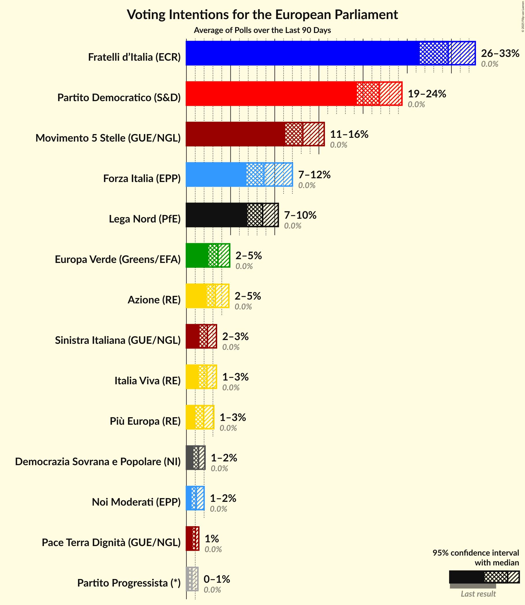
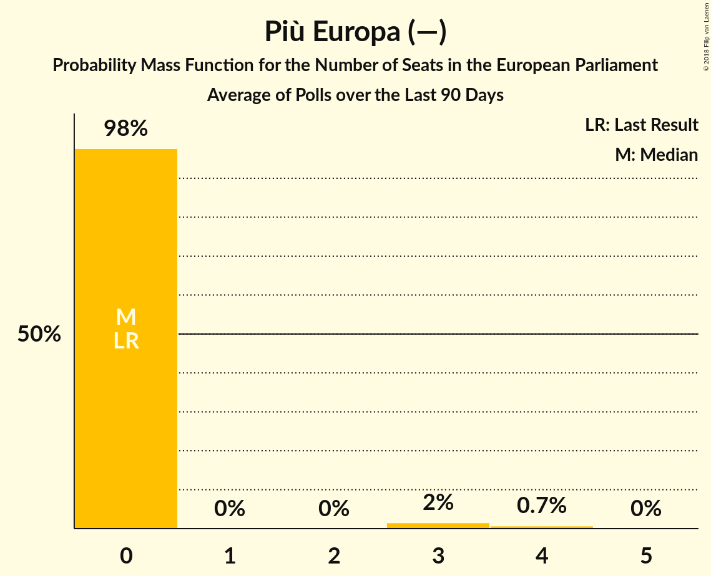

# Poll Average

<a href="#voting-intentions">Voting Intentions</a> | <a href="#seats">Seats</a> | <a href="#coalitions">Coalitions</a> | <a href="#technical-information">Technical Information</a>

## Summary

The table below lists the polls on which the average is based. They are the most recent polls (less than 90 days old) registered and analyzed so far.

| Period     | Polling firm/Commissioner(s) | PD | M5S | FI | LN | FdI | SVP | CPI | CP | I | NcI | +E | LeU | PaP |
|:----------:|:----------------------------:|:--:|:--:|:--:|:--:|:--:|:--:|:--:|:--:|:--:|:--:|:--:|:--:|:--:|
| 25 May 2014 | General Election | 40.8%   31 | 21.1%   17 | 16.8%   13 | 6.2%   5 | 3.7%   0 | 0.5%   1 | 0.0%   0 | 0.0%   0 | 0.0%   0 | 0.0%   0 | 0.0%   0 | 0.0%   0 | 0.0%   0 |
| N/A | Poll Average | 17–26%   13–21 | 24–36%   21–31 | 10–20%   9–17 | 10–23%   9–20 | 3–6%   0–5 | N/A   N/A | 0–2%   0 | 0–2%   0 | 0–2%   0 | 1–4%   0 | 1–4%   0–3 | 3–7%   0–6 | 1–3%   0 |
| [12–15 March 2018](2018-03-15-DemosPi.html) | Demos & Pi   La Repubblica | 16–21%   12–15 | 31–36%   24–29 | 11–15%   9–12 | 16–20%   13–16 | 4–6%   0–5 | N/A   N/A | N/A   N/A | N/A   N/A | N/A   N/A | N/A   N/A | 1–3%   0 | 3–5%   0–4 | N/A   N/A |
| [12–14 March 2018](2018-03-14-SWG.html) | SWG   Il Messaggero | 16–21%   13–17 | 32–38%   27–33 | 9–13%   8–11 | 20–25%   17–22 | 2–4%   0–4 | N/A   N/A | 0–1%   0 | N/A   N/A | N/A   N/A | 1–2%   0 | 1–3%   0 | 2–4%   0 | 1–3%   0 |
| [12–16 February 2018](2018-02-16-TermometroPolitico.html) | Termometro Politico | 20–23%   16–18 | 25–28%   22–24 | 15–17%   12–14 | 14–16%   13 | 4–6%   4 | N/A   N/A | 1–2%   0 | 1%   0 | 1%   0 | 1–2%   0 | 2–3%   0 | 5–6%   4–5 | 1–2%   0 |
| [14–15 February 2018](2018-02-15-Demopolis.html) | Demopolis | 21–24%   16–19 | 26–30%   22–24 | 15–18%   12–15 | 13–16%   11–13 | 4–6%   3–5 | N/A   N/A | N/A   N/A | 1–2%   0 | 1–2%   0 | 2–3%   0 | 2–3%   0 | 5–7%   4–6 | N/A   N/A |
| [13–14 February 2018](2018-02-14-Piepoli.html) | Piepoli | 21–29%   16–22 | 23–31%   19–26 | 13–20%   11–16 | 10–16%   9–13 | 3–7%   0–6 | N/A   N/A | 0–2%   0 | 0–2%   0 | 0–2%   0 | 2–5%   0–4 | 2–5%   0–4 | 4–8%   4–7 | N/A   N/A |
| [12–14 February 2018](2018-02-14-Ixè.html) | Ixè   Huffington Post | 19–24%   14–20 | 25–31%   21–27 | 16–21%   13–17 | 9–13%   8–11 | 4–6%   0–5 | N/A   N/A | N/A   N/A | 0–1%   0 | 0–1%   0 | 1–3%   0 | 3–5%   0–4 | 5–8%   4–6 | 1–3%   0 |
| [12–14 February 2018](2018-02-14-Index.html) | Index | 20–26%   16–21 | 25–31%   21–25 | 14–19%   12–16 | 12–16%   10–14 | 4–7%   0–5 | N/A   N/A | N/A   N/A | 1–2%   0 | 1–2%   0 | 2–4%   0 | 1–4%   0 | 4–8%   4–6 | N/A   N/A |
| [14 February 2018](2018-02-14-Euromedia.html) | Euromedia | 19–25%   15–20 | 24–30%   20–24 | 15–20%   12–16 | 12–17%   10–14 | 4–7%   0–5 | N/A   N/A | 0–1%   0 | 0–1%   0 | 0–2%   0 | 1–4%   0 | 1–4%   0 | 4–8%   4–6 | N/A   N/A |
| [5–14 February 2018](2018-02-14-Demetra.html) | Demetra | 23–25%   17–19 | 28–31%   24–25 | 14–16%   11–13 | 14–16%   11–13 | 4–5%   3–4 | N/A   N/A | 0–1%   0 | 0–1%   0 | 0–1%   0 | 0–1%   0 | 2–3%   0 | 5–6%   4–5 | 1–2%   0 |
| [12–13 February 2018](2018-02-13-Tecnè.html) | Tecnè | 19–24%   15–19 | 26–31%   21–26 | 16–21%   13–17 | 11–15%   9–12 | 4–7%   0–5 | N/A   N/A | N/A   N/A | N/A   N/A | N/A   N/A | 2–4%   0–3 | 2–4%   0 | 4–7%   3–6 | N/A   N/A |
| [8–12 February 2018](2018-02-12-Bidimedia.html) | Bidimedia | 22–27%   18–23 | 23–28%   20–24 | 14–18%   13–17 | 13–17%   11–14 | 3–5%   0–5 | N/A   N/A | 1–2%   0 | 1–2%   0 | 1–2%   0 | 2–4%   0 | 1–3%   0 | 4–6%   0–6 | 1–2%   0 |
| [8–11 February 2018](2018-02-11-LorienConsulting.html) | Lorien Consulting | 21–26%   16–21 | 25–30%   21–26 | 16–20%   12–17 | 10–14%   9–12 | 3–6%   0–5 | N/A   N/A | 1–2%   0 | 1–2%   0 | 0–2%   0 | 1–2%   0 | 1–2%   0 | 4–7%   3–5 | 2–4%   0 |
| [9–11 February 2018](2018-02-11-EMG.html) | EMG   TG LA7 | 21–25%   15–19 | 25–30%   23–24 | 14–18%   13–15 | 12–16%   11–12 | 4–6%   4–5 | N/A   N/A | 0–1%   0 | 1–2%   0 | 1–2%   0 | 2–4%   0 | 2–3%   0 | 4–6%   5 | 0–1%   0 |
| 25 May 2014 | General Election | 40.8%   31 | 21.1%   17 | 16.8%   13 | 6.2%   5 | 3.7%   0 | 0.5%   1 | 0.0%   0 | 0.0%   0 | 0.0%   0 | 0.0%   0 | 0.0%   0 | 0.0%   0 | 0.0%   0 |

Only polls for which at least the sample size has been published are included in the table above.

**Legend:**
+ **Top half of each row:** Voting intentions (95% confidence interval)
+ **Bottom half of each row:** Seat projections for the European Parliament (95% confidence interval)
+ **PD:** Partito Democratico (S&D)
+ **M5S:** Movimento 5 Stelle (EFDD)
+ **FI:** Forza Italia (EPP)
+ **LN:** Lega Nord (ENF)
+ **FdI:** Fratelli d’Italia (—)
+ **SVP:** Südtiroler Volkspartei (EPP)
+ **CPI:** CasaPound Italia (—)
+ **CP:** Civica Popolare (—)
+ **I:** Insieme (—)
+ **NcI:** Noi con l’Italia (—)
+ **+E:** Più Europa (—)
+ **LeU:** Liberi e Uguali (S&D)
+ **PaP:** Potere al Popolo (GUE/NGL)
+ **N/A (single party):** Party not included the published results
+ **N/A (entire row):** Calculation for this opinion poll not started yet

## Voting Intentions

### Confidence Intervals

| Party | Last Result | Median | 80% Confidence Interval | 90% Confidence Interval | 95% Confidence Interval | 99% Confidence Interval |
|:-----:|:-----------:|:------:|:-----------------------:|:-----------------------:|:-----------------------:|:-----------------------:|
| <a href="#partito-democratico-(s&d)">Partito Democratico (S&D)</a> | 40.8% | 22.4% | 18.6–24.8% |17.7–25.5% | 17.1–26.2% | 16.1–27.7% |
| <a href="#movimento-5-stelle-(efdd)">Movimento 5 Stelle (EFDD)</a> | 21.1% | 27.9% | 25.5–33.6% |24.8–34.8% | 24.2–35.6% | 23.2–37.0% |
| <a href="#forza-italia-(epp)">Forza Italia (EPP)</a> | 16.8% | 16.3% | 12.4–18.7% |10.9–19.3% | 10.1–19.8% | 9.1–20.8% |
| <a href="#lega-nord-(enf)">Lega Nord (ENF)</a> | 6.2% | 14.2% | 11.6–18.8% |10.9–21.8% | 10.3–22.9% | 9.4–24.4% |
| <a href="#fratelli-d’italia-(—)">Fratelli d’Italia (—)</a> | 3.7% | 4.7% | 3.6–5.7% |3.2–6.0% | 2.9–6.3% | 2.4–7.0% |
| <a href="#südtiroler-volkspartei-(epp)">Südtiroler Volkspartei (EPP)</a> | 0.5% | N/A | N/A |N/A | N/A | N/A |
| <a href="#casapound-italia-(—)">CasaPound Italia (—)</a> | 0.0% | 0.8% | 0.5–1.8% |0.4–2.0% | 0.3–2.1% | 0.2–2.4% |
| <a href="#civica-popolare-(—)">Civica Popolare (—)</a> | 0.0% | 1.0% | 0.5–1.6% |0.4–1.9% | 0.3–2.0% | 0.2–2.4% |
| <a href="#insieme-(—)">Insieme (—)</a> | 0.0% | 0.9% | 0.5–1.6% |0.4–1.8% | 0.4–2.0% | 0.3–2.4% |
| <a href="#noi-con-l’italia-(—)">Noi con l’Italia (—)</a> | 0.0% | 2.2% | 0.8–3.2% |0.6–3.5% | 0.6–3.8% | 0.5–4.5% |
| <a href="#più-europa-(—)">Più Europa (—)</a> | 0.0% | 2.4% | 1.5–3.3% |1.3–3.7% | 1.1–4.1% | 0.8–4.7% |
| <a href="#liberi-e-uguali-(s&d)">Liberi e Uguali (S&D)</a> | 0.0% | 5.3% | 3.8–6.6% |3.1–7.0% | 2.6–7.3% | 2.1–8.1% |
| <a href="#potere-al-popolo-(gue/ngl)">Potere al Popolo (GUE/NGL)</a> | 0.0% | 1.6% | 0.9–2.7% |0.8–3.1% | 0.6–3.3% | 0.5–3.8% |

### Partito Democratico (S&D)

*For a full overview of the results for this party, see the [Partito Democratico (S&D)](party-partitodemocraticosd.html) page.*

| Voting Intentions | Probability | Accumulated | Special Marks |
|:-----------------:|:-----------:|:-----------:|:-------------:|
| 13.5–14.5% | 0% | 100% |  |
| 14.5–15.5% | 0.1% | 100% |  |
| 15.5–16.5% | 1.0% | 99.8% |  |
| 16.5–17.5% | 3% | 98.9% |  |
| 17.5–18.5% | 5% | 96% |  |
| 18.5–19.5% | 5% | 91% |  |
| 19.5–20.5% | 6% | 86% |  |
| 20.5–21.5% | 14% | 80% |  |
| 21.5–22.5% | 18% | 66% | Median |
| 22.5–23.5% | 19% | 48% |  |
| 23.5–24.5% | 16% | 28% |  |
| 24.5–25.5% | 7% | 12% |  |
| 25.5–26.5% | 3% | 5% |  |
| 26.5–27.5% | 1.2% | 2% |  |
| 27.5–28.5% | 0.4% | 0.6% |  |
| 28.5–29.5% | 0.1% | 0.2% |  |
| 29.5–30.5% | 0% | 0.1% |  |
| 30.5–31.5% | 0% | 0% |  |
| 31.5–32.5% | 0% | 0% |  |
| 32.5–33.5% | 0% | 0% |  |
| 33.5–34.5% | 0% | 0% |  |
| 34.5–35.5% | 0% | 0% |  |
| 35.5–36.5% | 0% | 0% |  |
| 36.5–37.5% | 0% | 0% |  |
| 37.5–38.5% | 0% | 0% |  |
| 38.5–39.5% | 0% | 0% |  |
| 39.5–40.5% | 0% | 0% |  |
| 40.5–41.5% | 0% | 0% | Last Result |

### Movimento 5 Stelle (EFDD)

*For a full overview of the results for this party, see the [Movimento 5 Stelle (EFDD)](party-movimento5stelleefdd.html) page.*

| Voting Intentions | Probability | Accumulated | Special Marks |
|:-----------------:|:-----------:|:-----------:|:-------------:|
| 20.5–21.5% | 0% | 100% | Last Result |
| 21.5–22.5% | 0.1% | 100% |  |
| 22.5–23.5% | 0.8% | 99.8% |  |
| 23.5–24.5% | 3% | 99.1% |  |
| 24.5–25.5% | 7% | 96% |  |
| 25.5–26.5% | 15% | 89% |  |
| 26.5–27.5% | 18% | 75% |  |
| 27.5–28.5% | 17% | 56% | Median |
| 28.5–29.5% | 15% | 39% |  |
| 29.5–30.5% | 7% | 25% |  |
| 30.5–31.5% | 2% | 17% |  |
| 31.5–32.5% | 2% | 15% |  |
| 32.5–33.5% | 3% | 13% |  |
| 33.5–34.5% | 4% | 10% |  |
| 34.5–35.5% | 3% | 6% |  |
| 35.5–36.5% | 2% | 3% |  |
| 36.5–37.5% | 0.7% | 0.9% |  |
| 37.5–38.5% | 0.2% | 0.2% |  |
| 38.5–39.5% | 0% | 0% |  |

### Forza Italia (EPP)

*For a full overview of the results for this party, see the [Forza Italia (EPP)](party-forzaitaliaepp.html) page.*

| Voting Intentions | Probability | Accumulated | Special Marks |
|:-----------------:|:-----------:|:-----------:|:-------------:|
| 6.5–7.5% | 0% | 100% |  |
| 7.5–8.5% | 0.1% | 100% |  |
| 8.5–9.5% | 1.0% | 99.9% |  |
| 9.5–10.5% | 3% | 98.9% |  |
| 10.5–11.5% | 3% | 96% |  |
| 11.5–12.5% | 3% | 93% |  |
| 12.5–13.5% | 4% | 89% |  |
| 13.5–14.5% | 5% | 86% |  |
| 14.5–15.5% | 15% | 81% |  |
| 15.5–16.5% | 22% | 66% | Median |
| 16.5–17.5% | 19% | 44% | Last Result |
| 17.5–18.5% | 13% | 25% |  |
| 18.5–19.5% | 8% | 11% |  |
| 19.5–20.5% | 3% | 4% |  |
| 20.5–21.5% | 0.7% | 0.8% |  |
| 21.5–22.5% | 0.1% | 0.1% |  |
| 22.5–23.5% | 0% | 0% |  |

### Lega Nord (ENF)

*For a full overview of the results for this party, see the [Lega Nord (ENF)](party-leganordenf.html) page.*

| Voting Intentions | Probability | Accumulated | Special Marks |
|:-----------------:|:-----------:|:-----------:|:-------------:|
| 5.5–6.5% | 0% | 100% | Last Result |
| 6.5–7.5% | 0% | 100% |  |
| 7.5–8.5% | 0% | 100% |  |
| 8.5–9.5% | 0.7% | 100% |  |
| 9.5–10.5% | 3% | 99.3% |  |
| 10.5–11.5% | 6% | 96% |  |
| 11.5–12.5% | 10% | 90% |  |
| 12.5–13.5% | 16% | 80% |  |
| 13.5–14.5% | 24% | 65% | Median |
| 14.5–15.5% | 20% | 41% |  |
| 15.5–16.5% | 5% | 21% |  |
| 16.5–17.5% | 2% | 16% |  |
| 17.5–18.5% | 3% | 14% |  |
| 18.5–19.5% | 2% | 11% |  |
| 19.5–20.5% | 1.3% | 9% |  |
| 20.5–21.5% | 2% | 7% |  |
| 21.5–22.5% | 2% | 6% |  |
| 22.5–23.5% | 2% | 3% |  |
| 23.5–24.5% | 1.0% | 1.4% |  |
| 24.5–25.5% | 0.3% | 0.4% |  |
| 25.5–26.5% | 0.1% | 0.1% |  |
| 26.5–27.5% | 0% | 0% |  |

### Fratelli d’Italia (—)

*For a full overview of the results for this party, see the [Fratelli d’Italia (—)](party-fratellid’italia—.html) page.*

| Voting Intentions | Probability | Accumulated | Special Marks |
|:-----------------:|:-----------:|:-----------:|:-------------:|
| 0.5–1.5% | 0% | 100% |  |
| 1.5–2.5% | 0.9% | 100% |  |
| 2.5–3.5% | 8% | 99.1% |  |
| 3.5–4.5% | 33% | 91% | Last Result |
| 4.5–5.5% | 45% | 58% | Median |
| 5.5–6.5% | 11% | 13% |  |
| 6.5–7.5% | 1.3% | 1.4% |  |
| 7.5–8.5% | 0.1% | 0.1% |  |
| 8.5–9.5% | 0% | 0% |  |

### Liberi e Uguali (S&D)

*For a full overview of the results for this party, see the [Liberi e Uguali (S&D)](party-liberieugualisd.html) page.*

| Voting Intentions | Probability | Accumulated | Special Marks |
|:-----------------:|:-----------:|:-----------:|:-------------:|
| 0.0–0.5% | 0% | 100% | Last Result |
| 0.5–1.5% | 0% | 100% |  |
| 1.5–2.5% | 2% | 100% |  |
| 2.5–3.5% | 6% | 98% |  |
| 3.5–4.5% | 13% | 92% |  |
| 4.5–5.5% | 39% | 79% | Median |
| 5.5–6.5% | 29% | 39% |  |
| 6.5–7.5% | 9% | 10% |  |
| 7.5–8.5% | 1.4% | 2% |  |
| 8.5–9.5% | 0.2% | 0.2% |  |
| 9.5–10.5% | 0% | 0% |  |

### Più Europa (—)

*For a full overview of the results for this party, see the [Più Europa (—)](party-piùeuropa—.html) page.*

| Voting Intentions | Probability | Accumulated | Special Marks |
|:-----------------:|:-----------:|:-----------:|:-------------:|
| 0.0–0.5% | 0% | 100% | Last Result |
| 0.5–1.5% | 11% | 100% |  |
| 1.5–2.5% | 47% | 89% | Median |
| 2.5–3.5% | 35% | 42% |  |
| 3.5–4.5% | 6% | 7% |  |
| 4.5–5.5% | 0.8% | 0.8% |  |
| 5.5–6.5% | 0% | 0% |  |
| 6.5–7.5% | 0% | 0% |  |

### Noi con l’Italia (—)

*For a full overview of the results for this party, see the [Noi con l’Italia (—)](party-noiconl’italia—.html) page.*

| Voting Intentions | Probability | Accumulated | Special Marks |
|:-----------------:|:-----------:|:-----------:|:-------------:|
| 0.0–0.5% | 2% | 100% | Last Result |
| 0.5–1.5% | 23% | 98% |  |
| 1.5–2.5% | 41% | 74% | Median |
| 2.5–3.5% | 29% | 33% |  |
| 3.5–4.5% | 4% | 5% |  |
| 4.5–5.5% | 0.4% | 0.4% |  |
| 5.5–6.5% | 0% | 0% |  |

### Potere al Popolo (GUE/NGL)

*For a full overview of the results for this party, see the [Potere al Popolo (GUE/NGL)](party-poterealpopologuengl.html) page.*

| Voting Intentions | Probability | Accumulated | Special Marks |
|:-----------------:|:-----------:|:-----------:|:-------------:|
| 0.0–0.5% | 1.0% | 100% | Last Result |
| 0.5–1.5% | 44% | 99.0% |  |
| 1.5–2.5% | 41% | 55% | Median |
| 2.5–3.5% | 13% | 14% |  |
| 3.5–4.5% | 1.2% | 1.2% |  |
| 4.5–5.5% | 0% | 0% |  |

### CasaPound Italia (—)

*For a full overview of the results for this party, see the [CasaPound Italia (—)](party-casapounditalia—.html) page.*

| Voting Intentions | Probability | Accumulated | Special Marks |
|:-----------------:|:-----------:|:-----------:|:-------------:|
| 0.0–0.5% | 18% | 100% | Last Result |
| 0.5–1.5% | 62% | 82% | Median |
| 1.5–2.5% | 20% | 20% |  |
| 2.5–3.5% | 0.2% | 0.2% |  |
| 3.5–4.5% | 0% | 0% |  |

### Insieme (—)

*For a full overview of the results for this party, see the [Insieme (—)](party-insieme—.html) page.*

| Voting Intentions | Probability | Accumulated | Special Marks |
|:-----------------:|:-----------:|:-----------:|:-------------:|
| 0.0–0.5% | 13% | 100% | Last Result |
| 0.5–1.5% | 76% | 87% | Median |
| 1.5–2.5% | 11% | 11% |  |
| 2.5–3.5% | 0.2% | 0.2% |  |
| 3.5–4.5% | 0% | 0% |  |

### Civica Popolare (—)

*For a full overview of the results for this party, see the [Civica Popolare (—)](party-civicapopolare—.html) page.*

| Voting Intentions | Probability | Accumulated | Special Marks |
|:-----------------:|:-----------:|:-----------:|:-------------:|
| 0.0–0.5% | 12% | 100% | Last Result |
| 0.5–1.5% | 75% | 88% | Median |
| 1.5–2.5% | 13% | 13% |  |
| 2.5–3.5% | 0.3% | 0.3% |  |
| 3.5–4.5% | 0% | 0% |  |

## Seats

### Confidence Intervals

| Party | Last Result | Median | 80% Confidence Interval | 90% Confidence Interval | 95% Confidence Interval | 99% Confidence Interval |
|:-----:|:-----------:|:------:|:-----------------------:|:-----------------------:|:-----------------------:|:-----------------------:|
| <a href="#partito-democratico-(s&d)">Partito Democratico (S&D)</a> | 31 | 18 | 14–19 |14–20 | 13–21 | 12–23 |
| <a href="#movimento-5-stelle-(efdd)">Movimento 5 Stelle (EFDD)</a> | 17 | 23 | 21–27 |21–30 | 21–31 | 19–32 |
| <a href="#forza-italia-(epp)">Forza Italia (EPP)</a> | 13 | 14 | 10–16 |9–16 | 9–17 | 8–17 |
| <a href="#lega-nord-(enf)">Lega Nord (ENF)</a> | 5 | 12 | 10–15 |9–19 | 9–20 | 8–21 |
| <a href="#fratelli-d’italia-(—)">Fratelli d’Italia (—)</a> | 0 | 4 | 0–5 |0–5 | 0–5 | 0–6 |
| <a href="#südtiroler-volkspartei-(epp)">Südtiroler Volkspartei (EPP)</a> | 1 | N/A | N/A |N/A | N/A | N/A |
| <a href="#casapound-italia-(—)">CasaPound Italia (—)</a> | 0 | 0 | 0 |0 | 0 | 0 |
| <a href="#civica-popolare-(—)">Civica Popolare (—)</a> | 0 | 0 | 0 |0 | 0 | 0 |
| <a href="#insieme-(—)">Insieme (—)</a> | 0 | 0 | 0 |0 | 0 | 0 |
| <a href="#noi-con-l’italia-(—)">Noi con l’Italia (—)</a> | 0 | 0 | 0 |0 | 0 | 0–4 |
| <a href="#più-europa-(—)">Più Europa (—)</a> | 0 | 0 | 0 |0 | 0–3 | 0–4 |
| <a href="#liberi-e-uguali-(s&d)">Liberi e Uguali (S&D)</a> | 0 | 4 | 0–5 |0–6 | 0–6 | 0–7 |
| <a href="#potere-al-popolo-(gue/ngl)">Potere al Popolo (GUE/NGL)</a> | 0 | 0 | 0 |0 | 0 | 0 |

### Partito Democratico (S&D)

*For a full overview of the results for this party, see the [Partito Democratico (S&D)](party-partitodemocraticosd.html) page.*

| Number of Seats | Probability | Accumulated | Special Marks |
|:---------------:|:-----------:|:-----------:|:-------------:|
| 11 | 0.1% | 100% |  |
| 12 | 1.1% | 99.9% |  |
| 13 | 4% | 98.8% |  |
| 14 | 5% | 95% |  |
| 15 | 5% | 90% |  |
| 16 | 10% | 85% |  |
| 17 | 17% | 74% |  |
| 18 | 33% | 57% | Median |
| 19 | 16% | 24% |  |
| 20 | 5% | 9% |  |
| 21 | 2% | 4% |  |
| 22 | 0.8% | 2% |  |
| 23 | 0.8% | 0.9% |  |
| 24 | 0.1% | 0.1% |  |
| 25 | 0% | 0% |  |
| 26 | 0% | 0% |  |
| 27 | 0% | 0% |  |
| 28 | 0% | 0% |  |
| 29 | 0% | 0% |  |
| 30 | 0% | 0% |  |
| 31 | 0% | 0% | Last Result |

### Movimento 5 Stelle (EFDD)

*For a full overview of the results for this party, see the [Movimento 5 Stelle (EFDD)](party-movimento5stelleefdd.html) page.*

| Number of Seats | Probability | Accumulated | Special Marks |
|:---------------:|:-----------:|:-----------:|:-------------:|
| 17 | 0% | 100% | Last Result |
| 18 | 0.1% | 100% |  |
| 19 | 0.9% | 99.9% |  |
| 20 | 1.4% | 99.1% |  |
| 21 | 8% | 98% |  |
| 22 | 17% | 90% |  |
| 23 | 23% | 73% | Median |
| 24 | 21% | 49% |  |
| 25 | 13% | 28% |  |
| 26 | 3% | 16% |  |
| 27 | 3% | 12% |  |
| 28 | 2% | 9% |  |
| 29 | 2% | 8% |  |
| 30 | 2% | 6% |  |
| 31 | 2% | 4% |  |
| 32 | 1.2% | 1.4% |  |
| 33 | 0.2% | 0.3% |  |
| 34 | 0% | 0.1% |  |
| 35 | 0% | 0% |  |

### Forza Italia (EPP)

*For a full overview of the results for this party, see the [Forza Italia (EPP)](party-forzaitaliaepp.html) page.*

| Number of Seats | Probability | Accumulated | Special Marks |
|:---------------:|:-----------:|:-----------:|:-------------:|
| 7 | 0.1% | 100% |  |
| 8 | 1.4% | 99.9% |  |
| 9 | 5% | 98% |  |
| 10 | 6% | 94% |  |
| 11 | 4% | 87% |  |
| 12 | 10% | 83% |  |
| 13 | 20% | 73% | Last Result |
| 14 | 26% | 54% | Median |
| 15 | 14% | 28% |  |
| 16 | 10% | 13% |  |
| 17 | 3% | 3% |  |
| 18 | 0.3% | 0.4% |  |
| 19 | 0.1% | 0.1% |  |
| 20 | 0% | 0% |  |

### Lega Nord (ENF)

*For a full overview of the results for this party, see the [Lega Nord (ENF)](party-leganordenf.html) page.*

| Number of Seats | Probability | Accumulated | Special Marks |
|:---------------:|:-----------:|:-----------:|:-------------:|
| 5 | 0% | 100% | Last Result |
| 6 | 0% | 100% |  |
| 7 | 0.1% | 100% |  |
| 8 | 2% | 99.9% |  |
| 9 | 6% | 98% |  |
| 10 | 14% | 91% |  |
| 11 | 19% | 77% |  |
| 12 | 26% | 59% | Median |
| 13 | 17% | 33% |  |
| 14 | 5% | 16% |  |
| 15 | 3% | 11% |  |
| 16 | 0.8% | 9% |  |
| 17 | 0.4% | 8% |  |
| 18 | 0.8% | 7% |  |
| 19 | 3% | 7% |  |
| 20 | 2% | 3% |  |
| 21 | 1.0% | 1.4% |  |
| 22 | 0.2% | 0.3% |  |
| 23 | 0.1% | 0.1% |  |
| 24 | 0% | 0% |  |

### Fratelli d’Italia (—)

*For a full overview of the results for this party, see the [Fratelli d’Italia (—)](party-fratellid’italia—.html) page.*

| Number of Seats | Probability | Accumulated | Special Marks |
|:---------------:|:-----------:|:-----------:|:-------------:|
| 0 | 14% | 100% | Last Result |
| 1 | 0% | 86% |  |
| 2 | 0% | 86% |  |
| 3 | 8% | 86% |  |
| 4 | 63% | 78% | Median |
| 5 | 14% | 15% |  |
| 6 | 0.9% | 1.0% |  |
| 7 | 0% | 0.1% |  |
| 8 | 0% | 0% |  |

### Liberi e Uguali (S&D)

*For a full overview of the results for this party, see the [Liberi e Uguali (S&D)](party-liberieugualisd.html) page.*

| Number of Seats | Probability | Accumulated | Special Marks |
|:---------------:|:-----------:|:-----------:|:-------------:|
| 0 | 12% | 100% | Last Result |
| 1 | 0% | 88% |  |
| 2 | 0% | 88% |  |
| 3 | 3% | 88% |  |
| 4 | 37% | 85% | Median |
| 5 | 40% | 48% |  |
| 6 | 7% | 8% |  |
| 7 | 0.7% | 0.7% |  |
| 8 | 0% | 0% |  |

### Più Europa (—)

*For a full overview of the results for this party, see the [Più Europa (—)](party-piùeuropa—.html) page.*

| Number of Seats | Probability | Accumulated | Special Marks |
|:---------------:|:-----------:|:-----------:|:-------------:|
| 0 | 97% | 100% | Last Result, Median |
| 1 | 0% | 3% |  |
| 2 | 0% | 3% |  |
| 3 | 2% | 3% |  |
| 4 | 1.0% | 1.0% |  |
| 5 | 0.1% | 0.1% |  |
| 6 | 0% | 0% |  |

### Noi con l’Italia (—)

*For a full overview of the results for this party, see the [Noi con l’Italia (—)](party-noiconl’italia—.html) page.*

| Number of Seats | Probability | Accumulated | Special Marks |
|:---------------:|:-----------:|:-----------:|:-------------:|
| 0 | 98.5% | 100% | Last Result, Median |
| 1 | 0% | 1.5% |  |
| 2 | 0% | 1.5% |  |
| 3 | 0.5% | 1.5% |  |
| 4 | 0.9% | 0.9% |  |
| 5 | 0% | 0% |  |

### Potere al Popolo (GUE/NGL)

*For a full overview of the results for this party, see the [Potere al Popolo (GUE/NGL)](party-poterealpopologuengl.html) page.*

| Number of Seats | Probability | Accumulated | Special Marks |
|:---------------:|:-----------:|:-----------:|:-------------:|
| 0 | 99.9% | 100% | Last Result, Median |
| 1 | 0% | 0.1% |  |
| 2 | 0% | 0.1% |  |
| 3 | 0.1% | 0.1% |  |
| 4 | 0% | 0% |  |

### CasaPound Italia (—)

*For a full overview of the results for this party, see the [CasaPound Italia (—)](party-casapounditalia—.html) page.*

| Number of Seats | Probability | Accumulated | Special Marks |
|:---------------:|:-----------:|:-----------:|:-------------:|
| 0 | 100% | 100% | Last Result, Median |

### Insieme (—)

*For a full overview of the results for this party, see the [Insieme (—)](party-insieme—.html) page.*

| Number of Seats | Probability | Accumulated | Special Marks |
|:---------------:|:-----------:|:-----------:|:-------------:|
| 0 | 100% | 100% | Last Result, Median |

### Civica Popolare (—)

*For a full overview of the results for this party, see the [Civica Popolare (—)](party-civicapopolare—.html) page.*

| Number of Seats | Probability | Accumulated | Special Marks |
|:---------------:|:-----------:|:-----------:|:-------------:|
| 0 | 100% | 100% | Last Result, Median |

## Coalitions

### Confidence Intervals

| Coalition | Last Result | Median | Majority? | 80% Confidence Interval | 90% Confidence Interval | 95% Confidence Interval | 99% Confidence Interval |
|:---------:|:-----------:|:------:|:---------:|:-----------------------:|:-----------------------:|:-----------------------:|:-----------------------:|
| Movimento 5 Stelle (EFDD) | 17 | 23 | 0% | 21–27 | 21–30 | 21–31 | 19–32 |
| Partito Democratico (S&D) – Liberi e Uguali (S&D) | 31 | 22 | 0% | 16–24 | 15–25 | 14–25 | 13–27 |
| Lega Nord (ENF) | 5 | 12 | 0% | 10–15 | 9–19 | 9–20 | 8–21 |
| Forza Italia (EPP) – Südtiroler Volkspartei (EPP) | 14 | 15 | 0% | 11–17 | 10–17 | 10–18 | 9–18 |
| Fratelli d’Italia (—) – CasaPound Italia (—) – Civica Popolare (—) – Insieme (—) – Noi con l’Italia (—) – Più Europa (—) | 0 | 4 | 0% | 0–5 | 0–5 | 0–7 | 0–9 |
| Potere al Popolo (GUE/NGL) | 0 | 0 | 0% | 0 | 0 | 0 | 0 |

### Movimento 5 Stelle (EFDD)

| Number of Seats | Probability | Accumulated | Special Marks |
|:---------------:|:-----------:|:-----------:|:-------------:|
| 17 | 0% | 100% | Last Result |
| 18 | 0.1% | 100% |  |
| 19 | 0.9% | 99.9% |  |
| 20 | 1.4% | 99.1% |  |
| 21 | 8% | 98% |  |
| 22 | 17% | 90% |  |
| 23 | 23% | 73% | Median |
| 24 | 21% | 49% |  |
| 25 | 13% | 28% |  |
| 26 | 3% | 16% |  |
| 27 | 3% | 12% |  |
| 28 | 2% | 9% |  |
| 29 | 2% | 8% |  |
| 30 | 2% | 6% |  |
| 31 | 2% | 4% |  |
| 32 | 1.2% | 1.4% |  |
| 33 | 0.2% | 0.3% |  |
| 34 | 0% | 0.1% |  |
| 35 | 0% | 0% |  |

### Partito Democratico (S&D) – Liberi e Uguali (S&D)

| Number of Seats | Probability | Accumulated | Special Marks |
|:---------------:|:-----------:|:-----------:|:-------------:|
| 12 | 0.2% | 100% |  |
| 13 | 1.3% | 99.8% |  |
| 14 | 3% | 98% |  |
| 15 | 3% | 95% |  |
| 16 | 5% | 92% |  |
| 17 | 2% | 88% |  |
| 18 | 1.3% | 86% |  |
| 19 | 1.2% | 85% |  |
| 20 | 4% | 83% |  |
| 21 | 10% | 79% |  |
| 22 | 27% | 69% | Median |
| 23 | 26% | 42% |  |
| 24 | 9% | 16% |  |
| 25 | 4% | 7% |  |
| 26 | 2% | 2% |  |
| 27 | 0.4% | 0.6% |  |
| 28 | 0.1% | 0.2% |  |
| 29 | 0.1% | 0.1% |  |
| 30 | 0% | 0% |  |
| 31 | 0% | 0% | Last Result |

### Lega Nord (ENF)

| Number of Seats | Probability | Accumulated | Special Marks |
|:---------------:|:-----------:|:-----------:|:-------------:|
| 5 | 0% | 100% | Last Result |
| 6 | 0% | 100% |  |
| 7 | 0.1% | 100% |  |
| 8 | 2% | 99.9% |  |
| 9 | 6% | 98% |  |
| 10 | 14% | 91% |  |
| 11 | 19% | 77% |  |
| 12 | 26% | 59% | Median |
| 13 | 17% | 33% |  |
| 14 | 5% | 16% |  |
| 15 | 3% | 11% |  |
| 16 | 0.8% | 9% |  |
| 17 | 0.4% | 8% |  |
| 18 | 0.8% | 7% |  |
| 19 | 3% | 7% |  |
| 20 | 2% | 3% |  |
| 21 | 1.0% | 1.4% |  |
| 22 | 0.2% | 0.3% |  |
| 23 | 0.1% | 0.1% |  |
| 24 | 0% | 0% |  |

### Forza Italia (EPP) – Südtiroler Volkspartei (EPP)

| Number of Seats | Probability | Accumulated | Special Marks |
|:---------------:|:-----------:|:-----------:|:-------------:|
| 8 | 0.1% | 100% |  |
| 9 | 1.4% | 99.9% |  |
| 10 | 5% | 98% |  |
| 11 | 6% | 94% |  |
| 12 | 4% | 87% |  |
| 13 | 10% | 83% |  |
| 14 | 20% | 73% | Last Result, Median |
| 15 | 26% | 54% |  |
| 16 | 14% | 28% |  |
| 17 | 10% | 13% |  |
| 18 | 3% | 3% |  |
| 19 | 0.3% | 0.4% |  |
| 20 | 0.1% | 0.1% |  |
| 21 | 0% | 0% |  |

### Fratelli d’Italia (—) – CasaPound Italia (—) – Civica Popolare (—) – Insieme (—) – Noi con l’Italia (—) – Più Europa (—)

| Number of Seats | Probability | Accumulated | Special Marks |
|:---------------:|:-----------:|:-----------:|:-------------:|
| 0 | 14% | 100% | Last Result |
| 1 | 0% | 86% |  |
| 2 | 0% | 86% |  |
| 3 | 8% | 86% |  |
| 4 | 61% | 79% | Median |
| 5 | 14% | 18% |  |
| 6 | 1.1% | 4% |  |
| 7 | 1.3% | 3% |  |
| 8 | 1.3% | 2% |  |
| 9 | 0.6% | 0.7% |  |
| 10 | 0% | 0.1% |  |
| 11 | 0% | 0.1% |  |
| 12 | 0% | 0% |  |

### Potere al Popolo (GUE/NGL)

| Number of Seats | Probability | Accumulated | Special Marks |
|:---------------:|:-----------:|:-----------:|:-------------:|
| 0 | 99.9% | 100% | Last Result, Median |
| 1 | 0% | 0.1% |  |
| 2 | 0% | 0.1% |  |
| 3 | 0% | 0.1% |  |
| 4 | 0% | 0% |  |

## Technical Information

