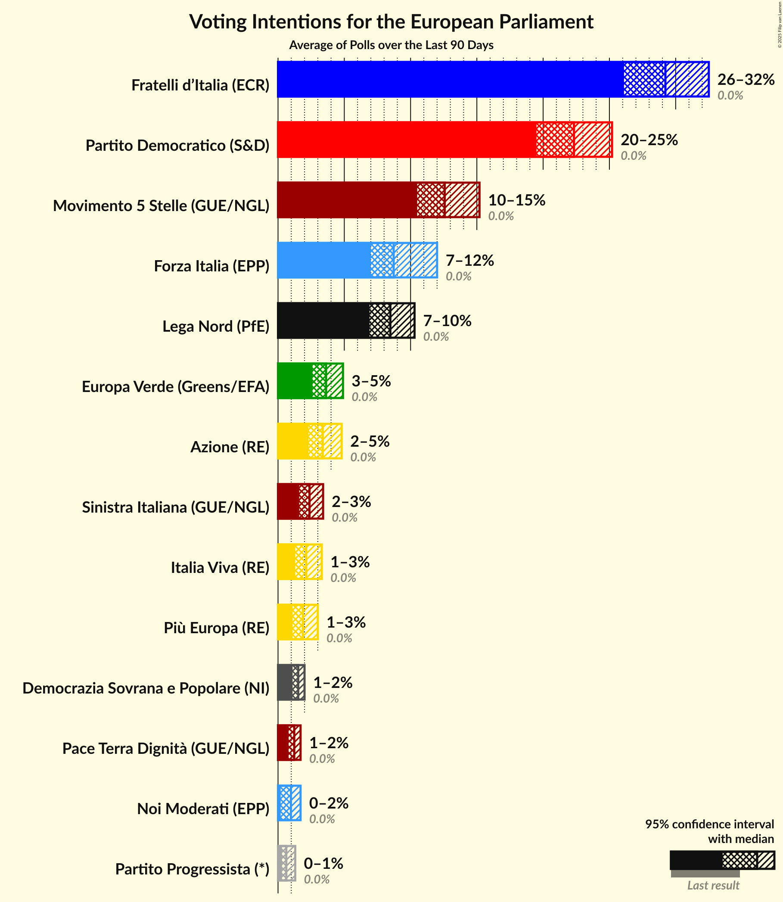
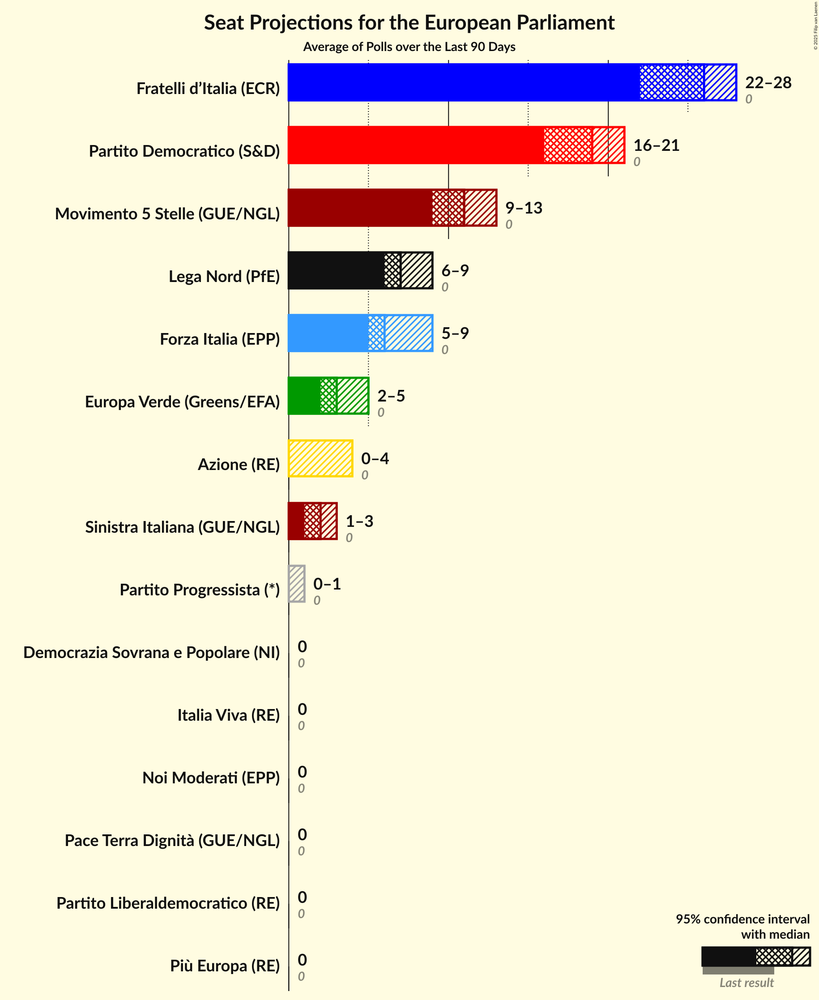
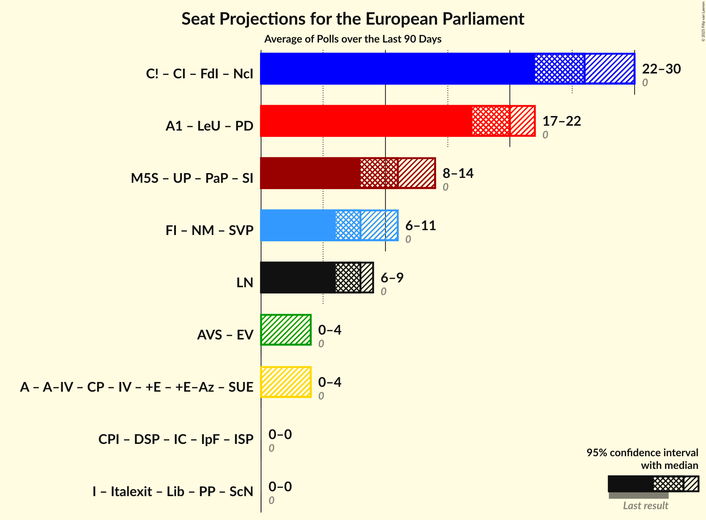

# Overview

The table below lists the most recent polls (less than 30 days old) registered and analyzed so far.

| Period     | Polling firm/Commissioner(s) | PD | M5S | FI | LN | FdI | SVP | CPI | CP | I | NcI | +E | LeU | PaP |
|:----------:|:----------------------------:|:--:|:--:|:--:|:--:|:--:|:--:|:--:|:--:|:--:|:--:|:--:|:--:|:--:|
| 25 May 2014 | General Election | 40.8%   31 | 21.2%   17 | 16.8%   13 | 6.2%   5 | 3.7%   0 | 0.5%   1 | 0.0%   0 | 0.0%   0 | 0.0%   0 | 0.0%   0 | 0.0%   0 | 0.0%   0 | 0.0%   0 |
| N/A | [Poll Average](average.html) | 18–23%   13–18 | 18–25%   15–21 | 8–13%   6–11 | 29–37%   24–30 | 3–6%   0–5 | N/A   N/A | N/A   N/A | N/A   N/A | N/A   N/A | 0–1%   0 | 2–5%   0–4 | 1–4%   0–3 | 1–3%   0 |
| [3 April 2019](2019-04-03-TermometroPolitico.html) | Termometro Politico | 20–23%   16–20 | 20–23%   17–20 | 8–10%   7–9 | 30–33%   25–28 | 4–5%   0–5 | N/A   N/A | N/A   N/A | N/A   N/A | N/A   N/A | N/A   N/A | 3–4%   0 | 3–4%   0–4 | 1%   0 |
| [2 April 2019](2019-04-02-NotoSondaggi.html) | Noto Sondaggi   Rai 3 | 19–24%   14–19 | 18–23%   15–19 | 9–13%   7–10 | 29–35%   23–29 | 4–7%   0–5 | N/A   N/A | N/A   N/A | N/A   N/A | N/A   N/A | 0–1%   0 | 3–5%   0–4 | 1–2%   0 | 1–2%   0 |
| [31 March–1 April 2019](2019-04-01-Tecnè.html) | Tecnè   Quarta Repubblica | 18–23%   12–17 | 19–24%   14–18 | 10–14%   8–11 | 29–35%   22–27 | 3–6%   0–5 | N/A   N/A | N/A   N/A | N/A   N/A | N/A   N/A | N/A   N/A | N/A   N/A | N/A   N/A | N/A   N/A |
| [27 March–1 April 2019](2019-04-01-SWG.html) | SWG   LA7 | 19–23%   15–17 | 20–24%   16–20 | 8–11%   6–9 | 31–35%   24–27 | 4–6%   0–5 | N/A   N/A | N/A   N/A | N/A   N/A | N/A   N/A | N/A   N/A | 2–4%   0–3 | 1–2%   0 | 1–2%   0 |
| [29–30 March 2019](2019-03-30-QuorumandYouTrend.html) | Quorum and YouTrend   Sky TG 24 | 18–23%   14–18 | 20–25%   16–21 | 8–12%   7–10 | 29–35%   24–29 | 4–7%   3–6 | N/A   N/A | N/A   N/A | N/A   N/A | N/A   N/A | N/A   N/A | 2–4%   0 | 2–5%   0–4 | N/A   N/A |
| [26–27 March 2019](2019-03-27-IndexResearch.html) | Index Research   LA7 | 18–24%   14–17 | 18–24%   17–19 | 7–11%   6–8 | 31–38%   25–30 | 3–6%   3–6 | N/A   N/A | N/A   N/A | N/A   N/A | N/A   N/A | N/A   N/A | 2–4%   0–3 | 2–4%   0–4 | 1–3%   0 |
| [26–27 March 2019](2019-03-27-Demopolis.html) | Demopolis | 19–23%   14–17 | 20–24%   16–18 | 8–11%   6–8 | 30–34%   23–26 | 3–5%   0–4 | N/A   N/A | N/A   N/A | N/A   N/A | N/A   N/A | N/A   N/A | N/A   N/A | N/A   N/A | N/A   N/A |
| [26 March 2019](2019-03-26-EMGAcqua.html) | EMG Acqua   Rai 3 | 19–23%   15–18 | 21–25%   17–19 | 8–11%   7–9 | 30–34%   25–27 | 4–6%   0–4 | N/A   N/A | N/A   N/A | N/A   N/A | N/A   N/A | 0–1%   0 | 2–4%   0 | N/A   N/A | 1–2%   0 |
| [22–25 March 2019](2019-03-25-ScenariPolitici–Winpoll.html) | Scenari Politici–Winpoll | 19–23%   16–17 | 18–22%   16–18 | 8–11%   7 | 33–38%   28–29 | 3–5%   4 | N/A   N/A | N/A   N/A | N/A   N/A | N/A   N/A | N/A   N/A | 2–4%   0–4 | 1–2%   0 | 1–2%   0 |
| [21 March 2019](2019-03-21-Piepoli.html) | Piepoli   Rai 1 | 17–24%   13–15 | 20–27%   18–20 | 9–15%   8–12 | 27–35%   23–27 | 3–7%   0–4 | N/A   N/A | N/A   N/A | N/A   N/A | N/A   N/A | 0–2%   0 | 2–5%   0 | 1–4%   0 | N/A   N/A |
| [20–21 March 2019](2019-03-21-Euromedia.html) | Euromedia   Rai 1 | 18–24%   13–18 | 17–23%   14–18 | 9–14%   7–11 | 30–36%   24–30 | 3–6%   0–5 | N/A   N/A | N/A   N/A | N/A   N/A | N/A   N/A | N/A   N/A | 3–5%   0–4 | 1–4%   0 | N/A   N/A |
| [11–13 March 2019](2019-03-13-DemosPi.html) | Demos & Pi   La Repubblica | 17–22%   12–17 | 21–26%   17–21 | 8–12%   6–9 | 32–37%   25–31 | 3–6%   0–4 | N/A   N/A | N/A   N/A | N/A   N/A | N/A   N/A | N/A   N/A | 2–4%   0 | 2–4%   0 | N/A   N/A |
| 25 May 2014 | General Election | 40.8%   31 | 21.2%   17 | 16.8%   13 | 6.2%   5 | 3.7%   0 | 0.5%   1 | 0.0%   0 | 0.0%   0 | 0.0%   0 | 0.0%   0 | 0.0%   0 | 0.0%   0 | 0.0%   0 |

Only polls for which at least the sample size has been published are included in the table above.

**Legend:**
+ **Top half of each row:** Voting intentions (95% confidence interval)
+ **Bottom half of each row:** Seat projections for the European Parliament (95% confidence interval)
+ **PD:** Partito Democratico (S&D)
+ **M5S:** Movimento 5 Stelle (EFDD)
+ **FI:** Forza Italia (EPP)
+ **LN:** Lega Nord (ENF)
+ **FdI:** Fratelli d’Italia (ECR)
+ **SVP:** Südtiroler Volkspartei (EPP)
+ **CPI:** CasaPound Italia (*)
+ **CP:** Civica Popolare (*)
+ **I:** Insieme (*)
+ **NcI:** Noi con l’Italia (EPP)
+ **+E:** Più Europa (ALDE)
+ **LeU:** Liberi e Uguali (S&D)
+ **PaP:** Potere al Popolo (GUE/NGL)
+ **N/A (single party):** Party not included the published results
+ **N/A (entire row):** Calculation for this opinion poll not started yet

