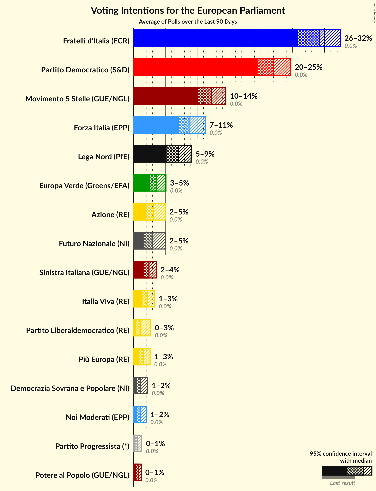
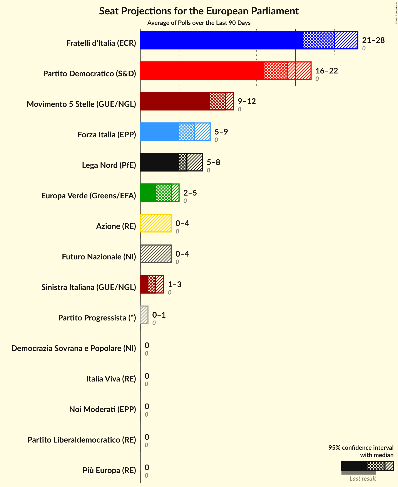
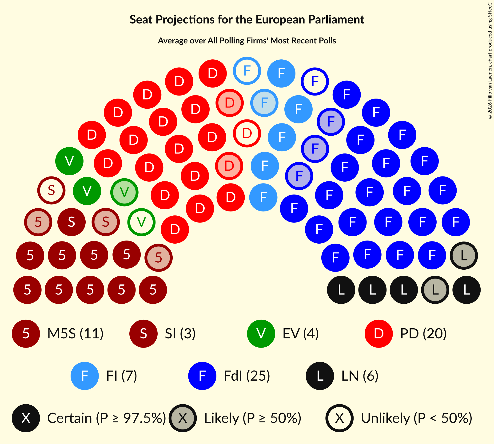
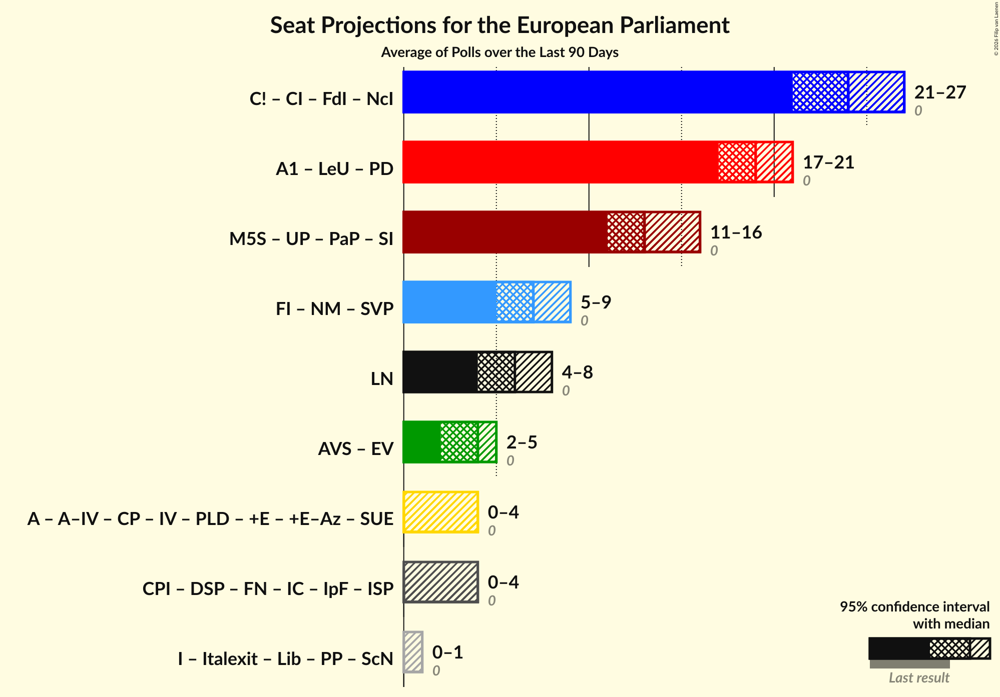

# Overview

The table below lists the most recent polls (less than 90 days old) registered and analyzed so far.

| Period     | Polling firm/Commissioner(s) | M5S | PaP | SI | UP | EV | AVS | PD | LeU | A1 | CP | +E | A | IV | +E–Az | A–IV | PLD | SUE | NM | FI | SVP | FdI | NcI | C! | CI | LN | CPI | DSP | FN | IC | IpF | ISP | I | Italexit | Lib | ORA! | PP | ScN |
|:----------:|:----------------------------:|:--:|:--:|:--:|:--:|:--:|:--:|:--:|:--:|:--:|:--:|:--:|:--:|:--:|:--:|:--:|:--:|:--:|:--:|:--:|:--:|:--:|:--:|:--:|:--:|:--:|:--:|:--:|:--:|:--:|:--:|:--:|:--:|:--:|:--:|:--:|:--:|:--:|
| 9 June 2024 | General Election | 0.0%   0 | 0.0%   0 | 0.0%   0 | 0.0%   0 | 0.0%   0 | 0.0%   0 | 0.0%   0 | 0.0%   0 | 0.0%   0 | 0.0%   0 | 0.0%   0 | 0.0%   0 | 0.0%   0 | 0.0%   0 | 0.0%   0 | 0.0%   0 | 0.0%   0 | 0.0%   0 | 0.0%   0 | 0.0%   0 | 0.0%   0 | 0.0%   0 | 0.0%   0 | 0.0%   0 | 0.0%   0 | 0.0%   0 | 0.0%   0 | 0.0%   0 | 0.0%   0 | 0.0%   0 | 0.0%   0 | 0.0%   0 | 0.0%   0 | 0.0%   0 | 0.0%   0 | 0.0%   0 | 0.0%   0 |
| N/A | [Poll Average](average.html) | 10–16%   9–13 | 0–2%   0 | 2–4%   1–3 | 1–2%   0 | 3–5%   2–5 | N/A   N/A | 19–24%   15–21 | N/A   N/A | N/A   N/A | N/A   N/A | 1–2%   0 | 2–4%   0–4 | 2–4%   0 | N/A   N/A | N/A   N/A | 1–3%   0 | N/A   N/A | 0–2%   0 | 6–10%   4–8 | N/A   N/A | 25–31%   20–27 | N/A   N/A | N/A   N/A | N/A   N/A | 5–9%   4–7 | N/A   N/A | 0–2%   0 | 4–7%   0–6 | N/A   N/A | N/A   N/A | N/A   N/A | N/A   N/A | N/A   N/A | N/A   N/A | 0–2%   0 | 0–1%   0–1 | 1–3%   0 |
| [17–22 June 2026](2026-06-22-SWG.html) | SWG   La7 | 11–15%   10–13 | N/A   N/A | 2–3%   1–3 | N/A   N/A | 3–5%   2–5 | N/A   N/A | 20–24%   16–19 | N/A   N/A | N/A   N/A | N/A   N/A | 1–2%   0 | 3–5%   0–4 | 2–4%   0 | N/A   N/A | N/A   N/A | N/A   N/A | N/A   N/A | 1–2%   0 | 6–9%   4–6 | N/A   N/A | 25–30%   21–25 | N/A   N/A | N/A   N/A | N/A   N/A | 4–7%   4–6 | N/A   N/A | N/A   N/A | 4–7%   4–5 | N/A   N/A | N/A   N/A | N/A   N/A | N/A   N/A | N/A   N/A | N/A   N/A | 1–2%   0 | 0–1%   0–1 | N/A   N/A |
| [18–19 June 2026](2026-06-19-Tecnè.html) | Tecnè   Agenzia Dire | 11–15%   9–13 | N/A   N/A | 2–3%   1–3 | N/A   N/A | 3–5%   2–5 | N/A   N/A | 19–24%   16–20 | N/A   N/A | N/A   N/A | N/A   N/A | 1–2%   0 | 2–4%   0–3 | 2–3%   0 | N/A   N/A | N/A   N/A | N/A   N/A | N/A   N/A | 1–2%   0 | 7–11%   5–8 | N/A   N/A | 27–32%   22–28 | N/A   N/A | N/A   N/A | N/A   N/A | 5–8%   4–7 | N/A   N/A | N/A   N/A | 3–6%   0–5 | N/A   N/A | N/A   N/A | N/A   N/A | N/A   N/A | N/A   N/A | N/A   N/A | N/A   N/A | 0–1%   0–1 | N/A   N/A |
| [18–19 June 2026](2026-06-19-BiDiMedia.html) | BiDiMedia | 10–14%   9–13 | 0–2%   0 | 2–4%   2–3 | N/A   N/A | 3–5%   3–4 | N/A   N/A | 20–25%   17–20 | N/A   N/A | N/A   N/A | N/A   N/A | 1–2%   0 | 2–4%   0 | 1–3%   0 | N/A   N/A | N/A   N/A | 0–2%   0 | N/A   N/A | 1–2%   0 | 6–9%   5–7 | N/A   N/A | 25–30%   23–25 | N/A   N/A | N/A   N/A | N/A   N/A | 5–8%   4–5 | N/A   N/A | 0–1%   0 | 4–7%   4–6 | N/A   N/A | N/A   N/A | N/A   N/A | N/A   N/A | N/A   N/A | N/A   N/A | 0–1%   0 | 0–1%   0–1 | N/A   N/A |
| [17–18 June 2026](2026-06-18-TermometroPolitico.html) | Termometro Politico | 11–14%   10–12 | N/A   N/A | 2–3%   1–3 | N/A   N/A | 3–4%   3–4 | N/A   N/A | 20–23%   18–20 | N/A   N/A | N/A   N/A | N/A   N/A | 1–2%   0 | 2–4%   0 | 2–3%   0 | N/A   N/A | N/A   N/A | N/A   N/A | N/A   N/A | 1%   0 | 7–9%   5–7 | N/A   N/A | 26–30%   23–26 | N/A   N/A | N/A   N/A | N/A   N/A | 6–8%   5–6 | N/A   N/A | 1–2%   0 | 4–6%   4–5 | N/A   N/A | N/A   N/A | N/A   N/A | N/A   N/A | N/A   N/A | N/A   N/A | N/A   N/A | 0–1%   0 | N/A   N/A |
| [16–17 June 2026](2026-06-17-Quorum–YouTrend.html) | Quorum – YouTrend   Sky TG24 | 10–15%   9–12 | N/A   N/A | 2–4%   1–3 | N/A   N/A | 3–5%   3–5 | N/A   N/A | 19–25%   16–21 | N/A   N/A | N/A   N/A | N/A   N/A | 0–2%   0 | 2–5%   0–4 | 1–3%   0 | N/A   N/A | N/A   N/A | 1–2%   0 | N/A   N/A | 0–2%   0 | 7–10%   4–8 | N/A   N/A | 25–31%   21–25 | N/A   N/A | N/A   N/A | N/A   N/A | 4–8%   4–7 | N/A   N/A | N/A   N/A | 5–8%   0–7 | N/A   N/A | N/A   N/A | N/A   N/A | N/A   N/A | N/A   N/A | N/A   N/A | 1–2%   0 | 0–1%   0–1 | N/A   N/A |
| [16–17 June 2026](2026-06-17-Eumetra.html) | Eumetra   La7 | 11–15%   9–13 | N/A   N/A | 2–4%   1–3 | N/A   N/A | 3–5%   2–5 | N/A   N/A | 19–25%   16–20 | N/A   N/A | N/A   N/A | N/A   N/A | 1–2%   0 | 2–5%   0–4 | 1–4%   0 | N/A   N/A | N/A   N/A | N/A   N/A | N/A   N/A | 1–2%   0 | 6–10%   4–7 | N/A   N/A | 25–31%   21–27 | N/A   N/A | N/A   N/A | N/A   N/A | 5–8%   4–7 | N/A   N/A | N/A   N/A | 4–7%   0–6 | N/A   N/A | N/A   N/A | N/A   N/A | N/A   N/A | N/A   N/A | N/A   N/A | N/A   N/A | 0–1%   0–1 | N/A   N/A |
| [3–16 June 2026](2026-06-16-EMG.html) | EMG | 11–15%   10–13 | N/A   N/A | 2–3%   1–3 | N/A   N/A | 3–5%   2–4 | N/A   N/A | 18–23%   15–20 | N/A   N/A | N/A   N/A | N/A   N/A | 1–3%   0 | 2–4%   0–3 | 1–3%   0 | N/A   N/A | N/A   N/A | 1–3%   0 | N/A   N/A | 1–3%   0 | 7–10%   5–7 | N/A   N/A | 24–29%   20–25 | N/A   N/A | N/A   N/A | N/A   N/A | 6–10%   5–8 | N/A   N/A | N/A   N/A | 4–7%   4–6 | N/A   N/A | N/A   N/A | N/A   N/A | N/A   N/A | N/A   N/A | N/A   N/A | N/A   N/A | 0–1%   0–1 | N/A   N/A |
| [9–10 June 2026](2026-06-10-Demopolis.html) | Demopolis   La7 | 12–15%   10–12 | N/A   N/A | 2–3%   2 | N/A   N/A | 3–4%   3–4 | N/A   N/A | 21–24%   18–20 | N/A   N/A | N/A   N/A | N/A   N/A | 1–2%   0 | 2–4%   0 | 2–3%   0 | N/A   N/A | N/A   N/A | N/A   N/A | N/A   N/A | 1–2%   0 | 7–9%   5–6 | N/A   N/A | 27–31%   23–26 | N/A   N/A | N/A   N/A | N/A   N/A | 6–8%   5–7 | N/A   N/A | N/A   N/A | 4–6%   3–4 | N/A   N/A | N/A   N/A | N/A   N/A | N/A   N/A | N/A   N/A | N/A   N/A | N/A   N/A | 0–1%   0 | N/A   N/A |
| [8–9 June 2026](2026-06-09-OnlyNumbers.html) | Only Numbers | 10–14%   8–12 | N/A   N/A | 2–4%   1–3 | N/A   N/A | 3–5%   2–5 | N/A   N/A | 19–25%   16–21 | N/A   N/A | N/A   N/A | N/A   N/A | 1–2%   0 | 2–4%   0–4 | 2–4%   0–4 | N/A   N/A | N/A   N/A | N/A   N/A | N/A   N/A | 1–2%   0 | 7–10%   4–8 | N/A   N/A | 25–31%   20–27 | N/A   N/A | N/A   N/A | N/A   N/A | 5–9%   5–8 | N/A   N/A | N/A   N/A | 3–6%   0–5 | N/A   N/A | N/A   N/A | N/A   N/A | N/A   N/A | N/A   N/A | N/A   N/A | N/A   N/A | 0–1%   0–1 | N/A   N/A |
| [3–4 June 2026](2026-06-04-Piepoli.html) | Piepoli | 10–16%   9–13 | N/A   N/A | 2–4%   1–4 | N/A   N/A | 2–6%   2–5 | N/A   N/A | 18–25%   15–21 | N/A   N/A | N/A   N/A | N/A   N/A | 1–3%   0 | 2–4%   0–4 | 2–5%   0–4 | N/A   N/A | N/A   N/A | 1–3%   0 | N/A   N/A | 1–3%   0 | 6–11%   4–9 | N/A   N/A | 25–33%   21–28 | N/A   N/A | N/A   N/A | N/A   N/A | 4–8%   4–7 | N/A   N/A | N/A   N/A | 3–7%   0–5 | N/A   N/A | N/A   N/A | N/A   N/A | N/A   N/A | N/A   N/A | N/A   N/A | N/A   N/A | 0–2%   0–2 | 1–3%   0 |
| [22–31 May 2026](2026-05-31-Winpoll.html) | Winpoll | 10–13%   8–11 | N/A   N/A | 2–4%   2–3 | 1–2%   0 | 3–5%   3–5 | N/A   N/A | 20–25%   17–20 | N/A   N/A | N/A   N/A | N/A   N/A | 1–2%   0 | 2–3%   0 | 2–4%   0–4 | N/A   N/A | N/A   N/A | N/A   N/A | N/A   N/A | N/A   N/A | 7–9%   5–7 | N/A   N/A | 25–30%   20–25 | N/A   N/A | N/A   N/A | N/A   N/A | 6–8%   4–7 | N/A   N/A | N/A   N/A | 3–5%   0–4 | N/A   N/A | N/A   N/A | N/A   N/A | N/A   N/A | N/A   N/A | N/A   N/A | N/A   N/A | 0–1%   0–1 | N/A   N/A |
| [25–28 May 2026](2026-05-28-Ipsos.html) | Ipsos   Corriere della Sera | 12–17%   10–14 | N/A   N/A | 2–4%   1–3 | N/A   N/A | 3–5%   2–5 | N/A   N/A | 18–23%   14–19 | N/A   N/A | N/A   N/A | N/A   N/A | 1–2%   0 | 2–4%   0–3 | 1–3%   0 | N/A   N/A | N/A   N/A | N/A   N/A | N/A   N/A | 0–2%   0 | 7–10%   5–7 | N/A   N/A | 25–30%   20–25 | N/A   N/A | N/A   N/A | N/A   N/A | 4–7%   4–6 | N/A   N/A | N/A   N/A | 4–6%   0–5 | N/A   N/A | N/A   N/A | N/A   N/A | N/A   N/A | N/A   N/A | N/A   N/A | N/A   N/A | 0–1%   0–1 | N/A   N/A |
| [18–25 May 2026](2026-05-25-SigmaConsulting.html) | Sigma Consulting | 12–17%   10–14 | N/A   N/A | 1–4%   1–3 | N/A   N/A | 2–5%   2–5 | N/A   N/A | 19–25%   16–22 | N/A   N/A | N/A   N/A | N/A   N/A | 1–3%   0 | 2–4%   0 | 2–4%   0–4 | N/A   N/A | N/A   N/A | N/A   N/A | N/A   N/A | 1–2%   0 | 6–10%   4–7 | N/A   N/A | 24–30%   21–25 | N/A   N/A | N/A   N/A | N/A   N/A | 6–9%   5–7 | N/A   N/A | N/A   N/A | 3–6%   0–5 | N/A   N/A | N/A   N/A | N/A   N/A | N/A   N/A | N/A   N/A | N/A   N/A | N/A   N/A | 0–1%   0–1 | N/A   N/A |
| 9 June 2024 | General Election | 0.0%   0 | 0.0%   0 | 0.0%   0 | 0.0%   0 | 0.0%   0 | 0.0%   0 | 0.0%   0 | 0.0%   0 | 0.0%   0 | 0.0%   0 | 0.0%   0 | 0.0%   0 | 0.0%   0 | 0.0%   0 | 0.0%   0 | 0.0%   0 | 0.0%   0 | 0.0%   0 | 0.0%   0 | 0.0%   0 | 0.0%   0 | 0.0%   0 | 0.0%   0 | 0.0%   0 | 0.0%   0 | 0.0%   0 | 0.0%   0 | 0.0%   0 | 0.0%   0 | 0.0%   0 | 0.0%   0 | 0.0%   0 | 0.0%   0 | 0.0%   0 | 0.0%   0 | 0.0%   0 | 0.0%   0 |

Only polls for which at least the sample size has been published are included in the table above.

**Legend:**
+ **Top half of each row:** Voting intentions (95% confidence interval)
+ **Bottom half of each row:** Seat projections for the European Parliament (95% confidence interval)
+ **M5S:** Movimento 5 Stelle (GUE/NGL)
+ **PaP:** Potere al Popolo (GUE/NGL)
+ **SI:** Sinistra Italiana (GUE/NGL)
+ **UP:** Pace Terra Dignità (GUE/NGL)
+ **EV:** Europa Verde (Greens/EFA)
+ **AVS:** Alleanza Verdi e Sinistra (Greens/EFA)
+ **PD:** Partito Democratico (S&D)
+ **LeU:** Liberi e Uguali (S&D)
+ **A1:** Articolo Uno (S&D)
+ **CP:** Civica Popolare (RE)
+ **+E:** Più Europa (RE)
+ **A:** Azione (RE)
+ **IV:** Italia Viva (RE)
+ **+E–Az:** Più Europa–Azione (RE)
+ **A–IV:** Azione–Italia Viva (RE)
+ **PLD:** Partito Liberaldemocratico (RE)
+ **SUE:** Stati Uniti d’Europa (RE)
+ **NM:** Noi Moderati (EPP)
+ **FI:** Forza Italia (EPP)
+ **SVP:** Südtiroler Volkspartei (EPP)
+ **FdI:** Fratelli d’Italia (ECR)
+ **NcI:** Noi con l’Italia (ECR)
+ **C!:** Cambiamo! (ECR)
+ **CI:** Coraggio Italia (ECR)
+ **LN:** Lega Nord (PfE)
+ **CPI:** CasaPound Italia (NI)
+ **DSP:** Democrazia Sovrana e Popolare (NI)
+ **FN:** Futuro Nazionale (NI)
+ **IC:** Impegno Civico (NI)
+ **IpF:** Insieme per il Futuro (NI)
+ **ISP:** Italia Sovrana e Popolare (NI)
+ **I:** Insieme (*)
+ **Italexit:** Italexit–Per l’Italia con Paragone (*)
+ **Lib:** Libertà (*)
+ **ORA!:** Ora! (*)
+ **PP:** Partito Progressista (*)
+ **ScN:** Sud chiama Nord (*)
+ **N/A (single party):** Party not included the published results
+ **N/A (entire row):** Calculation for this opinion poll not started yet

